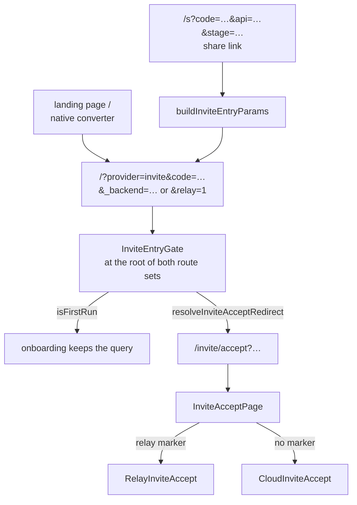

# invite — issuing a 1:1 invitation, and accepting one

**`apps/web/src/app/features/invite` owns both ends of a relay 1:1 invitation.** One person types a
name and a phone number, the app issues a relay invite and hands the deeplink to the SMS composer;
the other person opens that link, proves the number is theirs, and lands in a DM room that did not
exist a moment earlier.

The two ends share almost nothing but the code shape, so each has its own document. This one is the
map: what the folder holds, how a link finds its way in, and where the neighbouring features take
over.

## Scope

**In**

- Issuing a relay invite (`invite.create`), handing the deeplink to SMS, and the waiting screen that
  watches for an acceptance.
- Retiring an invite: cancel, reject, reissue, and the local dismiss that hides a row the server
  will never clear.
- The `/invite/accept` route, which is the single destination for **every** invite link — relay and
  cloud alike.
- The relay acceptance orchestration: re-read, phone verification, place profile, accept, and the
  three-tier hunt for the room the accept creates.

**Out**

- **Group-room "add a friend"**, which uses a different packet (`user.invite`) and is bound to a
  channel — [channels](../channels/README.md).
- **The cloud invitation lane.** `/invite/accept` routes it, but the REST accept pipeline behind
  `CloudInviteAccept` — login with the code, then enter cloud, site and channel — is documented
  with the rest of session entry in [auth](../auth/README.md).
- **Phone verification and country-aware number input.** The issue form and the accept flow both
  mount screens they do not own — [auth](../auth/README.md).
- **The 1:1 room itself**, including the "they left" footer that starts a re-invite —
  [channels](../channels/README.md).
- **The home list row** an in-flight invite renders as — [home](../home/README.md).
- **Where an invite row is stored and how it is read** — `invite.list` is cache-first, and the cache
  contract, including the `dismissedAt` field this feature writes, belongs to
  [`@chatic/data`](../../../../../libs/data/docs/repositories/README.md).

## Design rules

1. **An invite code is a credential.** It never reaches a log line, a query key, `localStorage`, or a
   route parameter. Routes are keyed by `invite.id`; the full `invt:<id>:<code>` is composed in the
   scope of the call that needs it (`composeInviteCode`) and discarded.
2. **Branch on the server's `state` and error code, never on message text.** The state union is five
   values — `pending`, `accepted`, `canceled`, `rejected`, `expired` — and a status comes from
   `getSocketErrorCode`. Substring matching on an error message is how a copy change becomes a
   routing bug.
3. **The same status means different things at different stages.** `resolveNotice(status, stage)`
   takes the stage for exactly this reason: a `400` reading an invite is a malformed code, a `400`
   accepting one is an expiry; a `409` accepting is "someone got there first", a `409` rejecting is
   "you already accepted it elsewhere".
4. **Final actions are idempotent, so the call succeeding is the verdict** — not the `state` that
   comes back. Cancel racing a reject returns `rejected`, and the old link is dead either way.
5. **Render the server's clock, never a hardcoded lifetime.** The countdown reads `expiredAt`. The
   app asks for `expiresDays: 1` when it creates an invite, but that number appears in no copy: if
   the server answers with something else, the screen follows the server.
6. **Gates render instead of the form, never on top of it.** An unmet precondition never leaves a
   submittable form underneath a dialog, not even for a frame.

## Structure

```text
apps/web/src/app/features/invite/          43 sources, 26 tests
├── pages/            3    ContactInvitePage, InviteWaitingPage — the sender's two screens
├── components/       4    ReinviteDialog, InviteChannelRow, InviterVerifyPrompt
├── hooks/            8    the sender lane: retire, poll, list rows, dismiss, migration
├── utils/            5    inviteCode, inviteStatus, inviteMessageCopy, sendInviteMessage,
│                          buildInviteEntryParams
└── accept/                the recipient lane — its own sub-tree
    ├── InviteAcceptPage.tsx   the /invite/accept route; branches relay vs cloud and nothing else
    ├── types.ts               deeplink parsing and the two predicates that classify a link
    ├── components/  10        RelayInviteAccept, CloudInviteAccept, and the shared accept screen
    ├── hooks/        7        useRelayInviteFlow (the state machine), the three cloud entry steps
    └── lib/          2        inviteEntryRedirect
```

`types.ts` is the file whose name hides its importance: `parseInviteDeeplink`, `isInviteEntry` and
`isRelayInvite` live there, and those three decide whether a query string is an invitation at all
and which lane it belongs to. There is no `flags.ts` — the feature-flag file that once gated the
unbuilt halves of this flow is gone, along with every branch it protected.

### Every link ends at one route



`/?provider=invite&…` will keep arriving forever — it is the address baked into every installed app
build, and no store release changes that. `InviteEntryGate` catches it at the root of both the
signed-in and signed-out route sets and redirects **before home renders**, so someone arriving on an
invitation never pays for the place list, channel list, unread aggregation and membership lookup
they are about to navigate away from.

The rule the diagram cannot draw: **the absence of a backend address is itself the relay signal.**
A relay link carries no address because the relay server needs none, so `buildInviteEntryParams`
detects that and always emits an explicit `relay=1`. Everything downstream gates on the marker and
never has to infer relay from a missing `_backend`.

`/invite/accept` is registered in `commonRoutes`, so it renders in both auth states and sits outside
`UnifiedLayout`. Both halves matter. An invite deeplink routinely lands before the background guest
login finishes, and a private path would fall to the `*` catch-all and take the query string with
it. No shell means no home data hooks and no bottom nav — but it also means the page mounts
`useBackHandler` itself, since that normally arrives with the layout.

### Routes

| Page                | Path (`ROUTES.invite.*`)    | Notes                                                      |
| ------------------- | --------------------------- | ---------------------------------------------------------- |
| `ContactInvitePage` | `/invite/contact`           | The issue form; route state also puts it in re-invite mode |
| `InviteWaitingPage` | `/invite/:inviteId/waiting` | Countdown, polling, cancel, reissue                        |
| `InviteAcceptPage`  | `/invite/accept`            | The recipient's entry. Common route, no shell              |

## The two lanes

| Document                                           | What it covers                                                                                                         |
| -------------------------------------------------- | ---------------------------------------------------------------------------------------------------------------------- |
| [relay-invite-sender.md](./relay-invite-sender.md) | The issue form and its three gates, SMS hand-off, re-invite detection, the retire rules, the waiting screen, list rows |
| [relay-invite-accept.md](./relay-invite-accept.md) | The accept state machine, the notice mapping, the profile precondition, decline, and the three-tier room hunt          |

## Where the backend still has gaps

Both lanes are shaped around the same two absences, so they are stated once here:

- **No notification reaches the inviter** when an invite is accepted, rejected or canceled. The
  sender learns by re-asking `invite.list` — a background cadence on home, thirty seconds on the
  waiting screen. That is why the sender lane polls at all.
- **`invite.accept` may answer without a `channelId`.** The room is created asynchronously, and when
  the field is filled is a backend question. Both lanes therefore degrade instead of assuming: the
  recipient's three-tier resolver and the sender's `useAcceptedChannelSync` both end in "the room is
  on its way, check home" rather than an error.

A third limit is structural rather than missing work: `invite.list` is asked with `limit: 100` and
`InviteListInput` has no cursor, so there is no real paging. An invite outside that window is
invisible to re-invite detection, the list rows, the waiting screen and the reconcile pass alike.

## How to verify

```bash
npx tsc -b apps/web/tsconfig.json
npx jest --config apps/web/jest.config.js --testPathPatterns "features/invite|useRelayInvites|useSentInviteLog|useAwaitInviteChannel"
```

Both lanes reach into `libs/data` for the invite repository and its cache, so a change to the row
shape wants `npx jest --config libs/data/jest.config.js --testPathPatterns "Invite"` as well.

What no suite covers: the SMS composer hand-off and the deeplink round trip, both of which need the
native shell. Confirm those on a device with two accounts — issue, receive the SMS, open the link,
verify, accept, and check that both sides land in the same room.
