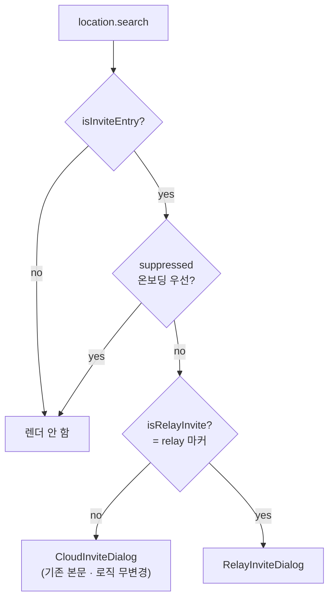
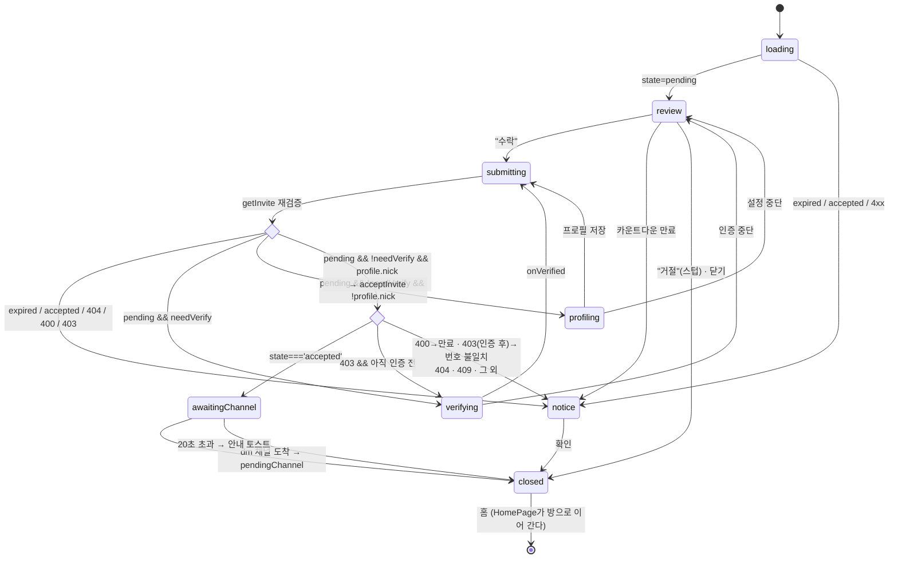
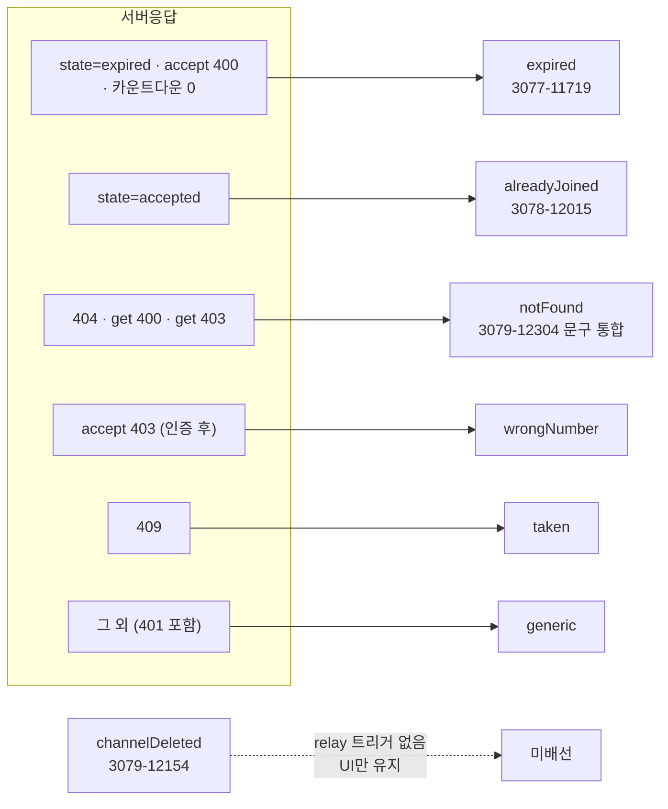
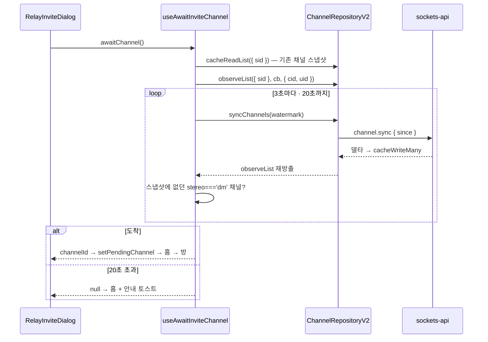

# 중계 1:1 초대 수락 (Relay Invite Accept) — 수신자 흐름

> 상태: Live · 최종 갱신: 2026-07-29 · 관련 ADR: [0033](../../../../../docs/adr/0033-relay-dm-invite-and-auth-parallel-tracks.md), [0016](../../../../../docs/adr/0016-invite-accept-popup-web-ui-kit.md), [0020](../../../../../docs/adr/0020-place-profile-edit-dialog.md)
>
> 로드맵 Track C: [relay-dm-invite-parallel-roadmap.md](../../../../../docs/plans/relay-dm-invite-parallel-roadmap.md) · 백엔드 계약: `chatic-sockets-api/docs/specs/relay-server-invite/05-client-guide.md` §시나리오 B·C

## 목적

휴대폰 번호로 발급된 **중계(relay) 1:1 초대 딥링크**를 받은 사람이, 앱을 열고 → 번호를 인증하고 →
플레이스 프로필을 만들고 → 초대를 수락해 → 새로 생긴 DM 방에 입장하기까지의 흐름을 담당한다.

기존 클라우드 초대([invite-accept](../home/invite-accept.md), ADR-0016)와 **딥링크 진입점을
공유**하지만 백엔드 계약이 완전히 다르다 — 클라우드 초대는 REST 초대 파이프라인
(login→cloud→site→channel)이고, relay 초대는 웹소켓 패킷 3종(`invite.get` /
`auth.verify-hash-alias` / `invite.accept`)에 **방 생성이 비동기**다. 그래서 이 화면은 "같은 팝업의
두 번째 분기"가 아니라 **별도 오케스트레이터**다.

## 설계 원칙

- **클라우드 초대에 회귀를 내지 않는다.** `InviteDialog`는 딥링크 마커(`isRelayInvite`)만 보고
  분기하는 얇은 라우터고, 기존 본문은 파일만 옮긴 무변경 코드다. 기존 `InviteDialog.test.tsx`가
  **수정 없이** 통과하는 것이 회귀 없음의 판정 기준이다.
- **분기는 서버 `state` / `errorCode`로만 한다.** 에러 메시지 문자열 파싱 금지
  (`getSocketErrorCode`). 클라우드 쪽 `resolveInviteErrorKey`(substring 매칭)를 재사용하지 않는
  이유다.
- **스텝 전환마다 초대를 재검증한다.** 인증·프로필 입력에 수 분이 걸리고 그사이 초대가 만료·선점될
  수 있다(05-client-guide §B-2). 모든 전환이 `advance()` 하나를 지나고, 그 첫 동작이
  `getInvite(code)`다 — 호출부가 잊을 수 없는 구조로 만든다.
- **초대 코드는 자격증명이다.** 로그·쿼리키·localStorage·라우트 파라미터 어디에도 남기지 않는다.
  로컬 기록이 필요한 곳(거절 스텁)은 `invite.id`로 남긴다.
- **백엔드가 없는 액션은 인터페이스만 선반영한다**(ADR-0033 D1). 디자인의 버튼은 그대로 만들되
  동작은 로컬로 끝내고, 노출은 [flags.ts](../../../src/app/features/home/flags.ts) 한 줄로 끈다.
- **뷰는 재사용, 오케스트레이션만 새로 쓴다.** 수락 화면·상태 다이얼로그·프로필 폼·채널 입장
  핸드오프는 전부 기존 자산이다. 새 라우트를 만들지 않아 `paths.ts`·`HomePage.tsx`를 건드리지
  않는다.
- **Track A 의존은 목 한 파일로 격리한다.** `PhoneVerifyScreen`·`applySessionToken`은 로드맵
  "인터페이스 계약"의 시그니처 그대로 목이며, 교체 지점이 파일 하나다.

## 범위

**포함**

- `InviteDialog` 라우터화 + relay 분기(`isRelayInvite`).
- relay 수락 팝업: `inviter$` 기반 헤딩·아바타, `expiredAt` 카운트다운, 거절/수락.
- 상태 다이얼로그 매핑: 만료 / 이미 참여 / 유효하지 않음(=취소 통합) / 번호 불일치 / 선점 / generic.
- 스텝 오케스트레이션 상태 머신(ADR-0033 D10): get → verify → profile → accept → channel-wait → enter.
- 채널 sync 대기 유틸(`useAwaitInviteChannel`) — **Track B와 공유**(로드맵 Track B-4).
- 거절 버튼 스텁(닫기 + 로컬 기록) + `flags.ts` 게이팅.
- Track A 계약 목(`trackAMock.tsx`) 1파일.

**제외**

- `PhoneVerifyScreen`·`applySessionToken` 실구현 — **Track A**. 여기서는 목만.
- 초대 발급·대기 화면·재초대·리스트 통합 — **Track B**. 소셜 연동 — **Track D**.
- `paths.ts` / `HomePage.tsx` / `SocketManager.ts` 변경 — 타 트랙 소유. 손대지 않았다.
- 초대 취소/거절 백엔드 연동(요청 1·2번) — 스텁.
- `channelDeleted` 다이얼로그 배선 — relay 백엔드에 대응 시그널이 없다(UI만 유지, ADR-0016과 동일).

## 시나리오

### 1. 신규 기기 풀 시나리오 (B-1 → B-2 → B-3)

1. 사용자가 SMS의 딥링크를 연다. 홈이 뜨고 `InviteDialog`가 `?provider=invite&code=…&_backend=…&relay`를
   읽어 **relay 분기**를 고른다.
2. `getInvite(code)` → `state='pending'`, `needVerify=true`. 수락 화면이 뜬다 —
   "**Sunny**님이 DoU에 당신을 초대했어요", 초대자 아바타, "You / 1:1 대화" 카드, 초대 링크
   유효기간 카운트다운(`expiredAt`).
3. `수락` → **재검증** → 여전히 `pending` + `needVerify` → `PhoneVerifyScreen`
   (`context='invite-accept'`, `inviteCode=code`)이 같은 풀스크린 서피스에 뜬다. 인증이 끝나면
   (`onVerified`) 세션은 이미 메인유저로 전환된 상태다(Track A 책임).
4. **재검증** → `pending` → relay 플레이스 프로필(`useMyProfile().profile?.nick`)이 비어 있으면
   프로필 설정 오버레이(이름 필수 1~20자, 사진 선택).
5. **재검증** → `pending` → `acceptInvite(code)`. 응답 `state==='accepted'`면 성공
   (성공 플래그는 따로 없다).
6. 응답에 `channelId`가 **없다** — 방은 비동기 생성된다. "채팅방을 만들고 있어요" 오버레이를 띄운
   채 `useAwaitInviteChannel`이 `channel.syncChannels` 델타를 3초 주기로 당기며
   `channel.observeList({ sid })`로 새 `stereo==='dm'` 채널이 도착하기를 기다린다.
7. 도착하면 `usePendingInviteChannel.setPendingChannel(id)` → 홈으로 이동 → HomePage의 기존 효과가
   방으로 `replace` 이동한다([HomePage.tsx:184-196](../../../src/app/features/home/pages/HomePage.tsx),
   **무변경 재사용**).

### 2. 이미 메인유저인 기기 (needVerify=false)

2번까지 동일. `수락` → 재검증 → `needVerify` 거짓 → 인증 스텝을 건너뛰고 프로필 판정으로 간다.
프로필도 있으면 곧장 `acceptInvite`.

### 3. 기기 교체 (시나리오 C)

앱이 따로 할 일이 없다 — 1번과 완전히 같고, 인증 단계에서 서버가 기존 유저를 찾아 준다. 프로필
판정에서 기존 `profile.nick`이 이미 있으므로 프로필 스텝은 자동으로 건너뛰어진다.

### 4. 만료된 초대

- 진입 시 `state==='expired'` → 만료 `AlertDialog`("초대 링크가 만료되었어요"). `확인` → 홈.
- **인증 도중 만료** — 인증을 마치고 재검증할 때 `expired`가 오면 수락하지 않고 같은
  다이얼로그로 떨어진다. 이것이 스텝 전환마다 재검증하는 이유다.
- **화면을 열어 둔 채 만료** — 카운트다운이 0에 닿으면 수락 화면에서 바로 만료 다이얼로그로 간다.
- 수락 시점 만료는 `400`으로도 온다 → 같은 만료 다이얼로그.

### 5. 이미 참여한 초대 / 선점

- 진입 시 `state==='accepted'` → "이미 참여한 초대입니다."(Figma 3078-12015). 같은 코드 재수락은
  서버가 멱등 처리하므로 이 화면은 **내가 이미 수락한 링크를 다시 연 경우**다.
- 수락 시 `409` → "이미 사용된 초대입니다." — 다른 사람이 먼저 수락했다.

### 6. 취소된 / 유효하지 않은 초대

`404`, 또는 조회 단계의 `400`(코드 형식)·`403`(코드 불일치) → "유효하지 않은 초대입니다."
**취소 API가 없어 취소와 구분할 수 없으므로 문구를 통합한다**(Figma 3079-12304의 취소 화면이 이
문구로 대체된다). 백엔드 요청 1번이 들어오면 `canceled` 분기를 여기에 꽂는다.

### 7. 초대받은 번호가 아님

수락이 `403`으로 막히면 보통은 "아직 디바이스 유저"라는 뜻이므로 인증 스텝으로 보낸다. 다만 이미 이
흐름에서 인증에 성공한 뒤라면 다른 번호를 인증한 것이므로 "초대받은 번호가 아닙니다."로 끝낸다.
발송 단계에서 걸리는 케이스(`400`)는 `PhoneVerifyScreen`(Track A)이 처리한다.

### 8. 거절 (스텁)

`거절` → 서버 호출 없이 닫고 홈으로. 거절 사실은 `invite.id`로 localStorage에 남는다.
**백엔드 거절 API가 없다(요청 2번)** — 초대자 쪽에는 아무 신호도 가지 않는다. 버튼 노출은
`RELAY_INVITE_DECLINE_ENABLED` 한 줄로 끈다.

### 9. 채널이 안 오는 경우 (타임아웃 폴백)

수락은 성공했는데 `CHANNEL_WAIT_TIMEOUT_MS`(20초) 안에 방이 안 보이면 오버레이를 접고 홈으로
이동하며 안내 토스트를 띄운다("채팅방을 준비하고 있어요. 잠시 후 목록에 나타납니다."). 수락은 이미
서버에 남았으므로 데이터 손실이 없고, 60초 백그라운드 sync가 결국 방을 데려온다.

### 10. 온보딩 중 진입

기존과 동일 — `suppressed`(first-run)면 팝업 자체가 억제되고, 온보딩을 마친 뒤 URL에 초대 쿼리가
남아 있으면 그때 뜬다. 라우터 단에서 처리되므로 relay/클라우드 공통이다.

## 다이어그램

### 진입 분기 (회귀 방지 지점)



### 스텝 오케스트레이션 상태 머신 (ADR-0033 D10)

`useRelayInviteFlow`의 `phase`. `submitting`은 **재검증(`getInvite`) + 필요 시 `acceptInvite`**를
묶은 상태이고, 아래 분기점이 그 결과다.



### 상태 · 에러 → 화면 매핑



### 채널 sync 대기



## 상세 구현

### 진입 라우터

[`components/InviteDialog.tsx`](../../../src/app/features/home/components/InviteDialog.tsx) —
`useLocation` + `parseInviteDeeplink` + 세 조건만 남은 순수 라우터다. **데이터 훅을 하나도 부르지
않는다**: 기존 구조(훅 전부 호출 후 early return)를 유지한 채 relay 분기만 얹으면 relay 딥링크에서도
클라우드 `useInviteInfo(code, backend)`가 발사돼 존재하지 않는 클라우드 초대를 조회한다.
`HomePage.tsx:340`의 `<InviteDialog suppressed={isFirstRun} />`는 그대로다.

- [`invite/CloudInviteDialog.tsx`](../../../src/app/features/home/components/invite/CloudInviteDialog.tsx)
  — 기존 `InviteDialog` 본문을 그대로 옮긴 것(`resolveDialogVariant` 포함). URL 판정만 라우터로
  올라가 `params`를 prop으로 받는다.
- [`invite/RelayInviteDialog.tsx`](../../../src/app/features/home/components/invite/RelayInviteDialog.tsx)
  — relay 오케스트레이터. 판단은 전부 훅에 있고 여기 남은 것은 `phase` 스위치뿐이다. 수락 화면과
  인증 스텝이 같은 풀스크린 서피스를 쓰므로 둘 사이에 홈이 번쩍이지 않는다.

### 상태 머신 — [`hooks/useRelayInviteFlow.ts`](../../../src/app/features/home/hooks/useRelayInviteFlow.ts)

```ts
useRelayInviteFlow(code: string): {
    phase: 'loading' | 'review' | 'submitting' | 'verifying' | 'profiling' | 'awaitingChannel' | 'notice' | 'closed';
    invite: RelayInviteInfo | null;      // MyInviteView & { needVerify?, expiredAt?, inviter$.image? }
    notice: 'expired' | 'alreadyJoined' | 'notFound' | 'wrongNumber' | 'taken' | 'generic' | null;
    countdown: InviteCountdown | null;
    accept(); decline(); close();
    onVerified(); onProfileSaved(); cancelStep(); dismissNotice();
}
```

핵심은 `advance()` 하나다 — 재검증하고 그 결과로 다음 `phase`를 정한다. `accept`, `onVerified`,
`onProfileSaved`가 전부 이걸 부르므로 재검증이 구조적으로 보장된다.

- Track 0 훅 사용: `useRelayInviteMutations().getInvite / acceptInvite`
  ([useRelayInvites.ts](../../../src/app/hooks/useRelayInvites.ts)).
- 에러 분기는 전부 `getSocketErrorCode(error)`
  ([utils/errors.ts](../../../src/app/utils/errors.ts)) → `resolveNotice(status, stage)`. 같은
  status가 조회/수락에서 다른 뜻이라 `stage`를 함께 본다.
- 수락 `403`은 `verifiedRef`로 갈린다 — 인증 전이면 "아직 디바이스 유저"라서 인증 스텝으로, 인증
  후면 번호 불일치라서 종료. 서버는 `needVerify`와 무관하게 다시 판정하므로 이 경로가 필요하다.
- 프로필 판정: `useMyProfile().profile?.nick`. relay 플레이스에서도 `selectedSiteId`가 relay
  core에서 나오므로 그대로 동작한다(ADR-0020 결정 3). 값이 아직 안 왔으면 프로필 스텝을 한 번 더
  태우는데, 저장이 멱등이라 안전하다.
- `expiredAt`은 발행된 `MyInviteView`에 선언돼 있지 않다(런타임에는 온다) — 기존
  `InviteInfo`([types/invite.ts](../../../src/app/features/home/types/invite.ts))의 확장 지점을
  재사용한다.
- 세대 카운터(`runIdRef`) + `aliveRef`로, 흐름이 앞서 나간 뒤 늦게 도착한 응답은 아무것도 쓰지
  않는다. 최신값(프로필 nick·게이트웨이·네비게이션)은 `latest` ref로 읽어 콜백 identity를 고정한다.

### 채널 sync 대기 — [`hooks/useAwaitInviteChannel.ts`](../../../src/app/hooks/useAwaitInviteChannel.ts)

앱 레벨 훅 디렉터리에 둔다 — **Track B의 초대 대기 화면도 같은 유틸을 쓴다**(로드맵 Track B-4).

`SocketManager.waitUntilVerified`([SocketManager.ts:217](../../../../../libs/app-runtime/src/socket/SocketManager.ts))
의 모양을 따른다: 구독과 타이머를 경주시키고, **절대 reject하지 않는다**(타임아웃은 `null`).

```ts
useAwaitInviteChannel(): {
    awaitChannel(opts?: { knownChannelIds?: Iterable<string>; timeoutMs?: number; pollMs?: number }): Promise<string | null>;
}
```

- 기준선: `cacheReadList({ sid })`로 기존 채널 id를 잡는다. 호출부가 더 이른 시점에 스냅샷을 떴다면
  `knownChannelIds`로 넘긴다(Track B 용).
- 검출: `observeList({ sid }, cb, { cid, uid })` — `useHomeChannels`와 **같은 스코프 핀닝**. 새로
  나타난 `stereo==='dm'` + `sid` 일치 채널이 답이다.
- 발견 강제: `syncChannels`를 3초마다 당긴다. 소켓 푸시(`ChannelSyncPlan`)는 **이미 등록된 채널
  id에만** 오므로 새 방을 데려오지 못하고, 백그라운드 폴은 60초라 너무 느리다. 워터마크는
  `useBackgroundSync`와 같은 규약(`channel-sync:${cid}` · `syncMeta.getSyncedAt` → `setSyncedAt`)을
  지켜 델타를 잃지 않는다([useBackgroundSync.ts:73-82](../../../src/app/runtime/useBackgroundSync.ts)).
- 입장: `usePendingInviteChannel.setPendingChannel(id)` 후 홈으로 `replace`. **HomePage 무변경.**

### 수락 화면 (Figma 3077-11587)

`InviteAcceptScreen`을 공유하고, optional prop 넷을 넓혔다 — **기본값이 현행이라 클라우드 쪽은
동작이 같다**:

| prop          | relay가 넘기는 값 | 기본값(=클라우드) |
| ------------- | ----------------- | ----------------- |
| `targetKind`  | `'oneToOne'`      | `'group'`         |
| `onDecline`   | `flow.decline`    | `onClose`         |
| `showDecline` | 플래그            | `true`            |
| `overlay`     | 채널 대기 스피너  | 없음              |

- 플레이스 카드는 **이름도 썸네일도 없으면 접힌다.** relay 1:1 초대는 플레이스로 들어가는 게 아니라
  빈 카드 껍데기만 남기 때문이다. 클라우드는 항상 `site$.name`이 있어 영향이 없다.
- `InviteTargetCard`에 `kind?: 'group' | 'oneToOne'`을 추가해 이미 있던 미사용 키
  `inviteAccept.target.oneToOne`("1:1 대화")를 쓴다.
- **표시명 `***<뒷4자리>`** — 번호로 만들어진 유저의 서버 표시명이다(백엔드가 고치지 않기로 한
  항목). `ProfileAvatar`는 이니셜이 아니라 글리프를 그리므로 아바타는 영향이 없고, 이름은 서버 값을
  그대로 보여준다. 헤딩 폴백은 `inviter$.name`이 **비어 있을 때만** 걸리므로 마스킹된 이름이 "이름
  없음"으로 오해되지 않는다.

### 프로필 스텝

[`invite/RelayInviteProfileDialog.tsx`](../../../src/app/features/home/components/invite/RelayInviteProfileDialog.tsx)
— 공유 `PlaceProfileFormDialog`(ADR-0020) 위의 얇은 래퍼. 편집 래퍼와 달리 저장/이탈 핸들러가
갈라져 있어, 중단하면 홈이 아니라 초대 화면으로 돌아간다. 문구는 `placeProfileCreate.*`를 쓰되
제목·부제만 `relayInviteAccept.profile.*`로 덮는다(그 네임스페이스는 플레이스 이름을 끼워 넣는데,
relay 플레이스에는 보여 줄 이름이 없다).

저장은 [`hooks/useSaveMyPlaceProfile.ts`](../../../src/app/features/home/hooks/useSaveMyPlaceProfile.ts)
를 거친다. `PlaceProfileEditDialog`처럼 `useRuntimeRepositories`를 직접 부르면 `@chatic/app-runtime`
(→ sockets-lib → `lemon-model`)이 **`InviteDialog`의 정적 모듈 그래프에 들어와** 클라우드 회귀
스위트가 `TextEncoder` 부재로 죽는다. 훅으로 빼면 그 의존이 이미 목킹되는 `features/home/hooks`
배럴 뒤로 숨는다.

### 스텁 — 거절 버튼

- [`features/home/flags.ts`](../../../src/app/features/home/flags.ts) — 로드맵 "공통 규칙"의 첫
  구현체. `RELAY_INVITE_DECLINE_ENABLED` 한 줄로 노출을 전환한다. 디자인에 있는 버튼이므로 기본 노출.
- [`lib/relayInviteDecline.ts`](../../../src/app/features/home/lib/relayInviteDecline.ts) —
  `recordDeclinedInvite(inviteId)` / `isInviteDeclined(inviteId)`. localStorage, 최근 50건 링.
  **`invite.id`만 저장하고 `code`는 저장하지 않는다.**

### Track A 목 — 교체 지점

[`invite/trackAMock.tsx`](../../../src/app/features/home/components/invite/trackAMock.tsx) **한
파일**이다. 로드맵 "인터페이스 계약" 시그니처 그대로:

```ts
applySessionToken($token: unknown): Promise<void>
<PhoneVerifyScreen context={'invite-accept'|'invite-create'} inviteCode?: string
                   onVerified(): void onClose(): void />
```

**교체 절차** — (1) 이 파일을 지우고 (2) `RelayInviteDialog.tsx`의 `PhoneVerifyScreen` import를
Track A 모듈로 돌리고 (3) 두 스위트를 다시 돌린다. 소비처가 한 곳뿐이라 그게 전부다.

`applySessionToken`은 Track C가 직접 부르지 않는다 — 계약상 `onVerified` 시점에는 이미 세션 전환이
끝나 있다. 그래도 목에 함께 둔 것은, A가 그 책임 분담을 바꾸면 `onVerified` 핸들러에 한 줄
추가하면 되도록 계약을 한자리에 보이게 하기 위해서다.

### 파일 목록

| 파일                                                           | 상태 | 역할                         |
| -------------------------------------------------------------- | ---- | ---------------------------- |
| `features/home/components/InviteDialog.tsx`                    | 수정 | 훅 없는 진입 라우터          |
| `features/home/components/invite/CloudInviteDialog.tsx`        | 신규 | 기존 본문 이동(로직 무변경)  |
| `features/home/components/invite/RelayInviteDialog.tsx`        | 신규 | relay 오케스트레이터(뷰)     |
| `features/home/components/invite/RelayInviteProfileDialog.tsx` | 신규 | 프로필 스텝 래퍼             |
| `features/home/components/invite/trackAMock.tsx`               | 신규 | Track A 계약 목 (교체 지점)  |
| `features/home/components/invite/InviteAcceptScreen.tsx`       | 수정 | optional prop 4종            |
| `features/home/components/invite/InviteTargetCard.tsx`         | 수정 | optional `kind`              |
| `features/home/hooks/useRelayInviteFlow.ts`                    | 신규 | 상태 머신                    |
| `features/home/hooks/useSaveMyPlaceProfile.ts`                 | 신규 | 프로필 저장(런타임 격리)     |
| `features/home/flags.ts`                                       | 신규 | 스텁 게이팅                  |
| `features/home/lib/relayInviteDecline.ts`                      | 신규 | 거절 로컬 기록(스텁)         |
| `hooks/useAwaitInviteChannel.ts`                               | 신규 | 채널 sync 대기(Track B 공유) |
| `public/locales/{ko,en}/translation.json`                      | 수정 | 신규 문구(추가만)            |

## 검증 방법

- **유닛 테스트** (신규 48케이스, 전부 통과)
    - `features/home/hooks/useRelayInviteFlow.test.ts`(17) — 진입 조회 4, 스텝 순서·재검증·도중
      만료·중단 5, 수락 결과(채널 도착/타임아웃/accepted 아님/403 두 갈래/400·409) 6, 거절 스텁 2.
    - `features/home/components/invite/RelayInviteDialog.test.tsx`(14) — phase별 렌더, 거절이
      닫기와 다른 핸들러로 가는지, 안내 다이얼로그 5종, 플레이스 카드 미표시.
    - `features/home/components/InviteDialog.routing.test.tsx`(4) — relay 마커 유무로 갈리는 분기.
    - `hooks/useAwaitInviteChannel.test.ts`(7) — 새 dm 검출, 기존/타 플레이스/비-dm 무시, 스냅샷
      주입, 타임아웃 `null`+정리, 델타 폴링과 워터마크, 홈 목록과 같은 스코프.
    - `features/home/lib/relayInviteDecline.test.ts`(6) — 기록/조회, 중복, 상한, 깨진 JSON, 저장
      페이로드가 id 목록뿐인지.
    - **회귀**: `features/home/components/InviteDialog.test.tsx`(10) **무수정 통과** — 클라우드
      초대 회귀 없음의 근거. 전체 `apps/web` 스위트 101 suites / 650 tests 통과.
- **정적 검사**: `npx tsc --noEmit -p apps/web/tsconfig.app.json` 0 errors — 선행으로
  `npx tsc --build apps/web/tsconfig.app.json`을 돌려 프로젝트 참조를 빌드해야 한다(안 하면 TS6305
  노이즈에 실제 오류가 묻힌다). 변경 파일 eslint 0 errors.
- **수동 확인(dev 스테이지)**: 신규 기기에서 딥링크→인증→프로필→수락→입장 풀 시나리오, 만료 /
  이미참여 / 404. 채널 지연은 백엔드 상태에 달려 있어 타임아웃 폴백은 `CHANNEL_WAIT_TIMEOUT_MS`를
  낮춰 강제 재현한다. **인증 스텝은 Track A 머지 전까지 목이므로**, 실제 인증을 타는 수동 시나리오는
  통합(rebase) 이후에 돌린다.

## 재검토 조건

- **백엔드 요청 5번(수락 응답 channelId 또는 수락 알림)** 이 들어오면 `useAwaitInviteChannel`의
  폴링을 걷어내고 응답/이벤트로 대체한다.
- **요청 1번(취소 API + `canceled`)** → `notFound`에서 취소를 분리하고 Figma 3079-12304 문구를 되살린다.
- **요청 2번(거절 API + `rejected`)** → `flags.ts`의 스텁 주석과 `lib/relayInviteDecline.ts`를 걷어낸다.
- **`syncChannels`가 붙이는 sid가 relay `selectedSiteId`와 어긋나는 것이 확인되면** 검출 필터를
  "sid 무관 + 신규 dm"으로 넓힌다. 현재는 타임아웃 폴백이 안전망이다.
