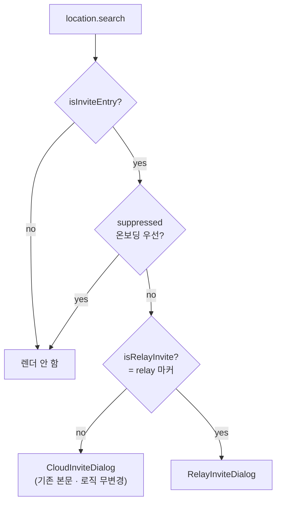
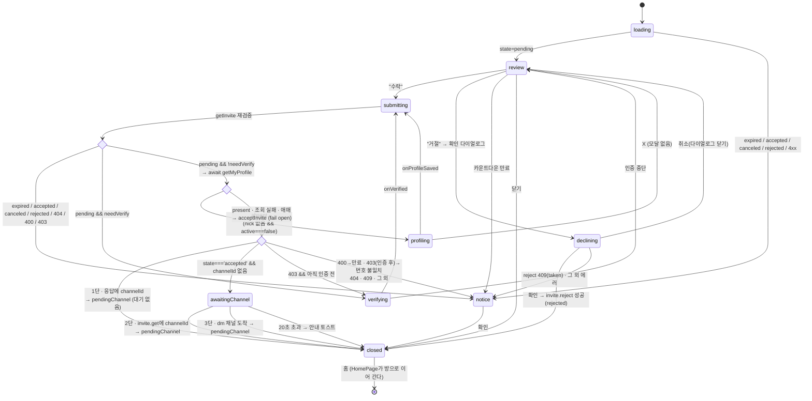
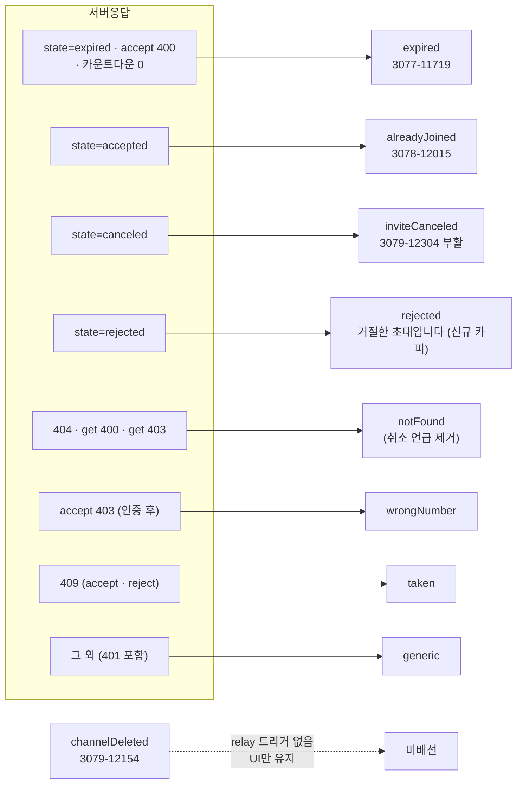
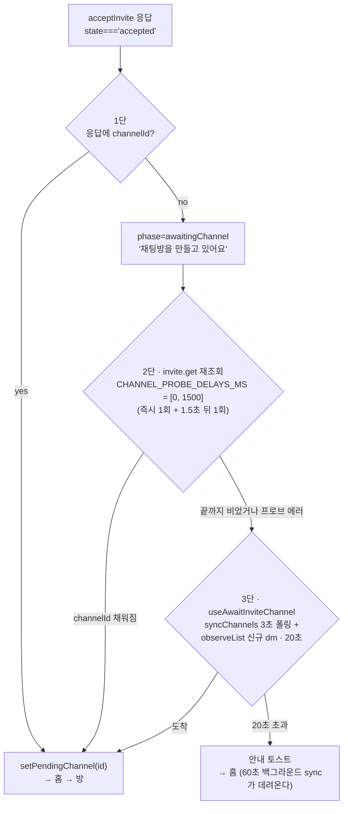
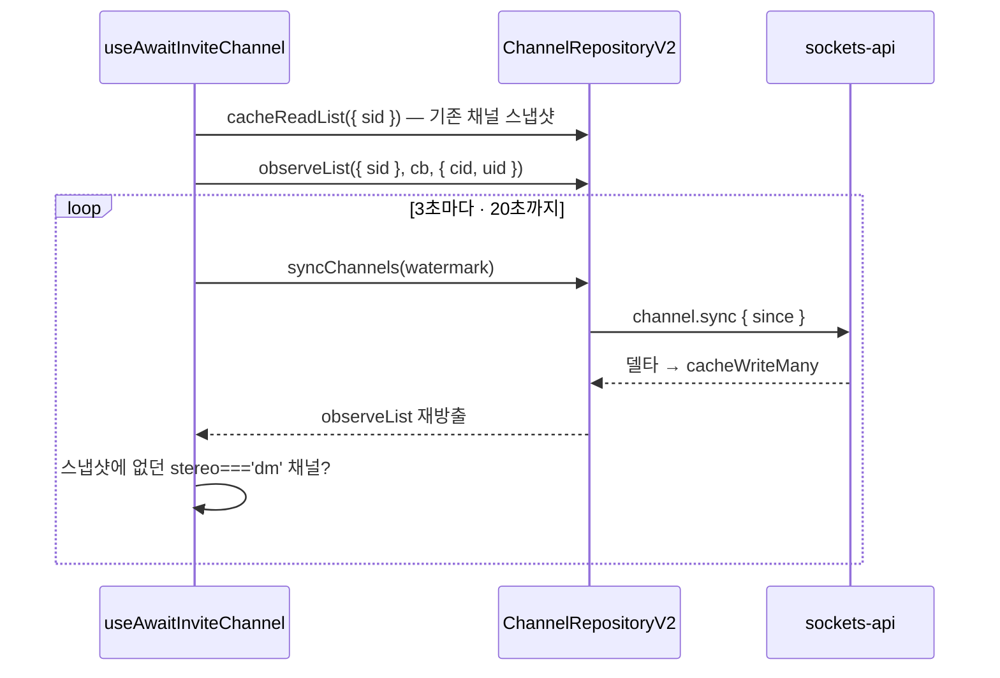

# 중계 1:1 초대 수락 (Relay Invite Accept) — 수신자 흐름

> 상태: Live · 최종 갱신: 2026-08-04 · 관련 ADR: [0043](../../../../../docs/adr/0043-relay-invite-cancel-reject-adoption.md) (취소·거절 실 API 전환), [0041](../../../../../docs/adr/0041-place-profile-as-invite-precondition.md) (프로필 전제조건), [0037](../../../../../docs/adr/0037-invite-accept-popup-group-and-dm-variants.md), [0035](../../../../../docs/adr/0035-relay-invite-accepted-channel-resolution.md), [0033](../../../../../docs/adr/0033-relay-dm-invite-and-auth-parallel-tracks.md), [0016](../../../../../docs/adr/0016-invite-accept-popup-web-ui-kit.md), [0020](../../../../../docs/adr/0020-place-profile-edit-dialog.md)
>
> 최근 개정(2026-08-04): ADR-0043 — 백엔드 요청 1번(`invite.cancel` + `canceled`)·2번(`invite.reject`
>
> - `rejected`)이 도착(sockets-lib `0.4.13`). 거절 버튼이 스텁(닫기+로컬 기록)에서 **확인 다이얼로그
>   (Figma 3446-17487) → 실 `invite.reject`**로 바뀌었고, 진입 케이스에 `canceled`(Figma 3079-12304
>   부활)·`rejected`가 분리됐다. 스텝 오케스트레이션·프로필 전제조건·채널 해소 3단은 변경 없음.
>
> 로드맵 Track C: [relay-dm-invite-parallel-roadmap.md](../../../../../docs/plans/relay-dm-invite-parallel-roadmap.md) · 백엔드 계약: `chatic-sockets-api/docs/specs/relay-server-invite/05-client-guide.md` §시나리오 B·C
>
> **알려진 드리프트:** 아래 파일 경로 다수가 "팝업 → 페이지" 전환(수신 코드가 `features/home/` →
> `features/invite/accept/`로 이동, `InviteDialog` → `RelayInviteAccept`) 이전을 가리킨다. 그 전환은
> ADR-0038 대기 중이며, 진입 구조는 [docs/invite-accept-entry.md](../../../../../docs/invite-accept-entry.md)가
> 최신이다. 이 문서의 상태 머신·시나리오 서술은 최신이다(ADR-0041 반영).

## 목적

휴대폰 번호로 발급된 **중계(relay) 1:1 초대 딥링크**를 받은 사람이, 앱을 열고 → 번호를 인증하고 →
**이름을 정하고** → 초대를 수락해 → 새로 생긴 DM 방에 입장하기까지의 흐름을 담당한다.

플레이스 프로필은 `invite.accept` **직전에** 묻는다(ADR-0041 결정 3). 이 지점은 두 번 뒤집혔다 —
ADR-0033 D10이 세우고, ADR-0039 결정 5가 "수락 앞에 세울 값이 아니다"며 지웠고, ADR-0041이 되살렸다.
되살린 근거는 ADR-0039가 계산에 넣지 않은 실패 모드다: 프로필을 수락 **이후로** 미루면 그사이 앱을
강제종료한 사용자가 **이름 없는 채로 되돌릴 수 없게 DM에 남는다.** 수락은 커밋됐고 프로필은 없다.

그래서 프로필은 강제 스텝이 아니라 **`invite.accept`의 전제조건**이다. X는 언제나 열려 있고
누르면 수락하지 않고 확인 화면으로 돌아간다 — 즉 "수락됐는데 이름 없음"이 만들어질 경로 자체가
없다. 강제 없이 정합성을 얻는 것이 ADR-0039의 "앱 전체 프로필 강제 0"과 양립하는 방식이다.

기존 클라우드 초대([invite-accept](../home/invite-accept.md), ADR-0016)와 **딥링크 진입점을
공유**하지만 백엔드 계약이 완전히 다르다 — 클라우드 초대는 REST 초대 파이프라인
(login→cloud→site→channel)이고, relay 초대는 웹소켓 패킷 3종(`invite.get` /
`auth.link-account` / `invite.accept`)에 **방 생성이 비동기**다. 그래서 이 화면은 "같은 팝업의
두 번째 분기"가 아니라 **별도 오케스트레이터**다.

## 설계 원칙

- **클라우드 초대에 회귀를 내지 않는다.** `InviteDialog`는 딥링크 마커(`isRelayInvite`)만 보고
  분기하는 얇은 라우터고, 기존 본문은 파일만 옮긴 무변경 코드다. 기존 `InviteDialog.test.tsx`가
  **수정 없이** 통과하는 것이 회귀 없음의 판정 기준이다.
- **분기는 서버 `state` / `errorCode`로만 한다.** 에러 메시지 문자열 파싱 금지
  (`getSocketErrorCode`). 클라우드 쪽 `resolveInviteErrorKey`(substring 매칭)를 재사용하지 않는
  이유다.
- **프로필 판정은 관측이 아니라 `await`다.** `advance()`는 이미 async이므로 `getMyProfile()`을
  기다린다. 반응형 훅(`useMyProfile`)을 읽으면 `null`이 "로딩 중"과 "없음"을 동시에 뜻해
  ([useMyProfile.ts:24](../../../src/app/hooks/useMyProfile.ts)) 한 프레임 헛등장이 나는데, 생성 폼은
  `initialNick=""`로 시작하므로 **프로필이 있는 사람에게 잘못 뜨면 기존 닉과 사진을 덮어쓴다.**
  기다리면 그 애매함이 애초에 생기지 않는다. `!profile?.nick` 단독 판정을 쓰지 않는 이유다.
- **판정이 애매하면 열어 준다(fail open).** `nick`이 없고 `active === false`일 때만 `absent`다 —
  `active: 0`이 "서버가 프로필 없음을 확인했다"는 표지이기 때문이다(`profile.get-mine`은
  get-or-create라 응답 자체는 항상 온다, ADR-0007). 조회가 실패하거나 애매하면(`nick` 없는데
  `active`가 `false`도 아님) **막지 않고 수락으로 진행한다.** 막는 쪽으로 실패하면 프로필 조회
  장애가 수락 불가로 번지고, 애매한 상태에서 폼을 띄우면 덮어쓰기 위험이 남는다. 전제조건은
  정상 경로를 위한 것이고, 이상 경로에서는 사용자의 목적(수락)이 이긴다.
- **스텝 전환마다 초대를 재검증한다.** 번호 인증에 수 분이 걸리고 그사이 초대가 만료·선점될
  수 있다(05-client-guide §B-2). 모든 전환이 `advance()` 하나를 지나고, 그 첫 동작이
  `getInvite(code)`다 — 호출부가 잊을 수 없는 구조로 만든다.
- **초대 코드는 자격증명이다.** 로그·쿼리키·localStorage·라우트 파라미터 어디에도 남기지 않는다.
  거절도 딥링크가 준 코드를 패킷 body로만 보낸다 — 로컬에 기록할 것이 없다(서버 `state`가 기억한다).
- **종국 판정은 서버 응답의 `state`다.** 거절·취소는 멱등이라 재시도해도 시각이 밀리지 않고,
  `409`(이미 수락)는 상태가 갈렸다는 뜻이므로 재조회로 화면을 맞춘다(01-spec L64·L89). 거절은
  **되돌릴 수 없으므로** 실행 전 확인 다이얼로그 한 단계를 둔다(05-client-guide §B-4 권고,
  Figma 3446-17487).
- **뷰는 재사용, 오케스트레이션만 새로 쓴다.** 수락 화면·상태 다이얼로그·채널 입장
  핸드오프는 전부 기존 자산이다. 새 라우트를 만들지 않아 `paths.ts`·`HomePage.tsx`를 건드리지
  않는다.
- **Track A 의존은 목 한 파일로 격리한다.** `PhoneVerifyScreen`·`applySessionToken`은 로드맵
  "인터페이스 계약"의 시그니처 그대로 목이며, 교체 지점이 파일 하나다.

## 범위

**포함**

- `InviteDialog` 라우터화 + relay 분기(`isRelayInvite`).
- relay 수락 팝업: `inviter$` 기반 헤딩·아바타, `expiredAt` 카운트다운, 거절/수락.
- 상태 다이얼로그 매핑: 만료 / 이미 참여 / **초대 취소됨** / **거절한 초대** / 유효하지 않음 /
  번호 불일치 / 선점 / generic.
- 스텝 오케스트레이션 상태 머신(ADR-0033 D10, ADR-0041 결정 3): get → verify → **profile** →
  accept → channel-wait → enter. `profiling` 스텝은 `absent`일 때만 끼어든다.
- 채널 sync 대기 유틸(`useAwaitInviteChannel`) — **Track B와 공유**(로드맵 Track B-4).
- 거절 — 확인 다이얼로그(Figma 3446-17487) → `invite.reject` → 홈. 인증 없이(디바이스 유저
  상태에서) 가능하다.
- Track A 계약 목(`trackAMock.tsx`) 1파일.

**제외**

- `PhoneVerifyScreen`·`applySessionToken` 실구현 — **Track A**. 여기서는 목만.
- 초대 발급·대기 화면·재초대·리스트 통합 — **발신자 흐름**([relay-invite-sender.md](relay-invite-sender.md)).
  소셜 연동 — **Track D**.
- 거절 시 초대자에게 가는 알림(백엔드 요청 4번 미구현) — 초대자는 목록 재조회로 안다.
- `channelDeleted` 다이얼로그 배선 — relay 백엔드에 대응 시그널이 없다(UI만 유지, ADR-0016과 동일).

## 시나리오

### 1. 신규 기기 풀 시나리오 (B-1 → B-2 → B-3)

1. 사용자가 SMS의 딥링크를 연다. 홈이 뜨고 `InviteDialog`가 `?provider=invite&code=…&_backend=…&relay`를
   읽어 **relay 분기**를 고른다.
2. `getInvite(code)` → `state='pending'`, `needVerify=true`. 수락 화면이 뜬다 —
   "**Sunny**님이 DoU에 당신을 초대했어요", 초대자 아바타, "You / 1:1 대화" 카드, 초대 링크
   유효기간 카운트다운(`expiredAt`).
3. `수락` → **재검증** → 여전히 `pending` + `needVerify` → `PhoneVerifyScreen`
   (`context='invite-accept'`, `inviteCode=code`)이 같은 풀스크린 서피스에 뜬다. 인증이 끝나면
   (`onVerified`) 세션은 이미 메인유저로 전환된 상태다(Track A 책임).
4. **재검증** → `pending` → **프로필 판정**(`await getMyProfile()`). 이 계정은 방금 만들어진
   신규 유저라 `nick`이 없고 `active === false`이므로 `absent` → `profiling`. 생성 다이얼로그가 같은
   풀스크린 서피스에 뜬다 — `<두유 홈>에 사용할 내 프로필을 만들어 주세요`(Figma 3080-12440).
5. 저장(`setMyProfile`)이 끝나면 `onProfileSaved` → **다시 `advance()`** → 재검증 → 이제 `present`
   → `acceptInvite(code)`. 응답 `state==='accepted'`면 성공(성공 플래그는 따로 없다).
6. **방 id를 3단으로 해소한다**(ADR-0035). 방은 "수락 순간" 생기지만 비동기라
   (05-client-guide:58·222) 응답에 실려 오는지가 백엔드 진행에 달려 있다. 그래서 값이 이미 손에
   있으면 기다리지 않고, 없을 때만 점점 넓은 수단으로 내려간다 — 자세한 것은 아래 "채널 해소 3단"
   다이어그램.
7. 해소되면 `usePendingInviteChannel.setPendingChannel(id)` → 홈으로 이동 → HomePage의 기존 효과가
   방으로 `replace` 이동한다([HomePage.tsx:184-196](../../../src/app/features/home/pages/HomePage.tsx),
   **무변경 재사용**).

### 1b. 프로필 화면에서 X — 수락하지 않고 돌아간다

1. 1번의 4단계에서 생성 다이얼로그가 뜬 상태.
2. X → **이탈 확인 모달 없이 곧바로** `flow.cancelStep` → `phase`가 `review`로 돌아간다
   (ADR-0041 결정 2). 인증 중단과 같은 핸들러·같은 목적지다.
3. **초대는 수락되지 않았다.** 다시 `수락`을 누르면 4단계부터 반복된다 — 초대가 아직 `pending`인
   한 몇 번이든 가능하고, 매번 재검증을 지나므로 그사이 만료되면 만료 다이얼로그로 떨어진다.
4. 이것이 "이름 없이 수락된 DM"이 생길 수 없는 이유다: 프로필 저장과 `acceptInvite`가 같은
   `advance()` 사슬에 있고, 나가면 사슬이 끊긴다.

### 2. 이미 메인유저인 기기 (needVerify=false)

2번까지 동일. `수락` → 재검증 → `needVerify` 거짓 → 인증 스텝을 건너뛰고 **프로필 판정으로 바로
간다**. 이미 프로필이 있는 재방문 유저면 `present`라 `profiling`도 건너뛰고 곧장 `acceptInvite`다.
프로필만 없는 기존 유저(예: 강제가 0이던 기간에 가입)는 여기서 `profiling`을 한 번 지난다.

### 3. 기기 교체 (시나리오 C)

앱이 따로 할 일이 없다 — 1번과 완전히 같고, 인증 단계에서 서버가 기존 유저를 찾아 준다.

### 4. 만료된 초대

- 진입 시 `state==='expired'` → 만료 `AlertDialog`("초대 링크가 만료되었어요"). `확인` → 홈.
- **인증 도중 만료** — 인증을 마치고 재검증할 때 `expired`가 오면 수락하지 않고 같은
  다이얼로그로 떨어진다. 이것이 스텝 전환마다 재검증하는 이유다.
- **화면을 열어 둔 채 만료** — 카운트다운이 0에 닿으면 수락 화면에서 바로 만료 다이얼로그로 간다.
- 수락 시점 만료는 `400`으로도 온다 → 같은 만료 다이얼로그.

### 5. 이미 참여한 초대 / 선점

- 진입 시 `state==='accepted'` → "이미 참여한 초대입니다."(Figma 3078-12015). 같은 코드 재수락은
  서버가 멱등 처리하므로 이 화면은 **내가 이미 수락한 링크를 다시 연 경우**다.
- 수락 시 `409` → "이미 사용된 초대입니다." — 다른 사람이 먼저 수락했다.

### 6. 취소된 / 거절한 / 유효하지 않은 초대

- `state === 'canceled'` → **"초대가 취소되었습니다."**(Figma 3079-12304,
  `inviteAccept.dialog.inviteCanceled.*` — 카피는 ADR-0016 시절부터 준비돼 있었다). 초대자가
  거둔 초대다. 에러가 아니라 **상태로 온다**(진입 조회·재검증 모두).
- `state === 'rejected'` → **"거절한 초대입니다."**(스펙 B-1 표). 이 기기(또는 같은 번호의 다른
  기기)에서 이미 거절한 딥링크를 다시 연 경우다. 서버 상태가 기억하므로 로컬 기록이 필요 없다 —
  구 스텁의 `declinedInviteIds`가 통째로 사라지는 이유다.
- `404`, 또는 조회 단계의 `400`(코드 형식)·`403`(코드 불일치) → "유효하지 않은 초대입니다."
  이제 취소와 구분되므로 notFound 카피에서 "취소되었거나"를 걷어낸다.

### 7. 초대받은 번호가 아님

수락이 `403`으로 막히면 보통은 "아직 디바이스 유저"라는 뜻이므로 인증 스텝으로 보낸다. 다만 이미 이
흐름에서 인증에 성공한 뒤라면 다른 번호를 인증한 것이므로 "초대받은 번호가 아닙니다."로 끝낸다.
발송 단계에서 걸리는 케이스(`400`)는 `PhoneVerifyScreen`(Track A)이 처리한다.

### 8. 거절 (실 API — ADR-0043)

1. 수락 화면의 `거절` → **확인 다이얼로그**(Figma 3446-17487) — 거절은 종국이라 되돌릴 수 없으므로
   한 단계를 둔다(05-client-guide §B-4 권고).
2. 확인 시 `rejectInvite(code)`. **번호 인증이 필요 없다** — 딥링크를 연 직후 디바이스 유저
   상태에서 바로 가능하다(B-2를 거치지 않는다).
3. 응답 `state === 'rejected'`면 거절 토스트 후 홈으로. 초대자에게 가는 알림은 없다(요청 4번) —
   초대자는 목록 재조회로 `rejected` 뱃지를 본다(발신자 문서 S8).
4. `409`(이미 수락)면 `taken` 공지로 떨어진다 — 그 사이 같은 번호의 주인이 수락했다는 뜻이다.
   그 외 에러는 조회 단계와 같은 매핑(`resolveNotice`)이다.
5. 같은 딥링크를 다시 열면 §6의 `rejected` 분기("거절한 초대입니다")로 끝난다. 마음이 바뀌면
   초대자가 재발급해야 한다.

### 9. 수락 후 방 해소 — 3단 (ADR-0035)

수락 응답(`MyInviteView`)에는 `channelId` 필드가 **이미 정의돼 있다** —
`InviteModel.channelId`의 주석이 "수락으로 생긴 dm 방"이다. 백엔드가 그것을 채우는 시점이
확정되지 않았을 뿐이므로(스펙 §미구현), 클라이언트는 **채워져 있으면 즉시 쓰고 없으면 내려가는**
구조로 읽는다. 세 단 모두 같은 도착점(`setPendingChannel` → 홈 → 방)으로 수렴한다.

- **1단 — 수락 응답 직독 (대기 0).** `acceptInvite` 응답에 `channelId`가 있으면 그대로 진입한다.
  스피너를 아예 거치지 않는다. **같은 번호로 재초대해 기존 방이 재사용되는 경우**
  (05-client-guide:257 "이미 방이 있으면 그 방으로 이어진다")가 여기 걸린다.
- **2단 — `invite.get` 재조회.** 1단이 비면 초대를 다시 읽어 `channelId`가 채워졌는지 본다.
  가이드가 명시적으로 권하는 방법이다("채널 목록이 갱신되기를 기다리거나 **다시 조회한다**",
  05-client-guide:222). `CHANNEL_PROBE_DELAYS_MS = [0, 1500]` — 즉시 1회 + 1.5초 뒤 1회.
  **2회로 제한한 이유**: 지연은 프로브 앞에 붙으므로 프로브를 늘리면 답도 늦어지고 더 견고한
  3단 시작도 그만큼 밀린다. 3단은 실제 채널 행을 보는 데다 자체 3초 폴링이 있어, 3번째 프로브가
  더 벌어 줄 것이 거의 없다. 이 단부터 "채팅방을 만들고 있어요" 오버레이가 뜬다.
- **3단 — 채널 목록 감시 (기존 동작).** 2단도 비면 `useAwaitInviteChannel`이
  `channel.syncChannels` 델타를 3초 주기로 당기며 `channel.observeList({ sid })`로 새
  `stereo==='dm'` 채널을 기다린다. **여기가 종전의 유일한 경로였고 그대로 남는다.**

**타임아웃 폴백** — 3단도 `CHANNEL_WAIT_TIMEOUT_MS`(20초) 안에 못 찾으면 오버레이를 접고 홈으로
이동하며 안내 토스트를 띄운다("채팅방을 준비하고 있어요. 잠시 후 목록에 나타납니다."). 수락은 이미
서버에 남았으므로 데이터 손실이 없고, 60초 백그라운드 sync가 결국 방을 데려온다.

2단 프로브가 에러(네트워크·4xx)를 내도 흐름을 끊지 않는다 — 그 단을 포기하고 3단으로 내려간다.
수락은 이미 성공했으므로 프로브 실패를 사용자에게 알릴 이유가 없다.

### 10. 온보딩 중 진입

기존과 동일 — `suppressed`(first-run)면 팝업 자체가 억제되고, 온보딩을 마친 뒤 URL에 초대 쿼리가
남아 있으면 그때 뜬다. 라우터 단에서 처리되므로 relay/클라우드 공통이다.

## 다이어그램

### 진입 분기 (회귀 방지 지점)



### 스텝 오케스트레이션 상태 머신 (ADR-0033 D10)

`useRelayInviteFlow`의 `phase`. `submitting`은 **재검증(`getInvite`) + 필요 시 `acceptInvite`**를
묶은 상태이고, 아래 분기점이 그 결과다.



### 상태 · 에러 → 화면 매핑



### 채널 해소 3단 (ADR-0035)



3단의 내부 동작 (종전과 동일):



## 상세 구현

### 진입 라우터

[`components/InviteDialog.tsx`](../../../src/app/features/home/components/InviteDialog.tsx) —
`useLocation` + `parseInviteDeeplink` + 세 조건만 남은 순수 라우터다. **데이터 훅을 하나도 부르지
않는다**: 기존 구조(훅 전부 호출 후 early return)를 유지한 채 relay 분기만 얹으면 relay 딥링크에서도
클라우드 `useInviteInfo(code, backend)`가 발사돼 존재하지 않는 클라우드 초대를 조회한다.
`HomePage.tsx:340`의 `<InviteDialog suppressed={isFirstRun} />`는 그대로다.

- [`invite/CloudInviteDialog.tsx`](../../../src/app/features/home/components/invite/CloudInviteDialog.tsx)
  — 기존 `InviteDialog` 본문을 그대로 옮긴 것(`resolveDialogVariant` 포함). URL 판정만 라우터로
  올라가 `params`를 prop으로 받는다.
- [`invite/RelayInviteDialog.tsx`](../../../src/app/features/home/components/invite/RelayInviteDialog.tsx)
  — relay 오케스트레이터. 판단은 전부 훅에 있고 여기 남은 것은 `phase` 스위치뿐이다. 수락 화면과
  인증 스텝이 같은 풀스크린 서피스를 쓰므로 둘 사이에 홈이 번쩍이지 않는다.

### 상태 머신 — [`hooks/useRelayInviteFlow.ts`](../../../src/app/features/home/hooks/useRelayInviteFlow.ts)

```ts
useRelayInviteFlow(code: string): {
    phase: 'loading' | 'review' | 'declining' | 'submitting' | 'verifying' | 'profiling'
         | 'awaitingChannel' | 'notice' | 'closed';
    invite: RelayInviteInfo | null;      // MyInviteView & { needVerify?, expiredAt?, inviter$.image? }
    notice: 'expired' | 'alreadyJoined' | 'inviteCanceled' | 'rejected'
          | 'notFound' | 'wrongNumber' | 'taken' | 'generic' | null;
    countdown: InviteCountdown | null;
    isRejecting: boolean;               // confirmDecline 요청이 나가 있는 동안 true
    accept(); decline(); confirmDecline(); close();
    onVerified(); onProfileSaved(); cancelStep(); dismissNotice();
}
```

핵심은 `advance()` 하나다 — 재검증하고 그 결과로 다음 `phase`를 정한다. `accept`·`onVerified`·
`onProfileSaved`가 전부 이걸 부르므로 재검증이 구조적으로 보장된다. 조건 분기는 둘이다:
`needVerify`(서버 값)와 프로필 판정(ADR-0041). 프로필 스텝을 지나 돌아와도 재검증을 다시 거치므로,
이름을 입력하는 동안 초대가 만료되면 수락하지 않고 만료 다이얼로그로 떨어진다.

**진입 조회와 `advance`의 상태 분기에 종국 둘이 추가된다** — `state === 'canceled'` →
`fail('inviteCanceled')`, `state === 'rejected'` → `fail('rejected')` (기존 `expired`/`accepted`
분기와 나란히). `notice` 값이 i18n 키(`inviteAccept.dialog.${notice}`)와 1:1이므로 이름은 기존
카피 키를 따른다 — 취소는 ADR-0016부터 준비된 `inviteCanceled` 키를 그대로 살린다.

**거절은 `declining` 페이즈다** — "판단은 전부 훅에" 원칙대로 확인 다이얼로그의 열림도 훅이
소유한다. `decline()`은 `review → declining` 전이만 하고, `confirmDecline()`이 실제
`rejectInvite(code)`를 부른다. 성공(`state === 'rejected'`)이면 거절 토스트 + `goHome`,
`409`면 `fail('taken')`, 그 외는 조회 단계와 같은 `resolveNotice` 매핑이다.

**요청이 나가 있는 동안 `phase`는 `declining`에 머문다 — `submitting`으로 넘어가지 않는다.**
대신 `isRejecting`이 켜진다. 처음엔 `confirmDecline`이 다른 스텝처럼 `setPhase('submitting')`을
불렀는데, `RelayInviteAccept`엔 `submitting` 전용 분기가 없어(수락 결과를 기다리는 스텝들과
공유하는 페이즈이기 때문) 확인 다이얼로그가 사라지고 "수락" 스피너가 도는 수락 화면으로
떨어지는 회귀가 났다 — 방금 거절을 눌렀는데 화면은 수락 진행 중처럼 보이는 것이다. 리뷰에서
잡혀 고쳤다: `isRejecting`을 훅이 들고, `RelayInviteAccept`는 그걸 `ConfirmDialog`의 `isPending`
prop으로 그대로 넘긴다 — `InviteWaitingPage`의 취소 확인 다이얼로그(`isCanceling`)와 같은
관용구다. 다이얼로그의
취소/닫기는 `cancelStep`(기존 `review` 복귀 핸들러)을 그대로 쓴다.

**프로필 판정 위치는 `acceptInvite` 직전, `needVerify` 분기 다음이다.** 순서가 뒤집히면 안 된다 —
인증 전에는 아직 디바이스 유저이고, 프로필은 인증으로 승격된 메인유저의 사이트에 써야 한다.

```ts
// advance() 안, mutations.acceptInvite(code) 바로 위
if (view.needVerify) return setPhase('verifying'); // 기존
if (!profileSavedRef.current && (await isPlaceProfileAbsent(latest.current.profileRepository))) {
    if (isStale(run)) return;
    return setPhase('profiling');
}
if (isStale(run)) return;
const accepted = await mutations.acceptInvite(code);
```

`isPlaceProfileAbsent`는 **`nick`이 없고 `active === false`일 때만 `true`**이고, throw하지 않는다
(조회 실패는 `false` = 진행). 판정 규칙과 fail-open 근거는 위 설계 원칙 참고.

두 가지가 이 세 줄에 같이 들어 있다.

- **`profileSavedRef`** — 저장 후 재진입에서 판정을 **다시 묻지 않는다.** `profile.set` 직후
  `get-mine`이 새 값을 곧바로 돌려준다는 보장이 없어서, 다시 물으면 같은 폼으로 한 번 더 튕길 수 있다.
  `verifiedRef`와 같은 성격의 "이 흐름에서 이미 지난 스텝" 표시다.
- **`await` 뒤의 `isStale(run)`** — 판정이 새 await 지점이라, 그사이 흐름이 앞서 나갔거나
  언마운트됐으면 아무것도 쓰지 않는다. 이 파일의 다른 await들과 같은 규칙이다.

- Track 0 훅 사용: `useRelayInviteMutations().getInvite / acceptInvite / rejectInvite`
  ([useRelayInvites.ts](../../../src/app/hooks/useRelayInvites.ts) — `rejectInvite`는 ADR-0043
  배선, 발신자 문서 체크리스트 4).
- 에러 분기는 전부 `getSocketErrorCode(error)`
  ([utils/errors.ts](../../../src/app/utils/errors.ts)) → `resolveNotice(status, stage)`. 같은
  status가 조회/수락에서 다른 뜻이라 `stage`를 함께 본다. `resolveNotice`의 "404는 취소·없음
  통합" 주석은 사실이 아니게 됐다 — 취소는 이제 `state`로 오고, 404는 순수하게 "없는 초대"다.
- 수락 `403`은 `verifiedRef`로 갈린다 — 인증 전이면 "아직 디바이스 유저"라서 인증 스텝으로, 인증
  후면 번호 불일치라서 종료. 서버는 `needVerify`와 무관하게 다시 판정하므로 이 경로가 필요하다.
- `expiredAt`은 발행된 `MyInviteView`에 선언돼 있지 않다(런타임에는 온다) — 기존
  `InviteInfo`([types/invite.ts](../../../src/app/features/home/types/invite.ts))의 확장 지점을
  재사용한다.
- 세대 카운터(`runIdRef`) + `aliveRef`로, 흐름이 앞서 나간 뒤 늦게 도착한 응답은 아무것도 쓰지
  않는다. 최신값(게이트웨이·네비게이션)은 `latest` ref로 읽어 콜백 identity를 고정한다.
- **수락 후 방 진입**은 `enterChannel(run, acceptedChannelId?)`이다. `acceptInvite` 응답의
  `channelId`를 그대로 넘겨(1단) `useResolveInviteChannel`에 위임하고, 결과가 있으면
  `setPendingChannel` + 홈 이동, `null`이면 안내 토스트 + 홈 이동으로 수렴한다. **1단이 맞으면
  `awaitingChannel` 페이즈를 아예 거치지 않는다** — 보여 줄 대기가 없기 때문이다.

### 채널 해소 3단 — [`features/home/hooks/useResolveInviteChannel.ts`](../../../src/app/features/home/hooks/useResolveInviteChannel.ts)

1·2단을 담고 3단은 공유 훅에 위임한다. 이 파일에 모은 이유는 1·2단이 **초대 의미론에 묶여**
있기 때문이다 — 1단은 수락 응답의 필드고 2단은 `invite.get`이다. 반면 3단은 초대를 모르는 순수
채널 감시라 Track B도 쓴다(아래).

```ts
/** 2단 프로브 지연(ms). 첫 프로브는 지연 없이 나간다. */
export const CHANNEL_PROBE_DELAYS_MS = [0, 1_500, 4_000];

useResolveInviteChannel(): {
    resolveChannel(code: string, opts?: {
        acceptedChannelId?: string;      // 1단 — 수락 응답이 실어 온 값
        probeDelaysMs?: number[];        // 2단 cadence (테스트가 줄인다)
        knownChannelIds?: Iterable<string>; timeoutMs?: number; pollMs?: number;  // 3단 위임
    }): Promise<string | null>;
}
```

- **cadence를 옵션으로 노출하는 것은 이 리포의 관용구다** —
  `awaitChannel({ timeoutMs, pollMs })`와 같은 이유(테스트가 실시간을 기다리지 않게).
- `useAwaitInviteChannel`과 같은 계약을 유지한다: **절대 reject하지 않고**, 못 찾으면 `null`이다.
  2단 프로브가 던지는 에러는 삼켜서 3단으로 내려간다 — 수락은 이미 성공했으므로 사용자에게 알릴
  것이 없다.
- 자체 `aliveRef`로 언마운트 후 프로브 루프를 조기 종료한다. 호출부(`useRelayInviteFlow`)의
  세대 가드가 최종 방어선이지만, 지연 중 언마운트에서 불필요한 소켓 왕복을 만들지 않는다.

### 채널 sync 대기 (3단) — [`hooks/useAwaitInviteChannel.ts`](../../../src/app/hooks/useAwaitInviteChannel.ts)

앱 레벨 훅 디렉터리에 둔다 — **Track B의 초대 대기 화면도 같은 유틸을 쓴다**(로드맵 Track B-4).

`SocketManager.waitUntilVerified`([SocketManager.ts:217](../../../../../libs/app-runtime/src/socket/SocketManager.ts))
의 모양을 따른다: 구독과 타이머를 경주시키고, **절대 reject하지 않는다**(타임아웃은 `null`).

```ts
useAwaitInviteChannel(): {
    awaitChannel(opts?: { knownChannelIds?: Iterable<string>; timeoutMs?: number; pollMs?: number }): Promise<string | null>;
}
```

- 기준선: `cacheReadList({ sid })`로 기존 채널 id를 잡는다. 호출부가 더 이른 시점에 스냅샷을 떴다면
  `knownChannelIds`로 넘긴다(Track B 용).
- 검출: `observeList({ sid }, cb, { cid, uid })` — `useHomeChannels`와 **같은 스코프 핀닝**. 새로
  나타난 `stereo==='dm'` + `sid` 일치 채널이 답이다.
- 발견 강제: `syncChannels`를 3초마다 당긴다. 소켓 푸시(`ChannelSyncPlan`)는 **이미 등록된 채널
  id에만** 오므로 새 방을 데려오지 못하고, 백그라운드 폴은 60초라 너무 느리다. 워터마크는
  `useBackgroundSync`와 같은 규약(`channel-sync:${cid}` · `syncMeta.getSyncedAt` → `setSyncedAt`)을
  지켜 델타를 잃지 않는다([useBackgroundSync.ts:73-82](../../../src/app/runtime/useBackgroundSync.ts)).
- 입장: `usePendingInviteChannel.setPendingChannel(id)` 후 홈으로 `replace`. **HomePage 무변경.**

### 수락 화면 (Figma 3072-10943 — 1:1 변형)

`InviteAcceptScreen`을 공유하고, optional prop 넷을 넓혔다 — **기본값이 현행이라 클라우드 쪽은
동작이 같다**:

| prop         | relay가 넘기는 값 | 기본값(=클라우드) |
| ------------ | ----------------- | ----------------- |
| `targetKind` | `'oneToOne'`      | `'group'`         |
| `onDecline`  | `flow.decline`    | `onClose`         |
| `overlay`    | 채널 대기 스피너  | 없음              |

`showDecline` prop은 삭제됐다 — 거절 스텁을 게이팅하던 용도였고(ADR-0043으로 게이트 소멸) 거절
버튼은 항상 노출이다. `RelayInviteAccept`는 `phase === 'declining'`일 때 수락 화면 대신 거절 확인
`ConfirmDialog`(Figma 3446-17487)를 렌더한다.

- 플레이스 카드는 **메타가 있으면 렌더된다**(ADR-0037 결정 1 철회, 2026-07-31). `RelayInviteAccept`가
  `site$`의 이름/소개/썸네일을 넘기고, relay `invite.get`이 채워주지 않는 동안에는 조용히 접힌다
  (ADR-0037 결정 1). 1:1 대화에 플레이스는 의미가 없다. 종전에는 "이름도 썸네일도 없으면 접힌다"는
  데이터 기준이었고, 이제 방 종류 기준이다.
- `InviteTargetCard`의 `kind?: 'group' | 'oneToOne'`이 `inviteAccept.target.oneToOne`("1:1 대화")을
  고른다.
- 유효시간 카드는 `expiredAt` 대신 `countdown`만 받는다. 24시간 미만이면 `HH:mm:ss`, 그 이상이면
  `n일 n시간`으로 표기가 갈린다(ADR-0037 결정 3) — 초대 링크는 서버에서 3일이다.

수락 화면 자체의 상세는 [invite-accept](../home/invite-accept.md)가 소유한다.

- **표시명 `\***<뒷4자리>`** — 번호로 만들어진 유저의 서버 표시명이다(백엔드가 고치지 않기로 한
항목). `ProfileAvatar`는 이니셜이 아니라 글리프를 그리므로 아바타는 영향이 없고, 이름은 서버 값을
그대로 보여준다. 헤딩 폴백은 `inviter$.name`이 **비어 있을 때만** 걸리므로 마스킹된 이름이 "이름
  없음"으로 오해되지 않는다.

### 프로필 스텝 (ADR-0041 결정 3)

`phase === 'profiling'`이면 `PlaceProfileCreateDialog`를 **직접** 렌더한다(**S-40 소유** —
[shared-contract §1](../../../../../docs/plans/place-profile-create-shared-contract.md)).

```tsx
<PlaceProfileCreateDialog open placeName={placeName} onDone={flow.onProfileSaved} onExit={flow.cancelStep} />
```

- `onDone` → `advance()` 재진입 → 재검증 → `acceptInvite`.
- `onExit` → `review` 복귀. **인증 중단과 같은 핸들러(`cancelStep`)** 다 — 둘 다 "이 스텝을 그만두고
  확인 화면으로"라는 같은 의미이므로 새 핸들러를 만들지 않는다.
- `exit` prop을 **넘기지 않는다** → X가 이탈 모달 없이 곧바로 나간다(ADR-0041 결정 2).
- `placeName`은 `useActivePlaceName()` — S-40의 리졸버가 적용돼 있어 relay 개인 플레이스가
  `두유 홈`으로 나온다(ADR-0040 결정 7).

**중간 래퍼(`RelayInviteProfileDialog`)를 두지 않았다.** 스펙 단계에서는 `5a61669a5`가 지운 그
파일을 복원할 계획이었으나, S-40의 `PlaceProfileCreateDialog`가 카피와 `setMyProfile` 저장을 이미
전부 소유하므로 래퍼에 남는 것이 `placeName` 한 줄뿐이었다. 같은 이유로 `useSaveMyPlaceProfile`도
복원하지 않았다 — 저장 경로가 다이얼로그 안에 있다.

> **jest 함정** — 이 다이얼로그는 `@chatic/app-runtime`을 import하고, 그 config 배럴을 jest가
> 파싱하지 못한다. 그래서 `features/home/components` **배럴이 아니라 직접 파일 경로로** import한다
> ([PlaceProfileForm.tsx:9-12](../../../src/app/features/home/components/PlaceProfileForm.tsx)의 같은
> 경고와 동일한 이유). 소비 스위트에서는 `PhoneVerifyScreen`처럼 스텁한다.

**카피는 `placeProfileCreate.*` 16키를 그대로 쓴다.** 삭제된 `relayInviteAccept.profile.*` 6키는
되살리지 않는다 — 그 6키가 존재했던 이유는 `placeProfileCreate.title`이 플레이스 이름을 보간하는데
"relay 플레이스에는 보여 줄 이름이 없다"는 것이었고, S-40의 `resolvePlaceDisplayName`
(shared-contract §2)이 그 빈칸을 `두유 홈`으로 채우면서 이유가 사라졌다.

프로필이 생기므로 ADR-0039가 감수한 표시명 열화도 이 경로에서는 되돌아간다 — DM 제목이
`channel.name`/공통 라벨로 내려앉지 않고 상대 `profile.nick`을 얻는다. 체인 자체는 그대로
[[dm-chat]]이 소유한다.

### 거절 — 스텁 잔재 철거 (ADR-0043)

거절이 실 API가 되면서 스텁 시절의 세 가지가 사라진다:

- `features/invite/flags.ts`의 `RELAY_INVITE_DECLINE_ENABLED` — 플래그 파일째 삭제(발신자 문서
  체크리스트 12).
- [`accept/lib/relayInviteDecline.ts`](../../../src/app/features/invite/accept/lib/relayInviteDecline.ts)
  — `recordDeclinedInvite`/`isInviteDeclined` 모듈 삭제. `isInviteDeclined`는 원래 읽는 곳이 없던
  반쪽이었고, 이제 `invite.get`의 `state === 'rejected'`가 그 역할이다(§6).
- `usePreferenceStore`의 `declinedInviteIds` 슬라이스 + `markInviteDeclined` 액션 +
  `preferenceKeys.ts`의 `declinedInvites` 항목(로컬 키 `chatic-web-relay-invite-declined`) —
  전부 삭제. 남는 localStorage 고아 항목은 무해하다(등록이 사라지면 읽는 코드가 없다).

### Track A 목 — 교체 지점

[`invite/trackAMock.tsx`](../../../src/app/features/home/components/invite/trackAMock.tsx) **한
파일**이다. 로드맵 "인터페이스 계약" 시그니처 그대로:

```ts
applySessionToken($token: unknown): Promise<void>
<PhoneVerifyScreen context={'invite-accept'|'invite-create'} inviteCode?: string
                   onVerified(): void onClose(): void />
```

**교체 절차** — (1) 이 파일을 지우고 (2) `RelayInviteDialog.tsx`의 `PhoneVerifyScreen` import를
Track A 모듈로 돌리고 (3) 두 스위트를 다시 돌린다. 소비처가 한 곳뿐이라 그게 전부다.

`applySessionToken`은 Track C가 직접 부르지 않는다 — 계약상 `onVerified` 시점에는 이미 세션 전환이
끝나 있다. 그래도 목에 함께 둔 것은, A가 그 책임 분담을 바꾸면 `onVerified` 핸들러에 한 줄
추가하면 되도록 계약을 한자리에 보이게 하기 위해서다.

### 파일 목록

| 파일                                                        | 상태 | 역할                                                             |
| ----------------------------------------------------------- | ---- | ---------------------------------------------------------------- |
| `features/home/components/InviteDialog.tsx`                 | 수정 | 훅 없는 진입 라우터                                              |
| `features/home/components/invite/CloudInviteDialog.tsx`     | 신규 | 기존 본문 이동(로직 무변경)                                      |
| `features/home/components/invite/RelayInviteDialog.tsx`     | 신규 | relay 오케스트레이터(뷰)                                         |
| `features/home/components/invite/trackAMock.tsx`            | 신규 | Track A 계약 목 (교체 지점)                                      |
| `features/home/components/invite/InviteAcceptScreen.tsx`    | 수정 | optional prop 4종                                                |
| `features/home/components/invite/InviteTargetCard.tsx`      | 수정 | optional `kind`                                                  |
| `features/home/hooks/useRelayInviteFlow.ts`                 | 수정 | 상태 머신 · 3단 해소 위임 · **`declining`/종국 분기(ADR-0043)**  |
| `invite/accept/components/RelayInviteAccept.tsx`            | 수정 | `profiling` 분기 (ADR-0041) · **거절 확인 다이얼로그(ADR-0043)** |
| `utils/placeProfile.ts`                                     | 신규 | `isPlaceProfileAbsent` — 발신자 흐름과 **공유**                  |
| `features/home/hooks/useResolveInviteChannel.ts`            | 신규 | 채널 해소 1·2단 (ADR-0035)                                       |
| `features/invite/flags.ts`                                  | 삭제 | 스텁 게이팅 — 갭 소멸(ADR-0043)                                  |
| `features/invite/accept/lib/relayInviteDecline.ts`          | 삭제 | 거절 로컬 기록(스텁) — `state`가 대체                            |
| `stores/usePreferenceStore.ts` · `stores/preferenceKeys.ts` | 수정 | `declinedInvites` 슬라이스·키 삭제                               |
| `hooks/useAwaitInviteChannel.ts`                            | 신규 | 채널 sync 대기(Track B 공유)                                     |
| `public/locales/{ko,en}/translation.json`                   | 수정 | 거절 확인·거절 재진입 키 추가, notFound 카피 수정                |

## 검증 방법

**취소·거절 전환 (ADR-0043)**

- [`useRelayInviteFlow.test.ts`](../../../src/app/features/invite/accept/hooks/useRelayInviteFlow.test.ts)
  — 신규 케이스: 진입 조회의 `canceled`/`rejected` → 각 공지 · `decline()`이 `declining`으로만
  가고 아무 호출도 없음 · `confirmDecline()` 성공 → 토스트+홈 · `409` → `taken` · 그 외 에러
  매핑 · 다이얼로그 취소(`cancelStep`) → `review` 복귀 + 미거절 · 거절 스텁 케이스 2건은 **대체**
  (로컬 기록 없음, `rejectInvite` 호출로). **회귀 테스트**(코드 리뷰에서 잡힘): 요청이 나가 있는
  동안 `phase`가 `declining`에 머물고 `isRejecting`만 켜지는지(가짜 타이머로 응답 보류) ·
  실패 시 `isRejecting`이 꺼지는지.
- [`RelayInviteAccept.test.tsx`](../../../src/app/features/invite/accept/components/RelayInviteAccept.test.tsx)
  — `declining`에서 확인 다이얼로그 렌더 · 확인/취소가 각각 `confirmDecline`/`cancelStep`으로 ·
  `showDecline` prop 제거 반영 · `inviteCanceled`/`rejected` 공지 다이얼로그 카피. **회귀
  테스트**: `isRejecting`이 켜지면 다이얼로그의 모든 버튼이 비활성화되고 수락 화면이 뜨지
  않는지(위 §스텝 오케스트레이션 참고).
- `relayInviteDecline.test.ts` — 모듈과 함께 **삭제**. `usePreferenceStore` 스위트에서
  `declinedInviteIds` 케이스 삭제.
- 수동(dev 스테이지): 딥링크 → 거절 확인 → 초대자 목록에 `rejected` 뱃지 · 같은 딥링크 재진입 →
  "거절한 초대입니다" · 취소된 초대 딥링크 → "초대가 취소되었습니다".

**프로필 스텝 (ADR-0041 결정 3)** — `apps/web` 전체 140 스위트 / 1033 테스트 통과, `tsc` 0 에러,
변경 파일 eslint 0 경고.

- [`useRelayInviteFlow.test.ts`](../../../src/app/features/invite/accept/hooks/useRelayInviteFlow.test.ts)
  (35케이스) — 판정을 목으로 주입해 6개를 새로 덮는다: `absent`면 `profiling`으로 가고 `acceptInvite`가
  호출되지 않는지 · `onProfileSaved` 뒤 재검증(`getInvite` 3회) 후 수락하는지 · 저장 뒤에는 판정을 다시
  묻지 않는지(`profileSavedRef`) · **`needVerify`가 프로필보다 먼저 이겨 판정이 아예 불리지 않는지** ·
  프로필 화면에 머무는 동안 만료되면 수락 대신 만료 공지로 가는지 · `cancelStep`이 `review` 복귀 +
  미수락인지. 기존 `"플레이스 프로필이 없어도 수락을 막지 않는다"`는 이 개정으로 뜻이 반대가 되어 위
  케이스들로 **대체**했다.
- [`utils/placeProfile.test.ts`](../../../src/app/utils/placeProfile.test.ts) (7케이스) — 판정 규칙
  전부. 발신자 흐름과 공유하는 함수라 이 스위트가 양쪽을 함께 지킨다.
- [`RelayInviteAccept.test.tsx`](../../../src/app/features/invite/accept/components/RelayInviteAccept.test.tsx)
  (20케이스) — `profiling`이 다이얼로그를 `두유 홈` 제목으로 띄우는지, **`exit`를 넘기지 않는지**
  (= X가 곧바로 나감), 저장/이탈이 각각 `onProfileSaved`/`cancelStep`으로 가는지, 다른 페이즈에서는
  뜨지 않는지.
- ⚠️ **알려진 한계 — sid 없는 진입에서는 스텝이 뜨지 않는다.** `setMyProfile`은 `selectedSiteId`를
  요구하는데 이 라우트에는 그것을 세우는 코드가 없다(relay sid를 쓰는 것은 홈의 명시적 플레이스 전환뿐이고,
  브라우저의 `storage`는 sessionStorage라 새 탭이면 기존 사용자도 비어 있다). 그래서 판정이 `!sid`면
  스텝을 **건너뛴다** — 세우면 다이얼로그 안에서 저장이 던져 초대를 영구히 수락할 수 없게 되기 때문이다.
  대가는 그 경로에서 ADR-0041 결정 1의 보장이 성립하지 않는 것(= ADR-0039 상태)이고, 근본 해결은 수락
  라우트에서 relay 플레이스를 해소하는 것으로 후속이다.
- ⚠️ **미확인 — 수동(dev 스테이지)**: `get-mine`이 프로필 없는 계정에 실제로 `active === false`를
  주는지. `apps/web`에서 `profile.active`를 읽는 첫 코드라 선례가 없다. 주지 않으면 판정이 애매로
  떨어지고 fail open이라 **이 스텝이 한 번도 뜨지 않는다**(수락은 정상 동작). 그때는 `nick` 부재
  단독 판정으로 내려가면 되고, `await`한 응답이라 덮어쓰기 위험은 없다.
- 수동(dev 스테이지, 미실행): 신규 계정으로 딥링크 → 인증 → 프로필 화면 → X로 돌아가 미수락 확인 →
  다시 수락 → 저장 → 입장.

**기존 (이전 Live 시점 기록)**

- **유닛 테스트** (신규 48케이스, 전부 통과)
    - `features/home/hooks/useRelayInviteFlow.test.ts`(17 → **+3, ADR-0035**) — 진입 조회 4, 스텝
      순서·재검증·도중 만료·중단 5, 수락 결과(채널 도착/타임아웃/accepted 아님/403 두 갈래/400·409) 6,
      거절 스텁 2. **추가**: 수락 응답의 `channelId`를 그대로 넘기는지, 1단일 때 `awaitingChannel`을
      거치지 않는지, 해소가 `null`이면 안내 토스트로 수렴하는지. 3단 위임은
      `useResolveInviteChannel`을 목으로 두어 이 스위트가 실시간 타이머에 묶이지 않게 한다.
    - `features/home/components/invite/RelayInviteDialog.test.tsx`(14) — phase별 렌더, 거절이
      닫기와 다른 핸들러로 가는지, 안내 다이얼로그 5종, 플레이스 카드 미표시.
    - `features/home/components/InviteDialog.routing.test.tsx`(4) — relay 마커 유무로 갈리는 분기.
    - `hooks/useAwaitInviteChannel.test.ts`(7) — 새 dm 검출, 기존/타 플레이스/비-dm 무시, 스냅샷
      주입, 타임아웃 `null`+정리, 델타 폴링과 워터마크, 홈 목록과 같은 스코프.
    - `features/home/hooks/useResolveInviteChannel.test.ts` **(신규 · ADR-0035)** — 1단 즉시 해소
      (2·3단 미호출), 2단 프로브 성공, 프로브가 끝까지 비면 3단 위임, 프로브 에러도 3단으로 폴백,
      3단 타임아웃 `null`, 언마운트 시 프로브 루프 조기 종료. `jest.useFakeTimers()` +
      `probeDelaysMs` 주입으로 실시간을 기다리지 않는다(`useAwaitInviteChannel.test.ts`와 같은 패턴).
    - `features/home/lib/relayInviteDecline.test.ts`(6) — 기록/조회, 중복, 상한, 깨진 JSON, 저장
      페이로드가 id 목록뿐인지.
    - **회귀**: `features/home/components/InviteDialog.test.tsx`(10) **무수정 통과** — 클라우드
      초대 회귀 없음의 근거. 전체 `apps/web` 스위트 101 suites / 650 tests 통과.
- **정적 검사**: `npx tsc --noEmit -p apps/web/tsconfig.app.json` 0 errors — 선행으로
  `npx tsc --build apps/web/tsconfig.app.json`을 돌려 프로젝트 참조를 빌드해야 한다(안 하면 TS6305
  노이즈에 실제 오류가 묻힌다). 변경 파일 eslint 0 errors.
- **수동 확인(dev 스테이지)**: 신규 기기에서 딥링크→인증→수락→입장 풀 시나리오, 만료 /
  이미참여 / 404. 채널 지연은 백엔드 상태에 달려 있어 타임아웃 폴백은 `CHANNEL_WAIT_TIMEOUT_MS`를
  낮춰 강제 재현한다. **인증 스텝은 Track A 머지 전까지 목이므로**, 실제 인증을 타는 수동 시나리오는
  통합(rebase) 이후에 돌린다.

## 재검토 조건

- **백엔드가 `InviteModel.channelId`를 수락 시점에 채우기 시작하면**(백엔드 요청 5번) 1·2단이
  자동으로 이겨 3단 폴링이 사실상 죽은 코드가 된다 — 그때 `useAwaitInviteChannel` 호출을 걷어낸다.
  **클라 배포 없이 빨라지는 것이 이 3단 구조의 목적이다**(ADR-0035).
- **수락 알림(소켓 이벤트)이 생기면** 2단 프로브를 이벤트 구독으로 대체한다. 관련 훅 포인트
  `getSocketManager().onType()`이 이미 있으나 현재 아무도 쓰지 않고, 백엔드 emit 여부가
  미검증이다(ADR-0035 대안 절).
- ~~요청 1번(취소 API + `canceled`) → `notFound`에서 취소를 분리하고 Figma 3079-12304 문구를 되살린다~~
  — **완료**(ADR-0043) — §6 참고.
- ~~요청 2번(거절 API + `rejected`) → 스텁과 `lib/relayInviteDecline.ts`를 걷어낸다~~ — **완료**(동일)
  — §8, "거절 — 스텁 잔재 철거" 참고.
- ~~`syncChannels`가 붙이는 sid가 relay `selectedSiteId`와 어긋나는 것이 확인되면 검출 필터를 넓힌다~~
  — **조사 완료, 기각**(2026-07-30, ADR-0035 "조사 중 기각한 가설"). relay는 플레이스가 하나뿐이고
  생성 경로가 이중으로 차단돼 있다(`canAddPlace`는 `isCloudActive`를 요구하고 relay는
  `cid==='default'`라 거짓 — [HomePage.tsx:64-71](../../../src/app/features/home/pages/HomePage.tsx),
  [useUserPermissions.ts:27-31](../../../src/app/hooks/useUserPermissions.ts)). 게다가
  `syncChannels`가 `$.sid` 없는 행을 버리는데도 relay 홈에 DM 방이 정상 표시되므로 relay 채널은
  기본 플레이스 sid를 갖는다. **필터는 그대로 둔다** — 다시 열지 말 것.
- **거절 중 이탈은 별도 가드가 필요 없었다** — `confirmDecline`이 `phase`를 `submitting`으로
  올리고, `close()`는 이미 `submitting`/`awaitingChannel`에서 닫기를 무시한다(수락과 같은 가드를
  그대로 공유). 종국 액션 도중 닫혀서 결과를 놓치는 경로가 생기지 않는다.
- **거절 확인 다이얼로그(Figma 3446-17487)·거절 재진입(`inviteAccept.dialog.rejected`) 카피는
  잠정이다** — 구현 시점에 시안 접근 경로(데스크톱 Dev Mode MCP·Chrome 확장·웹 로그인)가 전부
  막혀 있었다. `relayInviteAccept.declineDialog.*`·`inviteAccept.dialog.rejected.*`는 스펙
  카피로 배포했다 — 실제 시안 확인 시 해당 i18n 키만 조정하면 된다.
