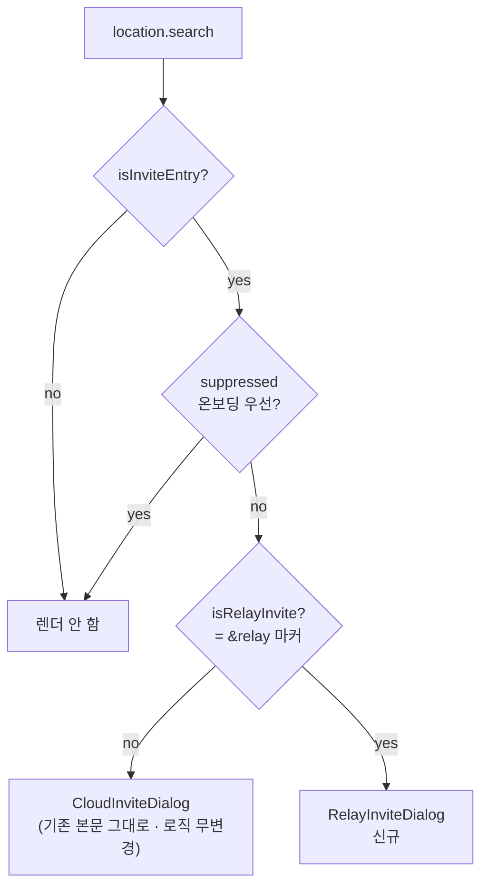
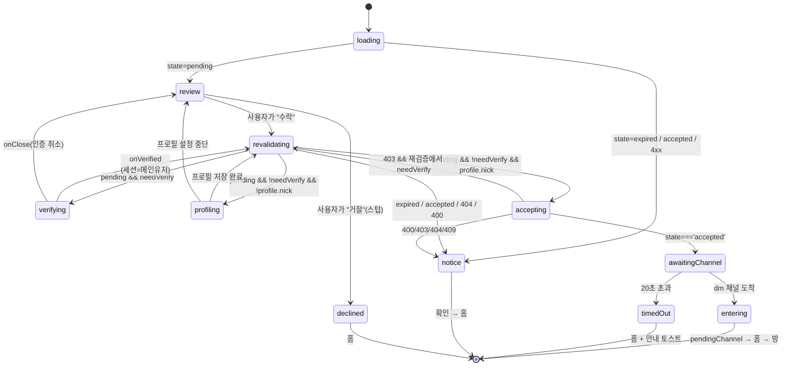
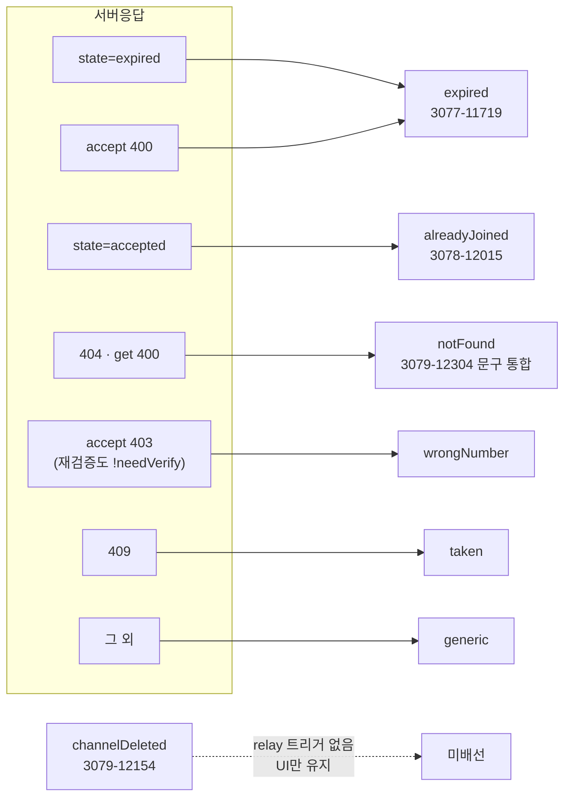
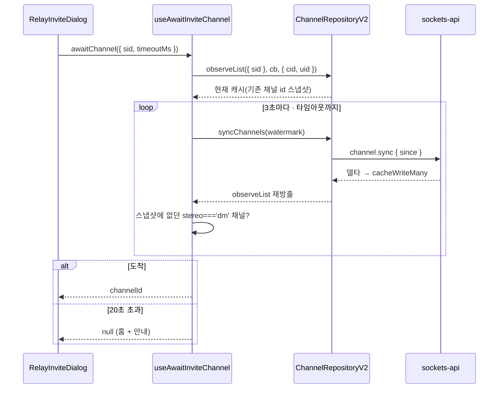

# 중계 1:1 초대 수락 (Relay Invite Accept) — 수신자 흐름

> 상태: Proposed · 최종 갱신: 2026-07-29 · 관련 ADR: [0033](../../../../../docs/adr/0033-relay-dm-invite-and-auth-parallel-tracks.md), [0016](../../../../../docs/adr/0016-invite-accept-popup-web-ui-kit.md), [0020](../../../../../docs/adr/0020-place-profile-edit-dialog.md)
>
> 로드맵 Track C: [relay-dm-invite-parallel-roadmap.md](../../../../../docs/plans/relay-dm-invite-parallel-roadmap.md) · 백엔드 계약: `chatic-sockets-api/docs/specs/relay-server-invite/05-client-guide.md` §시나리오 B·C

## 목적

휴대폰 번호로 발급된 **중계(relay) 1:1 초대 딥링크**를 받은 사람이, 앱을 열고 → 번호를 인증하고 →
플레이스 프로필을 만들고 → 초대를 수락해 → 새로 생긴 DM 방에 입장하기까지의 흐름을 담당한다.

기존 클라우드 초대(`InviteDialog`, ADR-0016)와 **딥링크 진입점을 공유**하지만 백엔드 계약이 완전히
다르다 — 클라우드 초대는 REST 초대 파이프라인(login→cloud→site→channel)이고, relay 초대는 웹소켓
패킷 3종(`invite.get` / `auth.verify-hash-alias` / `invite.accept`)에 **방 생성이 비동기**다.
그래서 이 문서는 "같은 팝업의 두 번째 분기"가 아니라 **별도 오케스트레이터**를 정의한다.

## 설계 원칙

- **클라우드 초대에 회귀를 내지 않는다.** `InviteDialog`는 딥링크 마커(`isRelayInvite`)만 보고
  분기하는 얇은 라우터가 되고, 기존 본문은 파일만 옮겨 **로직 무변경**으로 유지한다. 기존
  `InviteDialog.test.tsx` 9케이스가 수정 없이 통과하는 것이 회귀 없음의 판정 기준이다.
- **분기는 서버 `state` / `errorCode`로만 한다.** 에러 메시지 문자열 파싱 금지
  (`getSocketErrorCode`). 클라우드 쪽 `resolveInviteErrorKey`(문자열 substring 매칭)를 재사용하지
  않는 이유다.
- **스텝 전환마다 초대를 재검증한다.** 인증·프로필 입력에 수 분이 걸릴 수 있고 그사이 초대가
  만료·선점될 수 있다(05-client-guide §B-2). 각 전환의 첫 동작은 `getInvite(code)`다.
- **초대 코드는 자격증명이다.** 로그·쿼리키·localStorage·라우트 파라미터 어디에도 남기지 않는다.
  로컬 기록이 필요한 곳(거절 스텁)은 `invite.id`로 남긴다.
- **백엔드가 없는 액션은 인터페이스만 선반영한다**(ADR-0033 D1). 디자인의 버튼은 그대로 만들되
  동작은 로컬로 끝내고, 노출은 `flags.ts` 상수 한 줄로 끈다.
- **뷰는 재사용, 오케스트레이션만 새로 쓴다.** 수락 화면(`InviteAcceptScreen`)·상태 다이얼로그
  (`AlertDialog`)·프로필 폼(`PlaceProfileFormDialog`)·채널 입장 핸드오프
  (`usePendingInviteChannel`)는 이미 있는 것을 그대로 쓴다.
- **Track A 의존은 목 한 파일로 격리한다.** `PhoneVerifyScreen`·`applySessionToken`은 로드맵
  "인터페이스 계약"의 시그니처 그대로 목을 두고, 교체 지점을 파일 하나에 모은다.

## 범위

**포함**

- `InviteDialog` 라우터화 + relay 분기(`isRelayInvite`).
- relay 수락 팝업: `inviter$` 기반 헤딩·아바타, `expiredAt` 카운트다운, 거절/수락.
- 상태 다이얼로그 매핑: 만료 / 이미 참여 / 유효하지 않음(=취소 통합) / 번호 불일치 / 선점 / generic.
- 스텝 오케스트레이션 상태 머신(ADR-0033 D10): get → verify → profile → accept → channel-wait → enter.
- 채널 sync 대기 유틸(`useAwaitInviteChannel`) — **Track B와 공유**(로드맵 Track B-4).
- 거절 버튼 스텁(닫기 + 로컬 기록) + `flags.ts` 게이팅.
- Track A 계약 목(`trackAMock.tsx`) 1파일.

**제외**

- `PhoneVerifyScreen` 실구현·`applySessionToken` 실구현 — **Track A**. 여기서는 목만.
- 초대 발급·대기 화면·재초대·리스트 통합 — **Track B**.
- 소셜 연동 — **Track D**.
- `paths.ts` / `HomePage.tsx` / `SocketManager.ts` 변경 — 타 트랙 소유. 이번 범위에서 **손대지 않는다**
  (신규 라우트를 만들지 않고 홈에 이미 마운트된 오버레이로 끝내는 이유).
- 초대 취소/거절 백엔드 연동(요청 1·2번) — 스텁.
- `channelDeleted` 다이얼로그 배선 — relay 백엔드에 대응 시그널이 없다(UI만 유지, ADR-0016과 동일).

## 시나리오

### 1. 신규 기기 풀 시나리오 (B-1 → B-2 → B-3)

1. 사용자가 SMS의 딥링크를 연다. 홈이 뜨고 `InviteDialog`가 `?provider=invite&code=…&_backend=…&relay`를
   읽어 **relay 분기**를 고른다.
2. `getInvite(code)` → `state='pending'`, `needVerify=true`. 수락 화면이 뜬다 —
   "**Sunny**님이 DoU에 당신을 초대했어요", 초대자 아바타, "You / 1:1 대화" 카드, 초대 링크
   유효기간 카운트다운(`expiredAt`).
3. `수락` → **재검증**(`getInvite`) → 여전히 `pending` + `needVerify` → `PhoneVerifyScreen`
   (`context='invite-accept'`, `inviteCode=code`)이 풀스크린으로 뜬다. 인증이 끝나면
   (`onVerified`) 세션은 이미 메인유저로 전환된 상태다(Track A 책임).
4. **재검증** → `pending` → relay 플레이스 프로필(`useMyProfile().profile?.nick`)이 비어 있으면
   프로필 설정 오버레이(이름 필수 1~20자, 사진 선택). 저장은 `profileRepository.setMyProfile`.
5. **재검증** → `pending` → `acceptInvite(code)`. 응답 `state==='accepted'`면 성공
   (성공 플래그는 따로 없다).
6. 응답에 `channelId`가 **없다** — 방은 비동기 생성된다. 스피너("채팅방을 만들고 있어요")를 띄운
   채 `useAwaitInviteChannel`이 `channel.syncChannels` 델타를 짧은 주기로 당기며
   `channel.observeList({ sid })`로 새 `stereo==='dm'` 채널이 도착하기를 기다린다.
7. 도착하면 `usePendingInviteChannel.setPendingChannel(id)` → 홈으로 이동 → HomePage의 기존 효과가
   방으로 `replace` 이동한다(`HomePage.tsx:184-196`, **무변경 재사용**).

### 2. 이미 메인유저인 기기 (needVerify=false)

2번까지 동일. `수락` → 재검증 → `needVerify` 거짓 → 인증 스텝을 건너뛰고 프로필 판정으로 간다.
프로필도 있으면 곧장 `acceptInvite`.

### 3. 기기 교체 (시나리오 C)

앱이 따로 할 일이 없다 — 1번과 완전히 동일하고, 인증 단계에서 서버가 기존 유저를 찾아 준다.
프로필 판정에서 기존 `profile.nick`이 이미 있으므로 프로필 스텝은 자동으로 건너뛰어진다.

### 4. 만료된 초대

- 진입 시 `state==='expired'` → 만료 `AlertDialog`("초대 링크가 만료되었어요"). `확인` → 홈.
- **인증 도중 만료** — 인증을 마치고 재검증할 때 `expired`가 오면 같은 다이얼로그로 떨어진다.
  이것이 스텝 전환마다 재검증하는 이유다.
- 수락 시점 만료는 `400`으로도 온다 → 같은 만료 다이얼로그.

### 5. 이미 참여한 초대 / 선점

- 진입 시 `state==='accepted'` → "이미 참여한 초대입니다."(Figma 3078-12015).
  같은 코드 재수락은 서버가 멱등 처리하므로, 이 화면은 **내가 이미 수락한 링크를 다시 연 경우**다.
- 수락 시 `409`(선점) → "이미 사용된 초대입니다." — 다른 사람이 먼저 수락했다.

### 6. 취소된 / 유효하지 않은 초대

`404`(초대 없음) 또는 진입 조회 `400`(코드 형식) → "유효하지 않은 초대입니다."
**취소 API가 없어 취소와 구분할 수 없으므로 문구를 통합한다**(Figma 3079-12304의 취소 화면이
이 문구로 대체된다). 백엔드 요청 1번이 들어오면 `canceled` 분기를 여기에 꽂는다.

### 7. 초대받은 번호가 아님

인증을 마쳤는데 수락이 `403`으로 막히고 재검증에서도 `needVerify`가 아니면 → "초대받은 번호가
아닙니다." 발송 단계에서 걸리는 케이스(`400`)는 `PhoneVerifyScreen`(Track A)이 처리한다.

### 8. 거절 (스텁)

`거절` → 서버 호출 없이 닫고 홈으로. 거절 사실은 `invite.id`로 localStorage에 남겨,
같은 링크를 다시 열었을 때 재확인 문구를 띄울 수 있게만 해 둔다.
**백엔드 거절 API가 없다(요청 2번)** — 초대자 쪽에는 아무 신호도 가지 않는다.

### 9. 채널이 안 오는 경우 (타임아웃 폴백)

수락은 성공했는데 `CHANNEL_WAIT_TIMEOUT_MS`(20초) 안에 방이 안 보이면 스피너를 접고 홈으로
이동하며 안내 토스트를 띄운다("채팅방을 준비 중이에요. 잠시 후 목록에 나타납니다."). 수락은 이미
서버에 남았으므로 데이터 손실이 없고, 60초 백그라운드 sync가 결국 방을 데려온다.

### 10. 온보딩 중 진입

기존과 동일 — `suppressed`(first-run)면 팝업 자체가 억제되고, 온보딩을 마친 뒤 URL에 초대 쿼리가
남아 있으면 그때 뜬다. 라우터 단에서 처리되므로 relay/클라우드 공통이다.

## 다이어그램

### 진입 분기 (회귀 방지 지점)



### 스텝 오케스트레이션 상태 머신 (ADR-0033 D10)

`useRelayInviteFlow`의 `phase`. **모든 전이의 첫 동작은 `getInvite(code)` 재검증**이고,
그 결과가 `revalidate` 다이아몬드다.



### 상태 · 에러 → 화면 매핑



### 채널 sync 대기



## 상세 구현

### 진입 라우터

`apps/web/src/app/features/home/components/InviteDialog.tsx` — 훅을 하나도 부르지 않는 순수
라우터로 축소한다. `useLocation` + `parseInviteDeeplink` + 세 개의 조건만 남고, 본문은 두 자식으로
간다. `HomePage.tsx:340`의 `<InviteDialog suppressed={isFirstRun} />`는 **그대로**다.

훅을 라우터에서 걷어내는 것이 핵심이다. 지금 구조(훅 전부 호출 후 early return)를 유지한 채
relay 분기만 얹으면 relay 딥링크에서도 클라우드 `useInviteInfo(code, backend)`가 발사돼 존재하지
않는 클라우드 초대를 조회한다.

- `apps/web/src/app/features/home/components/invite/CloudInviteDialog.tsx` — 기존
  `InviteDialog.tsx:47-134` 본문을 **그대로** 옮긴다(`resolveDialogVariant` 포함). import 경로만
  한 단계 깊어진다. `../hooks` → `../../hooks`는 jest 모듈 식별자가 같으므로 기존 테스트의
  `jest.mock('../hooks', …)`가 그대로 적용된다.
- `apps/web/src/app/features/home/components/invite/RelayInviteDialog.tsx` — 신규 오케스트레이터.
  오버레이·라우팅·다이얼로그를 소유하고, 상태 머신은 훅에 위임한다.

### 상태 머신 — `hooks/useRelayInviteFlow.ts`

```ts
type RelayInvitePhase =
    | 'loading' | 'review' | 'verifying' | 'profiling'
    | 'accepting' | 'awaitingChannel' | 'done';

useRelayInviteFlow(code: string): {
    phase: RelayInvitePhase;
    invite: RelayInviteInfo | null;     // MyInviteView & { needVerify?, expiredAt?, inviter$.image? }
    notice: RelayInviteNotice | null;   // 'expired' | 'alreadyJoined' | 'notFound' | 'wrongNumber' | 'taken' | 'generic'
    start(): void;                      // "수락" — 재검증부터 시작
    onVerified(): void;                 // PhoneVerifyScreen 완료
    onProfileSaved(): void;             // 프로필 저장 완료
    cancelStep(): void;                 // 인증/프로필 중단 → review
}
```

핵심은 `advance()` 하나다 — `getInvite`로 재검증하고 그 결과로 다음 `phase`를 정한다. `start`,
`onVerified`, `onProfileSaved`가 전부 `advance()`를 부르므로 **"스텝 전환마다 재검증"이 구조적으로
보장된다**(개별 호출부가 잊을 수 없다).

- Track 0 훅 사용: `useRelayInviteMutations().getInvite / acceptInvite`
  ([useRelayInvites.ts:66](../../../src/app/hooks/useRelayInvites.ts)).
- 에러 분기는 전부 `getSocketErrorCode(error)`
  ([utils/errors.ts:20](../../../src/app/utils/errors.ts)).
- 프로필 판정: `useMyProfile().profile?.nick`
  ([hooks/useMyProfile.ts:18](../../../src/app/hooks/useMyProfile.ts)). relay 플레이스에서도
  `selectedSiteId`가 relay core에서 나오므로 그대로 동작한다(ADR-0020 결정 3).
- `expiredAt`은 발행된 `MyInviteView`에 선언돼 있지 않다(런타임에는 온다) — 기존
  `InviteInfo`([types/invite.ts:25](../../../src/app/features/home/types/invite.ts))가 이미
  쓰는 확장 지점을 재사용한다.
- 언마운트 후 setState 방지: 각 비동기 스텝은 `runIdRef` 세대 번호로 스스로를 무효화한다.

### 채널 sync 대기 — `apps/web/src/app/hooks/useAwaitInviteChannel.ts`

앱 레벨 훅 디렉터리에 둔다 — **Track B의 초대 대기 화면도 같은 유틸을 쓴다**(로드맵 Track B-4).

`SocketManager.waitUntilVerified`([SocketManager.ts:217](../../../../../libs/app-runtime/src/socket/SocketManager.ts))
의 모양을 따른다: 이미 만족하면 즉시 resolve, 아니면 구독과 타이머를 경주시키고, **절대 reject하지
않는다**(타임아웃은 `null`).

```ts
useAwaitInviteChannel(): {
    awaitChannel(opts?: { timeoutMs?: number }): Promise<string | null>;
}
```

- 검출: `channel.observeList({ sid }, cb, { cid, uid })` — `useHomeChannels`와 **같은 스코프
  핀닝**([useHomeChannels.ts:48-56](../../../src/app/features/home/hooks/useHomeChannels.ts)).
  첫 방출을 "기존 채널" 스냅샷으로 잡고, 이후 새로 나타난 `stereo==='dm'` 채널을 답으로 본다.
- 발견 강제: `syncChannels`를 `POLL_MS`(3초)마다 당긴다. 소켓 푸시(`ChannelSyncPlan`)는 **이미
  등록된 채널 id에만** 오므로 새 방을 데려오지 못하고, 백그라운드 폴은 60초라 너무 느리다.
  워터마크는 `useBackgroundSync`와 같은 규약(`channel-sync:${cid}` · `syncMeta.getSyncedAt`
  → `setSyncedAt`)을 지켜 델타를 잃지 않는다
  ([useBackgroundSync.ts:73-82](../../../src/app/runtime/useBackgroundSync.ts)).
- 입장: `usePendingInviteChannel.setPendingChannel(id)` 후 홈으로 `replace` — `HomePage.tsx:184-196`의
  기존 소비 효과를 그대로 탄다. **HomePage 무변경.**

### 수락 화면 (Figma 3077-11587)

`InviteAcceptScreen`을 그대로 쓴다. relay가 채우는 props: `inviterName`(`inviter$.name`),
`inviterImage`(`inviter$.image`), `expiredAt`, `countdown`(`useInviteCountdown`), `isAccepting`,
`onAccept`, `onClose`. `placeName`/`placeIntro`/`memberCount`는 relay DM 초대에 없으므로 넘기지
않고 기존 degrade 경로를 탄다.

- `InviteTargetCard`에 optional `kind?: 'group' | 'oneToOne'`(기본 `'group'`)를 추가한다. relay는
  `oneToOne`을 넘겨 이미 있는 미사용 키 `inviteAccept.target.oneToOne`("1:1 대화")를 쓴다.
  **기본값이 현행이라 클라우드 쪽은 변화 없다.**
- **표시명 `***<뒷4자리>`** — 번호로 만들어진 유저의 서버 표시명이다(백엔드가 고치지 않기로 한
  항목). `ProfileAvatar`는 이니셜을 쓰지 않고 글리프를 그리므로 아바타는 문제없다. 이름은
  서버 값을 **그대로** 보여주되, 판별 헬퍼 `isMaskedPhoneName()`을 두어 (a) 이 이름을 "이름
  없음"으로 오해해 폴백 헤딩으로 떨어뜨리지 않게 하고 (b) 나중에 문구를 바꿀 때 한 곳만 고치게
  한다.

### 상태 다이얼로그

web-ui-kit `AlertDialog` 단일 액션(확인)을 쓰고 제목은 `text-destructive` — 클라우드와 동일한
관례다. i18n은 `inviteAccept.dialog.*`를 공유하고 relay에서 새로 필요한 셋만 추가한다.

| variant          | relay 트리거                          | i18n                                     | 신규 |
| ---------------- | ------------------------------------- | ---------------------------------------- | ---- |
| `expired`        | `state='expired'` · accept `400`     | `inviteAccept.dialog.expired.*`          |      |
| `alreadyJoined`  | 진입 시 `state='accepted'`            | `inviteAccept.dialog.alreadyJoined.*`    |      |
| `notFound`       | `404` · get `400`                     | `inviteAccept.dialog.notFound.*`         | ✔    |
| `wrongNumber`    | accept `403` + 재검증 `!needVerify`   | `inviteAccept.dialog.wrongNumber.*`      | ✔    |
| `taken`          | `409`                                 | `inviteAccept.dialog.taken.*`            | ✔    |
| `generic`        | 그 외(401 포함)                       | `inviteAccept.dialog.generic.*`          |      |
| `channelDeleted` | — (relay 시그널 없음)                 | `inviteAccept.dialog.channelDeleted.*`   |      |

### 스텁 — 거절 버튼

- `apps/web/src/app/features/home/flags.ts` (신규, 로드맵 "공통 규칙"의 첫 구현체):
  `RELAY_INVITE_DECLINE_ENABLED` 한 줄로 숨김/노출을 전환한다. 디자인에 있는 버튼이므로 기본 노출.
- `utils/relayInviteDecline.ts`: `recordDeclinedInvite(inviteId)` / `isInviteDeclined(inviteId)` —
  localStorage. **`invite.id`만 저장하고 `code`는 절대 저장하지 않는다.**
- `// TODO(backend): 2번 — ADR-0033 인터페이스 선반영` 주석을 호출부에 단다.

### Track A 목 — 교체 지점

`apps/web/src/app/features/home/components/invite/trackAMock.tsx` **한 파일**에 모은다. 로드맵
"인터페이스 계약" 시그니처 그대로:

```ts
applySessionToken($token: unknown): Promise<void>
<PhoneVerifyScreen context={'invite-accept'|'invite-create'} inviteCode?: string
                   onVerified(): void onClose(): void />
```

목은 화면에 "Track A 대기 중" 패널과 인증 완료/닫기 버튼만 그린다. 파일 상단·각 export에
`// TODO(track-a): replace with the real PhoneVerifyScreen` 주석을 단다. **A 머지 후 이 파일을
지우고 import 경로 한 줄만 바꾸면 끝나도록** 소비처는 `RelayInviteDialog` 한 곳뿐이다.

### 파일 목록

| 파일                                                                | 상태 | 역할                          |
| ------------------------------------------------------------------- | ---- | ----------------------------- |
| `features/home/components/InviteDialog.tsx`                         | 수정 | 훅 없는 진입 라우터           |
| `features/home/components/invite/CloudInviteDialog.tsx`             | 신규 | 기존 본문 이동(로직 무변경)   |
| `features/home/components/invite/RelayInviteDialog.tsx`             | 신규 | relay 오케스트레이터          |
| `features/home/components/invite/RelayInviteProfileDialog.tsx`      | 신규 | 프로필 스텝 래퍼              |
| `features/home/components/invite/trackAMock.tsx`                    | 신규 | Track A 계약 목 (교체 지점)   |
| `features/home/components/invite/InviteTargetCard.tsx`              | 수정 | optional `kind` prop          |
| `features/home/components/invite/index.ts`                          | 수정 | 배럴                          |
| `features/home/hooks/useRelayInviteFlow.ts`                         | 신규 | 상태 머신                     |
| `features/home/hooks/index.ts`                                      | 수정 | 배럴                          |
| `features/home/flags.ts`                                            | 신규 | 스텁 게이팅                   |
| `features/home/utils/relayInviteDecline.ts`                         | 신규 | 거절 로컬 기록(스텁)          |
| `hooks/useAwaitInviteChannel.ts` · `hooks/index.ts`                 | 신규/수정 | 채널 sync 대기(Track B 공유) |
| `public/locales/{ko,en}/translation.json`                           | 수정 | 신규 문구                     |

## 검증 방법

- **유닛 테스트**
    - `features/home/hooks/useRelayInviteFlow.test.ts` — 스텝 순서(verify→profile→accept),
      needVerify/프로필 스킵, 전환마다 `getInvite` 재호출, 인증 도중 만료, 상태·에러 매핑 6종.
    - `features/home/components/invite/RelayInviteDialog.test.tsx` — relay 딥링크에서만 렌더,
      초대자·카운트다운, 거절 스텁, 다이얼로그 문구.
    - `hooks/useAwaitInviteChannel.test.ts` — 새 dm 채널 검출, 기존 채널 무시, 타임아웃 `null`,
      정리(타이머/구독) 확인. 가짜 타이머.
    - `features/home/utils/relayInviteDecline.test.ts` — 기록/조회, 코드 미저장.
    - **회귀**: `features/home/components/InviteDialog.test.tsx` **무수정 통과**(9케이스) —
      클라우드 초대 회귀 없음의 근거. `types/invite.test.ts`도 그대로.
- **정적 검사**: `npx tsc --noEmit -p apps/web/tsconfig.app.json`, 변경 파일 eslint.
- **수동 확인(dev 스테이지)**: 신규 기기에서 딥링크→인증→프로필→수락→입장 풀 시나리오, 만료 /
  이미참여 / 404. 채널 지연은 백엔드 상태에 달려 있어 타임아웃 폴백은 `CHANNEL_WAIT_TIMEOUT_MS`를
  낮춰 강제 재현한다.

---

## 구현 체크리스트

1. **라우터 분리** — `InviteDialog` → 라우터 + `invite/CloudInviteDialog.tsx`(본문 이동).
   `InviteDialog.test.tsx` 무수정 통과 확인. *여기서 회귀가 없어야 나머지를 얹는다.*
2. **스텁·목 기반** — `flags.ts`, `utils/relayInviteDecline.ts`(+테스트),
   `invite/trackAMock.tsx`.
3. **채널 대기 유틸** — `hooks/useAwaitInviteChannel.ts`(+테스트). 독립적이라 먼저 굳힌다.
4. **상태 머신** — `hooks/useRelayInviteFlow.ts`(+테스트). UI 없이 훅 단위로 완결.
5. **UI 배선** — `RelayInviteDialog` + `RelayInviteProfileDialog` + `InviteTargetCard.kind`
   + i18n(ko/en) + 배럴. `RelayInviteDialog.test.tsx`.
6. **검증** — tsc / jest / eslint 실행 후 문서 Live 전환.

## 리스크와 미지수

- **Track A 계약 표류.** `PhoneVerifyScreen`/`applySessionToken` 시그니처가 바뀌면 목과 소비처가
  깨진다. 접촉면을 목 1파일 + 소비처 1곳으로 좁혀 rebase 비용을 최소화한다. 계약 변경이 필요하면
  로드맵을 먼저 고친다.
- **`applySessionToken` 호출 주체가 불명확하다.** 로드맵 계약상 `PhoneVerifyScreen`은 "완료 시
  세션 전환까지 끝난 상태로 `onVerified`"이므로 **Track C는 부르지 않는다**. 목도 그렇게 만든다.
  A가 이 책임을 밖으로 뺀다면 `onVerified` 핸들러에서 부르도록 한 줄 추가로 대응한다.
- **채널 sync 대기의 sid.** `syncChannels`는 클라우드 전역 델타를 `item.$.sid`로 태깅해 넣는다.
  새 DM이 relay 플레이스의 현재 `selectedSiteId`와 다른 sid로 들어오면 `observeList({ sid })`가
  못 잡는다. 완화: 타임아웃 폴백이 항상 있고, dev 스테이지에서 실제 sid를 확인해 필요하면 필터를
  "sid 무관 + 신규 dm"으로 넓힌다.
- **신규 기기의 relay `siteId` 공백.** 인증 직후 relay `siteId`가 아직 없으면 `useMyProfile`이
  `null`을 돌려주고 이는 "프로필 없음"과 구별되지 않는다. 이 경우 프로필 스텝을 한 번 더 태우는
  쪽이 안전(멱등)하므로 그대로 두되, 채널 대기는 sid가 생길 때까지 진행하지 않는다.
- **`InviteDialog.test.tsx`의 배럴 목킹.** `jest.mock('../hooks', …)`이 두 키만 노출하므로,
  라우터가 `../hooks`에서 무엇이든 새로 import하면 그 스위트가 깨진다. 라우터는 훅을 전혀 쓰지
  않도록 유지한다.
- **롤백** — 1번 커밋(라우터 분리)만 되돌리면 완전히 원상복구된다. 2~5번은 relay 마커가 붙은
  딥링크에서만 도달하므로 클라우드 경로에 영향이 없다.
</content>
</invoke>
