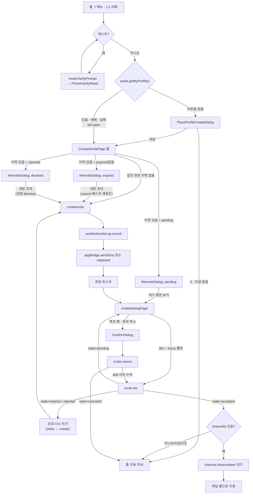
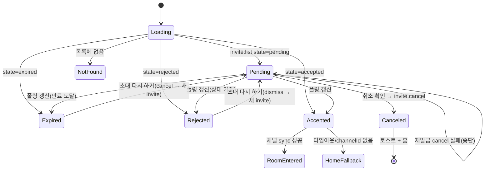

# Relay 1:1 초대 — 발신자 흐름 (Contact Invite Sender)

> 상태: Live · 최종 갱신: 2026-08-04 · 관련 ADR: [ADR-0043](../../../../../docs/adr/0043-relay-invite-cancel-reject-adoption.md) (취소·거절 실 API 전환), [ADR-0041](../../../../../docs/adr/0041-place-profile-as-invite-precondition.md) (프로필 전제조건), [ADR-0034](../../../../../docs/adr/0034-inviter-phone-verification-guest-gate-and-sheet.md) (게스트 게이트), [ADR-0033](../../../../../docs/adr/0033-relay-dm-invite-and-auth-parallel-tracks.md) · 로드맵: [relay-dm-invite-parallel-roadmap.md](../../../../../docs/plans/relay-dm-invite-parallel-roadmap.md) (Track B)
>
> 최근 개정(2026-08-04, ADR-0043): 백엔드 요청 1번(`invite.cancel` + `canceled`)·2번(`invite.reject` +
> `rejected`)이 도착 — sockets-lib `0.4.13` / sockets-api `0.26.710` / backend-api `0.26.709`.
> 취소 스텁(로컬 숨김)을 실 API로, 거절 상태 표시를 실 상태로 전환했고, 재발급을 "이전 초대
> cancel → 새로 create" 조합으로 바꿨다. 아래 서술은 전환 후(현재) 상태다.

## 목적

홈 ＋메뉴의 "1:1 대화"를 실제 흐름으로 제공한다: 연락처(이름+휴대폰) 입력 → relay 초대 발급
(`invite.create`) → 딥링크를 SMS 작성기로 전달 → 초대 대기 화면에서 상대의 수락을 기다렸다가
실채널로 전환한다. 취소(`invite.cancel`)와 거절 상태(`rejected`)는 실 API·실 상태다(ADR-0043).
남은 백엔드 갭은 수락·거절 알림(요청 4번)과 수락 시점의 `channelId` 타이밍(요청 5번)뿐이고,
폴링과 3단 폴백이 흡수한다.

## 설계 원칙

- **상태 문구는 서버 `state`로만 분기한다.** 유니온은 다섯이다 —
  `pending`/`accepted`/`canceled`/`rejected`/`expired`(`MyInviteStatus`, sockets-lib `InviteState`와
  같은 집합). 에러 메시지 문자열 파싱 금지 — 분기가 필요하면 `getSocketErrorCode`를 쓴다.
- **취소·거절은 종국이고 멱등이다.** 응답의 `state`가 판정의 전부라 재확인 조회가 필요 없고,
  재호출해도 시각이 밀리지 않는다(01-spec L64). `409`는 "이미 수락됨" — 상태가 갈렸다는 뜻이므로
  어느 표면이든 **목록을 다시 불러 화면을 맞춘다**는 한 가지 규칙으로 수렴한다.
- **초대 코드는 자격증명이다.** URL 파라미터·로그·상태관리 devtools·localStorage에 원문을 남기지
  않는다. 라우트는 `invite.id`로만 파라미터화한다. 취소가 요구하는 전체 코드(`invt:<id>:<code>`)는
  `invite.list` 행의 `id`·`code`(초대자 본인 소유라 서버가 실어 준다)로 **호출 직전에 메모리에서만
  조립**하고(`composeInviteCode`), 그 값을 저장하거나 로그에 남기지 않는다.
- **종국 카드의 정리 책임은 상태마다 다르다.** `canceled`는 목록 필터가 자연히 거른다.
  `rejected`는 서버가 영구 보존하고 만료로 퇴화하지도 않으므로(파생 우선순위상 `rejectedAt`이
  `expiredAt`보다 앞), 사용자가 재초대로 "처리"한 뒤에는 로컬 dismiss(`canceledInviteIds`)로 걷는다.
- **남은 백엔드 갭은 플래그가 아니라 구조로 흡수한다.** 요청 1·2·3번이 해소되면서
  `features/invite/flags.ts`는 삭제됐다 — 갭이 사라진 플래그는 죽은 분기만 남긴다(ADR-0043).
  요청 4번(알림 없음)은 폴링(`useRelayInvites` 포커스 refetch + 대기 화면 30초)이, 요청 5번
  (`channelId` 타이밍)은 `useAcceptedChannelSync`의 폴백이 흡수하며 둘 다 게이팅할 분기가 없다.
- **번호 원문은 서버에 없다.** `MyInviteView`는 `last4`(뒷 4자리)만 돌려준다. 같은 번호 재초대
  감지·대기 화면 라벨은 로컬 발급 이력(`useSentInviteLog`)과 서버 뷰를 함께 봐서 판단한다.
- **유효시간은 서버 값만 렌더한다.** `expiredAt` epoch(ms)를 그대로 카운트다운에 쓰고, 카피에
  기간을 하드코딩하지 않는다(ADR-0033 D8 — 3일).
- **기존 프리미티브를 최우선으로 재사용한다.** `web-ui-kit`에 이미 이 용도로 보이는 컴포넌트가
  있으면(`ChatRoomHeader`, `DateDivider`, `MessageInput`, `StatusBadge`, `TextField`,
  `BottomSheet`, `useInviteCountdown`) 새로 만들지 않는다.
- **발급은 메인유저만 한다.** 게스트는 폼에 도달하지 않고 인증 유도 화면에서 끊긴다
  ([ADR-0034](../../../../../docs/adr/0034-inviter-phone-verification-guest-gate-and-sheet.md) — 상세는
  [phone-verification.md](../auth/phone-verification.md)). 클라 게이트는 UX이고 서버 403이 계약이라
  폴백 경로를 항상 남긴다.
- **발급은 이름이 있는 사람만 한다 — 게이트가 아니라 전제조건이다**(ADR-0041). 플레이스 프로필이
  없으면 폼에 도달하지 않는다. 강제하지는 않는다: 프로필 화면의 X는 언제나 열려 있고, 누르면 홈으로
  나간다 — **나갔다는 것은 초대를 보내지 않았다는 뜻**이므로 "프로필 없이 발급된 초대"라는 상태가
  애초에 만들어지지 않는다.
- **게이트가 둘일 때 순서는 게스트 인증 → 프로필이다.** 두 게이트 모두 **통과 전에는 폼을 렌더하지
  않는다** — 폼을 그려두고 위에 다이얼로그를 덮으면 조건 미충족 상태로 제출할 수 있는 순간이
  한 프레임이라도 생긴다.

## 범위

**포함**

- 연락처로 초대 페이지(`ContactInvitePage`) — 게스트 게이트, 프로필 전제조건 게이트, 발급 폼.
- 발급 → SMS 작성기 전달(`appBridge.sendSms`, 비네이티브 폴백은 클립보드 복사).
- 같은 번호 재초대 감지 다이얼로그 — pending(대기 화면 유도) / expired(재발급) / declined(재발급)
  세 실분기.
- **재발급 = 이전 초대 retire 후 create** — pending·expired는 `invite.cancel`, rejected는 로컬
  dismiss. 옛 링크가 살아 있는 반쪽 동작이 닫힌다(ADR-0043 결정 5).
- 초대 대기 화면 — 카운트다운, 폴링, 재발급, **취소(실 API)**, **거절 상태 블록**, 수락 감지 후
  채널 전환.
- 홈 `ChannelList` + `PlaceChannelManagePage`에 초대 행 통합 — 뱃지 `pending`/`expired`/`rejected`.
- **과거 로컬 취소 잔재의 서버 reconcile**(ADR-0043 결정 8) — 스텁 시절 로컬로만 취소한 초대에
  실제 `invite.cancel`을 발사해 서버 상태를 맞춘다.

**제외**

- 수락·거절·취소의 초대자 알림(백엔드 요청 4번 미구현) — 30초 폴링 유지.
- `canceledAt`·`rejectedAt` 시각 카피("어제 취소함") — 뷰에 오지만 이번 화면 요구에 없다. 후속.
- "이미 1:1 대화가 있어요" 사전 감지 다이얼로그(ADR-0033 D2 — v1 미구현).
- 소셜 연동·전화번호 인증 UI(Track A/D 소관).
- 국가 선택·국가별 번호 검증·`invite.create`의 `countryCode` —
  [international-phone-input.md](../auth/international-phone-input.md) 소유. 발급 폼은 소비만 한다.
- desktop-web 전용 대응(ADR-0033 D6).
- `SocketManager`, 마이페이지 계정 화면(다른 트랙 소유 — 미접촉).

## 시나리오

### S1. 연락처로 신규 초대 발급 → SMS 전달 → 대기 화면

1. 홈 ＋메뉴 → "1:1 대화" → `ROUTES.invite.contact`. **게스트면 폼이 아니라 인증 유도 화면이
   뜬다**(ADR-0034) — 인증을 마치면 `isGuest`가 반응형으로 풀려 같은 화면이 폼으로 바뀐다.
2. 게스트가 아니면 **플레이스 프로필 판정**(ADR-0041) — `getMyProfile()` 한 번을 기다린다.
   프로필이 없으면 폼 대신 `PlaceProfileCreateDialog`가 뜬다(Figma 3026-11374). 저장하면 폼으로
   바뀐다. 응답 대기 중에는 폼도 다이얼로그도 띄우지 않는다.
3. 이름(최대 20자) + 휴대폰 번호(한국 형식) 입력. 형식 오류는 인라인 에러(Figma 3268-35795).
4. 제출 시 로컬 발급 이력(`useSentInviteLog.findByPhone`)에 같은 번호가 없으면 바로
   `useRelayInviteMutations().createInvite({ phone, name })` 호출.
5. 성공 응답(`MyInviteView`)을 `useSentInviteLog.record`로 기록.
6. `appBridge.sendSms([phone], message)`로 SMS 작성기를 연다(딥링크 프리필). 네이티브가 아니거나
   전송 실패 시 클립보드 복사로 폴백.
7. 완료 토스트 후 `ROUTES.invite.waiting(invite.id)`로 이동.

### S1b. 프로필 없이 들어와 설정을 그만둠

1. S1의 2번에서 `PlaceProfileCreateDialog`가 뜬 상태.
2. X를 누르면 이탈 확인 모달 없이 곧바로 홈으로 나간다(ADR-0041 결정 2). 초대는 발급되지 않았다.

### S2. 같은 번호 재초대 — 아직 대기 중

1. S1의 4번에서 로컬 이력에 같은 번호가 있고, 그 invite가 `invite.list`에서 `state === 'pending'`.
2. 새로 발급하지 않고 재초대 다이얼로그("이미 초대를 보냈어요")를 띄운다 — 유일한 동작은 대기
   화면으로 이동. 같은 번호에 pending 코드를 둘 만들지 않는 것은 여전하다 — 취소 API가 생겼어도
   "이미 보낸 초대를 확인하러 온" 사용자에게 몰래 재발급하는 것은 의도 위반이다.

### S3. 같은 번호 재초대 — 이전 건 만료됨

1. 로컬 이력에 매치가 있고 해당 invite가 `state === 'expired'`(또는 목록 창 밖이라 안 보임).
2. 재초대 다이얼로그("이전 초대가 만료되었어요")를 띄운다. 확인 시 **이전 초대를 먼저
   `invite.cancel`로 거두고**(베스트 에포트 — 만료 코드는 이미 죽어 있어 실패해도 발급을 막지
   않는다, 목록 정리 목적) 새 초대를 발급한다. 카피는 "기존 링크는 더 이상 사용할 수 없다"고
   말할 수 있다 — 취소가 실제로 나가므로 사실이다(구 `INVITE_AUTO_REVOKE_ON_REISSUE_SUPPORTED`
   분기는 카피째 단일화).

### S3b. 같은 번호 재초대 — 이전 건 거절됨

1. 로컬 이력에 매치가 있고 해당 invite가 `state === 'rejected'`.
2. 재초대 다이얼로그의 declined 변형("상대방이 이전 초대를 거절했습니다", Figma 3412-18478)을
   띄운다. 확인 시 이전 rejected 행을 **로컬 dismiss**(`markInviteCanceled` — 서버 취소는 종국
   상태를 덮지 않으므로 로컬로만 걷는다)하고 새 초대를 발급한다.

### S4. 대기 화면 — 폴링 중 수락 감지

1. `InviteWaitingPage`가 `invite.list`를 창 포커스 시 + 30초 간격으로 재조회한다.
2. 대상 invite의 `state`가 `accepted`로 바뀌면: `channelId`가 뷰에 있으면 로컬 채널 동기화를 짧게
   기다렸다가(`useAcceptedChannelSync`) 방으로 이동. 타임아웃이거나 `channelId`가 아직 없으면
   (요청 5번 미확정) "곧 확인할 수 있어요" 안내 + 홈 이동 CTA로 내린다.

### S5. 대기 화면 — 만료 후 재발급

1. `state === 'expired'`가 되면 상태 블록이 적색 만료 문구로 바뀐다. 액션 행은 그대로 남는다.
2. "초대 다시 하기" 탭 시: **이전 초대를 `invite.cancel`로 거두고**(베스트 에포트) 로컬 이력의
   이름/번호로 새 `createInvite` → 새 invite의 대기 화면으로 교체 이동(`replace`), 새 SMS
   작성기도 다시 연다.

### S5b. 대기 화면 — pending 상태에서 재발급

1. `state === 'pending'`인 초대에서 "초대 다시 하기"를 누르면(SMS를 다시 보내고 싶은 경우 등)
   **이전 초대 `invite.cancel`이 성공해야만 새로 발급한다.** 취소가 실패하면(네트워크 등) 재발급을
   중단하고 실패 토스트를 띄운다 — 여기서 순서를 뒤집으면 같은 번호에 유효한 코드가 둘 생긴다.
2. 취소가 `409`(이미 수락)로 지면 재발급을 중단하고 목록을 재조회한다 — 화면이 수락 상태로
   전환되고, 그것이 사용자가 알아야 할 사실이다.

### S6. 대기 화면 — 취소 (실 API)

1. 본문 액션 행의 "초대 취소" → 확인 다이얼로그(Figma 3263-30207).
2. 확인 시 `cancelInvite(composeInviteCode(invite))` 호출. **판정은 성공/실패지 응답 `state`
   비교가 아니다** — 거절과 경합해 응답이 `state === 'rejected'`로 와도(취소가 종국 표식을
   덮지 않는다, 01-spec L64) 호출 자체는 성공이므로 같은 취소 토스트(Figma 3413-18662) 후
   홈으로 이동한다. 뮤테이션이 목록 캐시를 무효화하므로 행도 사라진다.
3. `409`(이미 수락)면 다이얼로그를 닫고 목록을 재조회한다 — 화면이 수락 상태로 바뀐다.
4. 그 외 실패는 에러 토스트를 띄우고 화면에 남는다. 멱등이라 재시도해도 안전하다.

### S7. 리스트 통합

1. 홈 `ChannelList`(default 클라우드에서만)와 `PlaceChannelManagePage`(default 클라우드의
   place에서만)가 `useInviteListRows()`로 각 invite를 한 행씩 렌더. 필터는
   **`pending`/`expired`/`rejected` 통과 + 로컬 dismiss 제외**다 — `canceled`·`accepted`는 상태
   필터가 거른다(수락 행은 실채널이 대신한다, 취소 행은 사용자가 이미 치웠다).
2. 뱃지: `pending` → "초대 대기 중" / `expired` → "초대 만료" / `rejected` → "초대 거절"
   (`resolveInviteRowBadge` — 거절은 만료와 같은 muted 톤에 라벨·둘째 줄만 다르다). 행 탭 →
   대기 화면.

### S8. 거절 감지

1. 상대가 초대를 거절하면(수신자 `invite.reject`) 폴링이 `state === 'rejected'`를 가져온다 —
   알림은 없다(요청 4번).
2. 대기 화면이 열려 있으면 거절 상태 블록으로 바뀐다(Figma 3263-30117): "상대방이 초대를
   거절했어요" + 재초대 안내. 액션 행에는 "초대 다시 하기"만 남는다 — 종국 초대에 취소는 무의미하다
   (서버도 표식을 덮지 않는다).
3. "초대 다시 하기" → 이전 rejected 행 로컬 dismiss + 새 발급(S5와 같은 경로, retire 방식만 다름).
4. 홈 목록에서는 "초대 거절" 뱃지 행으로 보인다(S7) — 탭하면 이 화면으로 온다.

### S9. 과거 로컬 취소 잔재 reconcile (일회성 마이그레이션)

1. 스텁 시절(요청 1번 이전) 취소는 `canceledInviteIds`에 id만 남기고 서버는 `pending`이었다.
2. 홈 마운트 시 `useCanceledInviteReconcile`이 목록 도착 후 한 번 돈다: 기록된 id마다 —
    - 행이 있고 `pending`/`expired` → `invite.cancel` 발사. 성공·`409` 모두 기록 삭제.
    - 행이 있고 `canceled`/`accepted` → 서버가 이미 아는 상태다. 기록만 삭제.
    - 행이 있고 `rejected` → 기록 유지 — 이제 그 기록은 dismiss 마커다(S3b·S8과 같은 역할).
    - 행이 없음(목록 창 밖) → 코드 없이 취소할 수 없다. 기록만 삭제.
    - 그 외 실패 → 기록 유지, 다음 세션에 재시도(멱등이라 안전).
3. legacy 기록이 소진되면 이 훅은 no-op이다. **다른 기기와의 경합도 안전** — 같은 계정이 두
   기기에서 동시에 reconcile해도 `invite.cancel`은 멱등이다. `canceledInviteIds` 스토어 자체는
   폐기하지 않는다 — rejected 행 dismiss(S3b·S8)로 역할이 좁아져 존속한다(ADR-0043 결정 8이
   예정한 "잔재 소진 후 제거"에서 스펙 단계에 갱신된 편차 — [설계 원칙](#설계-원칙) 참고).

## 다이어그램

### 발신자 흐름 전체

### 대기 화면 상태 전이

### 재발급·정리(retire) 규칙 — `useRetireInvite`

| 이전 초대 상태                  | retire 동작                              | 실패 시                                              |
| ------------------------------- | ---------------------------------------- | ---------------------------------------------------- |
| `pending`                       | `invite.cancel` **필수 선행**            | 재발급 중단(실패 토스트). `409`면 중단 + 목록 재조회 |
| `expired`                       | `invite.cancel` 베스트 에포트(목록 정리) | 무시하고 발급 진행 — 죽은 코드라 위험이 없다         |
| `rejected`                      | 로컬 dismiss(`markInviteCanceled`)       | — (로컬 쓰기)                                        |
| `canceled` / `accepted` / 그 외 | 아무것도 안 함(`skipped`)                | —                                                    |

반환값은 `'canceled' \| 'dismissed' \| 'conflict' \| 'failed' \| 'skipped'`다. `pending`/`expired`
분기는 `cancelInvite` 호출이 던지지만 않으면 **응답의 `state`를 보지 않고** `'canceled'`를
반환한다 — S6과 같은 이유로, 거절과 경합해 응답이 `rejected`로 와도 옛 코드는 똑같이 죽었다.

## 상세 구현

### 핵심 파일

| 파일                                                                   | 역할                                                                                                                                                                                      |
| ---------------------------------------------------------------------- | ----------------------------------------------------------------------------------------------------------------------------------------------------------------------------------------- |
| `libs/data/src/data/remote/gateways/index.ts`                          | `InviteDomainGateway = Pick<InviteGateway, 'create'\|'get'\|'list'\|'accept'\|'cancel'\|'reject'>` — 0.4.13 게이트웨이의 두 메서드를 도메인 표면에 노출.                                  |
| `libs/data/src/data/remote/data-sources/InviteRemoteDataSource.ts`     | `cancelInvite(code)`/`rejectInvite(code)` 추가 — `acceptInvite`와 같은 모양(`gateway.cancel<MyInviteView>({ code })`).                                                                    |
| `libs/data/src/data/repositories-v2/InviteRepositoryV2.ts`             | `cancel(code)`/`reject(code)` 추가 — 원격 패스스루(기존 원칙 유지).                                                                                                                       |
| `apps/web/src/app/hooks/useRelayInvites.ts`                            | `useRelayInviteMutations`에 `cancelInvite`/`rejectInvite` 뮤테이션 추가(onSuccess 목록 무효화, `isPending` 포함). `InviteState`는 lib 범프로 5종이 된다.                                  |
| `apps/web/src/app/features/invite/utils/inviteCode.ts`                 | **신규** — `composeInviteCode({ id, code })` → `invt:<id>:<code>` \| `undefined`. 조립 전용, 저장·로그 금지.                                                                              |
| `apps/web/src/app/features/invite/utils/inviteStatus.ts`               | 리졸버에서 플래그 파라미터 제거 — `rejected`는 정식 상태로 인식(`REJECTED_STATE` 문자열 우회 삭제). 카피 리졸버 2종(`resolve*Key`)은 카피 단일화로 삭제.                                  |
| `apps/web/src/app/features/invite/hooks/useRetireInvite.ts`            | **신규** — 위 retire 규칙 표의 구현. `retire(invite): Promise<'canceled'\|'dismissed'\|'conflict'\|'failed'\|'skipped'>`. 재발급 경로 둘(대기 화면·폼)이 공유.                            |
| `apps/web/src/app/features/invite/hooks/useCanceledInviteReconcile.ts` | **신규** — S9의 일회성 reconcile. 홈에서 마운트, 세션당 1회, 순차 실행.                                                                                                                   |
| `apps/web/src/app/features/invite/hooks/useLocallyCanceledInvites.ts`  | 존속하되 역할 축소 — "rejected 행 dismiss + legacy reconcile 대기 기록". 문서 주석 갱신.                                                                                                  |
| `apps/web/src/app/features/invite/hooks/useInviteWaitingStatus.ts`     | 대상 invite 조회 + 30초 폴링(무변경).                                                                                                                                                     |
| `apps/web/src/app/features/invite/hooks/useAcceptedChannelSync.ts`     | 수락 감지 후 채널 대기 + 타임아웃(무변경).                                                                                                                                                |
| `apps/web/src/app/features/invite/hooks/useInviteListRows.ts`          | 필터 확장 — `pending`/`expired`/`rejected` + `!isCanceled`(dismiss).                                                                                                                      |
| `apps/web/src/app/features/invite/components/ReinviteDialog.tsx`       | 3변형 유지 — `declined`가 이제 도달 가능. `expired` 설명은 단일 카피(취소가 실제로 나가므로 "기존 링크는 사용할 수 없다").                                                                |
| `apps/web/src/app/features/invite/components/InviteChannelRow.tsx`     | `resolveInviteRowBadge(invite.state)` — 플래그 인자 삭제. 거절 행 둘째 줄 `contactInvite.rowStatus.declined`.                                                                             |
| `apps/web/src/app/features/invite/pages/ContactInvitePage.tsx`         | 재초대 분기에 declined 추가, `handleReissue`가 `useRetireInvite`를 선행.                                                                                                                  |
| `apps/web/src/app/features/invite/pages/InviteWaitingPage.tsx`         | 취소 확인 → `cancelInvite` 실호출(S6), rejected 상태 블록(S8), 재발급 retire 선행(S5·S5b), 종국 상태에서 취소 버튼 숨김. `useLocallyCanceledInvites` 의존 축소.                           |
| `apps/web/src/app/stores/usePreferenceStore.ts` / `preferenceKeys.ts`  | `clearInviteCanceled(id)` 액션 **추가**(reconcile용). `declinedInvites` 슬라이스·키·액션 **삭제**(수신자 문서 참고).                                                                      |
| `apps/web/src/app/features/invite/flags.ts`                            | **삭제** — 네 플래그 모두 존재 이유 소멸(ADR-0043 결정 9).                                                                                                                                |
| `apps/web/src/app/hooks/useSentInviteLog.ts`                           | 무변경 — 재발급 자료(이름/번호 역조회).                                                                                                                                                   |
| `apps/web/src/app/features/home/pages/HomePage.tsx`                    | `useCanceledInviteReconcile()` 마운트 한 줄 추가.                                                                                                                                         |
| `apps/web/public/locales/{ko,en}/translation.json`                     | `inviteWaiting.rejected.*`·`inviteWaiting.cancelFailed` 추가. `inviteWaiting.cancelDialog.descriptionStub`·`contactInvite.reinvite.expired.descriptionAutoRevoke`(본문으로 승격 후) 삭제. |

라우팅(`ROUTES.invite.contact` / `ROUTES.invite.waiting(inviteId)`), 리스트 통합 조건(default
클라우드 한정), 프로필 전제조건 게이트, SMS 본문 조립은 종전과 같다 — 각각의 상세는 이전 서술이
그대로 유효하다(프로필 게이트의 단일 return 구조와 jest 함정 포함,
[ContactInvitePage.tsx:201-204](../../../src/app/features/invite/pages/ContactInvitePage.tsx)).

### 취소·거절 호출 계약 (01-spec 요약)

- 요청은 `{ code }` 하나 — `invt:<id>:<code>` 전체 코드다. 응답은 같은 `MyInviteView`가 종국
  상태로 돌아온다(`canceled`·`rejectedAt` 등 표시용 시각 포함).
- 인가: 취소는 **세션 소유권**(남의 초대 `403`), 거절은 코드 보유(수신자 문서 소관).
- `409` = 이미 수락. 목록 재조회로 수렴. `404`/`400`/`403` = 없는·형식 오류·남의 초대.
- 멱등: 이미 종국인 초대의 재호출은 성공으로 오고 시각이 밀리지 않는다.

## 검증 방법

- 타입: `npx tsc --noEmit -p apps/web/tsconfig.app.json` — 신규 워크트리는 선행으로
  `npx tsc --build apps/web/tsconfig.app.json`을 한 번 돌린다(TS6305 노이즈 제거).
- 단위 테스트: `npx jest --config apps/web/jest.config.js --runInBand --watchman=false` +
  `libs/data` 스위트. 이번 개정이 갱신/신설하는 스위트:
    - `libs/data` — `InviteRemoteDataSource.test.ts`·`InviteRepositoryV2.test.ts`에 cancel/reject
      패스스루 케이스 추가.
    - `useRelayInvites.test.ts`(있으면)/뮤테이션 — cancel/reject가 목록을 무효화하는지.
    - `utils/inviteCode.test.ts` **신규** — 조립 규칙(둘 다 있을 때만, 형식).
    - `utils/inviteStatus.test.ts` — 플래그 인자 삭제 반영, `rejected` 정식 인식.
    - `hooks/useRetireInvite.test.ts` **신규** — retire 규칙 표 1:1(4상태 × 성공/409/실패).
    - `hooks/useCanceledInviteReconcile.test.ts` **신규** — S9 분기 전부(5갈래) + 세션당 1회.
    - `hooks/useInviteListRows.test.ts` — rejected 통과 + dismiss 제외.
    - `pages/InviteWaitingPage.test.tsx` — 취소 실호출 성공/409/실패, rejected 블록 + 취소 버튼
      숨김, pending 재발급의 cancel-먼저(실패 시 중단), expired 재발급의 베스트 에포트.
    - `pages/ContactInvitePage.test.tsx` — declined 재초대 분기(dismiss 후 발급).
    - `components/ReinviteDialog.test.tsx` — declined 도달, expired 카피 단일화.
- eslint: 변경 파일 0 에러/0 경고.
- 수동(dev 스테이지): 2계정 — 발급 → 취소 → 수신자 딥링크가 "초대가 취소되었습니다"(수신자 문서
  §6)인지 · 발급 → 수신자 거절 → 발신자 목록 뱃지/대기 화면 블록 · pending 재발급 후 옛 링크가
  무효인지 · 스텁 시절 로컬 취소 기록이 있는 계정에서 reconcile이 서버 취소로 정리되는지.

## 알려진 갭 (백엔드 미구현 — 남은 것)

- **수락·거절·취소 알림 없음(요청 4번)**: 발신자 화면 갱신은 여전히 `invite.list` 재조회다 —
  `useRelayInvites`의 포커스 refetch + 대기 화면 30초 폴링.
- **채널 회수 타이밍 미확정(요청 5번)**: `accepted` 이후 `channelId`가 언제 채워지는지 미확정 —
  `useAcceptedChannelSync`의 로컬 동기화 대기 + 홈 폴백이 흡수. 확정되면 그 훅만 교체한다.
- **`invite.list` 페이지 창(limit 100)**: `useRelayInvites`가 `limit: 100`을 보낸다. 창 밖 invite는
  재초대 감지·목록·대기 화면·reconcile 모두에서 안 보인다. `InviteListInput`에 커서가 없어 진짜
  페이징은 불가 — 100을 넘길 사용량이 생기면 재설계 항목이다.
- **`rejected`는 영구 보존이다**: 서버는 거절 표식을 만료로 퇴화시키지 않고 목록에서 빼 주지도
  않는다. 사용자가 재초대하지 않는 한 거절 행이 남는 것은 의도된 표시(정보)이고, 치우는 수단은
  재초대(dismiss)뿐이다.
- **대기 화면 거절 블록(Figma 3263-30117) 카피는 잠정이다**: 구현 시점에 시안 접근 경로(데스크톱
  Dev Mode MCP·Chrome 확장·웹 로그인)가 전부 막혀 있었다. `inviteWaiting.rejected.title/description`은
  스펙 카피로 배포했다 — 실제 시안 확인 시 두 i18n 키만 조정하면 된다.
- **목록 창 밖 legacy 취소 기록**: reconcile이 코드를 얻을 수 없는 경우(창 밖으로 밀린
  `canceledInviteIds` 항목)는 로컬 기록만 지우고 서버 상태는 건드리지 않는다 — 그 초대는 만료로
  자연 소멸하므로 데이터 정합성 문제는 없다.

## 재설계 항목 — 초대 목록 로컬 캐싱 (미착수)

지금 `invite.list`는 **메모리 전용**이다. react-query 캐시뿐이고(`staleTime: 0`), 로컬 DB에 남지
않는다. 그래서 매 콜드 부팅마다 relay 핸드셰이크가 끝날 때까지 목록이 비어 있고(`useKindVerified`
게이트), 오프라인이면 아무것도 못 보여준다. 다른 도메인(채널·메시지)은 이미 로컬 저장소를 1차
소스로 쓰므로 초대만 예외다. 착수할 때 정해야 할 것:

- **코드는 캐시에 넣지 않는다**: `code`는 식별자가 아니라 자격증명이다(딥링크 본문 외 어디에도
  안 나간다는 현행 규칙). 캐싱하려면 코드 없는 뷰만 저장하고, 재초대·취소처럼 코드가 필요한
  동작은 캐시 히트여도 서버 재조회로 코드를 얻는 형태여야 한다.
- **캐시는 절대 권위가 아니다**: 수락·거절은 남의 기기에서 일어나고 알림 패킷이 없다(위 요청 4번).
  캐시는 "즉시 렌더 + 항상 재검증"(stale-while-revalidate) 용도에 한정된다.
- **삭제 판정이 어렵다**: `limit: 100` 창 밖으로 밀린 행과 서버에서 사라진 행이 응답상 구별되지
  않는다. 응답 전체로 캐시를 갈아엎으면 창 밖 행이 조용히 지워지고, 병합만 하면 좀비 행이 남는다.
  커서 페이징(위 항목)이 생기기 전에는 "창 안 = 권위, 창 밖 = 보존" 정도가 현실적 타협이다.
- **로컬 상태와의 관계**: `useLocallyCanceledInvites`(로컬 취소 기록)와 겹친다 — 캐싱을 넣는다면
  그 훅이 캐시 레이어로 흡수되는지 먼저 판단한다.
- **순서**: 데이터 레이어 리팩터링(ADR-0036, gateway 폐지·repository 승격) 이후가 자연스럽다.
  지금 넣으면 곧 옮길 캐시를 gateway 위에 얹는 꼴이다.
