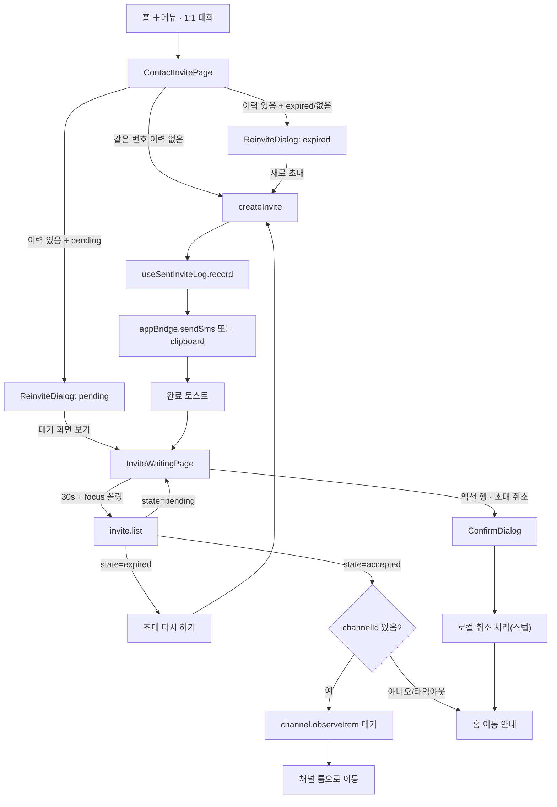
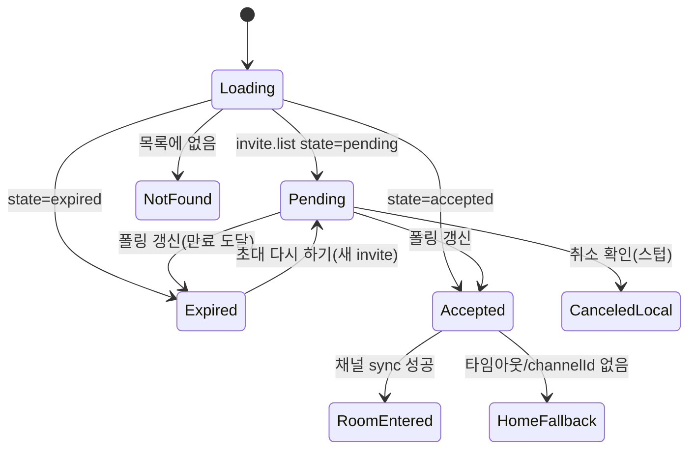

# Relay 1:1 초대 — 발신자 흐름 (Contact Invite Sender)

> 상태: Live · 최종 갱신: 2026-07-29 · 관련 ADR: [ADR-0033](../../../../../docs/adr/0033-relay-dm-invite-and-auth-parallel-tracks.md) · 로드맵: [relay-dm-invite-parallel-roadmap.md](../../../../../docs/plans/relay-dm-invite-parallel-roadmap.md) (Track B)

## 목적

홈 ＋메뉴의 "1:1 대화" placeholder(`HomePage.tsx`의 `handleCreateOneOnOne`)를 실제 흐름으로
교체한다: 연락처(이름+휴대폰) 입력 → relay 초대 발급(`invite.create`) → 딥링크를 SMS 작성기로
전달 → 초대 대기 화면에서 상대의 수락을 기다렸다가 실채널로 전환한다. 백엔드가 아직 갖추지 못한
액션(취소·거절 상태·자동 만료)은 ADR-0033 D1(인터페이스 선반영)에 따라 화면은 만들되 스텁으로
게이팅한다.

## 설계 원칙

- **상태 문구는 서버 `state`(`pending`/`accepted`/`expired`)로만 분기한다.** 에러 메시지 문자열
  파싱 금지 — 분기가 필요하면 `getSocketErrorCode`를 쓴다.
- **초대 코드는 자격증명이다.** URL 파라미터·로그·상태관리 devtools에 원문을 남기지 않는다.
  라우트는 코드가 아니라 `invite.id`(자격증명이 아닌 식별자)로만 파라미터화한다 — 대기 화면은
  `invite.get`(코드 필요) 대신 `invite.list`를 그 화면의 데이터소스로 쓴다.
- **백엔드 미지원 액션은 인터페이스만 선반영한다.** 버튼·다이얼로그·상태 뱃지는 디자인대로 만들되
  실제 서버 호출이 없는 자리는 `apps/web/src/app/features/invite/flags.ts`의 상수로 게이팅하고
  `// TODO(backend): 요청 N — ADR-0033 인터페이스 선반영` 주석을 남긴다. 백엔드 요청 목록(로드맵)
  번호와 항상 맞춰 추적한다.
- **번호 원문은 서버에 없다.** `MyInviteView`는 `last4`(뒷 4자리)만 돌려준다. 같은 번호 재초대
  감지·대기 화면 라벨은 로컬 발급 이력(`useSentInviteLog`)과 서버 뷰를 함께 봐서 판단한다.
- **유효시간은 서버 값만 렌더한다.** `expiredAt` epoch(ms)를 그대로 카운트다운에 쓰고, 카피에
  기간을 하드코딩하지 않는다(ADR-0033 D8 — 3일).
- **기존 프리미티브를 최우선으로 재사용한다.** 새 화면이라도 `web-ui-kit`에 이미 이 용도로 보이는
  컴포넌트가 있으면(`ChatRoomHeader`, `DateDivider`, `MessageInput`, `StatusBadge`, `TextField`,
  `BottomSheet`, `useInviteCountdown`) 새로 만들지 않는다.
- **발급은 메인유저만 한다.** 게스트는 폼에 도달하지 않고 인증 유도 화면에서 끊긴다
  ([ADR-0034](../../../../docs/adr/0034-inviter-phone-verification-guest-gate-and-sheet.md) — 상세는
  [phone-verification.md](../auth/phone-verification.md)). 클라 게이트는 UX이고 서버 403이 계약이라
  폴백 경로를 항상 남긴다.

## 범위

**포함**

- 연락처로 초대 페이지(신규 라우트, `HomePage.tsx`의 `handleCreateOneOnOne` 교체).
- 발급 → SMS 작성기 전달(웹 송신부 `appBridge.sendSms` 신설, 비네이티브 폴백은 클립보드 복사).
- 같은 번호 재초대 감지 다이얼로그(이미 보냄 / 이전 만료 두 실제 분기 + 거절 분기는 인터페이스만).
- 초대 대기 화면(신규 라우트) — 카운트다운, 폴링, 재발급, 취소(스텁), 수락 감지 후 채널 전환 시도.
- 홈 `ChannelList` + `PlaceChannelManagePage`에 초대 행 통합(상태 뱃지 포함).
- `apps/web/src/app/features/channels/`의 한국 번호 정규화/검증 로직을 공용 유틸로 추출해 재사용.

**제외**

- 초대 취소/거절 실 API 연동(백엔드 요청 1·2번 — 각각 스텁).
- "이미 1:1 대화가 있어요" 사전 감지 다이얼로그(ADR-0033 D2 — v1 미구현).
- 소셜 연동·전화번호 인증 UI(Track A/D 소관).
- desktop-web 전용 대응(ADR-0033 D6).
- `SocketManager`, 마이페이지 계정 화면(다른 트랙 소유 — 미접촉).

## 시나리오

### S1. 연락처로 신규 초대 발급 → SMS 전달 → 대기 화면

1. 홈 ＋메뉴 → "1:1 대화" → `ROUTES.invite.contact`로 이동. **게스트면 폼이 아니라 인증 유도
   화면이 뜬다**(ADR-0034) — 인증을 마치면 `isGuest`가 반응형으로 풀려 같은 화면이 폼으로 바뀐다.
2. 이름(최대 20자) + 휴대폰 번호(한국 형식) 입력. 형식 오류는 인라인 에러(Figma 3268-35795).
3. 제출 시 로컬 발급 이력(`useSentInviteLog.findByPhone`)에 같은 번호가 없으면 바로
   `useRelayInviteMutations().createInvite({ phone, name })` 호출.
4. 성공 응답(`MyInviteView` — `id`/`deeplink`/`last4`/`state`)을 `useSentInviteLog.record`로 기록.
5. `appBridge.sendSms([phone], message)`로 SMS 작성기를 연다(딥링크 프리필). 네이티브가 아니거나
   전송 실패 시 클립보드 복사로 폴백.
6. 완료 토스트 후 `ROUTES.invite.waiting(invite.id)`로 이동.

### S2. 같은 번호 재초대 — 아직 대기 중

1. S1의 3번 단계에서 로컬 이력에 같은 번호가 있고, 그 `inviteId`가 현재 `invite.list`에서
   `state === 'pending'`으로 확인됨.
2. 새로 발급하지 않고 재초대 다이얼로그("이미 초대를 보냈어요")를 띄운다 — 유일한 동작은 대기
   화면으로 이동. (같은 번호에 두 번째 pending 코드를 만들지 않는다 — 백엔드가 이전 코드를 자동
   실효시키지 않으므로, 만든다 해도 두 코드가 동시에 유효해져 혼란만 커진다.)

### S3. 같은 번호 재초대 — 이전 건 만료됨

1. 로컬 이력에 매치가 있지만 해당 invite가 만료됐거나(`state==='expired'`) 목록에서 더 이상
   보이지 않음(페이지 한도 밖 등).
2. 재초대 다이얼로그("이전 초대가 만료됐어요")를 띄운다. 확인 시 S1의 3번부터 그대로 진행(새
   초대 발급). 카피는 "이전 링크가 자동으로 만료된다"고 주장하지 않는다(백엔드 미지원 — 요청 3번).

### S4. 대기 화면 — 폴링 중 수락 감지

1. `InviteWaitingPage`가 마운트 중 `invite.list`를 창 포커스 시(react-query 기본) + 30초 간격으로
   재조회한다.
2. 대상 invite의 `state`가 `accepted`로 바뀌면: `channelId`가 이미 뷰에 있으면 로컬 채널 레코드
   동기화를 짧게 기다렸다가(`channel.observeItem` + 타임아웃) 방으로 이동. 타임아웃이거나
   `channelId`가 아직 없으면(백엔드 요청 5번 미확정) "곧 확인할 수 있어요" 안내 + 홈 이동 CTA로
   내린다.

### S5. 대기 화면 — 만료 후 재발급

1. `state === 'expired'`가 되면 상태 블록이 적색 "초대 링크가 만료되었습니다." + "초대 링크를 다시
   전송해보세요."로 바뀌고, 유효시간 카드의 남은 시간도 적색이 된다. 액션 행은 그대로 남는다.
2. 탭 시 로컬 이력의 이름/번호로 새 `createInvite` → 새 invite의 대기 화면으로 교체 이동
   (`replace`), 새 SMS 작성기도 다시 연다.

### S6. 대기 화면 — 취소(스텁)

1. 본문 액션 행의 "초대 취소" → 확인 다이얼로그(Figma 3263-30207). 디자인이 이 액션을 헤더
   `⋯` 메뉴가 아니라 유효시간 카드 아래에 두므로 드롭다운 항목은 두지 않는다.
2. 확인 시 실제 취소 API 호출 없음(요청 1번 미지원) — 로컬로만 이 invite id를 "취소함" 처리
   (`useLocallyCanceledInvites`)하고 취소 토스트(Figma 3413-18662) 후 홈으로 이동. 서버는 여전히
   `pending`으로 인지하므로 상대는 이론상 계속 수락할 수 있다 — "알려진 갭" 참고.

### S7. 리스트 통합

1. 홈 `ChannelList`(default 클라우드에서만)와 `PlaceChannelManagePage`(default 클라우드의
   place에서만)가 `useInviteListRows()`(= `useRelayInvites()` + `pending`/`expired` 필터 + 로컬
   취소 제외)로 각 invite를 한 행씩 추가 렌더. 행 탭 → 대기 화면(`ROUTES.invite.waiting`). 취소는
   목록에서 바로 하지 않고 대기 화면으로 유도한다(S6과 동일 경로로 일원화).
2. 뱃지: `pending` → `StatusBadge variant="pending"`("초대 대기 중"). `expired`와 서버에 아직 없는
   거절 상태는 같은 "초대 만료" 취급(요청 2번 미지원).

## 다이어그램

### 발신자 흐름 전체



### 대기 화면 상태 전이



## 상세 구현

### 핵심 파일

| 파일                                                                  | 역할                                                                                                                                                                                                      |
| --------------------------------------------------------------------- | --------------------------------------------------------------------------------------------------------------------------------------------------------------------------------------------------------- |
| `apps/web/src/app/features/channels/utils/koreanPhone.ts`             | `normalizeKoreanPhone`/`isValidKoreanPhone`/`formatKoreanPhone` 공용 유틸(기존 `InvitePage.tsx`·`AddFriendSheet.tsx` 중복 제거 후 재사용).                                                                |
| `apps/web/src/app/bridge/appBridge.ts`                                | `sendSms(phoneNumbers, message)` 추가 — `SendSms`/`OnSendSms`(`@chatic/app-messages`) 배선.                                                                                                               |
| `apps/web/src/app/hooks/useSentInviteLog.ts`                          | 로컬 발급 이력(zustand + localStorage). 계약: `record(invite, {phone,name})` / `findByPhone(phone)` / `findByInviteId(inviteId)`(구현 중 추가 — 대기 화면 재발급용 역조회, additive).                     |
| `apps/web/src/app/features/invite/flags.ts`                           | 백엔드 미지원 액션 게이팅 상수(취소·거절 상태·자동 만료 문구).                                                                                                                                            |
| `apps/web/src/app/features/invite/utils/inviteStatus.ts`              | `MyInviteStatus` → 목록 뱃지/재초대 변형 매핑 + `flags.ts` 불리언 → i18n 키 리졸버(`resolveExpiredReinviteDescriptionKey`, `resolveCancelDialogDescriptionKey`) — 플래그가 실제로 카피를 게이팅하는 지점. |
| `apps/web/src/app/features/invite/utils/inviteMessageCopy.ts`         | SMS 본문 조립(`ContactInvitePage`/`InviteWaitingPage` 재발급 공용).                                                                                                                                       |
| `apps/web/src/app/features/invite/utils/sendInviteMessage.ts`         | SMS 발송/클립보드 폴백 오케스트레이션.                                                                                                                                                                    |
| `apps/web/src/app/features/invite/hooks/useLocallyCanceledInvites.ts` | 취소 스텁 로컬 상태(localStorage id 집합).                                                                                                                                                                |
| `apps/web/src/app/features/invite/hooks/useInviteWaitingStatus.ts`    | 대상 invite 조회 + 30초 폴링(포커스 폴링은 `useRelayInvites` 기본 동작).                                                                                                                                  |
| `apps/web/src/app/features/invite/hooks/useAcceptedChannelSync.ts`    | 수락 감지 후 `channel.observeItem` 대기 + 타임아웃.                                                                                                                                                       |
| `apps/web/src/app/features/invite/hooks/useInviteListRows.ts`         | `useRelayInvites()` → `pending`/`expired` + 로컬 미취소 필터. `ChannelList`/`PlaceChannelManagePage` 공용 데이터소스.                                                                                     |
| `apps/web/src/app/features/invite/components/ReinviteDialog.tsx`      | 재초대 다이얼로그(3변형 — pending/expired/declined; declined는 오늘은 도달 불가).                                                                                                                         |
| `apps/web/src/app/features/invite/components/InviteChannelRow.tsx`    | 리스트 통합 공용 행(홈+관리 화면) — `ListRow` + `StatusBadge`로 조립.                                                                                                                                     |
| `apps/web/src/app/features/invite/pages/ContactInvitePage.tsx`        | 연락처 입력 → 발급/재초대 오케스트레이션.                                                                                                                                                                 |
| `apps/web/src/app/features/invite/pages/InviteWaitingPage.tsx`        | 대기/만료/수락/취소 화면.                                                                                                                                                                                 |
| `apps/web/src/app/features/invite/index.tsx`                          | `InviteRoutes` — `contact`, `:inviteId/waiting`.                                                                                                                                                          |
| `libs/web-ui-kit/src/foundations/badge/StatusBadge.tsx`               | `variant`에 `expired`(muted 톤) 추가 — "초대 만료"/거절 통합 뱃지에 재사용.                                                                                                                               |
| `apps/web/src/app/routes/paths.ts`                                    | `ROUTES.invite.contact` / `ROUTES.invite.waiting(inviteId)` 추가.                                                                                                                                         |
| `apps/web/src/app/routes/PrivateRoutes.tsx`                           | `invite/*` lazy 마운트.                                                                                                                                                                                   |
| `apps/web/src/app/features/home/pages/HomePage.tsx`                   | `handleCreateOneOnOne` → `navigate(ROUTES.invite.contact)`. `useInviteListRows()`를 default 클라우드에서만 `ChannelList`에 전달.                                                                          |
| `apps/web/src/app/features/home/components/ChannelList.tsx`           | `sentInvites`/`onSelectInvite` prop 추가, 실채널 목록 위에 `InviteChannelRow` 렌더.                                                                                                                       |
| `apps/web/src/app/features/place/pages/PlaceChannelManagePage.tsx`    | `selectedCloudId === 'default'`일 때만 `useInviteListRows()`를 가져와 관리 목록 위에 초대 행 추가(탭 → 대기 화면; 기존 다중선택/삭제 플로우와는 분리).                                                    |

### 라우팅

```ts
invite: {
    contact: '/invite/contact',
    waiting: (inviteId: string) => `/invite/${inviteId}/waiting`,
}
```

대기 화면은 초대 **코드**가 아니라 **id**로 파라미터화한다 — 코드는 자격증명(위 설계 원칙)이고,
발신자는 `invite.list`로 자기 invite들을 조회할 권한이 이미 있어 코드가 필요 없다.

### 리스트 통합 조건

`ChannelList`/`PlaceChannelManagePage` 모두 relay invite는 **default 클라우드**에서만 의미가
있다(1:1 DM은 `invite.create`에 `siteId`가 없어 place에 종속되지 않는다 — 커스텀 클라우드의
그룹 채널 초대와는 다른 개념). 두 화면 모두 `selectedCloudId === 'default'`일 때만 초대 행을
가져와 렌더한다.

### SMS 본문 조립

`sendInviteMessage(phone, body)`: `isNative()`이면 `appBridge.sendSms([phone], body)`를 시도하고
응답 `data.success`가 거짓이거나 브릿지가 거부하면 클립보드 복사로 폴백한다. 네이티브가 아니면
바로 클립보드. 두 경로 모두 호출부(`ContactInvitePage`/대기 화면의 재발급)가 결과에 따라 다른
토스트를 띄운다.

## 검증 방법

- 타입: `npx tsc --noEmit -p apps/web/tsconfig.app.json` — 클린(0 에러). 처음 실행 시 워크트리가
  한 번도 빌드된 적이 없어 라이브러리 프로젝트 레퍼런스(TS6305) 노이즈가 났었다 — `npx tsc
--build apps/web/tsconfig.app.json`로 참조 프로젝트를 한 번 빌드하면 사라진다(신규
  워크트리에서 한 번만 필요).
- 단위 테스트: `npx jest --config apps/web/jest.config.js --runInBand --watchman=false` — apps/web
  전체 109 스위트 690개 통과. `libs/web-ui-kit`도 전체 56 스위트 215개 통과(`StatusBadge` 변형 추가).
- eslint: 변경 파일 44개 전체 0 에러/0 경고.
- 수동(dev 스테이지 필요, 미실행): 2계정으로 발급 → SMS 딥링크 열기(Track C 영역) → 수락 →
  발신자 대기 화면이 폴링으로 accepted를 감지하는지.

## 알려진 갭 (백엔드 미지원 — ADR-0033 인터페이스 선반영)

- **취소는 로컬 전용이다(요청 1번)**: 대기 화면에서 "초대 취소"를 확인하면 이 기기에서만 숨겨질
  뿐 서버는 여전히 `pending`으로 인지한다 — 상대는 이론상 계속 수락할 수 있다. 확인 다이얼로그의
  설명 카피는 이미 `INVITE_CANCEL_API_SUPPORTED`로 게이팅돼 있어(오늘은 "로컬에서만 사라진다"는
  솔직한 문구) 실 API가 생기면 플래그를 뒤집고 `useLocallyCanceledInvites` 대신 실제
  `invite.cancel` 호출로 교체하면 된다(`resolveCancelDialogDescriptionKey`).
- **채널 회수 타이밍 미확정(요청 5번)**: `accepted` 이후 `channelId`가 언제 채워지는지 백엔드가
  아직 확정하지 않아, 대기 화면의 "실채널 전환"은 최선 노력이다(`useAcceptedChannelSync`의 짧은
  로컬 동기화 대기 + 홈 폴백). 확정되면 그 훅만 교체한다.
- **재초대 시 이전 pending 미실효(요청 3번)**: 카피를 "자동 만료" 대신 사실 그대로 썼다.
  `INVITE_AUTO_REVOKE_ON_REISSUE_SUPPORTED`가 뒤집히면 `resolveExpiredReinviteDescriptionKey`가
  자동으로 "자동 만료" 카피를 고른다(코드 변경 없음).
- **"초대 거절" 상태 없음(요청 2번)**: `resolveInviteRowBadge`/`resolveReinviteVariant` 모두
  `expired`로 흡수한다. `ReinviteDialog`의 `declined` 카피는 준비돼 있지만 오늘은 어떤 리졸버도
  선택하지 않는다.
- **`invite.list` 기본 10건 한도**: `useRelayInvites`가 `limit`을 보내지 않아 서버 기본값
  10건에 갇히고, 재초대 감지·리스트 통합·대기 화면 모두 그 첫 페이지만 본다. **실패 방향은
  "이력 없음"이 아니다** — `findByPhone`는 로컬 이력(`useSentInviteLog`)을 읽으므로 이력 자체는
  항상 잡히고, 그다음 `invites.find(...)`가 못 찾아 `resolveReinviteVariant(undefined)`가
  `'expired'`로 떨어진다. 즉 **아직 pending인 초대를 "이전 초대가 만료되었어요"로 오안내하고
  재발급을 유도**해, 같은 번호에 유효한 코드가 둘 생긴다(요청 3번이 없으므로 이전 것이 죽지
  않는다). 대기 화면도 같은 목록에서 찾으므로 밀려난 invite는 "초대 정보를 찾을 수 없어요"로
  보인다. `InviteListInput`에 커서·오프셋이 없어 진짜 페이징은 불가능하고 `limit`이 유일한
  수단이다 — 아직 적용하지 않았다.
