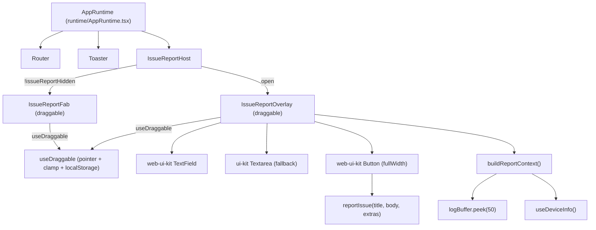
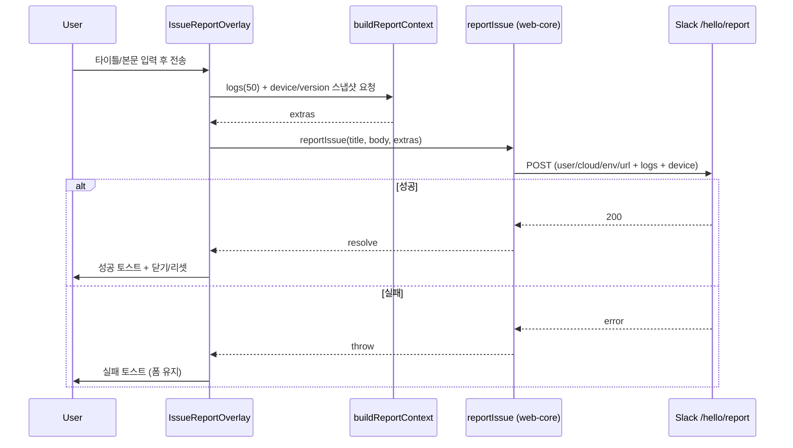

# issue-report

> 상태: Live · 최종 갱신: 2026-07-16 · 관련 ADR: [ADR-0017](../../../../../docs/adr/0017-issue-report-floating-widget.md)
>
> 대상: `apps/web/src/app/features/issue-report` (신규)

## 목적

전 유저가 앱 어디서든 버그/이슈를 신고할 수 있게 한다. 우하단에 상주하는 드래그 가능한 플로팅 버튼을 누르면 위치 이동 가능한 오버레이 폼이 열리고, 타이틀·본문과 함께 **최근 로그 50개 + 디바이스/웹 상태를 자동으로 조합**해 전송한다. 목표는 "사용자가 상황을 길게 설명하지 않아도, 재현에 필요한 컨텍스트가 리포트에 자동으로 붙는 것"이다.

## 설계 원칙

- **기존 자산 재사용 우선.** 전송(`reportIssue`), 로그 버퍼(`logBuffer`), 디바이스 정보(`useDeviceInfo`), 드래그 패턴(`MiniPanel`), 설정 영속화(`usePreferenceStore`)를 새로 만들지 않고 재사용/확장한다.
- **UI는 web-ui-kit, 컨테이너만 커스텀.** 드래그 가능한 플로팅 컨테이너는 web-ui-kit에 대응물이 없어 자체 구현하되, 그 안의 버튼·입력은 web-ui-kit 컴포넌트로 채운다. 순수 프리미티브가 없는 멀티라인 입력만 `@chatic/ui-kit` Textarea로 폴백한다(web-ui-kit는 ui-kit 상위 계층이라 정합적).
- **웹/네이티브 공통.** `isNative()`로 분기하되 v1 기능(폼·로그·상태·전송)은 플레인 웹에서도 100% 동작한다.
- **전송 실패는 조용히 삼키지 않는다.** 성공/실패를 토스트로 알린다(기존 `ReportIssueDialog` 관례 유지).
- **컨텍스트 수집은 순수 함수로.** 로그/상태 스냅샷 조합은 React 밖에서 테스트 가능한 순수 함수로 분리한다.

## 범위

**포함 (v1)**

- 우하단 드래그 가능 플로팅 버튼(FAB), 위치 localStorage 영속.
- 드래그 가능 오버레이 폼: 타이틀(TextField) + 본문(Textarea) + 전송(FloatingButton).
- 전송 시 로그 50개 + 디바이스/버전/온라인/뷰포트 상태 자동 첨부(`reportIssue` 확장).
- FAB 숨김 기능 + MyPage 설정에서 복구 토글(`usePreferenceStore`).
- 유닛 테스트(드래그/클램프/클릭판정, 컨텍스트 조합/트렁케이션, 프리퍼런스).

**제외 (→ Phase 2 / 별도 작업)**

- **스크린샷 첨부 전송** — 캡처(네이티브 photo library/camera picker + 웹 input 폴백)와 이미지 호스팅 전송 경로(백엔드 엔드포인트 신설, 크로스팀)가 필요. ADR-0017 참조.
- 로그 민감정보 스크러빙(v1은 감수).
- 전용 이슈 트래킹 목적지(v1은 기존 Slack `/hello/report` 유지).

## 시나리오

1. **신고하기 (플레인 웹/네이티브 공통)**
    - 유저가 우하단 플로팅 버튼을 탭 → 오버레이 폼이 마지막 위치에 열린다.
    - 타이틀·본문 입력 → "전송" 탭.
    - 제출 순간 `logBuffer.peek(50)`와 디바이스/버전/온라인/뷰포트 스냅샷을 조합해 `reportIssue(title, body, extras)` 호출.
    - 성공 시 성공 토스트 + 폼 리셋·닫힘, 실패 시 실패 토스트(폼 유지).

2. **위치 옮기기**
    - FAB 또는 오버레이 헤더(핸들)를 드래그 → 이동, 뷰포트 밖으로 나가지 않게 클램프.
    - 포인터 업 시 위치를 localStorage에 저장 → 다음 방문/재렌더에도 유지.
    - 창 리사이즈 시 저장 위치가 화면 밖이면 다시 안으로 클램프.

3. **버튼 숨기기 / 복구**
    - 오버레이 안의 "숨기기"로 FAB를 감춘다 → `issueReportHidden` 프리퍼런스 `true` 저장, FAB 미렌더.
    - MyPage 설정의 "이슈 신고 버튼" 스위치를 켜서 복구 → FAB 다시 렌더.

4. **드래그 vs 클릭 구분**
    - FAB는 드래그도 되고 클릭도 된다. 포인터 이동량이 임계값(≈5px) 미만이면 클릭(오버레이 열기), 이상이면 드래그로 판정해 클릭을 무시한다.

## 다이어그램

### 컴포넌트/마운트 구조



### 제출 시퀀스



## 상세 구현

### 디렉터리 (신규)

```
apps/web/src/app/features/issue-report/
├─ IssueReportHost.tsx           # 마운트 진입점: 숨김 게이트 + FAB/오버레이 오케스트레이션
├─ components/
│  ├─ IssueReportFab.tsx         # 드래그 가능 플로팅 버튼 (web-ui-kit IconButton)
│  └─ IssueReportOverlay.tsx     # 드래그 가능 폼 패널 (TextField + Textarea + FloatingButton)
├─ hooks/
│  └─ useDraggable.ts            # 포인터 드래그 + 뷰포트 클램프 + localStorage 영속 + 클릭 판정
├─ lib/
│  ├─ buildReportContext.ts      # 로그50 + 디바이스/버전/온라인/뷰포트 조합 (순수 함수)
│  └─ serializeLogs.ts           # LogEntry 안전 직렬화 + 크기 트렁케이션
├─ index.ts
└─ *.test.ts(x)
```

### 핵심 파일과 역할

- **`IssueReportHost.tsx`** — `AppRuntime`(`apps/web/src/app/runtime/AppRuntime.tsx:37-51`, `<Router/>`·`<Toaster/>`와 형제)에 마운트한다. `app.tsx` 레벨(`DebugOverlayHost`와 같은 부팅-행 대응 위치)이 아니라 AppRuntime 안에 두는 이유: 이 위젯은 부팅 진단 도구가 아니라 유저 기능이고, 토스트(`Toaster`, `AppRuntime.tsx:50`)와 세션 컨텍스트가 준비된 뒤 노출되면 충분하기 때문. `usePreferenceStore(s => s.issueReportHidden)`가 `true`면 FAB를 렌더하지 않는다. 오버레이 open 상태를 보유한다.
- **`components/IssueReportFab.tsx`** — `useDraggable('issue-report:fab', 우하단 기본좌표)`로 위치를 관리하는 `position:fixed` 원형 버튼. web-ui-kit `IconButton`(`libs/web-ui-kit/src/foundations/button/IconButton.tsx`) + `IconChatBubble`/`IconAlert`(`libs/web-ui-kit/src/resources/icons`). 드래그가 아니었을 때만 `onOpen()` 호출(클릭 판정은 훅이 제공).
- **`components/IssueReportOverlay.tsx`** — `useDraggable('issue-report:overlay', 중앙 기본좌표)`로 이동하는 플로팅 패널. 헤더가 드래그 핸들(`MiniPanel.tsx:60-66`의 `cursor-move select-none touch-none` 패턴). 본문은 2필드뿐이라 `react-hook-form` 대신 controlled `useState`로 관리(커스텀 controlled `TextField`와 정합): web-ui-kit `TextField`(타이틀, `value`/`onChange(string)`) + `@chatic/ui-kit` `Textarea`(본문, web-ui-kit에 멀티라인 없음) + web-ui-kit `Button`(전송, `variant="solid" tone="green" fullWidth loading`) + `useToast`(`@chatic/ui-kit`). 제출은 `buildReportContext({deviceInfo, versionInfo})` → `reportIssue(title, body, extras)` → 성공 시 토스트·리셋·`onClose`, 실패 시 `logger.error('ISSUE_REPORT', ...)` + destructive 토스트(폼 유지). 하단 "숨기기"는 `setIssueReportHidden(true)` + `onClose`.
- **`hooks/useDraggable.ts`** — `MiniPanel.tsx:30-52`의 포인터 드래그 + `clampToViewport`를 추출·일반화. 시그니처: `useDraggable(storageKey, getDefault) → { ref, position, dragHandlers, didDrag }`. 기능: (1) 마운트 시 localStorage 복원 후 클램프, (2) 포인터 업 시 localStorage 저장, (3) `resize` 리스너로 재클램프, (4) 포인터 이동량 < `DRAG_THRESHOLD_PX`(6)면 `didDrag()=false`로 클릭 허용. **뷰포트 방어**: `getViewportSize()`가 `window.innerWidth || document.documentElement.clientWidth`로 읽고, 0×0(레이아웃 전 WebView/headless)일 때 `clampToViewport`는 위치를 그대로 두어 (0,0) 붕괴를 막는다. 컴포넌트의 기본 좌표 계산도 0일 때 375×812로 폴백.
- **`lib/buildReportContext.ts`** — `{ logs: serializeLogs(logBuffer.peek().slice(-50)), device, version, online: navigator.onLine, viewport, path }` 반환. **주의**: `logBuffer.peek()`는 FIFO(오래된 것부터)라 "최근 50개"는 전체를 peek해 `slice(-50)`로 꼬리를 취한다(`peek(50)`은 가장 오래된 50개가 되어 오답). 버퍼가 50개 미만이면 있는 만큼만 담긴다. `logBuffer`는 `@chatic/bridges` 재노출(`libs/logger/src/logger.ts:44`). `device`/`version`은 호출부가 `useDeviceInfo()`로 읽어 인자로 넘긴다(순수성 유지).
- **`lib/serializeLogs.ts`** — `LogEntry`(`{level,tag,message,data,error,timestamp}`)를 안전 직렬화: `data`/`error`는 순환참조·비직렬화 값 방어 후 문자열화, 항목당·전체 문자 예산으로 트렁케이션(payload 비대화 방지, ADR 리스크 대응).

### 기존 파일 변경

- **`libs/web-core/src/api/common.ts:125`** — `reportIssue(title, message)` → `reportIssue(title, message, extras?: IssueReportExtras)`로 **하위호환 확장**. `extras`(logs/device/version/online/viewport)를 기존 `payload` 객체에 병합해 `JSON.stringify`(`common.ts:162`)로 전송. 목적지·서명요청 흐름(`common.ts:167-172`)은 불변. 기존 `ReportIssueDialog`의 2-인자 호출은 그대로 유효.
- **`libs/web-core/src/api/types.ts`** — `IssueReportExtras` 타입 추가.
- **`apps/web/src/app/stores/preferenceKeys.ts:44`** — `issueReportHidden: { strategy: 'local', localKey: 'chatic-issue-report-hidden', defaultValue: 'false' }` 추가. `local` 전략이라 네이티브 브릿지/`PreferenceKey`(app-messages) 변경 불필요, `PreferenceLoader`의 `MANAGED_KEYS`도 무변경.
- **`apps/web/src/app/stores/usePreferenceStore.ts`** — `issueReportHidden: boolean` 상태 + `setIssueReportHidden(value)` 액션 추가(`setBlurLastMessage`, `usePreferenceStore.ts:130-133` 패턴 그대로).
- **`apps/web/src/app/runtime/AppRuntime.tsx`** — `<IssueReportHost />` 마운트(Router 형제).
- **`apps/web/src/app/features/mypage/pages/MyPage.tsx:160`** — 설정 `MenuCard`에 `ListRow`+`Switch` 추가(`MyPage.tsx:166-169` 패턴): 켜짐=표시, 꺼짐=숨김.

### i18n

번역 리소스는 서버 호스팅(`/locales/{{lng}}/{{ns}}.json`, `apps/web/src/i18n/index.ts:54`)이라 프론트 레포에 문자열이 없다. 신규 키(`issueReport.*` — title/body 라벨·플레이스홀더·submit·success·failed·hide, `mypage.issueReportButton`)를 **번역 리소스에 추가하는 것은 별도(서버) 작업**이며, 코드는 `t()`로 참조만 한다. 리소스 반영 전까지는 `fallbackLng` 문자열이 노출된다.

## 검증 방법

- **유닛 테스트** (ts-jest, `*.test.ts(x)` — 리포 관례, 4 스위트 54 케이스):
    - `hooks/useDraggable.test.tsx`: 기본/저장 위치 복원, 손상값 폴백, 클릭 vs 드래그 임계값, 드래그 시 localStorage 저장.
    - `lib/serializeLogs.test.ts`: 순환참조·Error 직렬화, 필드/총량 트렁케이션.
    - `lib/buildReportContext.test.ts`: 스냅샷 형태, 버퍼>50일 때 최근 50개(꼬리)만 포함.
    - `stores/usePreferenceStore.test.ts`(확장): `issueReportHidden` 기본값/토글/localStorage, native에서도 브리지 미저장(`local` 전략).
    - 실행: `cd apps/web && npx jest src/app/features/issue-report src/app/stores/usePreferenceStore.test.ts`
- **엔드투엔드(브라우저) 확인 완료**: dev 서버(vite, 375×812)에서 FAB 우하단 렌더 → 탭하여 오버레이 열림 → 타이틀/본문 입력 시 전송 버튼 활성 → 제출 시 `https://…/dou-d1/hello/report`로 POST. 캡처한 payload에 `logs`(최근 20개, 버퍼 크기만큼), `device`, `version`, `online`, `viewport{375,812}`, `path` 포함 확인. 성공 시 오버레이 닫힘/리셋.
- **수동 추가 확인 포인트**: 드래그 후 새로고침 시 위치 유지, MyPage 토글로 숨김/복구, 네이티브 웹뷰. i18n은 서버 호스팅 리소스라 `issueReport.*` 키가 리소스에 추가되기 전까지 폴백(키 문자열)이 노출된다.
