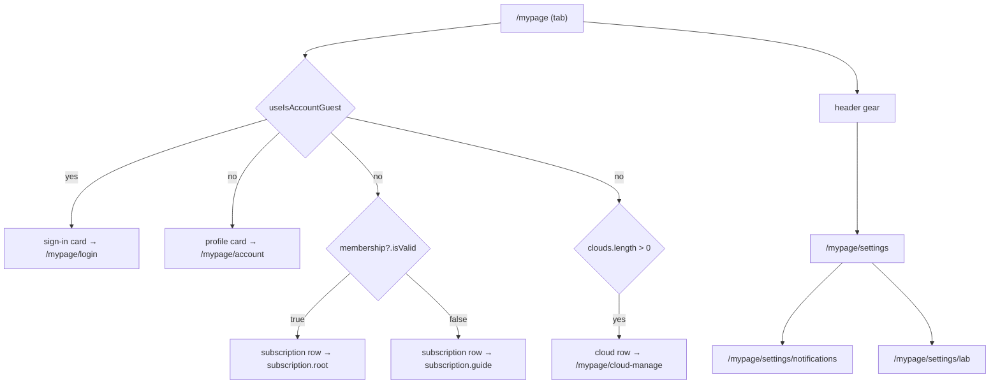

# mypage — the account hub and everything one depth below it

`apps/web/src/app/features/mypage` owns the MY tab and the tree behind it: **14 pages** across three
depths, from the identity card at `/mypage` down to policy text and the developer Lab. It is the
app's settings surface, and it is also where three different kinds of profile meet — which is the
single thing most likely to be got wrong here.

The feature holds no session and no repository of its own. Every read is a hook from `app/hooks/` or
[`@chatic/app-runtime`](../../../../../libs/app-runtime/README.md); the chrome around it — the
floating nav, safe areas, keyboard insets — belongs to
[architecture/layout-shell.md](../../shell/layout-shell.md).

## Layout

```text
apps/web/src/app/features/mypage/
├── index.tsx      the barrel — components, hooks, pages, routes
├── routes/        15 routes under /mypage (14 of the pages here, plus feedback's)
├── pages/         14 — MyPage, SettingsPage, and the depths below them
├── components/    6 — AccountLinkSection, AppIconSelectSheet, LanguageSelectSheet,
│                      LogoutDialog, SocialProviderIcons, WithdrawalDialog
├── hooks/         5 — useAppIcon, useUpdateProfile, useDevicePushMute, useSocialLinks, useDeleteCloud
├── consts/        policy content re-exports
└── flags.ts       SOCIAL_UNLINK_ENABLED — one boolean, waiting on a backend packet
```

### The three depths

| Page                                                            | Route (`ROUTES.mypage.*`)        | What it is                                      |
| --------------------------------------------------------------- | -------------------------------- | ----------------------------------------------- |
| `MyPage`                                                        | `/mypage`                        | the tab — identity, subscription, clouds        |
| `LoginPage`                                                     | `/mypage/login`                  | sign-in, reached when a guest taps the hub card |
| `AccountInfoPage`                                               | `/mypage/account`                | account hub — edit, social links, withdrawal    |
| `ProfileEditPage`                                               | `/mypage/edit`                   | the account (relay) profile: name and photo     |
| `CloudProfileEditPage`                                          | `/mypage/cloud-profile`          | the cloud **entity's** name, owner-only         |
| `CloudManagePage`                                               | `/mypage/cloud-manage`           | owned clouds — rename, release, recovery email  |
| `WithdrawalPage`                                                | `/mypage/withdrawal`             | account deletion                                |
| `SettingsPage`                                                  | `/mypage/settings`               | device and app preferences, version, logout     |
| `NotificationSettingsPage`                                      | `/mypage/settings/notifications` | push mute and message preview                   |
| `LabPage`                                                       | `/mypage/settings/lab`           | experiments, and the hidden debug unlock        |
| `PolicyListPage` · `TermsPage` · `PrivacyPage` · `LicensesPage` | `/mypage/policy/*`               | the legal text                                  |

`/mypage` is the only one of these the floating nav appears on: `UnifiedLayout` matches that path
exactly, so every depth below it is nav-free without needing its own opt-out.

## Responsibilities

**In** — the hub's rows and their state branches, the settings tree, the account profile editor,
cloud management, and the policy screens.

**Out** —

- **The feedback screen.** Its URL is `/mypage/feedback` and its route is declared here, but the
  page belongs to [feedback](../feedback/README.md).
- **The debug panel.** Lab hosts the unlock gesture; [debug](../debug/README.md) owns the gate and
  everything behind it.
- **Logout itself.** The row opens a dialog and navigates to `ROUTES.auth.logout`;
  [auth](../auth/README.md)'s `LogoutPage` does the cache teardown and session end.
- **Social link detail.** [account](../account/README.md) is the canon; `useSocialLinks` here is the
  screen's orchestration only.
- **Place profiles.** Editing your nickname inside a place is [home](../home/README.md)'s overlay.
- **Subscription screens.** The row routes into [subscription](../subscription/README.md).

## The shared contract

### Three profiles meet here, and only one of them is "your profile"

This is the section to read before touching anything on these screens.

| What                  | Where it is edited                 | Scope                                        |
| --------------------- | ---------------------------------- | -------------------------------------------- |
| **Account profile**   | `ProfileEditPage` (`/mypage/edit`) | the relay account — name, photo, email       |
| **Cloud entity name** | `CloudProfileEditPage`             | the cloud organization itself                |
| **Place profile**     | home's `PlaceProfileEditDialog`    | your nickname and thumbnail inside one place |

The hub's card, the header name and everything `/mypage/account` leads to are the **first** one, and
it is always the relay account's — the same record whichever cloud is connected.

Its source is the stored relay token, not the user cache, and that is deliberate. A cloud session
mints a different uid on a different backend, and the cache is physically keyed
`${type}:${cid}:${uid}:${id}` with a read path that ignores context overrides — so while a cloud is
active, the relay `user` row cannot be read back at all. `useMyUser()` reads the token;
`useUpdateProfile()` writes through `user.update` pinned to the relay slot and patches the server's
response back into that token. **Read and write share one scope**, which is the invariant an earlier
attempt inside the data layer could not hold — see [place](../place/README.md) for that history.

### The hub asks about the account; the settings depth asks about the session

`useIsAccountGuest()` is what the hub branches on. Every row on it is account-scoped — your profile,
your subscription, the clouds you own — so it must answer for the same subject the header name shows.
`runtime.session.useRuntimeProfile().isGuest` answers a different question: what the **currently
connected cloud's delegated user** is allowed to do. Use that one on a hub row and a signed-in person
sees a "sign in" card the moment they enter a cloud.

`SettingsPage`'s logout row still gates on `useRuntimeProfile().isGuest`. The two can disagree while
a cloud session is active, so that is the hook to look at first if the logout row goes missing for
someone who is plainly signed in.



### Two rows change their destination, not their label

- **Subscription.** The label is the same either way; `membership?.isValid` decides between the
  membership screen and the guide. Someone who has never subscribed wants to be told what a cloud
  is, not shown an empty plan screen. `useMembershipInfo()` is a react-query result, so the check is
  `membership?.isValid === true`, not a bare boolean on the hook.
- **Version.** It goes to the store **only when an update is actually pending**, and the
  up-to-date / update-available label shows on iOS only, because Android has no live-version source
  and a label there would be a guess. Otherwise the row is inert — it is informational and carries
  no hidden action.

### The cloud row is gated on ownership, not on being connected

`useCloudSessionCatalog().clouds.length > 0`. The obvious-looking alternative, `isCloudActive`,
means "currently switched into a non-default cloud", and gating on it hides the only release path
for exactly the people who need it: someone over their allowance after a downgrade (deep-linked here
from the subscription banner), and a lapsed subscriber whose leftover clouds still need deleting —
both of whom are sitting on the default home, not inside a cloud.

Invited clouds are absent from that catalog on purpose. You cannot release someone else's cloud, so
being a member of one must not summon the row.

### The unlock moved off the version row

Tapping the app version ten times used to open the debug gate, which meant one row had to be both a
store link and a hidden gesture — and a tap that navigates to the store can never complete a ten-tap
count. The gesture now lives on `LabPage`, on the flask icon inside the intro card: `aria-hidden`,
`tabIndex={-1}`, advertised nowhere. `useDebugUnlock(config.get('debug.entryCode'))` owns the
counting and the code challenge; see [debug](../debug/README.md).

Once unlocked, Lab shows a single destructive row that opens the panel at full size.

### UI comes from web-ui-kit, and missing pieces are added there first

`MenuCard` (rounded card with an optional section header), `ListRow` (leading/trailing/subtitle
slots), `Switch`, `IconChevronRight`, `IconSettings` — all from
[`@chatic/web-ui-kit`](../../../../../libs/web-ui-kit/README.md). `PageHeader` is the app's own, from
`ui/components`. When a screen needs a primitive the design system lacks, it is defined in the
library first and imported, never written locally and never reached for through `@chatic/ui-kit`.

**Scrolling is the page's own job.** None of these screens use a fixed-height layout with an inner
scroller; each is `overflow-y-auto`. `/mypage` clears the floating nav with `BottomNavSpacer` at the
end of its content rather than padding on the container, and the depths need only a tail padding
because they have no nav.

## Usage

The feature exports its route table; the router mounts it under `/mypage/*`.

```tsx
<MyPageRoutes />
```

Screens read state through hooks and never touch a core object:

| Need                     | Hook                                              |
| ------------------------ | ------------------------------------------------- |
| Account guest-ness       | `useIsAccountGuest()`                             |
| Account profile          | `useMyUser()` — `name`, `email`, `photo`, `link$` |
| Subscription             | `useMembershipInfo()`                             |
| Owned clouds             | `useCloudSessionCatalog()` / `useClouds()`        |
| Selected cloud           | `runtime.session.useSessionSelection()`           |
| Active cloud permissions | `runtime.session.useRuntimeProfile()`             |
| Push mute                | `useDevicePushMute()`                             |

### What not to do

- **Do not branch a hub row on `useRuntimeProfile().isGuest`.** See above.
- **Do not add a settings row to `/mypage`.** The tab is an identity screen; the gear exists so it
  can stay short. A device or app preference goes in `SettingsPage`.
- **Do not give the version row a side effect again.** It is informational unless an update is
  pending.
- **Do not write the account profile through the active cloud's facade.** `useUpdateProfile` is
  relay-pinned, and it does not write the repository cache either — a relay row written while a
  cloud is active could never be read back.
- **Do not put a hardcoded colour or a local card component on these screens.** Add it to
  web-ui-kit.

## Notes for implementers and tests

- **Seven specs cover this feature**, and they cover the hooks rather than the screens: `useAppIcon`,
  `useDevicePushMute`, `useSocialLinks`, `useUpdateProfile`, plus `AccountLinkSection`,
  `CloudManagePage` and `LoginPage`. The pages themselves are checked in the browser preview.

    ```bash
    npx jest --config apps/web/jest.config.js features/mypage
    ```

- **The account-guest rule cannot be exercised from a guest boot.** Every boot rewrites the relay
  token through guest keepAlive, so a seeded signed-in storage state is overwritten. The judgement
  itself is unit-tested in
  [`useMyUser.test.ts`](../../../src/app/hooks/useMyUser.test.ts) (roles, missing relay session, no
  role assigned); the on-screen behaviour while a cloud is connected needs a real account.
- **`useDevicePushMute` has no read endpoint behind it.** The displayed state is the `ui.pushMuted`
  config key ([`@chatic/config`](../../../../../libs/config/README.md)); each toggle writes
  optimistically, sends `device.update-remote`, then reconciles to the server's echo or rolls back
  with a toast. Outside a native shell the toggle is disabled rather than allowed to 404.
- **`SOCIAL_UNLINK_ENABLED` in `flags.ts` is false and stays false** until an unlink packet exists.
  The control renders disabled rather than claiming a success it cannot deliver. `AccountLinkSection`
  additionally hides itself when `link$` reads `'unknown'` — an account-security control that can
  lie is worse than one that admits it does not know.
- **`CloudProfileEditPage` is reachable only from `CloudManagePage`**, behind the pencil on a cloud
  you own. The account tree deliberately does not link it: a cloud's name is not an account
  attribute. It redirects non-owners out on its own rather than trusting the caller.

## Further reading

- [architecture/layout-shell.md](../../shell/layout-shell.md) — the nav, safe areas and
  keyboard insets these screens sit inside.
- [account](../account/README.md) — social links and the account-credential story.
- [debug](../debug/README.md) · [feedback](../feedback/README.md) — the two features Lab and
  Settings hand off to.
- [subscription](../subscription/README.md) — where the subscription row goes.
