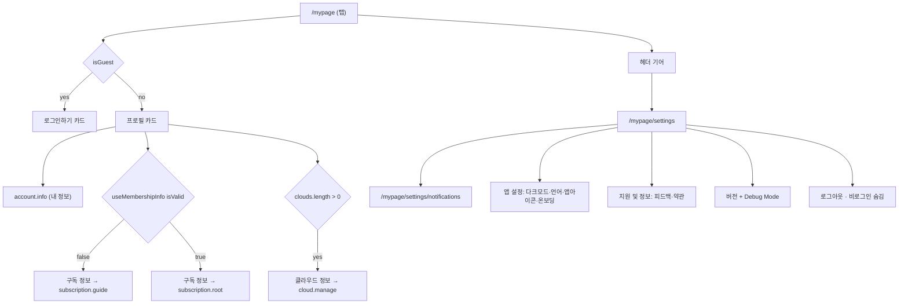

# mypage

> 상태: Live · 최종 갱신: 2026-08-27 · 관련 ADR: [ADR-0011](../../../../../docs/adr/0011-web-layout-shell-and-floating-bottom-nav.md)
>
> 대상: `apps/web/src/app/features/mypage`
>
> 하단 네비게이션·셸은 [architecture/layout-shell](../../architecture/layout-shell.md)이 소유한다(MyPage는 더 이상 네비를 직접 렌더하지 않는다).

## 책임

내 계정·정책 설정 허브다. 프로필/계정 관리, 클라우드 프로필 편집, 탈퇴, 약관·정책 표시를 담당한다. 개발자 도구는 별도 [debug](../debug/README.md) feature로 분리됐다.

## 화면

| 페이지                                       | 경로(`ROUTES.mypage.*`)          | 설명                                                                       |
| -------------------------------------------- | -------------------------------- | -------------------------------------------------------------------------- |
| `MyPage`                                     | `/mypage`                        | 허브 — 프로필·구독·클라우드 카드(아래 [허브 depth 분리](#허브-depth-분리)) |
| `SettingsPage`                               | `/mypage/settings`               | 기기·앱 설정 depth — 알림/앱 설정/지원 및 정보 + 버전 + 로그아웃           |
| `NotificationSettingsPage`                   | `/mypage/settings/notifications` | 푸시 알림·메시지 미리보기 토글                                             |
| `AccountInfoPage`                            | `/mypage/account`                | 계정 정보 + [소셜 연동](../account/social-links.md)                        |
| `CloudManagePage`                            | `/mypage/cloud-manage`           | 클라우드 관리 — 보유 클라우드 목록 + 복원용 이메일 등록 + 삭제             |
| `ProfileEditPage`                            | `/mypage/edit`                   | 기본 클라우드(relay) 프로필 편집                                           |
| `CloudProfileEditPage`                       | `/mypage/cloud-profile`          | 클라우드 프로필(이름) 편집                                                 |
| `WithdrawalPage`                             | `/mypage/withdrawal`             | 회원 탈퇴                                                                  |
| `TermsPage` / `PrivacyPage` / `LicensesPage` | `/mypage/policy/*`               | 약관·개인정보·라이선스                                                     |

## 허브 depth 분리

허브는 Figma(node `3293-39607` MY 루트 / `4472-75227` 설정 목록) 기준으로 **두 depth**다. 계획 문서: [docs/plans/mypage-depth-split.md](../../../../../docs/plans/mypage-depth-split.md).

- **`/mypage`(탭)** — 정체성만: 프로필 카드 + 구독 정보 + 클라우드 정보. 헤더는 좌측 "MY" 타이틀 + 우측 기어(`IconSettings`).
- **`/mypage/settings`(depth)** — 기기·앱 설정 전부. `UnifiedLayout`의 `BOTTOM_NAV_PATHS`가 `/mypage` 정확 일치라 이 depth에는 플로팅 네비가 없다(추가 설정 불필요).
- **`/mypage/settings/notifications`(depth)** — 푸시 알림·메시지 미리보기 토글. 설정 목록의 "알림 설정 >" 행이 함의하는 목적지로, 이 화면 자체의 Figma는 아직 없다(디자인 확정 시 행 구성 재검토).

허브 상단 프로필은 **계정(account) 프로필**(아바타·이름·이메일)을 표시한다 — 클라우드/사이트 프로필과 구분(아래 [세 종류의 프로필](#세-종류의-프로필)). 카드를 누르면 `account.info`(내 정보)로 간다: 루트에서 "내 정보" 행이 사라졌으므로 소셜 연동·탈퇴로 가는 유일한 입구다.

### 상태 분기

인증(`isGuest`)과 구독(`useMembershipInfo().isValid`)으로 분기한다. **무료 구독 D-N(잔여일) 상태는 이번 범위 제외** — 서버에 "현재 체험 중" 신뢰 플래그가 없어 보류(→ [리스크](#리스크와-미지수-임시)).

| 상태             | 조건                   | 루트(`/mypage`) 구성                                         |
| ---------------- | ---------------------- | ------------------------------------------------------------ |
| **비로그인**     | `isGuest`              | "로그인하기" 카드만. 구독/클라우드 카드 없음                 |
| **구독 미가입**  | `!isGuest && !isValid` | 프로필 + 구독 정보(→ `subscription.guide`) + (클라우드 정보) |
| **구독 이용 중** | `!isGuest && isValid`  | 위와 동일, 구독 정보가 `subscription.root`로 간다            |

라벨은 두 경우 모두 **"구독 정보"**로 고정이고(디자인), 분기하는 것은 목적지뿐이다: 구독자는 자기 멤버십을, 한 번도 구독한 적 없는 사람은 클라우드가 뭔지 알려주는 가이드를 원하기 때문이다.

설정 depth는 게스트에게도 열려 있다(피드백은 미인증 세션도 받는다 — ADR-0047). 로그아웃 카드만 `!isGuest` 게이트다.

> 구독 상태 단일 원천은 `useMembershipInfo()`([web-core](../../../../../libs/web-core/src/hooks/subscription/index.ts)). 플랫폼 매칭을 강제하는 `useIsSubscriptionAvailable()`은 웹에서 부적합하므로 쓰지 않는다.

### 카드 구조

**루트(`/mypage`)** — 좌우 16px 마진, 카드 사이 18px:

1. **프로필** — 아바타 60px + 이름 + 이메일, `→ ROUTES.mypage.account.info`. 게스트는 같은 카드 모양의 "로그인 필요" 행(node `4483-79911`)으로 대체된다 — 사진 자리에 `DefaultAvatar`가 들어가 행 높이가 같으므로, 세션이 생겨도 아래 카드들이 밀리지 않는다
2. **구독 정보** — `→ subscription.root | subscription.guide` (비로그인 숨김)
3. **클라우드 정보** — 보유 클라우드가 1개 이상일 때만, `→ cloud.manage` (비로그인 숨김)

    > 이 카드의 게이트는 **보유 여부**(`useCloudSessionCatalog().clouds.length > 0`)다. 예전 게이트인 `isCloudActive`는 "지금 default가 아닌 클라우드 세션에 들어가 있음"이라, 두유 홈에 머무는 동안 유일한 삭제 경로를 숨겼다 — 다운그레이드 초과분을 이 화면으로 딥링크하는 [ExcessCloudBanner](../subscription/README.md)와, 구독이 만료됐지만 남은 클라우드를 지워야 하는 사용자가 정확히 그 사각지대였다. 초대받은 클라우드는 relay 카탈로그에 없으므로 이 게이트를 열지 않는다(남의 클라우드는 삭제 대상이 아니다).

**설정(`/mypage/settings`)** — `MenuCard title`이 카드 안 섹션 헤더를 렌더한다:

1. **알림** — 알림 설정(`→ settings.notifications`)
2. **앱 설정** — 다크모드 토글 / 언어 / (네이티브)앱 아이콘 / 온보딩 다시보기
3. **지원 및 정보** — 피드백 보내기(`→ feedback`) / 약관 및 정책(`→ policy.root`)
4. **버전** — 한 행. 아래 [버전 행의 두 역할](#버전-행의-두-역할) 참고. 디버그 언락 후에는 Debug Mode 행이 같은 카드에 붙는다
5. **로그아웃** — `LogoutDialog` → `navigate(ROUTES.auth.logout)` (비로그인 숨김)

#### 버전 행의 두 역할

디자인이 예전의 버전 행과 스토어 행을 한 행으로 합쳤는데, 그 한 번의 탭이 **디버그 언락(10탭)**과 **스토어 이동** 둘을 겸할 수는 없다 — 스토어로 보내버리면 10탭 게이트는 영원히 완성되지 않는다. 그래서 행은 **업데이트가 실제로 대기 중일 때만** 스토어로 가고(iOS 한정), 그 외에는 언락 게이트를 유지한다. 즉 평상시(최신 버전) 상태에서는 모든 플랫폼에서 언락이 살아 있다. 상태 라벨("최신 버전"/"업데이트 필요")은 iOS에서만 표시한다 — Android에는 아직 라이브 버전 소스가 없어(ADR-0033) 표시하면 추측이 된다.

### web-ui-kit 매핑

| 화면 요소          | web-ui-kit 컴포넌트                                            |
| ------------------ | -------------------------------------------------------------- |
| 카드 그룹 컨테이너 | **`MenuCard`**(`composites/layout`) — 라운드 카드 + 그림자     |
| 카드 안 섹션 헤더  | `MenuCard`의 `title` prop (설정 depth의 알림/앱 설정/지원)     |
| 메뉴/설정 행       | `ListRow` (`composites/list`) — leading/trailing/subtitle 슬롯 |
| 토글 행            | `ListRow` + `Switch`(`foundations/switch`)                     |
| chevron / 값 표시  | `IconChevronRight` + `text-description`                        |
| 설정 진입 기어     | `IconSettings` (lucide `Settings` 별칭, 아이콘 배럴)           |
| depth 탑바         | `PageHeader`(apps/web `ui/components`) — 뒤로가기 + 타이틀     |

Figma 카드를 감싸는 라운드 카드 컨테이너가 web-ui-kit에 없어 **`MenuCard` 컴포넌트를 신규 정의**했다(누락 컴포넌트는 라이브러리에 먼저 정의 후 사용 — ADR-0011). depth 분리에서 새로 필요했던 것은 기어 아이콘 하나뿐이고, 같은 원칙에 따라 아이콘 배럴에 먼저 추가했다.

> **스크롤 모델**: `ScreenLayout`(높이 고정 + 내부 스크롤)은 쓰지 않는다. 세 화면 모두 `overflow-y-auto`로 스스로 스크롤한다. `/mypage`는 탭이라 하단 플로팅 네비 여백을 `BottomNavSpacer`(컨테이너 padding이 아니라 콘텐츠 끝)로 확보하고, 두 depth는 네비가 없으므로 `pb-8`이면 된다.

## 구조

```
features/mypage/
  pages/      # 위 화면들
  hooks/
    useAppIcon.ts   # 네이티브 앱 아이콘 (지원여부/현재/목록 fetch + 변경 + 라벨)
    useSocialLinks.ts   # 소셜 연동 상태(uid 스코프 로컬 캐시) + attach 오케스트레이션 — 상세: ../account/social-links.md
  consts/     # 정책 콘텐츠 재노출 등
  components/
  routes/
  index.ts
```

`debug`가 분리되면서 mypage는 일반 설정 UX만 남았다(이전 ~6,100줄 중 debug 4,300줄 이동).

## 데이터 흐름

세션 상태는 web-core / app-runtime 훅으로만 읽는다(core 객체 직접 접근 금지, [architecture/README.md](../../architecture/README.md)).

- 인증/클라우드 활성 → `useRuntimeProfile()` (`isGuest`, `isCloudActive`)
- 선택 상태 → `useSessionSelection()` (`selectedCloudId`)
- 계정 프로필 표시 → `useMyUser()` (`name`, `email`, `photo`)
- 구독 상태 → `useMembershipInfo()` (`isValid` 등)
- 로그아웃 → `navigate(ROUTES.auth.logout)` ([auth](../auth/README.md)의 `LogoutPage`가 캐시 클리어 + 세션 종료를 담당)
- 클라우드 프로필 저장 → `useUpdateCloud` + `useRefreshCurrentCloudSession`

## 세 종류의 프로필

mypage는 세 가지 프로필 편집 진입점을 가진다 — 구분 주의:

| 진입점                 | 대상               | API                |
| ---------------------- | ------------------ | ------------------ |
| `ProfileEditPage`      | 계정(relay) 프로필 | `useUpdateProfile` |
| `CloudProfileEditPage` | 클라우드 이름      | `useUpdateCloud`   |

표시되는 계정 프로필은 **항상 relay(계정) 프로필이다** — 어느 클라우드에 접속해 있든 같은 레코드를 보여준다. 소스는 user 캐시가 아니라 **저장된 relay 토큰**이다(`getRelaySessionUser`): 캐시는 물리 키가 `${type}:${cid}:${uid}:${id}`이고 읽기 경로가 컨텍스트 오버라이드를 무시하므로, 클라우드가 활성인 동안 relay user 행은 애초에 읽을 수 없다 — 데이터 레이어에서 고치려던 첫 시도가 되돌려진 이유가 그것이다([place/relay-default-place-scoping.md](../place/relay-default-place-scoping.md) §6). 쓰기(`user.update`)도 **relay 슬롯에 고정**되고(`getRelayAccountGateway`) 응답을 relay 토큰에 되써서 팬아웃한다. 즉 표시와 쓰기가 같은 스코프(relay 토큰)이며, `ProfileEditPage`는 세션 종류와 무관하게 항상 편집 가능하다. `useLinkedAccounts`의 `link$`도 같은 소스라, 이미 relay에 고정돼 있던 `auth.linkAccount`와 읽기·쓰기 스코프가 처음으로 일치한다.

`CloudProfileEditPage`는 **MY 트리에서 더 이상 진입할 수 없다** — 클라우드 엔티티의 이름은 계정 속성이 아니므로 relay 전용이 된 이 트리에서 AccountInfoPage의 진입 행을 제거했다. 라우트(`/mypage/cloud-profile`)와 화면 자체는 소유자 가드까지 그대로 살아 있고, 클라우드 성격의 진입점(전환 시트 또는 계정 관리)을 붙이는 일은 남아 있다.

허브의 프로필 카드(아바타·이름·이메일)는 **계정 프로필**(`useMyUser`)이며, 탭 시 `account.info`(내 정보)로 이동한다 — 거기서 `ProfileEditPage`·소셜 연동·탈퇴로 갈라진다. 플레이스(사이트) 내 내 프로필(닉·썸네일)은 홈 헤더 드롭다운에서 `PlaceProfileEditDialog` 오버레이로 편집하며 상세는 [home/place-profile.md](../home/place-profile.md).

## 디버그 언락

설정 depth의 앱 버전 행 탭(`useDebugMode().registerTap`)으로 [debug](../debug/README.md) 모드를 연다. 게이트 로직은 debug feature가 소유한다. 그 행이 스토어 이동과 탭을 나눠 갖는 조건은 위 [버전 행의 두 역할](#버전-행의-두-역할).

## 다이어그램

MY 트리의 두 depth와 렌더 분기:



## 검증 방법

- `libs/web-ui-kit`: `MenuCard.test.tsx`/`.stories.tsx`(라운드 카드 + 다중 ListRow 조합).
- `apps/web`: 브라우저 프리뷰에서 렌더 확인 — 게스트(로그인하기 카드), 로그인(프로필+구독 정보), 기어→설정→알림 depth 왕복, 언어 전환(ko/en), 다크모드. (apps/web 페이지는 유닛 테스트 대상이 아니며 프리뷰로 검증한다.)
    - 게스트 부팅으로 로그인 없이 `/mypage`까지 들어간다. 로그인 분기는 게스트 세션에서 재현되지 않는다 — 부팅 때마다 guest keepAlive가 relay 토큰을 다시 써서 스토리지 시드가 덮인다.
- 회귀: 설정 기능(다크모드·미리보기·언어·앱아이콘·온보딩·디버그 언락) 동작 유지.

## 미해결

- **무료 구독 D-N 보류**: `trialUsed`는 "과거 체험 소진" 의미이고 "현재 체험 중" 서버 플래그가 없다. Figma의 `D-7` 상태(node `1937-26598`)는 구현하지 않았다. 백엔드가 명확한 체험 플래그/잔여일을 제공하면 재개한다.
- **알림 depth 디자인 부재**: `/mypage/settings/notifications`는 설정 목록의 "알림 설정 >" 행이 함의하는 목적지로 만들었고, 예전 허브의 토글 두 개(푸시 알림·메시지 미리보기)를 그대로 담았다. 이 화면 자체의 Figma가 나오면 행 구성을 맞춘다.
- **게스트 카드 설명 문구 잠정**: 게스트 카드(node `4483-79911`)의 설명은 디자인에 `<복구를 위한 기능이란 문구로>`라는 지시문으로만 있다. 그 의도(복구)에 맞춰 "대화 내용을 복구할 수 있어요"로 채웠으니 확정 카피가 나오면 교체한다. `ListRow`의 부제는 한 줄 truncate라 375px 기준 이보다 길면 잘린다.
