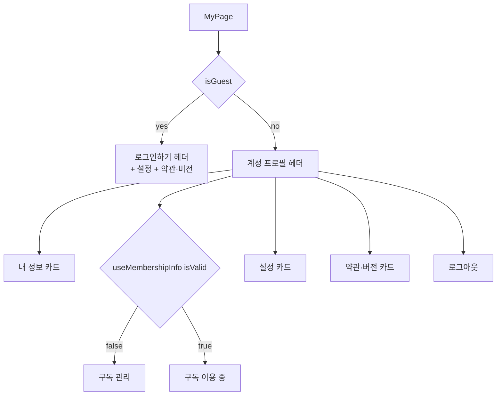

# mypage

> 상태: Live · 최종 갱신: 2026-07-15 · 관련 ADR: [ADR-0011](../../../../../docs/adr/0011-web-layout-shell-and-floating-bottom-nav.md)
>
> 대상: `apps/web/src/app/features/mypage`
>
> 하단 네비게이션·셸은 [architecture/layout-shell](../../architecture/layout-shell.md)이 소유한다(MyPage는 더 이상 네비를 직접 렌더하지 않는다).

## 책임

내 계정·정책 설정 허브다. 프로필/계정 관리, 클라우드 프로필 편집, 탈퇴, 약관·정책 표시를 담당한다. 개발자 도구는 별도 [debug](../debug/README.md) feature로 분리됐다.

## 화면

| 페이지                                       | 경로(`ROUTES.mypage.*`) | 설명                                                               |
| -------------------------------------------- | ----------------------- | ------------------------------------------------------------------ |
| `MyPage`                                     | `/mypage`               | 허브 — 프로필 + 카드형 설정 메뉴(아래 [허브 재설계](#허브-재설계)) |
| `AccountInfoPage`                            | `/mypage/account`       | 계정 정보 + [소셜 연동](../account/social-links.md)                |
| `CloudManagePage`                            | `/mypage/cloud-manage`  | 클라우드 관리 — 보유 클라우드 목록 + 복원용 이메일 등록 + 삭제     |
| `ProfileEditPage`                            | `/mypage/edit`          | 기본 클라우드(relay) 프로필 편집                                   |
| `CloudProfileEditPage`                       | `/mypage/cloud-profile` | 클라우드 프로필(이름) 편집                                         |
| `WithdrawalPage`                             | `/mypage/withdrawal`    | 회원 탈퇴                                                          |
| `TermsPage` / `PrivacyPage` / `LicensesPage` | `/mypage/policy/*`      | 약관·개인정보·라이선스                                             |

## 허브 재설계

`MyPage`(허브)를 Figma(node `1937-26448`/`26598`/`26749`/`27282`) 기준으로 재구성하고, 마크업을 [web-ui-kit](../../../../../libs/web-ui-kit) 컴포넌트로 옮긴다. 상단 프로필은 **계정(account) 프로필**(아바타·이름·이메일)을 표시한다 — 클라우드/사이트 프로필과 구분(아래 [세 종류의 프로필](#세-종류의-프로필)).

### 상태 분기

인증(`isGuest`)과 구독(`useMembershipInfo().isValid`)으로 분기한다. **무료 구독 D-N(잔여일) 상태는 이번 범위 제외** — 서버에 "현재 체험 중" 신뢰 플래그가 없어 보류(→ [리스크](#리스크와-미지수-임시)).

| 상태             | 조건                   | 프로필/카드 구성                                                                |
| ---------------- | ---------------------- | ------------------------------------------------------------------------------- |
| **비로그인**     | `isGuest`              | "로그인하기" 헤더 + 설정 카드 + 약관·버전 카드만. 내정보/구독/로그아웃 없음     |
| **구독 미가입**  | `!isGuest && !isValid` | 프로필 + 내정보 + **구독 관리** + (클라우드 관리) + 설정 + 약관·버전 + 로그아웃 |
| **구독 이용 중** | `!isGuest && isValid`  | 위와 동일, 구독 행 라벨이 **구독 이용 중**                                      |

> 구독 상태 단일 원천은 `useMembershipInfo()`([web-core](../../../../../libs/web-core/src/hooks/subscription/index.ts)). 플랫폼 매칭을 강제하는 `useIsSubscriptionAvailable()`은 웹에서 부적합하므로 쓰지 않는다.

### 카드 구조

Figma 기준 카드(좌우 16px 마진, 행 높이 46px, chevron 우측):

1. **내 정보** — `→ ROUTES.mypage.account.info` (비로그인 숨김)
2. **구독 + 클라우드 관리** — 구독 행(`→ subscription.root`, 상태 라벨) + 클라우드 관리 행(보유 클라우드가 1개 이상일 때, `→ cloud.manage`) (비로그인 숨김)

    > 이 행의 게이트는 **보유 여부**(`useCloudSessionCatalog().clouds.length > 0`)다. 예전 게이트인 `isCloudActive`는 "지금 default가 아닌 클라우드 세션에 들어가 있음"이라, 두유 홈에 머무는 동안 유일한 삭제 경로를 숨겼다 — 다운그레이드 초과분을 이 화면으로 딥링크하는 [ExcessCloudBanner](../subscription/README.md)와, 구독이 만료됐지만 남은 클라우드를 지워야 하는 사용자가 정확히 그 사각지대였다. 초대받은 클라우드는 relay 카탈로그에 없으므로 이 게이트를 열지 않는다(남의 클라우드는 삭제 대상이 아니다).

3. **설정**(유지·재스타일) — 다크모드 토글 / 메시지 미리보기 토글 / 언어 / (네이티브)앱 아이콘 / 온보딩 다시보기. 모든 사용자 노출
4. **약관·버전** — 약관 및 정책(`→ policy.root`) + 앱 버전(업데이트 필요 링크, 디버그 언락 탭)
5. **로그아웃** — `LogoutDialog` → `navigate(ROUTES.auth.logout)` (비로그인 숨김)

> Figma에는 설정 카드가 없으나, 기존 설정 기능(다크모드·언어 등)은 회귀 방지를 위해 **유지**하고 web-ui-kit 카드 비주얼로 재스타일한다.

### web-ui-kit 매핑

| 화면 요소          | web-ui-kit 컴포넌트                                        |
| ------------------ | ---------------------------------------------------------- |
| 카드 그룹 컨테이너 | **`MenuCard`**(`composites/layout`) — 라운드 카드 + 그림자 |
| 메뉴/설정 행       | `ListRow` (`composites/list`) — trailing/subtitle 슬롯     |
| 토글 행            | `ListRow` + `Switch`(`foundations/switch`)                 |
| chevron / 값 표시  | `IconChevronRight` + `text-description`                    |

Figma 카드를 감싸는 라운드 카드 컨테이너가 web-ui-kit에 없어 **`MenuCard` 컴포넌트를 신규 정의**했다(누락 컴포넌트는 라이브러리에 먼저 정의 후 사용 — ADR-0011).

> **스크롤 모델**: `ScreenLayout`(높이 고정 + 내부 스크롤)은 쓰지 않는다. `MyPage`는 셸의 메인 변형(`min-h-dvh`, 페이지 스크롤) 아래 있어, 페이지 자체가 `overflow-y-auto`로 스크롤하고 `pb-32`로 플로팅 네비 겹침을 피한다. 프로필 헤더는 카드 밖 상단 블록(아바타 + 이름 + 이메일)으로 둔다.

## 구조

```
features/mypage/
  pages/      # 위 화면들
  hooks/
    useAppIcon.ts   # 네이티브 앱 아이콘 (지원여부/현재/목록 fetch + 변경 + 라벨)
    useSocialLinks.ts   # 소셜 연동 상태(uid 스코프 로컬 캐시) + attach 오케스트레이션 — 상세: ../account/social-links.md
  consts/     # 정책 콘텐츠 재노출 등
  components/
  routes/
  index.ts
```

`debug`가 분리되면서 mypage는 일반 설정 UX만 남았다(이전 ~6,100줄 중 debug 4,300줄 이동).

## 데이터 흐름

세션 상태는 web-core / app-runtime 훅으로만 읽는다(core 객체 직접 접근 금지, [architecture/README.md](../../architecture/README.md)).

- 인증/클라우드 활성 → `useRuntimeProfile()` (`isGuest`, `isCloudActive`)
- 선택 상태 → `useSessionSelection()` (`selectedCloudId`)
- 계정 프로필 표시 → `useMyUser()` (`name`, `email`, `photo`)
- 구독 상태 → `useMembershipInfo()` (`isValid` 등)
- 로그아웃 → `navigate(ROUTES.auth.logout)` ([auth](../auth/README.md)의 `LogoutPage`가 캐시 클리어 + 세션 종료를 담당)
- 클라우드 프로필 저장 → `useUpdateCloud` + `useRefreshCurrentCloudSession`

## 세 종류의 프로필

mypage는 세 가지 프로필 편집 진입점을 가진다 — 구분 주의:

| 진입점                 | 대상               | API                |
| ---------------------- | ------------------ | ------------------ |
| `ProfileEditPage`      | 계정(relay) 프로필 | `useUpdateProfile` |
| `CloudProfileEditPage` | 클라우드 이름      | `useUpdateCloud`   |

표시되는 계정 프로필은 **항상 relay(계정) 프로필이다** — 어느 클라우드에 접속해 있든 같은 레코드를 보여준다. 소스는 user 캐시가 아니라 **저장된 relay 토큰**이다(`getRelaySessionUser`): 캐시는 물리 키가 `${type}:${cid}:${uid}:${id}`이고 읽기 경로가 컨텍스트 오버라이드를 무시하므로, 클라우드가 활성인 동안 relay user 행은 애초에 읽을 수 없다 — 데이터 레이어에서 고치려던 첫 시도가 되돌려진 이유가 그것이다([place/relay-default-place-scoping.md](../place/relay-default-place-scoping.md) §6). 쓰기(`user.update`)도 **relay 슬롯에 고정**되고(`getRelayAccountGateway`) 응답을 relay 토큰에 되써서 팬아웃한다. 즉 표시와 쓰기가 같은 스코프(relay 토큰)이며, `ProfileEditPage`는 세션 종류와 무관하게 항상 편집 가능하다. `useLinkedAccounts`의 `link$`도 같은 소스라, 이미 relay에 고정돼 있던 `auth.linkAccount`와 읽기·쓰기 스코프가 처음으로 일치한다.

`CloudProfileEditPage`는 **MY 트리에서 더 이상 진입할 수 없다** — 클라우드 엔티티의 이름은 계정 속성이 아니므로 relay 전용이 된 이 트리에서 AccountInfoPage의 진입 행을 제거했다. 라우트(`/mypage/cloud-profile`)와 화면 자체는 소유자 가드까지 그대로 살아 있고, 클라우드 성격의 진입점(전환 시트 또는 계정 관리)을 붙이는 일은 남아 있다.

허브 상단 프로필(아바타·이름·이메일)은 **계정 프로필**(`useMyUser`)이며, 탭 시 `account.edit`로 이동한다. 플레이스(사이트) 내 내 프로필(닉·썸네일)은 홈 헤더 드롭다운에서 `PlaceProfileEditDialog` 오버레이로 편집하며 상세는 [home/place-profile.md](../home/place-profile.md).

## 디버그 언락

앱 버전 텍스트 탭(`useDebugMode().registerTap`)으로 [debug](../debug/README.md) 모드를 연다. 게이트 로직은 debug feature가 소유한다.

## 다이어그램

MyPage 허브 렌더 분기:



## 검증 방법

- `libs/web-ui-kit`: `MenuCard.test.tsx`/`.stories.tsx`(라운드 카드 + 다중 ListRow 조합).
- `apps/web`: 브라우저 프리뷰에서 3상태 렌더 확인 — 게스트(로그인하기), 로그인·미구독(구독 관리), 로그인·구독중(구독 이용 중). 각 카드 이동 경로, 다크모드/언어 토글, 긴 목록 스크롤 + 하단 네비 겹침 없음. (apps/web 페이지는 유닛 테스트 대상이 아니며 프리뷰로 검증한다.)
- 회귀: 설정 기능(다크모드·미리보기·언어·앱아이콘·온보딩·디버그 언락) 동작 유지.

## 미해결

- **무료 구독 D-N 보류**: `trialUsed`는 "과거 체험 소진" 의미이고 "현재 체험 중" 서버 플래그가 없다. Figma의 `D-7` 상태(node `1937-26598`)는 구현하지 않았다. 백엔드가 명확한 체험 플래그/잔여일을 제공하면 재개한다.
