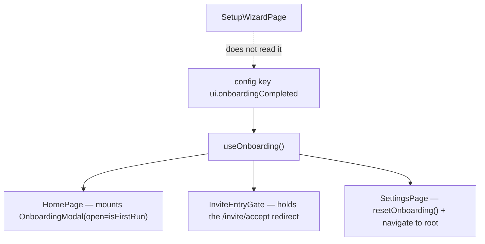

# onboarding — the two first-run screens

`apps/web/src/app/features/onboarding` owns the two screens a person sees before they have anything
of their own: the **first-run carousel** that introduces the app, and the **setup wizard** that names
a cloud, a place and a profile after a subscription clears. They share a directory and nothing else
— different mount points, different copy sources, different progress indicators.

The feature holds no session and no repository. The wizard calls app-level hooks
(`useCreatePlace`, `useSetMyPlaceProfile`, `useUpdateCloudProfile`) and the carousel calls nothing at
all; whether the carousel is shown is decided outside this feature, by
[`useOnboarding()`](../../../src/app/hooks/useOnboarding.ts).

## Layout

```text
apps/web/src/app/features/onboarding/
├── index.tsx        the barrel — exports OnboardingModal and OnboardingRoutes, nothing else
├── routes.tsx       one route: `setup` under `/onboarding/*`
├── components/      6 — OnboardingModal · Header · Content · Footer · StepIndicator · WizardProgress
├── hooks/           2 — useOnboardingNavigation, useOnboardingSteps
├── pages/           1 — SetupWizardPage
└── types/steps.ts   the OnboardingStep interface, and only the interface
```

There is no constant file holding the carousel's copy. `types/steps.ts` declares
`OnboardingStep` (`id`, `title`, `description`, `image`) and stops there —
`useOnboardingSteps()` builds the four steps at render time.

## Responsibilities

**In** — the carousel's slides, swipe and step position; the wizard's three steps, their commit
order and their draft state; the wizard's route.

**Out** —

- **Whether the carousel opens.** `useOnboarding()` in `app/hooks/` reads the flag, and `HomePage`
  mounts the modal. This feature exports a controlled component and takes `open` as a prop.
- **The flag's storage.** `ui.onboardingCompleted` is a registry key in
  [`@chatic/config`](../../../../../libs/config/README.md).
- **Creating the cloud, place and profile.** The wizard calls `app/hooks/` mutations; the writes
  belong to [`@chatic/data`](../../../../../libs/data/README.md) through `runtime.data`.
- **Place profile editing after first run.** That is [home](../home/README.md)'s overlay.

## The shared contract

### First-run state is one config key, and its polarity flips twice

The stored value is `ui.onboardingCompleted` — **true means the carousel is done**. What the screens
read is `isFirstRun`, its negation. Between the two there is a second inversion nobody expects, so
all three places that touch it are worth knowing together.

| Where                                                                               | Reads/writes                          | Polarity                             |
| ----------------------------------------------------------------------------------- | ------------------------------------- | ------------------------------------ |
| [`app/hooks/useOnboarding.ts`](../../../src/app/hooks/useOnboarding.ts)             | `config` key `ui.onboardingCompleted` | `isFirstRun = !onboardingCompleted`  |
| [`app/runtime/PreferenceLoader.tsx`](../../../src/app/runtime/PreferenceLoader.tsx) | legacy bridge key `isFirstRun`        | decoded by negating the bridge value |
| [`app/config/shellKvAdapter.ts`](../../../src/app/config/shellKvAdapter.ts)         | legacy bridge key `isFirstRun`        | written back negated                 |

The two legacy paths exist because the web ships before the app: a native build that predates the
config bag still answers only to the old `isFirstRun` preference, so reads fall back to it and writes
degrade to it. A build new enough to inject `CHATIC_APP_CONFIG_BAG` never takes either path.

`completeOnboarding()` and `resetOnboarding()` write with `{ lane: 'shell' }`. The lane is not
decoration — `local` sits below a native-hydrated shell value in the lane order, so a `local` write
is accepted and then silently shadowed on the next boot.

### Three things read the flag, and one of them is not a screen



[`InviteEntryGate`](../../../src/app/routes/InviteEntryGate.tsx) is the one that surprises people. It
guards the root path and forwards `/?provider=invite&…` to the accept page, but **while `isFirstRun`
is true it holds that redirect** so the carousel stays in front. It holds the redirect rather than
the accept screen on purpose: home leaves the query string alone, so finishing the carousel
re-renders the gate and the invite proceeds from there. Completing onboarding is therefore a
navigation event for a person who arrived on an invite link, and breaking the flag breaks invite
landing, not just the tour.

The wizard is deliberately absent from that diagram. It does not read or write the flag, and
finishing it does not mark onboarding complete.

### Copy comes from two different places

- **Carousel** — `useOnboardingSteps()` builds all four steps in TypeScript, branching on
  `i18n.language` for ko/en and pulling images from `@chatic/assets`. Two numbers in slide 1 are
  interpolated from `MAX_PLACES` and `MAX_CHANNELS_PER_PLACE` rather than written into the sentence,
  because the slide is a promise about what the app allows and it kept promising the old limits after
  they moved. The 100 in slide 3 stays a literal: no constant owns a room's member capacity, and the
  nearest one (`MAX_INVITE_SELECTION`) caps a different thing.
- **Wizard** — every string is a `setupWizard.*` key in
  `apps/web/public/locales/{ko,en}/translation.json`.

Only the buttons are shared with i18n on the carousel side (`onboarding.prev` / `next` / `done`).

### The wizard commits step by step

`SetupWizardPage` does not batch. Step 1 renames the selected cloud, step 2 creates a place, step 3
sets the profile for that place — each one awaits its mutation before the step advances, because the
steps depend on each other (the profile is a profile _of_ the place made a moment earlier). A failure
therefore leaves the earlier steps done, and a retry resumes where it stopped.

Step 1 has no photo field. `CloudModel` carries no image on the server, so there is nowhere to put
one; `i18n.test.ts` asserts that `setupWizard.cloud.photoLabel` stays undefined in both locales so
nobody adds the label back without adding the field.

Step 1 also has no close button. The subscription is already paid for and the cloud needs a name
before anything can be created in it; steps 2 and 3 can be closed out to home.

## Usage

The barrel exports exactly two symbols.

```tsx
// features/home/pages/HomePage.tsx
const { isFirstRun, completeOnboarding } = useOnboarding();
<OnboardingModal open={isFirstRun} onComplete={completeOnboarding} />;

// routes/PrivateRoutes.tsx — lazy, under `onboarding/*`
{ path: 'onboarding/*', element: withSuspense(OnboardingRoutes) }
```

`onComplete` fires on the last step's DONE, on SKIP, and on any dismissal of the dialog — the modal
routes all three through the same prop, so there is no "skipped" state distinct from "completed".

### What not to do

- **Do not read the config key directly from a screen.** Go through `useOnboarding()`; it owns the
  negation and the lane, and a direct `config.set('ui.onboardingCompleted', …)` without
  `{ lane: 'shell' }` is the bug that reads as "onboarding comes back after a restart".
- **Do not reuse `StepIndicator` for the wizard, or `WizardProgress` for the carousel.** They encode
  different navigation models. The carousel's dots are unconnected and only the current one is
  filled, because any slide is reachable by swipe. The wizard's rail joins its dots and fills up to
  the current step, because the steps are a sequence and you cannot skip ahead.
- **Do not add a slide by adding a constant.** `useOnboardingNavigation(totalSteps)` counts the list
  `useOnboardingSteps()` returns. The module constant that used to answer this carried a second,
  Korean-only copy of every string that nothing rendered.
- **Do not give the wizard a back-out on step 1.** See above.

## Notes for implementers and tests

- **Nothing navigates to `/onboarding/setup`.** The route is mounted and `ROUTES.onboarding.setup`
  exists, but no caller in `apps/web`, `apps/mobile` or `libs` sends anyone there — the page is
  reachable only by typing the URL. The subscription flow that is meant to hand off to it does not
  yet.

    ```bash
    grep -rn "onboarding.setup\|/onboarding/setup" apps libs --include='*.ts' --include='*.tsx' | grep -v node_modules
    ```

- **The carousel is an overlay, not a route.** It mounts over `HomePage`, so home's data loads
  behind it. A test for home mocks the whole feature barrel
  (`jest.mock('../../onboarding', …)`) rather than the modal's internals.
- **Two specs guard this feature**, and they guard the two copy sources:
  `hooks/useOnboardingSteps.test.ts` (four steps, the live limits rather than the retired 5/5 pair,
  per-language copy and images) and `i18n.test.ts` (every `setupWizard.*` key present in ko and en,
  `{{max}}` and `{{place}}` interpolations intact, no cloud photo label). Both run with the app's
  suite.

    ```bash
    npx jest --config apps/web/jest.config.js features/onboarding
    ```

- **Neither screen has a snapshot or a story.** Visual changes are checked in the browser preview,
  and the carousel needs `isFirstRun` to be true — clear the key or use the settings row.

## Further reading

- [architecture/stores.md](../../architecture/stores.md) — where app-level state lives and what is
  left in the preference store.
- [`@chatic/config`](../../../../../libs/config/README.md) — the registry, the lanes, and what
  `persist: 'shell'` means.
- [mypage](../mypage/README.md) — the settings row that calls `resetOnboarding()`.
- [home](../home/README.md) — the host of the carousel, and the place-profile overlay that follows
  it.
