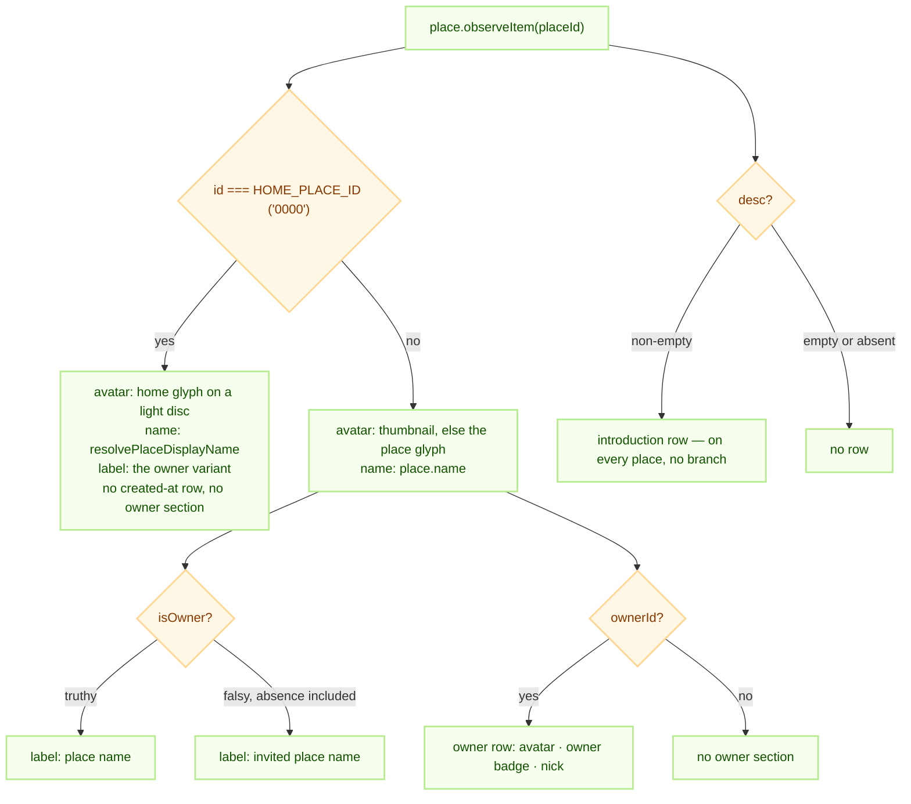
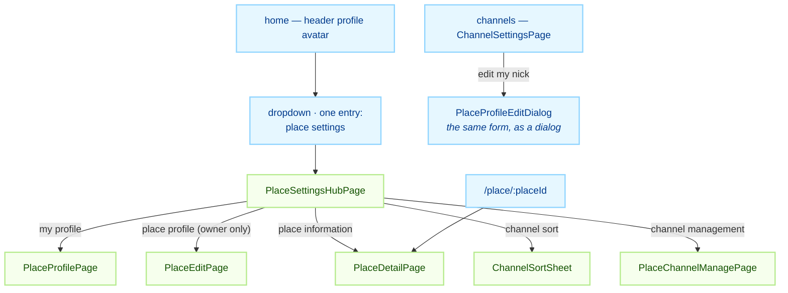

# place — one place, read and edited

`apps/web/src/app/features/place` owns the screens for a **single place**: its settings hub, its
read-only information screen, the owner's edit screen, the per-place user profile, and channel
management. A place is a `site` in the backend model — the two words name the same entity, and the
session axis for it is `sid`.

Everything plural belongs to [home](../home/README.md): the place list, creating a place, switching
between places. This group never renders more than one place at a time, and it always takes that
place from the URL rather than from the active session.

## Layout

```text
apps/web/src/app/features/place/
├── index.tsx                          PlaceRoutes
├── pages/                             5 screens
├── components/ChannelSortSheet.tsx    the only component — a bottom sheet, not a page
├── hooks/usePlaceOwnerProfile.ts      the only hook
└── routes/index.tsx                   six routes, two of them the same page
```

There is no `types/` and no `lib/`. The edit path reuses `useUpdatePlace`, the profile form is the
shared `ui/components/PlaceProfileForm`, and the place record is typed by `MySiteView` from the
backend package.

## Responsibilities

This group decides **what a place looks like on screen** and **what an owner may change about it**.

It decides nothing about who may change it — `place.isOwner` comes from the server and is the only
authority. It decides nothing about the place list, and it holds no cache of its own: every read is
an `observeItem` on the place repository owned by [`@chatic/data`](../../../../../libs/data/README.md).

It also refuses to invent. A fact the server did not send is not rendered — no placeholder dash, no
value inferred from the session. That rule is what makes the information screen trustworthy, and it
is why several rows simply do not exist on the relay's default place.

## The shared contract

### Screens

`edit` writes and `detail` reads. The word `info` is not used anywhere — in a file name, a route, or
an i18n key — because it reads as both.

| Page                     | Route (`ROUTES.place.*`)            | Who can open it                  |
| ------------------------ | ----------------------------------- | -------------------------------- |
| `PlaceSettingsHubPage`   | `/place/:placeId/settings`          | Anyone in the place              |
| `PlaceDetailPage`        | `/place/:placeId/settings/detail`   | Anyone — read-only               |
| `PlaceDetailPage`        | `/place/:placeId`                   | Same page, `ROUTES.place.detail` |
| `PlaceEditPage`          | `/place/:placeId/settings/edit`     | Owner only                       |
| `PlaceProfilePage`       | `/place/:placeId/settings/profile`  | Anyone — edits their own nick    |
| `PlaceChannelManagePage` | `/place/:placeId/settings/channels` | Anyone in the place              |

The hub holds three cards — **Settings** (my profile, place profile, place information),
**Notifications** (one disabled switch; place push has no backend yet, so it renders as a
placeholder and holds no state) and **Chats** (sort, manage). Channel sort is a bottom sheet opened
from the hub, not a page. There is no leave / delete / report section: the hub renders no bottom
action area at all rather than showing disabled rows for something that does not exist.

The owner gate sits only on the screens that write. The hub row for "place profile" is `disabled`
for a non-owner with an explanatory subtitle, and `PlaceEditPage` calls `navigate(-1)` on
`isOwner === false` as a backstop for a typed URL. `PlaceDetailPage` has no gate — a member is
entitled to see whose place they are in.

### Where the data comes from

| Concern                     | Call                                                                                |
| --------------------------- | ----------------------------------------------------------------------------------- |
| The place record            | `runtime.data.useRuntimeRepositories().place.observeItem(placeId, cb)`              |
| The owner's display name    | `usePlaceOwnerProfile(placeId, place.ownerId)` — profile id `${placeId}@${ownerId}` |
| Name / introduction / image | `useUpdatePlace({ id, sid, name?, desc?, thumbnail? })` → `place.updatePlace`       |
| My own nick and photo       | `profileRepository.setMyProfile(body, siteId)`                                      |
| Channel sort                | `useChannelSort()` — the `ui.channelSort` config setting                            |

Two of those carry a rule worth stating.

**The owner is resolved through the profile domain, never from `owner$`.** The place row does carry
`owner$`, but its `name` is an internal identifier (`"LMN:1000051"`), not a person's name. A nick is
per-place anyway, which makes the profile the right source as well as the only correct one.
`usePlaceOwnerProfile` observes the cache and fetches only what is missing — the idiom
`useSenderProfiles` uses for chat authors, narrowed to a single subject. It returns `null` both
while loading and when there is no owner at all, so callers must read `null` as "no owner row".

**The save names its place.** `setMyProfile` takes `siteId` as an argument rather than reading an
ambient `sid`, because `sid` is not ambient — the reasoning lives in
[`@chatic/data`](../../../../../libs/data/README.md), and the practical consequence here is that a
site switch cannot race the save.

### What the server actually sends

The information screen branches on presence, so what arrives matters more than what the type says.
The relay's default place and a cloud place are shaped differently:

| Field       | Relay default place (id `0000`) | Cloud place             |
| ----------- | ------------------------------- | ----------------------- |
| `createdAt` | present                         | present                 |
| `name`      | `"default"` — branded on render | the user's own name     |
| `desc`      | optional                        | optional                |
| `stereo`    | `"domain"`                      | `"work"`                |
| `thumbnail` | absent                          | present when set        |
| `isOwner`   | absent                          | `true` for the owner    |
| `ownerId`   | absent                          | present                 |
| `owner$`    | absent                          | `{ id, name: "LMN:…" }` |

The relay default place is a system site: `stereo: 'domain'` with no owner concept at all. That is
why the owner section is absent there as a natural consequence of the data, not as a special case.

### The three branches on the information screen



Three of those decisions are worth separating, because they look alike and are not:

1. **The owner section and the created-at row on a cloud place follow the data.** No `ownerId`, no
   section. No `createdAt`, no row.
2. **On the relay place, the name label and the created-at row are policy, not data.** The label is
   fixed to the owner variant even though `isOwner` is absent — the relay has exactly one place, so
   nobody was ever "invited" into it — and the created-at row is suppressed even though `createdAt`
   does arrive. Both are explicit exceptions, and the code says so where it makes them.
3. **The introduction takes no branch at all.** It renders wherever it has a value, the relay place
   included. Empty string is falsy, so the "no value, no row" rule holds without a second check.

The display name comes from `resolvePlaceDisplayName(place, { isDefaultCloud: isHomePlace }, t)` —
note what is **not** passed: the session's `selectedCloudId`. The helper ORs `isDefaultCloud` with
the home-place id, so feeding it the session would brand a cloud place opened by direct URL as the
relay's home while a relay session is active. Passing the same `isHomePlace` the avatar uses is what
keeps the name and the illustration from disagreeing.

### Editing rules

`PlaceEditPage` holds name, introduction and image in local state, seeds them once per place id, and
sends only what changed:

- Name is 1–20 characters and gates the submit button; introduction is clamped to 100 characters in
  `onChange` (`Textarea` deliberately has no counter and no hard cap of its own); an image is
  ≤ 10 MB of jpeg, png or webp and is resized to 150 px square base64 before it goes out.
- `desc` and `thumbnail` ride the payload **only when dirty**, so a partial update never erases the
  other field. Clearing the introduction is therefore an explicit `desc: ''`, which the server
  treats as a clear.
- Seeding happens inside the same guarded block that latches the place id. Outside it, a background
  re-emit of the place row would overwrite what the user is typing.
- `id` is required on `place.update` and equals `sid` for a place. The repository normalizes a
  payload that carries only `sid`, so both the remote call and the optimistic cache write have one.
- Leaving with unsaved changes opens the exit guard; `isDirty` is the OR of the three fields, so
  editing only the introduction still arms it.

### The channel sort preference

Sort is a client preference with no server side. It is stored as the `ui.channelSort` setting
(`persist: 'local'`, `writableBy: ['local']`) through [`@chatic/config`](../../../../../libs/config/README.md),
not in a bespoke store: one key holds a map from scope to method, and `setChannelSort` merges so
changing one place never drops another's.

The scope key is `placeScopeKey(cloudId, placeId)` — `${cloudId}:${placeId}` — because the same
place id can exist in more than one cloud. The sheet only knows the route's `placeId` and takes the
cloud half from the session. Two methods exist, `recent` (the default) and `unread`;
`app/utils/sortChannels.ts` applies them as a pure function that stable-sorts the unread group above
an activity-ordered base.

## Usage

### Getting to these screens



The dropdown entry is disabled when no place is active, because every route here is keyed by a place
id. The per-place profile has two front doors and one implementation: this group's
`PlaceProfilePage` renders `ui/components/PlaceProfileForm` with `container="page"`, and channel
settings renders the same form as a dialog. State, validation and the `setMyProfile` call live in
the form, so only the chrome differs.

### Adding a field to the place record

The introduction (`desc`) is the worked example — the whole stack below the app was already open,
and the only thing in the way was one local type. Adding the next field follows the same five steps:

1. **Check the wire.** `PlaceBodyData` (request) and `MySiteView` (response) usually declare the
   field already. `DomainPlace` inherits it, the mapper spreads rather than whitelists, and the
   local cache stores whole JSON — so nothing in `@chatic/data` needs a change.
2. **Open the app's own payload type.** `UpdatePlacePayload` in
   `features/home/hooks/useUpdatePlace.ts` is the narrow point. A field missing there is a field the
   screen cannot send.
3. **Add it to `PlaceEditPage`** — state, a seed inside the existing latch block, a `isXDirty` flag
   folded into `isDirty`, and `...(isXDirty && { x })` in the payload.
4. **Add the row to `PlaceDetailPage`** with `InfoField`, guarded on a truthy value so an empty one
   renders nothing. Decide explicitly whether the relay place is an exception; the default is that
   it is not.
5. **Add the ko and en keys**, and follow the existing sentence shapes (`nameDescription` is the
   model for a character-limit hint).

### What not to do

- **Do not fill a missing fact with a placeholder.** An absent owner or date means the row is not
  rendered. A dash looks like data.
- **Do not pass the session into `resolvePlaceDisplayName`.** The subject of these screens is the
  place in the URL.
- **Do not add a fourth branch key.** `HOME_PLACE_ID` is the one lever that separates the relay's
  place from a cloud place; a second notion of "is this the default place" will drift from it.
- **Do not send an unchanged field.** A full payload turns a name edit into a thumbnail erase.
- **Do not build a new save path.** Place edits go through `useUpdatePlace`, profile edits through
  `setMyProfile`. Both already carry optimistic write and rollback.
- **Do not reach for `owner$`** for anything a human reads.

## Notes for implementers and tests

Six test files:

```bash
npx jest --config apps/web/jest.config.js --testPathPatterns="features/place"
```

`PlaceDetailPage.test.tsx` is the one to read first — it covers all four owner/relay combinations,
including the two that a local preview cannot reach, and the regression that matters most: the
introduction row must **not** inherit the relay exception that hides the date and owner rows.

Traps:

- **The `ui` barrel cannot be imported in these tests.** `app/ui/index.ts` pulls in
  `PrivateLayout → CloudLogo → @chatic/assets`, which jest cannot parse. Mock it, or import the
  concrete module — `PlaceProfileForm` imports `PageHeader` by direct path for this reason.
- **An owner cloud session is not reproducible locally.** The photo avatar, the owner name label and
  the owner row only render with a real owner session; the unit tests are the coverage for those
  four combinations.
- **`PlaceEditPage` imports `useUpdatePlace` from `features/home`.** It is the one cross-feature
  import in this group, and it contradicts the app rule that two features sharing something promote
  it to `app/hooks/` — treat it as debt, not as precedent.
- **Two routes render `PlaceDetailPage`.** Changing one URL without the other leaves a live screen
  behind.

## Further reading

- [relay-default-place-scoping.md](./relay-default-place-scoping.md) — why the relay's place must
  not reach a cloud's cache partition, how the place list reconciles itself, and why the account
  profile is read from the relay token instead of the cache.
- [home/README.md](../home/README.md) — the place list, creating a place, switching, and the channel
  list that consumes the sort preference.
- [mypage/README.md](../mypage/README.md) — the account-level profile, which is a different record
  from the per-place one edited here.
- [architecture/data-flow.md](../../state/data-flow.md) — the observe / refresh / sync
  contract these screens read through.
- [`@chatic/data`](../../../../../libs/data/README.md) — the place repository, the cache partition,
  and why `sid` travels as an argument.
