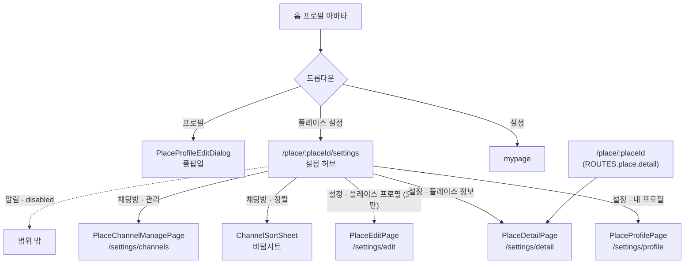
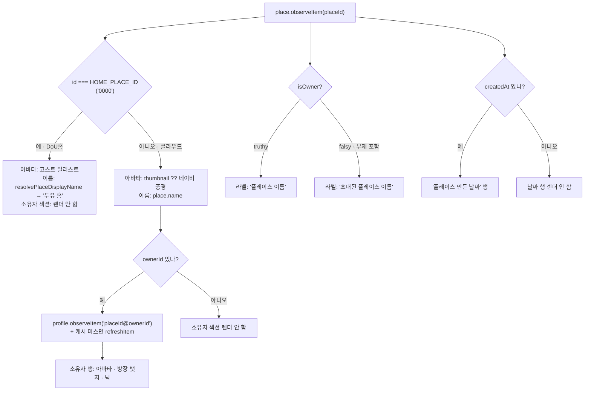

# 플레이스 설정 (Place Settings)

> 상태: Live · 최종 갱신: 2026-08-07 · 관련 ADR: [[ADR-0031]](../../../../docs/adr/0031-place-settings-hub.md) (설정 허브) · [[ADR-0047]](../../../../docs/adr/0047-place-detail-read-only-screen.md) (플레이스 정보 화면·개명)

## 목적

플레이스(=Site) 하나에 대한 설정과 정보를 한곳에서 다룬다. 홈 프로필 드롭다운에서 진입하는 **라우트 기반 설정 허브**를 두고, 그 아래에서 (1) 플레이스 이름/이미지 **편집**(오너 전용), (2) 내 플레이스 유저 프로필(닉/사진), (3) 플레이스 **정보 조회**(읽기 전용), (4) 채팅방 정렬·관리를 다룬다. 흩어져 있던 편집 화면(고아 `PlaceInfoPage`, 홈 드롭다운의 유저 프로필 다이얼로그)을 하나의 진입 지점으로 모은다.

## 설계 원칙

- **web-ui-kit 우선.** 화면은 `@chatic/web-ui-kit` 조합으로 구성한다. kit에 없는 것만 `@chatic/ui-kit`(Radix) 직접 사용 또는 kit에 신규 정의. 하드코딩 색(`#B0EA10` 등)·raw 마크업으로 새로 만들지 않는다.
- **오너 권한은 서버 값(`place.isOwner`)으로만 판별.** 필드 부재는 falsy(=비오너)로 읽는다. 비오너에게 편집은 숨기지 않고 **disabled**로 노출하고, 조회는 그대로 열어 준다.
- **`편집`과 `정보`를 이름으로 구분한다.** 파일·라우트·i18n 키에서 `edit`은 쓰기 화면, `detail`은 읽기 화면이다. `info`는 둘 다를 뜻할 수 있어 쓰지 않는다.
- **서버가 주지 않는 값을 앱이 만들어 내지 않는다.** 소유자·생성일 같은 사실 필드는 없으면 그 행을 **그리지 않는다**. 세션·컨텍스트로 추론해 그럴듯한 값을 채우면, 화면은 채워지지만 틀린 정보가 남는다.
- **기존 저장 경로 재사용.** 플레이스 편집은 `useUpdatePlace`, 유저 프로필은 `setMyProfile`. 새 저장 API를 만들지 않는다.
- **정렬은 클라이언트 선호값.** 서버 동기화 없이 플레이스별 localStorage. 중앙 레지스트리(`preferenceKeys.ts`)에 단 하나의 키로 등록한다.
- **유저 프로필 폼은 단일 구현.** 드롭다운(다이얼로그)과 설정 페이지가 같은 본문(`PlaceProfileFormDialog`)과 저장 로직을 공유하고 컨테이너만 분기한다.

## 범위

**포함**

- 홈 프로필 드롭다운에 "플레이스 설정" 진입 항목.
- 설정 허브 페이지(계층형 목록) — `설정` / `알림` / `채팅방` 세 카드.
- 플레이스 이름/이미지 편집 페이지(`PlaceEditPage`) — 오너 전용, 비오너 disabled.
- 플레이스 유저 프로필 설정 페이지 — 폼 본문 공유(다이얼로그 진입도 유지).
- **플레이스 정보 페이지(`PlaceDetailPage`) — 읽기 전용**: 아바타, 플레이스 이름, 만든 날짜, 소유자 정보. relay 기본플레이스(DoU홈)와 클라우드 플레이스 분기.
- 채팅방 정렬(허브에서 바텀시트) · 채팅방 관리 페이지.
- 필요한 i18n 키, 아이콘·이미지 리소스.

**제외**

- **플레이스 나가기 · 플레이스 삭제 · 신고 관리** — 보류(ADR-0047). 하단 액션 영역과 그 위 구분선을 아예 렌더하지 않는다. 비활성 상태로 미리 노출하지도 않는다.
- 플레이스 소개 문구(`desc`) — Figma에 없다.
- 플레이스 알림(백엔드 미구현) — 허브에 disabled 스위치 + 설명문으로만 노출.
- 정렬 서버 동기화·수동 드래그 재배치(@dnd-kit).

## 시나리오

1. **허브 진입** — 홈 우상단 프로필 아바타 탭 → 드롭다운에서 **플레이스 설정** → `/place/:placeId/settings` 허브. 활성 플레이스가 없으면(`!selectedSiteId`) 항목 disabled.
2. **이름/이미지 편집(오너)** — 허브 `설정` 카드의 "플레이스 프로필" 행 → `PlaceEditPage`. 이름 1–20자, 이미지 ≤10MB(150px 리사이즈). 저장 시 `useUpdatePlace` → 낙관적 반영, 완료 후 뒤로. 미저장 상태로 뒤로 가면 이탈 가드 다이얼로그.
3. **이름/이미지 편집(비오너)** — 허브의 그 행이 disabled(탭 불가) + "오너만 변경할 수 있습니다" 부제. 직접 URL 진입은 `PlaceEditPage`가 `navigate(-1)`로 되돌린다(방어적 백스톱).
4. **유저 프로필 — 드롭다운 경로** — 홈 드롭다운의 **프로필** → 풀팝업 다이얼로그(`PlaceProfileEditDialog`).
5. **유저 프로필 — 설정 경로** — 허브 `설정` 카드의 "내 프로필" 행 → 라우트 페이지. 본문/저장은 다이얼로그와 동일(`PlaceProfileFormDialog` + `setMyProfile`).
6. **플레이스 정보 — 클라우드 플레이스(오너)** — 허브 `설정` 카드의 "플레이스 정보" 행 → `PlaceDetailPage`. 썸네일이 있으면 그 사진, 없으면 네이비 풍경 기본 아바타. 라벨 "플레이스 이름" + 플레이스 이름, "플레이스 만든 날짜" + `createdAt` 날짜, "소유자 정보" + 오너 행(아바타 · 방장 뱃지 · 플레이스 프로필 닉).
7. **플레이스 정보 — 클라우드 플레이스(비오너)** — 같은 화면. 이름 라벨만 "초대된 플레이스 이름"으로 바뀐다. 소유자 정보는 동일하게 `ownerId`의 플레이스 프로필을 보여준다.
8. **플레이스 정보 — DoU홈(relay 기본플레이스)** — 아바타는 DoU 캐릭터(고스트) 일러스트, 이름은 `resolvePlaceDisplayName`이 브랜딩한 "두유 홈"(백엔드 원본 `default`를 노출하지 않는다), 라벨은 `isOwner` 부재라 "초대된 플레이스 이름". **소유자 정보 섹션은 렌더하지 않는다** — relay 기본플레이스는 `stereo: 'domain'`인 시스템 사이트로 `ownerId`·`owner$`·`isOwner`가 전부 없다(§실측).
9. **소유자 프로필이 캐시에 없을 때** — 이름 · 날짜가 먼저 그려지고, `profile.refreshItem`이 돌아오면 소유자 행이 채워진다. 조회가 실패하면 그 행만 비고 나머지는 남는다.
10. **채팅방 정렬** — 허브 `채팅방` 카드의 "채팅방 정렬" 행 → 바텀시트(`ChannelSortSheet`)에서 **최근 활동순**(기본) / **안읽은 메시지 우선** 선택 → 즉시 저장(플레이스별). 홈 채팅방 목록이 그 기준으로 정렬된다.
11. **채팅방 관리** — 허브 `채팅방` 카드의 "채팅방 관리" 행 → `PlaceChannelManagePage`.

## 다이어그램

### 진입/네비게이션

### 플레이스 정보 화면의 분기와 데이터 소스

### 정렬 선호값 흐름

## 상세 구현

### 실측 — 서버가 실제로 주는 place 필드

ADR-0047이 미결로 남긴 항목의 실측 결과다(`user.mySite` → IndexedDB `ChaticWebCacheDB` / `cache_store`, `type === 'site'` 행). `place.get`도 같은 `MySiteView`를 반환하므로 단건 재조회로 필드가 늘지 않는다.

| 필드        | relay 기본플레이스 (id `0000`) | 클라우드 플레이스 (id `10014`) |
| ----------- | ------------------------------ | ------------------------------ |
| `createdAt` | ✅ epoch ms                    | ✅ epoch ms                    |
| `name`      | `"default"` (브랜딩 대상)      | ✅ 사용자 입력 이름            |
| `stereo`    | `"domain"`                     | `"work"`                       |
| `thumbnail` | ❌                             | ✅ base64                      |
| `isOwner`   | ❌                             | ✅ `true`                      |
| `ownerId`   | ❌                             | ✅                             |
| `owner$`    | ❌                             | ⚠️ `{id, name: "LMN:1000051"}` |

두 가지가 설계를 결정했다:

1. **`owner$.name`은 사람 이름이 아니다** — `"LMN:1000051"`은 내부 식별자다. 그래서 소유자 표시는 `owner$`가 아니라 `ownerId` + 플레이스 프로필 조회로 간다(ADR-0047 결정 3, 실측으로 확정).
2. **relay 기본플레이스는 소유자 개념이 없는 시스템 사이트다** — `stereo: 'domain'`, `ownerId`·`owner$`·`isOwner` 전부 부재. 그래서 DoU홈에서는 소유자 섹션을 렌더하지 않는다(설계 원칙: 서버가 주지 않는 값을 만들지 않는다).

### 라우트

- `apps/web/src/app/routes/paths.ts:62` `ROUTES.place`:
    - `detail: (placeId) => /place/${placeId}` — 기존 상수 유지. 이제 실제로 `PlaceDetailPage`를 가리켜 이름과 실체가 일치한다.
    - `settings` (허브) · `settingsProfile` · `settingsChannels` — 유지.
    - `settingsInfo` → **`settingsEdit`** (`/place/:placeId/settings/edit`) 개명.
    - **`settingsDetail`** (`/place/:placeId/settings/detail`) 신설.
- `apps/web/src/app/features/place/routes/index.tsx` — `:placeId`가 `PlaceDetailPage`를 렌더(기존엔 편집 화면이었다), `settings/edit` → `PlaceEditPage`, `settings/detail` → `PlaceDetailPage`.

### 개명: `PlaceInfoPage` → `PlaceEditPage`

`features/place/pages/PlaceInfoPage.tsx` → `PlaceEditPage.tsx`. 컴포넌트명·`pages/index.ts` 배럴·`routes/index.tsx`·테스트 파일명을 함께 옮긴다. **로직 변경 없음** — 이름·이미지 편집, 오너 가드, 이탈 가드, `useUpdatePlace` 저장 경로 모두 그대로다. i18n 키 `placeInfo.*` → `placeEdit.*`로 함께 옮겨 키가 화면과 어긋나지 않게 한다.

### 플레이스 정보 페이지 (신규)

`features/place/pages/PlaceDetailPage.tsx`:

- **데이터** — `place.observeItem(placeId)`(허브·편집 화면과 동일한 관용구, [PlaceSettingsHubPage.tsx:32](../../../src/app/features/place/pages/PlaceSettingsHubPage.tsx)) + 소유자 프로필은 `profile.observeItem(`${placeId}@${ownerId}`)` + 캐시 미스 시 `profile.refreshItem`. 프로필 id 형식과 "관찰 + 결측만 fetch" 패턴은 [useSenderProfiles.ts:16](../../../src/app/features/search/hooks/useSenderProfiles.ts)의 확립된 관용구를 단건으로 축약한 것이다. 훅으로 분리한다 — `features/place/hooks/usePlaceOwnerProfile.ts`.
- **DoU홈 판정** — `place.id === HOME_PLACE_ID`([resolvePlaceDisplayName.ts:9](../../../src/app/utils/resolvePlaceDisplayName.ts)). 새 분기 개념을 만들지 않고 기존 레버를 그대로 쓴다. 표시 이름도 같은 모듈의 `resolvePlaceDisplayName`을 쓰는데, **`isDefaultCloud`에 세션의 `selectedCloudId === 'default'`를 넘기지 않는다.** 이 화면의 주체는 URL의 플레이스이고 활성 세션이 아니다. 헬퍼가 `isDefaultCloud || id === HOME_PLACE_ID`로 OR하므로 세션 값을 넘기면 relay 활성 중 직접 URL로 열린 **클라우드 플레이스까지 "두유 홈"으로 브랜딩**된다. 아바타가 쓰는 `isHomePlace`를 그대로 넘겨 이름과 일러스트가 어긋날 수 없게 한다.
- **아바타** — `ProfileAvatar src={place.thumbnail || undefined} glyph={isHomePlace ? 'home' : 'place'}`. `onSelect`를 넘기지 않으므로 "+" 배지가 붙지 않는다(읽기 전용).
- **레이아웃** — `PageHeader` + 아바타 블록 + `InfoField` 3개. Figma(3769:34116) 실측 간격: 헤더 아래 40 → 아바타 86 → 32 → 필드 블록, 필드 간 24, 라벨↔값 12, 좌우 패딩 16.
- **소유자 행** — `ListRow`의 `leading`에 36px 아바타(`ImageAvatar` 또는 `DefaultAvatar`), `title`에 `StatusBadge variant="owner"` + 닉. [MemberListItem.tsx:48](../../../src/app/features/channels/components/MemberListItem.tsx)과 같은 조합이지만, 피처 간 직접 참조를 만들지 않기 위해(ADR-0046) 그 컴포넌트를 import하지 않고 같은 kit 프리미티브로 구성한다.
- **날짜 포맷** — `Intl.DateTimeFormat(i18n.language, { year: 'numeric', month: '2-digit', day: '2-digit' })`. 로케일을 따르면서 Figma의 zero-padding("2000. 00. 00")을 만족한다. `libs/shared`의 기존 `formatDate`는 `toLocaleString()`(날짜+시각)이라 이 화면에는 맞지 않아 쓰지 않는다.

### 설정 허브 변경

`features/place/pages/PlaceSettingsHubPage.tsx`:

- 첫 카드 제목 `placeSettings.sectionProfile`("프로필") → `placeSettings.sectionSettings`("설정") — Figma 3408-26299.
- 그 카드에 **세 번째 행** "플레이스 정보" 추가 → `ROUTES.place.settingsDetail(placeId)`. **오너 게이트 없음**(읽기 전용).
- 두 번째 행("플레이스 프로필")의 이동 대상이 `settingsInfo` → `settingsEdit`.

### web-ui-kit 추가분

- **`resources/assets/dou-home-avatar.png`** (신규) — Figma 3769:34384의 DoU 캐릭터. 디자이너 export가 캐릭터+로고를 담은 2214×867 스프라이트에 crop을 걸어 쓰는 형태라, Figma가 지정한 crop 영역(x 2..875, 전체 높이)만 잘라 176×174로 커밋했다(25KB). `assets/index.ts`에서 `douHomeAvatar`로 export.
- **`ProfileAvatar`에 `glyph: 'home'` 추가** — `defaultPlaceAvatar`와 달리 **자기 원을 그리지 않는다.** Figma는 밝은 `avatar-ring` 원반 위에 지름의 58/86(≈67%)로 inset한다. 그래서 이 변주만 원(shell) 자체를 바꾼다 — 나머지 placeholder가 모두 어두운 `bg-brand-ink`인 반면 `home`은 `bg-avatar-ring`에 테두리가 없다. 사진(`src`)이 있으면 어두운 shell로 돌아간다. **"+" 배지도 이때만 어둡게 뒤집는다** — 기본 배지 `bg-muted`(95% L)와 `bg-avatar-ring`(96% L)은 밝기 한 단계 차이라 밝은 원반 위에서 사실상 보이지 않는다. 기존 `'user' | 'group' | 'place'` 호출부는 무변경.
- **`composites/section/InfoField.tsx`** (신규) — 라벨 + 값의 읽기 전용 필드 블록. Figma가 이 블록을 3번 반복하는 컴포넌트("General Input")로 갖고 있고 kit에 대응물이 없다. `label: string` + `children`(문자열 값이든 소유자 행이든), 라벨은 `Text variant="label"` + 회색 토큰, 간격은 위 실측값. 값이 없을 때 렌더하지 않는 판단은 **호출부**가 한다 — 필드는 자기 자리만 그린다.
- 그 외 신규 kit 컴포넌트 불필요 — `PageHeader` · `ProfileAvatar` · `ListRow` · `StatusBadge` · `ImageAvatar` · `DefaultAvatar` · `Text` 조합으로 끝난다.

### i18n

- 신규: `placeSettings.sectionSettings`, `placeSettings.placeDetail`, `placeDetail.title` · `placeDetail.nameLabel` · `placeDetail.invitedNameLabel` · `placeDetail.createdAtLabel` · `placeDetail.ownerLabel` · `placeDetail.notFound`.
- 개명: `placeInfo.*` → `placeEdit.*`.
- 방장 뱃지는 기존 `chat.settings.badge.owner` 재사용.

### 기존 구현 (변경 없음)

- **유저 프로필 폼 단일 구현** — `features/home/components/PlaceProfileForm.tsx`가 `container: 'dialog' | 'page'`로 크롬만 분기하고 상태/검증/저장은 한 곳에만 있다. `PlaceProfilePage`가 `container="page"`로 쓴다. `PlaceProfileForm`은 `PageHeader`/`KeyboardSafeAreaSpacer`를 배럴이 아닌 직접 경로로 import한다(`../../../ui` 배럴이 `PrivateLayout → CloudLogo → @chatic/assets`를 끌어와 jest 해석 실패).
- **정렬 선호값** — `stores/preferenceKeys.ts`의 `PREFERENCES.channelSort`(`local` 전략, 단일 키에 `{ [placeId]: 'recent' | 'unread' }` JSON 맵) + `usePreferenceStore.setChannelSort(placeId, method)`(기존 맵 병합으로 다른 플레이스 값 보존).
- **홈 반영** — `features/home/lib/sortChannels.ts`의 순수 함수가 activity 내림차순 base 위에 `unread` 그룹을 stable sort로 상위 배치한다. `ChannelList`가 `sortMethod` prop으로 받아 `useMemo`로 호출.

## 검증 방법

- **유닛 테스트** — `npx nx test web` 171 스위트 / 1423 테스트 그린, `npx nx test web-ui-kit` 62 스위트 / 261 테스트 그린. 이번 라운드 신규:
    - `features/place/pages/PlaceDetailPage.test.tsx` (15) — 클라우드: 오너면 "플레이스 이름"·비오너면 "초대된 플레이스 이름"·`isOwner` 부재도 비오너, `ownerId` 있으면 방장 뱃지+닉, 소유자 프로필이 늦게 와도 섹션 유지, 썸네일 우선, 날짜 zero-padding 형식, `createdAt` 부재 시 날짜 행 부재. DoU홈: 소유자 섹션 부재, 원본 `default` 미노출·브랜딩, 밝은 원반 아바타, 날짜는 그대로. 행 없으면 안내 문구만.
    - `features/place/hooks/usePlaceOwnerProfile.test.ts` (7) — `ownerId`/`placeId` 부재 시 구독·조회 안 함, `${placeId}@${ownerId}` 구독, 캐시 히트면 `refreshItem` 미호출, 캐시 미스면 호출, 조회 실패를 삼키고 `null` 유지, 언마운트 시 해제.
    - `features/place/pages/PlaceSettingsHubPage.test.tsx` (4) — 첫 카드 제목이 "설정", "플레이스 정보"→`settingsDetail`, "플레이스 프로필"→`settingsEdit`, 비오너에게 정보 행은 활성·프로필 행만 disabled.
    - `libs/web-ui-kit`: `InfoField.test.tsx` (3 — 라벨/문자열 값, 색 토큰, 노드 값은 감싸지 않음), `ProfileAvatar.test.tsx`에 `glyph="home"` 4건(밝은 원반 + 58/86 inset, 사이즈 비례 축소, 사진 있으면 어두운 shell 복귀, 밝은 원반에서 배지 반전).
    - 편집 화면에는 기존 테스트가 없었고(`PlaceInfoPage.test.tsx` 부재) 개명은 순수 rename이라 새로 쓰지 않았다.
- **정적 검사** — 변경 파일 eslint 클린(`*.stories.tsx`의 `@nx/enforce-module-boundaries`는 기존 스토리 전부와 동일한 선재 패턴).
    - **`nx typecheck web`은 이 리포에서 게이트가 아니다.** `libs/data:typecheck`의 선재 에러 2건이 `libs/app-runtime` 빌드를 막고, 그 결과 `apps/web` 전체가 TS6305("deps not built")로 덮여 실제 에러가 묻힌다. 개명 누락은 대신 **grep으로 검증했다** — `placeInfo|PlaceInfoPage|settingsInfo|settings/info`가 `apps/web/src`·`libs`·locales에서 0건. 이 방식이 실제로 세 곳을 더 잡았다(라우트 path 리터럴, mypage 주석 2건, `UpdateChannelDialog`의 `placeInfo.imageSizeError` 크로스 피처 키 재사용).
    - `web-ui-kit:typecheck`는 스토리 3건의 선재 에러만 남고 신규 파일은 클린.
- **Storybook** — `InfoField`(단독·노드 값·스택), `ProfileAvatar` `HomePlaceholder` 스토리.
- **브라우저 확인 (완료)** — 워크트리 vite(`preview_start name=web`, node_modules 심링크 + `apps/web/.env` 복사), relay 세션 375×812:
    - 허브 첫 카드가 "Settings"로 바뀌고 세 번째 행 "Place Information" 노출. 비오너라 "Place Profile"은 disabled인데 "Place Information"은 활성 — 오너 게이트 분리 확인.
    - `/place/0000/settings/detail`: 고스트 아바타(밝은 원반), "Invited Place Name"/"DoU Home"(원본 `default` 미노출), "Date Created"/`02/05/2026`, **소유자 섹션 부재** — relay 분기가 실제 데이터로 확인됐다.
    - 라이트/다크 양쪽 렌더 확인.
    - `/place/10014/settings/detail`(클라우드 플레이스)는 relay 활성 중이라 그 파티션에 행이 없어 "Place not found" — 결측 경로도 함께 확인됐다.
- **미확인** — 클라우드 오너 세션에서의 사진 아바타·"플레이스 이름" 라벨·방장 행 실렌더. owner 클라우드 세션이 필요해 로컬 프리뷰로 재현되지 않는다(`relay-default-place-scoping.md`와 동일 제약). 유닛 테스트가 네 조합 전부를 덮는다.
