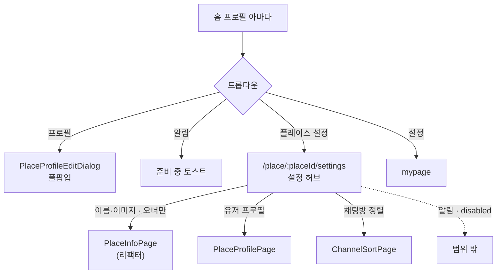
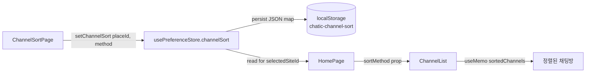

# 플레이스 설정 (Place Settings)

> 상태: Live · 최종 갱신: 2026-07-27 · 관련 ADR: [[ADR-0031]](../../../../docs/adr/0031-place-settings-hub.md)

## 목적

플레이스(=Site) 하나에 대한 설정을 한곳에서 다룬다. 홈 프로필 드롭다운에서 진입하는 **라우트 기반 설정 허브**를 두고, 그 아래에서 (1) 플레이스 이름/이미지(오너 전용), (2) 내 플레이스 유저 프로필(닉/사진), (3) 채팅방 정렬 기준을 관리한다. 흩어져 있던 편집 화면(고아 `PlaceInfoPage`, 홈 드롭다운의 유저 프로필 다이얼로그)을 하나의 진입 지점으로 모은다.

## 설계 원칙

- **web-ui-kit 우선.** 화면은 `@chatic/web-ui-kit` 조합으로 구성한다. kit에 없는 것만 `@chatic/ui-kit`(Radix) 직접 사용 또는 kit에 신규 정의. 하드코딩 색(`#B0EA10` 등)·raw 마크업으로 새로 만들지 않는다.
- **오너 권한은 서버 값(`place.isOwner`)으로만 판별.** 비오너는 숨기지 않고 **disabled**로 노출한다.
- **기존 저장 경로 재사용.** 플레이스 편집은 `useUpdatePlace`, 유저 프로필은 `setMyProfile`. 새 저장 API를 만들지 않는다.
- **정렬은 클라이언트 선호값.** 서버 동기화 없이 플레이스별 localStorage. 중앙 레지스트리(`preferenceKeys.ts`)에 단 하나의 키로 등록한다.
- **유저 프로필 폼은 단일 구현.** 드롭다운(다이얼로그)과 설정 페이지가 같은 본문(`PlaceProfileFormDialog`)과 저장 로직을 공유하고 컨테이너만 분기한다.

## 범위

**포함**

- 홈 프로필 드롭다운에 "플레이스 설정" 진입 항목 추가.
- 설정 허브 페이지(계층형 목록).
- 플레이스 설정(이름/이미지) 페이지 — 오너 전용, 비오너 disabled. `PlaceInfoPage`를 web-ui-kit로 리팩터 + 오너 가드 버그 수정.
- 플레이스 유저 프로필 설정 페이지 — 폼 본문 공유(다이얼로그 진입도 유지).
- 채팅방 정렬 페이지 — 기준 선택(최근 활동순 / 안읽은 메시지 우선), 플레이스별 localStorage 저장, 홈 채팅방 목록에 반영.
- 필요한 i18n 키, 아이콘 리소스.

**제외**

- 플레이스 채팅방 관리(후속 작업).
- 플레이스 알림(미구현) — 허브에 disabled/placeholder 행으로만 노출 가능.
- 정렬 서버 동기화·수동 드래그 재배치(@dnd-kit).

## 시나리오

1. **허브 진입** — 홈 우상단 프로필 아바타 탭 → 드롭다운에서 **플레이스 설정** → `/place/:placeId/settings` 허브로 이동. 활성 플레이스가 없으면(`!selectedSiteId`) 항목 disabled.
2. **플레이스 설정(오너)** — 허브에서 "플레이스 설정" 행 탭 → 이름/이미지 편집 페이지. 이름 1–20자, 이미지 ≤10MB(150px 리사이즈). 저장 시 `useUpdatePlace` → 낙관적 반영, 완료 후 뒤로.
3. **플레이스 설정(비오너)** — 허브의 "플레이스 설정" 행이 disabled(탭 불가). (오너 판별 `place.isOwner`.)
4. **유저 프로필 — 드롭다운 경로** — 홈 드롭다운의 **프로필** → 풀팝업 다이얼로그(`PlaceProfileEditDialog`, 기존 그대로).
5. **유저 프로필 — 설정 경로** — 허브에서 "플레이스 유저 프로필" 행 탭 → 라우트 페이지. 본문/저장은 다이얼로그와 동일(`PlaceProfileFormDialog` + `setMyProfile`).
6. **채팅방 정렬** — 허브에서 "채팅방 정렬" 행 탭 → 기준 선택 페이지. **최근 활동순**(기본) / **안읽은 메시지 우선** 중 선택 → 즉시 저장(플레이스별). 홈으로 돌아오면 채팅방 목록이 선택 기준으로 정렬.

## 다이어그램

### 진입/네비게이션

### 정렬 선호값 흐름

## 상세 구현

### 라우트

- `apps/web/src/app/routes/paths.ts:51` `ROUTES.place`에 하위 경로 추가:
    - `settings: (placeId) => /place/${placeId}/settings` (허브)
    - `settingsInfo` / `settingsProfile` / `settingsSort` (허브 하위)
- `apps/web/src/app/features/place/routes/index.tsx:8` 현재 `:placeId` 단일 라우트 → 허브/하위 라우트 추가. (기존 `:placeId`=PlaceInfoPage 직접 진입은 호출부가 없어 안전하게 재배치 가능.)

### 설정 허브 (신규)

- `features/place/pages/PlaceSettingsHubPage.tsx` — `ScreenLayout` + `ModalTopBar`(또는 기존 `PageHeader`) + `MenuCard`/`ListRow` 목록. 각 행 `trailing`에 `IconChevronRight`, `onClick`으로 하위 라우트 이동. 오너 아니면 "플레이스 설정" 행 `disabled`(ListRow는 `onClick` 없으면 비활성 표현; disabled용 스타일 확인 필요 → 필요 시 kit 보강).
- placeId·isOwner 소스: `useRuntimeRepositories().place.observeItem(placeId, ...)`로 관측(현 `PlaceInfoPage.tsx:44` 패턴 재사용).

### 플레이스 설정(이름/이미지) — 리팩터

- `features/place/pages/PlaceInfoPage.tsx` 를 web-ui-kit로 재작성:
    - raw `<input>` → `TextField`, raw 아바타/카메라 버튼 → `ProfileAvatar`(glyph="group" + hidden file input), 하단 raw 버튼 → `FloatingButton`, 헤더 → `PageHeader`, 레이아웃 → `KeyboardAwareLayout`. 생성일은 `Text`로 표시.
    - **오너 가드 버그 수정**: `if (place && place.isOwner) navigate(-1)` → `!place.isOwner` (비오너면 뒤로). 허브에서 이미 disabled로 막으므로 이 가드는 방어적 리다이렉트.
    - 저장 `useUpdatePlace` 유지.

### 유저 프로필 설정 페이지 (신규, 폼 본문 추출)

- **폼 본문 추출** — `PlaceProfileFormDialog`의 폼 본문·상태·이미지 처리·미저장 종료 가드를 **컨테이너 무관 컴포넌트 `PlaceProfileForm`으로 추출**(`features/home/components/PlaceProfileForm.tsx`). `container: 'dialog' | 'page'` prop으로 크롬만 분기하고, 상태/검증/저장 로직은 이 한 곳에만 존재.
    - `container='dialog'` → 기존 슬라이드업 `Dialog` + `ModalTopBar`. `container='page'` → `fixed inset-0` 풀스크린 + `PageHeader`(뒤로가기=미저장 가드) + `FloatingButton`.
    - `PlaceProfileFormDialog` — 얇은 래퍼(`<PlaceProfileForm container="dialog" {...props} />`)로 축소, 기존 시그니처(`PlaceProfileFormDialogProps = Omit<PlaceProfileFormProps,'container'>`) 유지 → `PlaceProfileEditDialog`/`PlaceProfileCreateDialog` 무변경.
    - `PlaceProfileForm`은 `PageHeader`/`KeyboardSafeAreaSpacer`를 **배럴이 아닌 직접 경로**로 import한다(`../../../ui` 배럴은 `PrivateLayout → CloudLogo → @chatic/assets`를 끌어와 jest 해석 실패). 이 컴포넌트는 home 공개 API로 노출(`home/index.tsx`가 `./components` re-export).
    - `features/place/pages/PlaceProfilePage.tsx` — `PlaceProfileForm container="page"`. 초기값 `useMyProfile`, placeName은 `place.observeItem`, `onSubmit`은 `setMyProfile`를 `await` 후 void 반환(`onSubmit: () => Promise<void>` 계약 충족), `onDone`/`onExit`은 `navigate(-1)`.

### 채팅방 정렬 페이지 (신규)

- `features/place/pages/ChannelSortPage.tsx` — `PageHeader` + `SheetOption`(라디오 행) 2개: 최근 활동순 / 안읽은 메시지 우선. 선택 즉시 `usePreferenceStore.setChannelSort(placeId, method)`(별도 저장 버튼 없음).

### 정렬 선호값 저장 (스토어)

- `apps/web/src/app/stores/preferenceKeys.ts` — `PREFERENCES.channelSort: { strategy: 'local', localKey: 'chatic-channel-sort', defaultValue: '{}' }`. 플레이스별 값이라 `{ [placeId]: 'recent' | 'unread' }` JSON 맵을 한 키에 저장(native 동기화 불필요 → `local`). 타입 `ChannelSortMethod = 'recent' | 'unread'` + 기본값 상수 `DEFAULT_CHANNEL_SORT = 'recent'` 도 여기서 export.
- `apps/web/src/app/stores/usePreferenceStore.ts` — 상태 `channelSort: Record<string, ChannelSortMethod>`(초기값 `parseChannelSort(readPreference('channelSort'))` — 배열/비객체/파싱실패는 `{}`로 안전화) + 액션 `setChannelSort(placeId, method)`(기존 맵과 병합해 다른 플레이스 값 보존 후 `persistPreference(..., JSON.stringify(next))`). `create` 시그니처를 `(set, get)`로 확장. `hydrate`는 local 전략이라 관여 안 함.

### 홈 채팅방 목록 반영

- `features/home/pages/HomePage.tsx` — 프로필 드롭다운의 "프로필" 다음에 "플레이스 설정" 항목 추가 → `navigate(ROUTES.place.settings(selectedSiteId))`, `disabled={!hasActivePlace}`. `channelSortMethod = (selectedSiteId && channelSort[selectedSiteId]) || DEFAULT_CHANNEL_SORT` 계산 → `ChannelList`에 `sortMethod` prop 전달.
- **정렬 로직은 순수 함수로 분리** — `features/home/lib/sortChannels.ts`의 `sortChannels({channels, joinByChannel, unreadByChannel, sortMethod})`. base는 activity 내림차순(join updatedAt → `$join` → 채널 activity, `toTime`으로 정규화). `unread`이면 그 위에 안읽은(>0) 그룹을 stable sort로 상위 배치(그룹 내부는 activity 순 유지). `recent`이면 base 그대로. `toTime`도 이 모듈로 이동.
- `features/home/components/ChannelList.tsx` — `sortMethod?: ChannelSortMethod` prop(기본 `'recent'`) 추가, `sortedChannels` useMemo가 `sortChannels(...)` 호출.

### 컴포넌트/아이콘

- 신규 kit 컴포넌트 불필요 — 허브=`MenuCard`/`ListRow`(disabled prop 이미 존재), 정렬=`SheetOption`, 폼=`TextField`/`ProfileAvatar`/`FloatingButton`, 허브 chevron=`IconChevronRight`. 드롭다운만 `@chatic/ui-kit` Radix `DropdownMenu` 직접 사용.
- i18n: `homePage.menuPlaceSettings`, `placeSettings.*`, `channelSort.*` 키를 ko/en `translation.json`에 추가. 유저 프로필/플레이스 정보는 기존 `placeProfileEdit.*`/`placeInfo.*` 재사용.

## 검증 방법

- **유닛 테스트** (worktree 경로에서 `npx nx test web --testPathPatterns=<pattern>`)
    - `apps/web/src/app/features/home/lib/sortChannels.test.ts` — `toTime` 정규화, `recent`/`unread` 정렬(안읽은 상위 + 그룹 내부 activity 유지, unread 0은 읽음 취급, 원본 불변). 9 케이스 통과.
    - `apps/web/src/app/stores/usePreferenceStore.test.ts` — `setChannelSort`가 상태·localStorage(JSON 맵) 반영, 다른 플레이스 병합 보존, 재설정 교체, local 전략(브리지 미호출). 추가 케이스 통과.
- **브라우저 E2E 확인** — 워크트리 vite(`preview_start name=web`, node_modules 심링크 + `apps/web/.env` 복사 필요), 기본 클라우드(DoU Home) 세션에서:
    - 프로필 드롭다운에 "Place Settings" 항목 노출 → 허브 진입.
    - 허브: Place Information 행이 비오너라 "Only the owner can change this" 표시(오너 가드 동작), Place Profile / Sort Chats 이동, Notifications는 "Coming soon" disabled.
    - Sort Chats에서 "Unread first" 선택 → `localStorage['chatic-channel-sort'] === {"0000":"unread"}`로 플레이스별 저장 확인.
    - Place Profile 페이지가 기존 닉("링,ㄴ")으로 **선채워짐** 확인(빈 폼 회귀 없음).
    - 콘솔 에러는 백엔드 미연결 `[SOCKET] 503`뿐(환경적), React/임포트 에러 없음.
- **미확인** — 오너 소유 플레이스에서의 이름/이미지 실제 편집(기본 place는 비오너), Figma 인증 후 픽셀·행 세트 대조.
