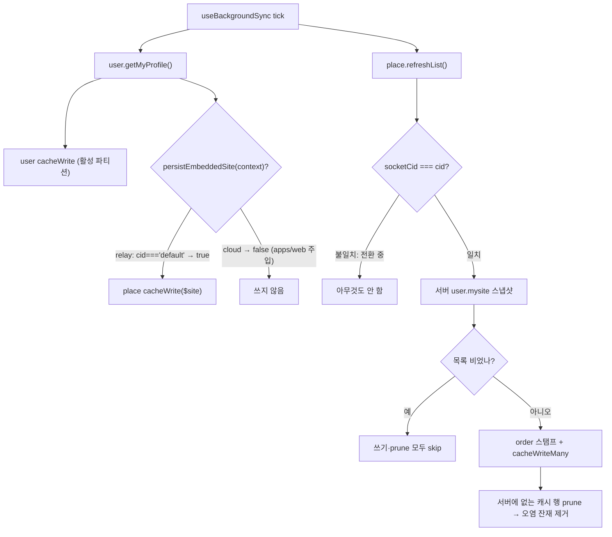
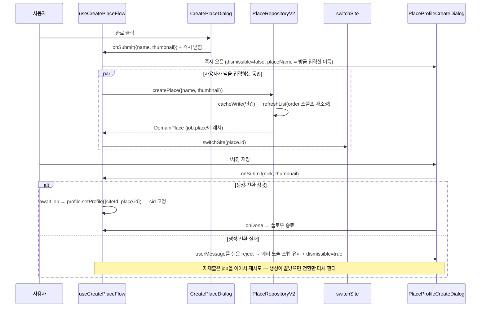
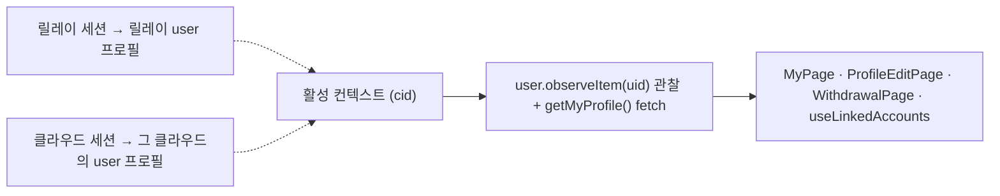

# 기본플레이스 relay 스코핑과 플레이스 생성·수정 경로

> 상태: Live · 최종 갱신: 2026-08-06 · 관련 ADR: [0045](../../../../../docs/adr/0045-relay-default-place-scoping-profile-step-and-avatar-unification.md) (결정 1~5; 결정 6은 [web-ui-kit avatar](../../../../../libs/web-ui-kit/docs/avatar.md))

## 목적

기본플레이스(relay 프로필에 임베디드된 `$site`)가 클라우드 홈 목록에 섞여 보이는 데이터 오염을
끊고, 플레이스 생성·수정 경로의 결함(생성 직후 목록 미반영, `place.update` 400)을 고치고, 새
플레이스의 owner가 반드시 플레이스 프로필을 갖게 하며, 계정 레벨 화면(MyPage 계열)이 클라우드
전환과 무관하게 relay(계정) 프로필을 보이게 한다. ADR-0045 결정 1~5의 아키텍처 문서다.

## 설계 원칙

- **앱 표시 정책을 공유 라이브러리에 하드코딩하지 않는다.** `libs/data`는 옵션(주입 지점)만 열고
  기본값은 현행 유지 — desktop-web은 아무 동작도 바뀌지 않는다.
- **서버 스냅샷이 목록의 정본이다.** `refreshList`는 쓰기만 하지 않고 정리(재조정)까지 책임진다.
  이미 [ChannelRepositoryV2.refreshList](../../../../../libs/data/src/data/repositories-v2/ChannelRepositoryV2.ts)가
  확립한 관용구(socketCid 가드 → 빈 응답 보호 → stale prune)를 Place에 그대로 이식한다.
- **소켓이 커밋된 클라우드(socketCid)와 활성 cid가 어긋난 순간에는 캐시를 만지지 않는다.**
  전환 중 잘못된 파티션 오염을 막는 기존 가드 규칙을 따른다.
- **프로필 부재 판정이 필요 없는 지점에서 강제한다.** 방금 만든 플레이스에는 프로필이 없음이
  자명하므로, `isPlaceProfileAbsent`류 판정(동기화 지연 오탐 전력, ADR-0041 결정 5)을 아예
  거치지 않는다.
- **물리 파티션 크로스-스코프 읽기는 이 트랙에서 열지 않는다.** relay 고정 표시는 앱 레벨 값
  유지 + 세션 시드로 달성하고, 데이터소스 read 경로의 contextOverride 관통은 데이터 레이어
  트랙(ADR-0036 계열)으로 미룬다.

## 범위

**포함**

- `UserRepositoryV2.getMyProfile`의 임베디드 `$site` place-캐시 저장 게이트(주입식 predicate)와
  앱 부트스트랩 주입 경로.
- `PlaceRepositoryV2.refreshList`의 서버 스냅샷 재조정(stale 행 prune + socketCid 가드) — 오염
  잔재 정리 메커니즘.
- `PlaceRepositoryV2.createPlace`의 후속 `refreshList` 자동 호출.
- `place.update` 호출부 `id` 탑재 + 리포지토리 `id === sid` 정규화.
- 플레이스 생성 플로우 마지막 스텝으로서의 프로필 생성(스킵 불가) — `useCreatePlaceFlow`
  오케스트레이션, `CreatePlaceDialog` 성공 신호, `PlaceProfileCreateDialog`의 `dismissible`
  패스스루.
- ~~`useMyUser`의 relay 고정(계정 프로필 표시).~~ → **되돌림**, 아래 §6.

**제외**

- 아바타 통합(ADR-0045 결정 6) → [web-ui-kit avatar](../../../../../libs/web-ui-kit/docs/avatar.md).
- desktop-web 동작 변화 — 옵션 기본값으로 현행 유지.
- 플레이스 입장 시 프로필 게이트(ADR-0045에서 기각), 기존 nudge(ADR-0040)·초대 경로(ADR-0041)의
  스킵 가능 정책 변경.
- 데이터소스 read 경로의 contextOverride 관통(물리 파티션 스코프 읽기) — 후속 트랙.

## 시나리오

1. **클라우드 홈에 기본플레이스가 안 보인다.** 클라우드 활성 중 백그라운드 싱크가
   `user.getMyProfile()`을 호출해도([useBackgroundSync.ts:67](../../../src/app/runtime/useBackgroundSync.ts))
   predicate가 `cid !== 'default'`이므로 임베디드 `$site`를 place 캐시에 쓰지 않는다. 이미
   오염된 행은 같은 틱의 `place.refreshList()`([useBackgroundSync.ts:60](../../../src/app/runtime/useBackgroundSync.ts))가
   서버 목록에 없는 행을 prune하면서 사라진다 — 별도 일회성 마이그레이션이 필요 없다.
2. **플레이스 생성 → 목록 즉시 반영 → 프로필 생성까지가 한 플로우다.** owner 클라우드 홈에서
   `+` → 이름/사진 입력 → 완료. `createPlace`가 리포지토리 내부에서 `refreshList`를 이어 호출해
   서버 순서(`order`)가 스탬프된 목록이 즉시 캐시에 앉는다. `switchSite`로 새 플레이스에 전환
   완료되면 프로필 생성 오버레이가 자동으로 열리는데, 이 진입에는 X(닫기)가 없다 — 닉네임을
   저장해야 플로우가 끝난다. 기존 nudge·초대 경로의 프로필 오버레이는 지금처럼 닫을 수 있다.
3. **전환 실패 시 프로필 스텝은 열리지 않는다.** `createPlace` 성공 후 `switchSite`가 실패하면
   다이얼로그는 지금처럼 닫히고 끝난다(플레이스는 서버에 존재). 이때 프로필 오버레이를 열면
   `setMyProfile`이 엉뚱한(전환 전) 사이트 스코프에 쓰므로 열지 않는다 — 이 구멍은 방 설정
   nudge(ADR-0040)가 보완한다.
4. **플레이스 이름/사진 수정이 다시 동작한다.** `PlaceInfoPage` 저장이 `id`(=`sid`)를 실어
   보내 백엔드 400(`@id is required`)이 해소되고, `updatePlace`의 낙관적 캐시 쓰기/롤백도
   같이 살아난다.
5. ~~**클라우드에 전환해도 MyPage 상단은 relay 프로필이다.**~~ → **되돌림(2026-08-06).** 계정
   프로필 표시는 **활성 세션을 따른다** — 클라우드 세션이면 그 클라우드의 user 프로필, 릴레이면
   릴레이 user 프로필. 자세한 이유는 §6.

## 다이어그램

### 임베디드 $site 저장 게이트와 잔재 정리



### 플레이스 생성 플로우 (프로필 스텝 포함)



### 계정 프로필 표시 스코프 (되돌린 뒤)



## 상세 구현

### 1) 임베디드 `$site` 저장 게이트 (ADR 결정 1)

현재 [UserRepositoryV2.ts:114-116](../../../../../libs/data/src/data/repositories-v2/UserRepositoryV2.ts)이
`getMyProfile` 응답의 `$site`를 활성 컨텍스트 그대로 place 캐시에 쓴다. 여기에 생성자 옵션으로
predicate를 연다:

```ts
// UserRepositoryV2 constructor option (기본값: 항상 저장 = 현행 유지)
persistEmbeddedSite?: (context: DataContext) => boolean;
```

주입 경로: [createRepositoriesV2](../../../../../libs/data/src/data/repositories-v2/index.ts)의
`options`(`DataRepositoriesV2Options`) →
[repositoryFactory](../../../../../libs/app-runtime/src/data/factories/repositoryFactory.ts) →
[DataManager](../../../../../libs/app-runtime/src/data/DataManager.ts) 생성자 →
[runtime.ts](../../../../../libs/app-runtime/src/data/runtime.ts)의 `configureDataRuntime(options)`.
싱글턴이 lazy 생성이므로 apps/web 부트스트랩([main.tsx](../../../src/main.tsx))에서 첫 리포지토리
접근 전에 호출한다. 이미 생성된 뒤 호출되면 경고 로그 + 무시(재생성하지 않음). apps/web 주입값:

```ts
configureDataRuntime({
    user: { persistEmbeddedSite: ctx => (ctx.cid ?? 'default') === 'default' },
});
```

desktop-web은 호출하지 않으므로 기본값(항상 저장)으로 현행 유지된다.

### 2) `refreshList` 재조정 — 잔재 정리 메커니즘 (ADR 결정 1·2)

ADR이 열어둔 "마이그레이션성 삭제냐 목록 필터냐"는 **재조정(reconciliation)으로 확정한다.**
목록 필터는 불가능하다 — 행의 `cid` 필드는 쓰일 때 파티션 컨텍스트로 스탬프되므로
([PlaceLocalDataSourceV2.ts:95](../../../../../libs/data/src/data/local/data-sources-v2/PlaceLocalDataSourceV2.ts))
오염 행을 행 데이터만으로 식별할 수 없다. 일회성 마이그레이션은 재오염(구버전 클라이언트,
미래의 다른 쓰기 경로)에 무력하다. 서버 스냅샷 기준 재조정은 원인과 무관하게 수렴한다.

[PlaceRepositoryV2](../../../../../libs/data/src/data/repositories-v2/PlaceRepositoryV2.ts)의
내부 `syncListSnapshot(query?, protectedId?)`(공개 `refreshList`가 위임)이
[ChannelRepositoryV2.refreshList:108-162](../../../../../libs/data/src/data/repositories-v2/ChannelRepositoryV2.ts)의
확립된 관용구를 따른다:

1. **socketCid 가드** — `socketCid != null && (cid || 'default') !== socketCid`면 즉시 return
   (전환 중 응답을 새 파티션에 쓰는 오염 방지, ChannelRepositoryV2.ts:117-123과 동일).
2. **빈 응답 보호** — 서버 목록이 비면 쓰기도 prune도 하지 않는다(전환 직후 불안정 응답 보호,
   ChannelRepositoryV2.ts:140-144와 동일).
3. **order 스탬프 + cacheWriteMany** — 현행 유지.
4. **stale prune** — 캐시 목록 중 서버 목록에 없는 id를 `cacheDeleteMany`로 제거. prune은
   전체 스냅샷 호출(`query === undefined`)일 때만 수행한다(부분 질의로 지우면 안 됨). 단,
   `createPlace` 직후 후속 호출에서는 방금 생성한 id를 prune 예외로 둔다(서버 목록 반영이
   순간적으로 늦을 가능성 방어).

`cacheDeleteMany`는 데이터소스에 이미 있고([data-sources-v2/types.ts](../../../../../libs/data/src/data/local/data-sources-v2/types.ts))
리포지토리는 `placeLocalDataSource`를 직접 들고 있으므로 인터페이스 추가 없이 내부 호출로
충분하다. 프로덕션 호출부는 [useBackgroundSync.ts:60](../../../src/app/runtime/useBackgroundSync.ts)
(무질의 전체 스냅샷, 60초 폴 + verify 상승 엣지 + 포그라운드 복귀 + 사이트 전환) 한 곳이라,
오염 잔재는 배포 후 첫 싱크 틱에 정리된다.

### 3) `createPlace` 후속 스냅샷 (ADR 결정 2)

[PlaceRepositoryV2.createPlace](../../../../../libs/data/src/data/repositories-v2/PlaceRepositoryV2.ts)가
단건 `cacheWrite` 후 `syncListSnapshot(undefined, domain.id)`(방금 생성한 id를 prune 예외로
전달)를 **await로 이어 호출하되 실패는 삼킨다** — 플레이스 생성 자체는 성공했으므로 후속
스냅샷 실패가 생성을 실패시키면 안 된다(다음 싱크 틱이 수렴시킨다). 모든 호출자가 일관되게
혜택을 보도록 리포지토리 내부에 둔다(호출자 부담 금지, ADR 결정 2).

### 4) `place.update`의 `id` 정규화 (ADR 결정 3)

- 호출부: [PlaceInfoPage.tsx:106-110](../../../src/app/features/place/pages/PlaceInfoPage.tsx)의
  페이로드에 `id: placeId` 추가.
  [useUpdatePlace.ts:5-9](../../../src/app/features/home/hooks/useUpdatePlace.ts)의
  `UpdatePlacePayload`에 `id` 필드를 추가한다.
- 재발 방지: [PlaceRepositoryV2.updatePlace:109-127](../../../../../libs/data/src/data/repositories-v2/PlaceRepositoryV2.ts)
  진입부에서 `id`가 없고 `sid`가 있으면 `id = sid`로 정규화한 페이로드를 만들어 원격 전송과
  낙관적 캐시 쓰기(현재 `payload.id` 부재 시 통째로 스킵되는 경로) 양쪽에 쓴다. place에서
  `id === sid`다(ADR 맥락 3).

### 5) 생성 플로우 프로필 스텝 (ADR 결정 4)

다이얼로그 A 성공 → B 오픈의 기존 관용구는
[useAddCloudFlow.tsx:14-23](../../../src/app/features/home/hooks/useAddCloudFlow.tsx)(플로우 훅이
상태 + ReactNode를 소유)이다. 같은 패턴으로 `useCreatePlaceFlow`를 신설한다:

- **`CreatePlaceDialog`는 입력 수집만 한다** (2026-08-06 개정). 서버 작업을 다이얼로그가 await하고
  성공했을 때만 다음 스텝을 여는 원래 배선은, 프로필 쓰기가 "아직 준비되지 않은 플레이스"를
  향할 여지를 남겼다(전환은 sid를 낙관적으로 pre-apply할 뿐 토큰 커밋은 비동기다).
  이제 다이얼로그는 `onSubmit(input)`으로 입력만 넘기고 닫히며, `place.create` + `switchSite`는
  플로우 훅이 **프로필 스텝 아래에서** 돌린다. 사용자가 닉을 치는 시간이 곧 서버가 필요로 하는
  시간이라 대기가 보이지 않는다. 프로필 쓰기는 그 job을 await한 뒤,
  주변 컨텍스트가 아니라 **생성된 place.id에 고정**해서 나간다(`useSetMyPlaceProfile(value, siteId)`
  → `profile.setProfile`).
- **`PlaceProfileCreateDialog`에 `dismissible` 패스스루.**
  [PlaceProfileForm.tsx:69-74](../../../src/app/features/home/components/PlaceProfileForm.tsx)가
  이미 `dismissible?: boolean`(기본 `true`)을 갖고 X 숨김(:335)·esc/overlay 차단(:311)까지
  구현되어 있으며, [PlaceProfileFormDialog](../../../src/app/features/home/components/PlaceProfileFormDialog.tsx)는
  `Omit<…, 'container'>`라 이미 통과 가능하다. 좁히고 있는 것은
  [PlaceProfileCreateDialog.tsx:8-22](../../../src/app/features/home/components/PlaceProfileCreateDialog.tsx)
  한 겹뿐이므로 prop을 추가해 내려보낸다. 공유 계약 문서([place-profile-create-shared-contract](../../../../../docs/plans/place-profile-create-shared-contract.md))의
  "필요해지면 그때 넣는다"가 지금이다.
- **`useCreatePlaceFlow`**: `CreatePlaceDialog`(기존 open 상태 이관) +
  `onCreated` 시 `PlaceProfileCreateDialog`를 `dismissible={false}`, `exit` 미전달, `onDone`에서
  플로우 종료로 렌더. `placeName`은 기존
  [useActivePlaceName](../../../src/app/hooks/useActivePlaceName.ts)이 전환 완료 후 새 플레이스
  이름을 해석한다. [HomePage.tsx:187·369](../../../src/app/features/home/pages/HomePage.tsx)의
  로컬 상태·렌더를 플로우 훅 소비로 교체한다.
- **범위 한정**: 기존 진입점 — 방 설정 nudge
  ([ChannelSettingsPage.tsx:387-397](../../../src/app/features/channels/pages/ChannelSettingsPage.tsx)),
  초대 경로([RelayInviteAccept.tsx:114-119](../../../src/app/features/invite/accept/components/RelayInviteAccept.tsx),
  [ContactInvitePage.tsx:352-359](../../../src/app/features/invite/pages/ContactInvitePage.tsx)) —
  는 `dismissible`을 넘기지 않으므로 기본값 `true`로 현행 유지된다.

### 6) `useMyUser` relay 고정 (ADR 결정 5) — ❌ 되돌림 (2026-08-06)

**구현 후 되돌렸다.** 의도한 표시 규칙은 "계정 프로필은 항상 relay"가 아니라 **활성 세션을 따른다**였다
— 클라우드 세션이면 그 클라우드의 user 프로필, 릴레이면 릴레이 user 프로필. `user.update`도 양쪽 서버에서
동작하며 활성 소켓이 닿는 쪽 레코드를 고치므로, 표시와 쓰기가 함께 활성 소켓을 따르면 애초에 불일치가 없다.

[useMyUser](../../../src/app/hooks/useMyUser.ts)는 다시 활성 컨텍스트의 user 캐시를 `observeItem(uid)`로
관찰하고 `getMyProfile()`을 호출하는 원래 형태다. 함께 사라진 것:

- 모듈 스코프 relay 값 보관(`heldRelayUser`)과 구독자 통지, `patchMyRelayUser`.
- web-core의 `getRelaySessionUser`(relay 토큰 시드) — 이 용도 전용이라 죽은 코드가 됐다.
- `ProfileEditPage`의 저장 비활성화 + 안내 문구(`profileEdit.relayOnlyNotice`).
- 합성 루트의 `user.update` relay 핀과, 그에 딸린
  [UserRepositoryV2](../../../../../libs/data/src/data/repositories-v2/UserRepositoryV2.ts)의 relay 스코프
  캐시 가드.

ADR 결정 1~4·6(기본 플레이스 스코핑, 생성 플로우 프로필 스텝, 아바타 통합)은 그대로 유효하다. 아래 조사
기록은 남겨둔다 — "컨텍스트 오버라이드로는 물리 캐시 파티션을 바꿀 수 없다"는 사실은 여전히 참이고, 다음에
비슷한 시도를 할 때 같은 곳을 다시 파지 않게 해준다.

<details>
<summary>당시 조사 기록 (되돌리기 전)</summary>

**ADR이 지목한 "기존 withContext / 컨텍스트 오버라이드 메커니즘"은 이 용도에 쓸 수 없다.**
조사 결과: 물리 캐시 파티션 키는 `${type}:${cid}:${uid}:${id}`로 어댑터가 **공유 컨텍스트
프로바이더에서 직접** 산출하며([storages/utils.ts:73](../../../../../libs/data/src/data/local/storages/utils.ts),
[IndexedDBAdapter.ts:42](../../../../../libs/data/src/data/local/storages/IndexedDBAdapter.ts)),
`contextOverride`는 옵저버 스코프키와 행 `cid` 스탬프에만 반영된다. 읽기 경로는 override를
받고도 사용하지 않는다([UserLocalDataSourceV2.cacheRead:28-34](../../../../../libs/data/src/data/local/data-sources-v2/UserLocalDataSourceV2.ts)).
`withContext`는 프로덕션 사용 0건. 즉 클라우드 활성 중 relay 파티션을 읽는 것은 현 구조로
불가능하고, 이를 뚫는 read 경로 확장은 파급이 커 후속 데이터 레이어 트랙으로 미룬다(설계 원칙).

**대체 설계 — 앱 레벨 relay 값 유지** (관찰 가능한 동작은 ADR 결정 5와 동일):

- [useMyUser.ts](../../../src/app/hooks/useMyUser.ts)가 relay 활성(`cid === 'default'`,
  [useHomePlaces.ts:42](../../../src/app/features/home/hooks/useHomePlaces.ts) 관용구) 여부를
  세션에서 파생한다.
- **relay 활성**: 현행대로 `observeItem(uid)` 관찰 + `getMyProfile()` fetch. 관찰값을 모듈
  스코프 홀더(`heldRelayUser`, uid 키 — 다른 계정 재로그인 시 이전 값이 새지 않게)에 보관한다.
- **클라우드 활성**: 관찰·fetch를 하지 않고 홀더 값을 보여준다. 홀더가 비어 있으면(클라우드
  선택 상태로 새로고침한 콜드 스타트) 세션의 **relay 프로필 시드**를 폴백으로 쓴다 —
  [useSeedMyUserCache](../../../src/app/hooks/useSeedMyUserCache.ts)가 쓰는
  `getActiveSessionUser()`는 `cloudProfile ?? relayProfile`이라 그대로 쓸 수 없어, relay 토큰의
  유저 필드를 명시적으로 읽는
  [getRelaySessionUser](../../../../../libs/web-core/src/session/contextStore.ts)를 web-core에
  두고 쓴다.
- 원격 fetch를 relay 활성으로 게이트하므로 "클라우드 연결 중 relay 원격 fetch 불가" 제약
  (ADR 맥락 §제약)을 자연히 지킨다. 사용처 4곳(MyPage.tsx:29 · ProfileEditPage.tsx:21 ·
  WithdrawalPage.tsx:16 · useLinkedAccounts.ts:39)은 훅 시그니처가 그대로라 무변경.
- **편집 정책 (2026-08-06 개정)**: `user.update`는 **relay·cloud 양쪽 모두에서 동작**하고, 각각 그 서버의
  user 레코드를 고친다. 원래는 표시만 relay 고정이고 저장은 활성 소켓으로 나갔으므로, 클라우드 활성 중
  저장하면 **그 클라우드의 user 레코드**가 바뀌고 화면에는 아무 변화가 없었다. 그래서 저장을 막고 안내
  문구를 띄웠다. 이제 **저장도 relay 고정**이다 — 서버 소유권 때문이 아니라(invite·linkAccount와 그 점이
  다르다) 이 앱이 보여주고 편집하는 프로필이 relay user 프로필 하나뿐이기 때문이며, 합성 루트가
  `user.update`를 relay 슬롯에 바인딩한다([remoteFactory](../../../../../libs/app-runtime/src/data/factories/remoteFactory.ts)).
  비활성화·안내 문구(`profileEdit.relayOnlyNotice`)는 제거했다. 클라우드 쪽 user 레코드를 정말로 편집해야
  하는 기능이 생기면 이 바인딩을 재사용하지 말고 그 메서드에 `route`를 노출한다(kind-scoped-routing.md S4).
  캐시 파티션은 여전히 활성 컨텍스트를 따르므로, 클라우드 활성 중 저장은
  [UserRepositoryV2](../../../../../libs/data/src/data/repositories-v2/UserRepositoryV2.ts)가 캐시를 건드리지
  않고(그 파티션의 클라우드 프로필을 덮어쓰지 않도록) 앱이 보관값(`patchMyRelayUser`)에 반영한다.

</details>

## 검증 방법

- **libs/data 유닛 테스트** (`nx test data`, 전체 35 스위트 / 290 테스트 그린):
    - [UserRepositoryV2.test.ts](../../../../../libs/data/src/data/repositories-v2/UserRepositoryV2.test.ts)
      — predicate 미주입 시 `$site` 저장(현행 유지), veto 시 미저장(유저 쓰기는 유지), 승인
      컨텍스트에서 저장.
    - [PlaceRepositoryV2.test.ts](../../../../../libs/data/src/data/repositories-v2/PlaceRepositoryV2.test.ts)
      — refreshList: socketCid 불일치 시 무동작, 빈 응답 시 쓰기·prune 모두 skip, 서버에 없는
      행 prune, 부분 질의 시 prune 안 함; createPlace: 후속 스냅샷 + 생성 id prune 보호,
      스냅샷 실패해도 createPlace 성공; updatePlace: `sid`만 있을 때 `id` 정규화(원격 페이로드
        - 낙관적 캐시 양쪽).
- **apps/web 테스트** (`nx test web`, 전체 153 스위트 / 1260 테스트 그린):
    - [CreatePlaceDialog.test.tsx](../../../src/app/features/home/components/CreatePlaceDialog.test.tsx)
      — 완료 시 닫고 trim된 입력을 `onSubmit`으로 전달(서버 작업 없음), 입력 유무별 즉시 닫힘/이탈 확인.
    - [useCreatePlaceFlow.test.tsx](../../../src/app/features/home/hooks/useCreatePlaceFlow.test.tsx)
      — 생성 확인 즉시 프로필 스텝 오픈(dismissible=false, 방금 입력한 이름), 프로필 저장은
      create·switch 이후에 생성된 id로 고정 전송, 생성 실패 시 프로필 미기록 + 스텝 이탈 허용,
      전환만 실패 후 재시도 시 플레이스 재생성 없음.
    - [PlaceProfileCreateDialog.test.tsx](../../../src/app/features/home/components/PlaceProfileCreateDialog.test.tsx)
      — `dismissible=false`면 닫기(X) 부재.
    - [useMyUser.test.ts](../../../src/app/hooks/useMyUser.test.ts) — 되돌린 뒤에는 활성 컨텍스트
      관찰/fetch만 검증한다(relay 고정 케이스는 §6과 함께 제거).
    - `place.update`의 `id`는 `UpdatePlacePayload`의 필수 필드라 호출부 누락이 컴파일로
      강제되고, 리포지토리 정규화가 이중 방어한다.
- **정적 검사**: 변경 파일 eslint 클린. `nx typecheck data`는 develop 선재 부채(chat reaction
  타이핑 vs 설치본 불일치)로 이 환경에서 그린 게이트가 아니며, 변경 파일 한정 신규 에러 0.
- **수동 확인(배포 QA)**: 클라우드 전환 상태에서 홈 목록에 기본플레이스 부재(첫 싱크 틱 후),
  플레이스 생성 → 프로필 오버레이 X 부재 → 저장 후 종료, 플레이스 이름/사진 수정 성공(400
  해소), MyPage 상단이 클라우드 전환과 무관하게 relay 프로필 유지, 클라우드 활성 중
  계정 프로필은 활성 세션을 따라 표시·편집(2026-08-06 되돌림). (생성/오너 UI는 owner 클라우드 세션이 필요해 로컬
  프리뷰 재현이 제한적 — place-channel-create.md와 동일 제약.)

관련 문서 갱신(dev-4_doc-sync 대상): [place-channel-create.md](../home/place-channel-create.md)
시나리오 4(프로필 스텝), [place-profile.md](../home/place-profile.md)(`dismissible` 재도입),
[mypage README](../mypage/README.md)(relay 고정), libs/data repositories 문서.
