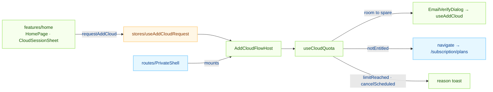
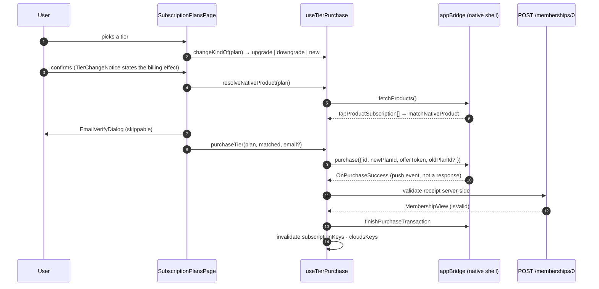

# subscription — the plan a user is on, and the clouds it allows

`apps/web/src/app/features/subscription` owns one product: **DoU Pro, sold as tiers 1 through 5,
where the tier number is the number of clouds the account may hold at once.** Around that it owns
four decisions — which tiers may be sold, which state the membership is in, whether another cloud
may be created, and what a tier change sends to the store — plus the in-app purchase flow that
executes them through the native bridge.

Every one of those decisions is a pure function in `lib/` with a hook in `hooks/` that feeds it
server data. Screens branch on the result; they never re-derive it, and no other feature derives it
at all.

## Layout

```text
apps/web/src/app/features/subscription/
├── index.ts                  SubscriptionRoutes · AddCloudFlowHost · EmailBindRequestHost · CloudMembershipSummary
├── pages/                    4 screens
├── lib/                      7 pure modules — no React, no network
├── hooks/                    13 hooks — server data fed into lib/
├── components/               9 components + subscription-select/ (PlanCard · PolicyFooter · TierRefusalDialog)
├── types/index.ts            NativePurchase · PurchaseProduct · PurchaseError · PageState
├── consts/index.ts           IS_DEV · APP_ID · POLICY_BASE_URL
└── routes/index.tsx          the four routes under /subscription
```

The files worth naming, because the filename does not give them away:

| File                      | What it decides                                                                    |
| ------------------------- | ---------------------------------------------------------------------------------- |
| `lib/plans.ts`            | Tier order, adjacency, the catalog join, the allowance lookup, the display name    |
| `lib/quota.ts`            | Clouds owned, whether one more may be created, which clouds sit past the allowance |
| `lib/membershipStatus.ts` | The five states and entitlement, admin override included                           |
| `lib/nativeProducts.ts`   | The store-catalog join and the purchase payload                                    |
| `lib/cloudEmails.ts`      | Email reuse and unbound clouds                                                     |
| `lib/emailVerify.ts`      | `EmailVerifyRefusal` — the tag that separates an intended refusal from a failure   |
| `hooks/usePlanCatalog.ts` | The single read of "what we sell and what the user is on"                          |

There is no `SubscriptionSelectDialog` and no second plan picker: `SubscriptionPlansPage` is the
only screen that sells a tier.

## Responsibilities

This feature decides what to **offer** and what to **say**. It does not decide what is allowed —
the server does, and it is the only party that can:

- `guardQuota` is atomic and returns 409 when a cloud would overflow the allowance. The app's own
  quota check exists so the user is told why a button will not work, not to enforce anything.
- Receipts are validated server-side only. `POST /memberships/0` verifies against Apple or Google
  (backend-api → iap-api) before creating or renewing the membership; no client hits iap-api's
  `/validate/<platform>` route, which was never reachable with a client credential.
- Price is whatever the store says. `lib/price.ts` passes `displayPrice` through and formats
  nothing — a tax-inclusive local price is not something the app may compute.

It also refuses to execute anything irreversible. Clouds past the allowance are detected and named;
releasing one happens in `mypage`'s cloud management, at the user's hand.

## The shared contract

### 1. Every tier fact comes from the server catalog

`GET /products/plans` is the source of the sellable list, the allowance (`maxClouds`), the tier
order (`sort`) and the trial length (`trialDays`). None of it is duplicated as an app constant, so a
pricing change ships without an app release.

The membership is joined to that catalog by `productId`, never read for product fields directly:

```ts
const currentPlan = findPlanById(plans, summary.productId) ?? receiptPlan;
```

**`membership.product$` is a head.** The relay attaches the product with `asHead(model)`, and
`ProductHead` is `{ id, name, nameEn, platform }` — no `maxClouds`, no `sort`, no `trialDays`. The
read still compiles, because `MembershipView.product$` is typed as the wider `ProductView`
(`Partial<ProductModel>`), and then it is `undefined` at runtime. Anything that reads an allowance
off the membership is silently broken; `resolveMaxClouds` against the catalog is the only correct
lookup.

`productId` is stored `#`-prefixed (`#pro-tier-01`) and matches `product.id` in the catalog once
`stripPlanId` removes the `#`. A raw `#pro-tier-01` on screen means the join failed —
`planDisplayName` falls back to the id deliberately, so the failure looks like one.

The catalog call sends **no `platform` filter**. The server always filters by stage anyway, so one
unfiltered call returns both stores' tiers: the sellable list is narrowed to this build's platform
in `selectSellablePlans`, while the join still resolves a membership bought on the other store. A
platform-filtered list cannot — an iOS purchase read on an Android session would lose its allowance.

### 2. Five states, and the override that comes first

`summarizeMembership(membership, plan, now)` collapses a membership into exactly five states:

| State             | Means                                    | `isEntitled` | New cloud |
| ----------------- | ---------------------------------------- | ------------ | --------- |
| `none`            | Never subscribed, or `status === 'none'` | ✗            | ✗         |
| `active`          | Paid period running (payment retry too)  | ✓            | ✓         |
| `cancelScheduled` | Cancelled, paid period still running     | ✓            | ✗         |
| `expired`         | `validUntil` has passed                  | ✗            | ✗         |
| `blocked`         | An operator shut it off from the console | ✗            | ✗         |

Two rules hold this together, and both were bought with production bugs:

**Entitlement is not the server's `isValid`.** That flag goes false the moment `canceledAt` is set,
while the paid period keeps running. Reading it as entitlement zeroes the allowance of someone who
has already paid for the month and flags their clouds as excess. The paid window decides
entitlement; `isValid` only decides whether the server will provision, which is why
`cancelScheduled` keeps its allowance but cannot add a cloud.

**`blocked` is not `expired`.** The store keeps charging through an operator block, so telling that
user their subscription expired is wrong in the direction that produces support tickets.

The admin override is read first and wins, matching the relay's own derivation. The fields are
`adminStatus`, `adminUntil` and `adminProductId` on `MembershipModel` (`adminAt`, `adminBy` and
`adminReason` record who did it and why). `adminStatus === 'active'` grants — state `active`, with
the allowance read from `adminProductId` — and `expired`/`canceled` block.

The judgement runs off those raw fields, not off the stored `status`: the relay derives `status`
once at write time and nothing sweeps it afterwards, so a lapsed grant still reads `active` there.
Comparing `adminUntil` to the render clock is right the moment it passes. Both predicates,
`isAdminOverrideActive` and `resolveEffectiveProductId`, come from
[`@chatic/shared`](../../../../../libs/shared/README.md) and are shared with the admin console — the
same server contract is not implemented twice.

`isSuper` is **not** read. It was the earlier spelling of an indefinite grant, the relay stopped
deriving from it, and its holders were migrated onto overrides; it is marked deprecated in the
backend types. Reading it here would keep a second, staler axis alive in one client.

Entitlement and the store also come apart, which is why `SubscriptionSummary` carries
`hasLiveReceipt` next to `isEntitled`. A grant is entitled with nothing at the store; a block leaves
the store charging with entitlement gone. Anything that talks to the store — replacing a plan,
naming an `oldPlanId` — follows `hasLiveReceipt`.

`trialDaysLeft` is `validFrom + trialDays` measured against now, and it is reported only when the
result lands inside `(0, trialDays]`. The stores disagree subtly about what the receipt's start
timestamp means, and a wrong number here is a promise to the user.

### 3. The allowance

`useCloudQuota` is the one place that answers "may another cloud be added". `used` counts clouds
whose `status !== 'expired'`; `limit` is `currentPlan.maxClouds`, or `null` when the join could not
resolve it.

`null` is **not zero**. A granted membership with no product, or a catalog that has not loaded,
means the app does not know — so it does not refuse. The server says no if the answer is no.

Reasons are suppressed while the inputs are still loading: "구독이 필요해요" over a half-loaded
membership is worse than a moment of silence.

`findExcessClouds` names the clouds past the allowance after a downgrade, ordered by `cloudNo` (the
owner's own creation sequence) so the newest are the ones over the line. That ordering is the app's
guess at what a server-side cleanup would choose, and `ExcessCloudBanner` says so rather than
presenting it as settled. The banner has no delete button.

### 4. Buying a tier, and replacing one

Adjacency is **app policy**, not a store or backend rule. A tier change may move one step:

| Current        | Target              | Kind                    |
| -------------- | ------------------- | ----------------------- |
| none           | `sort === 1`        | `new`                   |
| none           | any other           | `blocked` (`entryTier`) |
| a running tier | the same tier       | `current`               |
| a running tier | one step up or down | `upgrade` / `downgrade` |
| a running tier | two or more steps   | `blocked` (`tierJump`)  |

The reason is that each cloud carries its own email verification: a tier 1 → 3 jump would collect
two verifications before either cloud is usable, and a multi-step drop would strand clouds that no
UI can release yet. `getTierRefusal` splits the two `blocked` cases because they read nothing alike
to the user, and `nearestSelectablePlan` offers the closest pickable tier instead (ties go to the
cheaper one).

The plan a change replaces is `replaceablePlan` — the **receipt's** plan, and only while
`hasLiveReceipt` holds. An admin grant must never be named as the plan the store is replacing.

The store join key differs per store, and getting it wrong fails silently: on Apple the config key
is the product id, while on Google every tier shares one parent SKU (`ProductView.planId`) and the
key is the _base plan_ id. `matchNativeProduct` is the only join, and `lib/nativeProducts.test.ts`
guards the parent-SKU regression.

`buildPurchaseProduct` then fixes two things for a replacement:

- the offer is always `base`. The free trial exists once, on the first tier-1 subscription; sending
  its token on a replacement is refused by the store or bills the wrong offer.
- `oldPlanId` (the `#`-stripped current product id) must be present on Android. The shell derives
  the replacement mode from old-vs-new plan rank, and without it the store books a brand-new
  subscription instead of an upgrade.

### 5. Two refusals before the store opens

`purchaseAndValidate` refuses ahead of the charge, because `validateMembership` runs _after_ the
store has taken the money — failing there would leave a paid subscription with nothing to attach to.

1. **Guest.** "Log in" is the actionable instruction. This is a backstop; both entry points route a
   guest to login before the email step.
2. **No social credential.** A subscription attaches to a cloud and cloud ownership is
   social-account based. Only a definite `'absent'` blocks — `'unknown'` means the profile has not
   landed or the server never built the `link$` slot, and refusing on that would stop paying
   customers from renewing.

## Usage

### Screens

| Page                       | Route (`ROUTES.subscription.*`) | What it is                                          |
| -------------------------- | ------------------------------- | --------------------------------------------------- |
| `SubscriptionPage`         | `/subscription`                 | Status, excess banner, restore, policy links        |
| `CloudGuidePage`           | `/subscription/guide`           | Read-only pitch: free relay vs. a subscribed cloud  |
| `SubscriptionPlansPage`    | `/subscription/plans`           | The tier picker, benefits, refusal dialog, purchase |
| `SubscriptionCompletePage` | `/subscription/complete`        | Confirmation, then hand-off to the setup wizard     |

`guide` and `plans` are separate on purpose: the first argues **why** a cloud, the second asks
**which tier**. The MyPage card and the home promo banner land on `guide`, because someone reading a
banner does not yet know what a cloud is. The cloud switcher sheet goes straight to `plans` — that
user is already managing clouds, so the pitch would be a step backwards (ADR-0034 §4).

### Adding a cloud without a purchase

A purchase only ever provisions one cloud, so every cloud past the first on a multi-cloud tier is
created by `useAddCloud`. The affordances live on other screens, and features do not import each
other, so the request arrives through a store seam:



`useEmailBindRequest` + `EmailBindRequestHost` are the same shape for binding an email to a cloud
that has none. Both hosts render `null` — and run no queries — until asked, so app boot does not
gain a membership fetch.

The host mounts on `PrivateShell` rather than `AppRuntime` because the flow navigates and therefore
needs router context; `AppRuntime` is a sibling of the router, outside it.

Email verification is **optional** at this step. A cloud reaches `active` with no email bound, so
skipping leaves one to register later (`EmailRequiredBanner`, `findUnboundClouds`) rather than
blocking cloud creation on it. What is not optional is uniqueness: `useCloudEmailGuard` refuses a
reused address on `send`/`resend`, before a code goes out, because the backend does not error — it
silently overwrites the first cloud's `verify$.cloudId` pointer and breaks that cloud's release
cascade. A released (`expired`) cloud frees its address again.

### The purchase round trip



`Purchase` is the bridge's one push-result command: the result arrives as `OnPurchaseSuccess` /
`OnPurchaseError`, which a resolver ref turns back into a promise. Every store failure passes
through that one handler, so it is the only place that logs them — and a `user-cancelled` code is
logged as `info`, because a cancellation is an ordinary outcome and filing it as an error misreads
the funnel. See [architecture/bridge.md](../../bridge/README.md) for the seam itself.

`useRestorePurchases` is the recovery path for the gap in the middle: the store charged, the
validation never landed. It re-validates every receipt the store still holds, and exists as a hook
because two screens reach it — the status screen and the picker's policy footer.

### What not to do

- **Do not read a product field off the membership.** `product$` is a head. Join the catalog.
- **Do not gate entitlement on `isValid`.** It is false throughout a scheduled cancellation.
- **Do not treat `limit === null` as zero.** It means unresolved; let the server refuse.
- **Do not call `useTierPurchase` to learn what the current plan is.** A second instance stands up a
  second `useSubscriptionIap`, and therefore a duplicate `OnPurchaseSuccess` subscription. Read
  `usePlanCatalog` directly — that is why `usePlanOptions` does.
- **Do not import this feature from another one.** Raise a request through `stores/useAddCloudRequest`
  or `stores/useEmailBindRequest`; for a read-only membership line, compose the exported
  `CloudMembershipSummary`. The barrel re-exports `SubscriptionRoutes`, so importing it drags every
  subscription page into the calling chunk.
- **Do not surface a raw error message.** `throwIfApiError` throws backend strings and axios throws
  `"Request failed with status code 500"`; both would land in a toast. Only an `EmailVerifyRefusal`
  is shown verbatim, and `isEmailVerifyRefusal` matches by name so it survives chunk boundaries.
- **Do not disable a refused tier card with HTML `disabled`.** It swallows the tap and reads as a
  broken button. `PlanCard` stays tappable with `aria-disabled`, and the tap opens
  `TierRefusalDialog` with the actual rule.

## Notes for implementers and tests

Fifteen test files, and the pure modules in `lib/` are testable by value comparison alone:

```bash
npx jest --config apps/web/jest.config.js --testPathPatterns="features/subscription"
```

The suites worth knowing before you change something:

| Suite                              | Guards                                                                         |
| ---------------------------------- | ------------------------------------------------------------------------------ |
| `lib/membershipStatus.test.ts`     | Five states, admin override, `cancelScheduled` keeps entitlement, trial bounds |
| `lib/quota.test.ts`                | Per-state refusal reasons, `limit=null` never blocks, newest clouds are excess |
| `lib/plans.test.ts`                | `#` join, Apple/Google key confusion, adjacency, head-only membership → `null` |
| `lib/nativeProducts.test.ts`       | Parent-SKU regression, `base` offer on a change, `oldPlanId` attached          |
| `hooks/useSubscriptionIap.test.ts` | Guest and social-link refusals, Android replacement payload                    |
| `i18n.test.ts`                     | ko/en keys exist and `{{max}}` / `{{count}}` / `{{days}}` survive              |

Type checking is `tsc -b`; the full app checklist is in the [app README](../../../README.md).

The traps that are not in the tests:

| Trap                       | What happens                                                                                                                                                                                                                                                                   |
| -------------------------- | ------------------------------------------------------------------------------------------------------------------------------------------------------------------------------------------------------------------------------------------------------------------------------ |
| `IS_DEV` dry run           | `useAddCloud` passes `dryRun` in dev, mirroring the membership route, so no real infrastructure is provisioned. Cloud creation on tiers 2–5 is therefore not exercised in dev.                                                                                                 |
| Android plan order         | `ANDROID_PLAN_LIST` in `apps/mobile/src/app/services/subscriptionIap/config.ts` derives an upgrade/downgrade rank from the env list's `indexOf`. If that order diverges from tier order, the direction flips — passing an exact `oldPlanId` is what keeps the judgement sound. |
| `make` returns early       | `POST /clouds/0/make` returns once the model exists (`status=init`); workspace assignment and deploy follow asynchronously with no SLA. The success toast means accepted, not ready — the switcher shows the provisioning state.                                               |
| One email per cloud, today | Reaching tier 5 needs five addresses. Until the backend supports one account across several clouds, that is the practical ceiling on tier 2+ conversion.                                                                                                                       |
| Store price only           | Off-native there is no store and therefore no `displayPrice`; callers fall back to the server's reference value.                                                                                                                                                               |

The debug overlay's IAP screen (`features/debug`) maps 1:1 onto the bridge commands this feature
uses, which is the fastest way to exercise a purchase path without a real charge. See
[debug/README.md](../debug/README.md).

## Further reading

- [architecture/bridge.md](../../bridge/README.md) — the single native ↔ web message seam.
- [architecture/stores.md](../../state/stores.md) — why the cross-feature request seams are
  zustand stores.
- [home/README.md](../home/README.md) — the banners and the cloud switcher that raise the requests.
- [mypage/README.md](../mypage/README.md) — cloud management, where a cloud is actually released.
- [`@chatic/data`](../../../../../libs/data/README.md) — `SubscriptionRepository` and `cloud.makeCloud`
  behind `runtime.data.useRuntimeRepositories()`.
