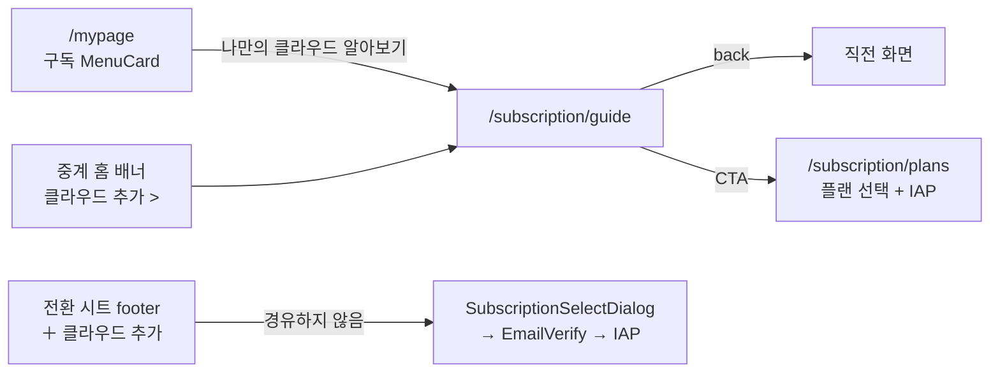
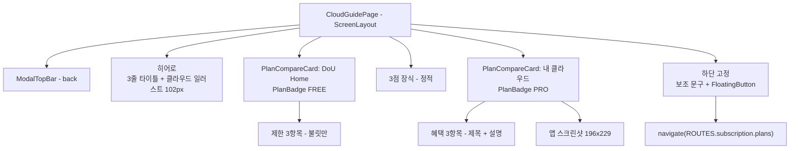
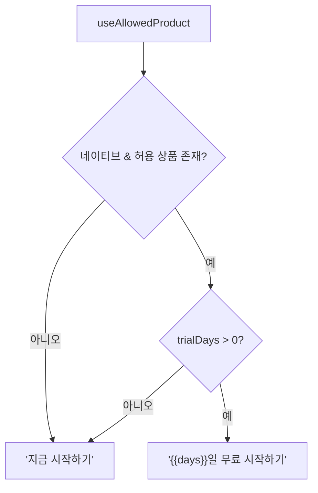

# subscription — 클라우드 안내 화면

> 상태: Live · 최종 갱신: 2026-08-03 · 관련 ADR: [[ADR-0034]]
>
> 대상: `apps/web/src/app/features/subscription` · 경로: `/subscription/guide` · Figma `3519-29515`

## 목적

**나만의 클라우드가 무엇이고 왜 구독해야 하는지**를 설명하는 정적 안내 화면이다. 기존 구독 화면들과 역할이
다르다:

| 화면              | 경로                      | 역할                                 |
| ----------------- | ------------------------- | ------------------------------------ |
| 구독 현황         | `/subscription`           | 이미 구독한 사람이 상태를 확인       |
| 플랜 선택         | `/subscription/plans`     | 상품을 고르고 IAP로 결제             |
| **클라우드 안내** | **`/subscription/guide`** | **아직 모르는 사람에게 가치를 설명** |

`DoU Home`(무료·중계)과 `내 클라우드`(PRO)를 나란히 비교해 무엇이 열리는지 보여주고, 하단 CTA로 플랜 선택
화면에 넘긴다. **결제는 하지 않는다** — 이 화면은 읽고 이해하는 곳이고, 구매는 `/subscription/plans`가 한다.

## 설계 원칙

- **읽기 전용 화면.** 서버 상태를 바꾸는 동작이 없다. 유일한 부수효과는 CTA의 navigate다. 그래서 결제·IAP·
  이메일 인증 로직은 이 화면에 들어오지 않는다.
- **맥락에 따라 경유 여부가 갈린다.** 이 화면은 **중계 홈 배너**와 **마이페이지 구독 카드**에서 들어온다.
  전환 시트 footer의 `＋ 클라우드 추가`는 이 화면을 건너뛰고 `SubscriptionSelectDialog → EmailVerifyDialog →
IAP`로 직행한다 — 거기까지 들어온 사용자는 이미 무엇을 사는지 알고 있어 설명이 오히려 불필요한 스텝이다
  (ADR-0034 개정 1).
- **트라이얼 일수를 하드코딩하지 않는다.** "7일"은 제품 정책 약속이므로 `product.trialDays`에서 읽는다. 값을
  못 구하면 일수를 언급하지 않는 문구로 폴백한다 — 없는 혜택을 약속하는 쪽이 훨씬 나쁘다.
- **web-ui-kit으로 조립.** 카드·배지·버튼·링크를 새로 그리지 않고 kit에서 가져온다. 이 화면 전용 조각만
  로컬 컴포넌트로 둔다.

## 범위

**포함**

- `/subscription/guide` 라우트와 페이지 컴포넌트.
- 진입점 둘 — 마이페이지 "구독" MenuCard의 행, 중계 홈의 클라우드 유도 배너 링크.
- 플랜 비교 카드 2종(FREE 제한 목록 / PRO 혜택 목록 + 스크린샷).
- 하단 고정 CTA — 보조 문구 + `무료 시작하기` 버튼 → `/subscription/plans`.

**제외**

- 결제·IAP·이메일 인증(전부 `/subscription/plans`와 `EmailVerifyDialog` 소유).
- 홈 배너 자체의 노출 판정·dismiss / 전환 시트 → [home/README.md](../home/README.md).
- 구독 현황 표시(`/subscription`) 변경.
- 게스트 게이팅 정책 변경(아래 리스크 참고).

## 시나리오

1. **진입** — 두 경로가 있다. 마이페이지(`/mypage`) → "구독" MenuCard의 `나만의 클라우드 알아보기` 행, 또는
   중계 홈의 클라우드 유도 배너 → `클라우드 추가 >`. 상단 `ModalTopBar`의 back으로 직전 화면으로 돌아온다.
2. **읽기** — 단일 세로 스크롤. 히어로(3줄 타이틀 + 클라우드 일러스트) → `DoU Home` 카드 → 3점 장식 →
   `내 클라우드` 카드 → 하단 CTA. 카드 사이의 3점은 크기가 커지는 **정적 장식**이며 캐러셀 인디케이터가
   아니다(Figma에서 `Ellipse 673/674/675`, 8→11→14px).
3. **CTA 탭** — 하단 `무료 시작하기` 탭 → `navigate(ROUTES.subscription.plans)`. 이 화면은 결제 상태를
   모르므로 상한·자격 검사는 하지 않고, 그 판단은 `/subscription/plans`의 기존 가드가 한다.
4. **트라이얼 문구** — 상품의 `trialDays`가 있으면 `{{days}}일 무료 시작하기`, 없거나 0이면
   `지금 시작하기`로 렌더한다. 상품을 아직 불러오는 중이면 폴백 문구를 보여주고 값이 도착하면 교체한다.
5. **이미 구독한 사람이 들어온 경우** — 화면은 그대로 보여준다(안내는 언제든 읽을 수 있어야 한다). CTA를
   누르면 `/subscription/plans`가 `계정은 최대 1개까지 추가할 수 있어요`로 막는다.

## 다이어그램

**진입과 이탈**



**화면 구성**



**트라이얼 문구 결정**



## 상세 구현

### 라우트

- `ROUTES.subscription.guide = '/subscription/guide'`를
  [routes/paths.ts](../../../src/app/routes/paths.ts)의 `subscription` 그룹에 추가한다.
- [features/subscription/routes/index.tsx](../../../src/app/features/subscription/routes/index.tsx)에
  `<Route path="guide" element={<CloudGuidePage />} />` 추가. `subscription/*`는 이미
  [PrivateRoutes.tsx:63](../../../src/app/routes/PrivateRoutes.tsx)에서 lazy로 등록돼 있으므로 상위 라우팅
  변경은 없다.

### 진입점 — 마이페이지

[MyPage.tsx:148](../../../src/app/features/mypage/pages/MyPage.tsx)의 구독 `MenuCard`에 `ListRow`를 하나 더한다
(기존 `구독 중`/`계정 관리` 행과 같은 패턴, `trailing={<Chevron />}`). 이 MenuCard는 `!isGuest` 조건 안에
있어서 게스트에게는 보이지 않는다 — 의도한 바는 아니지만 이번 범위에서 게이팅을 바꾸지 않는다(리스크 참고).

### 페이지 컴포넌트

`features/subscription/pages/CloudGuidePage.tsx` + `pages/index.ts` export. 화면 전용 조각은
`pages/cloud-guide/` 하위에 모아 페이지는 조립만 한다(홈의 무거운 컴포넌트 관례와 동일 —
[home/components.md](../home/components.md)).

비교 카드는 **kit 컴포넌트**다(`libs/web-ui-kit/src/composites/subscription/`):

- `PlanCompareCard` — 헤더 스트립(제목) + `PlanBadge` + 헤드라인 + 자식 슬롯. `tier="free" | "paid"`로 갈린다.
  유료 카드는 라임을 세 방식으로 쓴다 — solid 헤더(`bg-primary`), 24% 알파 헤어라인 보더, 부드러운 외곽
  글로우. 알파는 리터럴 rgba가 아니라 `hsl(var(--primary)/…)`로 써서 토큰을 따라간다.
- `PlanBulletList` — 8px 원형 불릿 목록. `tone="muted"`(무료 제한: 마커·본문 모두 흐리게) /
  `tone="emphasis"`(유료 혜택: 16px 제목 강조 + 설명 흐리게). kit
  [`BenefitItem`](../../../../libs/web-ui-kit/src/composites/subscription/BenefitItem.tsx)은 리딩 슬롯이 32px
  아이콘 전제라 이 디자인(점 + 텍스트)과 맞지 않아 재사용하지 않았다.
- **`--brand-ink`(#102346)는 라이트/다크 값이 같다.** 그래서 라임 채움 위(유료 헤더 제목)에서만 쓰고, `surface`
  나 `secondary` 위 텍스트는 테마를 따르는 `foreground`를 쓴다. 그러지 않으면 다크모드에서 거의 검정 배경에
  네이비가 얹힌다.
- 히어로·3점 장식·스크린샷은 페이지 본문에 직접 둔다(재사용 대상이 아니다).

kit에서 가져오는 것: `ScreenLayout`(헤더/스크롤/고정 푸터 3분할이 이 화면에 그대로 맞았다), `ModalTopBar`
(`leftSlot`에 back 버튼), `PlanBadge`(`accent`로 PRO), `FloatingButton`, 그리고 클라우드 일러스트 에셋
(홈 배너와 공유 — [home/README.md](../home/README.md)의 kit 섹션에서 추가).

`FloatingButton`은 라벨을 `label` prop으로 받고 `link` 슬롯을 버튼 **아래**에 그린다. Figma는 보조 문구가 버튼
위이므로 `wrapperClassName="flex-col-reverse"`로 패널의 컬럼 방향만 뒤집어 썼다 — 새 prop을 추가하는 대신
기존 슬롯을 활용한 것이다. 같은 `wrapperClassName`이 `rounded-none shadow-none`도 얹는다: 디자인의 CTA는
띄워진 카드가 아니라 페이지에 평평하게 붙어 있다. `bg-surface`는 유지한다 — 고정 푸터라 스크롤 콘텐츠가
비쳐 보이면 안 되고, `surface`는 두 테마 모두 페이지 배경과 같은 값이다.

같은 `wrapperClassName`에 `pb-[calc(var(--safe-bottom,0px)+1rem)]`도 실린다. `ScreenLayout`은 footer가 있으면
하단 인셋을 footer에 위임하고(`pb-safe-bottom`은 footer 없는 분기에서만 나온다), `FLOATING_PANEL`은 `pb-4`만
주므로, 이 패딩이 없으면 노치 기기에서 CTA가 홈 인디케이터 아래로 들어간다. `pb-safe-bottom`을 쓰면 twMerge가
`pb-4`와 같은 그룹으로 보고 **대체**해버려 웹에서 0이 되므로 `calc()`로 합산한다 —
[InviteAcceptScreen](../../../src/app/features/home/components/invite/InviteAcceptScreen.tsx)과 같은 방식이다.

### 트라이얼 일수 — `useAllowedProduct`

플랫폼 판별과 허용 상품 선택은 [useAllowedProduct.ts](../../../src/app/features/subscription/hooks/useAllowedProduct.ts)
하나가 담당하고, 이 화면과 플랜 선택 화면이 함께 쓴다. 같은 7줄이 두 화면에 복제돼 있으면 한쪽만 고쳐져
"다른 스토어의 약관을 보여주는" 상태로 드리프트하기 때문이다.

**핵심 규칙: `product`는 네이티브에서만 resolve된다.** `GET /products/plans`는 `platform`을 서버에서 필터하지
않으므로, 웹에서 무필터로 매칭하면 iOS Safari 방문자에게 **안드로이드 상품의** 트라이얼 일수를 보여주게 된다.
그래서 훅이 비네이티브에서는 `undefined`를 반환하고, 이 화면은 그 경우 일수를 언급하지 않는 문구를 쓴다.
즉 웹에서 보이는 기본 라벨은 `지금 시작하기`이고, 그것이 정상 경로다.

### 스크린샷 에셋

PRO 카드 안의 이미지는 Figma `3519:29774`의 이미지 fill이며
`apps/web/src/assets/cloud-guide-preview.png`(588×1273 = 표시 폭 196px의 3배, 약 176KB)에 둔다. 이 화면 전용이라
web-ui-kit `resources/assets`가 아니라 앱 로컬 에셋이다.

Figma는 이미지를 `h-[185.33%]` + `top-[-83.58%]` 퍼센트 오프셋으로 잘라내지만, 구현은 같은 결과를 내는
`object-cover object-top`으로 대체했다 — 마법 상수 대신 의도("위쪽을 보여준다")를 코드에 남긴다. 프레임은
196×229 박스에 `rounded-t-3xl` + 6px 보더다.

### i18n

`public/locales/{ko,en}/translation.json`의 `mypage.subscription.cloudGuide.*`에 있다. 구독 관련 문자열이 전부
`mypage.subscription.*` 아래 모여 있는 기존 관례를 따랐다(최상위 `subscription` 네임스페이스는 없다).

키: `entry`(마이페이지 행 라벨), `heroAccent`/`heroRest`(`heroRest`가 줄바꿈을 품고 h1은 `whitespace-pre-line`),
`free.*`/`pro.*`(이름·배지·헤드라인·항목), `ctaCaption`, `ctaWithTrial`(`{{days}}` 보간), `ctaPlain`.
`common.back`도 함께 추가했다(back 버튼 aria-label).

## 검증 방법

**유닛 테스트**

```bash
npx nx test web
```

- `CloudGuidePage.test.tsx` — CTA 라벨 분기: `trialDays: 7` → `ctaWithTrial:7`, `trialDays: 0`/비네이티브(상품
  `undefined`) → `ctaPlain`. CTA 클릭이 `ROUTES.subscription.plans`로 navigate하는지(여기서 결제하지 않는다는
  계약). `useAllowedProduct`를 목킹하므로 `import.meta.env`를 쓰는 `consts`는 로드되지 않는다.
  **같은 파일의 `locale keys` 스위트**가 페이지가 읽는 21개 키가 ko/en 양쪽에 실제로 존재하는지 JSON을 직접
  읽어 확인한다 — `react-i18next`를 통째로 목킹해 키를 그대로 돌려주기 때문에, 이 스위트가 없으면 오타난 키도
  테스트를 통과하고 화면에 raw 키가 노출된다.
- kit 쪽 `PlanCompareCard.test.tsx` / `PlanBulletList.test.tsx` — 헤더·배지·헤드라인·자식 렌더, `data-tier`로
  tier 구분(클래스가 아니라 `data-tier`를 단정하므로 순수 리스타일에는 깨지지 않고 tier가 뒤바뀌면 깨진다),
  유료 카드만 글로우를 갖는지, `tone`별 강조/흐림 전환. `npx nx test web-ui-kit`로 돈다.

**빌드**

```bash
npx nx build web
```

**수동 확인 포인트**

| 상황            | 확인할 것                                                                               |
| --------------- | --------------------------------------------------------------------------------------- |
| 마이페이지 진입 | 구독 MenuCard에 `나만의 클라우드 알아보기` 행이 보이고 탭 시 `/subscription/guide` 진입 |
| 스크롤          | 단일 세로 스크롤, 하단 CTA는 고정되어 항상 보임                                         |
| 뒤로가기        | `ModalTopBar` 좌측 back과 기기 back 모두 마이페이지 복귀                                |
| 네이티브 앱     | CTA 라벨에 실제 `trialDays`가 반영되는지                                                |
| 웹 브라우저     | 상품 목록이 비어도 CTA가 `지금 시작하기`로 정상 렌더(빈 라벨·`undefined일` 금지)        |
| 다크 모드       | 카드 배경·라임 헤더·스크린샷 대비 확인                                                  |
| 게스트 계정     | 진입 행이 보이지 않는 것이 현재 동작임을 확인(아래 주의)                                |

> **남은 어긋남**: 마이페이지 구독 MenuCard가 `!isGuest`로 감싸여 있어
> ([MyPage.tsx:148](../../../src/app/features/mypage/pages/MyPage.tsx)) 게스트는 이 화면에 닿지 못한다. 안내의
> 1차 타깃이 "아직 구독하지 않은 사람"인데 게스트가 그 정의에 가장 잘 맞으므로 모순이 남아 있다. 게이팅 완화는
> 구독 섹션 전체의 노출 정책에 걸리는 문제라 이번 범위에서 손대지 않았다 — 필요하면 안내 행만 게이팅 밖으로
> 빼는 국소 변경으로 해결된다.

> **웹에서 트라이얼 일수는 의도적으로 표시하지 않는다**: 위 `useAllowedProduct` 항목 참고. Figma의
> `7일 무료 시작하기`는 네이티브에서만 나타난다. 웹에도 일수를 노출해야 한다면 platform을 서버에서 필터하는
> 상품 조회가 선행되어야 한다.

> **PRO 카드 스크린샷의 수명과 크기**: `apps/web/src/assets/cloud-guide-preview.png`는 Figma에서 내려받은 정적
> 이미지(588×1273 = 표시 폭 196px의 3배, 약 176KB)다. 프레임이 세로로 잘라 쓰므로 표시에 필요한 높이(687px)보다
> 긴 행을 담고 있다 — 상단 기준 크롭 도구가 로컬에 없어 정확한 리샘플을 택했고, `loading="lazy"`로 완화했다.
> 크롭 도구가 있는 환경에서 588×687로 줄이면 약 80KB를 아낄 수 있다. 앱 UI가 바뀌면 이미지가 낡는다는 점도
> 감수한다.
