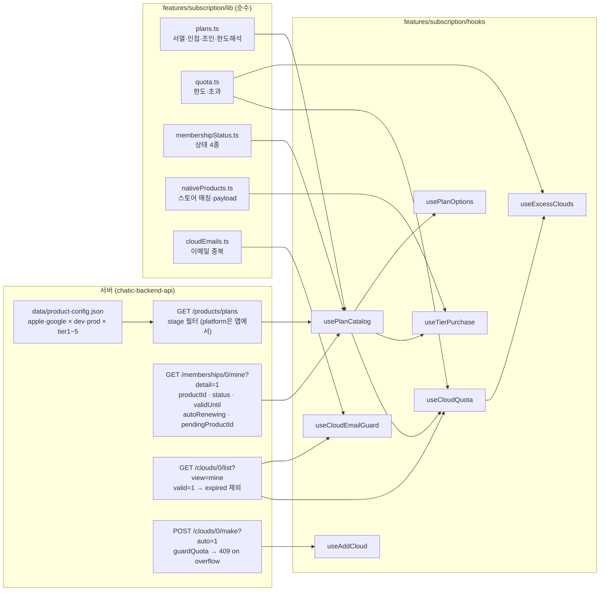
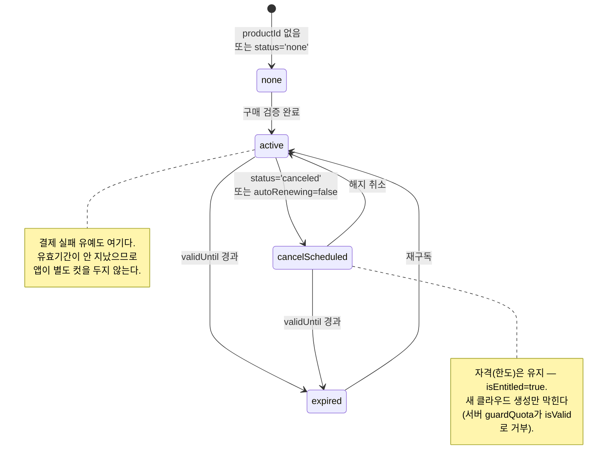
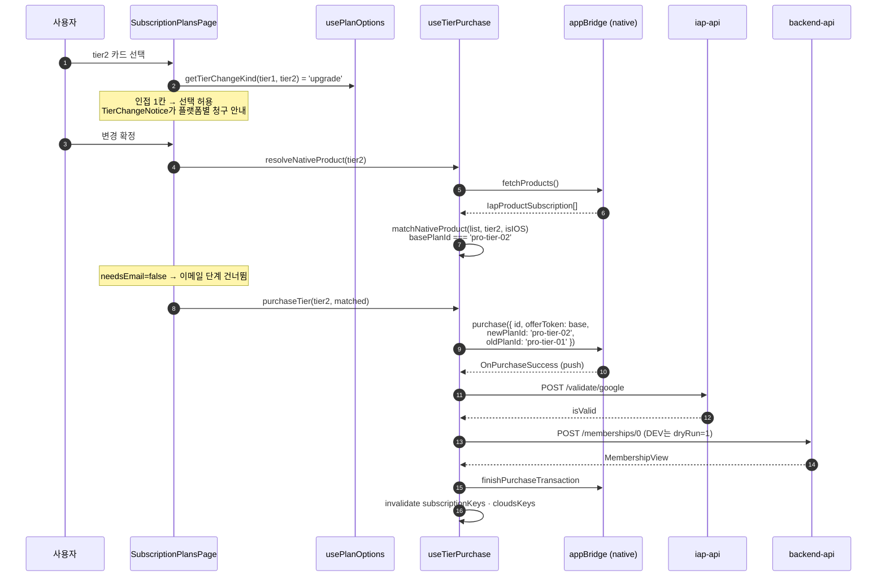
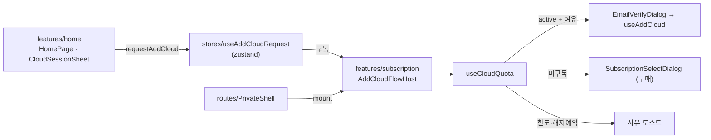

# 구독 tier와 클라우드 한도

> 상태: Live · 최종 갱신: 2026-08-19 · 관련 ADR: [ADR-0060](../../../../../docs/adr/0060-subscription-tier-quota-from-server.md)
>
> 같은 피처의 다른 문서: [README.md](./README.md) (피처 개요)

## 목적

구독 상품은 **DoU Pro 하나 × tier 1~5(= 동시 보유 클라우드 1~5개)** 다. 판매 가능한 상품 목록·클라우드
보유 한도·tier 서열의 출처를 **서버 상품 목록 하나**로 두고, 그 위에 네 가지 판정 — 클라우드 한도 /
tier 서열·인접 / 구독 상태 4종 / 초과 클라우드 — 을 순수 함수와 훅으로 고정한다. 등급 변경(업·다운)은
앱 안에서 일어나며 현재는 **인접 1칸**으로 제한된다.

## 설계 원칙

이 영역을 확장·수정할 때 지키는 기준이다.

1. **tier에 관한 사실은 서버 상품 목록에서만 온다.** 판매 목록·한도·서열·체험 일수를 앱 상수로
   복제하지 않는다. 상품 구성이 바뀌어도 앱 배포가 필요 없어야 한다.
2. **판정은 순수 함수로, 데이터 결합은 훅으로.** `lib/`의 함수는 React·네트워크를 모르고 입력만
   받는다. 훅은 그 함수에 서버 데이터를 먹이는 얇은 층이다. 화면은 판정을 다시 쓰지 않는다.
3. **같은 규칙은 진입점이 늘어도 한 곳에만 있다.** 한도 판정은 `useCloudQuota`, 스토어 상품 매칭은
   `matchNativeProduct`, tier별 선택 가능 여부는 `usePlanOptions` 하나씩이다.
4. **버튼을 숨기지 않고 이유를 알린다.** 상한 도달·자격 미달·tier 점프는 비활성 + 사유 안내로
   처리한다.
5. **되돌릴 수 없는 삭제를 앱 로직이 밀어붙이지 않는다.** 초과 클라우드는 감지·노출까지만 하고
   release 실행은 사용자가 기존 계정 관리 경로에서 직접 한다.
6. **도메인 지식은 `features/subscription` 안에만 산다.** 다른 피처는 판정을 복제하지 않고
   `stores/useAddCloudRequest`라는 얇은 seam으로 흐름을 요청만 한다
   ([ADR-0046](../../../../../docs/adr/0046-web-feature-ownership-and-barrel-hygiene.md) §3).

## 범위

**포함**

- tier 목록·한도·서열·체험 일수의 출처가 `GET /products/plans`
- 순수 판정 5종: tier 서열·인접 / 클라우드 한도 / 초과 클라우드 / 구독 상태 4종 / 네이티브 상품 매칭
- 등급 변경(업·다운 인접 1칸): Android `oldPlanId`, `base` offerToken 고정, 플랫폼별 청구 안내
- 구독 후 추가 클라우드 생성 (`POST /clouds/0/make`)
- 클라우드 이메일 재사용 사전 차단
- 초과 클라우드 감지 + 구독 화면 배너
- 화면 3종 (구독 안내 · 로그인 확인 · 구독 완료)과 이메일 인증 화면 개편
- 요금은 스토어 현지 가격(`displayPrice`)에서만

**제외**

- 구독 현황 화면 리디자인 (아직 옛 마크업)
- 초과 클라우드 **정리 실행 UI**, 유예 길이, 자동 정리 기준 (서버 소관 + 후속 화면 트랙)
- 여러 칸 다운그레이드 (해지 실행 UI가 나온 뒤 잠금 해제)
- 서버 기점 정기 재조회(CRON), 환불 실시간 회수 (백엔드 소관)
- `libs/subscriptions` 배럴 (desktop-web 소비자가 있어 손대지 않는다)
- `ANDROID_PLAN_LIST` env 순서 의존 제거 (브리지 계약 변경이 필요 — 부채)

## ADR-0060에서 정정된 전제

ADR의 전제 셋이 코드와 어긋났다. 아래가 정본이다.

### 1. 한도는 `membership.product$.maxClouds`에서 오지 않는다

백엔드는 멤버십에 상품을 **head로만** 붙인다 — `proxy.ts:1060`의 `asHead(model)`,
`transformer.ts:336`, `$HEAD.product`. `ProductHead` = `{ id, name, nameEn, platform }` 이고
**`maxClouds`·`sort`·`trialDays`가 없다.**

타입은 통과한다. `MembershipView.product$`가 더 넓은 `ProductView`(= `Partial<ProductModel>`)로
선언돼 있어 `maxClouds`를 읽어도 컴파일 에러가 없고 런타임에 조용히 `undefined`가 된다.

**대신** `membership.productId`(예: `#pro-tier-01`)를 상품 목록과 조인한다. `productId`는 `#` 접두가
붙은 채 저장되고(`updateHead`) `products/plans`의 `product.id`와 형식이 같다.

이 조인 결과(`currentPlan`·`pendingPlan`)가 **화면 표시값의 유일한 출처**다. 상품명·한도·요금·등급은
전부 여기서 나오고, 화면은 raw membership 필드를 상품 정보로 쓰지 않는다 — 그렇게 두면 상품명 자리에
`#pro-tier-01`이 그대로 찍힌다(실제로 그랬다). `planDisplayName`이 로케일을 고르고, 이름이 아예 없을
때만 id로 떨어져 조인 실패가 실패처럼 보이게 한다.

### 2. 해지 예약 구간에는 `isValid`가 false다

백엔드 `isValid`는 `status !== 'active'`이거나 `canceledAt > 0`이면 false다(`proxy.ts:717`). 해지
예약은 `calcPurchaseStatus`가 `status='canceled'` + `canceledAt`으로 기록하므로(`proxy.ts:698`)
**유효기간이 남아도 false** 다. 자격 판정을 `isValid`로 하면 아직 돈을 낸 기간인데 한도가 0이 되고
보유 클라우드가 초과로 잡힌다.

그래서 자격(한도가 살아 있는가)은 **유효기간 잔존**으로 판단한다. 다만 **새 클라우드 생성**은 서버
`guardQuota`가 `isValid`로 막으므로 앱도 해지 예약 중에는 추가를 제안하지 않는다 — 두 판정이 분리돼
있는 이유다.

### 3. 구매 한 번은 클라우드 하나만 만든다

`POST /memberships/0`은 `needed > 0`일 때 `clouds/{userId}/make`를 **한 번만** enqueue하고, body에
실린 **이메일 하나**를 쓴다(`api-memberships.ts` STEP.4). tier3을 새로 사도 클라우드는 1개만 생긴다.

앱에는 `POST /clouds/0/make` 클라이언트가 없었다. 즉 tier2~5를 팔 수는 있어도 두 번째 이후 클라우드를
만들 방법이 없었다. 이 트랙에서 `makeCloud`/`useMakeCloud`를 `libs/web-core`에 추가해 그 경로를 연다.

### 4. (덤) Android 신규 구매 경로가 깨져 있었다

옛 `SubscriptionSelectDialog`가 네이티브 상품을 `p.basePlanId === selectedProduct.planId`로 찾았다.
`product-config.json`에서 `planId`는 구글의 **부모 SKU**(`dou_pro_subscription`)이고 basePlanId는
설정 **key**(`pro-tier-01`)다. 매칭이 영원히 실패해 이메일 인증을 마친 뒤 조용히 return했다. 매칭을
`matchNativeProduct` 하나로 합치면서 사라졌고, 회귀 테스트가 붙어 있다.

## 시나리오

### S1. 미구독 유저가 신규 구독한다

1. 구독 화면 → "플랜 보기" → `SubscriptionPlansPage`.
2. `usePlanCatalog`이 `GET /products/plans`(stage 필터만) 결과를 받고, 현재 플랫폼 것만 골라 `sort`
   오름차순 5장을 렌더한다.
3. **진입 tier(sort 1)만 선택 가능하다.** 상위 tier를 바로 사면 클라우드 5개 분량의 한도와 이메일
   인증 5번이 한꺼번에 생기는데 그중 아무것도 바로 쓸 수 없다 — 등급 변경을 한 칸으로 묶은 것과
   같은 이유다.
4. 이메일 인증 → `freeTrial ?? base` offerToken으로 구매.
5. 검증 후 구독 완료 화면 → 설정 위자드(클라우드 → 플레이스 → 프로필).

### S2. 남은 한도로 클라우드를 추가한다 (구매 없음)

1. 홈 배너 / 클라우드 전환 시트의 "＋ 계정 추가" → `stores/useAddCloudRequest.requestAddCloud()`.
2. 프라이빗 라우터에 마운트된 `AddCloudFlowHost`가 깨어나 `useCloudQuota`로 판정한다.
    - **active + 한도 여유** → `EmailVerifyDialog`만 열린다. 인증되면 `POST /clouds/0/make`로 클라우드
      하나를 만든다. 결제는 없다.
    - **미구독** → 추가하려면 구독부터 해야 하므로 구독 안내 화면으로 이동한다.
    - **한도 도달** → 다이얼로그를 열지 않고 `계정은 최대 {{max}}개까지 추가할 수 있어요`를 토스트한다.
    - **해지 예약 중** → 서버가 provisioning을 거부하므로 사유를 토스트한다.
3. 버튼은 어느 경우에도 숨기지 않는다.

### S3. tier1 → tier2 업그레이드 (Android)

1. `SubscriptionPlansPage`에서 tier1은 `이용 중` 배지, tier2만 선택 가능, tier3~5는 비활성 +
   `한 단계씩만 변경할 수 있어요`.
2. 선택하면 `TierChangeNotice`가 플랫폼별 청구 방식을 보여준다 — Android는 "차액만 즉시 청구, 기존
   청구주기 유지".
3. 등급 변경은 클라우드를 만들지 않으므로 **이메일 단계를 건너뛴다.**
4. 구매 payload에 `oldPlanId`(= `membership.productId`에서 `#` 제거 = `pro-tier-01`)를 싣는다. 없으면
   네이티브 `getReplacementMode`가 교체로 판정하지 못해 신규 구매가 된다.
5. offerToken은 **항상 `base`**. 체험은 tier1 최초 구독 1회뿐이다.
6. 한도가 2로 늘고, 두 번째 클라우드는 S2 경로로 추가한다.

### S4. tier2 → tier1 다운그레이드

1. tier1만 선택 가능(인접 1칸). `TierChangeNotice`가 플랫폼별 청구 방식과 함께 "한도가 줄어들면
   초과한 계정은 직접 정리해야 해요"를 안내한다.
2. 확정되면 `membership.pendingProductId`가 잡히고 구독 화면이 "다음 갱신 시 변경"을 표시한다.
3. 갱신 시점에 한도가 1로 줄면 보유 2개 중 1개가 초과가 된다 → S5.

### S5. 초과 클라우드가 생긴다

1. `useExcessClouds`가 `보유 수 > 한도`를 감지하고 `cloudNo` 오름차순 정렬 후 한도를 넘는 **뒤쪽
   (나중에 만든)** 클라우드를 지목한다.
2. `SubscriptionPage` 상단에 `ExcessCloudBanner`가 뜬다 — 초과 개수·한도·대상 이메일을 보여주되
   **삭제 버튼은 없다.** CTA는 계정 관리 화면(`ROUTES.mypage.account.manage`)으로의 이동뿐이다.
3. 거기서 기존 release를 실행하면 배너가 사라진다.

### S6. 이미 쓴 이메일로 클라우드를 추가하려 한다

1. "인증 코드 전송"을 누른 시점에 `useCloudEmailGuard`가 보유 클라우드의 `email`과 대조한다.
2. 이미 있으면 **코드를 보내지 않고** `이미 다른 계정에 사용 중인 이메일이에요`를 띄운다.
3. 근거: 백엔드 `verifyEmail`의 `confirm`이 email 계정 레코드에 `verify$.cloudId`를 **하나만**
   기록하고 `release`가 그 포인터로 cascade를 정리한다. 두 번째 인증은 예외 없이 첫 포인터를 덮는다.
4. 해제된(`expired`) 클라우드는 목록에서 빠지므로 그 이메일은 다시 쓸 수 있다 — 백엔드 포인터가
   정리된 상태와 일치한다.

## 다이어그램

### 값의 출처



### 구독 상태 4종 판정



### 등급 변경 구매 흐름 (Android)



### 클라우드 추가 요청 seam



## 상세 구현

### 파일 배치

```
libs/web-core/
  src/api/subscriptions.ts          + makeCloud            (POST /clouds/0/make?auto=1)
  src/hooks/subscription/index.ts   + useMakeCloud

apps/web/src/app/
  stores/useAddCloudRequest.ts      feature 간 seam (zustand)
  routes/PrivateRoutes.tsx          PrivateShell = UnifiedLayout + AddCloudFlowHost
  ui/components/InlineAction.tsx    TextField의 trailing/helperTrailing용 텍스트 링크 (auth와 공용)

  features/subscription/
    lib/                            순수 판정 (React·네트워크 무지)
      plans.ts                      stripPlanId · sortPlansByTier · selectSellablePlans
                                    findPlanById · resolveMaxClouds · getTierChangeKind · isSelectableTier
      quota.ts                      countOwnedClouds · evaluateCloudQuota · findExcessClouds
      membershipStatus.ts           summarizeMembership
      nativeProducts.ts             matchNativeProduct · buildPurchaseProduct
      cloudEmails.ts                normalizeEmail · findCloudByEmail
      price.ts                      formatPlanPrice — 스토어 문자열만 통과
      emailVerify.ts                EmailVerifyRefusal · isEmailVerifyRefusal
    hooks/
      usePlanCatalog.ts             상품 목록 + 현재/교체대상/예약 상품 + 상태 요약 (단일 진입점)
      useNativeCatalog.ts           스토어 카탈로그 (요금)
      usePlanPrice.ts               상품 → 스토어 표기 가격
      usePlanOptions.ts             tier별 선택 가능 여부·사유·이메일 필요 여부
      useCloudQuota.ts              한도 판정 (모든 "＋ 추가"가 쓰는 하나)
      useExcessClouds.ts            초과 감지
      useTierPurchase.ts            매칭 → payload → 구매 (두 화면 공용)
      useAddCloud.ts                구매 없이 클라우드 1개 생성
      useCloudEmailGuard.ts         이메일 재사용 사전 차단
      useSubscriptionIap.ts         (기존) purchase payload에 oldPlanId 통과
      useVerifyEmailCode.ts         (app/hooks에서 이관) 인증 교환 한 다리
    components/
      AddCloudFlowHost.tsx          요청 수신 → 판정 → 적절한 다이얼로그
      EmailVerifyDialog.tsx         (ui/에서 이관) 이메일 인증 — 한 화면, web-ui-kit 조립
      LoginRequiredDialog.tsx       게스트에게 먼저 묻는다
      SubscriptionBenefits.tsx      구독 혜택 3
      TierChangeNotice.tsx          변경 적용 시점 안내
      SubscriptionDebugScreen.tsx   디버그 오버레이용 진단 + 규칙 매트릭스
      ExcessCloudBanner.tsx         초과 노출 (삭제 버튼 없음)
      subscription-select/          PlanCard · PolicyFooter
```

### 1. 상품 목록: platform 없이 한 번 받고 앱에서 나눈다

[usePlanCatalog.ts](../../../src/app/features/subscription/hooks/usePlanCatalog.ts)는
`useProductPlans({ limit: -1 })`로 **필터 없이** 받는다.

- 서버는 platform을 주지 않아도 **stage는 항상 필터**한다(`proxy.ts:996` `listPlans`; 검증:
  `proxy.spec.ts:1099` — 무필터 10건 = apple 5 + google 5, 전부 현재 stage).
- 그래서 무필터 1회로 (a) 현재 플랫폼의 판매 목록과 (b) **다른 플랫폼에서 결제한 멤버십의 상품**을
  동시에 얻는다. (b)가 핵심이다 — iOS에서 결제한 유저가 Android로 로그인하면 platform 필터된 목록에는
  그 상품이 없어 한도가 미해결로 떨어진다.
- `ProductView`에는 `platform`이 실려 온다(`ProductTransformer.modelAsView`가 명시적으로 포함).
  `selectSellablePlans`의 앱 필터는 서버 필터와 같은 결과를 낸다.

`resolveMaxClouds`가 `null`을 돌려주는 경우는 슈퍼 멤버십(상품 없음)과 목록에 없는 `productId`다.
둘 다 "앱이 모른다"이지 "0"이 아니므로 **차단하지 않고 서버 판정에 맡긴다.**

### 2. 한도 판정: 자격과 생성 가능 여부는 다르다

`evaluateCloudQuota`는 `isEntitled` 불리언이 아니라 **상태 4종**을 받는다.

| 상태                 | 한도 유효 (`isEntitled`) | 새 클라우드 생성 | 사유              |
| -------------------- | ------------------------ | ---------------- | ----------------- |
| `none` · `expired`   | ✗                        | ✗                | `notEntitled`     |
| `cancelScheduled`    | ✓                        | ✗                | `cancelScheduled` |
| `active` (한도 도달) | ✓                        | ✗                | `limitReached`    |
| `active` (여유)      | ✓                        | ✓                | —                 |

해지 예약을 두 열로 나누는 이유가 정정 §2다. 한도는 살아 있어야 보유 클라우드가 초과로 잡히지 않고,
생성은 서버 `guardQuota`가 `isValid`로 거부하므로 앱도 제안하지 않는다.

`limit === null`(모름)은 **막지 않는다.** 로딩 중에는 사유를 내보내지 않아 잘못된 안내가 뜨지 않는다.

### 3. 구독 상태 4종

[membershipStatus.ts](../../../src/app/features/subscription/lib/membershipStatus.ts)의
`summarizeMembership(membership, plan, now)` 판정 순서:

1. `isSuper` → `active`.
2. `productId` 없음 또는 `status === 'none'` → `none`.
3. `validUntil > now`: `status === 'canceled' || autoRenewing === false` → `cancelScheduled`,
   아니면 `active`.
4. 그 외 → `expired`.

**결제 실패 유예는 별도 상태가 아니라 `active`** 다. 앱 자체의 "실패 후 N일" 컷은 없다.

`trialDaysLeft`는 `trialUsed && validFrom + trialDays × 1일 > now`일 때만 계산하고, 결과가
`(0, trialDays]`를 벗어나면 `undefined`로 둔다 — 스토어 영수증의 `startedAt` 의미가 플랫폼마다 미묘해
여기서 틀리면 "체험 N일 남음"을 잘못 약속한다.

이 함수가 `SubscriptionPage`의 옛 `isActive || isExpired` 분기를 대체한다. 그 분기는 해지 예약만 있는
경우 두 조건이 모두 false여서 **빈 상태**로 빠졌다.

### 4. 등급 변경

`buildPurchaseProduct(matched, { isIOS, isTierChange, currentProductId })`가 두 가지를 갈라놓는다.

- **offerToken** — 등급 변경은 항상 `base`. 신규는 `freeTrial ?? base`. 체험은 tier1 최초 구독 1회뿐이라
  교체에 체험 토큰을 태우면 스토어가 거절하거나 잘못된 오퍼로 결제된다.
- **`oldPlanId`** — 등급 변경일 때만 `stripPlanId(currentProductId)`를 싣는다. Android 전용이며,
  없으면 스토어가 신규 구매로 처리한다.

`useSubscriptionIap`의 브리지 호출은 Android일 때만 `oldPlanId`를 넘긴다
([useSubscriptionIap.ts](../../../src/app/features/subscription/hooks/useSubscriptionIap.ts) 138행 부근).

인접 판정은 `getTierChangeKind(replaceablePlan, target)`가 `Math.abs(sort 차) !== 1`이면 `'blocked'`을
돌려주는 것으로 끝난다. **미구독이면 모든 tier가 선택 가능**하고, 만료된 구독은 교체가 아니라 신규로
취급한다.

`replaceablePlan`(= 자격이 살아 있을 때만의 `currentPlan`)은 `usePlanCatalog`이 내보낸다. 화면은
`usePlanOptions`(카드 상태)와 `useTierPurchase`(구매)를 **둘 다** 부르는데, 전자가 후자를 거쳐
판정을 얻으면 `useSubscriptionIap`이 두 번 인스턴스화되어 **`OnPurchaseSuccess` 브리지 구독이 두 벌**
생긴다. 그래서 "무엇이 현재 상품인가"는 카탈로그 한 곳에서만 정의하고 둘이 각자 읽는다.

### 5. 이메일 인증과 재사용 차단

`useCloudEmailGuard`가 `useVerifyEmailCode`를 감싸 `send`/`resend` 단계에서 먼저 거절한다.
`EmailVerifyDialog`는 이제 이 피처가 소유한다 — 호출부 세 곳이 전부 구독 흐름이고, `ui/`에 있던
근거(홈 시트가 `features/home`에 있었다)는 그 시트가 옮겨오면서 사라졌다. 차단은 여전히 주입되는
콜백(`useCloudEmailGuard`) 쪽에 두어 다이얼로그가 제어 컴포넌트로 남게 한다.

화면 자체는 `PhoneVerifyFields`와 같은 방식으로 다시 짰다 — 2단계 전체화면 + 자체 마크업(~430줄)
대신 `TextField` 두 개를 한 화면에 두고, 각 필드의 동작은 `trailing`(인증 요청·재전송), 카운트다운은
`helperTrailing`에 넣는다. 두 인증 흐름이 같은 슬롯을 다르게 채우면 그때부터 갈라지므로, 인필드 텍스트
링크는 `ui/components/InlineAction`으로 올려 둘이 공유한다.

다이얼로그는 실패를 전부 한 문장(`addAccount.sendCodeFailed`)으로 덮고 있었다. 거절 사유를 사용자에게
보이려면 그 문장을 뚫어야 하는데, **"Error면 message를 쓴다"로 뚫으면 안 된다** — 네트워크·서버 실패도
`Error`이고 그 `message`는 백엔드 문자열이다(`throwIfApiError`가 `"403 FORBIDDEN - …"`을, axios가
`"Request failed with status code 500"`을 던진다). 그대로 toast에 올리면 UX 퇴행이자 정보 노출이다.

그래서 **의도된 거절만 태그**한다 — `app/utils/verification.ts`의 `EmailVerifyRefusal`(이름 기반
판별이라 번들 청크를 넘어도 동작한다). 다이얼로그는 `isEmailVerifyRefusal(e)`일 때만 `e.message`를
쓰고 나머지는 기존 문구로 떨어진다. 도메인 import는 늘지 않았다.

### 6. 초과 클라우드 노출

`useExcessClouds` → `{ excess, used, limit }`. `ExcessCloudBanner`가 `SubscriptionPage` 상단에 있고
삭제 버튼은 없다. 초과 대상 선정은 `cloudNo` 오름차순 후 `slice(limit)`이며 `cloudNo`가 없으면
`createdAt` 폴백이다. 이것은 앱의 추정이므로 문구가 "정리 대상이 될 수 있어요"라고 말한다.

### 7. 소유권 이관과 feature 간 경계

ADR-0060 §6대로 `SubscriptionSelectDialog`와 `subscription-select/*`를 `features/subscription`으로
옮겼다. 그런데 그것을 여는 주체는 home이고 ADR-0046 §3은 feature 간 직접 import를 금지한다. ADR-0060는
이 지점을 다루지 않았다.

**채택:** composition root 패턴.

| 조각                           | 위치                                    |
| ------------------------------ | --------------------------------------- |
| 다이얼로그·`AddCloudFlowHost`  | `features/subscription`                 |
| `useAddCloudRequest` (zustand) | `app/stores`                            |
| `<AddCloudFlowHost />` 마운트  | `routes/PrivateRoutes`의 `PrivateShell` |
| 호출 (`requestAddCloud`)       | `features/home`                         |

**`AppRuntime`이 아니라 `PrivateShell`인 이유:** 흐름이 게스트를 로그인으로 `navigate` 하므로 라우터
컨텍스트가 필요하다. `AppRuntime`은 `<Router />`의 형제라 컨텍스트 밖이다. `routes/`는 이미
`HomeRoutes`를 직접 import하는 composition root다.

호스트는 요청이 오기 전까지 `null`을 렌더하고 **쿼리도 돌리지 않는다** — 앱 부팅 시 멤버십·상품 조회가
늘지 않는다.

`useAddCloudFlow`(home)는 이제 `requestAddCloud` 하나만 돌려준다. 렌더할 노드가 없어 `HomePage`의
`{addCloudDialog}`도 사라졌다.

**기각한 대안**

- _home이 subscription 배럴을 import_ — ADR-0046 §3 위반이고, 배럴이 `SubscriptionRoutes`(전 페이지)를
  재수출하므로 홈 청크가 구독 페이지 전부를 끌고 온다.
- _home에서 `/subscription/plans`로 navigate_ — import는 사라지지만
  [ADR-0034](../../../../../docs/adr/0034-relay-home-cloud-sheet-and-cloud-guide-redesign.md)가 정한
  "홈·시트는 안내를 건너뛰고 바로 구매 시트"를 뒤집는다.
- _다이얼로그를 `ui/components`로 승격_ — `ui/`가 구독 도메인을 알게 된다(ADR-0046 §1-1이 배제).

### 8. 화면

리디자인은 없다. 데이터 출처와 판정만 바뀌었다.

| 화면                       | 바뀐 것                                                                                                   |
| -------------------------- | --------------------------------------------------------------------------------------------------------- |
| `SubscriptionPlansPage`    | 1장 → 5장, 인접 1칸 외 비활성 + 사유, `clouds.length>=1` 가드 제거, `TierChangeNotice`, `useTierPurchase` |
| `SubscriptionSelectDialog` | 공통 매칭·구매 훅(Android 매칭 버그 소멸), 카탈로그 기반 목록                                             |
| `SubscriptionPage`         | 4상태 분기, `ExcessCloudBanner`, 체험 잔여일, 활성 상태에서도 "등급 변경" 버튼                            |
| `CloudGuidePage`           | `useAllowedProduct` → `usePlanCatalog().sellablePlans[0]`                                                 |
| `useAddCloudFlow` (home)   | 상수 가드 제거 → store 요청만                                                                             |

`PlanCard`는 플랜 페이지에 인라인돼 있던 카드 마크업과 합쳤다 — 같은 카드를 두 벌로 두면 매칭 로직이
갈라졌던 것과 같은 일이 반복된다. `isCurrent` 배지와 `disabledReason` 줄이 추가됐다.

## 검증 방법

**유닛 테스트**

| 파일                               | 핵심 케이스                                                                                                  |
| ---------------------------------- | ------------------------------------------------------------------------------------------------------------ |
| `lib/plans.test.ts`                | `#` 접두 조인 · 애플/구글 키 혼동 방지 · 플랫폼 분리 · 인접/점프 · head-only 멤버십에서 `null`               |
| `lib/quota.test.ts`                | 상태별 사유 · **해지 예약은 생성 불가** · `limit=null`은 미차단 · 초과 대상이 나중 클라우드                  |
| `lib/membershipStatus.test.ts`     | 4상태 전이 · **해지 예약이 `isEntitled=true`** · 결제 실패 유예가 `active` · `trialDaysLeft` 범위 방어       |
| `lib/nativeProducts.test.ts`       | iOS는 `id`/Android는 `basePlanId` · **`planId`(부모 SKU) 회귀 방지** · 등급 변경은 `base` · `oldPlanId` 부착 |
| `lib/cloudEmails.test.ts`          | 대소문자·공백 정규화 · `expired`는 재사용 가능                                                               |
| `utils/verification.test.ts`       | **의도된 거절만 문구 노출** · 서버/axios 에러는 매칭 안 됨                                                   |
| `hooks/useSubscriptionIap.test.ts` | Android 등급 변경에 `oldPlanId` 실림 · 신규엔 미포함 · iOS는 Android 필드 없음                               |
| `i18n.test.ts`                     | ko/en 양쪽 키 존재 · `{{max}}`/`{{count}}`/`{{days}}` 치환 유지                                              |
| `pages/CloudGuidePage.test.tsx`    | (기존) CTA 체험 문구 · 로케일 키                                                                             |

```bash
npx jest --config apps/web/jest.config.js --rootDir apps/web --testPathPatterns="features/subscription"
```

전체 회귀:

```bash
npx jest --config apps/web/jest.config.js --rootDir apps/web
```

타입체크·린트 — `libs`가 먼저 빌드돼 있어야 한다(`libs/*`에서 `tsc --noEmit`은 0건 검사 후 성공한다):

```bash
npx nx run web:typecheck
```

```bash
npx nx lint web && npx nx lint web-core
```

**디버그 오버레이 — `Subscription (State & Quota)`**

마이페이지 10탭 → 입장 코드 → `Subscription`. 두 부분으로 나뉜다.

- **Live**: 화면들이 읽는 것과 같은 훅(`usePlanCatalog`·`useCloudQuota`·`useExcessClouds`)을 그대로
  읽어 "지금 앱이 무엇을 무엇으로 판정하고 있는지"를 보여준다. 여기와 화면이 다르면 화면이 틀린 것이다.
- **Matrix**: 순수 판정을 전 입력 조합에 대해 직접 호출해 표로 그린다. 상태 4종·한도 3종·tier 5×5가
  서버 상태 없이 한 화면에 나오므로, 계정 다섯 개를 서로 다른 결제 상태로 만들지 않아도 규칙 전체를
  확인할 수 있다.

`requestAddCloud()` 트리거 버튼도 여기 있다. 읽기 전용이며 서버에 쓰지 않는다.

**수동 확인** (네이티브 셸 필요 — dev는 dryRun이라 클라우드 생성까지는 검증되지 않는다)

1. 플랜 화면에 tier1~5 다섯 장이 뜨고 현재 플랫폼 상품만 보이는지.
2. tier1 구독 상태에서 tier1은 `이용 중`, tier2만 활성, tier3~5는 비활성 + 사유가 보이는지.
3. 등급 변경 시 이메일 단계를 건너뛰고, Android 로그에 `oldPlanId`가 실려 나가는지.
4. 홈 "＋ 계정 추가"가 한도 도달 시 다이얼로그 없이 사유를 토스트하는지, 한도가 남으면 이메일 인증만
   열리는지.
5. 보유 클라우드의 이메일을 다시 입력하면 코드 발송 없이 사유가 뜨는지.
6. 다운그레이드 후 `SubscriptionPage`에 초과 배너가 뜨고 CTA가 계정 관리로 가는지.

## 알려진 제약

| 항목                               | 내용                                                                                                                                                                                 |
| ---------------------------------- | ------------------------------------------------------------------------------------------------------------------------------------------------------------------------------------ |
| `validFrom` 의미                   | 체험 잔여일의 유일한 근거. 스토어 영수증 `startedAt`이 최초 시작인지 현재 주기 시작인지 확정되지 않아, 계산값이 `(0, trialDays]`를 벗어나면 표시하지 않는다.                         |
| `ANDROID_PLAN_LIST` env 순서       | 네이티브 `getReplacementMode`가 env 목록 **순서**로 rank를 계산한다. 순서가 tier 순서와 어긋나면 업/다운이 뒤집힌다. 이번엔 `oldPlanId`를 정확히 넘겨 판정이 성립하게만 했다.        |
| 프로덕션 `pro-tier-04` planId 오타 | `prdou_pro_subscription`(나머지는 `dou_pro_subscription`). tier4 Android 프로덕션 결제가 깨져 있고 앱에서 우회할 수 없다. **백엔드 수정 전까지 프로덕션 tier4 판매를 열면 안 된다.** |
| DEV dryRun                         | tier2~5의 클라우드 생성 경로가 dev에서 검증되지 않는다. `POST /clouds/0/make` 직접 호출도 마찬가지다. 프로덕션 릴리스 전 별도 확인 구간이 필요하다.                                  |
| 초과 대상 선정                     | "나중에 만든 것이 초과"는 앱의 추정이다. 서버 자동 정리가 다른 기준을 쓰면 표시와 실제가 어긋난다. 배너 문구가 추정임을 밝힌다.                                                      |
| 다운그레이드 폭                    | 기획 `product-pricing.md`("여러 단계")와 백엔드 `scenario.md` §3("바로 아래 단계로만")이 모순한다. 인접 1칸은 해지 실행 UI가 없는 동안의 임시 잠금이다.                              |
| 이메일 N개 마찰                    | tier5까지 가려면 이메일 5개가 필요하다. 백엔드 account↔cloud 1:N 수정 전까지 tier2+ 전환율의 실질적 상한이다.                                                                       |
