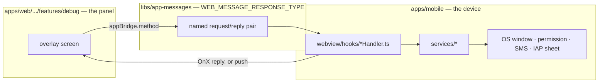

# debug panel — the web is the only debug surface

All debug controls for both platforms render in `apps/web/src/app/features/debug`.
`apps/mobile` implements no debug screen of its own — it only answers the bridge commands the web
panel sends. This document covers that boundary: what the panel may ask the app to do, and what the
app keeps on its own side of the bridge. The panel's screens, its unlock gate, and its catalog are
one feature and have one canon: [`docs/feature/debug/`](../feature/debug/README.md).

## Purpose

One remote, one device. A screen change, a relabel, or a new debug command for something the app
can already do ships on the web's own release cadence; nothing about the panel's UI requires an app
release.

```bash
grep -rln "FloatingMenu\|DebugHomeScreen\|features/debug" apps/mobile/src
```

Nothing should match. The app used to carry its own 14-screen debug menu; today it carries zero.

## Why one panel

Before this shape, two debug surfaces existed side by side: a web overlay and a native app menu,
overlapping on exactly one screen (`UploadTest`, by coincidence of naming). They drifted in
language, grouping, and capability, and changing a button in the native menu meant waiting for an
app release. The decision behind collapsing them into the web panel is ADR-0080's; the reasoning
that matters day to day is simpler: a debug control is a screen in `apps/web`, or it does not exist.

## The boundary the panel cannot cross



Three rules hold on every crossing:

1. **Every command is named.** There is no general "run this native code" request — a screen that
   needs a new capability adds a request/reply pair to `WEB_MESSAGE_RESPONSE_TYPE`
   ([`libs/app-messages`](../../../../libs/app-messages/README.md)), not a channel the panel can
   reuse for anything else.
2. **A write gets an answer.** `useDebugOperation` (`hooks/useDebugOperation.ts`) splits every
   screen's call into `run`, for a command the app replies to, and `fire`, for the handful that
   were already void before this panel existed (`openURL`, `openSettings`, `openShareSheet`,
   `setBadgeCount` in `appBridge.ts`). `fire` never claims success — it reports `"보냈습니다 (확인
없음)"` so a silent void call is never mistaken for a confirmed one.
3. **A version gap is expected, not a bug.** The web ships before the app
   ([`libs/app-messages`](../../../../libs/app-messages/README.md) states the same rule for every
   bridge message). When an installed build has no handler yet, the host answers `NOT_FOUND`, and
   `run` renders `"이 앱 버전이 지원하지 않습니다"` instead of the raw handler-missing error — then
   remembers the command in a module-level `Set` so `isUnsupported(command)` can lock that control
   for the rest of the session. The set is never un-learned; an app build cannot grow a handler
   without a reload.

## What stays in apps/mobile

Two things the deletion left behind, on purpose:

- **`apps/mobile/src/app/customZip/`** — moved out of `features/debug` rather than deleted, because
  `MainScreen`'s boot gate depends on it to restore a previously applied zip. It is boot
  infrastructure now, not a debug screen; the web `CustomZipScreen` is its only operator.
- **`debugSettingsStore.debugModeEnabled`** (`apps/mobile/src/app/stores/debugSettingsStore.ts`) —
  persisted so `AppWebView`'s injection script can hand the 10-tap unlock back to the web on a
  WebView reload. It is the one piece of debug state the app still stores, and it exists to serve
  the web panel, not to render one.

## How to verify

```bash
grep -rn "features/debug\|FloatingMenu\|DebugHomeScreen" apps/mobile/src   # zero hits
npx jest --config apps/web/jest.config.js features/debug
```

The panel's own test and manual-verification story — the screen catalog guard, the unlock state
machine, the on-device checklist — is in
[`docs/feature/debug/`](../feature/debug/README.md#notes-for-implementers-and-tests).

## Further reading

- [`docs/feature/debug/`](../feature/debug/README.md) — the panel itself: the 22 screens, the
  unlock gate, the manifest, how to add a screen.
- [`libs/app-messages`](../../../../libs/app-messages/README.md) — the request/reply contract every
  bridge command follows, including the web-ships-before-app rule.
- [`bridge.md`](../bridge/README.md) — the `appBridge` / `useOn*` pattern the panel's screens use like any
  other feature.
