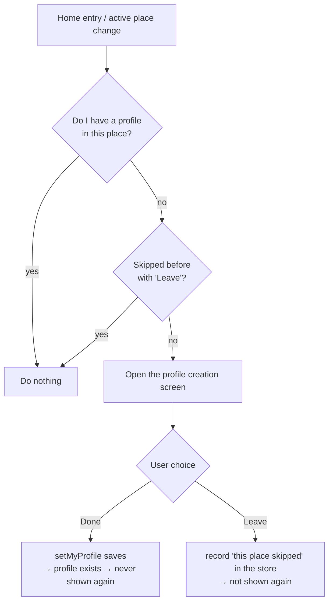
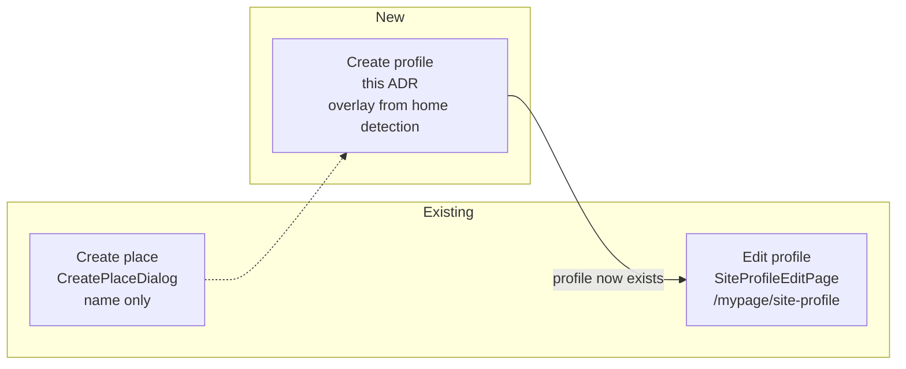

# 0012. A dedicated screen for creating a place profile

> Status: Accepted (the appearance rule is Superseded) · Decided: 2026-07-15
>
> **The "when the screen appears" rule — home-entry detection plus session-scoped skipping — no
> longer holds.** `98a4685ff` (2026-07-28) dropped the forced prompt on home entry and deleted
> `usePlaceProfilePrompt` and `PlaceProfileCreateDialog`, and was not recorded as an ADR at the time.
> What makes the creation screen appear is now settled by
> [ADR-0041](0041-place-profile-as-invite-precondition.md): not home entry but **the two invite
> paths** — the inviter entering a contact invite, and the invitee just before `invite.accept` — and
> instead of a skip record it uses a precondition, "no invite without a profile".
>
> The decisions about the screen itself still hold (implementation points 1, 2, 4, 7, 8, the five
> Figma states, the 20-character name and the optional photo). One exception: the "leave
> confirmation modal" in point 8 **misread** Figma `3026-12027` as two buttons, Leave · Keep setting
> up. The two-button variant is hidden there; only Keep setting up exists. ADR-0041 does not build
> that modal and sends X straight back to the previous screen.

## In one line

Add a dedicated screen for **creating** the profile (name and photo) a user carries in a given place
(= Site). It is separate from the edit screen that changes a profile which already exists.

---

## Context

### What is being built — the terms first

The request said "place creation screen", but the five attached Figma nodes draw something else:
**"Please set up the profile you will use in \<place\>"**. Three things have to be kept apart.

| Subject                      | What gets created                                       | Owner (existing / new)     |
| ---------------------------- | ------------------------------------------------------- | -------------------------- |
| **Place (Site)**             | The space itself (name only)                            | Existing `CreatePlaceDialog` |
| **Place profile — create**   | **First** creation of my profile (name, photo) there     | **New, this round**        |
| **Place profile — edit**     | Later changes to a profile that exists                   | Existing `SiteProfileEditPage` |

This work is the middle row, **creating a place profile**. Earlier discussion called it "onboarding",
which is a different concept. It is not a first-run or sign-up flow; it is the **act of creating** a
profile that this place does not have yet.

### The five Figma nodes are states of one screen

| Node         | State                                                                        |
| ------------ | ---------------------------------------------------------------------------- |
| `3026-11374` | Initial — empty fields, "Done" disabled                                      |
| `3026-11473` | Filled — name and photo set, "Done" enabled                                  |
| `3026-11612` | Submitting, with the "Profile set up" toast                                  |
| `3026-11728` | Length error — 21/20, red border                                             |
| `3026-12027` | Leave confirmation — "Stop setting up your profile?" / Leave · Keep setting up |

### What the existing code already gives

- Reading: `useMyProfile()` → `ProfileRepository.observeItem` plus `getMyProfile()` (returns
  `DomainProfile | null`), so **whether I have a profile in the active place** is observable.
- Writing: `profileRepository.setMyProfile({ nick, thumbnail })` — the path the edit screen
  (`SiteProfileEditPage`) already uses.
- Images: `resizeImageToBase64(file, 150)` is reusable (≤10MB, webp/png/jpeg).
- Persisted front-end state: `apps/web/src/app/stores/usePreferenceStore.ts` (zustand plus
  localStorage / the native bridge) is the standard pattern.
- Components: `@chatic/web-ui-kit`, as the request directs. This becomes **the first screen in the app
  to use the library**. Most of the pieces exist already — `ModalTopBar`, `TextField`, `Button` /
  `FloatingButton`, `AlertDialog`, `Toast`, `ProfileAvatar`.

---

## Decision

### When the screen appears

Home detects **whether I have a profile in the currently active place**. If I do not, and I have not
skipped this place before with Leave, the creation screen opens.

The rule handles a newly created place, a place joined by invite and an old place that simply has no
profile **in one place, whatever the trigger was**.

### How the three screens relate

### Implementation points (in scope)

1. **Build a new screen.** Leave the existing edit screen, `SiteProfileEditPage`, alone. Creation and
   editing differ in UI and constraints; merging them makes both worse.
2. **A full-screen overlay (dialog)**, the same shape as `CreatePlaceDialog`. **No dedicated URL
   route.**
3. **The detection runner lives in the `home` feature** — the runner pattern `UnreadBadgeRunner` uses.
4. **Input rules**: the name is **required, 1–20 characters**; the photo is **optional** (as Figma
   has it). A photo is ≤10MB (webp/png/jpeg), resized to a 150px square and stored as base64.
5. **Data**: read through `useMyProfile()`, write through
   `profileRepository.setMyProfile({ nick, thumbnail })`.
6. **Leave (skip)**: close without saving, but **record "this place was skipped" in a front-end store
   scoped to the session (`sessionStorage`)**. Following the `usePreferenceStore` pattern, the record
   is per place (sid), so the same place does not prompt again this session. A profile can be edited
   from the profile screen at any time, so the suppression is not permanent — a later session may
   prompt again. (Finishing with Done removes the detection condition by itself.)
7. **web-ui-kit first**: assemble from `@chatic/web-ui-kit`, and where a piece is missing — for
   example **an editable avatar with a "+" badge and a file picker** — define it in the library and
   use it from there.
8. **Build all five states**: initial, filled, submitting with the success toast, over-20 error, and
   leave confirmation.

### Out of scope

- Creating the place (Site) itself — that is `CreatePlaceDialog`'s job.
- Reworking or merging the existing `SiteProfileEditPage` and `CloudProfileEditPage`.
- A dedicated URL route and deeplink entry.

---

## Alternatives

| Alternative                                                    | Why it was dropped                                                                                                                                                                                             |
| -------------------------------------------------------------- | -------------------------------------------------------------------------------------------------------------------------------------------------------------------------------------------------------------- |
| Convert the edit screen into a create/edit hybrid               | The creation-only parts (leave modal, X-close modal UI, 20 characters) collide with the edit screen (back-arrow header, 30 characters). No reason to destabilise a working edit screen.                         |
| Implement it as a dedicated route page                          | It appears through "home detects a missing profile", so there is no URL entry point to serve. An overlay fits better.                                                                                            |
| Store the skip flag on the backend, or permanently in localStorage | A backend write costs an API for little; permanent storage means one accidental Leave silences that place forever. Since a profile stays editable, a **session-scoped front-end store** won — suppress once per session. |
| A 30-character name, matching the edit screen                   | Figma shows the error at 20/20, so 20 it is.                                                                                                                                                                    |

---

## Consequences

**What gets better**

- Places without a profile get filled in naturally, and every entry path is handled by one rule.
- It becomes the first real use of `@chatic/web-ui-kit` inside the app, which tests the library. The
  gaps it has — an editable avatar, for one — surface here and get filled.

**What to accept, and to watch**

- **The skip record is session scoped**, so reopening the app or tab prompts again in a place that
  still has no profile. It is not permanent suppression: an accidental Leave is recoverable next
  session, and the profile screen is available meanwhile. This is intended.
- ⚠️ **Unlike the original request's "define a route", no new URL route is added.** Direct deeplink
  entry is unsupported and can be added later. This differs from the request's wording, so it is worth
  re-confirming before implementation.
- **The detection rule** has to separate "no profile at all (null)" from "a profile with an empty
  name" or the screen appears for nothing. The implementation has to define this precisely.
- **Display priority against the other overlays home raises** (invite, subscription prompt, email
  verification) has to be settled during implementation.
