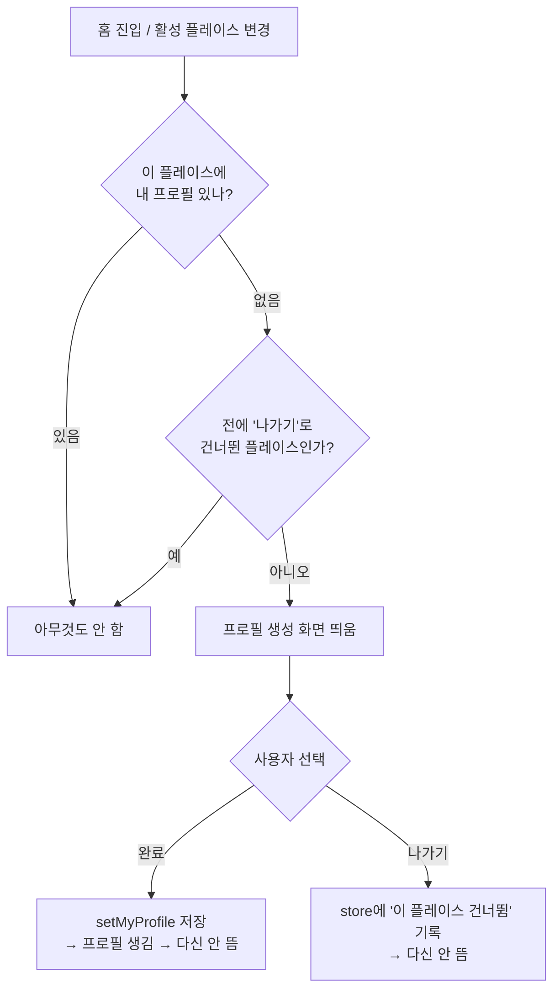
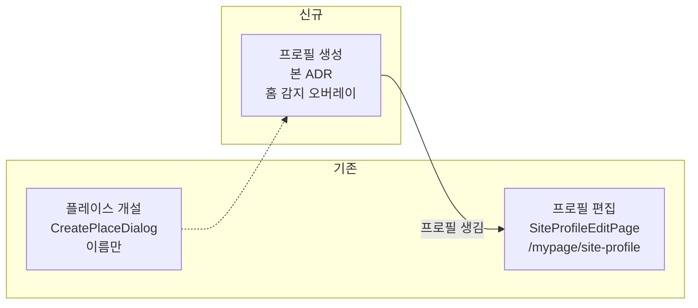

# 0012. 플레이스 프로필 "생성" 화면 도입

> 상태: Accepted · 결정일: 2026-07-15

## 한 줄 요약

플레이스(=Site)마다 사용자가 쓰는 프로필(이름·사진)을 **처음 만드는** 전용 화면을 새로 만든다. 이미 있는 프로필을 고치는 편집 화면과는 별개다.

---

## 맥락 (Context)

### 무엇을 만드는가 — 용어부터 정리

처음 요청은 "플레이스 생성 화면"이었지만, 첨부된 Figma 5개 노드를 열어보니 실제로 그리는 건 **"\<플레이스\>에 사용할 프로필을 만들어 주세요"** 화면이었다. 즉 다음 셋을 명확히 구분해야 한다.

| 대상                       | 무엇을 만드는가                                         | 담당 (기존/신규)           |
| -------------------------- | ------------------------------------------------------- | -------------------------- |
| **플레이스(Site)**         | 공간 자체를 개설 (이름만)                               | 기존 `CreatePlaceDialog`   |
| **플레이스 프로필 — 생성** | 그 플레이스에서 쓸 내 프로필(이름·사진)을 **처음 만듦** | **이번에 신규 구현**       |
| **플레이스 프로필 — 편집** | 이미 만든 프로필을 나중에 수정                          | 기존 `SiteProfileEditPage` |

이번 작업은 가운데 칸, **"플레이스 프로필 생성"** 이다. (이전 논의에서 "온보딩"이라 불렀으나 개념이 다르다. 첫 실행/가입 흐름이 아니라, "이 플레이스에서 쓸 프로필이 아직 없으니 지금 만든다"는 **생성 행위**로 본다.)

### Figma 5개 노드 = 한 화면의 상태들

| 노드         | 상태                                                                  |
| ------------ | --------------------------------------------------------------------- |
| `3026-11374` | 초기 — 빈 입력, "완료" 비활성                                         |
| `3026-11473` | 입력 완료 — 이름·사진 채움, "완료" 활성                               |
| `3026-11612` | 제출 중 로딩 + "프로필 설정이 완료되었습니다" 토스트                  |
| `3026-11728` | 글자수 초과 에러 — 21/20, 빨간 테두리                                 |
| `3026-12027` | 이탈 확인 모달 — "프로필 설정을 중단하시겠어요?" / 나가기 · 계속 설정 |

### 기존 코드에서 확인된 것

- 읽기: `useMyProfile()` → `ProfileRepositoryV2.observeItem` + `getMyProfile()`(반환 `DomainProfile | null`)로 **활성 플레이스에 내 프로필이 있는지** 관측 가능.
- 쓰기: `profileRepository.setMyProfile({ nick, thumbnail })` — 편집 화면(`SiteProfileEditPage`)이 이미 쓰는 경로.
- 이미지 처리: `resizeImageToBase64(file, 150)` 재사용 가능(≤10MB, webp/png/jpeg).
- 프론트 지속 상태: `apps/web/src/app/stores/usePreferenceStore.ts` (zustand + localStorage/네이티브 브리지) 가 표준 패턴.
- 컴포넌트: 요청 지시대로 `@chatic/web-ui-kit` 기반. **앱에서 이 라이브러리를 쓰는 첫 화면**이 된다. 필요한 조각 대부분(`ModalTopBar`·`TextField`·`Button`/`FloatingButton`·`AlertDialog`·`Toast`·`ProfileAvatar`)이 이미 있다.

---

## 결정 (Decision)

### 화면이 등장하는 규칙

홈에서 **현재 활성 플레이스에 내 프로필이 있는지** 감지해서, 없고 + 사용자가 전에 "나가기"로 건너뛴 적도 없으면 프로필 생성 화면을 띄운다.

이 규칙 덕분에 "새로 만든 플레이스", "초대받아 참여한 플레이스", "예전에 만들었는데 프로필만 없는 플레이스"를 **트리거 종류와 상관없이 한 곳에서** 처리한다.

### 세 화면의 관계

### 구현 방침 (포함)

1. **신규 화면을 따로 만든다.** 기존 편집 화면 `SiteProfileEditPage`는 손대지 않는다. (생성과 편집은 UI·제약이 달라 합치면 서로 방해된다.)
2. **풀스크린 오버레이(다이얼로그)** 로 만든다 — `CreatePlaceDialog`와 같은 방식. **전용 URL 라우트는 두지 않는다.**
3. **감지 러너는 `home` 피처에 둔다** (`UnreadBadgeRunner`와 같은 러너 패턴).
4. **입력 규칙**: 이름 **1~20자 필수**, 사진 **선택**(Figma 그대로). 사진은 ≤10MB(webp/png/jpeg), 150px 정사각 리사이즈 후 base64.
5. **데이터**: 읽기 `useMyProfile()`, 쓰기 `profileRepository.setMyProfile({ nick, thumbnail })`.
6. **"나가기"(건너뛰기)**: 저장 없이 닫되, **"이 플레이스는 건너뜀"을 프론트 store(세션 스코프, `sessionStorage`)에 남긴다.** `usePreferenceStore` 패턴을 따라 플레이스(sid)별로 기록해 이번 세션 동안 같은 플레이스에서 다시 뜨지 않게 한다. 프로필은 프로필 화면에서 언제든 수정 가능하므로 영구 차단하지 않고 세션 종료 후에는 다시 프롬프트할 수 있다. (완료로 프로필을 만든 경우엔 감지 조건이 저절로 풀려 다시 안 뜬다.)
7. **web-ui-kit 우선**: `@chatic/web-ui-kit` 컴포넌트로 조립하고, 없는 조각(예: **"+ 배지 + 파일 선택"이 붙은 편집형 아바타**)은 라이브러리에 새로 정의해 쓴다.
8. **다섯 상태 모두 구현**: 초기 / 입력 완료 / 제출 로딩+성공 토스트 / 20자 초과 에러 / 이탈 확인 모달.

### 하지 않는 것 (제외)

- 플레이스(Site) 개설 자체 — `CreatePlaceDialog` 소관.
- 기존 `SiteProfileEditPage`·`CloudProfileEditPage` 리워크·통합.
- 전용 URL 라우트 및 딥링크 진입.

---

## 대안 (Alternatives)

| 검토한 대안                                               | 버린 이유                                                                                                                                                                                |
| --------------------------------------------------------- | ---------------------------------------------------------------------------------------------------------------------------------------------------------------------------------------- |
| 기존 편집 화면을 "생성/편집 겸용"으로 개조                | 생성 화면 고유 요소(이탈 모달·X 닫기 모달 UI·20자)와 편집 화면(뒤로가기 헤더·30자)이 충돌. 안정적인 편집 화면을 흔들 이유가 없음.                                                        |
| 전용 라우트 페이지로 구현                                 | 등장 방식이 "홈에서 프로필 유무 감지"로 정해져 URL 진입점이 불필요. 오버레이가 더 정합적.                                                                                                |
| 건너뛰기 플래그를 백엔드에 저장 / 영구(localStorage) 저장 | 백엔드 저장은 API 비용이 크고, 영구 저장은 실수로 나가기 시 그 플레이스에서 영영 유도를 못 받음. 프로필이 언제든 수정 가능하므로 **세션 스코프 프론트 store**로 결정(세션당 1회만 억제). |
| 이름 30자(편집 화면과 통일)                               | Figma가 20/20에서 에러를 명시 → 20자 채택.                                                                                                                                               |

---

## 결과 (Consequences)

**좋아지는 것**

- 플레이스마다 프로필 없는 상태가 자연스럽게 메꿔진다. 진입 경로가 무엇이든 한 규칙으로 처리된다.
- `@chatic/web-ui-kit`의 앱 내 첫 실사용 사례가 되어 라이브러리를 검증한다. 부족한 컴포넌트(편집형 아바타 등)가 이때 드러나 보강된다.

**감수할 것 / 주의할 것**

- **건너뛰기 기록이 세션 스코프**라, 앱/탭을 다시 열면(새 세션) 프로필 미설정 플레이스에서 다시 프롬프트한다. 영구 억제가 아니므로 실수로 나가기를 눌러도 다음 세션에 다시 안내받고, 그 사이에도 프로필 화면에서 직접 설정할 수 있다. — 의도된 동작.
- ⚠️ **원 요청의 "라우트 정의"와 다르게 신규 URL 라우트를 만들지 않는다.** 딥링크 직접 진입은 지원하지 않으며 필요 시 추후 추가. — 원 요청 문구와의 차이라 구현 전 재확인 여지 있음.
- **감지 기준**은 "프로필 자체가 없음(null)"과 "프로필은 있는데 이름이 비어 있음"을 구분해야 헛등장을 막는다. 구현 단계에서 정확히 정의 필요.
- 홈에서 뜨는 다른 오버레이(초대·구독 요구·이메일 인증 등)와 **표시 우선순위 충돌**을 구현 단계에서 정리해야 한다.
