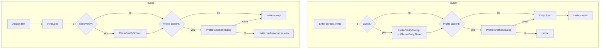

# ADR-0041: Put the place profile back as a precondition of inviting

> Status: Accepted · Decided: 2026-08-03
>
> **Depends on: [ADR-0040](0040-self-chat-title-and-profile-setup-nudge.md).** A session running in
> parallel on the same day adds `PlaceProfileCreateDialog` (decision 6) and `resolvePlaceDisplayName`
> (decision 7). This ADR **consumes both rather than building them.** Where the two overlap, ADR-0040 is
> canonical — see the "Relation to the preceding ADR" section.

## Context

"Where do we catch a user with no profile" is a question this app has flipped three times.

| When       | What happened                                                                                                            | Grounds                                            |
| ---------- | ------------------------------------------------------------------------------------------------------------------------ | -------------------------------------------------- |
| 2026-07-15 | [ADR-0012](0012-place-profile-creation.md) — a **mandatory** creation dialog on home entry when there is no profile      | Figma `3026-11374` plus 4 more state nodes         |
| 2026-07-28 | `98a4685ff` — **removed** the home-entry gate. Deleted `usePlaceProfilePrompt` and `PlaceProfileCreateDialog`            | "the profile is set later, from the settings hub"  |
| 2026-07-31 | [ADR-0039](0039-dm-display-name-chain-and-invite-profile-release.md) decision 5 — deleted the `profiling` step of accept | "profile enforcement across the app goes to zero"  |
| 2026-08-03 | **This ADR** — restored as a precondition of inviting                                                                    | a force quit after accept leaves a DM with no name |

The message of commit `5a61669a5`, which carried out ADR-0039 decision 5, summarizes that judgement in one
line.

> `It is not a value worth standing in front of an accept`

The trade-off that judgement accepted is written in the same document — **"the number of counterparties with
no profile grows."** And the re-nudge UX (banners, toasts and so on) was explicitly deferred out of scope.
This ADR does not fill in that deferred blank; it **reverses the deferred judgement itself.**

### Why it is reversed — the failure mode ADR-0039 did not count

If the profile is asked for **after** accept, a path opens where the user force quits the app in between.
Then `invite.accept` is already committed and the user sits in the DM with no profile. ADR-0039 bought drop-off
and sold display-name quality, but this path is **a third outcome that is neither drop-off nor reversible.**
The display name chain (ADR-0039 decision 1) is built to absorb it with the generic label `대화 상대`, but that
label is a fallback, not a goal.

So the profile moves back to **before accept rather than after it.** Then "accepted but nameless" becomes
structurally impossible.

### What the investigation found drove the decision

1. **The code to restore is intact in a commit from three days ago.** `5a61669a5` deleted
   `RelayInviteProfileDialog.tsx` (60 lines, recoverable with `git show 5a61669a5^:...`),
   `useSaveMyPlaceProfile.ts` (10 lines), the one `'profiling'` line of `RelayInvitePhase`, and the 6
   `relayInviteAccept.profile.*` keys. That component's doc comment matches this requirement word for word —
   `"backing out returns to the invite rather than dropping the user on home"`.
2. **The 16 `placeProfileCreate.*` keys are alive.** ADR-0039 did not delete them, on the grounds that "the
   re-nudge UX may use them" ([ko](../../apps/web/public/locales/ko/translation.json):703, en identical). New
   copy: zero.
3. **`PlaceProfileForm` already supports two containers.** `container: 'dialog' | 'page'`, and the doc comment
   on `dismissible?: boolean` foretold this case with
   `"used for the mandatory first-time profile setup (relay/default place)"`
   (`apps/web/src/app/features/home/components/PlaceProfileForm.tsx:74`). This ADR ends up not using that hook
   point (decision 2), but the form does not have to be built again.
4. **`useMyProfile()` cannot express "there is no profile".** `null` means ① no active site/uid ② loading
   ③ genuinely absent, all at once, and there is no `isLoading`
   (`apps/web/src/app/hooks/useMyProfile.ts:24`). On top of that, `profile.get-mine` is get-or-create, so it
   **effectively never returns null** — the check has to be made from a blank `nick` and `active === false`.
   The trigger of the deleted `RelayInviteProfileDialog` was `!profile?.nick` **alone**, and that check could
   fire spuriously for a single loading frame.
5. **A three-state checker exists inside `98a4685ff`.** The deleted `usePlaceProfilePrompt` held
   `'unknown' | 'present' | 'absent'` together with three rules — the `settled = isVerified && !isSwitching`
   gate (because `switchSiteSession` optimistically flips `selectedSiteId` first), the `item.sid === requestedSid`
   check, and an asymmetric verdict (`present` as soon as `nick` exists; `absent` only when `nick` is missing
   **AND** `active === false`; an error is always `unknown`).
6. **On the inviter's side there is a motive the code proves.**
   `apps/web/src/app/features/invite/utils/inviteMessageCopy.ts:8` fills the invite SMS sender name from
   `myProfile?.nick`, and falls back to `contactInvite.defaultSenderName` when it is missing. That value is
   **`"친구"`** ("friend"), so an invite from an inviter with no profile goes out as
   `"친구님이 DoU에서 1:1 대화를 신청했어요!"` — the literal copy is the problem.
7. **The `0000` check contradicts the existing code** (resolved by ADR-0040 decision 7, which checks with an
   OR). The request said `placeId === '0000'`, but
   `apps/web/src/app/features/home/components/PlaceItem.tsx:16-22` explicitly avoids that method —
   `"The legacy place.id === 'default' never matches real relay places, so the cloud context is the reliable
signal."` The actual branding check is `selectedCloudId === 'default'`.
8. **`useActivePlaceName()` does not apply branding.** It returns `place.name` raw
   (`apps/web/src/app/hooks/useActivePlaceName.ts:23`), so on the default cloud you get the backend's own name
   (`default`/`#default`). That is, **already today** that value is exposed in the title of the channel
   settings → my profile dialog.
9. **The after-the-fact escape route was in fact closed.**
   `apps/web/src/app/features/place/pages/PlaceProfilePage.tsx:31` renders only the header, not the form, when
   `!myProfile`. A user with no profile cannot create one from "My profile" in the settings hub either — the
   "set it later over there" escape route ADR-0039 offered did not exist for that user.
10. **The Figma exit modal has no leave button.** In the action row of `3026-12027` the two-button variant
    (`Component 8`) is `hidden="true"` and only the full-width "Continue setup" is visible. ADR-0012 recorded
    that node as "Leave · Continue setup", which is a misreading, and the implemented `PlaceProfileForm` follows
    that misreading by always rendering `exit.leaveLabel`.

## Decision

### 1. The profile is not a gate but a **precondition**

It is not enforced. Instead, **the path that proceeds without a profile is removed.** On both invite paths,
saving the profile becomes a prerequisite of the server call.

Leaving via X does not trap anyone, and having left means **the invite was not sent, or not accepted.** So
there is no path that can produce either an SMS whose sender name is `친구` or a DM accepted without a name.

### 2. X leaves straight to the previous screen, with no exit modal

- Inviter: back to home (leaving the contact invite screen itself).
- Invitee: back to the invite confirmation screen (`flow.cancelStep`).
- `dismissible` is `true`. The `dismissible: false` branch is not used this time either.
- **Figma `3026-12027` (the exit confirmation modal) is not implemented.** That node's single-button dead-end
  design conflicts in purpose with the precondition structure of decision 1 — there is no longer a reason to
  block the exit.
- So `PlaceProfileForm` needs a switch that turns the exit guard off. The current behaviour of showing an
  `AlertDialog` when `isDirty`
  (`apps/web/src/app/features/home/components/PlaceProfileForm.tsx:175-179`) must be inactive in the creation
  flow. The guard in the edit flow (`PlaceProfileEditDialog`, `PlaceProfilePage`) **stays as it is** — there, an
  existing value to revert to really exists.

### 3. Invitee: restore the `profiling` phase **before** `invite.accept` — ADR-0039 decision 5 is withdrawn

The accept order goes back to **verify → profile → accept.** That is the original order of ADR-0089 D10.

- Restore `'profiling'` in `RelayInvitePhase` and `RelayInviteFlow.onProfileSaved`.
- Put the check into `advance()` right before `mutations.acceptInvite` — the same spot `5a61669a5` deleted.
- Restore `RelayInviteProfileDialog` and `useSaveMyPlaceProfile`. Restore the phase branch of
  `RelayInviteAccept`.
- **But the trigger is the awaited check of decision 5, not `!profile?.nick`.** The original must not be
  restored verbatim.
- Revert the order tests in `useRelayInviteFlow.test.ts` and `RelayInviteAccept.test.tsx`.
- Restore step 7 of S1 and the `submitting --> profiling` edge in the relay state diagram of
  docs/invite-accept-entry.md, which lived in the root docs tree and has since been removed.

No dedicated URL route is added — the policy of ADR-0012 decision 2 stands. The reason we do not navigate to
the existing `/place/:placeId/settings/profile` is that the accept flow would have to manage its own return
point from that route, and one more piece of `pendingChannel` wiring would be added.

### 4. Inviter: a profile creation dialog on entering the contact invite screen

Mount `PlaceProfileCreateDialog` (ADR-0040 decision 6) in `ContactInvitePage`. The gate order is
**guest verification → profile → invite form.** The existing `isGuest` gate comes first — a guest has no settled
site context to write a profile into, and cannot issue an invite in the first place (ADR-0034).

Just as with `isGuest`, while the profile is `absent` the invite form is **not rendered.** Drawing the form and
covering it with a dialog would mean a state exists, however briefly, in which it can be submitted without a
profile.

The existing single `return` plus fixed child slot structure stays — its reason (that `PhoneVerifySheet`
unmounts mid-promotion and loses the `pendingToken` retry) remains valid even with the profile dialog added
(`apps/web/src/app/features/invite/pages/ContactInvitePage.tsx:163-166`).

### 5. The check is an `await`, not an observation — no `nick`-only check, and fail open when ambiguous

> **Revision (2026-08-03, while writing the spec)** — the original plan was to restore the reactive three-state
> check of `usePlaceProfilePrompt` (`'unknown' | 'present' | 'absent'` + the `settled` gate + the `sid` check) as
> it was. Writing the spec showed that design was using `unknown` for **two different things** — "still loading"
> and "the verdict is ambiguous". The first **never arises if `getMyProfile()` is `await`ed.** The accept side's
> `advance()` is already async, and the inviter side only has to wait once on mount. So the reactive three-state
> hook was dropped in favour of **a single awaited check.** The `settled` gate and the `sid` check were defences
> from the days of reading reactively, so they became unnecessary too (waiting for the response means the
> optimistic sid flip cannot catch us).

The check is made from the single response of `await getMyProfile()`. It does not throw.

| Response                                  | Verdict                | Grounds                                                                                                                                            |
| ----------------------------------------- | ---------------------- | -------------------------------------------------------------------------------------------------------------------------------------------------- |
| `nick?.trim()` present                    | **present**            | the nick is itself the "has a profile" signal                                                                                                      |
| `nick` missing **AND** `active === false` | **absent**             | `active: 0` is the marker that "the server confirmed there is no profile" (`get-mine` is get-or-create, so a response always comes back, ADR-0007) |
| `nick` missing, `active` not `false`      | **treated as present** | ambiguous — fail open                                                                                                                              |
| lookup fails (throws)                     | **treated as present** | same                                                                                                                                               |

**When ambiguous, proceed rather than block (fail open).** The cost of failing in the two directions is
asymmetric.

- Failing towards blocking: a profile lookup outage spreads into **cannot issue an invite, cannot accept one.**
  In a precondition structure the gate is there for the normal path, and there is no reason to hold the user's
  goal hostage on an abnormal one.
- Failing towards showing: the creation form starts at `initialNick=""`, so if it appears wrongly for a user who
  has a profile and is saved, it **overwrites the existing nick and photo.** That direction is not reversible.

So the reason not to use the `nick`-only check (`!profile?.nick`) is unchanged. What changed is that the defence
is now obtained from "`await` + `active` check + fail open" rather than "three states + gate". The checker must
be a **pure function**, not a hook — the accept side calls it inside `advance()`, so it cannot be a hook.

### 6. The place display name and the creation dialog are **consumed** from ADR-0040

Neither a bare `placeId === '0000'` comparison nor a resolver of our own is built. Use `resolvePlaceDisplayName`
as added by ADR-0040 decision 7 (check: `isDefaultCloud` **OR** `sid === '0000'`; label: ko `두유 홈` /
en `DoU Home`), and both sides of the invite path wrap `PlaceProfileCreateDialog` as added by ADR-0040
decision 6 (the wrapper that consumes `placeProfileCreate.*`).

- Inviter: `ContactInvitePage` mounts `PlaceProfileCreateDialog` directly.
- Invitee: the restored `RelayInviteProfileDialog` wraps `PlaceProfileCreateDialog` — the only difference is the
  destination of `onDone`/`onExit` (decisions 2 and 3).

This resolves the copy workaround of finding 1. The reason the deleted `RelayInviteProfileDialog` could not use
`placeProfileCreate.title` and kept 6 keys of its own was `"the relay place has none worth showing"`; once the
resolver supplies a name, `<두유 홈>에 사용할 내 프로필을 만들어 주세요` holds. **The deleted 6
`relayInviteAccept.profile.*` keys do not need to be restored.**

### 7. Open the creation path in the settings hub

Change the `PlaceProfilePage` early return of finding 9 from "wait until a profile arrives" to "**render an empty
form when the verdict is `absent`**". The awaited check of decision 5 is what makes that distinction possible.
The precondition structure must not become the only way in, so the path to create one for oneself afterwards has
to stay open.

> **Reinforcement during implementation (2026-08-03, code review)** — there is not one condition but two. A
> window exists where `absent === false` but `myProfile` is still missing: `absent` resolves immediately from the
> `getMyProfile()` response, while `myProfile` arrives via an `observeItem` re-emit and that re-emit is
> **debounced by ~50ms** (`scheduleItemReemit(ids, delay = 50)`). On a cold cache, mounting the form in that gap
> makes `seededRef` latch an empty value and never seed again, so **a user who has a profile replaces their own
> name without ever having seen it.** The server data is not corrupted (`JSON.stringify` drops
> `thumbnail: undefined`, so the photo survives, and submission is blocked with an empty name) — what is lost is
> the user's chance to see their own value and decide. So the gate is
> `absent === undefined || (absent === false && !myProfile)`, and only `absent === true` passes through with no
> row.

### Out of scope

- Detecting and enforcing a profile on home entry — the decision of `98a4685ff` stands. This ADR covers **only
  the two invite paths.**
- Profile re-nudge UX **outside** the invite paths (the room settings member row, home list banners, and so on) —
  the room settings side belongs to ADR-0040 decisions 4 and 5, and the rest stays deferred as ADR-0039 left it.
- Carrying the friend name typed at invite time into `join.nick` automatically (an out-of-scope item of ADR-0039
  decision 2, handled separately).
- The group/cloud invite (`CloudInviteAccept`) path — untouched.
- Merging `placeProfileEdit.*` and `placeProfileCreate.*`.
- Adding the place display name resolver and `PlaceProfileCreateDialog` themselves — ADR-0040 decisions 6 and 7
  own those. This ADR only consumes them.
- Fixing the `placeProfileCreate.*` copy (adding "내" to the title, rewriting `exitDescription`) — ADR-0040
  decision 6 owns it.

## Relation to the preceding ADR (ADR-0040)

The two ADRs were written in parallel on the same day and overlap at three points. Everywhere they overlap,
ADR-0040 is followed.

| Point            | ADR-0040 (canonical)                         | What this ADR judged differently in draft | Why it yields                                                                                         |
| ---------------- | -------------------------------------------- | ----------------------------------------- | ----------------------------------------------------------------------------------------------------- |
| Home place check | `isDefaultCloud` **OR** `sid === '0000'`     | the cloud context alone                   | ADR-0040 found evidence that `'0000'` is a real sid (`localStorage['chatic-channel-sort']`)           |
| ko label         | change `placeList.defaultPlace` to `두유 홈` | keep `DoU Home` (deferred out of scope)   | the original request wrote "두유홈", and keeping the two labels split makes unifying them meaningless |
| Creation dialog  | add `PlaceProfileCreateDialog`               | add a wrapper per invite path             | there is no reason to build the same thing twice                                                      |

**One thing this ADR requires of ADR-0040** — a switch that turns off the exit guard of `PlaceProfileForm`
(decision 2). On ADR-0040's nudge path (room settings → my row) the guard is **kept**, and on this ADR's invite
paths it is **inactive**. So the switch must be a prop separate from `dismissible`, and its default is the current
behaviour (guard kept). The rewrite of `placeProfileCreate.exitDescription` (ADR-0040 decision 6) is used only on
that path, so it does not conflict.

**The order of work and the signatures are canonical in
docs/plans/place-profile-create-shared-contract.md, which lived in the root docs tree and has since been
removed.** File ownership across the two sessions, the settled signatures of `PlaceProfileCreateDialog`,
`resolvePlaceDisplayName` and `PlaceProfileForm.exit`, and the third contact surface neither ADR named ("my
profile has no nick" being read by the two sessions along different paths) are all there. Read it before starting
implementation.

## Alternatives

| Alternative considered                                                                     | Why it was dropped                                                                                                                                                                                                                                                             |
| ------------------------------------------------------------------------------------------ | ------------------------------------------------------------------------------------------------------------------------------------------------------------------------------------------------------------------------------------------------------------------------------ |
| **Asking for the profile after `invite.accept`**                                           | The request's original wording, and the only placement compatible with ADR-0039's drop-off logic. A force quit right after accept leaves you in the room with no name — an irreversible state, so it was dropped. This is the core judgement of this ADR.                      |
| **Enforcement (`dismissible: false`) — Figma as drawn**                                    | With no leave button in the exit modal (finding 10) it is enforcement in practice. The precondition structure achieves the same data integrity **without trapping anyone**, so there is no reason to pay the price of enforcement. ADR-0039's "zero enforcement" is also kept. |
| **X → exit modal → leave** (bringing back two buttons)                                     | The option that revives the hidden `Component 8` from Figma and uses the `exitLeave` copy as is, with zero implementation change. In a precondition structure leaving is not a dangerous action, so the persuasion step is padding.                                            |
| **Defining the display name resolver in this ADR**                                         | The draft did (cloud context alone, ko label kept). ADR-0040 had already decided the same thing on better grounds, so it yielded — see "Relation to the preceding ADR".                                                                                                        |
| **Navigating to `/place/:placeId/settings/profile`**                                       | Most faithful to the phrasing "moves to the profile settings screen", and it reuses `container="page"`. The accept flow would have to manage the return point and `pendingChannel`, which adds wiring, and it also contradicts ADR-0012's "no dedicated route".                |
| **Gating on top of the room/home after entering the chat room** (an ADR-0012-style runner) | It has the advantage of handling the invited and uninvited paths in one place, but it is still "after accept", so it has the same failure mode as the first alternative. The cost of sorting out runner display priority also remains.                                         |
| **The trigger as `!profile?.nick` alone** (restoring the original)                         | Cheapest, because the code to restore is written that way. Read reactively it fires spuriously on a loading `null`, and the creation form is seeded with an empty value, so it **can overwrite an existing profile.** `await` plus the `active` check is needed.               |

## Consequences

**What is gained**

- "Accepted but nameless" and "an invite SMS whose sender name is `친구`" become **structurally impossible.**
  Obtained by removing the path, not by validation or a fallback.
- Obtained without enforcement. X is always open and nobody is trapped anywhere, so ADR-0039's "zero profile
  enforcement across the app" is kept.
- New copy: zero. New kit components: zero. New forms: zero. The deleted 6 `relayInviteAccept.profile.*` keys do
  not need restoring either — ADR-0040's resolver fills the place name in the title.
- A user with no profile can create one from the settings hub (finding 9) — the escape route ADR-0039 assumed
  existed now actually does.

**What is accepted / what to watch**

- ⚠️ **ADR-0039 decision 5 is reversed after three days.** This is the fourth swing on the same question, so the
  sentence the next person must read before flipping it again is this — **ADR-0039 bought drop-off and sold
  display-name quality, and this ADR chose the opposite direction on the grounds of a third failure mode, "force
  quit after accept → an irreversible nameless DM".** ADR-0039's drop-off logic was not wrong, and it is still a
  live cost.
- **One more interruption step is added right before accept.** There are more exit points, and conversion may
  actually fall. That is the cost ADR-0039 named, paid knowingly.
- ⚠️ **The premise "the profile can be written before `invite.accept`" was only half right** (corrected
  2026-08-03 in code review). The backend allows it, but **there are cases where the client has no sid.**
  `setMyProfile` asserts `selectedSiteId`, and the relay sid is a **plain read** of
  `chatic-relay-selected-site-id`, whose only writer is an explicit place switch (`useSwitchPlace`, mounted on
  home only) — **verification does not set the sid.** On top of that, `storage` is **sessionStorage** in an
  ordinary browser (`libs/shared/src/utils/storage.ts:13`; localStorage only in the native WebView and the
  desktop shell), so opening the SMS link in a new tab leaves even a long-standing user with an empty sid. The
  relay branch has no code that writes the sid (only the cloud branch writes it, via `useEnterInvitedSite`).

    Left alone, the save throws inside the dialog → `saveError` → X → back to `profiling`, and **the invite can
    never be accepted** (since the profile is a precondition of accept). So the check became sid-aware — when
    `!sid` the step is skipped and the flow proceeds to accept. In the same flow,
    `apps/web/src/app/hooks/useAwaitInviteChannel.ts:60` already mounts the same defence with
    `if (!sid) return null;`.

    **The remaining limit**: on entries with no sid (a new browser tab, a first-install deep link) the profile
    step does not appear, so we fall back to the ADR-0039 state (accepted without a name). The guarantee of
    decision 1 does not hold on that path. The root fix is to resolve the relay place on the accept route so the
    sid is set, and that is out of scope here.

- **Reading the check reactively corrupts data.** A spurious appearance is not mere interruption; it leads to
  overwriting an existing profile (decision 5). Reverting to an implementation that reads `useMyProfile` instead
  of `await`ing `getMyProfile()` brings that risk back.
- ⚠️ **This is the first consumer that reads `profile.active`.** There is no precedent in `apps/web`, so whether
  `get-mine` really returns `active === false` for an account with no profile is unverified. If it does not, the
  verdict falls to ambiguous and, because we fail open, **the gate never appears once** — harmless, but the
  feature is dead. Check the response on the dev stage before starting implementation. If it is broken, fall back
  to the `nick`-absent check alone (safe, because it is awaited).
- **Figma `3026-12027` is not implemented** — a point of divergence from the designer. That node's single-button
  dead-end design presumes enforcement, and we decided not to enforce. It needs confirmation.
- ADR-0012 recording `3026-12027` as a two-button "Leave · Continue setup" was **a misreading** (finding 10).
  That misreading has hardened into the 4-copy `exit` contract of `PlaceProfileForm`, and with this change that
  contract is no longer used in the creation flow. The 4 `placeProfileCreate.exit*` keys become dead copy — they
  are left in place rather than deleted.
- **`ContactInvitePage` gains two gates in sequence** (guest verification → profile). One screen now has three
  conditional branches, raising the complexity of the single `return` structure.
- [apps/web/docs/feature/home/place-profile-prompt.md](../../apps/web/docs/feature/home/place-profile.md)
  is marked `Status: Live` while describing the gate that `98a4685ff` deleted. Part of it becomes true again with
  this work, but the placement differs, so the document cannot simply be revived — it has to be rewritten.
- ⚠️ **The order of work is entangled with ADR-0040.** This ADR depends on their `PlaceProfileCreateDialog` and
  `resolvePlaceDisplayName`, and in the other direction this ADR adds an exit-guard switch to the
  `PlaceProfileForm` their nudge path uses. Two sessions touch the same set of files, so going in parallel without
  agreeing the signatures first means conflicts.

## References

- [ADR-0040](0040-self-chat-title-and-profile-setup-nudge.md) decisions 6 and 7 — canonical for the
  `PlaceProfileCreateDialog` and `resolvePlaceDisplayName` this ADR consumes. Run in parallel on the same day
- [ADR-0039](0039-dm-display-name-chain-and-invite-profile-release.md) decision 5 — withdrawn by this ADR. The
  display name chain (decisions 1–4) remains valid
- [ADR-0089](0089-relay-dm-invite-and-auth-parallel-tracks.md) D10 — the order returns to the original
  (verify → profile → accept)
- [ADR-0012](0012-place-profile-creation.md) — the original design of the creation screen. Its appearance rule
  (home detection) is not adopted; only the screen and input rules are inherited
- [ADR-0034](0034-inviter-phone-verification-guest-gate-and-sheet.md) — the inviter guest gate, the step preceding
  this ADR
- [ADR-0020](0020-place-profile-edit-dialog.md) · [ADR-0031](0031-place-settings-hub.md) — the edit path
- [ADR-0007](0007-place-profiles-separate-cache-and-display-merge.md) — the grounds that `get-mine` is
  get-or-create
- Commits to restore from: `5a61669a5` (deleting the invitee profile step) · `98a4685ff` (deleting home detection
  and the three-state checker)
- Figma: `3026-11374` (inviter) · `3080-12440` (invitee; the two nodes are the same screen) · `3026-12027` (exit
  modal, not adopted)
