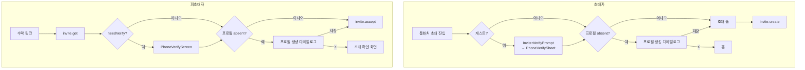

# ADR-0041: 플레이스 프로필을 초대의 전제조건으로 되돌린다

> 상태: Accepted · 결정일: 2026-08-03
>
> **선행 의존: [ADR-0040](0040-self-chat-title-and-profile-setup-nudge.md).** 같은 날 병렬로 진행된
> 세션이 `PlaceProfileCreateDialog`(결정 6)와 `resolvePlaceDisplayName`(결정 7)을 신설한다. 본 ADR은
> 그 둘을 **새로 만들지 않고 소비한다.** 겹치는 지점의 판단은 ADR-0040을 정본으로 따른다 — 상세는
> "선행 ADR과의 관계" 절.

## 맥락 (Context)

"프로필 없는 유저를 어디서 붙잡을까"는 이 앱에서 세 번 뒤집힌 질문이다.

| 시점       | 무슨 일                                                                                                         | 근거                                      |
| ---------- | --------------------------------------------------------------------------------------------------------------- | ----------------------------------------- |
| 2026-07-15 | [ADR-0012](0012-place-profile-creation.md) — 홈 진입 시 프로필 없으면 **강제** 생성 다이얼로그                  | Figma `3026-11374` 외 4개 상태 노드       |
| 2026-07-28 | `98a4685ff` — 홈 진입 강제 **제거**. `usePlaceProfilePrompt`·`PlaceProfileCreateDialog` 삭제                    | "프로필은 설정 허브에서 사후 설정"        |
| 2026-07-31 | [ADR-0039](0039-dm-display-name-chain-and-invite-profile-release.md) 결정 5 — 초대 수락의 `profiling` 스텝 삭제 | "앱 전체의 프로필 강제가 0이 된다"        |
| 2026-08-03 | **본 ADR** — 초대의 전제조건으로 되살린다                                                                       | 수락 후 강제종료 시 이름 없는 DM이 남는다 |

ADR-0039 결정 5를 실행한 커밋 `5a61669a5`의 메시지가 당시 판단을 한 줄로 요약한다.

> `It is not a value worth standing in front of an accept`

그 판단이 감수한 트레이드오프도 같은 문서에 적혀 있다 — **"프로필 없는 상대가 늘어난다."** 그리고 재권유 UX(배너·토스트 등)는 명시적으로 범위 밖으로 미뤄졌다. 본 ADR은 그 미뤄둔 빈칸을 메우는 것이 아니라, **미룬 판단 자체를 뒤집는다.**

### 뒤집는 이유 — ADR-0039가 계산에 넣지 않은 실패 모드

수락 **이후에** 프로필을 물으면, 사용자가 그 사이에 앱을 강제종료하는 경로가 열린다. 그러면 `invite.accept`는 이미 커밋됐고 프로필은 없는 상태로 DM에 들어앉는다. ADR-0039는 이탈률을 사고 표시명 품질을 팔았지만, 이 경로는 **이탈도 아니고 되돌릴 수도 없는 제3의 결과**다. 표시 이름 체인(ADR-0039 결정 1)이 `대화 상대`라는 일반 라벨로 흡수하도록 만들어져 있으나, 그 라벨은 폴백이지 목표가 아니다.

그래서 프로필을 **수락 이후가 아니라 수락 이전**으로 되돌린다. 그러면 "수락됐는데 이름 없음"이 구조적으로 발생 불가능해진다.

### 조사에서 확인한 것들이 결정을 좌우했다

1. **되살릴 코드가 3일 전 커밋에 온전히 남아 있다.** `5a61669a5`가 지운 것은
   `RelayInviteProfileDialog.tsx`(60줄, `git show 5a61669a5^:...`로 복구 가능),
   `useSaveMyPlaceProfile.ts`(10줄), `RelayInvitePhase`의 `'profiling'` 한 줄,
   `relayInviteAccept.profile.*` 6키다. 그 컴포넌트의 doc 주석이 이번 요구와 글자까지 같다 —
   `"backing out returns to the invite rather than dropping the user on home"`.
2. **`placeProfileCreate.*` 16키가 살아 있다.** ADR-0039가 "재권유 UX가 쓸 가능성"을 이유로 지우지
   않았다 ([ko](../../apps/web/public/locales/ko/translation.json):703, en 동일). 신규 카피 0.
3. **`PlaceProfileForm`이 이미 두 컨테이너를 지원한다.** `container: 'dialog' | 'page'`,
   그리고 `dismissible?: boolean`의 doc 주석이
   `"used for the mandatory first-time profile setup (relay/default place)"`로 이 케이스를 예고해 뒀다
   ([PlaceProfileForm.tsx:74](../../apps/web/src/app/features/home/components/PlaceProfileForm.tsx:74)).
   본 ADR은 결국 그 훅포인트를 쓰지 않지만(결정 2), 폼을 새로 만들 필요는 없다.
4. **`useMyProfile()`은 "프로필 없음"을 표현할 수 없다.** `null`이 ① 활성 사이트/uid 없음
   ② 로딩 중 ③ 진짜 없음을 동시에 의미하고 `isLoading`이 없다
   ([useMyProfile.ts:24](../../apps/web/src/app/hooks/useMyProfile.ts:24)). 게다가
   `profile.get-mine`은 get-or-create라 **사실상 null을 반환하지 않는다** — 판정은 `nick` 공백과
   `active === false`로 해야 한다. 지워진 `RelayInviteProfileDialog`의 트리거는 `!profile?.nick`
   **단독**이었고, 그건 로딩 한 프레임에 헛등장할 수 있는 판정이었다.
5. **3상태 판정기가 `98a4685ff` 안에 있다.** 지워진 `usePlaceProfilePrompt`가
   `'unknown' | 'present' | 'absent'`와 함께 세 가지 규칙을 담고 있었다 — `settled = isVerified && !isSwitching`
   게이트(`switchSiteSession`이 `selectedSiteId`를 낙관적으로 먼저 뒤집기 때문),
   `item.sid === requestedSid` 확인, 그리고 비대칭 판정(`nick` 있으면 곧바로 `present`,
   `absent`는 `nick` 없음 **AND** `active === false`, 에러는 언제나 `unknown`).
6. **초대자 쪽에는 코드가 증명하는 동기가 있다.**
   [inviteMessageCopy.ts:8](../../apps/web/src/app/features/invite/utils/inviteMessageCopy.ts:8)이 초대 SMS
   발신자명을 `myProfile?.nick`으로 채우고, 없으면 `contactInvite.defaultSenderName`으로 폴백한다.
   그 값이 **`"친구"`** 라, 프로필 없는 초대자의 문자는 `"친구님이 DoU에서 1:1 대화를 신청했어요!"`로 나간다.
7. **`0000` 판별은 기존 코드와 어긋난다** (ADR-0040 결정 7이 OR 판정으로 해소). 요청은 `placeId === '0000'`이었으나
   [PlaceItem.tsx:16-22](../../apps/web/src/app/features/home/components/PlaceItem.tsx:16)가 그 방법을
   명시적으로 피한다 — `"The legacy place.id === 'default' never matches real relay places, so the cloud
context is the reliable signal."` 실제 브랜딩은 `selectedCloudId === 'default'`로 판별한다.
8. **`useActivePlaceName()`은 브랜딩을 적용하지 않는다.** `place.name`을 생으로 반환하므로
   ([useActivePlaceName.ts:23](../../apps/web/src/app/hooks/useActivePlaceName.ts:23)) 기본 클라우드에서는
   백엔드 원본 이름(`default`/`#default`)이 나온다. 즉 **오늘 이미** 채널 설정 → 내 프로필 다이얼로그
   제목에 그 값이 노출되고 있다.
9. **사후 설정 퇴로가 실은 막혀 있었다.**
   [PlaceProfilePage.tsx:31](../../apps/web/src/app/features/place/pages/PlaceProfilePage.tsx:31)이
   `!myProfile`이면 폼을 렌더하지 않고 헤더만 띄운다. 프로필이 없는 유저는 설정 허브 "내 프로필"에서도
   프로필을 만들 수 없다 — ADR-0039가 제시한 "그쪽에서 나중에 설정한다"는 퇴로가 그 유저에게는 없었다.
10. **Figma 이탈 모달에는 나가기 버튼이 없다.** `3026-12027`의 액션 행에서 2버튼 변형(`Component 8`)이
    `hidden="true"`이고 전체폭 `계속 설정`만 보인다. ADR-0012가 이 노드를 `나가기 · 계속 설정`으로 적은
    것은 오독이며, 구현된 `PlaceProfileForm`이 그 오독을 따라 `exit.leaveLabel`을 항상 렌더한다.

## 결정 (Decision)

### 1. 프로필은 게이트가 아니라 **전제조건**이다

강제하지 않는다. 대신 **프로필 없이 진행할 경로 자체를 없앤다.** 두 초대 경로 모두 프로필 저장이
서버 호출의 선행 조건이 된다.

X로 나가도 갇히지 않고, 나갔다는 것은 **초대를 보내지 않았거나 수락하지 않았다**는 뜻이다. 그래서
"발신자명이 `친구`인 SMS"도 "이름 없이 수락된 DM"도 만들어질 경로가 없다.

### 2. X는 이탈 모달을 거치지 않고 곧바로 이전 화면으로 나간다

- 초대자: 홈으로 되돌린다 (통화처 초대 화면 자체를 벗어난다).
- 피초대자: 초대 확인 화면으로 돌아간다 (`flow.cancelStep`).
- `dismissible`은 `true`. `dismissible: false` 분기는 이번에도 쓰지 않는다.
- **Figma `3026-12027`(이탈 확인 모달)은 구현하지 않는다.** 그 노드의 단일 버튼 막다른 설계는
  결정 1의 전제조건 구조와 목적이 충돌한다 — 나갈 문을 막을 이유가 없어졌다.
- 따라서 `PlaceProfileForm`에 이탈 가드를 끄는 스위치가 필요하다. `isDirty`일 때 `AlertDialog`를
  띄우는 현재 동작([PlaceProfileForm.tsx:175-179](../../apps/web/src/app/features/home/components/PlaceProfileForm.tsx:175))이
  생성 플로우에서는 비활성이어야 한다. 편집 플로우(`PlaceProfileEditDialog`·`PlaceProfilePage`)의
  가드는 **그대로 둔다** — 거기서는 되돌릴 기존 값이 실재한다.

### 3. 피초대자: `profiling` phase를 `invite.accept` **앞에** 복원한다 — ADR-0039 결정 5 철회

수락 순서가 **인증 → 프로필 → 수락**으로 돌아간다. ADR-0033 D10의 원래 순서다.

- `RelayInvitePhase`에 `'profiling'` 복원, `RelayInviteFlow.onProfileSaved` 복원.
- `advance()`에서 `mutations.acceptInvite` 직전에 판정을 넣는다 — 위치는 `5a61669a5`가 지운 그 자리다.
- `RelayInviteProfileDialog`·`useSaveMyPlaceProfile` 복원. `RelayInviteAccept`의 phase 분기 복원.
- **단, 트리거는 `!profile?.nick`이 아니라 결정 5의 awaited 판정이다.** 원본을 그대로 되살리면 안 된다.
- `useRelayInviteFlow.test.ts`·`RelayInviteAccept.test.tsx`의 순서 테스트를 되돌린다.
- [docs/invite-accept-entry.md](../invite-accept-entry.md)의 S1 step 7과 relay 상태도에
  `submitting --> profiling` 간선을 복원한다.

전용 URL 라우트는 두지 않는다 — ADR-0012 결정 2의 방침을 유지한다. 기존
`/place/:placeId/settings/profile`로 navigate하지 않는 이유는 수락 흐름이 그 라우트에서 돌아올
지점을 스스로 관리해야 하고, `pendingChannel` 배선이 하나 더 늘기 때문이다.

### 4. 초대자: 통화처 초대 화면 진입 시 프로필 생성 다이얼로그

`ContactInvitePage`에 `PlaceProfileCreateDialog`(ADR-0040 결정 6)를 마운트한다. 게이트 순서는
**게스트 인증 → 프로필 → 초대 폼**이다. 기존 `isGuest` 게이트가 먼저다 — 게스트는 프로필을 쓸 사이트
컨텍스트가 확정되지 않았고, 애초에 초대를 발행할 수 없다(ADR-0034).

`isGuest`와 마찬가지로, 프로필이 `absent`인 동안 초대 폼은 **렌더하지 않는다.** 폼을 그려두고 위에
다이얼로그를 덮으면 프로필 없이 제출할 수 있는 상태가 한순간이라도 존재하게 된다.

기존의 단일 `return` + 고정 자식 슬롯 구조는 유지한다 — 그 이유(`PhoneVerifySheet`가 승격 도중
언마운트되며 `pendingToken` 재시도를 잃는 문제)는 프로필 다이얼로그가 추가돼도 그대로 유효하다
([ContactInvitePage.tsx:163-166](../../apps/web/src/app/features/invite/pages/ContactInvitePage.tsx:163)).

### 5. 판정은 관측이 아니라 `await`다 — `nick` 단독 판정 금지, 애매하면 fail open

> **개정 (2026-08-03, 스펙 작성 중)** — 원안은 `usePlaceProfilePrompt`의 3상태 반응형 판정
> (`'unknown' | 'present' | 'absent'` + `settled` 게이트 + `sid` 확인)을 그대로 되살리는 것이었다.
> 스펙을 쓰다 보니 그 설계가 `unknown`을 **두 가지 다른 것**에 쓰고 있었다 — "아직 로딩 중"과
> "판정이 애매함". 앞의 것은 `getMyProfile()`을 **`await`하면 애초에 생기지 않는다.** 수락 쪽
> `advance()`는 이미 async이고 초대자 쪽도 마운트 시 한 번 기다리면 된다. 그래서 반응형 3상태 훅을
> 버리고 **awaited 단발 판정**으로 바꿨다. `settled` 게이트와 `sid` 확인은 그 자체가 반응형으로
> 읽던 시절의 방어라 함께 불필요해졌다(응답을 기다리므로 낙관적 sid 뒤집기에 걸리지 않는다).

판정은 `await getMyProfile()`의 응답 하나로 한다. throw하지 않는다.

| 응답                                   | 판정             | 근거                                                                                                                |
| -------------------------------------- | ---------------- | ------------------------------------------------------------------------------------------------------------------- |
| `nick?.trim()` 있음                    | **present**      | 닉이 곧 "프로필 있음" 신호                                                                                          |
| `nick` 없음 **AND** `active === false` | **absent**       | `active: 0`이 "서버가 프로필 없음을 확인했다"는 표지 (`get-mine`은 get-or-create라 응답 자체는 항상 온다, ADR-0007) |
| `nick` 없음, `active`가 `false`가 아님 | **present 취급** | 애매함 — fail open                                                                                                  |
| 조회 실패(throw)                       | **present 취급** | 같음                                                                                                                |

**애매하면 막지 않고 진행한다(fail open).** 두 방향의 실패 비용이 비대칭이기 때문이다.

- 막는 쪽으로 실패하면: 프로필 조회 장애가 **초대 발급 불가·수락 불가**로 번진다. 전제조건 구조에서
  게이트는 정상 경로를 위한 것이고, 이상 경로에서 사용자의 목적을 인질로 잡을 이유가 없다.
- 띄우는 쪽으로 실패하면: 생성 폼은 `initialNick=""`로 시작하므로 프로필이 있는 사용자에게 잘못
  떠서 저장되면 **기존 닉과 사진을 덮어쓴다.** 이쪽이 되돌릴 수 없다.

즉 `nick` 단독 판정(`!profile?.nick`)을 쓰지 않는 이유는 그대로다. 바뀐 것은 그 방어를 "3상태 +
게이트"가 아니라 "`await` + `active` 확인 + fail open"으로 얻는다는 점이다. 판정기는 훅이 아니라
**순수 함수**여야 한다 — 수락 쪽은 `advance()` 안에서 부르므로 훅일 수 없다.

### 6. 플레이스 표시 이름과 생성 다이얼로그는 ADR-0040의 것을 **소비한다**

`placeId === '0000'` 단독 비교도, 자체 리졸버도 만들지 않는다. ADR-0040 결정 7이 신설하는
`resolvePlaceDisplayName`(판정: `isDefaultCloud` **OR** `sid === '0000'`, 라벨: ko `두유 홈` /
en `DoU Home`)을 그대로 쓰고, ADR-0040 결정 6이 신설하는 `PlaceProfileCreateDialog`
(`placeProfileCreate.*` 소비 래퍼)를 초대 경로의 양쪽이 감싼다.

- 초대자: `ContactInvitePage`가 `PlaceProfileCreateDialog`를 직접 마운트한다.
- 피초대자: 복원되는 `RelayInviteProfileDialog`가 `PlaceProfileCreateDialog`를 감싼다 —
  차이는 `onDone`/`onExit`의 목적지뿐이다(결정 2·3).

이로써 조사 1의 카피 우회가 해소된다. 지워진 `RelayInviteProfileDialog`가 `placeProfileCreate.title`을
쓰지 못하고 자체 6키를 따로 둔 이유가 `"the relay place has none worth showing"`이었는데, 리졸버가
이름을 주면 `<두유 홈>에 사용할 내 프로필을 만들어 주세요`가 성립한다. **삭제된
`relayInviteAccept.profile.*` 6키를 되살릴 필요가 없다.**

### 7. 설정 허브의 생성 경로를 연다

조사 9의 `PlaceProfilePage` 얼리리턴을 "프로필이 올 때까지 대기"에서 "**판정이 `absent`면 빈 폼을
렌더**"로 바꾼다. 결정 5의 awaited 판정이 그 구분을 가능하게 한다. 전제조건 구조가 유일한 진입로가 되면
안 되므로, 사후에 스스로 만들 수 있는 경로는 열려 있어야 한다.

> **구현 중 보강 (2026-08-03, 코드리뷰)** — 조건은 하나가 아니라 둘이다. `absent === false`인데
> `myProfile`이 아직 없는 창이 존재한다: `absent`는 `getMyProfile()` 응답으로 즉시 풀리는데
> `myProfile`은 `observeItem` 재방출로 오고 그 재방출이 **~50ms 디바운스**된다
> (`scheduleItemReemit(ids, delay = 50)`). 콜드 캐시에서 그 틈에 폼을 올리면 `seededRef`가 빈 값을
> 한 번 물고 다시 seed하지 않으므로, **프로필이 있는 사용자가 자기 이름을 본 적도 없이 교체한다.**
> 서버 데이터가 깨지지는 않는다(`JSON.stringify`가 `thumbnail: undefined`를 떨어뜨려 사진은 살아남고,
> 빈 이름으로는 제출이 막힌다) — 잃는 것은 사용자가 자기 값을 보고 판단할 기회다. 그래서 게이트는
> `absent === undefined || (absent === false && !myProfile)`이고, `absent === true`만 행 없이 통과한다.

### 범위 밖 (Out of scope)

- 홈 진입 시 프로필 감지·강제 — `98a4685ff`의 결정을 유지한다. 본 ADR은 **초대 경로 두 곳만** 다룬다.
- 초대 경로 **밖**의 프로필 재권유 UX (방 설정 멤버 행, 홈 목록 배너 등) — 방 설정 쪽은 ADR-0040 결정 4·5 소관이고, 나머지는 ADR-0039가 미뤄둔 그대로 남긴다.
- 초대 시 입력한 친구 이름 → `join.nick` 자동 반영 (ADR-0039 결정 2의 범위 밖 항목, 별도 진행).
- 그룹/클라우드 초대(`CloudInviteAccept`) 경로 — 손대지 않는다.
- `placeProfileEdit.*`와 `placeProfileCreate.*`의 통합.
- 플레이스 표시 이름 리졸버와 `PlaceProfileCreateDialog` 자체의 신설 — ADR-0040 결정 6·7 소관.
  본 ADR은 소비만 한다.
- `placeProfileCreate.*` 카피 수정(제목의 "내" 추가, `exitDescription` 재작성) — ADR-0040 결정 6 소관.

## 선행 ADR과의 관계 (ADR-0040)

두 ADR이 같은 날 병렬로 쓰였고 세 지점이 겹친다. 겹치는 곳은 전부 ADR-0040을 따른다.

| 지점             | ADR-0040 (정본)                               | 본 ADR이 초안에서 달리 판단했던 것 | 왜 양보하는가                                                                                |
| ---------------- | --------------------------------------------- | ---------------------------------- | -------------------------------------------------------------------------------------------- |
| 홈 플레이스 판정 | `isDefaultCloud` **OR** `sid === '0000'`      | 클라우드 문맥 단독                 | ADR-0040이 `'0000'`이 실재하는 sid라는 증거를 찾았다 (`localStorage['chatic-channel-sort']`) |
| ko 라벨          | `placeList.defaultPlace`를 `두유 홈`으로 변경 | `DoU Home` 유지 (범위 밖으로 미룸) | 원 요청 표기가 "두유홈"이었고, 두 라벨을 갈라두면 통일한 의미가 없다                         |
| 생성 다이얼로그  | `PlaceProfileCreateDialog` 신설               | 초대 경로별 래퍼를 각자 신설       | 같은 것을 두 번 만들 이유가 없다                                                             |

**본 ADR이 ADR-0040에 요구하는 것 하나** — `PlaceProfileForm`의 이탈 가드를 끄는 스위치
(결정 2)가 필요하다. ADR-0040의 유도 경로(방 설정 → 내 행)에서는 가드가 **유지**되고, 본 ADR의
초대 경로에서는 **비활성**이다. 그래서 스위치는 `dismissible`과 별개의 prop이어야 하며,
기본값은 현재 동작(가드 유지)이다. `placeProfileCreate.exitDescription` 재작성(ADR-0040 결정 6)은
그쪽 경로에서만 쓰이므로 충돌하지 않는다.

**착수 순서와 시그니처는
[docs/plans/place-profile-create-shared-contract.md](../plans/place-profile-create-shared-contract.md)가
정본이다.** 두 세션의 파일 소유권, `PlaceProfileCreateDialog`·`resolvePlaceDisplayName`·
`PlaceProfileForm.exit`의 확정 시그니처, 그리고 두 ADR이 이름 붙이지 않았던 세 번째 접촉면
("내 프로필 nick이 없다"를 두 세션이 다른 경로로 읽는다)이 거기 있다. 구현 착수 전에 읽는다.

## 대안 (Alternatives)

| 검토한 대안                                              | 버린 이유                                                                                                                                                                                                 |
| -------------------------------------------------------- | --------------------------------------------------------------------------------------------------------------------------------------------------------------------------------------------------------- |
| **프로필을 `invite.accept` 이후에 묻기**                 | 요청의 원래 문구이자 ADR-0039의 이탈률 논리와 양립하는 유일한 배치였다. 수락 직후 강제종료하면 이름 없이 방에 남는다 — 되돌릴 수 없는 상태라 버렸다. 이것이 본 ADR의 핵심 판단이다.                       |
| **강제(`dismissible: false`) — Figma 그대로**            | 이탈 모달에 나가기가 없어(조사 10) 사실상 강제다. 전제조건 구조가 같은 데이터 정합성을 **갇힘 없이** 달성하므로 강제의 대가를 지불할 이유가 없다. ADR-0039의 "강제 0"도 지켜진다.                         |
| **X → 이탈 모달 → 나가기** (2버튼 부활)                  | Figma에서 hidden인 `Component 8`을 되살리고 `exitLeave` 카피를 그대로 쓰는, 구현 변경 0인 안. 전제조건 구조에서는 나가기가 위험한 행동이 아니라 설득 단계가 군더더기다.                                   |
| **표시 이름 리졸버를 본 ADR이 직접 정의**                | 초안이 그랬다(클라우드 문맥 단독 판정, ko 라벨 유지). ADR-0040이 같은 것을 더 나은 근거로 이미 결정했으므로 양보했다 — "선행 ADR과의 관계" 절.                                                            |
| **`/place/:placeId/settings/profile`로 navigate**        | "프로필 설정 화면으로 이동함"이라는 표현에 가장 충실하고 `container="page"`를 재사용한다. 수락 흐름이 복귀 지점과 `pendingChannel`을 관리해야 해 배선이 늘고, ADR-0012의 "전용 라우트 없음"과도 어긋난다. |
| **채팅방 진입 후 방/홈 위에서 게이트** (ADR-0012식 러너) | 초대·비초대 경로를 한 곳에서 처리하는 이점이 있으나 결국 "수락 이후"라 첫 번째 대안과 같은 실패 모드를 갖는다. 러너 표시 우선순위 정리 비용도 남는다.                                                     |
| **트리거를 `!profile?.nick` 단독으로** (원본 복원)       | 되살릴 코드가 그렇게 쓰여 있어 가장 싸다. 반응형으로 읽으면 로딩 중 `null`에 헛등장하고, 생성 폼이 빈 값으로 seed되어 **기존 프로필을 덮어쓸 수 있다.** `await` + `active` 확인이 필요하다.               |

## 결과 (Consequences)

**얻는 것**

- "수락됐는데 이름 없음"과 "발신자명이 `친구`인 초대 SMS"가 **구조적으로 발생 불가능**해진다.
  검증이나 폴백이 아니라 경로 제거로 얻는다.
- 강제 없이 얻는다. X는 언제나 열려 있고 어디서도 갇히지 않으므로 ADR-0039가 세운 "앱 전체 프로필
  강제 0"은 유지된다.
- 신규 카피 0, 신규 kit 컴포넌트 0, 신규 폼 0. 삭제된 `relayInviteAccept.profile.*` 6키도 되살릴
  필요가 없다 — ADR-0040의 리졸버가 제목의 플레이스 이름을 채워주기 때문이다.
- 프로필 없는 유저가 설정 허브에서 프로필을 만들 수 있게 된다(조사 9) — ADR-0039가 있다고 가정했던
  퇴로가 실제로 생긴다.

**감수할 것 / 주의할 것**

- ⚠️ **ADR-0039 결정 5를 3일 만에 되돌린다.** 같은 질문의 네 번째 스윙이므로, 다음 사람이 다시
  뒤집기 전에 반드시 읽어야 하는 문장은 이것이다 — **ADR-0039는 이탈률을 사고 표시명 품질을 팔았고,
  본 ADR은 "수락 후 강제종료 → 되돌릴 수 없는 이름 없는 DM"이라는 제3의 실패 모드를 근거로 반대
  방향을 택했다.** ADR-0039의 이탈률 논리는 틀리지 않았고, 여전히 유효한 비용이다.
- **수락 직전 방해 단계가 하나 늘어난다.** 이탈 지점이 늘고, 전환율이 실제로 떨어질 수 있다.
  ADR-0039가 지적한 그 비용을 알고 지불한다.
- ⚠️ **"`invite.accept` 전에 프로필을 쓸 수 있다"는 전제가 절반만 맞았다** (2026-08-03, 코드리뷰에서
  정정). 백엔드는 되지만 **클라이언트가 sid를 못 갖는 경우가 있다.** `setMyProfile`은
  `selectedSiteId`를 assert하는데, relay sid는 `chatic-relay-selected-site-id`의 **단순 읽기**이고
  그 값을 쓰는 것은 명시적 플레이스 전환(`useSwitchPlace`, 홈에서만 마운트)뿐이다 — **인증은 sid를
  세우지 않는다.** 게다가 `storage`는 일반 브라우저에서 **sessionStorage**다
  ([storage.ts:13](../../libs/shared/src/utils/storage.ts:13); localStorage는 네이티브 WebView·데스크톱
  셸만), 그래서 SMS 링크를 새 탭에서 열면 오래된 사용자도 sid가 비어 있다. relay 분기에는 sid를 쓰는
  코드가 없다(cloud 분기만 `useEnterInvitedSite`로 쓴다).

    방치하면 다이얼로그 안에서 저장이 던지고 → `saveError` → X → 다시 `profiling`으로,
    **초대를 영구히 수락할 수 없게 된다**(프로필이 수락의 전제조건이므로). 그래서 판정을 sid 인식으로
    바꿨다 — `!sid`면 스텝을 건너뛰고 수락으로 진행한다. 같은 흐름의
    [useAwaitInviteChannel.ts:60](../../apps/web/src/app/hooks/useAwaitInviteChannel.ts:60)이 이미
    `if (!sid) return null;`로 같은 방어를 한다.

    **남는 한계**: sid가 없는 진입(브라우저 새 탭, 첫 설치 딥링크)에서는 프로필 스텝이 뜨지 않으므로
    ADR-0039 상태(이름 없이 수락)로 되돌아간다. 결정 1의 보장이 그 경로에서는 성립하지 않는다.
    근본 해결은 수락 라우트에서 relay 플레이스를 해소해 sid를 세우는 것이고, 이번 범위 밖이다.

- **판정을 반응형으로 읽으면 데이터가 상한다.** 헛등장이 단순 방해가 아니라 기존 프로필 덮어쓰기로
  이어진다(결정 5). `getMyProfile()`을 `await`하지 않고 `useMyProfile`을 읽는 구현으로 되돌아가면
  그 위험이 부활한다.
- ⚠️ **`profile.active`를 읽는 첫 소비처다.** `apps/web`에 선례가 없어, 프로필 없는 계정의
  `get-mine`이 실제로 `active === false`를 주는지 미검증이다. 안 주면 판정이 애매로 떨어지고
  fail open이라 **게이트가 한 번도 뜨지 않는다** — 무해하지만 기능이 죽는다. 구현 착수 시 dev
  스테이지에서 응답을 먼저 확인한다. 깨지면 `nick` 부재 단독 판정으로 내려간다(`await`이라 안전).
- **Figma `3026-12027`을 구현하지 않는다** — 디자이너와 어긋나는 지점이다. 그 노드의 단일 버튼
  막다른 설계는 강제를 전제하는데 우리는 강제하지 않기로 했다. 확인이 필요하다.
- ADR-0012가 `3026-12027`을 `나가기 · 계속 설정` 2버튼으로 적은 것은 **오독이었다**(조사 10).
  그 오독이 `PlaceProfileForm`의 `exit` 4-카피 계약으로 굳어 있고, 이번 변경으로 생성 플로우에서는
  그 계약이 쓰이지 않게 된다. `placeProfileCreate.exit*` 4키가 죽은 카피가 된다 — 지우지 않고 남긴다.
- **`ContactInvitePage`가 게이트 두 개를 순차로 갖는다** (게스트 인증 → 프로필). 화면 하나에 조건부
  분기가 셋이 되어 단일 `return` 구조의 복잡도가 오른다.
- [apps/web/docs/feature/home/place-profile-prompt.md](../../apps/web/docs/feature/home/place-profile-prompt.md)가
  `상태: Live`인 채로 `98a4685ff`가 지운 게이트를 설명하고 있다. 본 작업으로 일부가 다시 사실이
  되지만 배치가 달라, 문서를 그냥 살리면 안 되고 다시 써야 한다.
- ⚠️ **ADR-0040과 착수 순서가 얽힌다.** 본 ADR은 그쪽의 `PlaceProfileCreateDialog`·
  `resolvePlaceDisplayName`에 의존하고, 반대로 그쪽 유도 경로가 쓰는 `PlaceProfileForm`에 본 ADR이
  이탈 가드 스위치를 추가한다. 같은 파일 셋을 두 세션이 만지므로 시그니처 선합의 없이 병렬로 가면
  충돌한다.

## 참고

- [ADR-0040](0040-self-chat-title-and-profile-setup-nudge.md) 결정 6·7 — 본 ADR이 소비하는 `PlaceProfileCreateDialog`·`resolvePlaceDisplayName`의 정본. 같은 날 병렬 진행
- [ADR-0039](0039-dm-display-name-chain-and-invite-profile-release.md) 결정 5 — 본 ADR이 철회. 표시 이름 체인(결정 1~4)은 그대로 유효하다
- [ADR-0033](0033-relay-dm-invite-and-auth-parallel-tracks.md) D10 — 순서가 원안(인증 → 프로필 → 수락)으로 복귀
- [ADR-0012](0012-place-profile-creation.md) — 생성 화면의 원 설계. 등장 규칙(홈 감지)은 채택하지 않고 화면·입력 규칙만 승계
- [ADR-0034](0034-inviter-phone-verification-guest-gate-and-sheet.md) — 초대자 게스트 게이트, 본 ADR의 선행 단계
- [ADR-0020](0020-place-profile-edit-dialog.md) · [ADR-0031](0031-place-settings-hub.md) — 편집 경로
- [ADR-0007](0007-place-profiles-separate-cache-and-display-merge.md) — `get-mine`이 get-or-create인 근거
- 되살릴 커밋: `5a61669a5`(피초대자 프로필 스텝 삭제) · `98a4685ff`(홈 감지 + 3상태 판정기 삭제)
- Figma: `3026-11374`(초대자) · `3080-12440`(피초대자, 두 노드는 동일 화면) · `3026-12027`(이탈 모달, 미채택)
