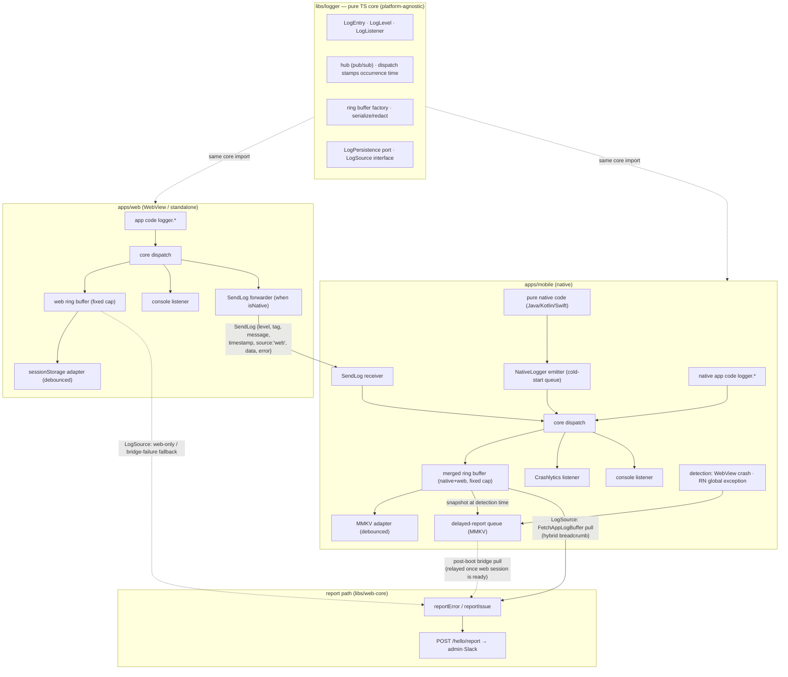

# ADR-0047: Unify the logging core into a platform-neutral `libs/logger`, and strengthen report traceability

> Status: Accepted (the report-traceability decisions are Superseded) · Decided: 2026-08-10
>
> **Unifying the logging core remains in effect.** However, the traceability improvements riding on
> `reportError` (honest P1 synthetic stacks, exposing request URL/method, new categories, sending delayed
> reports) were retired and migrated by
> [ADR-0073](./0073-retire-automatic-error-reporting-in-favor-of-log-entries.md).
> Related: [ADR-0029](./0029-error-report-categorization-and-enrichment.md) (error report categorization ·
> context) · [ADR-0017](./0017-issue-report-floating-widget.md) (issue-report widget) ·
> docs/plans/script-error-root-cause-proposal.md (the P1–P4 proposal; lived in the root docs tree, which has
> since been removed)

## Context

`apps/web` and `apps/mobile` are the final entry points for logs. The target state is: **on mobile, native
and web logs land in one place; on web running standalone, web logs land in one place.** But an audit of the
current structure shows the logging contract split three ways, losing information every time it crosses a
boundary.

### Three-way type split

| Axis       | `libs/logger` (core)          | `apps/mobile/.../services/log`                                 | `AppLogInfo` (wire, libs/app-messages) |
| ---------- | ----------------------------- | -------------------------------------------------------------- | -------------------------------------- |
| tag        | open `string`                 | closed `LogTag` union, 28 values                               | `string`                               |
| timestamp  | required, stamped at dispatch | not in the type — the buffer listener stamps it on consumption | optional                               |
| listener   | `(entry: LogEntry) => void`   | 5 positional args: `(level, tag, message, data?, error?)`      | —                                      |
| error+data | can both be passed            | `data` is lost at error level (`LogService.ts:37`)             | both allowed                           |

### Information loss at the bridge boundary

When a web log crosses to native via `SendLog` (`useLogHandler.ts`):

- The original tag (`SOCKET`, `AUTH`, etc.) is forcibly replaced with `WEBVIEW` and demoted to `data.tag` —
  the native buffer can no longer filter by tag.
- `SendLogPayload` has no timestamp field, so it gets re-stamped with the native receive time — not the
  time it actually occurred.
- At error level, the call is `logger.error('WEBVIEW', msg, error ?? {tag, data})`, so when an error is
  present, `data` is discarded wholesale.

### Other gaps

- **Buffer asymmetry**: web uses a fixed 500-entry in-memory ring buffer; mobile uses unbounded dynamic
  growth (`createRingBuffer(64)`, no `maxCapacity` set) plus a full MMKV re-serialization on every append
  (an O(n) write).
- **Breadcrumbs are half-populated**: on mobile (WebView), outgoing `reportError`/`reportIssue` calls attach
  only the tail 50 entries of the web's own buffer. The native buffer holds both native and web logs
  together, yet only web logs make it into the report.
- **What `[mobile] script-error` actually is**: mobile native has no global error handler and never calls
  `reportError`. Every `[mobile]` report originates from web code running inside the WebView. "Script Error."
  is what the browser produces when it masks a cross-origin/injected-script exception as `event.error =
null`; `app.tsx` then synthesizes an `Error` from it, and **the `stack` in the payload is fake — it points
  at the handler itself**. One injected-script interpolation bug was fixed on 2026-08-04, and follow-up
  proposals P1–P4 live in the proposal document.
- **"Network Error"**: this comes from axios and is categorized as `network`, but the failed request's URL,
  method, and status are not surfaced in the title/header, so an admin cannot immediately identify which API
  failed.
- **The legacy `__console__` channel**: mobile still injects `console.log`/`console.error` overrides into
  the WebView (`injectionScripts.ts:104-115`), but there is no receiving handler registered for it — a dead
  channel.

## Decision

### 1. `libs/logger` becomes the sole logging core — pure TS, platform-agnostic (top-priority constraint)

`libs/logger` **is a pure TypeScript service that depends on no platform** (browser DOM, React Native, MMKV,
Firebase). The core owns: the `LogEntry`/`LogLevel`/`LogListener` types, the hub (pub/sub), the ring buffer,
and redact/serialize. Stamping the occurrence-time timestamp is the core dispatch's responsibility.

Platform-specific behavior is wired entirely outside the core, as `LogListener` adapters:

- **Mobile**: an MMKV persistence listener, a Crashlytics listener — living in `apps/mobile`.
- **Web (WebView)**: a native forwarder (`SendLog`) — living in `libs/bridges` (keeping the existing
  `setupBridgeLogger` structure).
- **Console mirror**: reuse the core's `createConsoleListener`.

### 2. Replace mobile's LogService with the core

Remove `apps/mobile/src/app/services/log`'s own `LogService`/types/ring buffer and replace them with
`libs/logger`.

- Unfreeze the closed `LogTag` union into an open `string`. Well-known tags remain as a constants
  collection only.
- Unify the 5-positional-argument listener signature to `(entry: LogEntry) => void`.
- Resolve the data-loss-at-error-level contract with the core's `error(tag, message, {error, data})`
  overload.
- Align `AppLogInfo` (the wire type) to be compatible with `LogEntry` (including adding a `source` field, see
  item 3 below).

### 3. Preserve occurrence time, original tag, and source in the `SendLog` payload

Add `timestamp` (the occurrence time) to `SendLogPayload`; the native receiving side keeps the original tag
and pushes the `LogEntry` into the buffer as-is. Source is distinguished not by tag substitution but by a
separate `source: 'web' | 'native'` field. Since the field addition is additive, it's safe for any
combination of an older app (ignores the field) and an older web build (falls back to receive time when the
field is absent).

### 4. Report breadcrumbs — mobile pulls from the unified native buffer

The final destination for collection stays report attachment (`/hello/report`), as it is today. No periodic
log-upload pipeline is being built.

- When `reportError`/`reportIssue` fires on mobile (WebView), **fetch and attach the native merged buffer
  (native + web, with original tags and occurrence times preserved)** via the existing `FetchAppLogBuffer`
  bridge. Fall back to the web's own buffer if the bridge round trip fails.
- Web running standalone keeps attaching the tail of the web buffer, as today.
- This source selection is **specified as a `LogSource` interface** rather than scattered as `isNative()`
  branches inside `reportError`. Principle: **the merged buffer's owner is always the outermost shell** —
  hybrid uses the native buffer, web-only uses the web buffer as the source of truth. The debug screen's
  `webLogSource` (an existing pattern that unifies the native bridge response and the web buffer into the
  same `{logs, size}` shape) is promoted into a shared interface, so the debug UI and the report path share
  the same abstraction.

**Snapshot semantics** — a breadcrumb read is always a `peek` (non-destructive). `poll` (consuming) is
banned, because it would erase the history for the next report or for the debug UI and create a consumption
race between read paths (`poll` belongs to a future draining consumer such as periodic upload). By trigger
nature:

- **reportIssue (user intent)**: the click moment is the reference time. Attach the `LogSource`'s `peek`
  tail N as-is.
- **reportError (an async event)**: ① The global handler first logs the error itself via `logger.error` — it
  lands in the buffer, MMKV, and Crashlytics, and even repeated occurrences that get throttled out of
  reporting still get recorded in the buffer. ② Record `errorAt` and take a synchronous web-buffer `peek`
  snapshot (baseline/fallback). ③ Since the native pull is async and logs keep arriving in the meantime,
  filter the merged buffer by `timestamp <= errorAt` and then take the tail N — a filter made possible by
  preserving occurrence time (item 3). Fall back to ② on timeout (1–2s) or bridge failure. ④ Failures inside
  the report path itself are only ever logged via `logger.error`, never by re-entering `reportError`
  (recursion guard, unchanged from today).

### 5. Consolidate buffer policy + a persistence port

- Consolidate onto the core ring buffer, and give the mobile buffer a **fixed capacity**.
- Abstract persistence behind the core's **`LogPersistence` port** (e.g. `load(): LogEntry[]` /
  `save(entries): void`). The core only knows the port, not the storage — a consequence of the pure-TS
  constraint in item 1.
- Adapters live on the platform side: **mobile = MMKV** (replacing the full rewrite on every append with
  debounced/batched writes), **web = sessionStorage** (new, with the same debounce). **Error-level entries
  skip the debounce and flush immediately** regardless — this minimizes losing the breadcrumb tail right
  before a crash (a precondition for post-hoc `native-crash` reporting). Adding web persistence means a web
  standalone crash→reload also survives with its pre-crash breadcrumbs intact — a fix to a sore point in
  script-error tracing.
- Why sessionStorage: it's isolated per tab so multi-tab logs don't mix, it survives a reload, and it clears
  when the tab closes, keeping the log's on-device lifetime short. localStorage was rejected for
  multi-tab mixing and longer on-device retention risk.
- Implementation details (capacity numbers, debounce interval, serialization budget) are decided at the spec
  stage.

### 6. Admin traceability — script-error / Network Error

- **P1, make the reporter honest**: remove the synthetic Error's fake stack, or mark it `stackSynthetic:
true`, and surface `filename`/`lineno`/`colno` at the top of the title/message so admins can locate it
  immediately.
- **P2, guard the injected scripts**: wrap every injected native script in try/catch and send failures to an
  explicit report channel — closes off a likely source of opaque script-errors.
- **Strengthen Network Error context**: surface the failed request's URL, method, and status at the top of
  the title or message.

### 7. Remove the legacy `__console__` channel

Remove the console-override injection and its unregister leftovers, making `SendLog`'s structured path the
only channel.

### 8. Broaden detection/collection coverage

Today's detection net is just 4 web paths (`window.onerror`, `unhandledrejection`, Query/Mutation
`onError`, ErrorBoundary), leaving big blind spots. Add:

- **Web — resource load failures**: ``/`<script>`/`<link>` load errors don't bubble, so catch them with
  a capture-phase `error` listener. Category `resource-error`.
- **Web — CSP violations**: capture `securitypolicyviolation` events. Category `csp-violation`. A script
  blocked inside the WebView is a candidate cause of "Script Error.", so this gives a correlating clue.
- **Web — post-hoc crash detection**: use a clean-exit sentinel (sessionStorage) plus the persistent buffer
  (item 5) so that on the next boot, an abnormal termination of the previous session is detected, attaching
  the previous session's buffer as the breadcrumb for a post-hoc report. Category `page-crash`. This
  compensates for the fundamental blind spot of "the reporter is in the same process as the victim".
- **Native — WebView process crash**: have native detect iOS `ContentProcessDidTerminate` / Android
  `RenderProcessGone`, and report with its own merged buffer attached. Category `webview-crash`. This is the
  only place that can catch the case where the whole web layer dies and can't report itself.
- **Native — RN global handler**: install `ErrorUtils.setGlobalHandler` plus unhandled-promise-rejection
  tracking. Category `native-error`. Double-recorded with Crashlytics, but it secures admin visibility.
- **Native — pure native crashes (post-hoc)**: JVM/signal-level crashes kill the process, so collection at
  the moment of occurrence is fundamentally impossible. Leave capture to Crashlytics (do not DIY a signal
  handler — it would conflict with Crashlytics's own handler), and detect on the next run via
  `didCrashOnPreviousExecution()`, attaching the previous session's merged buffer, which survived in MMKV, as
  a breadcrumb pushed into a delayed-report queue. Category `native-crash`. Since the stack trace exists only
  in the Crashlytics console, this is a two-system setup: cross-reference the admin report (occurrence fact +
  device + breadcrumb) against Crashlytics (stack) by time and device.
- **Native — pure native code logs joining in (including non-error logs)**: feed logs and caught non-fatal
  exceptions from first-party Java/Kotlin/Swift code (OS APIs, background workers, file/upload primitives)
  into the core logger via a native→JS log emitter (`NativeLogger`) — with `source: 'native'`, original tag
  and occurrence time preserved, and non-fatal exceptions also recorded via Crashlytics's `recordException`.
  Since the JS runtime isn't up yet during cold start, events from that window would otherwise be lost, so
  native queues them in a small buffer and flushes them once JS is ready.

Native-detected reports are transmitted via a **delayed-report queue + web relay**. `/hello/report` is a
signed request, and only the web session inside the WebView can issue or hold that signing token, so a
reporter that sends directly from native isn't viable. Instead:

- At the moment of detection, native only **stores a merged-buffer snapshot + detection time + category**
  into a delayed-report queue (MMKV).
- Once the WebView (re)boots and the session is ready, web pulls the queue over the bridge and sends it
  through the existing web reporter (with signing) — the same pull idiom as `FetchAppLogBuffer`. The payload
  timestamp is the detection time stored in the queue, not the send time.
- The signing path stays singular, on web, and no token ever reaches native. If the WebView never recovers,
  the report simply never arrives — an accepted cost, the same as with the `page-crash` sentinel.

The title convention (`[mobile] <category>`), `stereo`, and throttle semantics all follow the existing web
reporter as-is, and 6 new categories (`resource-error`, `csp-violation`, `page-crash`, `webview-crash`,
`native-error`, `native-crash`) are added to the `reportCategory` union.

### Out of scope

- **A periodic log-upload pipeline** — a follow-up track. Needs backend negotiation.
- **P3 source-map symbolication** — needs source-map storage/processing infrastructure, a separate track.
- **P4's fingerprint improvements** — out of scope. (The rest of P4, capture-phase resource-error detection,
  is now in scope via item 8.)
- **Breadcrumb redaction** — keep ADR-0017's v1 policy (no redaction). Changing that policy is a separate
  decision.

    > **Follow-up: this exclusion was lifted by [ADR-0050](./0050-redact-report-breadcrumbs.md) (2026-08-11).**
    > That this ADR extended scope to persistent storage (sessionStorage · MMKV) was the basis for that
    > decision.

- **Collecting the full OS-level log stream** (Android Logcat reading its own PID, iOS 15+ `OSLogStore`) —
  technically possible, but it floods the buffer with third-party SDK/OS noise, adds polling cost, and
  removes control over sensitive information, degrading breadcrumb quality. If ever needed, do it as a
  narrower, separate track like "collect with filtering for specific tags."
- **`apps/desktop`** — untouched (per existing instruction).

### Target architecture

In short: the core owns only types, the hub, the ring buffer, serialization, and two abstractions
(`LogPersistence` port, `LogSource` interface); every platform implementation (MMKV, sessionStorage,
Crashlytics, the bridge forwarder) is wired in from outside. Web logs join the native merged buffer with
their original tag, occurrence time, and `source` preserved, and a report's breadcrumb source is routed by
`LogSource` to "the outermost shell's buffer" — the native merged buffer for hybrid, the web buffer for
web-only. The legacy `__console__` channel is removed, leaving `SendLog` as the only web→native log channel.

## Alternatives

- **Just add adapters for compatibility (keep mobile's LogService)**: a smaller diff, but the type
  duplication remains, and mapping code would keep propping up the bridge-boundary losses (tag demotion,
  timestamp re-stamping, error/data exclusivity). Rejected, since it defers the core task of unifying the
  types.
- **Build a periodic log-upload pipeline**: would let the server see logs even for error-free sessions, but
  requires prior negotiation on a backend collection endpoint and retention policy. This round's goal is
  scoped to strengthening report attachment; left for a follow-up track.
- **Keep web-only breadcrumbs (mobile reports only get web logs)**: a smaller change, but drops the last
  piece of the "mobile sees mobile+web" goal (native context landing in the report). Rejected.
- **Keep the `__console__` channel**: it's a dead channel with no receiving handler and an out-of-type
  string protocol, so it's removed.

## Consequences

**What is gained**

- The log type contract converges onto a single `LogEntry`, and since the core is pure TS, it behaves and
  tests identically on every platform.
- The native buffer can filter web logs by their original tag and occurrence time, and mobile reports now
  carry a merged native+web breadcrumb.
- script-error reports lose their fake stack and surface location clues (filename/lineno/colno) up front.
  Network Error lets admins identify the failing API immediately from the list.
- Mobile's unbounded buffer growth and O(n) MMKV writes are resolved, and web-only runs also survive
  crash→reload with intact breadcrumbs thanks to sessionStorage persistence.
- Because persistence (`LogPersistence`) and the breadcrumb source (`LogSource`) are interfaces, a new
  platform (e.g. desktop) only needs a new adapter.
- Detection blind spots shrink a lot — resource load failures, CSP violations, page crashes (post-hoc),
  WebView process crashes, RN global exceptions, and pure native crashes (post-hoc) are all now reported to
  admin. The crash family in particular used to be "the reporter died and couldn't send"; it's now covered
  by a post-hoc sentinel (web) and re-run detection (native).
- Logs from pure native code (file/upload, background workers, etc.) no longer disappear into Logcat/Xcode
  console only — they land in the merged buffer, making native-layer failures traceable as breadcrumbs too.

**Trade-offs accepted**

- Replacing mobile's LogService is a large refactor — it requires rewiring all 3 subscribers
  (Console/MMKV/Crashlytics) and verifying the impact across mobile's app-wide logger call sites.
- One extra bridge round trip is added at report time (mitigated by the web-buffer fallback on failure).
- sessionStorage writes are synchronous main-thread work, so debouncing is assumed. Web-only breadcrumbs
  disappearing when the tab closes is accepted (an intentional choice to shorten the log's on-device
  lifetime).
- Native-detected reports go through the delayed-report queue and are relayed by web, so reports are delayed
  until the WebView session recovers, and never arrive at all if the user doesn't reopen it (same property
  as the `page-crash` sentinel). The queue needs MMKV persistence and post-send cleanup (to prevent
  duplicate sends). RN global exceptions are double-recorded with Crashlytics (intentional, for admin
  visibility).
- Admin filter values grow by the 6 new categories. `native-crash` is a two-system setup where the stack
  lives only in Crashlytics, so admin alone can't pin down the cause.
- `SendLogPayload`/`AppLogInfo` changes are designed additively, so they're safe across old/new version
  combinations (app-store rollout delay vs. immediate web deploy), but field-absence fallback code sticks
  around for a while.
- Given the app review cycle, native receiver changes ship later than web — when web deploys first, the
  extra fields must simply be ignored, with behavior otherwise unchanged.

## Next steps

Feed this ADR into [[dev-2_implement]] Phase A (spec writing). To settle in the spec: buffer capacity and
debounce numbers, final field definitions for `LogEntry`/`AppLogInfo`/`SendLogPayload`, and the mobile
rewiring order (replace core → bridge payload → breadcrumb pull → traceability improvements).
