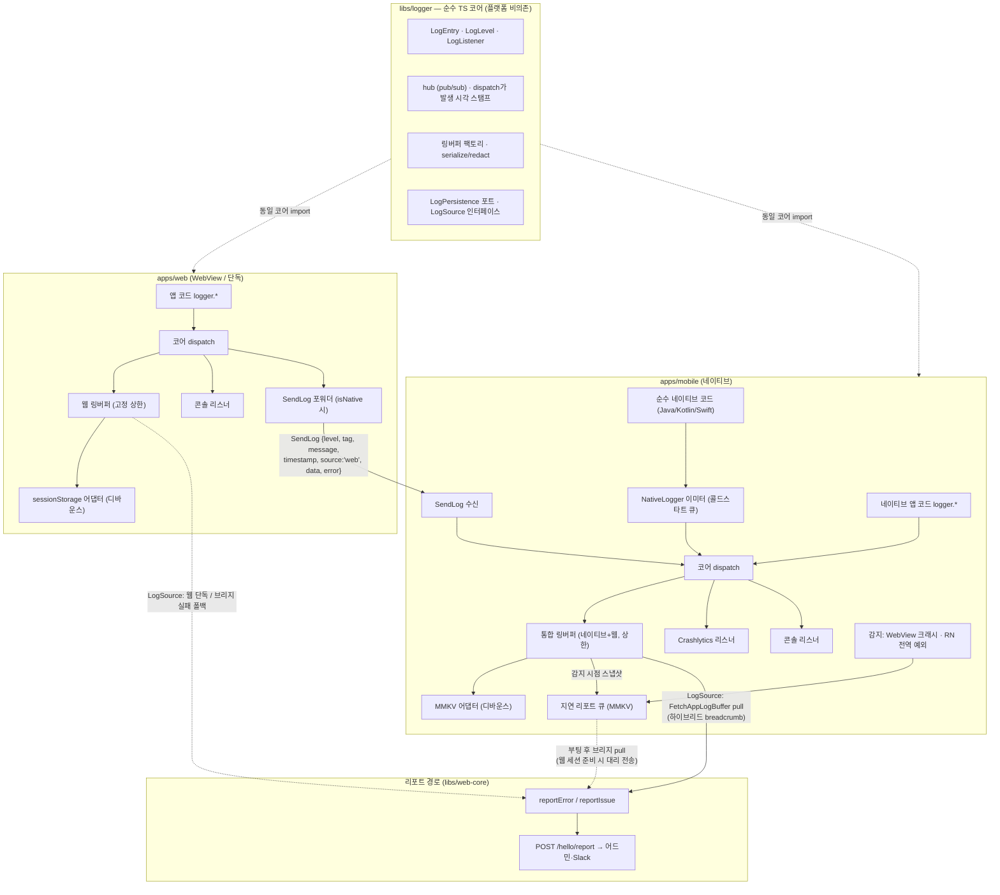

# ADR-0047: 로깅 코어를 플랫폼 중립 libs/logger로 단일화하고, 리포트 추적성을 강화한다

> 상태: Accepted · 결정일: 2026-08-10
> 관련: [ADR-0029](./0029-error-report-categorization-and-enrichment.md) (에러 리포트 분류·컨텍스트) · [ADR-0017](./0017-issue-report-floating-widget.md) (이슈 제보 위젯) · [docs/plans/script-error-root-cause-proposal.md](../plans/script-error-root-cause-proposal.md) (P1~P4 제안)

## 맥락 (Context)

`apps/web`과 `apps/mobile`은 로그의 최종 엔트리 포인트다. 목표 상태는 **모바일에는 네이티브+웹 로그가 한곳에, 웹(단독 실행)에는 웹 로그가 한곳에** 모이는 것이다. 그러나 현재 구조를 조사한 결과 로깅 계약이 세 갈래로 갈라져 있고, 갈래를 건널 때마다 정보가 손실된다.

### 타입 3중화

| 축         | `libs/logger` (코어)        | `apps/mobile/.../services/log`                       | `AppLogInfo` (wire, libs/app-messages) |
| ---------- | --------------------------- | ---------------------------------------------------- | -------------------------------------- |
| tag        | 열린 `string`               | 닫힌 `LogTag` union 28종                             | `string`                               |
| timestamp  | 필수, dispatch 시점 스탬프  | 타입에 없음 — 버퍼 리스너가 소비 시점에 스탬프       | 옵셔널                                 |
| 리스너     | `(entry: LogEntry) => void` | 위치 인자 5개 `(level, tag, message, data?, error?)` | —                                      |
| error+data | 동시 전달 가능              | error 레벨에서 data 유실 (`LogService.ts:37`)        | 둘 다 가능                             |

### 브리지 경계에서의 정보 손실

웹 로그가 `SendLog`로 네이티브에 건너올 때 (`useLogHandler.ts`):

- 원본 tag(`SOCKET`, `AUTH` 등)가 `WEBVIEW`로 강제 치환되고 `data.tag`로 강등된다 — 네이티브 버퍼에서 태그 필터링 불가.
- `SendLogPayload`에 timestamp 필드가 없어 네이티브 수신 시각으로 재스탬프된다 — 발생 시각이 아님.
- error 레벨은 `logger.error('WEBVIEW', msg, error ?? {tag, data})` 형태라 error가 있으면 data가 통째로 버려진다.

### 그 외 격차

- **버퍼 비대칭**: 웹은 고정 500 메모리 링버퍼, 모바일은 상한 없는 동적 확장(`createRingBuffer(64)`, maxCapacity 미지정) + 매 append마다 MMKV 전량 재직렬화(O(n) write).
- **breadcrumb이 반쪽**: 모바일(WebView)에서 나가는 `reportError`/`reportIssue`는 웹 자기 버퍼의 tail 50개만 첨부한다. 네이티브 버퍼에 네이티브+웹 로그가 함께 있는데도 리포트에는 웹 로그만 실린다.
- **`[mobile] script-error`의 실체**: 모바일 네이티브에는 전역 에러 핸들러도 `reportError` 호출도 없다. `[mobile]` 리포트는 전부 WebView 안의 웹 코드가 보낸 것이다. "Script Error."는 크로스오리진/주입 스크립트 예외를 브라우저가 마스킹해 `event.error = null`로 온 것을 `app.tsx`가 합성한 Error이며, **payload의 stack은 핸들러 자신을 가리키는 가짜다**. 주입 스크립트 보간 버그 1건은 2026-08-04에 수정됐고, P1~P4 후속안이 제안 문서에 있다.
- **"Network Error"**: axios발이며 `network` 카테고리로 분류는 되지만, 실패한 요청의 URL·메서드·status가 타이틀/상단에 실리지 않아 어드민에서 어떤 API가 죽었는지 즉시 식별할 수 없다.
- **레거시 `__console__` 채널**: 모바일이 WebView에 console.log/error 오버라이드를 여전히 주입하지만(`injectionScripts.ts:104-115`) 수신 핸들러 등록이 없는 죽은 채널이다.

## 결정 (Decision)

### 1. libs/logger를 유일한 로깅 코어로 — 순수 TS, 플랫폼 비의존 (최우선 제약)

`libs/logger`는 **순수 TypeScript 서비스로서 어떤 플랫폼(브라우저 DOM, React Native, MMKV, Firebase)에도 의존하지 않는다.** 코어가 소유하는 것: `LogEntry`/`LogLevel`/`LogListener` 타입, hub(pub/sub), 링버퍼, redact/serialize. 발생 시점 timestamp 스탬프는 코어 dispatch의 책임이다.

플랫폼별 동작은 전부 `LogListener` 어댑터로 코어 바깥에 배선한다:

- **모바일**: MMKV 영속화 리스너, Crashlytics 리스너 — `apps/mobile`에 위치.
- **웹(WebView)**: 네이티브 포워더(`SendLog`) — `libs/bridges`에 위치 (기존 `setupBridgeLogger` 구조 유지).
- **콘솔 미러**: 코어의 `createConsoleListener` 재사용.

### 2. 모바일 LogService를 코어로 대체

`apps/mobile/src/app/services/log`의 자체 `LogService`/타입/링버퍼를 제거하고 `libs/logger` 기반으로 교체한다.

- 닫힌 `LogTag` union은 열린 `string`으로 푼다. 잘 알려진 태그는 상수 모음으로만 유지.
- 위치 인자 5개 리스너 시그니처는 `(entry: LogEntry) => void`로 통일.
- error 레벨에서 data가 유실되는 계약을 코어의 `error(tag, message, {error, data})` 오버로드로 해소.
- `AppLogInfo`(wire 타입)는 `LogEntry`와 호환되게 정렬한다 (source 필드 추가 포함, 아래 3항).

### 3. SendLog 페이로드에 발생 시각·원본 tag·source를 보존

`SendLogPayload`에 `timestamp`(발생 시각)를 추가하고, 네이티브 수신 측은 원본 tag를 유지한 채 `LogEntry` 그대로 버퍼에 넣는다. 출처 구분은 tag 치환이 아니라 별도 `source: 'web' | 'native'` 필드로 한다. 필드 추가는 additive라 구버전 앱(필드 무시)·구버전 웹(필드 부재 시 수신 시각 폴백) 조합 모두 안전하다.

### 4. 리포트 breadcrumb — 모바일은 네이티브 통합 버퍼에서 pull

수집의 최종 목적지는 현행대로 **리포트 첨부**다 (`/hello/report`). 주기적 로그 업로드 파이프라인은 만들지 않는다.

- 모바일(WebView)에서 `reportError`/`reportIssue`가 나갈 때 기존 `FetchAppLogBuffer` 브리지로 **네이티브 병합 버퍼(네이티브+웹, 원본 tag·발생 시각 보존)를 가져와 첨부**한다. 브리지 왕복 실패 시 웹 자기 버퍼로 폴백.
- 웹 단독 실행은 현행대로 웹 버퍼 tail 첨부.
- 이 소스 선택을 `reportError` 내부의 `isNative()` 분기로 흩뿌리지 않고 **`LogSource` 인터페이스로 명세**한다. 원칙: **병합 버퍼의 소유자는 항상 가장 바깥 셸** — 하이브리드는 네이티브 버퍼, 웹 단독은 웹 버퍼가 진실의 원천. 디버그 화면의 `webLogSource`(네이티브 브리지 응답과 웹 버퍼를 같은 `{logs, size}` 모양으로 통일한 기존 패턴)를 공용 인터페이스로 승격해, 디버그 UI와 리포트 경로가 같은 추상을 쓴다.

**스냅샷 의미론** — breadcrumb 조회는 항상 `peek`(유지)이다. `poll`(소비)은 다음 리포트·디버그 UI의 히스토리를 지우고 조회 경로끼리 소비 경쟁을 일으키므로 금지한다 (`poll`은 주기 업로드 같은 배출형 소비자가 생기는 후속 트랙의 몫). 트리거 성격에 따라:

- **reportIssue (사용자 의도)**: 클릭 시점 = 기준 시각. `LogSource`에서 `peek` tail N을 그대로 첨부.
- **reportError (비동기 이벤트)**: ① 전역 핸들러가 에러 자체를 먼저 `logger.error`로 로깅한다 — 에러가 버퍼·MMKV·Crashlytics에 남고, 스로틀로 리포트가 생략된 반복 발생도 버퍼에는 기록된다. ② `errorAt` 기록 + 웹 버퍼 동기 `peek` 스냅샷(기준선·폴백). ③ 네이티브 pull은 비동기라 그 사이 로그가 쌓이므로, 통합 버퍼를 `timestamp <= errorAt`으로 필터한 뒤 tail N을 취한다 — 발생 시각 보존(3항) 덕에 가능해지는 필터다. 타임아웃(1~2초)·브리지 실패 시 ②로 폴백. ④ 리포트 경로 내부의 실패는 `reportError` 재진입 없이 `logger.error`로만 남긴다 (재귀 가드, 현행 유지).

### 5. 버퍼 정책 통합 + 영속화 포트

- 코어 링버퍼로 단일화하고 모바일 버퍼에 **상한(고정 capacity)** 을 도입한다.
- 영속화는 코어의 **`LogPersistence` 포트**(예: `load(): LogEntry[]` / `save(entries): void`)로 추상화한다. 코어는 포트만 알고 저장소를 모른다 — 순수 TS 제약(1항)의 귀결.
- 어댑터는 플랫폼 쪽에 둔다: **모바일 = MMKV**(매 append 전량 재기록을 버리고 디바운스/배치 쓰기로), **웹 = sessionStorage**(신규, 동일 디바운스). 단 **error 레벨 엔트리는 디바운스를 건너뛰고 즉시 flush**한다 — 크래시 직전 breadcrumb 꼬리 유실을 최소화하기 위함 (`native-crash` 사후 리포트의 전제). 웹 영속화 도입으로 웹 단독 실행에서 크래시→리로드 시에도 크래시 직전 breadcrumb이 살아남는다 — script-error 추적의 아픈 지점 보완.
- sessionStorage 선택 이유: 탭 단위 격리라 멀티탭 로그가 섞이지 않고, 리로드는 살아남으며, 탭을 닫으면 사라져 로그의 기기 잔존이 짧다. localStorage는 멀티탭 섞임·장기 잔존 리스크로 기각.
- 구현 세부(용량 수치, 디바운스 간격, 직렬화 예산)는 스펙 단계에서 정한다.

### 6. 어드민 추적성 — script-error / Network Error

- **P1 리포터 정직화**: 합성 Error의 가짜 stack을 제거하거나 `stackSynthetic: true`로 표시하고, `filename/lineno/colno`를 타이틀·메시지 상단에 노출해 어드민에서 위치를 즉시 식별하게 한다.
- **P2 주입 스크립트 방어**: 네이티브 주입 스크립트 전체를 try/catch로 감싸고 실패 시 명시적 리포트 채널로 보낸다 — opaque script-error의 유력 원인군 차단.
- **Network Error 컨텍스트 강화**: 실패한 요청의 URL·메서드·status를 타이틀 또는 메시지 상단에 노출한다.

### 7. 레거시 `__console__` 채널 제거

주입 스크립트의 console 오버라이드와 unregister 잔재를 제거해 `SendLog` 구조화 경로를 유일한 채널로 만든다.

### 8. 감지·수집 커버리지 확장

현행 감지망은 웹 4경로(`window.onerror`, `unhandledrejection`, Query/Mutation `onError`, ErrorBoundary)가 전부라 사각이 크다. 다음을 추가한다:

- **웹 — 리소스 로드 실패**: ``/`<script>`/`<link>` 로드 에러는 버블링하지 않으므로 capture-phase `error` 리스너로 잡는다. 카테고리 `resource-error`.
- **웹 — CSP 위반**: `securitypolicyviolation` 이벤트 캡처. 카테고리 `csp-violation`. WebView 안에서 차단된 스크립트는 "Script Error."의 원인군이라 상관관계 단서가 된다.
- **웹 — 크래시 사후 감지**: 정상 종료 센티널(sessionStorage) + 영속 버퍼(5항)를 이용해, 다음 부팅 시 이전 세션의 비정상 종료를 감지하면 이전 세션 버퍼를 breadcrumb으로 붙여 사후 리포트한다. 카테고리 `page-crash`. "리포터가 피해자와 같은 프로세스"라는 근본 맹점의 보완.
- **네이티브 — WebView 프로세스 크래시**: iOS `ContentProcessDidTerminate` / Android `RenderProcessGone`을 네이티브가 감지해, 자기가 가진 통합 버퍼를 첨부해 리포트한다. 카테고리 `webview-crash`. 웹이 통째로 죽어 스스로 못 보내는 케이스를 유일하게 잡을 수 있는 위치다.
- **네이티브 — RN 전역 핸들러**: `ErrorUtils.setGlobalHandler` + 미처리 Promise 거부 추적을 설치한다. 카테고리 `native-error`. Crashlytics와 이중 기록되지만 어드민 가시성을 확보한다.
- **네이티브 — 순수 네이티브 크래시 (사후)**: JVM/signal 레벨 크래시는 프로세스가 죽어 발생 순간 수집이 원리적으로 불가능하다. 캡처는 Crashlytics에 맡기고(자체 signal handler DIY 금지 — Crashlytics 핸들러와 충돌), 다음 실행에서 `didCrashOnPreviousExecution()`으로 감지해 MMKV에 살아남은 직전 세션 통합 버퍼를 breadcrumb으로 붙여 지연 리포트 큐에 넣는다. 카테고리 `native-crash`. 스택 트레이스는 Crashlytics 콘솔에만 존재하므로, 어드민 리포트(발생 사실+디바이스+breadcrumb)와 Crashlytics(스택)를 시각·디바이스로 대조하는 이원 체계다.
- **네이티브 — 순수 네이티브 코드 로그 합류 (에러 아닌 로그 포함)**: 자사 Java/Kotlin/Swift 코드(OS API·백그라운드 워커·파일/업로드 primitive)의 로그와 catch한 비치명 예외를 네이티브→JS 로그 이미터(`NativeLogger`)로 코어 logger에 합류시킨다 — `source: 'native'`, 원본 태그·발생 시각 유지, 비치명 예외는 Crashlytics `recordException` 병행. JS 런타임이 뜨기 전(콜드 스타트)의 로그는 이벤트가 유실되므로 네이티브 쪽 소량 큐에 담았다가 JS 준비 후 일괄 합류시킨다.

네이티브 감지분의 전송은 **지연 리포트 큐 + 웹 경유**로 한다. `/hello/report`는 서명된 요청이고 서명 토큰은 WebView 안의 웹 세션만 발급·보유할 수 있어, 네이티브가 직접 쏘는 리포터는 성립하지 않는다. 대신:

- 네이티브는 감지 시점에 **통합 버퍼 스냅샷 + 감지 시각 + 카테고리**를 지연 리포트 큐(MMKV)에 저장만 한다.
- WebView가 (재)부팅되어 세션이 준비되면 웹이 브리지로 큐를 pull해 기존 웹 리포터(서명 포함)로 대신 전송한다 — `FetchAppLogBuffer`와 같은 pull 관용구. 페이로드 timestamp는 전송 시각이 아닌 큐에 저장된 감지 시각.
- 서명 경로는 웹 하나로 유지되고 네이티브에 토큰이 유입되지 않는다. WebView가 복구되지 않으면 리포트가 오지 않는 것은 `page-crash` 센티널과 동일하게 감수한다.

타이틀 규약(`[mobile] <category>`)·`stereo`·스로틀 의미론은 기존 웹 리포터를 그대로 따르고, `reportCategory` union에 신규 카테고리 6종(`resource-error`, `csp-violation`, `page-crash`, `webview-crash`, `native-error`, `native-crash`)을 추가한다.

### 범위 제외

- **주기적 로그 업로드 파이프라인** — 후속 트랙. 백엔드 협의 필요.
- **P3 소스맵 심볼리케이션** — 소스맵 보관·처리 인프라가 필요해 별도 트랙.
- **P4 중 fingerprint 개선** — 범위 밖. (P4의 나머지인 capture-phase 리소스 에러 감지는 8항으로 이번 범위에 포함됐다.)
- **breadcrumb redact** — ADR-0017 v1 정책(redact 미적용) 유지. 정책 변경은 별도 결정.

    > **후속: 이 제외는 [ADR-0050](./0050-redact-report-breadcrumbs.md)(2026-08-11)에서 해제됐다.** 이 ADR이 영속 저장소(sessionStorage·MMKV)까지 범위를 넓힌 것이 그 결정의 근거가 됐다.

- **OS 수준 전체 로그 스트림 수집** (Android Logcat 자기 PID 읽기, iOS 15+ `OSLogStore`) — 기술적으로 가능하나 서드파티 SDK·OS 노이즈 대량 유입, 폴링 비용, 민감정보 통제 불가로 breadcrumb 품질을 해친다. 필요해지면 "특정 태그 필터링 수집" 같은 좁은 형태로 별도 트랙.
- **`apps/desktop`** — 건드리지 않는다 (기존 지시).

### 목표 아키텍처

요점: 코어는 타입·hub·링버퍼·직렬화와 두 추상(`LogPersistence` 포트, `LogSource` 인터페이스)만 소유하고, 플랫폼 구현(MMKV·sessionStorage·Crashlytics·브리지 포워더)은 전부 바깥에 배선된다. 웹 로그는 원본 tag·발생 시각·`source`를 보존한 채 네이티브 통합 버퍼에 합류하고, 리포트의 breadcrumb 소스는 `LogSource`가 "가장 바깥 셸의 버퍼"로 라우팅한다 — 하이브리드는 네이티브 통합 버퍼, 웹 단독은 웹 버퍼. 레거시 `__console__` 채널은 제거되어 `SendLog`가 유일한 웹→네이티브 로그 채널이다.

## 대안 (Alternatives)

- **어댑터로 정합만 맞추기 (모바일 LogService 유지)**: 변경 폭은 작지만 타입 이중화가 남고, 브리지 경계의 손실(tag 강등, timestamp 재스탬프, error/data 배타)을 매핑 코드로 계속 떠받쳐야 한다. "타입을 일치시킨다"는 핵심 과제를 미루는 것이라 기각.
- **주기적 로그 업로드 신설**: 에러 없는 세션의 로그까지 서버에서 보게 되지만, 백엔드 수집 엔드포인트·보존 정책 협의가 선행돼야 한다. 이번 도달점은 리포트 첨부 강화로 한정하고 후속 트랙으로 남김.
- **웹 breadcrumb 유지 (모바일 리포트에 웹 로그만)**: 변경 최소지만 "모바일은 모바일+웹이 모인다"는 목표의 마지막 조각(리포트에 네이티브 맥락 실림)이 빠진다. 기각.
- **`__console__` 채널 유지**: 수신 핸들러가 없는 죽은 채널이고 타입 밖 문자열 프로토콜이라 제거.

## 결과 (Consequences)

**얻는 것**

- 로그 타입 계약이 `LogEntry` 하나로 수렴하고, 코어가 순수 TS라 어느 플랫폼에서도 동일하게 동작·테스트 가능하다.
- 네이티브 버퍼에서 웹 로그를 원본 tag·발생 시각 그대로 필터링할 수 있고, 모바일 리포트에 네이티브+웹 병합 breadcrumb이 실린다.
- script-error 리포트에서 가짜 stack이 사라지고 위치 단서(filename/lineno/colno)가 전면에 나온다. Network Error는 실패 API를 어드민 목록에서 즉시 식별할 수 있다.
- 모바일 버퍼의 무한 확장·O(n) MMKV write가 해소되고, 웹 단독 실행도 sessionStorage 영속화로 크래시→리로드 후 breadcrumb이 보존된다.
- 영속화(`LogPersistence`)와 breadcrumb 소스(`LogSource`)가 인터페이스라 새 플랫폼(예: desktop)이 생겨도 어댑터만 추가하면 된다.
- 감지 사각이 크게 줄어든다 — 리소스 로드 실패·CSP 위반·페이지 크래시(사후)·WebView 프로세스 크래시·RN 전역 예외·순수 네이티브 크래시(사후)가 전부 어드민에 리포트된다. 특히 크래시 계열은 "리포터가 죽어서 못 보내는" 케이스였는데, 사후 센티널(웹)·재실행 감지(네이티브)로 커버된다.
- 순수 네이티브 코드(파일/업로드·백그라운드 워커 등)의 로그가 Logcat/Xcode 콘솔에서만 사라지지 않고 통합 버퍼에 남아, 네이티브 계층 장애도 breadcrumb으로 추적 가능해진다.

**감수할 트레이드오프**

- 모바일 LogService 교체는 리팩터링 폭이 크다 — 구독자 3종(Console/MMKV/Crashlytics) 재배선과 모바일 앱 전반의 logger 호출부 영향 검증이 필요하다.
- 리포트 시점의 브리지 왕복 1회가 추가된다 (실패 시 웹 버퍼 폴백으로 완화).
- sessionStorage 쓰기는 메인 스레드 동기 작업이라 디바운스가 전제다. 탭을 닫으면 웹 단독 breadcrumb이 사라지는 것은 감수한다 (로그의 기기 잔존을 줄이는 의도된 선택).
- 네이티브 감지분은 지연 리포트 큐를 거쳐 웹이 대리 전송하므로, WebView 세션이 복구될 때까지 리포트가 지연되고 사용자가 다시 열지 않으면 영영 오지 않는다 (`page-crash` 센티널과 동일한 성질). 큐의 MMKV 영속과 전송 후 정리(중복 전송 방지)가 필요하다. RN 전역 예외는 Crashlytics와 이중 기록된다 (의도: 어드민 가시성).
- 신규 카테고리 6종만큼 어드민 필터 값이 늘어난다. `native-crash`는 스택이 Crashlytics에만 있어 어드민 단독으로는 원인 확정이 안 되는 이원 체계다.
- `SendLogPayload`·`AppLogInfo` 변경은 additive로 설계해 구/신 버전 조합(앱 스토어 배포 지연 vs 웹 즉시 배포)에서 안전하지만, 필드 부재 폴백 코드가 당분간 남는다.
- 앱 심사 주기상 네이티브 수신부 변경은 웹보다 늦게 배포된다 — 웹 선배포 시 추가 필드는 무시될 뿐 동작은 동일해야 한다.

## 다음 단계

이 ADR을 입력으로 [[dev-2_implement]] Phase A(스펙 작성)로 진행한다. 스펙에서 정할 것: 버퍼 용량·디바운스 수치, `LogEntry`/`AppLogInfo`/`SendLogPayload` 최종 필드 정의, 모바일 재배선 순서(코어 교체 → 브리지 페이로드 → breadcrumb pull → 추적성 개선).
