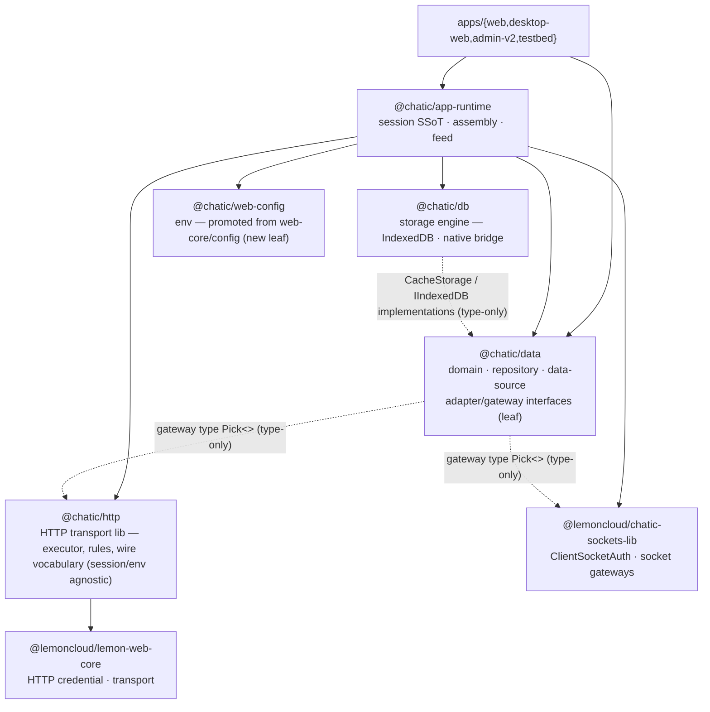
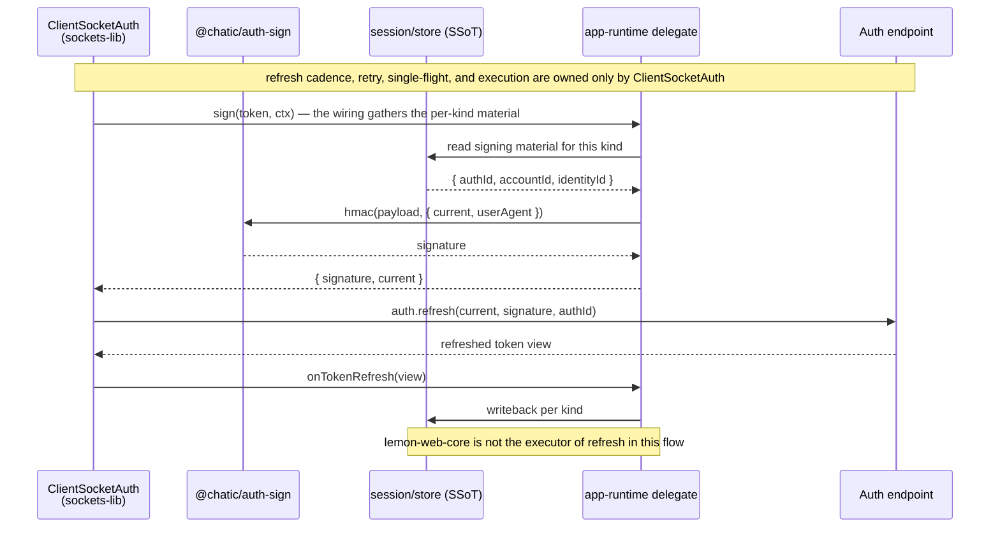
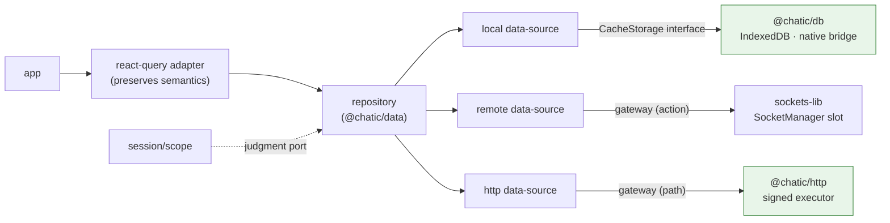

# ADR-0070: One hub, `app-runtime`, owns the session — ClientSocketAuth refresh, HTTP symmetry for `data`, and separated transport rules

> Status: Live · Decided: 2026-08-26 · Updated: 2026-09-01 · Baseline tree: develop
> · Decision 7's note that `contextOverride` cannot change the physical partition is lifted by
> [ADR-0112](./0112-the-cache-partition-is-the-one-an-operation-was-captured-for.md)
> Progress: **Phases 1-5 complete, plus review follow-through.** `@chatic/web-core`, `apps/admin`, and
> the three legacy libs are deleted.
> **Zero call sites hit the refresh endpoint directly.** Every HTTP request is a gateway action, and
> `session/auth` passes through `data`. What remains is the server contract and on-device QA — see
> §Implementation results below.
> Related: [ADR-0036](./0036-data-surface-unification-app-runtime-cleanup.md) (resolves decision 4,
> "every data call goes through a repository") · [ADR-0097](./0097-unified-logging-core-and-report-traceability.md)
> (`logger`'s platform neutrality is preserved)

> **Terminology, fixed for this document:** **Auth SDK** means `ClientSocketAuth` (`AuthController`)
> from `@lemoncloud/chatic-sockets-lib`. `@lemoncloud/lemon-web-core` is not the Auth SDK; in the
> target structure it is used only as the internal HTTP credential/transport implementation inside
> `@chatic/http`.

## Context

### One session spans two surfaces, two stores, and two refresh engines

**There are two surfaces.** Apps import the session from `@chatic/web-core` and the runtime from
`@chatic/app-runtime`.

| App         | Files importing `@chatic/web-core` | Files importing `@chatic/app-runtime` |
| ----------- | ---------------------------------- | ------------------------------------- |
| web         | 110                                | 127                                   |
| desktop-web | 47                                 | 52                                    |
| admin-v2    | 11                                 | 5                                     |
| testbed     | 9                                  | 13                                    |

`app-runtime` in turn imports downward from that session surface in 32 files (`getServerAuthRegistration`,
`signServerAuth`, `commitServerRefreshedToken`, `useGlobalSession`, ...). In other words, **half of the
session logic already lives in `app-runtime`**, the other half lives in `web-core`, and apps look at
both.

**And the same-named use case exists once on each side.** This is not a matter of taste — it is a live
defect today.

| Hook                    | `@chatic/web-core` version                   | `@chatic/app-runtime` version                          | Actual consumer                                                                                       |
| ----------------------- | -------------------------------------------- | ------------------------------------------------------ | ----------------------------------------------------------------------------------------------------- |
| `useSessionLogout`      | `logoutRelaySession()` — store teardown only | `logoutSession()` — socket `auth.logout` then teardown | web and admin-v2 use the runtime version, **desktop-web's `PlaceRail.tsx` uses the web-core version** |
| `useLogoutCloudSession` | store version                                | socket-notification version                            | web uses the runtime version, **desktop-web's `useCloudSwitchFlow.ts` uses the web-core version**     |
| `useSiteSwitch`         | store version                                | `auth.switch` packet version                           | web uses the runtime version                                                                          |

**desktop-web logs out and leaves a cloud without telling the server.** When two barrels export the
same name, a call site has no way to tell which one is "real" — collapsing them into one creates the
fix, not just cleans up the naming.

**There are two stores.**

| Store                           | Location                                               | Keys                            |
| ------------------------------- | ------------------------------------------------------ | ------------------------------- |
| App session store               | `web-core/src/session/core/{cloud,relay,identity}Core` | `chatic-*`                      |
| lemon-web-core's own repository | Inside the SDK (`WebCoreFactory.create({storage})`)    | `@<project>.*` (sessionStorage) |

The same AWS credentials and identity token are each kept by both, independently.

**There are two refresh engines.** `chatic-sockets-lib`'s `AuthController` owns expiry-based cadence,
backoff, and in-flight serialization (`app-runtime/docs/socket/auth/README.md`), and lemon-web-core's
`init()`/`isAuthenticated()` also fires its own refresh whenever the stored `expired_time` has passed —
**with no cap and no single-flight, updating only its own store.** Today this second engine is sealed
off in code.

```ts
// libs/web-core/src/transport/webTransport.ts — the comment justifying the seal (excerpt)
// lemon-web-core's own `init()`/`isAuthenticated()` fire an HTTP token refresh whenever the stored
// `expired_time` has passed — a second refresh engine with no cap/single-flight that writes ONLY
// its own store, leaving relayCore and the socket SDK's signing material stale (the signature-error
// divergence).
```

The seal (`initWebTransportSealed`) is **symptom suppression, not a design**. The root cause is not
"the SDK refreshes" — it is **"the SDK refreshes into a store nobody reads, at a time nobody
controls."** And the cost of the seal leaked out into app code: admin-v2 has **built its own hook** to
watch for credential staleness during unhealthy socket windows (laptop sleep, drops) —
`useRelaySessionGuard`, a 30-second interval plus focus-triggered read-only probe that then calls
`app-runtime`'s `requestSessionRefresh`. The refresh entry point lives in the runtime, but **the
watchdog is left for every app to reinvent** — and in fact web and desktop-web have no such guard,
so signed HTTP requests fall over with 403s in the same sleep windows.

### Alternative considered — split web-core physically into four sibling packages

We first looked at leaving web-core in place and physically splitting its internals into four sibling
packages — `web-config`/`web-transport`/`web-api`/`web-session` — while keeping `@chatic/web-core`'s
public barrel symbols unchanged. That was under the constraint (at the time) of not touching
desktop-web, only reorganizing internal boundaries into packages.

**On 2026-08-25 that constraint went away** — desktop-web changes too now.

Looked at again without that constraint, the split gives apps nothing. Apps only ever look at the
web-core barrel to begin with, and none of the new packages the split would create are consumed
directly by any app — they would all reference each other purely inside web-core. Crossing the three
boundaries (`web-session`, `web-api`, `web-transport`) would require three new ports
(`AuthApiPort`, `SessionTransportPort`, `CloudRequestCredentialSource`) plus a new `composition.ts`,
whose entire reason to exist is "keep the barrel invariant while splitting the inside" — once the
barrel-invariant constraint is gone, so is the justification.

**So this option is dropped.** The insights the physical-split investigation produced — that a cycle
could be cut, that consumer-owned `Pick<>` contracts work, that `data` should stay a leaf — carry
forward into this ADR. But instead of reassembling web-core into four siblings, this ADR
**dismantles** it. As long as the app-facing split of "session lives in web-core, data lives in
app-runtime" remains, no split is the answer.

### HTTP has none of the division of labor that sockets have

| Axis                   | Sockets                                                   | HTTP                                              |
| ---------------------- | --------------------------------------------------------- | ------------------------------------------------- |
| Interface              | `data/remote/gateways/` (12 kinds, `Pick<>`-based)        | none                                              |
| Implementation         | `data/remote/data-sources/`, 11 classes                   | none                                              |
| Connection/routing     | `app-runtime/data/factories/remoteFactory.ts`             | none                                              |
| Rules (signing, retry) | inside `chatic-sockets-lib` (knows nothing of our stores) | mixed into `web-core` transport/api               |
| Consumption path       | repository → data-source → gateway                        | **hooks bypass the repository and call directly** |

A single 280-line file, `web-core/src/api/auth.ts`, resolves endpoints, chooses signatures, retries,
and does domain mapping all at once. Six hooks (`useClouds`, 18 sites; `useCloudSessionCatalog`, 22
sites; `useRegisterDeviceToken`, 8 sites; `useVerifyEmail`, 6 sites; `useUsers`, 4 sites;
`useVerifyNativeAppToken`, 2 sites — counted by files referencing the symbol; desktop-web has its own,
separately named `useClouds` that wraps `useCloudSessionCatalog`, and is included in the tally. The
web-core-only count is smaller — see the table at
[libs/data/docs/remote/http.md](../../libs/data/docs/remote/http.md)) read data outside the
repository — this is the item ADR-0036 flagged as the **only unresolved violation** of "every data
call goes through a repository."

### Transport rules are scattered across five places, and the exceptions are enforced only by comments

| Rule                          | Current location                   | What it does                                              |
| ----------------------------- | ---------------------------------- | --------------------------------------------------------- |
| Network logging / redaction   | `web-core/transport/networkLog.ts` | `withNetworkLog`, `redactSensitive`, `truncate`           |
| Retry / backoff               | `web-core/transport/utils.ts`      | `withRetry(maxRetries = 4)`, `2^n` seconds                |
| Error classification          | `web-core/transport/error.ts`      | `shouldRetry`, `shouldLogout`                             |
| Refresh single-flight         | `web-core/session/services.ts`     | coalesces concurrent calls (one each for relay and cloud) |
| Log-upload batching / backoff | `logger/upload/uploadPolicy.ts`    | batch 50, 60s, [5s, 30s, 120s], 5 attempts — **neutral**  |
| **Deliberate bypass**         | `web-core/api/logBatch.ts`         | skips `withNetworkLog` — enforced only by a comment       |

The last row shows the shape of the problem. Logging the upload request itself means **a failure
produces a log, and that log pushes the next flush** into an infinite loop. With no owner for the
rule, there is no place to declare "this request is exempt."

### Aside: `apps/admin` is already broken on the current tree

Five files in `apps/admin` import `useWebCoreStore` from `@chatic/web-core`, but that symbol is **not
defined anywhere in the repository** (checked exhaustively — the only reference is one hit in
`libs/socket`). `admin` is not a constraint for this ADR — it is already broken.

## Decision

The target dependency graph. Apps see **two** things.



The three engines (`sockets-lib`, `@chatic/http`, `@chatic/db`) are visible to `data` **only as
interfaces** — gateways as type `Pick<>`s, and storage through the `CacheStorage`/`IIndexedDB`
interfaces owned by `data` and implemented by `@chatic/db` (decision 5). Instance wiring is done
entirely by `app-runtime`'s factories. Apps see only `data` and the runtime — engine modules exist
purely for the factories.

### 0. Shared principle — every piece of new shared code is a class and interface

Everything newly created or migrated in this rework (`session/`, `@chatic/http`, `@chatic/db`, scope,
http-data-source, factories) follows the same shape, with no exceptions. This is the full extension of
a discipline `data` already follows (details in decision 5, rules 1-4):

- **The contract is an `I*` interface**, owned by the consuming module.
- **The implementation is a class with constructor injection.** Implementation classes never leave
  their factory (the assembly point).
- **Only interfaces and domain types cross a boundary.** The existing web-core style of crossing
  boundaries with a bundle of exported functions is reconstructed into an interface plus class as it
  is migrated.

### 1. `app-runtime` is the single hub for session management

- **SSoT**: the sole store and sole writer for tokens (relay/cloud), AWS credentials, selection state
  (cid/sid/uid), identity, and device id.
- **Sole app-facing surface**: reading session state, login, logout, switching, and refresh hooks all
  come from this one barrel.
- All of `web-core/src/session` (store and services), the session/auth/app-boot hooks
  (`hooks/session`, `hooks/auth`, `hooks/app` — 25 of 32 hooks), and
  `transport/authRuntime.ts` (OAuth code exchange) are migrated here.

```
libs/app-runtime/src/
├── session/                  ← session SSoT (new, web-core session and hooks migrated in)
│   ├── store/                relay, cloud, identity tokens and selection state (from web-core/session/core)
│   ├── auth/                 login, issuance, switch, logout use cases (refresh is performed only by ClientSocketAuth)
│   ├── scope/                distinguishing selection intent from binding fact (decision 7)
│   └── hooks/                useGlobalSession, useSessionAuth, useLogin, ...
├── socket/                   SocketManager + AuthController wiring (unchanged)
├── http/                     HttpManager + rule stack + routing (new, decision 4)
├── data/factories/           localFactory (IndexedDB) + remoteFactory (socket) + httpFactory (HTTP) — the only consumers of the implementation modules (decision 5)
└── …
```

**The lost boundary is replaced by two rules.**

1. **Store passivity** — the rule that the store knows nothing of sockets, sync, or repositories is
   enforced inside `app-runtime` with an eslint `no-restricted-imports`. The rule applies to
   **`session/store/**`**: the store may not import `../socket`, `../data`, `../http`, or even its
siblings `../auth`and`../hooks`— it only stores and notifies.`session/auth/**` (use cases) is different in kind — login, refresh, and exchange are code that
   **has to hit HTTP**. But it does not import `../http` directly; boot assembly (runtime boot)
   builds `HttpManager` first and hands it a signed executor **as an argument\*\*. The folder direction
   `http → session/store` (reading credentials) already exists, so allowing a direct
   `session/auth → http` import would create a folder cycle — injection is the shape that breaks the
   cycle.
2. **Env injection** — `session/**` does not import `@chatic/web-config` directly; it reads a runtime
   config object handed to it at boot. The problem of `import.meta` breaking ts-jest
   (`module: commonjs`) **structurally disappears**. The 48 migrated session test cases
   (`services.test.ts`, 39; `contextStore.test.ts`, 9) are the gate that proves it.

### 2. `ClientSocketAuth` solely owns refresh — lemon-web-core is an internal HTTP implementation detail

In this document, the Auth SDK is `ClientSocketAuth` (`AuthController`) from
`@lemoncloud/chatic-sockets-lib`. Expiry cadence, refresh, backoff, in-flight serialization, and
reconnect re-authentication are performed **only by this SDK**. `app-runtime` wires the per-socket
`sign` callback, the initial token seed, and the `onTokenRefresh` writeback.

`@lemoncloud/lemon-web-core` is not the Auth SDK. In the target structure this package is used only as
an internal implementation of `@chatic/http`, providing the HTTP request builder, the AWS credential
runtime, and OAuth credential application. Its `init()`/`isAuthenticated()` self-refresh side effect
stays sealed, and only read-only credential reconstruction, such as `buildCredentialsByStorage()`, is
allowed.

| Responsibility                                   | Owner                                              |
| ------------------------------------------------ | -------------------------------------------------- |
| Refresh execution, cadence, retry, single-flight | `ClientSocketAuth`                                 |
| Refresh request signature lookup/computation     | separate `@chatic/auth-sign`                       |
| Cross-surface writeback of refresh results       | `app-runtime` delegate → `session/store`           |
| HTTP transport / credential runtime              | the `lemon-web-core` adapter inside `@chatic/http` |
| Direct calls to the refresh endpoint             | forbidden outside `ClientSocketAuth`               |

`ClientSocketAuth` calls `@chatic/auth-sign` through an injected `sign` callback before refreshing. The
signing module only reads the current signing material from `session/store`; it neither calls the
refresh endpoint nor stores credentials. The new token view the SDK returns is written back into
`session/store` by `app-runtime` through `onTokenRefresh`.

**Rule:** `app-runtime`, `data`, and apps do not import `lemon-web-core` directly. Only `@chatic/http`
depends on it, as an internal implementation dependency, and the refresh lifecycle is never duplicated
outside `ClientSocketAuth`.

#### Refresh ownership — enforced invariants

The following are not preferences — they are rules that must be respected in implementation, review,
and CI.

1. Only `ClientSocketAuth` may execute `auth.refresh` and the refresh endpoint. This holds for both
   relay and cloud.
2. `app-runtime`, `@chatic/http`, `@chatic/data`, and apps do not directly call or implement a refresh
   URL, refresh gateway, or refresh service. At this layer, the only allowed refresh API is the
   trigger API that delegates to `ClientSocketAuth`.
3. Any API on `lemon-web-core` that can trigger an automatic refresh — `init()`, `isAuthenticated()`,
   and the like — is not called. Even inside `@chatic/http`, automatic refresh is disabled; only
   credential reconstruction is allowed.
4. The refresh signature is computed by `@chatic/auth-sign`. `ClientSocketAuth` calls it through the
   `sign` callback, and the Signature Module makes no network calls and stores no tokens.
5. Storing the new token view is allowed only along the single path
   `ClientSocketAuth.onTokenRefresh` → `app-runtime` delegate → `session/store`. Any direct, duplicate
   writeback is forbidden.

The enforcement mechanism is **an absence check** (this changed during implementation). The original
plan was to block forbidden symbols with `no-restricted-imports`, but that rule is tied to path
strings, and it silently dies when a symbol moves — it actually did die once, and the violating file
passed lint. Now there is a test on both `app-runtime` and `libs/http` that checks **there is no
refresh-path string** at all. There is no longer even a symbol to block: the count of code hitting the
refresh endpoint in the repo is 0.

`requestSessionRefresh` remains the only trigger API, with no HTTP fallback — if there is no socket it
returns `false`, and callers recover the socket instead of working around it.

### 3. Real HTTP communication is owned by a separate module, `@chatic/http` — parallel to sockets-lib

For sockets, **all real communication is done by `chatic-sockets-lib`** — the transport
(`ClientSocketV2`), the request primitives, and even **the gateway factory that knows the wire
vocabulary** (`createUserGateway` owns the `'user'`, `'my-site'`, `'invite'` action strings and only
receives an injected client). And through all of that it knows nothing of our stores or env —
everything it needs comes in from outside. That is why the socket side is clean.

HTTP builds the same thing: **the lib owns all of communication (executor + rules + endpoint
vocabulary), and only exposes env, credentials, and signing material as injection points.**
`@lemoncloud/lemon-web-core` is used only as this module's internal HTTP credential/transport adapter,
never as an Auth SDK or refresh engine.

```
libs/http/src/
├── client.ts     request executor — uses only the injected endpoint, headers, signer
├── gateways/     domain gateway factories — own path/method/type   (the shell of web-core/api's domain files)
│   ├── oauth.ts         createOAuthHttpGateway(exec)   'POST /oauth/login-user' …
│   ├── users.ts         createUserHttpGateway(exec)
│   ├── clouds.ts        createCloudHttpGateway(exec)
│   └── subscriptions.ts createSubscriptionHttpGateway(exec)
├── sign/         AWS SigV4 HTTP wire signature       (web-core/transport/awsSigning.ts)
├── policy/       retry, backoff, timeout, single-flight, bypass
├── error/        status code / body → classification (retryable / logout required)  (web-core transport/error.ts, api/errorCause.ts)
└── log/          redact, truncate, withNetworkLog   (web-core/transport/networkLog.ts)
```

`gateways/` is the same layer as sockets' `createUserGateway`: **paths and methods like
`POST /oauth/login-user` are the wire vocabulary that corresponds to the socket's action strings**, and
that vocabulary is owned by the lib. Gateways only receive an injected executor, so they don't know
which host or which credential is going out.

The injection contract (ports). Runtime dependency on `@chatic/*` is **zero** — it knows nothing of
env, session, or logger.

```ts
export interface HttpRuntimePorts {
    resolveEndpoint(route: HttpRoute): string;
    getCredential(route: HttpRoute): AwsCredentialLike | null;
    getIdentityToken(route: HttpRoute): string | null;
    logSink?: HttpLogSink; // if absent, no logging happens
}
```

**The route does not fully determine the endpoint.** Cloud token issuance (`exchange-token`) goes to
the backend of a cloud that **has not yet been selected** — the address is given by the delegation
token and is passed by the call site per request. So a request can have an explicit `baseURL` override
independent of `route` (which only selects signing material), and `resolveEndpoint` is only the
default when no override is given. Simplifying this to "read the endpoint from the store's selection
state" would break issuance mid-switch.

- **`bypass` becomes a first-class concept.** The "logging would create an infinite loop" exception
  from `logBatch` graduates from a comment to a contract — once the rule has an owner, there is a
  place to declare "this request is exempt."
- `logger/upload/uploadPolicy.ts` is **not moved** — batching, interval, and backoff are platform
  neutral, and mobile RN shares the same policy (ADR-0097).

### 4. `app-runtime`'s `HttpManager` does the assembly — symmetric with `SocketManager`

```ts
// app-runtime/http/HttpManager.ts (sketch)
export type HttpRoute = 'relay' | 'cloud' | 'oauth' | 'iap';

// The lemon transport is **injected** — if the lib imported it, the "@chatic/* dependency = 0"
// rule would break, and since it must be a single instance, its owner has to live outside too
// (confirmed during implementation).
export const createHttpManager = (lemonSurface: LemonRequestSurface): IHttpManager => {
    const ports: HttpRuntimePorts = {
        resolveEndpoint: route => ENDPOINT_RESOLVERS[route](), // includes deep-link overrides
        getCredential: route => (route === 'cloud' ? getCloudCredential() : null),
        getIdentityToken: route => (route === 'cloud' ? getCloudIdentityToken() : null),
        logSink: networkLogSink, // logger injected
        onAuthFailure, // reaction when classification decides logout is required
    };
    return createHttpClient(lemonSurface, ports);
};
```

`httpFactory` calls `@chatic/http`'s `createUserHttpGateway(exec)` to build a gateway bundle, exactly
the way `remoteFactory` calls the SDK's `createUserGateway(client)`, and constructor-injects it into
`data`'s http-data-source. **All `app-runtime` decides is the materials** — which host
(`resolveEndpoint`), which credential (the store), which signing provider. The lib knows how to
communicate.

The lemon HMAC computation needed for refresh and socket-auth signatures is owned by a separate
`@chatic/auth-sign`. This package is a platform-agnostic leaf that `ClientSocketAuth` and the HTTP
layer can both share, and it knows neither the endpoint nor the store. AWS SigV4, being specific to
HTTP wire requests, stays in `@chatic/http/sign`. This is what keeps `chatic-sockets-lib` from ending
up depending on `@chatic/http` and creating a cycle.

| Axis                          | Sockets                                        | HTTP                                         |
| ----------------------------- | ---------------------------------------------- | -------------------------------------------- |
| Transport / primitives        | `chatic-sockets-lib` (`ClientSocketV2`)        | `@chatic/http` (`client.ts`)                 |
| Wire vocabulary               | sockets-lib gateway factories (action strings) | `@chatic/http/gateways` (path/method)        |
| Manager (injection decisions) | `SocketManager` (relay/cloud slots)            | `HttpManager` (relay/cloud/oauth/iap routes) |
| Assembly                      | `remoteFactory`                                | `httpFactory`                                |
| Selection                     | caller specifies `SocketRoute`                 | caller specifies `HttpRoute`                 |
| What the lib does not know    | our stores, env, wss address                   | our stores, env, baseURL, credentials        |

### 5. Only the engines move out — `data` becomes a pure, platform-agnostic data module, storage engines move to `@chatic/db`

**Fix `data`'s target character first: a pure data module that depends on no runtime or platform.** It
owns only domain types, mapping, repositories, data-sources, and (gateway/storage) adapter interfaces;
the runtime code that actually implements those interfaces — IndexedDB, native bridges, the socket
SDK, the HTTP client — all lives outside it. Web and RN should be able to use the same `data`
unchanged, and this cut is what earns that.

The cut line is **between the engine and everything else**. `data`'s local data-source classes already
know nothing of the engine — an exhaustive grep shows the only things they take from storages are
`type CacheStorage` (an interface) and `stableHash` (a util) — and the engine implementations
(IndexedDBAdapter, NativeDBAdapter, IndexedDBDatabase, ChatQueryExecutor) are touched only by
`app-runtime`'s `localFactory`. In other words, **exactly the same picture** that sockets and HTTP
have already exists on the storage axis too — only there, the engine still cohabits inside `data`. Take
it out.

```
libs/data/src/                        ← @chatic/data — kept: domain + data-source + adapter interfaces
├── domain/                           DomainUser · toDomainUser … (existing)
├── local/
│   ├── ports/                        CacheStorage · IIndexedDB · IGlobalCacheSearchSource (adapter interfaces)
│   └── data-sources/              9 *LocalDataSource classes — see only the CacheStorage interface (existing)
├── remote/
│   ├── gateways/                     RemoteGatewayBundle ‖ HttpGatewayBundle (lib type Pick<>)
│   ├── data-sources/                 11 socket implementation classes (existing)
│   └── http-data-sources/            Auth · User · Cloud · Subscription ← new
│           e.g. class UserHttpDataSource implements IUserHttpDataSource {
│                   constructor(private readonly gateway: UserHttpGateway) {}
│               }
└── repositories/                  13 Repository classes (existing)

libs/db/src/                          ← new — storage engine (implements CacheStorage / IIndexedDB)
├── indexeddb/                        IndexedDBAdapter · IndexedDBDatabase · ChatQueryExecutor
├── native/                           NativeDBAdapter (bridge) · nativeCacheMetrics
└── search/                           IndexedDbGlobalSearchSource · NativeGlobalSearchSource
```

This lets all three axes be described in one sentence — **the engine is the lib, the interface and
data-source are `data`, and the wiring is `app-runtime`**:

| Axis    | Engine (real IO)                 | What `data` has                                 | Wiring          |
| ------- | -------------------------------- | ----------------------------------------------- | --------------- |
| Sockets | `chatic-sockets-lib` (external)  | gateway `Pick<>` + remote data-source           | `remoteFactory` |
| HTTP    | `@chatic/http` (decision 3, new) | gateway `Pick<>` + http-data-source             | `httpFactory`   |
| Storage | `@chatic/db` (new)               | `CacheStorage`/`IIndexedDB` + local data-source | `localFactory`  |

Dependency direction: `@chatic/db → @chatic/data` (interfaces, type-only) + `bridges` (native). `data`
has no runtime dependency on any of the three engines — it knows gateways only as type `Pick<>`s, and
storage only through interfaces it owns itself. **`data`'s dependency on `bridges` leaving with the
engine, into `@chatic/db`**, is a side benefit of this cut too (the main consumers being
NativeDBAdapter and NativeGlobalSearchSource).

The evidence that this cut is invisible to apps is empirical: there is exactly **1** app import of an
engine symbol — apps/web's debug overlay (`CacheMetricsScreen.tsx`) directly uses
`getNativeCacheMetrics`/`resetNativeCacheMetrics`. This too goes behind an interface: `data/local/ports`
declares an **`ICacheMetricsSource`** (read/reset), `@chatic/db/native` implements it, and
`localFactory` wires them — the debug screen only sees the port. Every other consumer is `localFactory`,
so switching the factory's import to `@chatic/db` is the whole job.

**Class/interface discipline** — new code (http-data-source, gateway, scope port) follows the existing
discipline too:

1. **The adapter interface belongs to `data`; the engine class belongs to the engine module.**
   `CacheStorage` and `IIndexedDB` are contracts the data-source consumes, so they stay on the
   consumer's side (`data/local/ports`), while `IndexedDBAdapter` lives in `@chatic/db` as one
   implementation of them — even if RN plugs in a different engine, `data` doesn't know.
2. **Only interfaces and domain types cross the boundary.** Repository/data-source constructors take
   only `I*` types, and engine classes never leave their factory.
3. **Shared mechanics go in a Base abstract class; the contract goes in an interface.** The existing
   division between `BaseRepository` (dispose, context) and `IUserRepository` (the call surface) —
   Base is implementation convenience, not the contract, and consumers always hold the interface.
4. **Gateways are consumer-owned `Pick<>`s.** `data` declares only the actions and paths it uses out of
   the lib's gateway type — keeping the whole lib surface from flowing in, the same pattern `data`
   already uses for socket gateways.

The three REST domain files under `web-core/src/api` (`auth.ts`, `users.ts`, `subscriptions.ts`)
**split in two** — path/method/request shape (the wire vocabulary) goes to `@chatic/http/gateways`
factories (decision 3), and domain mapping / cache semantics go to `data/remote/http-data-sources`.
Same division as the socket side: `data` doesn't know HTTP paths any more than it knows socket action
strings. The six hooks move behind repositories.

> This decision **can be finished first and moved later**: build the interface, implementation, and
> `httpFactory` all up front (no app changes), and move the hook consumers separately in phase 4.

**We should state up front that read semantics change too.** The six REST hooks currently sit on
react-query (staleTime, dedup, invalidate, refetch-on-focus). `data` has **zero** react-query — the
repository cache is a different model based on socket sync. Phase 4 has to pick one of two:
① keep a react-query adapter at the app level, using the repository purely as a data source
(preserving semantics), or ② unify on the repository's read model (accepting refetch behavior changes
across 54 consumers). **The default is ①** — this ADR moves structure, not caching behavior. ② is
handled as a separate decision.

**In fact we went with ②, and the hooks moved down into the app layer instead.** Phase 4 landed on ①
initially — `app-runtime/src/data/hooks/*` calling `http/gateways` directly. But counting consumers per
app showed that, of 13 symbols, only the four catalog-family ones were used by more than one app; the
rest were single-app screen-only. Those hooks had no reason to live on a shared runtime surface —
react-query already **is** the entire read cache, and caching policy belongs to the app drawing the
screen. So 12 symbols moved down to their apps and now go through the repository.

The actual cost of ② was small: repositories return `DomainListResult<T>` (`{list, meta}`), while the
gateway view returned `{list, total}`. Only two places broke (`UsersPage` and `CloudManagePage` reading
`total`), and since `DomainCloud`/`DomainUser` is a superset of the view, field reads elsewhere were
unchanged. What's left is `useRegisterDeviceTokenMutation` (called by the runtime itself) and
`cloudsKeys` (invalidated by `useLogin`) — the full batch is recorded in the completion notes of the
migration SPEC (a plan document that lived in the root docs tree, which has since been removed).

### 6. Package cleanup

| Package                           | Verdict                                                          | Rationale                                                                                                                                                                                                                                                                                                    |
| --------------------------------- | ---------------------------------------------------------------- | ------------------------------------------------------------------------------------------------------------------------------------------------------------------------------------------------------------------------------------------------------------------------------------------------------------ |
| `web-core`                        | **Dismantled → shim → deleted**                                  | session → `app-runtime/session`; transport/api rules → `@chatic/http`; REST domains → `http/gateways` + `data`; report transport → `app-runtime/http`; config → promoted to `web-config`                                                                                                                     |
| `@chatic/web-config`              | **New (leaf)**                                                   | promoted from `web-core/src/config` — isolates env and `import.meta`                                                                                                                                                                                                                                         |
| `data`                            | **Kept (leaf, platform-agnostic, pure data)** — engines expelled | keeps domain/repository/data-source/adapter/gateway interfaces; zero runtime implementations remain (decision 5)                                                                                                                                                                                             |
| `libs/{auth,users,subscriptions}` | **Deleted**                                                      | thin REST wrappers used only by admin and desktop-web; consumers absorb them                                                                                                                                                                                                                                 |
| `libs/socket`                     | **Deleted — but tied to admin**                                  | already broken, referencing the nonexistent `useWebCoreStore`. But it is not "zero consumers": `apps/admin` has 10 files importing `@chatic/socket` (confirmed). Admin itself is broken by the same ghost symbol, so it has no real consumer — so its deletion is **tied to open question 3 (admin's fate)** |
| `@chatic/http`                    | **New**                                                          | decision 3 — the real HTTP request area (executor, rules, wire vocabulary)                                                                                                                                                                                                                                   |
| `@chatic/db`                      | **New**                                                          | decision 5 — the IndexedDB engine plus native DB bridge; consumed only by `localFactory`                                                                                                                                                                                                                     |
| `@chatic/auth-sign`               | **New (leaf)**                                                   | decision 2 — auth refresh/socket signature computation shared by `ClientSocketAuth` and HTTP; agnostic of endpoint, store, and refresh execution                                                                                                                                                             |

`logger`, `bridges`, `shared`, `theme`, `ui-kit`, `app-messages`, and similar packages are **not** in
scope for this ADR — they are untouched.

### 7. One owner for scope — `ActiveScope` under `session/scope`

Scope (which cloud/site/user context is currently active) is scattered across **four fragments** today:

| Fragment           | Where                                           | What                                                                                              |
| ------------------ | ----------------------------------------------- | ------------------------------------------------------------------------------------------------- |
| Intent computation | `useRuntimeBinding`                             | derives `{cid, sid, uid}` from the session → `DataManager.ensure`                                 |
| Intent storage     | `DataContextHolder` (`data`)                    | a plain holder — no computation, no judgment                                                      |
| Fact synthesis     | `DataManager`'s anonymous `socketAwareProvider` | splices `getBoundCid()` into the context on the fly                                               |
| Judgment           | 4 inline call sites                             | 3 files in `data` (one with a negated check), `SyncManager.isCidActive`, `plans.dropForeignFrame` |

The receiving port is **already one thing** — `data`'s `DataContextProvider`. Only the supplying side is
fragmented. So the shape of the unification is not a new port — it's **collecting the existing port's
implementers into one place**:

```
session/scope/
├── ActiveScope.ts    the single owner — subscribes to the store (intent) and observes SocketManager (fact)
│                     · implements DataContextProvider  ← data's existing port, replacing the glue of
│                       DataContextHolder + socketAwareProvider
│                     · HttpManager's credential selection (route → whose credential) reads this view too
└── (judgment functions do not live here) — isCidActive and isForeignContext are owned by `@chatic/data`.
                      4 of the 6 judgment call sites live inside the `data` leaf, so putting them in
                      app-runtime makes the unification itself impossible (confirmed during
                      implementation). scope is a consumer of those pure functions.
```

**What gets unified is the owner, not the values.** Scope has three named views, and their being
different is the whole point of optimistic switching — merging them brings back the
cross-cloud-contamination bug:

| View        | Value                                | Consumer                                                  |
| ----------- | ------------------------------------ | --------------------------------------------------------- |
| `intent`    | `selectedCloudId` (the store)        | cache partitioning — optimistically flips first on switch |
| `bound`     | `boundCid` (SDK-observed value)      | frame-drop / write guards — frozen at bind time           |
| `committed` | the cid of the committed cloud token | socket slot config / cloud credential selection           |

`boundCid` is an **observed value** resulting from SDK-controlled behavior, and `ActiveScope` never
changes it arbitrarily. The per-call `contextOverride` at the consuming side (local data-source)
remains as-is — it stays a per-request hint, not a means of changing the physical partition, the same
limitation it already had.

### 8. A migration shim avoids a big bang

In phase 3, `@chatic/web-core` is left in place as a **re-export-only shim**.

- All new implementation lives in `app-runtime`, and the shim is nothing but
  `export { … } from '@chatic/app-runtime'`.
- The import replacement across the apps' 177 files (web 110, desktop-web 47, admin-v2 11, testbed 9)
  proceeds **file by file, reversibly**.
- **Adding a new symbol to the shim is forbidden.** Once it has zero consumers, it is deleted
  (phase 5).

## Target structure

Decisions 1-8 combined into one picture. Each decision's own section carries the rationale — this is
just the finished shape.

### Directory structure

```
libs/app-runtime/src/                  ← the one runtime hub
├── session/                             session SSoT (decisions 1, 2, 7)
│   ├── store/      relay/cloud/identity tokens and selection (cid/sid/uid)   [sole writer, passivity via eslint]
│   ├── auth/       login, issuance, switch, logout                          [refresh performed only by ClientSocketAuth]
│   ├── scope/      ActiveScope — intent/bound/committed views + judgment    [implements DataContextProvider]
│   └── hooks/      useGlobalSession, useLogin, useSiteSwitch, …             [same-named hooks merged — the socket-notifying version wins]
├── socket/         SocketManager + AuthController wiring                     [unchanged]
├── http/           HttpManager (relay|cloud|oauth|iap) + report/            [decisions 4, 6]
├── data/factories/ localFactory ‖ remoteFactory ‖ httpFactory               [the only consumers of the engine modules]
└── push/ · runtime/ · connection/                                            [existing]

libs/data/src/                         ← kept (leaf): domain + data-source + adapter interfaces (decision 5)
├── domain/                              DomainUser · toDomainUser …
├── local/
│   ├── ports/                           CacheStorage · IIndexedDB · IGlobalCacheSearchSource
│   └── data-sources/                 9 *LocalDataSource classes — see only the interface
├── remote/
│   ├── gateways/                        RemoteGatewayBundle ‖ HttpGatewayBundle (lib type Pick<>)
│   ├── data-sources/                    11 socket implementation classes
│   └── http-data-sources/               Auth · User · Cloud · Subscription ← new
└── repositories/                     13 Repositories — constructor-injected with I* types

libs/db/src/                           ← new: storage engine (implements data's interfaces, decision 5)
├── indexeddb/                           IndexedDBAdapter · IndexedDBDatabase · ChatQueryExecutor
├── native/                              NativeDBAdapter (bridge) · nativeCacheMetrics (implements ICacheMetricsSource)
└── search/                              IndexedDbGlobalSearchSource · NativeGlobalSearchSource

libs/http/src/                         ← new: HTTP transport (zero runtime dependency on @chatic/*, decision 3)
├── client.ts                            executor — uses only the injected endpoint, creds, signer
├── adapters/lemonWebCore.ts              lemon-web-core HTTP credential/transport adapter
├── gateways/                            oauth · users · clouds · subscriptions  [owns path/method]
├── sign/ · policy/ · error/ · log/      SigV4 · retry/bypass · classification · redaction

libs/auth-sign/src/                    ← new leaf: auth refresh/socket signature (decision 2)
└── hmac/                               lemon HMAC computation — agnostic of endpoint, store, refresh execution
```

### Session — one store, one owner of the trigger (decision 2)



### Data — the repository is the only surface, the three engine siblings sit behind interfaces (decisions 3, 4, 5)



All three engine instances are built and constructor-injected by `app-runtime`'s factories — neither
the engine nor `data` knows which host, credential, or partition is involved.

## Phasing

| Phase    | Content                                                                                                                                                                                                                                                                                                                                                               | App changes         | Risk   |
| -------- | --------------------------------------------------------------------------------------------------------------------------------------------------------------------------------------------------------------------------------------------------------------------------------------------------------------------------------------------------------------------- | ------------------- | ------ |
| **1** ✅ | Decisions 3, 4 — create `libs/http` (migrate the lemon adapter, HTTP requests, SigV4, logging, retry, error, bypass) + `HttpManager`                                                                                                                                                                                                                                  | none                | low    |
| **2** ✅ | Decision 5 — split out `@chatic/db` (expel the storage engine) + `HttpGatewayBundle` + `http-data-sources/` + `httpFactory`                                                                                                                                                                                                                                           | none (factory only) | low    |
| **3** ✅ | Decisions 1, 2, 7 — unify `session/`, wire `ClientSocketAuth` sign/writeback, create `@chatic/auth-sign`, migrate hooks, `ActiveScope`, publish the shim. **One extra prerequisite emerged: create `@chatic/web-config` first** — since the dependency inversion is atomic, env has to become a leaf before the session migration can hold together (open question 4) | none (shim)         | medium |
| **4** ✅ | Decision 8 — move imports across the apps' 177 files; move the 6 REST hooks behind repositories                                                                                                                                                                                                                                                                       | file by file        | medium |
| **5** ✅ | Decision 6 — delete the shim (`web-core`) and the 3 legacy libs (`auth`, `users`, `subscriptions`); **explicit boot switchover**; resolve admin                                                                                                                                                                                                                       | app entry points    | low    |

Phases 1-2 close real defects (the REST bypass of repositories, scattered rules) without touching apps.
Phase 3 removes the doubled store and the seal. **Phase 4 doesn't need to finish in one shot, thanks to
the shim** — it is not a big-bang cutover, it proceeds file by file and can stop at any point.

**Boot goes from implicit to explicit.** Session boot today is an import side effect —
`startWebTransportInit()` self-invokes when the `web-core/src/transport/webTransport.ts` module loads
(`webTransport.ts:227`). During phases 3-4, the shim keeps the same side effect so apps aren't the
wiser, and **phase 5 switches each app entry point over to explicitly calling `initAppRuntime(config)`**
(that's the "app entry points" change in the table above). At switchover time, check per app that this
doesn't break the existing initialization-order contract in that app's entry (main.tsx) — specifically,
that logging and bridge initialization still happen before session boot.

**Baseline measurement is not a gate blocking the start (re-decided 2026-08-31).** It's true that this
rework's claimed effect ("the class of signature-403 disappears") can't be verified without
measurement, but "instrument first" was written on the premise that nothing existed yet, and that
premise turned out to be false — the unified-logging track (ADR-0097, 0063, 0066) had already laid down
the collection groundwork. **The 403 rate is already fully collected** (every HTTP failure is already
logged at error level along with its status — it's just a matter of querying). The only thing that was
silent was **the socket-path refresh firing**, and that was closed with one `logger.info` line.
Involuntary re-login is already approximated by an existing warn in `sessionDelegate`. What's left to
confirm is whether the three metrics are actually queryable server-side — server-side aggregation is
outside this repo.

## Implementation results (2026-08-31)

Phases through 5 are done. The measured final state:

| Prediction                               | Actual                                                                                                                                                                                                   |
| ---------------------------------------- | -------------------------------------------------------------------------------------------------------------------------------------------------------------------------------------------------------- |
| libs 17 → 16                             | **16** (`app-messages`, `app-runtime`, `auth-sign`, `bridges`, `data`, `db`, `device-utils`, `http`, `i18n-mobile`, `logger`, `policy-content`, `shared`, `theme`, `ui-kit`, `web-config`, `web-ui-kit`) |
| Apps only see `app-runtime` + `data`     | **Confirmed** — apps' data/session imports are `@chatic/app-runtime` (404) and `@chatic/data` (166); everything else is UI-kit, bridges, logger, etc., outside this ADR's scope                          |
| `web-core` dismantle → shim → delete     | **Deleted.** The package was removed after app imports of web-core reached 0                                                                                                                             |
| Delete the 3 legacy libs + `libs/socket` | **Done** (resolved together with deleting `apps/admin`, open question 3)                                                                                                                                 |

**The explicit-boot switchover landed differently than promised.** Phase 5 was described as "each app
entry explicitly calls `initAppRuntime(config)`," but as the boot side effect converged into a single
transport module inside `@chatic/web-config`, apps reach it through `app-runtime`. The "import side
effect" nature stays; only its location moved, from `web-core/transport/webTransport.ts` to a leaf.
Lifting the call site up into each app's entry remains a separate piece of work — the original caution,
that each app's `main.tsx` initialization-order contract (logging and bridges before session boot) needs
checking at that point, still holds.

> **2026-09-02: the trigger API narrowed to relay only.** The body's `requestSessionRefresh(kind)`
> became `requestRelaySessionRefresh()`. The `'cloud'` value of `kind` had zero call sites, and was
> conceptually wrong to begin with — cloud tokens are **reissued** from the relay identity (see the
> asymmetry table in decision 2), not something to fix via refresh. The policy is unchanged; the name
> now says the policy.

> **2026-09-02: that separate piece of work got done.**
> [`initAppRuntime(config)`](../../libs/app-runtime/src/init.ts) now exists, and all four apps (`web`,
> `desktop-web`, `admin-v2`, `testbed`) call it in their entry point before render. Two side effects
> (`session/store` barrel's `configureSessionStore()`, and `connection` barrel's
> `configureCredentialRecovery()`) were removed, and `configureDataRuntime` dropped out of the public
> surface, absorbed into `initAppRuntime({ data })` — one boot call instead of a set of configure-\*
> calls whose order apps had to remember. The order contract is now enforced in code: if no resolver is
> set, `relayStore` throws instead of guessing, and the error names `initAppRuntime()`
> (`init.test.ts` pins that failure). Verified with a browser boot rather than a real device — guest
> login, the socket handshake, and relay HTTP all worked normally.

### Review follow-through (2026-09-01)

Re-reading against the three principles went further than promised.

**Call sites hitting the refresh endpoint went to zero.** Reading invariants 1 and 2 as "leave only the
legitimate call sites" and auditing exhaustively left nothing to keep — of six paths, three already had
zero runtime call sites (they existed only on the public surface), the entire cloud chain was being kept
alive by one vestigial line in testbed, and the login-hydration call wasn't refreshing at all — it was
**trying to recover a response field that had been discarded.** Once the exchange response stopped being
discarded, the need disappeared. The guard is not a path pattern but **an absence check**
(`refreshAbsence.test.ts`).

**Every HTTP request is now a gateway action, and `session/auth` passes through `data`.** The three
places where the session module built requests directly (refresh plus two kinds of OAuth exchange) are
gone, and the only code that knows about gateway instances is inside `data/`. The rule excluding
token-generating actions from `data` was retired — `AuthRepository.confirmPhoneCode` was already
returning `$token` and following "perform, but don't interpret," and there was no reason for the HTTP
lane to follow a different rule (decision 5 amended).

**One naming layer was removed.** The calls migrated in during phases 4-5 had grown a thin layer in
front of them — `session/auth/api.ts` and `data/hooks/api.ts` — and most of their 21 exports were pure
forwarding to a single consumer. That runs straight into decision 0's "don't cross a boundary with a
bundle of functions," and it also meant paying to keep two names for the same action. Cleaned up into
three pieces:

- `data/hooks/api.ts` is deleted. Three hook files now call `http/gateways` directly, and
  `tryFetchProfile` (the one with real logic, a null contract) moved to the same-domain `hooks/user.ts`.
- The six session-material commands in `session/auth/api.ts` had only one consumer, `services.ts`, so
  they moved down into that file (via an `authRepository()` accessor). `services.test.ts` (this ADR's
  gate) now mocks `data/runtime` and verifies **the repository's actual argument shape** — since the
  adapter that used to translate names is gone, that shape is the real boundary. All 42 cases still
  pass.
- The remaining 6 were renamed to `authActions.ts`. This is not a naming layer — it's an adapter:
  `registerUserWithInviteCode` and `fetchInviteInfoWithCode` are exported from the barrel and called by
  3 apps with positional arguments, while the repository takes an object. Keeping that translation in
  one place is its entire reason to exist.

`app-runtime`'s 439 tests and its type check still pass, and not a single public barrel symbol changed.

**The next question moved the folder itself.** Asked whether `data/hooks` belonged where it was, the
first answer was "four apps share it" — but that was just a symbol-name grep. Counting only what
`@chatic/app-runtime` actually imports, the symbols used by two or more apps are just the four
catalog-family ones (`useClouds`, `useCloudSessionCatalog`, `useDeleteCloud`, `cloudsKeys`); the
`useMembershipInfo` family is web-only, `useUsers` and `tryFetchProfile` are admin-v2-only, and
`productPlansKeys`/`usersKeys` have zero app consumers. And a second objection — "then apps would see
the gateway" — was also wrong: repository paths already existed for all of them (`fetchCloudCatalog`,
`fetchMembershipInfo`, `listRelayUsers`, `tryFetchProfile`).

So 12 of the 13 symbols moved down into their apps (see decision 5's ② items). Three things surfaced as
a side effect:

- **A missing `params`.** `ICloudRepository.makeCloud`/`releaseCloud` didn't accept the gateway's
  `params`, so moving the call as-is would silently drop the dev dry-run (`dryRun: 1`) and delete's
  `cascade: 1`. These were passed through as named options, and the wire's `1` encoding stayed in
  `data`.
- **`tryFetchProfile`'s right home was the original call site.** `libs/data` had already documented this
  — `UserHttpDataSource` says "errors bubble … no swallow-and-null here either," and `libs/http` says
  "null behavior is a caller concern." Null-vs-throw is screen policy, and that screen is one gate in
  admin-v2.
- **The three catalog copies are intentional duplication.** What's shared is the repository call and
  `cloudsKeys`; staleness policy is free to diverge per app. desktop-web already had this shape —
  `shared/hooks/useClouds.ts` composes its own rail view on top of the catalog.

Verified: `app-runtime` 439, `data` 338, `http` 72, apps/web 2189, admin-v2 119 all pass, and web,
admin-v2, and testbed type checks are all clean. desktop-web keeps its 17 pre-existing type-check debt
items (jest can't run in this worktree due to a pre-existing setup problem).

**`http/` was finally able to have a barrel.** Pulling the cloud credential out into a port cut the knot
where `session`, `data`, and `http` were pointing at each other. There is exactly one file where http
knows about session — a composition root.

Along the way, two regressions turned up — both side effects of phase 3 switching the signature source
from the lemon repository to `relayStore`, missed together only because they entered from different
places. Social login was fixed (the exchange now leaves the issued token in the session store).
desktop-web's `/auth/token/:token` turned out, on inspection, to have **no code in the repo that ever
built that URL** — it was scaffolding copied over from apps/web's structure at the desktop client's
first commit, and apps/web never actually had that route either (only a trace in a doc). Deleted.

**What remains** (detail in each document):

- **Whether the exchange response carries `$auth.id`** — without it the relay socket can't register.
  The code logs a warning, so one real login confirms it.
- **desktop-web on-device confirmation** — merging the same-named hooks means logout and leaving a
  cloud now notify the socket. The QA bar is not "same as before" — it's the list of intended behavior
  changes.

## Alternatives

- **Physically split web-core into four sibling packages first** — this would bring in three
  boundaries with zero app consumers (three ports plus `composition.ts`), only to have this ADR undo
  half of it — double churn. With the barrel-invariant constraint gone, nothing justifies those
  boundaries any more (see Context). **Dropped.**
- **Keep the session store as a separate package and make `app-runtime` only the hub** — the hub
  becomes one, but unifying the store (decision 2) then becomes a cross-package writeback again, and
  it becomes ambiguous whether the SDK's Storage adapter lives in the session package or the runtime.
  Passivity can be enforced with eslint instead of a package boundary (decision 1). **Dropped.**
- **Keep lemon-web-core as the owner of refresh** — this creates a second refresh engine alongside
  `ClientSocketAuth`, and the race over signing material comes back. lemon's `init()`/
  `isAuthenticated()` auto-refresh stays sealed, and only `ClientSocketAuth` owns refresh. **Dropped.**
- **Put HTTP rules in an `app-runtime/transport-policy/` folder** — inside the same package, rule code
  can see the session store and `web-config`, and over time it will. For the same reason socket rules
  know nothing of our stores, this needs to be a **separate module**. **Dropped.**
- **Merge `web-core/api` wholesale into `data`** — `data` would gain session and transport dependencies
  and lose its status as a leaf. Decisions 3, 4, and 5's division of labor achieves the same goal while
  keeping it a leaf. **Dropped.**
- **Big-bang cutover with no shim** — moving 177 files at once, with no way back. Stopping halfway
  leaves two entry points coexisting. **Dropped** (decision 8).
- **Move `logger/upload/uploadPolicy.ts` into `@chatic/http`** — batching and backoff are platform
  neutral and shared with mobile RN. Mixing it with web signing and web logging breaks that
  neutrality. **Dropped** (ADR-0097).

## Consequences

**What is gained**

- Apps see only `app-runtime` and `data`. Session has one surface, one SSoT, one owner of the trigger.
- **`ClientSocketAuth` solely owns refresh.** `lemon-web-core`'s second automatic refresh stays sealed,
  and refresh results flow one way: `onTokenRefresh` → `app-runtime` → `session/store`. The structural
  cause of the signature-mismatch class of bugs (socket authenticated, signed HTTP getting a 403) is
  reduced.
- Socket/HTTP symmetry → the repository becomes the only data-access surface (resolves ADR-0036
  decision 4).
- Transport rules gain an owner, and **exceptions graduate from comments to contracts** (`bypass`).
- **The three engine siblings are described by the same sentence** (decision 5) — sockets, HTTP, and
  storage are all "the engine is the lib, the interface and data-source are `data`, the wiring is the
  factory." `data` losing its `bridges` dependency along with the engines makes **`data` a pure,
  platform-agnostic data module with zero runtime dependencies** — mobile RN can plug in a different
  storage engine and `data` doesn't change.
- 5 deletions (`web-core` plus the legacy `auth`/`users`/`subscriptions` plus the dead `libs/socket`)
  and 4 additions (`@chatic/http`, `@chatic/db`, `@chatic/web-config`, `@chatic/auth-sign`) —
  libs go from 17 to 16. Each remaining boundary has something enforcing it.

**What is accepted**

- **`app-runtime` grows.** Session, sockets, HTTP, and assembly all sit in one package, so the internal
  folder rules (decision 1's eslint) are the only wall. Without the rule, the store starts calling
  sockets.
- **desktop-web changes** — 47 files in `web-core` plus 52 in `app-runtime`. It had been under a
  long-standing no-touch rule, so the regression-checking cost is high. And **some of this is not
  regression but intended behavior change**: merging the same-named hooks (see Context) turns
  desktop-web's logout and cloud-leave from "just clear the store" into "notify the socket, then
  clear." The QA bar should be the **list of intended behavior changes**, not "same as before," and
  this list gets fixed at the start of phase 4.
- **The contract between the Signature Module and `ClientSocketAuth` is a new risk.** If the per-kind
  authId, current, or credential field ever mismatches, refresh still executes but the server's
  signature check fails. Relay and cloud signature fixtures, plus the `onTokenRefresh` writeback, are
  the top-priority tests for phase 3.
- `lemon-web-core`'s own storage keys (`@<project>.*`) remain a compatibility target inside the HTTP
  credential runtime. This does not promote them to Auth SDK storage; the `@chatic/http` adapter is
  responsible for reading the old keys and dual-writing. Removing them is left for a later release.
- **Physically moving a lib hits the stale `dist`/`out-tsc` trap** — in this repo, physically moving a
  lib makes downstream type checks throw phantom errors against old symbols (confirmed before). Force
  deleting `dist/`/`out-tsc/` and rebuilding is part of the procedure at the start of phase 2
  (splitting out `@chatic/db`) and phase 3.
- `apps/admin` remains unresolved even after this ADR (a decision left for phase 5).

**Verification (measured for phases 1-3)**

At the time of writing, the worktree had no `node_modules`, so nothing could be run and there was no
regression verification at all. Now that phases 1-3 are implemented, the baseline is (2026-08-31,
re-run after each commit):

| Package                   | Tests |
| ------------------------- | ----- |
| `@chatic/app-runtime`     | 351   |
| `@chatic/data`            | 338   |
| `@chatic/web-core` (shim) | 113   |
| `@chatic/db`              | 103   |
| `@chatic/http`            | 64    |
| `@chatic/auth-sign`       | 12    |
| `apps/web`                | 2195  |

`tsc -b` is clean across 8 packages, ESLint is 0 errors on every package. Session tests moved with no
loss — web-core went 189 → 113, app-runtime 254 → 330 (right after migration), and the difference
exactly cancels out.

**Apps are unchanged.** Since `@chatic/web-core`'s public barrel symbols are unchanged (the re-export
shim), moving app imports is deferred to phase 4.

The following are additionally enforced as CI gates:

- Checks that the refresh-endpoint string, and the refresh gateway's only runtime consumer, resolve to
  the `ClientSocketAuth` path
- ESLint checks that `app-runtime`, `data`, `http`, and the apps import no forbidden refresh symbol
- A test that `lemon-web-core.init()`/`isAuthenticated()` are never called through a path that would
  trigger refresh
- A test that both relay and cloud follow the single path
  `sign → auth.refresh → onTokenRefresh → session/store writeback`
- A test that concurrent refresh requests execute only once, via `ClientSocketAuth`'s internal
  single-flight

## Open questions

1. **`@chatic/http`'s name and extraction timing** — currently an in-repo lib. Whether to extract it as
   a package such as `@lemoncloud/chatic-https-lib` once stable, or keep it in-repo indefinitely.
2. ~~**Refresh on paths without a socket**~~ — **Closed (2026-08-31).** Decision: **refresh always goes
   through `ClientSocketAuth`.** `requestSessionRefresh`'s HTTP fallback was removed; with no socket, it
   reports failure instead of working around it (done in phase 3).

    **Login hydration closed too (2026-09-01).** The assumption that "we need to confirm with the
    server whether the exchange response includes a user view" was wrong —
    `createCredentialsByProvider` was only keeping `Token` from the response and **discarding the
    rest.** The other three login paths all pass the response straight to `applyRelaySession`; only the
    OAuth exchange was the exception, and it called refresh to recover the fields it had thrown away.
    Making it match the other shape removed the need for the call. Now the count of code that calls the
    refresh endpoint in the repo is **0**.

3. ~~**`apps/admin`**~~ — **Closed: deleted.** Only `UsersPage` moved to admin-v2, and the package was
   removed (the token-issuance action was not ported, since it used hardcoded credentials).
4. ~~**`web-config`**~~ — **Closed (2026-08-31): creating a new leaf is the only option.** Absorbing it
   doesn't work — `web-core` also reads env (confirmed in 5 places), so absorbing it would create a
   `web-core → app-runtime` direction, and since `app-runtime` already has a project reference to
   `web-core`, that's a cycle and `tsc -b` breaks. Only a leaf both sides can depend on works, which is
   why this was **the first piece of phase 3** (moving only the session wouldn't complete the
   dependency inversion — the 4 symbols left behind are env and transport).
5. **`@chatic/auth-sign`'s extraction timing** — for now it stays in-repo as a platform-agnostic leaf
   shared by `ClientSocketAuth` and the HTTP layer; whether to extract it as an external package is
   decided once it stabilizes.
