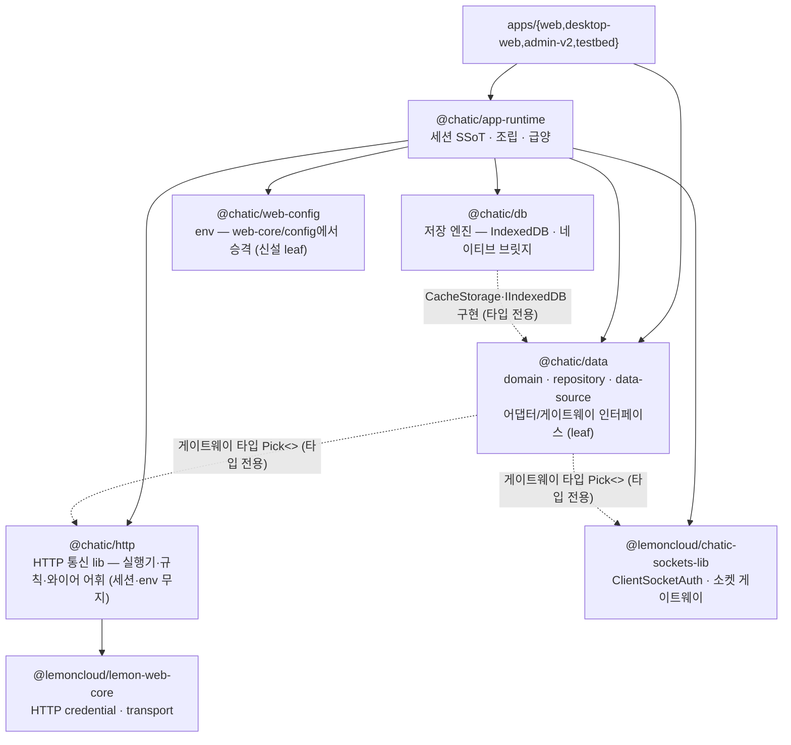
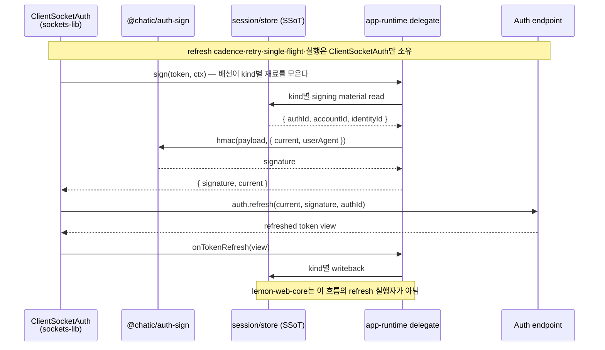
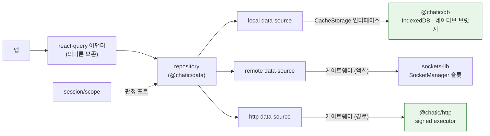

# ADR-0070: 세션은 app-runtime 하나가 관리한다 — ClientSocketAuth refresh · data의 HTTP 대칭 · 전송 규칙 분리

> 상태: Live · 작성일: 2026-08-26 · 최종 갱신: 2026-09-01 · 기준 트리: develop
> 진행: **1~5단계 + 리뷰 반영 완료.** `@chatic/web-core`·`apps/admin`·레거시 3 lib 삭제됨.
> **refresh 엔드포인트 호출부 0** · 모든 HTTP 요청이 게이트웨이 액션 · `session/auth`는 `data`를
> 지난다. 남은 것은 서버 계약과 실기기 QA뿐 — 아래 §구현 결과 참고.
> 관련: [ADR-0036](./0036-data-surface-unification-app-runtime-cleanup.md) (결정 4 "모든 데이터 콜은
> repository를 거친다"를 해소) · [ADR-0047](./0047-unified-logging-core-and-report-traceability.md)
> (`logger`의 플랫폼 중립성은 보존)

> **용어 고정:** 이 문서에서 **Auth SDK**는 `@lemoncloud/chatic-sockets-lib`의
> `ClientSocketAuth`(`AuthController`)를 뜻한다. `@lemoncloud/lemon-web-core`는 Auth SDK가
> 아니며, 최종 구조에서는 `@chatic/http` 내부의 HTTP credential/transport 구현으로만 사용한다.

## 맥락 (Context)

### 세션 하나가 두 표면·두 스토어·두 리프레시 엔진에 걸쳐 있다

**표면이 둘이다.** 앱은 세션을 `@chatic/web-core`에서, 런타임을 `@chatic/app-runtime`에서 가져온다.

| 앱          | `@chatic/web-core` import 파일 | `@chatic/app-runtime` import 파일 |
| ----------- | ------------------------------ | --------------------------------- |
| web         | 110                            | 127                               |
| desktop-web | 47                             | 52                                |
| admin-v2    | 11                             | 5                                 |
| testbed     | 9                              | 13                                |

`app-runtime`은 그 세션 표면을 다시 32파일에서 하향 import한다 (`getServerAuthRegistration` ·
`signServerAuth` · `commitServerRefreshedToken` · `useGlobalSession` …). 즉 **세션 로직의 절반은
이미 `app-runtime`에 있고**, 나머지 절반은 `web-core`에 있는데 앱은 양쪽을 다 본다.

**그리고 같은 이름의 유스케이스가 양쪽에 하나씩 있다.** 이건 취향 문제가 아니라 지금 살아 있는
결함이다.

| 훅                      | `@chatic/web-core` 판                      | `@chatic/app-runtime` 판                           | 실제 소비                                                               |
| ----------------------- | ------------------------------------------ | -------------------------------------------------- | ----------------------------------------------------------------------- |
| `useSessionLogout`      | `logoutRelaySession()` — 스토어 teardown만 | `logoutSession()` — 소켓 `auth.logout` 후 teardown | web·admin-v2는 런타임 판, **desktop-web `PlaceRail.tsx`는 web-core 판** |
| `useLogoutCloudSession` | 스토어 판                                  | 소켓 통지 판                                       | web은 런타임 판, **desktop-web `useCloudSwitchFlow.ts`는 web-core 판**  |
| `useSiteSwitch`         | 스토어 판                                  | `auth.switch` 패킷 판                              | web은 런타임 판                                                         |

**desktop-web은 서버에 알리지 않고 로그아웃·클라우드 이탈을 한다.** 배럴 두 개가 같은 이름을
내놓으면 호출부는 어느 쪽이 "진짜"인지 알 방법이 없다 — 창구를 하나로 만드는 것 자체가 이 결함의
수정이다.

**스토어가 둘이다.**

| 스토어                     | 위치                                                   | 키                              |
| -------------------------- | ------------------------------------------------------ | ------------------------------- |
| 앱 세션 스토어             | `web-core/src/session/core/{cloud,relay,identity}Core` | `chatic-*`                      |
| lemon-web-core 자체 저장소 | SDK 내부 (`WebCoreFactory.create({storage})`)          | `@<project>.*` (sessionStorage) |

같은 AWS 크레덴셜·identity 토큰을 둘이 각자 보관한다.

**리프레시 엔진이 둘이다.** `chatic-sockets-lib`의 `AuthController`가 만료 기반 cadence·백오프·
in-flight 직렬화를 소유하고(`app-runtime/docs/socket/auth/README.md`), lemon-web-core의
`init()`/`isAuthenticated()`도 저장된 `expired_time`이 지나면 자체 refresh를 발사한다 — **캡도
single-flight도 없이, 자기 저장소만 갱신하면서.** 지금 이 두 번째 엔진은 코드로 봉인돼 있다.

```ts
// libs/web-core/src/transport/webTransport.ts — 봉인의 근거 주석(발췌)
// lemon-web-core's own `init()`/`isAuthenticated()` fire an HTTP token refresh whenever the stored
// `expired_time` has passed — a second refresh engine with no cap/single-flight that writes ONLY
// its own store, leaving relayCore and the socket SDK's signing material stale (the signature-error
// divergence).
```

봉인(`initWebTransportSealed`)은 **설계가 아니라 증상 억제**다. 원인은 "SDK가 refresh한다"가
아니라 **"SDK가 아무도 읽지 않는 스토어에, 아무도 통제하지 않는 시점에 refresh한다"** 다.
그리고 봉인의 대가가 앱 코드로 흘러나갔다: 소켓이 불건강한 구간(랩탑 슬립·드롭)의 크레덴셜
staleness 감시를 admin-v2가 **자기 훅으로 직접 만들어 갖고 있다**(`useRelaySessionGuard` —
30초 간격+포커스에서 read-only 프로브 후 app-runtime `requestSessionRefresh` 호출). refresh
엔트리는 런타임에 있는데 **감시가 앱마다 재발명 대상**이고, 실제로 web·desktop-web에는 이
가드가 없다 — 같은 슬립 구간에서 서명 HTTP가 403으로 뒹군다.

### 고려했던 대안 — web-core를 형제 4개로 물리 분할

web-core를 그대로 두고 내부만 `web-config`/`web-transport`/`web-api`/`web-session` 4형제
패키지로 물리 분할하는 안을 먼저 검토했다. desktop-web을 건드리지 않는다는 전제(당시 제약) 아래,
`@chatic/web-core` 공개 배럴 심볼을 그대로 유지한 채 내부 경계만 패키지로 승격하는 접근이다.
**2026-08-25 그 전제가 사라졌다** — desktop-web도 함께 바꾼다.

전제가 사라진 눈으로 다시 보면, 이 분할이 앱에 주는 것이 없다. 앱은 애초에 web-core 배럴만
보고, 분할로 새로 생기는 패키지는 어느 것도 앱이 직접 소비하지 않는다 — 전부 web-core
내부에서만 서로를 참조한다. 세 경계(`web-session`·`web-api`·`web-transport`)를 넘기 위해 포트
3개(`AuthApiPort` · `SessionTransportPort` · `CloudRequestCredentialSource`)와
`composition.ts`가 새로 필요해지는데, 그 존재 이유가 "배럴 불변을 지키면서 내부만 쪼갠다"는
것뿐이다 — 배럴 불변 제약이 없어지면 근거도 함께 사라진다.

**그래서 이 안은 버린다.** 물리 분할 검토에서 얻은 통찰 — 순환 절단 가능성, 소비자 소유
`Pick<>` 계약, `data`의 leaf 유지 — 은 이 ADR이 계승하되, web-core를 형제 4개로 재조립하는 대신
**해체한다**. "세션은 web-core, 데이터는 app-runtime"이라는 앱 쪽 이분법이 남는 한 분할은 답이
아니다.

### HTTP에는 소켓의 분업이 없다

| 축                  | 소켓                                           | HTTP                                   |
| ------------------- | ---------------------------------------------- | -------------------------------------- |
| 인터페이스          | `data/remote/gateways/` (`Pick<>` 기반 12종)   | 없음                                   |
| 구현체              | `data/remote/data-sources/` 11클래스           | 없음                                   |
| 연결·라우팅         | `app-runtime/data/factories/remoteFactory.ts`  | 없음                                   |
| 규칙(서명·리트라이) | `chatic-sockets-lib` 안 (우리 스토어를 모른다) | `web-core` transport/api에 뒤섞임      |
| 소비 경로           | repository → data-source → gateway             | **훅이 repository를 우회해 직접 호출** |

`web-core/src/api/auth.ts` 한 파일(280줄)이 엔드포인트 해석·서명 선택·리트라이·도메인 매핑을 동시에 한다.
훅 6개(`useClouds` 18곳 · `useCloudSessionCatalog` 22곳 · `useRegisterDeviceToken` 8곳 ·
`useVerifyEmail` 6곳 · `useUsers` 4곳 · `useVerifyNativeAppToken` 2곳 — 심볼을 참조하는 파일
기준이며, desktop-web에 `useCloudSessionCatalog`를 감싼 **동명의 자체 `useClouds`**가 따로 있어
합산된다. web-core 판만 세면 더 작다 — [libs/data/docs/http-data-path.md](../../libs/data/docs/http-data-path.md) 표 참조)가 repository 밖에서
데이터를 읽는다 — ADR-0036이 "모든 데이터 콜은 repository를 거친다" 원칙의 **유일한 미해결
위반**으로 지목한 항목이다.

### 전송 규칙이 다섯 곳에 흩어져 있고, 예외는 주석으로만 지켜진다

| 규칙                    | 현재 위치                          | 내용                                              |
| ----------------------- | ---------------------------------- | ------------------------------------------------- |
| 네트워크 로깅·redact    | `web-core/transport/networkLog.ts` | `withNetworkLog` · `redactSensitive` · `truncate` |
| 리트라이·백오프         | `web-core/transport/utils.ts`      | `withRetry(maxRetries = 4)` · `2^n`초             |
| 에러 분류               | `web-core/transport/error.ts`      | `shouldRetry` · `shouldLogout`                    |
| 리프레시 single-flight  | `web-core/session/services.ts`     | 동시 호출 coalesce (relay·cloud 각 1개)           |
| 로그 업로드 배치·백오프 | `logger/upload/uploadPolicy.ts`    | batch 50 · 60s · [5s,30s,120s] · 5회 — **중립**   |
| **의도적 우회**         | `web-core/api/logBatch.ts`         | `withNetworkLog`를 건너뜀 — 주석으로만            |

마지막 항목이 문제의 성격을 보여준다. 업로드 요청을 로깅하면 **실패가 로그를 낳고 그 로그가 다음
flush를 밀어 무한 루프**가 된다. 규칙의 주인이 없으니 "이 요청은 규칙 대상이 아니다"를 선언할
자리도 없다.

### 곁가지 사실: `apps/admin`은 이미 현 트리에서 안 붙는다

`apps/admin` 5파일이 `@chatic/web-core`에서 `useWebCoreStore`를 import하는데, 그 심볼은
**리포지토리 어디에도 정의돼 있지 않다**(전수 grep — 참조만 `libs/socket` 1건). admin은 이 ADR의
제약이 아니다 — 이미 깨져 있다.

## 결정 (Decision)

목표 의존 그래프. 앱이 보는 것은 **두 개**다.



엔진 세 개(`sockets-lib` · `@chatic/http` · `@chatic/db`)는 전부 `data`에 **인터페이스로만**
보인다 — 게이트웨이는 타입 `Pick<>`, 저장은 `data`가 소유한 `CacheStorage`·`IIndexedDB`
인터페이스를 `@chatic/db`가 구현한다(결정 5). 인스턴스 결합은 전부 `app-runtime`의 팩토리가
한다. 앱은 `data`와 런타임만 본다 — 엔진 모듈은 팩토리 전용이다.

### 0. 공통 원칙 — 새로 쓰는 공통 코드는 전부 클래스·인터페이스로 모듈화한다

이 재편에서 신설·이관되는 공통 코드(`session/` · `@chatic/http` · `@chatic/db` · scope ·
http-data-source · 팩토리)는 예외 없이 같은 형태를 따른다. `data`가 이미 지키는 규율의 전면
확장이다(세부는 결정 5의 규율 1~4):

- **계약은 `I*` 인터페이스**, 소비자 쪽 모듈이 소유한다.
- **구현은 클래스 + 생성자 주입.** 구현 클래스는 팩토리(조립 지점) 밖으로 나가지 않는다.
- **경계를 넘는 것은 인터페이스·도메인 타입뿐.** 함수 모음(export 함수 뭉치)으로 경계를 넘는
  기존 web-core 식 표면은 이관하면서 인터페이스+클래스로 재구성한다.

### 1. `app-runtime`이 세션 관리의 단일 창구다

- **SSoT**: 토큰(relay/cloud)·AWS 크레덴셜·선택 상태(cid/sid/uid)·identity·디바이스 id의 유일한
  보관처이자 유일한 writer.
- **유일한 앱 표면**: 세션 상태 읽기·로그인·로그아웃·전환·리프레시 훅이 전부 여기 배럴에서 나온다.
- `web-core/src/session` 전체(store·services)와 세션·인증·앱 부팅 훅(`hooks/session` ·
  `hooks/auth` · `hooks/app` — 훅 32개 중 25개), `transport/authRuntime.ts`(OAuth 코드 교환)가
  이관된다.

```
libs/app-runtime/src/
├── session/                  ← 세션 SSoT (신설, web-core session·훅 이관)
│   ├── store/                relay · cloud · identity 토큰·선택 상태 (web-core/session/core)
│   ├── auth/                 로그인·발급·전환·로그아웃 유스케이스 (refresh는 ClientSocketAuth만 수행)
│   ├── scope/                선택 의도 vs 결합 사실 판정 (결정 7)
│   └── hooks/                useGlobalSession · useSessionAuth · useLogin · …
├── socket/                   SocketManager + AuthController 배선 (기존, 무변경)
├── http/                     HttpManager + 규칙 스택 + 라우팅 (신설, 결정 4)
├── data/factories/           localFactory(IndexedDB) + remoteFactory(소켓) + httpFactory(HTTP) — 구현 모듈의 유일 소비자 (결정 5)
└── …
```

**경계를 잃는 대신 두 규칙으로 대체한다.**

1. **스토어의 수동성** — 스토어가 소켓·sync·repository를 모른다는 규칙을 `app-runtime` 내부
   eslint `no-restricted-imports`로 강제한다. 규칙의 적용 범위는
   **`session/store/**`** 다: 스토어는 `../socket`·`../data`·`../http`는 물론 형제
`../auth`·`../hooks`도 import하지 못한다 — 저장과 통지만 한다.
`session/auth/**`(유스케이스)는 성격이 다르다 — login·refresh·exchange는 **HTTP를 쳐야 하는
   코드**다. 단 `../http`를 직접 import하지 않고, 부팅 조립(runtime boot)이 `HttpManager`를 먼저
   만들어 서명된 executor를 **인자로 건네준다\*\*. 폴더 방향이 `http → session/store`(크레덴셜
   읽기)로 이미 존재하므로, `session/auth → http` 직접 import를 허용하면 폴더 순환이 된다 —
   주입이 순환을 막는 형태다.
2. **env 주입** — `session/**`은 `@chatic/web-config`를 직접 import하지 않고, 부팅 시 넘겨받은
   런타임 설정 객체를 읽는다. `import.meta`가 ts-jest(`module: commonjs`)를 깨뜨리는 문제가
   **구조적으로** 사라진다 — 옮겨오는 세션 테스트 48케이스
   (`services.test.ts` 39 · `contextStore.test.ts` 9)가 그 검증 게이트다.

### 2. `ClientSocketAuth`가 refresh를 단독 소유한다 — lemon-web-core는 HTTP 내부 구현이다

이 문서에서 Auth SDK는 `@lemoncloud/chatic-sockets-lib`의 `ClientSocketAuth`(`AuthController`)다.
만료 cadence·refresh·백오프·in-flight 직렬화·재연결 재인증은 **이 SDK만** 수행한다.
`app-runtime`은 소켓별 `sign` callback, 초기 토큰 seed, `onTokenRefresh` writeback을 배선한다.

`@lemoncloud/lemon-web-core`는 Auth SDK가 아니다. 최종 구조에서 이 패키지는 `@chatic/http`의
내부 구현으로만 사용하며, HTTP request builder·AWS credential runtime·OAuth credential 적용을
제공한다. `init()`/`isAuthenticated()`의 자체 refresh 부수효과는 계속 봉인하고,
`buildCredentialsByStorage()` 같은 읽기 전용 credential 재구성만 허용한다.

| 책임                                     | 소유자                                         |
| ---------------------------------------- | ---------------------------------------------- |
| refresh 실행·cadence·retry·single-flight | `ClientSocketAuth`                             |
| refresh 요청 signature 조회·계산         | 별도 `@chatic/auth-sign`                       |
| refresh 결과 cross-surface writeback     | `app-runtime` delegate → `session/store`       |
| HTTP transport·credential runtime        | `@chatic/http` 내부의 `lemon-web-core` adapter |
| refresh endpoint 직접 호출               | `ClientSocketAuth` 외 금지                     |

`ClientSocketAuth`는 refresh 전에 `@chatic/auth-sign`을 주입된 `sign` callback으로 호출한다.
서명 모듈은 `session/store`의 현재 signing material만 읽고, refresh endpoint를 호출하거나
credential을 저장하지 않는다. SDK가 반환한 새 token view는 `onTokenRefresh`를 통해
`app-runtime`이 `session/store`에 반영한다.

**규칙:** `app-runtime`·`data`·앱은 `lemon-web-core`를 직접 import하지 않는다. `@chatic/http`만
내부 구현 의존성으로 사용하며, refresh lifecycle은 `ClientSocketAuth` 밖으로 복제하지 않는다.

#### Refresh 소유권 강제 불변조건

다음은 선호사항이 아니라 **구현·리뷰·CI에서 반드시 지켜야 하는 규칙**이다.

1. `ClientSocketAuth`만 `auth.refresh`와 refresh endpoint를 실행할 수 있다. relay·cloud 모두
   동일하다.
2. `app-runtime`, `@chatic/http`, `@chatic/data`, 앱은 refresh URL·refresh gateway·refresh
   service를 직접 호출하거나 구현하지 않는다. 이 계층의 refresh API는 `ClientSocketAuth`로
   전달하는 트리거 API만 허용한다.
3. `lemon-web-core`의 `init()`·`isAuthenticated()` 등 자동 refresh를 유발할 수 있는 API는
   호출하지 않는다. `@chatic/http` 내부에서도 자동 refresh를 끄고 credential 재구성만 허용한다.
4. refresh signature는 `@chatic/auth-sign`이 계산한다. `ClientSocketAuth`는 이를 `sign`
   callback으로 호출하고, Signature Module은 네트워크 호출·토큰 저장을 하지 않는다.
5. 새 token view의 저장은 `ClientSocketAuth.onTokenRefresh` → `app-runtime` delegate →
   `session/store` 단일 경로만 허용한다. 직접적인 이중 writeback은 금지한다.

강제 수단은 **부재 검사**다(구현하며 바뀐 부분). 초안은 `no-restricted-imports`로 금지 심볼을
막는 것이었는데, 그 규칙은 경로 문자열에 묶여 있어 심볼이 이동하면 조용히 죽는다 — 실제로
한 번 그렇게 죽었고 위반 파일이 lint를 통과했다. 지금은 `app-runtime`과 `libs/http` 양쪽에
**refresh 경로 문자열이 없음**을 검사하는 테스트가 있다. 막을 심볼도 남지 않았다: refresh
엔드포인트를 치는 코드가 리포에 0이다.

`requestSessionRefresh`는 유일한 트리거 API로 남고 HTTP fallback이 없다 — 소켓이 없으면
`false`를 돌려주고, 호출부는 우회하지 않고 소켓을 되찾는다.

### 3. 실제 HTTP 통신은 별도 모듈 `@chatic/http`가 소유한다 — sockets-lib와 같은 위치

소켓에서 **실제 통신은 전부 `chatic-sockets-lib`가 한다** — transport(`ClientSocketV2`), 요청
프리미티브, 그리고 **와이어 어휘를 아는 게이트웨이 팩토리**까지(`createUserGateway`가
`'user'`·`'my-site'`·`'invite'` 액션 문자열을 소유하고 client만 주입받는다). 그러면서 우리
스토어·env는 모른다 — 필요한 것은 전부 외부에서 주입받는다. 그게 소켓 쪽이 깨끗한 이유다.

HTTP도 같은 것을 만든다: \*\*통신의 전부(실행기 + 규칙 + 엔드포인트 어휘)를 lib이 소유하고,
환경·크레덴셜·서명 재료만 주입구로 노출한다. `@lemoncloud/lemon-web-core`는 이 모듈
내부의 HTTP credential/transport adapter로만 사용하며, Auth SDK나 refresh 엔진으로 사용하지 않는다.

```
libs/http/src/
├── client.ts     요청 실행기 — 주입된 endpoint·headers·signer만 사용
├── gateways/     도메인별 게이트웨이 팩토리 — 경로·메서드·타입을 소유   (web-core/api 도메인 파일의 껍데기)
│   ├── oauth.ts         createOAuthHttpGateway(exec)   'POST /oauth/login-user' …
│   ├── users.ts         createUserHttpGateway(exec)
│   ├── clouds.ts        createCloudHttpGateway(exec)
│   └── subscriptions.ts createSubscriptionHttpGateway(exec)
├── sign/         AWS SigV4 HTTP wire signature       (web-core/transport/awsSigning.ts)
├── policy/       retry · backoff · timeout · single-flight · bypass
├── error/        상태코드·본문 → 분류(retry 가능 / logout 필요)  (web-core transport/error.ts · api/errorCause.ts)
└── log/          redact · truncate · withNetworkLog   (web-core/transport/networkLog.ts)
```

`gateways/`가 소켓의 `createUserGateway`와 같은 층이다: **`POST /oauth/login-user` 같은 경로·
메서드가 소켓의 액션 문자열에 해당하는 와이어 어휘**이고, 그 어휘의 주인은 lib이다. 게이트웨이는
executor만 주입받으므로 어느 host로, 어느 크레덴셜로 나가는지 모른다.

주입 계약(포트). `@chatic/*` 런타임 의존이 **0**이다 — env·세션·logger를 모른다.

```ts
export interface HttpRuntimePorts {
    resolveEndpoint(route: HttpRoute): string;
    getCredential(route: HttpRoute): AwsCredentialLike | null;
    getIdentityToken(route: HttpRoute): string | null;
    logSink?: HttpLogSink; // 없으면 로깅하지 않는다
}
```

**route가 endpoint를 전부 결정하지는 않는다.** cloud 토큰 발급(`exchange-token`)은 **아직
선택되지 않은** 대상 클라우드의 backend로 나간다 — delegation
토큰이 알려주는 주소를 호출부가 요청 단위로 넘긴다. 그래서 요청은 `route`(서명 재료 선택)와
별개로 **명시 `baseURL` override**를 가질 수 있고, `resolveEndpoint`는 override가 없을 때의
기본값이다. "스토어의 선택 상태에서 endpoint를 읽는다"로 단순화하면 전환 중 발급이 깨진다.

- **`bypass`가 1급 개념이 된다.** `logBatch`의 "로깅하면 무한 루프" 예외가 주석에서 계약으로
  올라온다 — 규칙의 주인이 생기면 "이 요청은 대상 아님"을 선언할 자리가 생긴다.
- `logger/upload/uploadPolicy.ts`는 **옮기지 않는다** — 배치·간격·백오프는 플랫폼 중립이고
  모바일 RN이 같은 정책을 공유한다(ADR-0047).

### 4. `app-runtime`의 `HttpManager`가 조립한다 — `SocketManager`와 대칭

```ts
// app-runtime/http/HttpManager.ts (스케치)
export type HttpRoute = 'relay' | 'cloud' | 'oauth' | 'iap';

// lemon transport는 **주입**받는다 — lib이 그것을 import하면 `@chatic/*` 의존 0이 깨지고,
// 단일 인스턴스여야 하므로 소유자도 밖에 있어야 한다 (구현 실측).
export const createHttpManager = (lemonSurface: LemonRequestSurface): IHttpManager => {
    const ports: HttpRuntimePorts = {
        resolveEndpoint: route => ENDPOINT_RESOLVERS[route](), // 딥링크 오버라이드 포함
        getCredential: route => (route === 'cloud' ? getCloudCredential() : null),
        getIdentityToken: route => (route === 'cloud' ? getCloudIdentityToken() : null),
        logSink: networkLogSink, // logger 주입
        onAuthFailure, // 분류가 로그아웃 필요로 판정했을 때의 반응
    };
    return createHttpClient(lemonSurface, ports);
};
```

`httpFactory`는 `remoteFactory`가 SDK의 `createUserGateway(client)`를 부르는 것과 똑같이
`@chatic/http`의 `createUserHttpGateway(exec)`를 불러 게이트웨이 번들을 만들고, `data`의
http-data-source에 생성자 주입한다. **app-runtime이 결정하는 것은 재료뿐이다** — 어느 host
(`resolveEndpoint`), 어느 크레덴셜(스토어), 어느 서명 provider. 통신하는 방법은 lib이 안다.

refresh와 socket auth signature에 필요한 lemon HMAC 계산은 별도 `@chatic/auth-sign`이 소유한다.
이 패키지는 `ClientSocketAuth`와 HTTP 계층이 공유할 수 있는 플랫폼 비종속 leaf이며, endpoint나
store를 알지 않는다. AWS SigV4처럼 HTTP wire request에 특화된 서명은 `@chatic/http/sign`에
남긴다. 이렇게 해야 `chatic-sockets-lib`가 `@chatic/http`에 의존하는 순환이 생기지 않는다.

| 축                   | 소켓                                        | HTTP                                         |
| -------------------- | ------------------------------------------- | -------------------------------------------- |
| transport·프리미티브 | `chatic-sockets-lib` (`ClientSocketV2`)     | `@chatic/http` (`client.ts`)                 |
| 와이어 어휘          | sockets-lib 게이트웨이 팩토리 (액션 문자열) | `@chatic/http/gateways` (경로·메서드)        |
| 매니저(주입 결정)    | `SocketManager` (relay/cloud 슬롯)          | `HttpManager` (relay/cloud/oauth/iap 라우트) |
| 조립                 | `remoteFactory`                             | `httpFactory`                                |
| 선택                 | 호출자가 `SocketRoute` 지정                 | 호출자가 `HttpRoute` 지정                    |
| lib이 모르는 것      | 우리 스토어 · env · wss 주소                | 우리 스토어 · env · baseURL · 크레덴셜       |

### 5. 엔진만 밖으로 — `data`는 플랫폼 비종속 순수 데이터 모듈로, 저장 엔진은 `@chatic/db`로

**`data`의 목표 성격을 먼저 고정한다: 어떤 런타임·플랫폼에도 종속되지 않는 순수 데이터 모듈이다.**
도메인 타입·매핑·repository·data-source·(게이트웨이·스토리지) 어댑터 인터페이스까지만 소유하고,
그 인터페이스를 실제로 구현하는 런타임 코드 — IndexedDB, 네이티브 브릿지, 소켓 SDK, HTTP
클라이언트 — 는 전부 밖에 있다. 웹이든 RN이든 같은 `data`를 그대로 쓸 수 있어야 하고, 그 자격을
주는 것이 이 절단이다.

절단선은 **엔진과 그 나머지 사이**다. `data`의 local data-source 클래스는 이미 엔진을 모른다 —
storages에서 가져가는 것은 `type CacheStorage`(인터페이스)와 `stableHash`(유틸)뿐이고(전수
grep), 엔진 구현(IndexedDBAdapter·NativeDBAdapter·IndexedDBDatabase·ChatQueryExecutor)을
만지는 곳은 `app-runtime`의 `localFactory` 하나다. 즉 소켓·HTTP와 **완전히 같은 그림**이 저장
축에도 이미 있는데, 엔진만 아직 `data` 안에 동거한다. 꺼낸다.

```
libs/data/src/                        ← @chatic/data — 유지: 도메인 + data-source + 어댑터 인터페이스
├── domain/                           DomainUser · toDomainUser … (기존)
├── local/
│   ├── ports/                        CacheStorage · IIndexedDB · IGlobalCacheSearchSource (어댑터 인터페이스)
│   └── data-sources-v2/              *LocalDataSourceV2 클래스 9개 — CacheStorage 인터페이스만 봄 (기존)
├── remote/
│   ├── gateways/                     RemoteGatewayBundle ‖ HttpGatewayBundle (lib 타입 Pick<>)
│   ├── data-sources/                 소켓 구현체 11개 (기존)
│   └── http-data-sources/            Auth · User · Cloud · Subscription ← 신설
│           예: class UserHttpDataSource implements IUserHttpDataSource {
│                   constructor(private readonly gateway: UserHttpGateway) {}
│               }
└── repositories-v2/                  RepositoryV2 클래스 13개 (기존)

libs/db/src/                          ← 신설 — 저장 엔진 (CacheStorage·IIndexedDB 구현)
├── indexeddb/                        IndexedDBAdapter · IndexedDBDatabase · ChatQueryExecutor
├── native/                           NativeDBAdapter(브릿지) · nativeCacheMetrics
└── search/                           IndexedDbGlobalSearchSource · NativeGlobalSearchSource
```

이러면 세 축이 같은 문장으로 서술된다 — **엔진은 lib, 인터페이스와 data-source는 `data`, 결합은
`app-runtime`**:

| 축   | 엔진 (실제 IO)                | `data`가 갖는 것                                | 결합            |
| ---- | ----------------------------- | ----------------------------------------------- | --------------- |
| 소켓 | `chatic-sockets-lib` (외부)   | 게이트웨이 `Pick<>` + remote data-source        | `remoteFactory` |
| HTTP | `@chatic/http` (결정 3, 신설) | 게이트웨이 `Pick<>` + http-data-source          | `httpFactory`   |
| 저장 | `@chatic/db` (신설)           | `CacheStorage`·`IIndexedDB` + local data-source | `localFactory`  |

의존 방향: `@chatic/db → @chatic/data`(인터페이스, 타입 전용) + `bridges`(네이티브). `data`는
세 엔진 어느 것에도 런타임 의존이 없다 — 게이트웨이는 타입 `Pick<>`, 저장은 자기가 소유한
인터페이스로만 안다. **`data`의 bridges 의존이 엔진과 함께 `@chatic/db`로 빠져나가는 것**도
이 절단의 부수 이득이다(NativeDBAdapter·NativeGlobalSearchSource가 주 소비처).

이 절단이 앱에 보이지 않는 근거는 실측이다: 앱의 엔진 심볼 import는 **1건**뿐이다 — apps/web
디버그 오버레이(`CacheMetricsScreen.tsx`)가 `getNativeCacheMetrics`/`resetNativeCacheMetrics`를
직접 쓴다. 이것도 인터페이스 뒤로 넣는다: `data/local/ports`에 **`ICacheMetricsSource`**
(read·reset)를 선언하고 구현은 `@chatic/db/native`가 갖고 `localFactory`가 결합한다 — 디버그
화면은 포트만 본다. 그 외 소비자는 `localFactory`뿐이므로 팩토리의 import만 `@chatic/db`로
바꾸면 끝난다.

**클래스·인터페이스 규율** — 새 코드(http-data-source·게이트웨이·scope 포트)도 기존 규율을
따른다:

1. **어댑터 인터페이스는 `data`가, 엔진 클래스는 엔진 모듈이 소유한다.** `CacheStorage`·
   `IIndexedDB`는 data-source가 소비하는 계약이므로 소비자 쪽(`data/local/ports`)에 남고,
   `IndexedDBAdapter`는 그것의 한 구현으로 `@chatic/db`에 산다 — RN이 다른 엔진을 꽂아도
   `data`는 모른다.
2. **경계를 넘는 것은 인터페이스와 도메인 타입뿐이다.** repository·data-source 생성자는 `I*`
   타입만 받고, 엔진 클래스는 팩토리 밖으로 나가지 않는다.
3. **공유 메커니즘은 Base 추상 클래스로, 계약은 인터페이스로.** `BaseRepositoryV2`(dispose·
   context)와 `IUserRepositoryV2`(호출 표면)의 기존 분업 그대로 — Base는 구현 편의이므로 계약이
   아니며, 소비자는 항상 인터페이스를 잡는다.
4. **게이트웨이는 소비자 소유 `Pick<>`.** `data`가 lib 게이트웨이 타입에서 쓸 액션·경로만 골라
   선언한다 — lib 표면 전체가 흘러들어오는 것을 막는, `data`가 소켓 게이트웨이에 이미 쓰는
   패턴의 유지다.

`web-core/src/api`의 REST 도메인 3파일(`auth.ts`·`users.ts`·`subscriptions.ts`)은 **둘로 갈라진다** —
경로·메서드·요청 형태(와이어 어휘)는 `@chatic/http/gateways`의 팩토리로(결정 3), 도메인 매핑·
캐시 의미는 `data/remote/http-data-sources`로. 소켓 쪽과 같은 분업이다: `data`는 소켓 액션
문자열을 모르듯 HTTP 경로도 모른다. 훅 6개는 repository 뒤로 들어간다.

> 이 결정은 **먼저 완성해두고 나중에 옮길 수 있다**: 1차로 인터페이스·구현체·`httpFactory`를 다
> 만들어 두고(앱 무변경), 훅 소비처 이동은 4단계에서 따로 진행한다.

**읽기 의미론이 함께 바뀐다는 것을 명시한다.** REST 훅 6개는 지금 react-query 위에 있다
(staleTime·중복 제거·invalidate·refetch-on-focus). `data`에는 react-query가 **0건**이다 —
repository 캐시는 소켓 sync 기반의 다른 모델이다. 4단계에서 둘 중 하나를 정해야 한다:
① 앱 레벨에 react-query 어댑터를 남겨 repository를 데이터 소스로만 쓰거나(의미론 보존),
② repository 읽기 모델로 통일한다(54개 소비처의 refetch 동작 변화 수용). **기본은 ①**이다 —
이 ADR은 구조를 옮기는 것이지 캐싱 동작을 바꾸는 것이 아니다. ②는 별도 결정으로 다룬다.

**실측 결과 ②로 갔고, 대신 훅이 앱 레이어로 내려갔다.** 4단계는 일단 ①로 착지했다 —
`app-runtime/src/data/hooks/*`가 `http/gateways`를 직접 부르는 형태. 그런데 소비처를 앱별로 세어
보니 13심볼 중 두 앱 이상이 쓰는 것은 catalog 계열 넷뿐이었고, 나머지는 한 앱의 화면 전용이었다.
그 훅들이 공용 런타임 표면에 있을 이유가 없다 — react-query가 그 읽기의 캐시 **전부**이고, 캐시
정책은 그리는 앱의 것이다. 그래서 12심볼을 앱으로 내리고 repository를 경유하게 했다.

②의 실제 비용은 작았다: repository는 `DomainListResult<T>`(`{list, meta}`)를, 게이트웨이 뷰는
`{list, total}`을 준다. 걸린 곳은 두 군데(`UsersPage`·`CloudManagePage`의 `total` 읽기)뿐이고,
`DomainCloud`/`DomainUser`는 뷰의 초집합이라 필드 읽기는 무변경이었다. 남은 것은
`useRegisterDeviceTokenMutation`(런타임 자신이 부른다)과 `cloudsKeys`(`useLogin`이 무효화한다)
둘뿐이다 — 배치 전체는 [migration SPEC](../specs/adr-0070-migration.SPEC.md) §완료 기록.

### 6. 패키지 정리

| 패키지                            | 판정                                                    | 근거                                                                                                                                                                                                                                                                |
| --------------------------------- | ------------------------------------------------------- | ------------------------------------------------------------------------------------------------------------------------------------------------------------------------------------------------------------------------------------------------------------------- |
| `web-core`                        | **해체 → shim → 삭제**                                  | session→`app-runtime/session` · transport/api 규칙→`@chatic/http` · REST 도메인→`http/gateways`+`data` · 리포트 전송→`app-runtime/http` · config→`web-config` 승격                                                                                                  |
| `@chatic/web-config`              | **신설(leaf)**                                          | `web-core/src/config` 승격 — env·`import.meta` 격리                                                                                                                                                                                                                 |
| `data`                            | **유지(leaf, 플랫폼 비종속 순수 데이터)** — 엔진만 축출 | domain·repository·data-source·어댑터/게이트웨이 인터페이스 소유, 런타임 구현체는 0(결정 5)                                                                                                                                                                          |
| `libs/{auth,users,subscriptions}` | **삭제**                                                | admin·desktop-web 전용 얇은 REST 래퍼. 소비자가 흡수 대상                                                                                                                                                                                                           |
| `libs/socket`                     | **삭제 — 단, admin과 함께**                             | 존재하지 않는 `useWebCoreStore`를 참조해 이미 깨져 있다. 단 "소비자 0"은 아니다: `apps/admin` 10파일이 `@chatic/socket`을 import한다(실측). admin 자신도 같은 유령 심볼로 깨져 있어 실질 소비자가 없을 뿐이므로, 삭제 시점은 **열린 질문 3(admin의 운명)에 묶인다** |
| `@chatic/http`                    | **신설**                                                | 결정 3 — HTTP 실제 요청 영역(실행기·규칙·와이어 어휘)                                                                                                                                                                                                               |
| `@chatic/db`                      | **신설**                                                | 결정 5 — IndexedDB 엔진 + 네이티브 DB 브릿지. 소비자는 `localFactory`뿐                                                                                                                                                                                             |
| `@chatic/auth-sign`               | **신설(leaf)**                                          | 결정 2 — `ClientSocketAuth`와 HTTP가 공유하는 auth refresh/socket signature 계산. endpoint·store·refresh 실행 무지                                                                                                                                                  |

`logger` · `bridges` · `shared` · `theme` · `ui-kit` · `app-messages` 등은 이 ADR의 범위가
**아니다** — 손대지 않는다.

### 7. 스코프의 소유자를 하나로 — `session/scope`의 `ActiveScope`

스코프(어느 cloud·site·user의 맥락에서 실행 중인가)는 지금 **조각 4개**로 흩어져 있다:

| 조각      | 어디                                       | 무엇                                                                                 |
| --------- | ------------------------------------------ | ------------------------------------------------------------------------------------ |
| 의도 계산 | `useRuntimeBinding`                        | 세션에서 `{cid, sid, uid}` 파생 → `DataManager.ensure`                               |
| 의도 보관 | `DataContextHolder` (`data`)               | 단순 holder — 계산도 판정도 없음                                                     |
| 사실 합성 | `DataManager`의 익명 `socketAwareProvider` | `getBoundCid()`를 즉석에서 context에 끼워 넣음                                       |
| 판정      | 소비처 4곳 인라인                          | `data` 3파일(한 곳 부정 반전) · `SyncManager.isCidActive` · `plans.dropForeignFrame` |

받는 쪽 포트는 **이미 하나다** — `data`의 `DataContextProvider`. 주는 쪽만 조각나 있다. 그래서
통일의 형태는 새 포트가 아니라 **기존 포트의 구현자를 하나로 모으는 것**이다:

```
session/scope/
├── ActiveScope.ts    단일 소유자 — store(의도) 구독 + SocketManager(사실) 관측
│                     · implements DataContextProvider  ← data의 기존 포트, DataContextHolder+
│                       socketAwareProvider 글루를 대체
│                     · HttpManager의 크레덴셜 선택(route→어느 세션의 자격)도 여기 뷰를 읽는다
└── (판정 함수는 여기 없다) — isCidActive · isForeignContext는 `@chatic/data`가 소유한다.
                      판정 6곳 중 4곳이 leaf인 `data` 안이라 app-runtime에 두면 통합
                      자체가 불가능하다(구현 실측). scope는 그 순수 함수의 소비자다
```

**통일하는 것은 소유자이지 값이 아니다.** 스코프에는 이름 붙은 뷰가 셋 있고, 셋이 다른 것이
낙관적 전환의 본질이다 — 합치면 크로스 클라우드 오염 버그가 돌아온다:

| 뷰          | 값                         | 소비자                                       |
| ----------- | -------------------------- | -------------------------------------------- |
| `intent`    | `selectedCloudId` (스토어) | 캐시 파티션 — 전환 시 낙관적으로 먼저 뒤집힘 |
| `bound`     | `boundCid` (SDK 관측값)    | 프레임 드롭·쓰기 가드 — bind 시점에 동결     |
| `committed` | 커밋된 cloud 토큰의 cid    | 소켓 슬롯 config·cloud 크레덴셜 선택         |

`boundCid`는 SDK 제어 결과의 **관측값**이며 `ActiveScope`가 임의로 바꾸지 않는다. 소비처의
per-call `contextOverride`(로컬 data-source)는 그대로 남는다 — 물리 파티션을 바꾸는 수단이
아니라 요청 단위 힌트라는 기존 한계도 그대로다.

### 8. 마이그레이션 shim으로 빅뱅을 피한다

3단계에서 `@chatic/web-core`를 **재수출 전용 shim**으로 남긴다.

- 새 구현은 전부 `app-runtime`에 있고, shim은 `export { … } from '@chatic/app-runtime'`뿐이다.
- 앱 177파일(web 110 · desktop-web 47 · admin-v2 11 · testbed 9)의 import 교체를 **파일 단위로,
  되돌릴 수 있게** 진행한다.
- **shim에 새 심볼을 추가하는 것은 금지**한다. 소비자가 0이 되면 삭제한다(5단계).

## 최종 구조 (Target Structure)

결정 1~8을 한 그림으로 종합한다. 개별 결정의 근거는 각 절에 있다 — 여기는 완성형만 그린다.

### 폴더 구조

```
libs/app-runtime/src/                  ← 유일한 런타임 창구
├── session/                             세션 SSoT (결정 1·2·7)
│   ├── store/      relay·cloud·identity 토큰 · 선택(cid/sid/uid)   [유일 writer, 수동성 eslint]
│   ├── auth/       login·발급·switch·logout                        [refresh는 ClientSocketAuth만 수행]
│   ├── scope/      ActiveScope — intent·bound·committed 뷰 + 판정   [DataContextProvider 구현]
│   └── hooks/      useGlobalSession · useLogin · useSiteSwitch …   [동명 훅 병합 — 소켓 통지 판 승자]
├── socket/         SocketManager + AuthController 배선              [기존 무변경]
├── http/           HttpManager(relay|cloud|oauth|iap) + report/    [결정 4·6]
├── data/factories/ localFactory ‖ remoteFactory ‖ httpFactory      [엔진 모듈의 유일 소비자]
└── push/ · runtime/ · connection/                                   [기존]

libs/data/src/                         ← 유지(leaf): 도메인 + data-source + 어댑터 인터페이스 (결정 5)
├── domain/                              DomainUser · toDomainUser …
├── local/
│   ├── ports/                           CacheStorage · IIndexedDB · IGlobalCacheSearchSource
│   └── data-sources-v2/                 *LocalDataSourceV2 9개 — 인터페이스만 봄
├── remote/
│   ├── gateways/                        RemoteGatewayBundle ‖ HttpGatewayBundle (lib 타입 Pick<>)
│   ├── data-sources/                    소켓 구현체 11개
│   └── http-data-sources/               Auth · User · Cloud · Subscription ← 신설
└── repositories-v2/                     Repository 13개 — I* 생성자 주입

libs/db/src/                           ← 신설: 저장 엔진 (data의 인터페이스를 구현, 결정 5)
├── indexeddb/                           IndexedDBAdapter · IndexedDBDatabase · ChatQueryExecutor
├── native/                              NativeDBAdapter(브릿지) · nativeCacheMetrics(ICacheMetricsSource 구현)
└── search/                              IndexedDbGlobalSearchSource · NativeGlobalSearchSource

libs/http/src/                         ← 신설: HTTP 통신 (@chatic/* 런타임 의존 0, 결정 3)
├── client.ts                            실행기 — 주입된 endpoint·creds·signer만
├── adapters/lemonWebCore.ts              lemon-web-core HTTP credential/transport adapter
├── gateways/                            oauth · users · clouds · subscriptions  [경로·메서드 소유]
├── sign/ · policy/ · error/ · log/      SigV4 · retry·bypass · 분류 · redact

libs/auth-sign/src/                    ← 신설 leaf: auth refresh/socket signature (결정 2)
└── hmac/                               lemon HMAC 계산 — endpoint·store·refresh 실행 무지
```

### 세션 — 스토어 하나, 트리거 주인 하나 (결정 2)



### 데이터 — repository가 유일한 표면, 엔진 3형제는 인터페이스 뒤 (결정 3·4·5)



세 엔진의 인스턴스는 전부 `app-runtime` 팩토리가 만들어 생성자 주입한다 — 어느 host·어느
크레덴셜·어느 파티션인지는 엔진도 `data`도 모른다.

## 단계 (Phasing)

| 단계     | 내용                                                                                                                                                                                                                                                                              | 앱 변경        | 위험 |
| -------- | --------------------------------------------------------------------------------------------------------------------------------------------------------------------------------------------------------------------------------------------------------------------------------- | -------------- | ---- |
| **1** ✅ | 결정 3·4 — `libs/http` 신설(lemon adapter·HTTP 요청·SigV4·로깅·리트라이·에러·bypass 이관) + `HttpManager`                                                                                                                                                                         | 없음           | 낮음 |
| **2** ✅ | 결정 5 — `@chatic/db` 분리(저장 엔진 축출) + `HttpGatewayBundle` + `http-data-sources/` + `httpFactory`                                                                                                                                                                           | 없음(팩토리만) | 낮음 |
| **3** ✅ | 결정 1·2·7 — `session/` 통합 · `ClientSocketAuth` sign/writeback 배선 · `@chatic/auth-sign` 신설 · 훅 이관 · ActiveScope · shim 발행. **선행 조건이 하나 더 있었다: `@chatic/web-config` 신설** — 의존 역전이 원자적이라 env를 먼저 leaf로 빼야 세션 이관이 성립한다(열린 질문 4) | 없음(shim)     | 중   |
| **4** ✅ | 결정 8 — 앱 177파일 import 이동 + REST 훅 6개를 repository 뒤로                                                                                                                                                                                                                   | 파일 단위      | 중   |
| **5** ✅ | 결정 6 — shim(`web-core`)·레거시 3(`auth`·`users`·`subscriptions`) 삭제 · **명시 부팅 전환** · admin 처리 결정                                                                                                                                                                    | 앱 엔트리      | 낮음 |

1·2단계는 앱을 건드리지 않고 실제 결함(REST의 repository 우회, 규칙 산포)을 닫는다. 3단계가
스토어 이중화와 봉인을 없앤다. **4단계는 shim 덕분에 한 번에 끝낼 필요가 없다** — 빅뱅 컷오버가
아니라 파일 단위로 진행하고 언제든 멈출 수 있다.

**부팅이 암묵에서 명시로 바뀐다.** 지금 세션 부팅은 import 부수효과다 —
`web-core/src/transport/webTransport.ts` 모듈 로드 시의 `startWebTransportInit()` 자기 호출
(webTransport.ts:227). 3~4단계 동안은 shim이 같은 부수효과를 유지해 앱을 속이고, **5단계에서 각 앱 엔트리가
`initAppRuntime(config)`를 명시 호출하는 것으로 전환한다**(위 표의 "앱 엔트리" 변경이 그것이다).
전환 시 앱별 엔트리(main.tsx)의 기존 초기화 순서 계약 — 특히 로깅·브릿지 초기화가 세션 부팅보다
먼저여야 하는 순서 — 를 깨지 않는지 앱마다 확인한다.

**기준선 계측은 착수 차단 게이트가 아니다 (2026-08-31 재판정).** 이 재편의 효과 주장
("서명 403 부류 소멸")이 측정 없이 검증 불가인 것은 맞지만, "트리거를 먼저 심어라"는 아무것도
없다는 전제로 쓴 것이고 실측은 다르다 — 통합 로깅 트랙(ADR-0047·0063·0066)이 수집 기반을 이미
깔아놨다. **403율은 이미 전량 수집된다**(모든 HTTP 실패가 status와 함께 error 레벨로 남는다 —
질의만 하면 된다). 무음이던 것은 **소켓 경로의 refresh 발화** 하나뿐이라 `logger.info` 한 줄로
해소했다. 비자발 재로그인은 `sessionDelegate`의 기존 warn이 근사값이다. 남은 확인 항목은
"세 지표가 서버에서 실제로 질의 가능한가"이며, 서버측 집계는 이 리포 밖이다.

## 구현 결과 (2026-08-31)

5단계까지 끝났다. 실측 최종 상태:

| 예측                                 | 실제                                                                                                                                                                                      |
| ------------------------------------ | ----------------------------------------------------------------------------------------------------------------------------------------------------------------------------------------- |
| libs 17 → 16                         | **16** (`app-messages` `app-runtime` `auth-sign` `bridges` `data` `db` `device-utils` `http` `i18n-mobile` `logger` `policy-content` `shared` `theme` `ui-kit` `web-config` `web-ui-kit`) |
| 앱이 보는 것은 app-runtime + data 둘 | **그대로** — 앱의 데이터·세션 import는 `@chatic/app-runtime` 404 · `@chatic/data` 166이고, 나머지는 UI 키트·브릿지·로거 등 이 ADR 범위 밖 패키지다                                        |
| `web-core` 해체 → shim → 삭제        | **삭제 완료.** 앱의 web-core import 0을 거쳐 패키지 제거                                                                                                                                  |
| 레거시 3 + `libs/socket` 삭제        | **삭제 완료** (열린 질문 3의 `apps/admin` 삭제로 함께 풀렸다)                                                                                                                             |

**명시 부팅 전환은 예고와 다른 형태로 끝났다.** 5단계는 "앱 엔트리가 `initAppRuntime(config)`를
명시 호출한다"로 서술했지만, 부팅 부수효과가 `@chatic/web-config`의 transport 모듈 하나로
수렴하면서 앱은 `app-runtime`을 통해 거기 닿는다. 즉 "import 부수효과"라는 성격은 남았고,
위치만 `web-core/transport/webTransport.ts`에서 leaf로 옮겨졌다. 호출 위치를 앱 엔트리로
끌어올리는 것은 별개 작업으로 남는다 — 그때 각 앱 `main.tsx`의 초기화 순서 계약(로깅·브릿지가
세션 부팅보다 먼저)을 확인해야 한다는 원래 주의사항은 그대로 유효하다.

> **2026-09-02: 트리거 API가 relay 전용으로 좁혀졌다.** 본문의 `requestSessionRefresh(kind)`는
> `requestRelaySessionRefresh()`가 됐다. `kind`의 `'cloud'`는 호출부가 0이었고 개념상으로도 틀린
> 문이었다 — cloud 토큰은 relay 신원에서 **재발급**되므로(결정 2의 비대칭 표) refresh로 고칠 대상이
> 아니다. 정책은 그대로이고 이름이 그 정책을 말하게 됐다.

> **2026-09-02: 그 별개 작업을 했다.** [`initAppRuntime(config)`](../../libs/app-runtime/src/init.ts)가
> 생겼고 앱 4개(`web` · `desktop-web` · `admin-v2` · `testbed`) 모두 엔트리에서 render 전에 부른다.
> 부수효과 둘(`session/store` 배럴의 `configureSessionStore()`, `connection` 배럴의
> `configureCredentialRecovery()`)은 제거됐고, `configureDataRuntime`은 공개 표면에서 빠져
> `initAppRuntime({ data })`로 흡수됐다 — 앱이 순서를 기억해야 하는 configure-\* 집합 대신 부팅 호출
> 하나다. 순서 계약은 코드에서 강제된다: resolver가 없으면 `relayStore`가 추측하지 않고 throw하며
> 에러가 `initAppRuntime()`을 지목한다(`init.test.ts`가 그 실패를 고정한다). 실기기가 아닌 브라우저
> 부팅으로 검증했다 — 게스트 로그인·소켓 핸드셰이크·relay HTTP까지 정상.

### 리뷰 반영 (2026-09-01)

세 원칙을 기준으로 다시 훑으면서 예고보다 더 나아갔다.

**refresh 엔드포인트 호출부가 0이 됐다.** 불변조건 1·2를 "정당한 호출부만 남긴다"로 읽고
전수조사했더니 남길 것이 없었다 — 6개 경로 중 3개는 런타임 호출부 0이었고(공개 표면에만 남아
있었다), 클라우드 체인 전체는 testbed의 흔적기관 한 줄이 살려두고 있었으며, 로그인 수화는
갱신이 아니라 **버려진 응답 필드를 되찾으려고** 부르고 있었다. 교환 응답을 버리지 않게 고치니
필요가 사라졌다. 가드는 경로 패턴이 아니라 **부재 검사**다(`refreshAbsence.test.ts`).

**모든 HTTP 요청이 게이트웨이 액션이 됐고, `session/auth`는 `data`를 지난다.** 세션 모듈이
요청을 직접 만들던 3곳(refresh·OAuth 교환 2종)이 사라졌고, 게이트웨이 인스턴스를 아는 코드는
전부 `data/` 안이다. 토큰 생성 액션을 `data`에서 배제하던 규칙은 폐기했다 —
`AuthRepositoryV2.confirmPhoneCode`가 이미 `$token`을 반환하며 "수행하되 해석하지 않는다"는
규칙을 쓰고 있었고, HTTP 레인만 다른 규칙일 이유가 없었다(결정 5 갱신).

**이름층 하나를 걷어냈다.** 4·5단계에서 옮겨온 호출들 앞에 `session/auth/api.ts`와
`data/hooks/api.ts`라는 얇은 층이 생겼는데, 그 21개 export 중 대부분은 소비자가 하나뿐인 순수
포워딩이었다 — 결정 0의 "함수 뭉치로 경계를 넘지 않는다"에 정면으로 걸리는 형태이기도 하고,
같은 액션에 두 개의 이름을 만들어 두는 비용이 있었다. 셋으로 정리했다:

- `data/hooks/api.ts`는 삭제. 세 훅 파일이 `http/gateways`를 직접 부르고, 유일하게 로직이 있던
  `tryFetchProfile`(null 계약)은 도메인이 같은 `hooks/user.ts`로 옮겼다.
- `session/auth/api.ts`의 세션 재료 커맨드 6개는 소비자가 `services.ts` 하나뿐이라 그 파일
  안으로 내렸다(`authRepository()` 접근자). `services.test.ts`(이 ADR의 게이트)는 이제
  `data/runtime`을 목으로 잡고 **repository 인자 모양 그대로** 검증한다 — 이름을 바꿔주던
  어댑터가 없어졌으므로 그게 실제 경계다. 42케이스 그대로 통과.
- 남긴 6개는 `authActions.ts`로 이름을 바꿨다. 이건 이름층이 아니라 어댑터다:
  `registerUserWithInviteCode`·`fetchInviteInfoWithCode`는 배럴로 나가서 앱 3개가 positional
  인자로 부르는데 repository는 객체를 받는다. 그 번역을 한 곳에 두는 것이 존재 이유 전부다.

`app-runtime` 테스트 439개·타입체크는 그대로 통과하고, 배럴 공개 심볼은 하나도 바뀌지 않았다.

**그 다음 질문이 폴더 자체를 옮겼다.** "`data/hooks`가 여기 있는 게 맞나"에 대해 처음엔 "앱 4개가
공유한다"고 답했는데, 그건 심볼 이름 grep이었다. `@chatic/app-runtime`에서 실제로 import하는 것만
세면 두 앱 이상이 쓰는 심볼은 catalog 계열 넷(`useClouds` · `useCloudSessionCatalog` ·
`useDeleteCloud` · `cloudsKeys`)뿐이고, `useMembershipInfo` 계열은 web 전용, `useUsers`·
`tryFetchProfile`은 admin-v2 전용, `productPlansKeys`·`usersKeys`는 앱 소비 0이었다. 그리고
"앱이 게이트웨이를 보게 된다"는 두 번째 반박도 틀렸다 — repository 경로가 이미 다 있었다
(`fetchCloudCatalog` · `fetchMembershipInfo` · `listRelayUsers` · `tryFetchProfile`).

그래서 13심볼 중 12개를 앱으로 내렸다(결정 5의 ②안 항목 참고). 세 가지가 부수적으로 드러났다:

- **`params` 누락.** `ICloudRepositoryV2.makeCloud`/`releaseCloud`가 게이트웨이의 `params`를
  받지 않아서, 그대로 옮기면 dev 드라이런(`dryRun: 1`)과 삭제의 `cascade: 1`이 조용히 사라진다.
  이름 있는 옵션으로 통과시켰고 와이어의 `1` 인코딩은 `data`에 남겼다.
- **`tryFetchProfile`의 자리는 원래 호출부였다.** `libs/data`가 이미 그렇게 적어 뒀다 —
  `UserHttpDataSource`는 "errors bubble … no swallow-and-null here either", `libs/http`는
  "null 동작은 caller concern". null-vs-throw는 화면 정책이고, 그 화면은 admin-v2의 게이트 하나다.
- **catalog 사본 3개는 의도된 중복이다.** 공유되는 것은 repository 호출과 `cloudsKeys`이고,
  staleness 정책은 각 앱이 갈라질 자유를 갖는다. desktop-web이 이미 그 형태였다 —
  `shared/hooks/useClouds.ts`가 catalog 위에 자기 rail 뷰를 조합하고 있었다.

검증: `app-runtime` 439 · `data` 338 · `http` 72 · apps/web 2189 · admin-v2 119 전부 통과,
web·admin-v2·testbed 타입체크 0건. desktop-web은 타입체크 선재 부채 17건 그대로(jest는 이
워크트리에서 선재 설정 문제로 실행 불가).

**`http/`가 배럴을 가질 수 있게 됐다.** cloud 자격증명을 포트로 빼서 `session` · `data` · `http`가
서로를 가리키던 매듭을 끊었다. 세션을 아는 http 파일은 합성 루트 하나다.

그 과정에 회귀 2건을 발견했다 — 둘 다 3단계에서 서명 출처를 lemon 저장소에서 `relayStore`로
바꾼 것의 부작용이고, 진입점이 달라 함께 잡히지 않았다. 소셜 로그인은 고쳤다(교환이 발급 토큰을
세션 스토어에 남긴다). desktop-web `/auth/token/:token`은 추적해 보니 **URL을 만드는 코드가
리포에 없었다** — 데스크톱 클라이언트 최초 커밋에 apps/web 구조가 복사되며 딸려온 스캐폴딩이고,
apps/web 쪽은 그 라우트를 실제로 두지 않았다(문서에만 흔적). 삭제했다.

**남은 것** (각 문서에 상세):

- **교환 응답이 `$auth.id`를 싣는지** — 없으면 릴레이 소켓이 등록하지 못한다. 코드가 경고를
  남기므로 실제 로그인 한 번이면 확인된다.
- **desktop-web 실기기 확인** — 동명 훅 병합으로 로그아웃·클라우드 이탈이 소켓에 통지하게 됐다.
  QA 기준은 "이전과 동일"이 아니라 그 의도 변화 목록이다.

## 대안 (Alternatives)

- **web-core를 형제 4개 패키지로 물리 분할한 뒤 진행** — 앱 소비자 0인 경계 3개(포트 3개·
  `composition.ts`)를 먼저 들여왔다가 이 ADR이 다시 절반을 되돌리는 이중 churn이다. 배럴 불변
  제약이 사라진 지금 그 경계를 정당화하는 것이 없다(§맥락). **버림.**
- **세션 스토어를 별도 패키지로 두고 `app-runtime`만 창구로 만들기** — 창구는 하나가 되지만
  스토어 통합(결정 2)이 다시 패키지 경계를 넘는 writeback이 되고, SDK Storage 어댑터가 세션
  패키지와 런타임 어느 쪽에 사는지가 애매해진다. 수동성은 패키지 대신 eslint로 강제할 수 있다
  (결정 1). **버림.**
- **lemon-web-core를 refresh 주인으로 유지** — `ClientSocketAuth`와 두 번째 refresh 엔진이
  생겨 서명 재료 경합이 재발한다. lemon의 `init()`/`isAuthenticated()` 자동 refresh는 봉인하고,
  `ClientSocketAuth`만 refresh 주인으로 둔다. **버림.**
- **HTTP 규칙을 `app-runtime/transport-policy/` 폴더로** — 같은 패키지 안이면 규칙 코드가 세션
  스토어·`web-config`를 볼 수 있고, 시간이 지나면 본다. 소켓 규칙이 우리 스토어를 모르는 것과
  같은 이유로 **별 모듈**이어야 한다. **버림.**
- **`web-core/api`를 통째로 `data`에 병합** — `data`가 세션·전송 의존을 얻어 leaf를 잃는다. 결정
  3·4·5의 분업이 같은 목적을 leaf 유지로 달성한다. **버림.**
- **shim 없이 빅뱅 컷오버** — 177파일을 한 번에 옮기고 되돌릴 수 없다. 중간에 멈추면 진입점
  둘이 공존한다. **버림**(결정 8).
- **`logger/upload/uploadPolicy.ts`를 `@chatic/http`로 이관** — 배치·백오프는 플랫폼 중립이고
  모바일 RN이 공유한다. 웹 서명·웹 로깅과 섞으면 중립성이 깨진다. **버림**(ADR-0047).

## 결과 (Consequences)

**얻는 것**

- 앱이 보는 것은 `app-runtime` + `data` 둘. 세션의 표면·SSoT·트리거 주인이 각각 하나가 된다.
- **`ClientSocketAuth`가 refresh를 단독 소유한다.** `lemon-web-core`의 두 번째 자동 refresh를
  봉인하고, refresh 결과는 `onTokenRefresh` → `app-runtime` → `session/store`로 한 방향 반영한다.
  서명 불일치(소켓은 authenticated인데 서명 HTTP가 403) 부류의 원인 구조가 줄어든다.
- socket/http 대칭 → repository가 유일한 데이터 접근 표면(ADR-0036 결정 4 해소).
- 전송 규칙의 주인이 생기고 **예외가 주석에서 계약으로 올라온다**(`bypass`).
- **엔진 3형제가 같은 문장으로 서술된다**(결정 5) — 소켓/HTTP/저장 모두 "엔진은 lib, 인터페이스와
  data-source는 `data`, 결합은 팩토리". `data`의 bridges 의존이 엔진과 함께 빠져나가면서 **`data`가
  런타임 의존 0의 플랫폼 비종속 순수 데이터 모듈이 된다** — 모바일 RN이 다른 저장 엔진을 꽂아도
  `data`는 무변경이다.
- 삭제 5(`web-core` + 레거시 `auth`·`users`·`subscriptions` + 죽은 `libs/socket`) ·
  신설 4(`@chatic/http` · `@chatic/db` · `@chatic/web-config` · `@chatic/auth-sign`) —
  libs 17개 → 16개. 남는 경계는 각각 강제하는 것이 있다.

**감수하는 것**

- **`app-runtime`이 커진다.** 세션·소켓·HTTP·조립이 한 패키지에 모이므로, 내부 폴더 규칙
  (결정 1의 eslint)이 유일한 방벽이다. 규칙이 없으면 스토어가 소켓을 부르기 시작한다.
- **desktop-web을 변경한다** — `web-core` 47파일 + `app-runtime` 52파일. 오래 수정 금지였으므로
  회귀 확인 비용이 크다. 그리고 **일부는 회귀가 아니라 의도된 동작 변화다**: 동명 훅 병합
  (§맥락)으로 desktop-web의 로그아웃·클라우드 이탈이 "스토어만 지움"에서 "소켓에 통지 후 지움"
  으로 바뀐다. QA 기준을 "이전과 동일"이 아니라 **의도 변화 목록**으로 잡아야 하며, 이 목록은
  4단계 착수 시 확정한다.
- **Signature Module과 `ClientSocketAuth` 사이의 계약이 새 위험이다.** kind별 authId·current·
  credential field가 어긋나면 refresh 자체는 실행되지만 서버 signature 검증이 실패한다. relay·
  cloud 각각의 signature fixture와 `onTokenRefresh` writeback을 3단계의 최우선 테스트로 둔다.
- `lemon-web-core` 자체 저장 키(`@<project>.*`)는 HTTP credential runtime 내부의 호환 대상이다.
  이는 Auth SDK 저장소로 승격하는 것이 아니며, `@chatic/http` adapter가 구 키 읽기·dual-write를
  담당한다. 제거 시점은 별도 후속 릴리스로 둔다.
- **lib 물리 이동은 stale `dist/out-tsc` 함정을 밟는다** — 이 리포에서 lib을 물리 이동하면
  다운스트림 typecheck가 옛 심볼로 유령 에러를 낸다(기존 실측). 2단계(`@chatic/db` 분리)·3단계 착수
  시 `dist/`·`out-tsc/` 강제 삭제 후 재빌드를 절차에 포함한다.
- `apps/admin`은 이 ADR 이후에도 미해결로 남는다(5단계 결정 대상).

**검증 (1~3단계 실측)**

작성 당시에는 워크트리에 `node_modules`가 없어 아무것도 돌리지 못했고 회귀 검증이 전무했다.
1~3단계를 구현한 지금 기준선은 다음과 같다(2026-08-31, 각 커밋 후 재실행):

| 패키지                    | 테스트 |
| ------------------------- | ------ |
| `@chatic/app-runtime`     | 351    |
| `@chatic/data`            | 338    |
| `@chatic/web-core` (shim) | 113    |
| `@chatic/db`              | 103    |
| `@chatic/http`            | 64     |
| `@chatic/auth-sign`       | 12     |
| `apps/web`                | 2195   |

`tsc -b` 8패키지 clean, 전 패키지 ESLint 0 error. 세션 테스트는 유실 없이 이동했다 —
web-core 189 → 113, app-runtime 254 → 330(이관 직후)으로 차이가 정확히 상쇄된다.

**앱은 무변경이다.** `@chatic/web-core`의 공개 배럴 심볼이 그대로라(재수출 shim), 앱 import
이동은 4단계까지 미뤄진다.

추가로 다음은 CI gate로 강제한다.

- refresh endpoint 문자열과 refresh gateway의 유일한 런타임 소비자가 `ClientSocketAuth` 경로인지 검사
- `app-runtime`·`data`·`http`·앱에서 금지된 refresh symbol import가 없는지 ESLint 검사
- `lemon-web-core.init()`·`isAuthenticated()`가 refresh를 유발하는 경로로 호출되지 않는지 테스트
- relay·cloud 각각 `sign → auth.refresh → onTokenRefresh → session/store writeback` 단일 경로 테스트
- 동시 refresh 요청이 `ClientSocketAuth` 내부 single-flight로 1회만 실행되는지 테스트

## 열린 질문 (Open Questions)

1. **`@chatic/http` 이름·추출 시점** — 지금은 in-repo lib. 안정화 후
   `@lemoncloud/chatic-https-lib` 류로 패키지 추출할지, 계속 리포 안에 둘지.
2. ~~**소켓 없는 경로의 refresh**~~ — **닫힘 (2026-08-31).** 결정: **refresh는 무조건
   `ClientSocketAuth`를 통한다.** `requestSessionRefresh`의 HTTP fallback은 제거됐고, 소켓이
   없으면 우회하지 않고 실패를 보고한다(3단계 완료).

    **로그인 수화도 닫혔다 (2026-09-01).** "교환 응답이 user view를 주는지 서버에 확인해야
    한다"는 판단은 틀렸다 — `createCredentialsByProvider`가 응답에서 `Token`만 챙기고 나머지를
    **버리고 있었다.** 다른 로그인 경로 셋은 전부 응답을 그대로 `applyRelaySession`에 넘기는데
    OAuth 교환만 예외였고, 버린 필드를 되찾으려고 refresh를 쳤다. 같은 모양으로 되돌리자
    호출이 사라졌다. 이제 리포에 refresh 엔드포인트 호출부가 **0**이다.

3. ~~**`apps/admin`**~~ — **닫힘: 삭제.** `UsersPage`만 admin-v2로 옮기고 패키지를 제거했다
   (토큰 발급 액션은 하드코딩 자격증명을 쓰고 있어 이식하지 않았다).
4. ~~**`web-config`**~~ — **닫힘 (2026-08-31): 신설이 유일한 선택지다.** 흡수안은 성립하지
   않는다 — `web-core`도 env를 읽으므로(실측 5곳) 흡수하면 `web-core → app-runtime` 방향이
   생기는데, `app-runtime`이 이미 `web-core`를 프로젝트 참조하고 있어 순환이 되고 `tsc -b`가
   깨진다. 양쪽이 물 수 있는 leaf만이 답이고, 그래서 **3단계의 첫 조각**이었다(세션만 옮겨서는
   의존 역전이 성립하지 않는다 — 남는 4심볼이 env·transport다).
5. **`@chatic/auth-sign` 추출 시점** — `ClientSocketAuth`와 HTTP 계층이 공유하는 플랫폼 비종속
   leaf로 먼저 in-repo에 두고, 안정화 후 외부 패키지 추출 여부를 결정한다.
