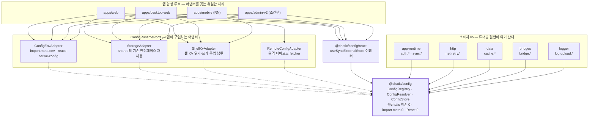
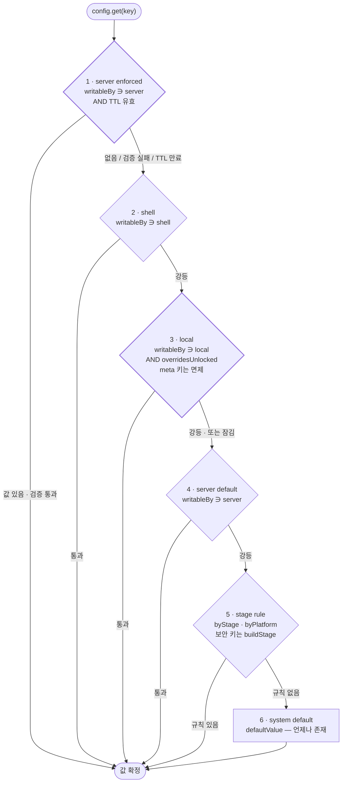
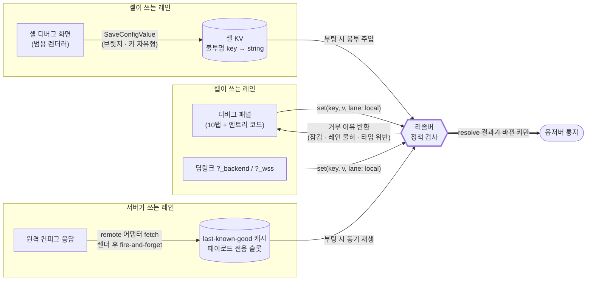
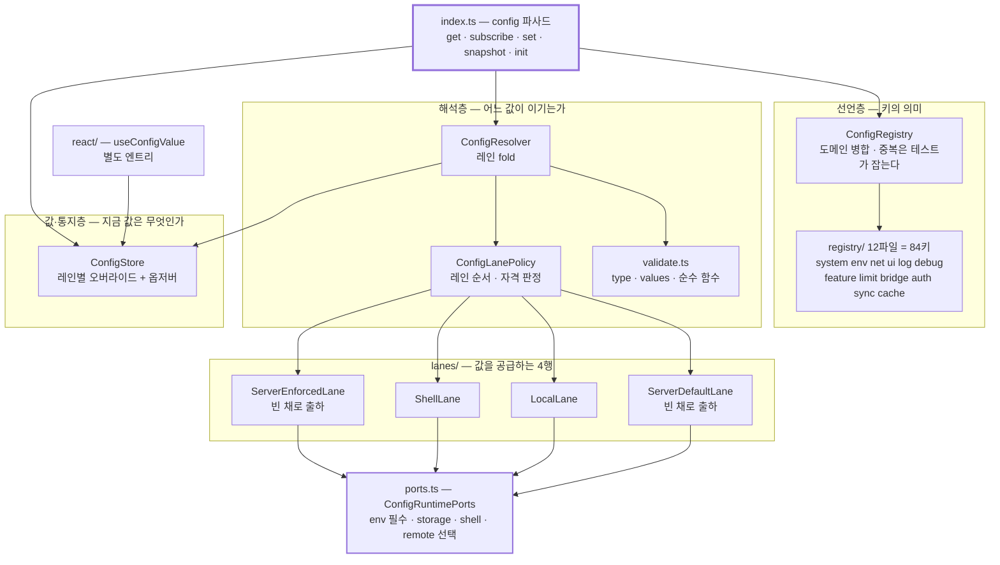

# ADR-0079: 설정은 하나의 레지스트리가 소유한다 — `@chatic/config` 레인 리졸버

> 상태: **Accepted** · 작성일: 2026-09-08 · 구현: 미착수
> 범위: `libs/web-config` → `libs/config` (신설·삭제 — **실제 importer는 `libs/app-runtime` 8파일뿐**,
> `apps/desktop-web`·`libs/shared`·`libs/http`의 언급은 주석이다) · `apps/web` · `apps/mobile` ·
> `libs/app-messages` (브릿지 op) · 튜너블 소비 lib (`http` · `data` · `bridges` · `logger`).
> **`apps/desktop-web`도 범위에 든다** (2026-09-09 지시로 수정 허용). 이관 대상은 `import.meta.env`
> 7파일 · `CHATIC_APP_*` 2파일 · `usePreferenceStore` 1파일이고, `@chatic/web-config` 언급은 주석뿐이다.
> **다만 되돌릴 수단이 없다** — desktop-web은 push로만 배포되고 수동 배포·원복 경로가 없으며 리포 CI에
> 테스트 워크플로 자체가 없다(빌드 워크플로만 둘). 그래서 이관은 마지막에 붙이고 수동 확인을 늘린다.
> `apps/admin-v2`는 **조건부** — 셸이 없어 셸·서버 레인이 무의미하므로 편입 여부는 미결 ⑤가 정한다.
> 수정: [ADR-0080](./0080-debug-panel-shared-model-and-stage-visibility.md)이 결정 3의 스키마(`meta` 추가)와
> `env.*`(`buildStage` 추가)를 수정한다 — 해당 위치에 표시했다.
> 관련: [preferenceKeys.ts](../../apps/web/src/app/stores/preferenceKeys.ts) ·
> [usePreferenceStore.ts](../../apps/web/src/app/stores/usePreferenceStore.ts) ·
> [web-config/src/env.ts](../../libs/web-config/src/env.ts) ·
> [logUploadSwitch.ts](../../apps/web/src/app/runtime/logging/logUploadSwitch.ts) ·
> [debugSettingsStore.ts](../../apps/mobile/src/app/stores/debugSettingsStore.ts)

> **이 문서는 피처 토글에 관한 이전 설계 문서를 참조하지 않는다** (지시). 맥락은 이전 결정이 아니라 현
> 트리에서 실측한 코드에서만 왔다. 실측 기준 커밋 `a6a428d4b` (2026-09-08).

> **용어 고정.**
> **키(key)** — 설정 항목 하나의 이름. `<도메인>.<이름>` 점 표기 (`log.upload.hold`, `ui.theme`).
> **레인(lane)** — 한 키의 값을 공급할 수 있는 원천 하나. 레인들은 고정된 우선순위로 정렬된다.
> **레지스트리(registry)** — 키의 _의미_(타입·기본값·규칙·정책)를 선언한 표. 값이 아니라 의미를 담는다.
> **셸(shell)** — 웹 콘텐츠를 감싸는 네이티브 호스트 (모바일 RN · 데스크톱 Electron). CONTEXT.md 정의.

## 맥락 (Context)

### 1. 설정 원천이 네 갈래로 흩어져 있고, 공통 접근자가 없다

| 원천                               | 규모                                                                | 접근자                            |
| ---------------------------------- | ------------------------------------------------------------------- | --------------------------------- |
| `import.meta.env` 직독             | `VITE_*` **20종**, **31파일** (web 12 · desktop-web 7 · admin-v2 7) | 없음 — 파일마다 직독              |
| 셸 주입 전역 `window.CHATIC_APP_*` | **20종**, 직독 **22파일** (web 14 · desktop-web 2 · libs 6)         | 14종만 `deviceInfoStore` (React)  |
| local/sessionStorage 플래그        | 로그 업로드 3키 · `?_backend`/`?_wss` 세션키 2                      | 파일별 사설 `readFlag`            |
| `PREFERENCES` 레지스트리           | **12키** + 448줄 zustand 스토어                                     | `usePreferenceStore` (React 전용) |

> **위 두 행의 실측 주의.** `VITE_*`를 substring으로 세면 `INVITE_LIST_LIMIT`·`MAX_INVITE_SELECTION` 같은
> 상수가 섞여 44종으로 부풀려진다. 단어 경계로 세면 웹 번들이 읽는 것은 **20종**이고, 별개로 Electron 메인
> 프로세스 전용 `MAIN_VITE_*` **8종**이 있다(범위 밖). 셸 주입 전역 20종 중 **14종은
> [`deviceInfoStore`](../../libs/device-utils/src/stores/deviceInfoStore.ts)가 이미 소유**한다 — 다만 React
> 전용이고 기기·버전 정체성만 덮으며, `CHATIC_APP_PLATFORM`은 그 밖에서 **11파일이 직독**한다.
> 전수 분류는 [레지스트리 키 제안](../spec/config-registry-keys.md)이 소유한다.

같은 개념이 두 벌로 갈라져 있다: 웹은 `PREFERENCES`+`usePreferenceStore`, 모바일은
`debugSettingsStore`(9필드, zustand persist). 어느 쪽도 상대를 모른다.

### 2. `web-config`는 이름만 config다

[env.ts](../../libs/web-config/src/env.ts) 193줄은 전부 env 해석이고, 값을 `export const`로 내보낸다 —
**임포트 시점에 동결되므로 런타임 변경이 구조적으로 불가능하다.** 그래서 런타임에 바뀌어야 하는 두 개
(`getDynamicRelayBackend` · `getDynamicRelayWss`)만 게터로 예외 처리돼 있다. 옵저버가 없는 것이 아니라,
**옵저버가 필요한 자리를 예외 두 개로 때운 상태다.**

### 3. 병목 세 개 — 이 구조를 깨지 않고는 요구사항을 만족할 수 없다

1. **모듈 로드 부수효과 순서 계약.** 임포트만으로 4단계(딥링크 쿼리 캡처 → 스토리지 어댑터 선택 →
   `?logout=1` 토큰 청소 → 상수 읽기)가 실행되고, 파일 주석이 "이 파일을 쪼개지 말라"고 못박고 있다.
   순수 TS로 가려면 이 계약을 **명시적 부트 호출로 해체**하는 것이 전제다.
2. **`import.meta` 소유권.** web-config가 리포의 유일한 `import.meta` 홀더라서 **자기 테스트가 불가능**하고
   (jest.config 없음) 소비자는 전부 모듈을 목한다 — `public-surface.test.ts`가 프록시로 목하는 이유다.
   동시에 이것이 모바일이 같은 코드를 못 쓰는 이유이기도 하다(RN은 `react-native-config`).
3. **옵션 스토어가 React에 묶여 있다.** 키 하나 추가에 편집 지점 5곳(레지스트리 · state 필드 · action ·
   `hydrate` 분기 · 파서)이고, `boot`/`transport` 같은 non-React 코드에서 읽을 수 없다.

### 4. 내구성 있는 토글 하나를 추가하는 비용 = 편집 4곳 + **앱 스토어 릴리스**

| 편집 지점                                                                                                          | 현재 크기 |
| ------------------------------------------------------------------------------------------------------------------ | --------- |
| `PreferenceKey` 유니온 ([preference.ts:5](../../libs/app-messages/src/types/model/preference.ts:5))                | 5개       |
| `BRIDGE_WRITABLE_PREFERENCE_KEYS` ([:19](../../apps/mobile/src/app/webview/hooks/usePreferenceCacheHandler.ts:19)) | 2개       |
| 같은 파일의 키별 `switch` 분기                                                                                     | —         |
| **앱 릴리스**                                                                                                      | 심사 대기 |

**웹은 앱보다 먼저 배포된다.** 그런데 내구성 있는 토글의 정의가 네이티브에 있으므로, 토글 하나 추가마다
앱 릴리스 사이클에 묶인다. 토글은 "빨리 켜고 끄려고" 만드는 것인데 이 결합이 존재 이유를 지운다.

### 5. `declare global`의 window 전역 9개는 전부 죽은 폴백이다

`env.ts`가 `window.ENV` · `PROJECT` · `REGION` · `OAUTH_ENDPOINT` · `HOST` · `IMAGE_API_ENDPOINT` ·
`SOCIAL_OAUTH_ENDPOINT` · `DOU_ENDPOINT` · `WS_ENDPOINT` 아홉 개를 선언하고 `window.X || import.meta.env.Y`
형태로 우선 읽는데, **아홉 개 모두 쓰는 코드가 0건이다.** `WEB_ENV`의 첫 항도, `getDynamicRelayBackend`의
`window.DOU_ENDPOINT` 항도 절대 실행되지 않는다.

이관에 두 가지를 뜻한다. 첫째, **엔드포인트·빌드 식별자에 실재하는 런타임 주입 경로는 없다** — 셸이 실제로
주입하는 것은 `CHATIC_APP_*` 20종뿐이다. 둘째, 이 선언과 폴백 체인은 이관에서 **되살릴 것이 아니라 지울
것**이다.

### 6. `?_backend`는 게이트 없이 백엔드를 바꾼다

`initEnvFromQueryParams`가 쿼리파라미터를 세션에 심고 `getDynamicRelayBackend`가 그것을 읽는다. PROD
번들에서도 링크 한 줄로 relay 백엔드를 갈아탈 수 있다. 오버라이드 정책이 없어서 생긴 구멍이다.

## 결정 (Decision)

### 결정 1 — `libs/config` (`@chatic/config`) 신설, `web-config`는 삭제한다

`@chatic` 의존 **0개**. 순수 TS. `import.meta`·`window`·`localStorage`·React·zustand·네트워크를 직접
만지지 않는다. 외부 세계는 전부 주입된 어댑터로만 닿는다(결정 8). 그 결과 **config는 의존 그래프의 최하단**
이고, 웹 3종과 모바일 RN이 같은 코드를 쓴다. shim은 남기지 않는다 — 이름만 바뀐 상태가 오래 남는 것이
이 개편이 고치려는 문제 그 자체다.

### 결정 2 — 하나의 key-value 레지스트리. env·엔드포인트도 여기에 들어온다

env·주입 전역·플래그·옵션을 **한 레지스트리**로 합친다. 엔드포인트는 "값 도메인이 string인 토글"로
취급한다 — 그러면 `?_backend`가 오버라이드 레인의 한 종류가 되고, 게터 예외 두 개가 사라지며, 오버라이드
규칙(우선순위·잠금)이 한 벌로 통일된다.

키가 80개를 넘으므로 레지스트리는 **도메인별 모듈로 분할**하고 부팅 시 병합한다.

**중복 키는 테스트에서 잡는다. 부팅은 죽이지 않는다.**

초안은 "중복 키는 부팅 실패"였다. 이유는 맞았다. 조용히 덮어쓰면 두 도메인이 같은 키를 다르게 해석하는
사고가 난다. 하지만 대가가 너무 크다. 키의 80%가 개발자용인데(§노출면 분포), **개발자용 키 하나를 잘못
넣으면 모든 사용자의 앱이 안 켜진다.** 디버그 실수가 사용자를 죽이는 것은 잘못된 교환이다.

그래서 검사를 두 곳으로 나눈다.

| 언제        | 무엇을                                   | 실패하면                                    |
| ----------- | ---------------------------------------- | ------------------------------------------- |
| **테스트**  | 12개 도메인을 합쳐 중복 키가 있는지 본다 | **테스트가 깨진다**                         |
| **실행 중** | 병합하다 중복을 만나면                   | 뒤에 온 키를 버리고 `logger.error`로 남긴다 |

실행 중 규칙은 하나다. **먼저 선언된 키가 이긴다.** 순서가 정해져 있으므로 결과가 기기마다 달라지지
않는다. 그리고 앱은 켜진다.

### 결정 3 — 키 선언 형태

```ts
type ConfigEntry<T> = {
    /** 패널이 점 표기 키 대신 보여줄 이름. 한국어 (ADR-0080 결정 3). */
    title: string;
    /** 무엇을 바꾸는 값인지 · 왜 있는지. 한 문장. */
    description: string;
    type: 'boolean' | 'string' | 'number' | 'enum' | 'json';
    /** enum일 때 허용 값 집합. "여러 설정값"이 여기서 표현된다. */
    values?: readonly T[];
    /** 시스템 기본값 — 어떤 레인도 값을 주지 않을 때의 답. */
    defaultValue: T;
    /** 빌드·스테이징에 따라 기본값을 바꾸는 규칙표. `Stage`는 `LOCAL|DEV|PROD` 셋뿐 — 결정 14. */
    byStage?: Partial<Record<Stage, T>>;
    byPlatform?: Partial<Record<Platform, T>>;
    /**
     * 어느 화면에 노출되는가. 도메인(주제)·`writableBy`(쓰기 경로)와 직교하는 세 번째 축이다.
     *
     *  'user'     설정 화면. 일반 사용자가 켜고 끈다 (테마 · 언어 · 메시지 미리보기).
     *  'labs'     설정 화면의 실험실 구획. 사용자가 켤 수 있고, 기본 off이며, 서버가 끌 수 있어야 한다.
     *  'dev'      디버그 패널에만. 잠금 해제가 전제.
     *  'internal' 어떤 화면에도 컨트롤이 없다. 코드가 읽거나 제품 UI가 자기 흐름으로 쓴다.
     */
    surface: 'user' | 'labs' | 'dev' | 'internal';
    /** 어느 레인이 이 키를 쓸 수 있는가. 정책이며 오버라이드 대상이 아니다(결정 6). */
    writableBy: readonly ('shell' | 'local' | 'server')[];
    /** 'shell' = 셸 KV에 영구 저장, 'local' = localStorage, 'session' = sessionStorage, 'none' */
    persist: 'shell' | 'local' | 'session' | 'none';
    /**
     * 값 변경이 실제로 듣는 시점. 기본 'live'.
     *
     * 모든 값이 즉시 듣지는 않는다 — SDK 생성 시점에 넘어가는 인증 옵션은 재접속해야 적용된다. 표시하지
     * 않으면 디버그 패널이 "껐다"고 말하는데 실제로는 안 꺼진 상태가 되고, 그건 표가 없는 것보다 나쁘다.
     */
    appliesAt?: 'live' | 'reconnect' | 'restart';
    /**
     * 범용 패널(결정 9)이 이 키의 편집 UI를 렌더하지 않는다. 전용 플로우만 쓸 수 있다.
     *
     * `writableBy`와 다른 축이다 — 그것은 "어느 레인이 쓸 수 있나"이고, 이것은 "쓰기 전에 무엇을
     * 증명해야 하나"가 레지스트리 밖에 있음을 표시한다. 없으면 잠금을 풀어야 들어가는 패널이 잠금을
     * 푸는 스위치를 담는 순환이 생긴다 (ADR-0080 결정 6에서 추가).
     */
    meta?: boolean;
};
```

`appliesAt`은 2차 스윕(튜너블)에서 필요성이 드러났다 — 근거와 해당 키 목록은
[레지스트리 키 제안 §스키마 확장](../spec/config-registry-keys.md)이 소유한다.
**이것은 UI를 위한 서술 메타데이터이고 집행 장치가 아니다** — config는 `'reconnect'` 키가 바뀌어도 재접속을
강제하지 않고, 옵저버는 평소처럼 발화한다. 값을 실제로 태우는 것은 소비자(예: 소켓 재생성)의 책임이고,
`appliesAt`은 패널이 "재접속 후 적용"이라고 정직하게 말하게 하는 용도다.

토글은 boolean만이 아니다. `type`+`values`가 값 도메인을 선언하고, `defaultValue`가 시스템 기본값,
`byStage`/`byPlatform`이 빌드·스테이징에 따른 기본값 변경을 담당한다. 현행 `PreferenceEntry`의
`strategy`는 `persist`로, 키별 저장 위치 선택이라는 역할은 그대로 이어진다. `defaultValue`라는 이름도
그 타입에서 왔다 — [preferenceKeys.ts](../../apps/web/src/app/stores/preferenceKeys.ts)가 이미 쓰는
이름이므로 `default`로 바꾸지 않는다(결정 12).

**`title`/`description`이 결정 9를 실제로 성립시킨다.** 셸의 범용 패널이 봉투를 그대로 렌더할 때, 이
둘이 없으면 화면에 `sync.resume.initialCooldownMs`라는 점 표기 키가 그대로 뜬다 — QA가 쓸 수 없다. 선언에
사람이 읽을 이름과 한 문장 설명이 붙어 있으면 **셸은 키별 코드를 한 줄도 갖지 않고도** 쓸 만한 화면을
그린다. "새 토글 추가에 앱 릴리스 0회"가 저장뿐 아니라 UI에서도 참이 되는 지점이다.

#### 유형은 한 축이 아니라 세 축이다

"이건 무슨 종류의 설정인가"에 답이 하나뿐일 것 같지만, 실제로는 **서로 독립인 질문 셋**이고 하나로
합치면 반드시 어긋난다. `ui.theme`(사용자 설정)과 `log.upload.hold`(디버그 레버)는 도메인 접두만 다르고
나머지는 구분이 없었다 — 도메인이 주제와 노출면을 겸직하다 실패하던 자리다.

| 축            | 필드            | 답하는 질문                     | 값                                       |
| ------------- | --------------- | ------------------------------- | ---------------------------------------- |
| **주제**      | 키 접두(도메인) | 무엇에 관한 값인가              | `ui.` · `net.` · `log.` · `auth.` … 12개 |
| **노출면**    | `surface`       | **누구 화면에 컨트롤이 뜨는가** | `user` · `labs` · `dev` · `internal`     |
| **쓰기 경로** | `writableBy`    | 어느 레인이 값을 넣을 수 있는가 | `shell` · `local` · `server`             |

셋이 정말 직교한다는 것은 예로 보인다.

| 키                               | 주제   | 노출면     | 쓰기 경로                    |
| -------------------------------- | ------ | ---------- | ---------------------------- |
| `ui.theme`                       | `ui`   | `user`     | `shell` · `local`            |
| `ui.pinnedChannels`              | `ui`   | `internal` | `local`                      |
| `net.relay.backend`              | `net`  | `dev`      | `local`                      |
| `net.oauth.endpoint`             | `net`  | `internal` | (없음)                       |
| `sync.profile.channelIntervalMs` | `sync` | `dev`      | `shell` · `local` · `server` |

같은 도메인(`ui`)이 `user`와 `internal`로 갈리고, 같은 노출면(`dev`)이 서로 다른 도메인에 걸친다.
한 축으로는 표현할 수 없다.

**"서버가 제어하는 기능"은 노출면이 아니라 쓰기 경로다.** 원격 제어는 사람이 보는 화면과 무관한
성질이라 `writableBy ∋ 'server'`가 이미 답하고 있고, `surface`에 값을 하나 더 만들면 "서버도 끌 수 있는
사용자 실험실 기능"을 표현할 수 없게 된다 — 그것이 정확히 `labs`가 필요한 이유다.

**조합 검증 규칙.** 세 축을 이렇게 짝지으면 말이 안 된다. 중복 키와 같은 방식으로 다룬다 — **테스트가
막고, 실행 중에는 그 키만 버리고 로그를 남긴다.**

- `surface: 'user' | 'labs'`인데 `writableBy ∌ 'local'` → 사용자가 못 쓰는 사용자 설정.
- `surface: 'user' | 'labs'`인데 `meta: true` → 범용 화면이 안 그리는데 노출면이 있다고 선언.
- **`surface: 'labs'`인데 `writableBy ∌ 'server'`** → 원격으로 끌 수 없는 실험. 실험실 기능은
  사용자에게 나가는 미완성 기능이므로, 서버 킬 없이 켜는 것을 금지한다.

**실험실은 지금 비어 있다.** `labs`는 이 설계가 여는 슬롯이고 오늘 해당하는 키는 0개다. 현행
`feature.*` 6개는 전부 `byStage`로 개발 빌드에만 열린 `dev`이며, 그중 사용자에게 내보낼 것이 생기면
`surface`를 `labs`로 바꾸고 `writableBy`에 `'server'`를 더하는 것이 승격 절차다.

#### 선언과 런타임 값을 한 타입에 담지 않는다 — `ConfigSnapshot`

"설정 하나를 한 타입으로"는 옳은 요구인데, **현재 값을 `ConfigEntry`에 넣으면 레지스트리가 가변이 된다.**
그러면 결정 6(정책은 오버라이드 대상이 아니다)을 강제할 구조가 사라지고, 같은 엔트리 객체를 읽는 두
소비자가 서로의 변경을 본다. 레지스트리는 §용어 고정대로 "값이 아니라 의미"를 담아야 한다.

대신 **한 키의 지금 상태 전부를 담는 읽기 전용 뷰**를 리졸버가 만든다. 이름은 리포에 8개 있는
`*Snapshot`(`SocketAuthSnapshot` · `CloudSessionSnapshot` · `CacheMetricsSnapshot`)에서 왔고, 그 셋 다
"상태의 읽기 전용 런타임 뷰"라는 같은 역할이다.

```ts
interface ConfigSnapshot<T> {
    key: ConfigKey;
    /** 선언 그대로 — title · description · defaultValue · 정책. 얼어 있다. */
    entry: ConfigEntry<T>;
    /** resolve 결과. 언제나 존재한다. */
    value: T;
    /** 몇 행이 이겼는가. 'default'는 6행. */
    lane: Lane | 'default';
    /** 기본값(5·6행)이 아닌 것이 이겼는가 — 패널이 "변경됨" 표시에 쓴다. */
    isOverridden: boolean;
    /** 지금 이 기기에서 실제로 쓸 수 있는 레인. 잠금·플랫폼이 반영된 결과라 `writableBy`와 다르다. */
    canWrite: readonly Lane[];
}
```

패널은 `surface`로 자기 것만 골라낸 뒤, 이 객체 하나만 받으면 행 하나를 완성할 수 있다 — 이름, 설명, 현재 값, 기본값, 어느 행이 이겼는지,
편집 가능한지, 언제 적용되는지(`entry.appliesAt`). `canWrite`가 `writableBy`와 별개인 것이 요점이다:
선언은 "원칙적으로 어느 레인이 쓸 수 있나"이고, 스냅샷은 "**지금 이 기기에서** 쓸 수 있나"라서 PROD 잠금과
셸 부재가 반영된다. 패널이 못 쓰는 컨트롤을 활성으로 그리는 일이 이걸로 사라진다.

### 결정 4 — 레인 리졸버. 우선순위는 고정된 표 하나다

```
resolve(key):
  1. server enforced   서버가 enforced로 내린 값 (킬스위치)     writableBy ∋ 'server'
  2. shell             셸이 주입·저장한 값                      writableBy ∋ 'shell'
  3. local             웹 오버라이드 (디버그 패널·딥링크)        writableBy ∋ 'local' AND overridesUnlocked
  4. server default    서버가 내린 기본값                       writableBy ∋ 'server'
  5. stage rule        byStage / byPlatform  (Stage = LOCAL|DEV|PROD, 결정 14)
  6. system default    default
```

리졸버는 이 배열에 대한 fold 하나다. 레인마다 특수 코드가 없고, 새 레인은 배열에 행을 더하는 일이 된다.
어떤 레인의 값이든 **레지스트리의 `type`/`values`로 검증하고, 통과하지 못하면 그 레인을 건너뛴다** — 손상된
저장값이나 오래된 서버 페이로드가 화면을 깨는 대신 다음 레인으로 강등된다.

> **불변조건 (킬 스위치 격리).** 1행은 **다른 레인보다 먼저, 혼자서** 평가한다. 2~6행이 무엇을 하든
> 1행의 답을 바꾸지 못한다. 1행이 보는 것은 캐시된 페이로드 · 그 키의 `writableBy` · TTL 셋뿐이며,
> `byStage`도 `byPlatform`도 저장소도 셸도 보지 않는다.
>
> 이유는 킬 스위치의 목적이다. **킬 스위치는 다른 게 다 망가졌을 때 쓴다.** 자기가 끄려는 것과 같은
> 코드를 지나가면 그때 같이 죽는다. 그래서 가장 짧고 의존이 적은 경로를 준다.
>
> 반대 방향도 정해둔다. **1행 자신이 실패하면 다음 행으로 넘어간다.** 오류를 만났다고 전부 꺼버리면
> 그게 더 큰 사고다. 즉 킬은 확실히 켜지되, 고장 났을 때는 조용히 빠진다.

> **불변조건 (순환 차단).** **`meta: true` 키에는 3행의 잠금 게이트를 적용하지 않는다.**
>
> 이유는 이들이 잠금 장치 그 자체이기 때문이다. `system.overridesUnlocked`를 resolve하는데 3행이 다시
> `overridesUnlocked`를 요구하면 무한 재귀가 된다. `meta` 키는 잠금 게이트가 아니라 **전용 플로우**
> (10탭 + 입장 코드)가 지키므로, 게이트를 겹쳐 적용할 이유도 없다.
>
> 같은 표시가 두 가지 일을 한다. 결정 9에서는 "범용 패널이 이 키를 그리지 않는다"이고, 여기서는 "잠금
> 게이트의 적용 대상이 아니다"이다. 둘 다 **"이 키는 잠금 장치의 일부"**라는 한 사실에서 나온다.
> 리졸버가 이 규칙을 지키는지는 테스트로 고정한다.

> **5행이 보는 스테이지는 두 개다.** 보안 성질을 갖는 `byStage`(`debug.*` · `system.*`)는 위조 불가한
> `env.buildStage`로, 그 외는 `env.stage`로 판정한다
> ([ADR-0080 결정 5](./0080-debug-panel-shared-model-and-stage-visibility.md)).

서버 레인이 **두 행으로 갈라진 것**이 요점이다. 원격 컨피그의 통상 의미는 "기본값 조정"이므로 로컬
오버라이드보다 아래(4행)에 있어야 개발자가 자기 기기에서 실험할 수 있다. 반면 킬스위치는 로컬 오버라이드가
잘못된 기기까지 되돌려야 하므로 전부보다 위(1행)여야 한다. 두 요구가 다르므로 두 행이며, 페이로드의
`enforced` 플래그가 어느 행에 앉을지 결정한다.

### 결정 5 — 잠금도 피처 토글이다. 특수 장치를 만들지 않는다

```ts
'system.overridesUnlocked': {
    title: '오버라이드 잠금 해제',
    description: '웹 오버라이드 레인(3행)을 살린다. 10탭 + 입장 코드로 연다.',
    type: 'boolean',
    defaultValue: true,
    byStage: { PROD: false },   // PROD는 fail-closed
    surface: 'dev',
    writableBy: ['shell', 'local'],  // 지금과 같다 — 웹이 연다. 서버는 못 건드린다
    persist: 'session',              // 수명도 지금과 같다 (아래)
    meta: true,
}
```

PROD에서 웹 오버라이드 레인은 죽어 있다 — §맥락 6의 `?_backend` 구멍이 여기서 닫힌다. 이 리포의 스테이지는
`LOCAL` · `DEV` · `PROD` 셋뿐이므로(결정 14) 닫을 대상도 `PROD` 하나다.

**여는 방법은 지금과 같다 — 웹의 10탭 + 입장 코드다.**

초안은 `writableBy: ['shell']`로 "앱만 풀 수 있다"고 했다. 근거는 "리모콘은 잃어버릴 수 있고 링크 한 줄이
곧 리모콘"이었는데, **비유가 틀렸다.** 잠금 해제는 URL이 아니라 **제스처와 코드**다. 링크로는 못 한다.

실측하면 더 분명하다. 앱에서 `debugModeEnabled`를 켜는 곳은 브릿지 메시지 핸들러 하나뿐이다
([usePerfHandler.ts:30](../../apps/mobile/src/app/webview/hooks/usePerfHandler.ts:30)). **앱에는 독자적인
잠금 해제 경로가 없다.** 지금도 웹이 유일한 열쇠이고, 초안대로 가면 없던 앱 전용 제스처를 새로 만들어야
한다 — 얻는 것 없이 표면만 늘어난다.

**수명도 지금 그대로 쓴다.** `persist: 'session'`이라 탭이 닫히면 사라지고, 웹이 부팅할 때 앱에도 꺼짐을
보낸다(`main.tsx`가 이미 그렇게 한다). 그래서 언락은 "다음 웹 부팅까지" 산다. 초안이 셸 KV에 영구 저장하려던
것을 되돌린 것이고, 그 결과 "언락이 재시작을 넘어 살아남는다"는 위험도 같이 사라진다.

**서버는 여전히 못 쓴다.** 원격 *잠금*은 안전한 방향이지만 원격 *해제*는 아니다. 원격에서 개별 키를 막고
싶으면 결정 4의 enforced 레인이 더 정확한 수단이다.

### 결정 6 — 정책은 오버라이드 대상이 아니다 (불변조건)

`writableBy` · `type` · `values` · `persist`는 레지스트리에 하드코딩되며 **어떤 레인도 바꿀 수 없다.**
값만 런타임 가변이다. 이것이 없으면 오버라이드가 자기에게 레인을 부여할 수 있고 결정 5가 무의미해진다.

### 결정 7 — 순수 TS 옵저버 코어 + 별도 엔트리의 React 어댑터

공개 표면은 `runtime` 파사드와 같은 형태다 — 흩어진 export 함수가 아니라 클래스를 묶은 파사드
하나(결정 12):

```ts
config.get<T>(key): T                                  // 동기. 언제나 값이 있다 (최소 system default)
config.subscribe(keys, listener): () => void            // 해당 키의 resolve 결과가 바뀔 때만 통지
config.set(key, value, { lane: 'local' }): SetResult    // 정책 위반은 던지지 않고 거부 이유를 반환
config.init(ports): void                                // 어댑터 주입 (결정 8)
config.snapshot<T>(key): ConfigSnapshot<T>              // 한 키의 지금 상태 전부 (결정 3)
config.snapshotAll(): readonly ConfigSnapshot<unknown>[] // 패널·로그 컨텍스트가 쓴다
```

`subscribe`는 **resolve 결과 변화**에만 발화한다 — 낮은 레인의 값이 바뀌어도 높은 레인이 이기고 있으면
통지하지 않는다. 그래야 관측자가 "지금 유효한 값"만 보게 된다.

React 바인딩은 `@chatic/config/react` **별도 엔트리**에 `useSyncExternalStore`로 얹는다. 코어를 React-free로
유지하는 것이 목적이고, 어댑터를 앱 4곳에 복제하지 않으려고 lib에 둔다. zustand는 쓰지 않는다 — 코어가
프레임워크 무지여야 non-React 소비자(`boot` · `transport` · 로그 파이프라인)가 읽을 수 있다.

### 결정 8 — 외부 세계는 `ConfigRuntimePorts` 하나로만 닿는다

인터페이스는 `ports.ts` 한 모듈이 소유하고, **없는 멤버는 "배선되지 않음"을 뜻한다** —
[`HttpRuntimePorts`](../../libs/http/src/ports.ts)가 이미 쓰는 관례를 그대로 따른다(결정 12).

```ts
export interface ConfigRuntimePorts {
    /** 빌드 사실: stage · buildStage · platform · project · region + 원시 env 조회. 필수. */
    env: IConfigEnvAdapter;
    /** local/session 오버라이드 저장소. 없으면 로컬 레인은 메모리에만 산다. */
    storage?: StorageAdapter; // @chatic/shared의 기존 인터페이스를 재사용한다
    /** 셸 KV 읽기·쓰기 + 부팅 주입 봉투. 없으면 셸 레인이 비활성. */
    shell?: IShellKvAdapter;
    /** 원격 페이로드 fetcher. 없으면 서버 레인 두 행이 비활성 (결정 10). */
    remote?: IRemoteConfigAdapter;
}
```

`Stage`·`Platform`은 반대로 **복제한다** — `app-messages`를 임포트하면 브릿지 계약 전체에 묶이기
때문이며, 근거와 드리프트 방어는 결정 14가 소유한다.

`storage`가 새 타입이 아닌 것이 중요하다 — [`StorageAdapter`](../../libs/shared/src/utils/storage.ts)
(`getItem`/`setItem`/`removeItem`)가 이미 리포의 저장소 인터페이스이고, config는 그 **모양만** 요구한다.
`@chatic/shared`를 임포트하지 않고 구조적 타입으로 받으므로 결정 1의 "의존 0"이 유지된다.

앱 엔트리가 어댑터를 꽂는다. 웹 어댑터가 `import.meta.env`+`window.*`를 읽고, RN 어댑터가
`react-native-config`를 읽는다. **이것이 §맥락 3-2를 해소한다** — `import.meta`가 앱 경계로 밀려나므로
config 자신이 ts-jest로 테스트 가능해지고, 소비자가 모듈을 목할 이유가 없어진다.

### 결정 9 — 셸은 의미를 모르는 범용 KV 창고 + 주입기가 된다

정의는 웹(config)이 소유하고, **저장과 주입은 셸이 소유한다.** 셸은 `key → string`을 불투명하게 저장하고
부팅 시 봉투를 통째로 주입한다 — 어떤 키가 무슨 뜻인지 알 필요가 없다. 그래서 **새 토글 추가에 앱 릴리스가
0회**다. 셸의 디버그 화면도 키별 코드가 아니라 **`ConfigSnapshot` 목록을 렌더하는 범용 화면**이 되어 같이 풀린다 —
이름·설명·현재 값·기본값·적용 시점이 전부 스냅샷 안에 있으므로 셸은 키를 하나도 알 필요가 없다(결정 3).
**단 `meta: true` 키는 렌더하지 않는다** — 그러지 않으면 패널이 자기를 여는 스위치를 담는다
(결정 3의 `meta`, [ADR-0080](./0080-debug-panel-shared-model-and-stage-visibility.md) 결정 6).

**앱에 쓰는 것은 답을 받는다.** `SaveConfigValue`는 보내고 끝이 아니라 확인을 받고, 실패하면 한 번 다시
보내고, 그래도 안 되면 화면에 "저장 못 함"을 알린다. 조용히 성공한 척하면 화면은 "껐다"고 하는데 실제로는
안 꺼진 상태가 생긴다. 이 코드는 같은 문제를 이미 겪었다 — 테마만 예외로 확인 응답과 재시도를 쓰고 있고,
그 주석이 "쓰기가 사라지면 스스로 못 고치는 유일한 설정"이라 적어두었다. 설정 값은 전부 그 성질이다.
근거가 되는 그림은 [ADR-0080 결정 10](./0080-debug-panel-shared-model-and-stage-visibility.md)이 소유한다.

이를 위해 `libs/app-messages`에 **키 자유형 op을 새 메시지 타입으로** 추가한다
(`FetchConfigBag` / `SaveConfigValue` / `ClearConfigValue`). 구 셸은 이 타입을 모르므로 `NOT_FOUND`
학습 폴백으로 기존 `SavePreference` 5키 경로로 강등한다 — 웹이 앱보다 먼저 배포되는 제약의 필수 대가다.
기존 `PreferenceKey` 유니온과 화이트리스트는 그 폴백 경로로만 남고, 설치 기반이 넘어간 뒤 은퇴한다.

### 결정 10 — 서버 레인 규격

**페이로드.**

```ts
type RemotePayload = {
    schemaVersion: number; // 클라이언트가 아는 범위 밖이면 페이로드 전체 무시
    ttlSec: number; // 이 응답의 유효 수명
    entries: Record<string, { value: unknown; enforced?: boolean }>;
};
```

**전송은 config 밖에 있다.** `IRemoteConfigAdapter`는 `fetch(): Promise<RemotePayload>` 하나이고, 앱 합성 루트가
`@chatic/http`로 만들어 꽂는다. config는 네트워크 의존이 0이며 의존 그래프 최하단에 머문다(결정 1).

**부팅 순서와 실시간 반영.** 원격 응답은 첫 페인트 뒤에 온다. 그래서 페이로드는 **last-known-good으로
캐시되고 다음 부팅에 동기로 재생된다.** 캐시는 **페이로드 전용 저장 슬롯 하나**를 쓴다 — 셸이 있으면 셸 KV,
없으면 localStorage. 결정 3의 `persist`와 혼동하지 말 것: 그것은 **키별 오버라이드**가 어디 저장되는지를
선언하고, 원격 페이로드는 키가 아니라 **한 덩어리**라서 어떤 키의 `persist`도 이것을 결정하지 않는다. 레인은 캐시를 읽고, 갱신이
도착하면 캐시를 갈아치우며 옵저버를 발화시킨다 — 이것이 "실시간 반영"의 실체이며, 매 부팅이 원격 없는
상태로 시작해 세션 중간에 값이 뒤집히는 깜빡임을 막는다. fetch는 렌더 후 fire-and-forget이며 **부팅을
절대 막지 않는다.**

**staleness.** 캐시는 `fetchedAt`+`ttlSec`을 들고 다닌다. TTL 초과 시:

- **default 엔트리(4행)** — 계속 쓴다. 기본값 조정일 뿐이고, 오래된 기본값이 없는 것보다 낫다.
- **enforced 엔트리(1행)** — **버린다.** 이것이 잘못된 킬 푸시의 자기치유이고, 서버에 닿지 못하는 기기가
  영구히 잠기지 않는 보장이다. 서버가 킬을 멈추면 TTL 만료로 저절로 풀린다.

**실패·불일치 폴백.** fetch 실패 → 캐시 유지, 통지 없음, 백오프 재시도. `schemaVersion` 불일치 → 페이로드
전체 무시하고 last-known-good 유지. 모르는 키 → 무시(웹이 서버보다 구버전일 수 있다). 아는 키의 잘못된
값 → 그 엔트리만 검증 실패로 강등(결정 4).

**서버가 못 쓰는 키.** `writableBy`에 `'server'`가 없으면 서버 값은 거부된다. 대표적으로 **엔드포인트 키와
`system.*`** — 원격 컨피그가 백엔드 주소를 갈아치우거나 잠금을 푸는 수단이 되어서는 안 된다. `auth.sdk.*`
(원격 오조작이 갱신 폭주를 만들고, 되돌릴 때는 이미 백엔드가 부하 중)와 `log.collection.enabled`
(프라이버시 opt-out은 서버가 되돌릴 수 없어야 한다)도 제외된다. **전수는
[레지스트리 키 제안](../spec/config-registry-keys.md)이 소유한다** — 이 문단은 예시이며 목록이 아니다.

#### 지금 출하하는 것과 미루는 것 — 레인은 비어 있는 채로 완성한다

원격 컨피그는 **이번에 도입하지 않는다.** 다만 나중에 어댑터 하나만 꽂으면 되도록 자리를 완성해 둔다.

**원칙: 레인이 나중에 "추가"되면 안 된다.** 1·4행이 훗날 우선순위 배열에 끼어들면 그 순간 모든 키의
resolve 결과가 바뀔 수 있고, 그 변화는 이미 배포된 기기에서 조용히 일어난다. 대신 두 레인을 **1단계에
자리까지 넣고 비운다** — 어댑터가 없으면 값을 내놓지 못해 항상 다음 행으로 강등되므로 동작은 오늘과
같고, 어댑터가 생기면 `ConfigLanePolicy`도 `ConfigResolver`도 **한 줄도 바뀌지 않는다.**

| 1단계에 출하 (지금)                                         | 미룸 (어댑터가 올 때)        |
| ----------------------------------------------------------- | ---------------------------- |
| `IRemoteConfigAdapter` 인터페이스 + `RemotePayload` 타입    | 구현체                       |
| 레인 1·4를 우선순위 배열에 **등재** (어댑터 없으면 빈 레인) | fetcher · 폴링 주기 · 백오프 |
| 84키의 `writableBy ∋ 'server'` 판정을 **미리 확정**         | —                            |
| `system.remote.enabled` (기본 `false`)                      | —                            |
| 캐시 슬롯 이름 · 봉투 형태 · `schemaVersion: 1` **예약**    | 실제 캐시 쓰기               |
| 페이크 어댑터로 두 레인을 통과시키는 **계약 테스트**        | —                            |

**계약 테스트가 이 장치의 핵심이다.** 한 번도 실행되지 않는 코드 경로는 처음 쓰는 날 반드시 깨져 있다.
1단계에 `IRemoteConfigAdapter`를 구현한 **페이크**를 테스트에 꽂아 `enforced`가 로컬 오버라이드를 이기는지,
`default`가 로컬에 지는지, TTL 만료 시 `enforced`만 버려지는지를 검증한다. 실제 원격은 없지만 **레인은
살아 있는 채로 출하된다.**

**`writableBy` 판정을 미루지 않는 이유.** "어느 키를 서버가 만질 수 있는가"는 보안 판단이다. 어댑터가
붙는 날에 84키를 한꺼번에 감사하게 두면, 그날은 대개 무언가 급한 날이라 판단이 거칠어진다. 지금
[레지스트리 키 제안](../spec/config-registry-keys.md)이 이미 정해 두었다.

**스위치가 둘인 것도 의도다.** 어댑터가 꽂혀도 `system.remote.enabled`가 `false`면 레인은 여전히 비어
있다. 배선과 개시가 분리되어 있어, 어댑터를 먼저 머지하고 켜는 것은 나중에 결정할 수 있다.

**벤더는 어댑터가 흡수한다.** `IRemoteConfigAdapter`는 `fetch(): Promise<RemotePayload>` 하나뿐이고
벤더 개념이 없다. 원격 소스가 무엇이든(자체 API · Firebase Remote Config · 그 외) 그 응답을
`RemotePayload`로 옮기는 것이 어댑터의 일이며, config는 벤더를 모른다. 이 리포에는 이미 FCM용 Firebase
프로젝트가 있어 Remote Config가 현실적인 후보지만, **그 선택은 이 문서가 하지 않는다** — 포트가 열려
있다는 것만이 이 결정의 내용이다.

### 결정 11 — 모듈 로드 부수효과 4단계를 해체한다

| 현행 (임포트 시 자동 실행)        | 이관 후                                                                       |
| --------------------------------- | ----------------------------------------------------------------------------- |
| `initEnvFromQueryParams()`        | **딥링크 → 로컬 레인 쓰기**로 일반화. 정책(`writableBy`·잠금)을 통과해야 한다 |
| `setStorageAdapter(localStorage)` | 앱 엔트리가 `config.init({ storage })`로 주입 (결정 8)                        |
| `clearTokensOnLogout()`           | **config 밖으로.** 세션 위생이지 설정이 아니다 — 앱 부트로 이동               |
| `WEB_*` 상수                      | 레지스트리 키 + `config.get()`                                                |

`?_backend`의 초대링크 예외 처리(현행 `isInviteLink` 분기)는 의미가 유지된다: 초대링크의 `_backend`는 릴레이
주소가 아니라 클라우드 주소이므로 로컬 레인에 쓰지 않고, 오염된 탭을 위한 청소도 그대로 남는다.

### 결정 12 — 구조와 네이밍은 리포의 기존 관례를 따른다. 새 어휘를 발명하지 않는다

이 문서의 초안은 `StorageSeam` · `ShellSeam` · `RemoteSeam`이라는 이름을 썼다. **`*Seam`은 리포에 0개다** —
새 lib을 일관성 있게 만든다면서 새 어휘를 들여오는, 정확히 이 개편이 고치려는 종류의 실수였다. 아래는
현 트리 실측(고유 심볼 이름 기준, `apps` + `libs`)이고, config의 모든 이름을 여기서 가져온다.

| 관례            | 실측 | 대표 선례                                                       | config에서 맡는 역할                         |
| --------------- | ---- | --------------------------------------------------------------- | -------------------------------------------- |
| `I*` 인터페이스 | 107  | `ICredentialRecoveryRegistry` + `CredentialRecoveryRegistry`    | 주입 포트의 인터페이스 (결정 8)              |
| `*Service`      | 45   | `LogUploadQueueService`                                         | (config에는 없음 — 서비스 계층이 아니다)     |
| `*Store`        | 19   | `deviceInfoStore` · `flagOverrideStore`                         | **`ConfigStore`** — 값 보관 + 옵저버         |
| `*Adapter`      | 11   | `StorageAdapter` · `NativeBridgeAdapter` · `SessionAuthAdapter` | **주입되는 구현체 4종**                      |
| `*Policy`       | 5    | `UploadRetryPolicy` · `SessionStalenessPolicy`                  | **`ConfigLanePolicy`** — 레인 표 + 자격 판정 |
| `*Registry`     | 4    | `CredentialRecoveryRegistry` · `AuthIdRegistry`                 | **`ConfigRegistry`** — 키의 의미             |
| `*Resolver`     | 1    | (약한 선례)                                                     | **`ConfigResolver`** — 레인 fold             |
| `ports.ts`      | 1    | [`HttpRuntimePorts`](../../libs/http/src/ports.ts)              | **`ConfigRuntimePorts`** (결정 8)            |
| `*Seam`         | 0    | —                                                               | **쓰지 않는다**                              |
| `*Strategy`     | 0    | —                                                               | **쓰지 않는다**                              |

> 실측 방법은 고유 심볼 **이름** 수다. ADR-0076의 네이밍 표는 같은 접미사를 **등장 횟수**로 세어 훨씬 큰
> 숫자(`*Adapter` 265 등)를 적었다 — 두 표를 비교할 때 방법이 다름을 알아야 한다.

**클래스로 묶고, 순수 헬퍼만 `utils/`에 둔다.** 리포는 `I*`+클래스 쌍 107개가 말하듯 로직을 클래스에
담는다. 흩어진 export 함수 집합은 만들지 않는다 — `get`/`set`/`subscribe`가 모듈 함수로 흩어지면 상태
소유자가 보이지 않고 테스트가 모듈 목에 의존하게 되며, 그것이 지금 `web-config`의 문제다(§맥락 2).

**공개 표면은 파사드 하나다.** `runtime.<그룹>.*`([app-runtime](../../libs/app-runtime/src/index.ts))와 같은
형태로 `config.*` 하나만 내보내고, 내부 클래스는 배럴에 노출하지 않는다. 소비자가 `ConfigResolver`를 직접
잡으면 레인 정책을 우회할 수 있다.

#### 모듈 배치

```
libs/config/src/
  index.ts              ConfigFacade 인스턴스 하나 (`config`)만 내보낸다
  ports.ts              ConfigRuntimePorts + I*Adapter 인터페이스 (결정 8)
  types.ts              ConfigEntry · Stage · Platform · Lane · SetResult
  registry/
    index.ts            ConfigRegistry — 도메인 모듈 병합, 중복 키는 throw (결정 2)
    system.ts  env.ts  net.ts  ui.ts  log.ts  debug.ts  feature.ts  limit.ts
    bridge.ts  auth.ts  sync.ts  cache.ts
  resolve/
    ConfigLanePolicy.ts  레인 순서 + 자격 판정 + 3행 단축 평가 불변조건 (결정 4)
    ConfigResolver.ts    레인 fold
    validate.ts          type/values 검증 — 순수 함수
  store/
    ConfigStore.ts       현재 값 + 레인별 오버라이드 + 옵저버 통지
  lanes/
    ShellLane.ts  LocalLane.ts  RemoteLane.ts  StageLane.ts
  utils/                순수 헬퍼만 (키 파싱, 봉투 직렬화)
  react/index.ts        별도 엔트리 — useConfigValue (useSyncExternalStore)
```

레지스트리 도메인 파일 12개가 §결정 2의 "도메인별 모듈 분할"의 실물이고, `lanes/` 4개가 결정 4 표의
1·2·3·4행이다(5·6행은 레지스트리 선언이라 레인 클래스가 없다).

#### 확장 지점 — 무엇을 늘릴 때 무엇을 만지는가

이 표가 "확장성"의 검증 가능한 형태다. **오른쪽 열이 한 칸을 넘으면 설계가 실패한 것이다.**

| 늘리는 것      | 만지는 곳                                                     |
| -------------- | ------------------------------------------------------------- |
| 키 하나        | `registry/<도메인>.ts`에 **한 행**                            |
| 도메인 하나    | `registry/` 파일 하나 + `registry/index.ts` 병합 목록에 한 줄 |
| 레인 하나      | `lanes/` 클래스 하나 + `ConfigLanePolicy`의 순서 배열에 한 행 |
| 플랫폼 하나    | 앱 엔트리에 `*Adapter` 구현 — **config는 안 만진다**          |
| 저장 위치 하나 | `persist` 유니온에 값 + `ConfigStore`의 라우팅 한 분기        |

플랫폼 추가가 config를 안 만지는 것이 결정 1·8이 실제로 사는 방식이다. 반대로 레인 추가가 두 곳인 것은
의도된 비용이다 — 순서는 코드 한 곳에만 있어야 하고(결정 4), 그 한 곳이 `ConfigLanePolicy`다.

### 결정 13 — 레인별 3단계로 이관한다. 각 단계는 단독 배포 가능하다

| 단계  | 범위                                                                                                | 완료 신호                               |
| ----- | --------------------------------------------------------------------------------------------------- | --------------------------------------- |
| **1** | config 신설(코어·리졸버·레지스트리·옵저버·React 어댑터) + env 레인 이관, `web-config` **삭제**      | `import.meta.env` 직독 31→앱 어댑터 4개 |
| **2** | 셸 레인 — 주입 전역 20종 통합, 범용 KV 브릿지 op + `NOT_FOUND` 폴백, 셸 범용 디버그 화면            | `CHATIC_APP_*` 직독 22파일→0            |
| **3** | 옵션 흡수 — `PREFERENCES` 12키 + `logUploadSwitch` 3키 이관, `usePreferenceStore` 해체, 모바일 통합 | `usePreferenceStore` 448줄 → 셀렉터 훅  |

서버 레인(결정 10)은 **이번에 도입하지 않는다.** 인터페이스·빈 레인·`writableBy` 판정·계약 테스트가
1단계에 나가고, 어댑터 구현만 별도 트랙으로 남는다 — 그때 리졸버는 손대지 않는다.

붙이는 화면은 셋(`dev` · `labs` · `user`)이고, 그중 실험실은 지금 비어 있다. 자세한 것은 결정 15.

### 결정 14 — 스테이지 어휘는 셋이고, config가 `Stage`·`Platform`을 자기 것으로 소유한다

이 결정은 **실측이 초안을 반증해서 생겼다.** 초안은 `LOCAL | DEV | STAGING | PROD`를 가정했으나
**`STAGING`은 이 리포에 존재하지 않는다.**

| 근거                   | 실측                                          |
| ---------------------- | --------------------------------------------- |
| `VITE_ENV` 비교문 전수 | `'LOCAL'` · `'DEV'` · `'PROD'` — 넷째 값 없음 |
| 배포 워크플로          | `.github`에 `_DEV_ENV` · `_PROD_ENV` 둘뿐     |
| 문자열 `STAGING`       | `apps` · `libs` · `.github` 통틀어 **0건**    |

**결정: `Stage = 'LOCAL' | 'DEV' | 'PROD'`.** 넷째 값이 필요해지면 그때 유니온에 추가한다.

#### 스테이지 어휘가 이미 두 벌이라는 사실

`VITE_ENV`와 별개로 [`Env`](../../libs/app-messages/src/types/model/device.ts:4)가 있고,
`deviceInfoStore`가 `window.CHATIC_APP_STAGE`를 그 타입으로 캐스팅한다.

| 출처                              | 값                               | 소비자                          |
| --------------------------------- | -------------------------------- | ------------------------------- |
| `VITE_ENV` (빌드 주입)            | `LOCAL` · `DEV` · `PROD`         | `buildEnv.ts` · `web-config` 등 |
| `Env` (`CHATIC_APP_STAGE` 캐스팅) | `'local'` · `'stage'` · `'prod'` | `deviceInfoStore`               |

**겹치지도 일치하지도 않는다** — `DEV`에 대응하는 값이 `'stage'`이고 대소문자도 다르다. 오늘은 두 값을
쓰는 코드가 서로 만나지 않아 문제가 드러나지 않지만, `env.stage`와 `env.buildStage`를 한 레지스트리에
넣는 순간 만난다.

**결정: config의 `Stage`가 정본이고, 어댑터가 두 어휘를 그리로 정규화한다.**

- 웹 어댑터: `import.meta.env.VITE_ENV` → `Stage` (이미 같은 어휘, 검증만)
- 셸 어댑터: `CHATIC_APP_STAGE`(`'local'|'stage'|'prod'`) → `Stage`로 매핑. `'stage'` → `'DEV'`가
  현행 배포 구조에 맞는 대응이며, 이 매핑이 어댑터 밖으로 새지 않는다.
- `deviceInfoStore`의 `Env`는 **그대로 둔다.** 그 타입은 브릿지 계약(`app-messages`)의 일부라 바꾸면
  네이티브까지 번지고, config가 정규화하므로 바꿀 이유도 없다.

#### `Stage`·`Platform`을 복제하는 비용을 감수한다

`byPlatform`이 쓸 [`Platform`](../../libs/app-messages/src/types/model/common.ts:2)
(`'ios'|'android'|'windows'|'macos'|'web'`)도 `app-messages`에 있다. config가 결정 1의 "의존 0"을
지키려면 **자기 유니온을 선언해야 하고, 그러면 리포에 정의가 둘이 된다.**

복제를 택한다. 이유는 비대칭이다 — `app-messages`를 임포트하면 config가 **브릿지 계약 전체**(메시지
타입 수백 개)에 묶이고 모바일·테스트에서 그 무게를 함께 지게 되는데, 얻는 것은 유니온 두 개다. 반대로
복제의 비용은 값이 갈릴 위험 하나이고, 그것은 **어댑터 경계의 정규화 함수 한 곳**에서 타입으로 잡힌다.

드리프트 방어는 테스트로 한다: `app-messages`의 `Platform` 값 집합과 config의 `Platform`이 같은지
비교하는 단언을 **앱 쪽 테스트**(양쪽을 임포트해도 되는 자리)에 둔다. config 자신은 여전히 아무것도
임포트하지 않는다.

### 결정 15 — 이번에 붙이는 화면은 셋이다. 서버 설정은 인터페이스만 둔다

**이번 범위는 화면 셋이다.**

| 붙인다            | `surface` | 지금 키 수 |
| ----------------- | --------- | ---------: |
| 디버그 · 모니터링 | `dev`     |         68 |
| 실험실            | `labs`    |      **0** |
| 일반 사용자 설정  | `user`    |          4 |

`internal` 13개는 화면이 없는 키라 붙일 것이 없다. 레지스트리에는 들어오되 어떤 화면에도 뜨지 않는다.

**서버 설정은 만들지 않는다.** 인터페이스·빈 레인·계약 테스트만 나간다(결정 10 §지금 출하하는 것). 나중에
서버로 피처 토글을 붙일 때 리졸버는 한 줄도 바뀌지 않는다 — 그것이 빈 레인을 지금 넣는 이유다.

#### 그다음 순서

| 순서 | 무엇                         | 왜 그 자리인가                                      |
| ---- | ---------------------------- | --------------------------------------------------- |
| 1    | **기기 상태 보기** (결정 16) | 없던 것을 만든다. 장치가 이미 다 있어 싸다          |
| 2    | 서버 배선 (RemoteConfig 등)  | "배포 → 즉시"로 속도를 산다. 백엔드 합의가 필요하다 |
| 3    | 변경 이력 · 적용 확인        | 서버 배선에 딸려간다                                |
| —    | A/B · 점진 배포 · 타겟팅     | **하지 않는다.** 아래 참조                          |

**A/B와 점진 배포는 자리도 만들지 않는다.** 셋 다 "사용자마다 다른 값"이 전제인데, 이 설계는 기기마다 값
하나다. 사용자 ID 기준 배정 · 실험 그룹을 지표에 함께 싣기 · 세션 중간에 배정이 안 바뀐다는 보장이 전부
따로 필요하다. 서버 배선을 넣는다고 딸려 오지 않으므로, 필요해지는 날 **서버 배선과 같이** 설계한다.

#### 실험실은 지금 비어 있다

`labs`에 해당하는 키가 **0개**다. 승격 후보로 적어둔 `feature.*` 6개는 전부 개발 빌드에서만 열리는
게이트(전화 로그인 · 결제 dry-run 등)라 **사용자에게 내보낼 성격이 아니다.**

그래서 이번에 붙이는 것은 **실험실 화면과 그 규칙**이고, 그 안에 들어갈 기능은 따로 정한다. 화면이 먼저
있어야 기능을 넣을 때 논의가 "이걸 실험실에 넣을까"로 시작한다 — 지금은 그 자리가 없어서 그 질문 자체가
안 나온다.

#### 서버 레인이 없어도 실험실 기능을 끌 수 있다

결정 3의 부팅 검증이 "실험실 키는 `writableBy`에 `server`가 있어야 한다"고 요구한다. 서버 레인이
비어 있으면 그 약속을 못 지키는 것처럼 보인다. 그렇지 않다.

**`writableBy`는 레지스트리에 있고, 레지스트리는 웹 번들 안에 있다.** 그래서 웹 배포로 그 키에서
`'local'`을 빼면, 3행이 자격을 잃고 리졸버가 그 행을 건너뛴다. **사용자가 켜둔 값이 무시되고 기본값으로
돌아간다.**

| 수단         | 걸리는 시간 | 필요한 것     |
| ------------ | ----------- | ------------- |
| 웹 배포로 킬 | 배포 한 번  | 지금 있다     |
| 서버로 킬    | 즉시        | 어댑터가 오면 |

느린 킬 스위치가 이미 있다는 뜻이다. 서버 레인은 그것을 **배포 없이 즉시** 만드는 것이고, 없다고 해서
실험실을 못 붙이는 것은 아니다. 다만 실험실 기능은 기본이 꺼짐이고 사용자가 직접 켠 것이라 영향 범위가
좁다 — 배포 한 번의 지연이 감당 가능한 범위다.

### 결정 16 — 기기가 지금 무슨 값을 쓰는지 볼 수 있게 한다. 서버 배선보다 먼저다

값을 바꿀 수 있는데 **결과를 못 보면** 디버깅이 추측이 된다. 지원 문의가 들어왔을 때 "그 기기에서 어떤
값이 어느 행에서 이겼는지"에 답할 방법이 지금 설계에 없었다.

**서버 배선보다 이것이 먼저다.** 서버 배선은 "배포 → 즉시"로 속도를 사는 것이고, 이것은 아예 없던 것을
만드는 일이다. 비용도 이쪽이 훨씬 싸다 — 필요한 장치가 이미 다 있다.

#### 남기는 방법 — 상태가 아니라 사건으로

매 로그 줄에 값을 싣지 않는다. 기본값과 다른 키가 다섯 개면 50줄짜리 묶음마다 250쌍이 붙는다.

대신 **바뀔 때만 남긴다.**

1. **부팅 직후 한 번** — 기본값과 다른 키를 전부 한 줄로 남긴다. 대부분의 기기에서 이 줄은 비어 있다.
2. **그 뒤로는 바뀔 때마다** — 그 키 하나만 남긴다. 무엇이 어느 행에서 이겼는지 함께 적는다.

수집기는 이 둘을 이어 붙여 **어느 시점의 상태든 복원할 수 있다.** 로그 파이프라인이 이미 사건을 다루므로
새 저장소도 새 형식도 필요 없다.

옵저버가 이미 있다(결정 7). "값이 바뀌면 로그를 남긴다"는 구독 하나다.

#### 화면으로 보는 쪽

디버그 화면에서 `config.snapshotAll()`로 **지금 상태 전부**를 본다. 스냅샷에 이름·설명·현재 값·기본값·
어느 행이 이겼는지·바꿀 수 있는지가 다 들어 있으므로(결정 3) 화면은 목록을 그리기만 하면 된다.

#### 싣지 않는 것

`debug.entryCode` 하나만 뺀다. 나머지는 전부 싣는다 — 엔드포인트가 QA 서버로 바뀐 것 같은 사실이야말로
이상 동작을 설명해 주는 정보다.

이 로그는 팀이 보는 내부 로그다. 기기 식별자와 개인 정보는 애초에 레지스트리에 없다(§카브아웃).

## 구조 (Architecture)

### 1. 의존 방향 — config는 최하단이고 아무것도 임포트하지 않는다

화살표는 **의존 방향**(A → B = A가 B를 임포트)이다. config에서 나가는 화살표가 하나도 없는 것이
결정 1의 전부다.



**점선 = `config.init()`으로 주입되는 어댑터, 실선 = 임포트 의존.**
`remote` 어댑터만 `apps/web`에 붙어 있는 것은 의도다 — fetcher는 `@chatic/http`로 만들어 앱이 꽂으므로,
**config가 아니라 앱이 네트워크를 안다.** 이것이 소비자 lib(`http` 포함)이 config를 임포트하면서도 순환이
생기지 않는 이유다.

### 2. 읽기 — `config.get(key)`의 레인 폴백

각 레인은 값을 내놓기 전에 `type`/`values` 검증을 통과해야 한다. 실패하면 **그 레인을 건너뛰고 다음으로
강등**되며, 최종적으로 `defaultValue`가 언제나 답을 보장한다.



`meta: true` 키는 3행의 잠금 게이트를 건너뛴다. 이들이 잠금 장치 자체라서, 게이트를 적용하면
`overridesUnlocked`를 정할 때 자기를 다시 물어보는 무한 재귀가 된다(결정 4 불변조건).

### 3. 쓰기 — 누가 어느 레인에 쓰는가



`meta: true` 키(`system.*` · `debug.overlayEnabled` · `debug.entryCode`)는 **범용 렌더러가 렌더하지
않는다** — 그러지 않으면 셸 디버그 화면이 자기를 여는 스위치를 담는다(결정 9).

### 4. 모듈 배치 — 세 층과 그 아래의 포트

파사드가 유일한 공개 표면이고, 그 아래 세 층이 각각 하나의 질문만 답한다. 레인은 4행만 클래스다 —
5·6행은 레지스트리 선언이라 코드가 없다.



**바깥으로 나가는 화살표가 `ports.ts`에서 끊긴다.** 그 아래는 앱이 구현하는 어댑터이고, config 안에는
없다 — 결정 1의 "의존 0"이 코드 배치로 표현된 모습이다.

## 대안 (Alternatives)

**네이티브가 정의까지 소유한다.** 레지스트리 정본을 셸에 두고 웹이 내려받은 것만 읽는다. 내구성과 도달성은
얻지만 §맥락 4가 그대로 남아 새 토글마다 앱 릴리스가 필요하고, RN 셸이 없는 desktop-web·admin-v2·일반
브라우저 탭에는 다른 소유자가 필요해 구현이 다시 두 벌로 갈라진다. 기각.

**`web-config`를 재수출 shim으로 남긴다.** 이관 없이 끝나지만 이름만 바뀐 상태가 오래 남는다. 기각(결정 1).

**킬스위치를 빌드 시 env 변수로 둔다.** 구현이 가장 싸지만 킬이 배포 사이클에 묶여 "지금 끈다"가 안 되고,
env는 관측 대상이 아니라 실시간 반영도 못 한다. 결정 4의 enforced 레인이 같은 목적을 배포 없이 달성한다.

**서버 레인을 단일 행으로 둔다.** 표가 한 행 짧아지지만, 로컬 오버라이드보다 위에 두면 개발자가 자기 기기에서
실험할 수 없고 아래에 두면 킬스위치가 성립하지 않는다. 두 요구가 반대 방향이라 한 행으로는 못 담는다.

**zustand로 코어를 만든다.** 리포에 선례가 있고(`deviceInfoStore`) 코드가 짧아진다. 하지만 React 밖 소비자
(`boot`·`transport`·로그 파이프라인)가 읽어야 하고 모바일 RN과도 공유해야 하므로, 프레임워크 무지한 코어 +
얇은 어댑터가 더 맞다. 기각(결정 7).

**PROD 잠금을 리졸버에 하드코딩한다.** 특수 분기 하나로 끝나지만 잠금이 관측·주입 대상이 아니게 되어
앱에서 풀 수 없다. 잠금을 레지스트리의 한 행으로 두면 같은 리졸버·같은 저장·같은 디버그 화면을 재사용한다.

## 결과 (Consequences)

**얻는 것.**

- 설정 원천 4갈래가 한 표로 수렴한다. "이 값이 왜 이렇게 나왔나"의 답이 레인 6행 어디인지로 환원된다.
- 새 토글 추가 비용이 **레지스트리 한 행**이 된다. 앱 릴리스 0회, 브릿지 편집 0회.
- config가 의존 0·`import.meta` 0이 되어 **스스로 테스트 가능**해지고, 소비자의 모듈 목이 사라진다.
- 웹 3종과 모바일 RN이 같은 코드를 쓴다. `debugSettingsStore`와 `PREFERENCES`의 이중 구현이 소멸한다.
- PROD의 무게이트 `?_backend` 백엔드 전환이 닫힌다(결정 5).
- 옵션이 non-React 코드에서 읽힌다 — `boot`·`transport`가 값을 인자로 받아 돌 필요가 없어진다.

**감수하는 것.**

- **이관 표면이 크다.** `import.meta.env` 31파일 · `CHATIC_APP_*` 22파일 · `PREFERENCES` 12키 ·
  `usePreferenceStore` 448줄. 3단계로 쪼갠 이유다.
- **브릿지 계약이 늘어난다.** 새 op 3개 + `NOT_FOUND` 폴백. 설치 기반이 넘어가기까지 두 경로가 공존한다.
- **언락이 재시작을 넘어 살아남는다.** 지금은 부팅 `setDebugMode(false)`
  ([main.tsx](../../apps/web/src/main.tsx))가 언락 수명을 "재시작 1회"로 잘라준다. 언락이 셸 KV로 옮겨가면
  그 안전장치가 사라지고 **앱 디버그 메뉴 진입 게이트가 유일한 방어선**이 된다.
- **레지스트리가 병목이 될 수 있다.** 모든 키가 한 표를 지난다. 도메인을 나누고, 중복 키는 테스트가
  잡는다(결정 2). 실행 중에는 앱을 죽이지 않는다.
- **서버 레인은 규격만 있고 구현이 없다.** 규격이 실제 백엔드와 어긋날 위험이 남으며, 구현 트랙에서
  재확인해야 한다.

## 미결 — 스펙 단계(dev-2)로 넘긴다

1. ~~언락 TTL~~ → **해당 없음.** 결정 5가 `persist: 'session'`으로 되돌렸다. 언락은 지금과 같이 "다음 웹
   부팅까지" 살고, 웹 부팅이 앱에도 꺼짐을 보낸다. 영구 저장을 하지 않으므로 만료를 따로 붙일 필요가 없다.
2. **키 이름 확정.** ~~미결~~ → [레지스트리 키 제안](../spec/config-registry-keys.md)이 답안을 소유한다
   (12도메인 84키 = 1차 53 + 튜너블 32 · 카브아웃 23 · 죽은 env 10종 삭제 제안). 스펙 단계에서 확정한다.
3. **`json` 타입의 검증 깊이.** `channelSort`·`pinnedChannels` 같은 맵 값의 파서를 레지스트리가 어디까지
   소유할지 (현행은 스토어에 파서 4개).
4. **셸 KV 봉투 크기와 주입 방식.** 전역 20종을 봉투 하나로 합칠 때 주입 스크립트 크기·직렬화 비용.
5. ~~admin-v2·landing 편입 여부~~ → **해당 없음.** 3단계에서 admin-v2를 env 전용으로 편입했고(셸·
   storage 어댑터 없이 `config.init()`만), 4단계에서 셸 레인을 실제로 배선해 보니 새로 결정할 것이
   없었다 — "셸이 없으면 그 레인은 빈다"는 코어의 기존 규칙이 admin-v2에도 그대로 적용될 뿐이다.
   landing은 이 리포에 없어 범위 밖이다.
6. **레거시 저장값 마이그레이션.** `ui.*` 10키가 지금은 제품 초기의 키 이름에 저장돼 있다
   (`vite-ui-theme` · `chatic-onboarding-completed` · `dou.relayInvite.locallyCanceled.v1` 등). 기존 사용자의
   테마 선택과 온보딩 완료 상태가 이관에서 유실되면 안 되므로, 키별 레거시 이름 → 새 키 일회성 승계 규칙과
   그 실행 시점(부팅 1회? 최초 읽기 시?)을 정해야 한다. **이관 3단계의 최대 리스크다.**
7. ~~관측 — 이 기기의 실효 설정을 어떻게 아나~~ → **결정 16이 답한다.** 부팅 때 한 번 + 바뀔 때마다
   로그로 남기고, 디버그 화면은 `snapshotAll()`로 본다. `debug.entryCode`만 제외한다.
8. **드리프트 게이트.** 84키 표는 방치하면 "선언됐지만 아무도 안 읽는 키"와 "읽지만 선언 안 된 키"로 썩는다.
   `public-surface.test.ts`(app-runtime)가 같은 문제를 테스트 게이트로 푼 선례이므로 그 형태를 따를 후보.
9. **원격 소스의 선택.** ~~외부 의존으로 막힘~~ → 결정 10 §지금 출하하는 것이 이 의존을 끊었다. 1단계는
   인터페이스·빈 레인·계약 테스트만 내보내므로 백엔드 없이 완결된다. 남은 것은 어댑터를 무엇으로 구현할지
   (자체 API vs Firebase Remote Config — 이 리포에 FCM용 Firebase 프로젝트가 이미 있다)이고, **그 결정은
   1단계를 막지 않는다.**
