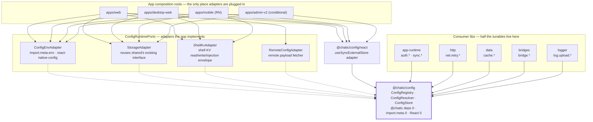
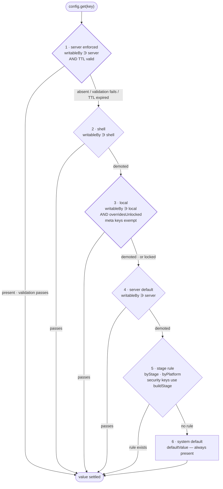
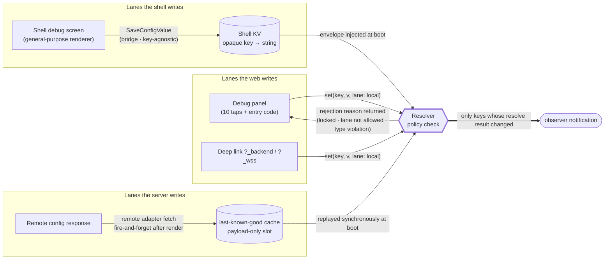
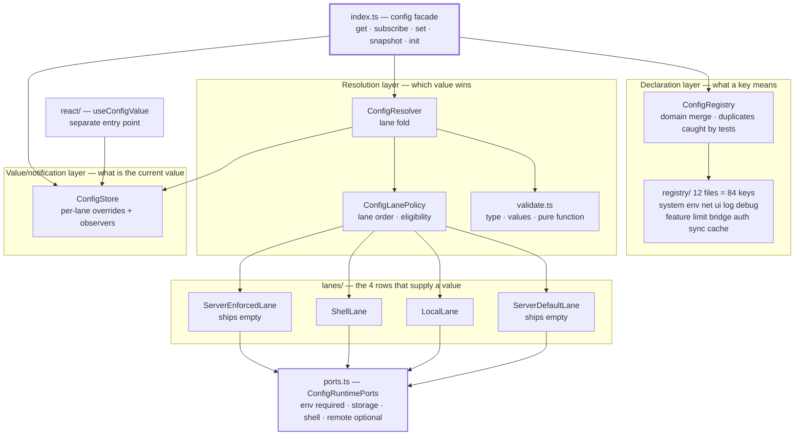

# ADR-0079: Config is owned by one registry — the `@chatic/config` lane resolver

> Status: **Accepted** · Written: 2026-09-08 · Implementation: **Steps 1–7 complete** (2026-09-09, progress in
> [libs/config/docs/architecture.md §Implementation checklist](../../libs/config/docs/architecture.md) — path kept
> for reference; the file does not exist in this tree)
> Scope: `libs/web-config` → `libs/config` (new — delete old — **the actual importer is only 8 files in
> `libs/app-runtime`**; mentions of `apps/desktop-web` · `libs/shared` · `libs/http` are comments) ·
> `apps/web` · `apps/mobile` · `libs/app-messages` (bridge ops) · tunable-consuming libs (`http` · `data` ·
> `bridges` · `logger`). **`apps/desktop-web` is also in scope** (permitted by the 2026-09-09 instruction to
> modify it). The migration targets were written as `import.meta.env` 7 files ·
> `CHATIC_APP_*` 2 files · `usePreferenceStore` 1 file, but **step 6 measurement corrected this**:
> the real numbers are `import.meta.env` 1 file (`oauth.ts` — the other 6 files are just
> `import.meta.env.DEV` build constants) · `CHATIC_APP_*` 0 files (decided not to migrate) ·
> 1 file for the notification settings store. Mentions of `@chatic/web-config` are comments only.
> **However there is no way back** — desktop-web deploys only by push, has no manual deploy or
> rollback path, and the repo's CI has no test workflow at all for it (only a build workflow). So this
> migration is attached last, with more manual verification.
> `apps/admin-v2` is **conditional** — it has no shell, so shell and server lanes are meaningless there;
> whether it is folded in is decided by open question ⑤.
> Amendment: [ADR-0080](./0080-debug-panel-shared-model-and-stage-visibility.md) amends decision 3's schema
> (adds `meta`) and `env.*` (adds `buildStage`) — marked in place at each location.
> Related: [preferenceKeys.ts](../../apps/web/src/app/stores/preferenceKeys.ts) ·
> `apps/web/src/app/stores/usePreferenceStore.ts` (no longer exists in this tree) ·
> `libs/web-config/src/env.ts` (no longer exists in this tree) ·
> [logUploadSwitch.ts](../../apps/web/src/app/runtime/logging/logUploadSwitch.ts) ·
> [debugSettingsStore.ts](../../apps/mobile/src/app/stores/debugSettingsStore.ts)

> **This document does not reference the earlier design document on feature toggles** (by instruction).
> The context comes only from code measured in the current tree, not from earlier decisions. Measured
> as of commit `a6a428d4b` (2026-09-08).

> **Fixed terminology.**
> **Key** — the name of one config item. Dot notation `<domain>.<name>` (`log.upload.hold`, `ui.theme`).
> **Lane** — one source that can supply a key's value. Lanes are ordered by a fixed priority.
> **Registry** — the table that declares a key's _meaning_ (type, default, rules, policy). It holds
> meaning, not values.
> **Shell** — the native host that wraps web content (mobile RN · desktop Electron). Defined in
> CONTEXT.md.

## Context

### 1. Config sources are scattered across four branches, with no common accessor

| Source                                      | Scale                                                                        | Accessor                                    |
| ------------------------------------------- | ---------------------------------------------------------------------------- | ------------------------------------------- |
| Direct `import.meta.env` reads              | `VITE_*` **20 kinds**, **31 files** (web 12 · desktop-web 7 · admin-v2 7)    | none — each file reads directly             |
| Shell-injected global `window.CHATIC_APP_*` | **20 kinds**, direct reads in **22 files** (web 14 · desktop-web 2 · libs 6) | only 14 kinds via `deviceInfoStore` (React) |
| local/sessionStorage flags                  | 3 log-upload keys · 2 session keys (`?_backend`/`?_wss`)                     | a private `readFlag` per file               |
| `PREFERENCES` registry                      | **12 keys** + a 448-line zustand store                                       | `usePreferenceStore` (React only)           |

> **Caution on the counts above.** Counting `VITE_*` by substring inflates the number to 44 by mixing
> in unrelated constants like `INVITE_LIST_LIMIT` · `MAX_INVITE_SELECTION`. Counted by word boundary, the
> web bundle reads **20 kinds**, and separately there are **8 kinds** of `MAIN_VITE_*` used only by the
> Electron main process (out of scope). Of the 20 kinds of shell-injected globals, **14 are already
> owned by [`deviceInfoStore`](../../libs/device-utils/src/stores/deviceInfoStore.ts)** — though it is
> React-only and covers only device/version identity; `CHATIC_APP_PLATFORM` is read directly by
> **11 files** outside it. The full classification is owned by the registry key proposal, which lived in
> the root docs tree and has since been removed.

The same concept is split into two: web has `PREFERENCES` + `usePreferenceStore`, mobile has
`debugSettingsStore` (9 fields, zustand persist). Neither knows about the other.

### 2. `web-config` is config in name only

[env.ts](../../libs/web-config/src/env.ts) — 193 lines, entirely env parsing, exporting values as
`export const` — **freezes at import time, so runtime changes are structurally impossible.** So the two
values that must change at runtime (`getDynamicRelayBackend` · `getDynamicRelayWss`) are patched as
getter exceptions. It is not that there is no observer — **the place that needed an observer has been
patched over with two exceptions.**

### 3. Three bottlenecks — the requirements cannot be met without breaking this structure

1. **A load-order side-effect contract at module load.** Just importing runs four steps in sequence
   (capture deep-link query → choose storage adapter → clean up the `?logout=1` token → read
   constants), and a file comment forbids splitting this file. Getting to pure TS requires **breaking
   this contract apart into an explicit boot call** as a precondition.
2. **`import.meta` ownership.** web-config is the repo's only holder of `import.meta`, so **it cannot
   test itself** (no jest.config) and every consumer mocks the module — this is why
   `public-surface.test.ts` mocks it through a proxy. This is also why mobile cannot use the same code
   (RN uses `react-native-config`).
3. **The options store is bound to React.** Adding one key means editing 5 places (registry · state
   field · action · `hydrate` branch · parser), and non-React code such as `boot`/`transport` cannot
   read it.

### 4. The cost of adding one durable toggle = 4 edits + **an app store release**

| Edit point                                                                                              | Current size   |
| ------------------------------------------------------------------------------------------------------- | -------------- |
| `PreferenceKey` union (`libs/app-messages/src/types/model/preference.ts:5`)                             | 5 items        |
| `BRIDGE_WRITABLE_PREFERENCE_KEYS` (`apps/mobile/src/app/webview/hooks/usePreferenceCacheHandler.ts:19`) | 2 items        |
| A `switch` branch per key in the same file                                                              | —              |
| **App release**                                                                                         | pending review |

**The web deploys before the app.** But since durable toggles are defined natively, every new toggle is
tied to the app release cycle. Toggles exist to be turned on and off quickly, and this coupling erases
that reason for existing.

### 5. All 9 `declare global` window globals are dead fallbacks

`env.ts` declares nine window globals — `ENV` · `PROJECT` · `REGION` · `OAUTH_ENDPOINT` · `HOST` ·
`IMAGE_API_ENDPOINT` · `SOCIAL_OAUTH_ENDPOINT` · `DOU_ENDPOINT` · `WS_ENDPOINT` — and reads each with
priority in the form `window.X || import.meta.env.Y`, but **all nine have zero consuming code.** Neither
the first item of `WEB_ENV`, nor the `window.DOU_ENDPOINT` branch of `getDynamicRelayBackend`, ever
executes.

This has two implications for the migration. First, **there is no runtime injection path that actually
exists for endpoints or build identifiers** — the only thing the shell actually injects is the 20 kinds
of `CHATIC_APP_*`. Second, this declaration and fallback chain is **something to delete in the
migration, not something to revive.**

### 6. `?_backend` switches the backend with no gate

`initEnvFromQueryParams` plants a query parameter into the session and `getDynamicRelayBackend` reads
it. Even in a PROD bundle, a single link can switch the relay backend. This is a hole created by having
no override policy.

## Decision

### Decision 1 — create `libs/config` (`@chatic/config`), delete `web-config`

**Zero** `@chatic` dependencies. Pure TS. Does not directly touch `import.meta` · `window` ·
`localStorage` · React · zustand · the network. The outside world is reached only through injected
adapters (decision 8). As a result **config sits at the bottom of the dependency graph**, and all three
web variants plus mobile RN share the same code. No shim is left behind — leaving a rename-only state
around for a long time is exactly the problem this rework exists to fix.

### Decision 2 — one key-value registry. env and endpoints go into it too

env, injected globals, flags, and options are merged into **one registry**. Endpoints are treated as
"a toggle whose value domain is a string" — then `?_backend` becomes one kind of override lane, the two
getter exceptions disappear, and override rules (priority, locking) become uniform.

Since keys number over 80, the registry is **split into per-domain modules** and merged at boot.

**Duplicate keys are caught in tests. Boot is never killed by them.**

The initial draft was "a duplicate key fails boot." The reasoning was right. Silently overwriting causes
an incident where two domains interpret the same key differently. But the cost is too high. 80% of keys
are for developers (§Surface distribution), and **putting one developer-facing key in wrong would stop
every user's app from launching.** A debugging mistake killing users is the wrong trade.

So the check is split into two places.

| When           | What                                                | On failure                                              |
| -------------- | --------------------------------------------------- | ------------------------------------------------------- |
| **Test**       | merges the 12 domains and checks for duplicate keys | **the test fails**                                      |
| **At runtime** | when a duplicate is hit while merging               | the later key is dropped and logged with `logger.error` |

The runtime rule is one: **the first declared key wins.** Order is fixed, so the outcome does not vary
by device. And the app still launches.

### Decision 3 — the shape of a key declaration

```ts
type ConfigEntry<T> = {
    /** The name the panel shows instead of the dot-notation key. Korean (ADR-0080 decision 3). */
    title: string;
    /** What value this changes · why it exists. One sentence. */
    description: string;
    type: 'boolean' | 'string' | 'number' | 'enum' | 'json';
    /** Allowed value set when enum. This is where "multiple config values" is expressed. */
    values?: readonly T[];
    /** The system default — the answer when no lane supplies a value. */
    defaultValue: T;
    /** A rule table that changes the default by build/stage. `Stage` is only `LOCAL|DEV|PROD` — decision 14. */
    byStage?: Partial<Record<Stage, T>>;
    byPlatform?: Partial<Record<Platform, T>>;
    /**
     * Which screen this is exposed on. A third axis, orthogonal to domain (topic) and `writableBy`
     * (write path).
     *
     *  'user'     Settings screen. A regular user turns it on and off (theme · language · message preview).
     *  'labs'     The lab section of the settings screen. A user can turn it on, defaults off, and the
     *             server must be able to turn it off.
     *  'dev'      Debug panel only. Unlocking is a precondition.
     *  'internal' No control on any screen. Code reads it, or product UI writes it in its own flow.
     */
    surface: 'user' | 'labs' | 'dev' | 'internal';
    /** Which lanes can write this key. This is policy, and is not an override target (decision 6). */
    writableBy: readonly ('shell' | 'local' | 'server')[];
    /** 'shell' = stored permanently in the shell KV, 'local' = localStorage, 'session' = sessionStorage, 'none' */
    persist: 'shell' | 'local' | 'session' | 'none';
    /**
     * The point at which a value change actually takes effect. Defaults to 'live'.
     *
     * Not every value takes effect immediately — auth options passed at SDK construction time only
     * apply after reconnecting. If this is not surfaced, the debug panel says "off" while it is really
     * still on, and that's worse than having no table at all.
     */
    appliesAt?: 'live' | 'reconnect' | 'restart';
    /**
     * The general-purpose panel (decision 9) does not render an edit UI for this key. Only a dedicated
     * flow can.
     *
     * A different axis from `writableBy` — that says "which lane can write," this marks "what must be
     * proven before writing lives outside the registry." Without it, a panel that requires unlocking to
     * enter would contain the very switch that unlocks it — a cycle (added in ADR-0080 decision 6).
     */
    meta?: boolean;
};
```

`appliesAt` was found necessary during the second sweep (tunables) — the reasoning and the list of keys
is owned by the registry key proposal §Schema extension, which lived in the root docs tree and has
since been removed. **This is descriptive metadata for the UI, not an enforcement mechanism** — config
does not force a reconnect when a `'reconnect'` key changes, and observers fire as usual. Actually
applying the value is the consumer's responsibility (e.g. recreating a socket), and `appliesAt` exists so
the panel can honestly say "applies after reconnect."

Toggles are not just booleans. `type`+`values` declares the value domain, `defaultValue` is the system
default, and `byStage`/`byPlatform` handle changing the default by build/stage. The current
`PreferenceEntry`'s `strategy` becomes `persist`, carrying forward the same role of choosing where a
key is stored. The name `defaultValue` also comes from that type — since
[preferenceKeys.ts](../../apps/web/src/app/stores/preferenceKeys.ts) already uses that name, it is not
renamed to `default` (decision 12).

**`title`/`description` are what actually makes decision 9 work.** When the shell's general-purpose
panel renders the raw envelope, without these two fields the screen would just show the dot-notation
key `sync.resume.initialCooldownMs` as-is — unusable for QA. With a human-readable name and a
one-sentence description attached to the declaration, **the shell can draw a usable screen without a
single line of per-key code.** This is the point where "zero app releases to add a new toggle" becomes
true for the UI too, not just for storage.

#### Type is not one axis but three

It seems like "what kind of setting is this" should have one answer, but in reality it is **a set of
independent questions**, and merging them into one always goes wrong. `ui.theme` (a user setting) and
`log.upload.hold` (a debug lever) differed only in domain prefix, with no other distinction — this is
the spot where domain doubled as both topic and exposure surface and failed.

| Axis           | Field               | Question answered                           | Values                                       |
| -------------- | ------------------- | ------------------------------------------- | -------------------------------------------- |
| **Topic**      | key prefix (domain) | What is this value about                    | `ui.` · `net.` · `log.` · `auth.` … 12 total |
| **Surface**    | `surface`           | **On whose screen does the control appear** | `user` · `labs` · `dev` · `internal`         |
| **Write path** | `writableBy`        | Which lane can put in a value               | `shell` · `local` · `server`                 |

That the three are truly orthogonal is shown by example.

| Key                              | Topic  | Surface    | Write path                   |
| -------------------------------- | ------ | ---------- | ---------------------------- |
| `ui.theme`                       | `ui`   | `user`     | `shell` · `local`            |
| `ui.pinnedChannels`              | `ui`   | `internal` | `local`                      |
| `net.relay.backend`              | `net`  | `dev`      | `local`                      |
| `net.oauth.endpoint`             | `net`  | `internal` | (none)                       |
| `sync.profile.channelIntervalMs` | `sync` | `dev`      | `shell` · `local` · `server` |

The same domain (`ui`) splits across `user` and `internal`, and the same surface (`dev`) spans different
domains. One axis cannot express this.

**"A feature the server controls" is a write path, not a surface.** Remote control is a property
independent of who sees a screen — `writableBy ∋ 'server'` already answers that — and adding one more
value to `surface` would make it impossible to express "a user lab feature the server can also turn
off" — which is precisely why `labs` is needed.

**Combination validation rules.** Some pairings of the three axes make no sense. They are handled the
same way as duplicate keys — **a test blocks it, and at runtime only that key is dropped, with a log.**

- `surface: 'user' | 'labs'` but `writableBy ∌ 'local'` → a user setting the user cannot write.
- `surface: 'user' | 'labs'` but `meta: true` → declares a surface while the general-purpose screen
  won't render it.
- **`surface: 'labs'` but `writableBy ∌ 'server'`** → an experiment that cannot be killed remotely.
  Lab features ship unfinished to users, so turning one on without a server kill is prohibited.

**Labs is empty right now.** `labs` is the slot this design opens, and today it has 0 keys. The 6
existing `feature.*` keys are all `dev`, opened only in development builds via `byStage`; the promotion
path, once one is ready to ship to users, is to flip `surface` to `labs` and add `'server'` to
`writableBy`.

#### Declaration and runtime value are not the same type — `ConfigSnapshot`

"One setting, one type" is a reasonable ask, but **putting the current value into `ConfigEntry` makes the
registry mutable.** That removes any structure to enforce decision 6 (policy is not an override target),
and two consumers reading the same entry object would see each other's changes. Per §Fixed terminology,
the registry must hold "meaning, not value."

Instead the resolver builds **a read-only view of a key's entire current state.** The name comes from
the 8 `*Snapshot` types already in the repo (`SocketAuthSnapshot` · `CloudSessionSnapshot` ·
`CacheMetricsSnapshot`), all playing the same role of "a read-only runtime view of state."

```ts
interface ConfigSnapshot<T> {
    key: ConfigKey;
    /** As declared — title · description · defaultValue · policy. Frozen. */
    entry: ConfigEntry<T>;
    /** The resolve result. Always present. */
    value: T;
    /** Which row won. 'default' is row 6. */
    lane: Lane | 'default';
    /** Did something other than the default (rows 5/6) win — the panel uses this for "changed". */
    isOverridden: boolean;
    /** The lanes actually writable on this device right now — reflects locking/platform, differs from `writableBy`. */
    canWrite: readonly Lane[];
}
```

Once a panel filters down to its own keys via `surface`, this single object is enough to complete one
row — name, description, current value, default, which row won, whether it is editable, when it applies
(`entry.appliesAt`). The point of `canWrite` being separate from `writableBy` is: the declaration says
"which lanes can write in principle," while the snapshot says "can write **on this device right now**,"
reflecting PROD locking and the absence of a shell. This is what removes the case of a panel drawing an
active control it cannot actually use.

### Decision 4 — the lane resolver. Priority is one fixed table

```
resolve(key):
  1. server enforced   value the server pushed as enforced (kill switch)     writableBy ∋ 'server'
  2. shell             value the shell injected/stored                      writableBy ∋ 'shell'
  3. local             web override (debug panel · deep link)               writableBy ∋ 'local' AND overridesUnlocked
  4. server default    default value the server sent                       writableBy ∋ 'server'
  5. stage rule        byStage / byPlatform  (Stage = LOCAL|DEV|PROD, decision 14)
  6. system default    default
```

The resolver is one fold over this array. No lane has special-case code, and a new lane is just a new
row appended to the array. Every lane's value is **validated against the registry's `type`/`values`, and
if it fails, that lane is skipped** — a corrupted stored value or a stale server payload gets demoted to
the next lane instead of breaking the screen.

> **Invariant (kill-switch isolation).** Row 1 is evaluated **first and alone**. Whatever rows 2–6 do
> cannot change row 1's answer. Row 1 sees only the cached payload · that key's `writableBy` · the TTL —
> nothing else. Not `byStage`, not `byPlatform`, not storage, not the shell.
>
> The reason is what a kill switch is for. **A kill switch is for when everything else has already
> broken.** If it passes through the same code it is meant to disable, it dies together with it. So it
> gets the shortest path with the fewest dependencies.
>
> The reverse direction is also fixed. **If row 1 itself fails, it falls through to the next row.**
> Killing everything just because an error was hit would be a bigger incident. In short: the kill is
> guaranteed to fire, but a failure in evaluating it fails quietly and falls through.

> **Invariant (cycle prevention).** **`meta: true` keys skip row 3's lock gate.**
>
> The reason is that these keys are the locking mechanism itself. Resolving `system.overridesUnlocked`
> while row 3 asks for `overridesUnlocked` again would be infinite recursion. `meta` keys are guarded not
> by the lock gate but by a **dedicated flow** (10 taps + entry code), so there is no reason to layer the
> gate on top anyway.
>
> The same marker does two jobs. In decision 9 it means "the general-purpose panel does not render this
> key," and here it means "not subject to the lock gate." Both come from the one fact that **this key is
> part of the locking mechanism itself.** Whether the resolver honors this rule is pinned by a test.

> **Row 5 looks at two stages.** A `byStage` with a security property (`debug.*` · `system.*`) is judged
> by the tamper-proof `env.buildStage`; everything else is judged by `env.stage`
> ([ADR-0080 decision 5](./0080-debug-panel-shared-model-and-stage-visibility.md)).

The point is that the server lane is **split into two rows.** The ordinary meaning of remote config is
"adjust a default," so it must sit below the local override (row 4) so a developer can experiment on
their own device. A kill switch, on the other hand, must be able to override a local override on a
broken device, so it must sit above everything (row 1). Since the two requirements differ, they are two
rows, and the payload's `enforced` flag decides which row a value lands in.

### Decision 5 — locking is also a feature toggle. No special-purpose device is built for it

```ts
'system.overridesUnlocked': {
    title: 'Unlock overrides',
    description: 'Enables the web override lane (row 3). Opened by 10 taps + an entry code.',
    type: 'boolean',
    defaultValue: true,
    byStage: { PROD: false },   // PROD is fail-closed
    surface: 'dev',
    writableBy: ['shell', 'local'],  // same as today — the web opens it. The server cannot touch it
    persist: 'session',              // same lifetime as today (below)
    meta: true,
}
```

In PROD, the web override lane is dead — this is where the §Context 6 `?_backend` hole is closed. Since
this repo's stages are only `LOCAL` · `DEV` · `PROD` (decision 14), the only stage to close is `PROD`.

**Opening it works the same way as today — 10 taps + an entry code, on the web.**

The initial draft used `writableBy: ['shell']`, i.e. "only the app can unlock." The reasoning was "a
remote control can be lost, and a link is a remote control" — but **the analogy was wrong.** Unlocking is
not a URL, it's a **gesture plus a code.** A link cannot do it.

Measurement makes this clearer. The only place the app turns on `debugModeEnabled` is one bridge message
handler ([usePerfHandler.ts:30](../../apps/mobile/src/app/webview/hooks/usePerfHandler.ts:30)). **The app
has no unlock path of its own.** Today the web is the sole key, and following the draft would mean
building a brand-new app-only gesture that doesn't exist today — pure added surface, no gain.

**The lifetime also stays as it is today.** With `persist: 'session'`, it disappears when the tab
closes, and when the web boots it also tells the app to turn it off (`main.tsx` already does this). So
the unlock lives "until the next web boot." This reverses the draft's plan to store it permanently in
the shell KV, and with it removes the risk that "the unlock survives a restart."

**The server still cannot use it.** Remote _locking_ is a safe direction, but remote _unlocking_ is not.
If a specific key needs to be blocked remotely, decision 4's enforced lane is the more precise tool.

### Decision 6 — policy is not an override target (invariant)

`writableBy` · `type` · `values` · `persist` are hardcoded in the registry, and **no lane can change
them.** Only values are runtime-mutable. Without this, an override could grant itself a lane, and
decision 5 would become meaningless.

### Decision 7 — a pure-TS observable core + a React adapter in a separate entry point

The public surface takes the same shape as the `runtime` facade — a facade bundled into a class
(decision 12), not a scattering of exported functions:

```ts
config.get<T>(key): T                                  // sync. always has a value (at least the system default)
config.subscribe(keys, listener): () => void            // fires only when a key's resolve result changes
                                                        // the listener receives the keys that moved
config.set(key, value, { lane: 'local' }): SetResult    // a policy violation is returned as a rejection, not thrown
config.init(ports): void                                // inject adapters (decision 8)
config.snapshot<T>(key): ConfigSnapshot<T>              // a key's full current state (decision 3)
config.snapshotAll(): readonly ConfigSnapshot<unknown>[] // used by the panel and log context
```

`subscribe` fires only on **a change in the resolve result** — even if a lower lane's value changes, if a
higher lane is still winning, there is no notification. That way an observer sees only "the value that's
currently in effect."

The listener receives **which of the keys it asked about moved** (`ConfigChangeListener`). Since the
store already holds that list to pick notification targets, not passing it to the listener would force
every observer to keep its own copy of values and diff them manually — decision 16's state log was
exactly that situation (step 7). A consumer that just needs to re-read the value (React's
`useSyncExternalStore`) can ignore the argument.

The React binding is layered on top with `useSyncExternalStore` in a **separate entry point**,
`@chatic/config/react`. The goal is to keep the core React-free, and it lives in the lib so the adapter
is not duplicated across the 4 apps. zustand is not used — the core must stay framework-agnostic so
non-React consumers (`boot` · `transport` · the log pipeline) can read it.

### Decision 8 — the outside world is reached only through one `ConfigRuntimePorts`

The interface lives in one module, `ports.ts`, and **a missing member means "not wired"** — following
the convention already used by [`HttpRuntimePorts`](../../libs/http/src/ports.ts) (decision 12).

```ts
export interface ConfigRuntimePorts {
    /** Build facts: stage · buildStage · platform · project · region + raw env lookup. Required. */
    env: IConfigEnvAdapter;
    /** local/session override storage. Without it, the local lane lives only in memory. */
    storage?: StorageAdapter; // reuses @chatic/shared's existing interface
    /** shell KV read/write + boot injection envelope. Without it, the shell lane is inactive. */
    shell?: IShellKvAdapter;
    /** remote payload fetcher. Without it, both server-lane rows are inactive (decision 10). */
    remote?: IRemoteConfigAdapter;
}
```

`Stage`/`Platform` are, conversely, **duplicated** — importing `app-messages` would tie config to the
entire bridge contract; the reasoning and drift defense are owned by decision 14.

It matters that `storage` is not a new type — [`StorageAdapter`](../../libs/shared/src/utils/storage.ts)
(`getItem`/`setItem`/`removeItem`) is already the repo's storage interface, and config asks only for
**its shape**. It does not import `@chatic/shared`, taking it as a structural type instead, so decision
1's "zero dependencies" holds.

App entry points plug in the adapters. The web adapter reads `import.meta.env`+`window.*`, the RN
adapter reads `react-native-config`. **This is what resolves §Context 3-2** — `import.meta` gets pushed
out to the app boundary, so config itself becomes testable with ts-jest, and consumers no longer need to
mock the module.

### Decision 9 — the shell becomes a general-purpose KV store + injector that does not understand meaning

Definition is owned by the web (config), and **storage and injection are owned by the shell.** The shell
opaquely stores `key → string` and injects the whole envelope at boot — it does not need to know what
any key means. That is why **adding a new toggle costs zero app releases.** The shell's debug screen also
stops being per-key code and becomes a **general-purpose screen that renders a list of
`ConfigSnapshot`s** — name, description, current value, default, and applies-at are all in the snapshot,
so the shell needs to know none of the keys (decision 3). **The exception is `meta: true` keys, which are
not rendered** — otherwise the panel would contain the very switch that opens it (`meta` in decision 3,
[ADR-0080](./0080-debug-panel-shared-model-and-stage-visibility.md) decision 6).

**A write from the app gets an answer.** `SaveConfigValue` is not fire-and-forget — it gets an
acknowledgement, retries once on failure, and if that also fails, tells the screen "could not save."
Silently pretending to succeed creates a state where the screen says "off" while it's really still on.
This code has already lived through this problem once — only the theme currently uses ack + retry, and
its comment notes it is "the only setting that can't fix itself if the write disappears." Every config
value has that same property. The diagram behind this is owned by
[ADR-0080 decision 10](./0080-debug-panel-shared-model-and-stage-visibility.md).

To this end, `libs/app-messages` gets **key-agnostic ops as new message types**
(`FetchConfigBag` / `SaveConfigValue` / `ClearConfigValue`). An old shell that does not know these types
falls back to the existing 5-key `SavePreference` path via `NOT_FOUND` learning fallback — a required
cost of the constraint that the web deploys before the app. The existing `PreferenceKey` union and
whitelist survive only on that fallback path, and are retired once the installed base has moved past it.

### Decision 10 — the server lane spec

**Payload.**

```ts
type RemotePayload = {
    schemaVersion: number; // outside what the client knows → ignore the whole payload
    ttlSec: number; // this response's valid lifetime
    entries: Record<string, { value: unknown; enforced?: boolean }>;
};
```

**Transport lives outside config.** `IRemoteConfigAdapter` is just `fetch(): Promise<RemotePayload>`, and
the app's composition root builds it with `@chatic/http` and plugs it in. config has zero network
dependencies and stays at the bottom of the dependency graph (decision 1).

**Boot order and live updates.** A remote response arrives after first paint. So the payload is
**cached as last-known-good and replayed synchronously on the next boot.** The cache uses **a single
payload-only storage slot** — the shell KV if there is a shell, localStorage otherwise. Do not confuse
this with decision 3's `persist`: that declares where a **per-key override** is stored, while the remote
payload is **one blob**, not keys, so no key's `persist` decides this. The lane reads the cache, and when
an update arrives it replaces the cache and fires observers — this is what "live" actually means, and it
prevents the flicker of every boot starting without remote and then flipping mid-session. The fetch is
fire-and-forget after render and **never blocks boot.**

**Staleness.** The cache carries `fetchedAt`+`ttlSec`. When the TTL is exceeded:

- **default entries (row 4)** — keep using them. It's just a default adjustment, and a stale default is
  better than none.
- **enforced entries (row 1)** — **discard.** This is the self-healing for a bad kill push, and the
  guarantee that a device that cannot reach the server does not stay locked forever. When the server
  stops killing, TTL expiry lifts it on its own.

**Failure/mismatch fallback.** Fetch failure → keep the cache, no notification, backoff retry.
`schemaVersion` mismatch → ignore the whole payload, keep last-known-good. Unknown key → ignored (the
web may be older than the server). A known key with a bad value → only that entry is demoted by
validation failure (decision 4).

**Keys the server cannot write.** If `writableBy` lacks `'server'`, a server value is rejected. Notably
**endpoint keys and `system.*`** — remote config must not be a way to swap the backend address or unlock
the lock. `auth.sdk.*` (a bad remote change can trigger a refresh storm, and by the time it's reversed the
backend is already under load) and `log.collection.enabled` (a privacy opt-out must not be reversible by
the server) are also excluded. **The full list is owned by the registry key proposal**, which lived in
the root docs tree and has since been removed — this paragraph is illustrative, not exhaustive.

#### What ships now versus what's deferred — the lane is completed while empty

Remote config is **not introduced this round.** But the slot is completed so that, later, plugging in
one adapter is all it takes.

**Principle: a lane must never be "added" later.** If rows 1 and 4 were spliced into the priority array
some day, every key's resolve result could change at that moment, and that change would happen silently
on already-deployed devices. Instead, both lanes are **put in place and left empty in step 1** — without
an adapter, they produce no value, so they always demote to the next row, and behavior today is
unchanged; once an adapter exists, **not one line changes** in `ConfigLanePolicy` or `ConfigResolver`.

| Ships in step 1 (now)                                                             | Deferred (when the adapter arrives)  |
| --------------------------------------------------------------------------------- | ------------------------------------ |
| the `IRemoteConfigAdapter` interface + `RemotePayload` type                       | the implementation                   |
| rows 1 and 4 **registered** in the priority array (empty lane without an adapter) | fetcher · polling interval · backoff |
| **pre-decided** `writableBy ∋ 'server'` verdicts for the 84 keys                  | —                                    |
| `system.remote.enabled` (default `false`)                                         | —                                    |
| cache slot name · envelope shape · `schemaVersion: 1` **reserved**                | actual cache writes                  |
| **contract tests** that pass both lanes with a fake adapter                       | —                                    |

**Contract tests are the crux of this device.** A code path that never runs is guaranteed to be broken
the first time it's used. In step 1, a **fake** implementing `IRemoteConfigAdapter` is plugged into the
tests to verify that `enforced` beats a local override, that `default` loses to local, and that only
`enforced` is discarded on TTL expiry. There's no real remote yet, but **the lane ships alive.**

**Why `writableBy` verdicts aren't deferred.** "Which keys can the server touch" is a security judgment.
Leaving all 84 keys to be audited in one go on the day the adapter lands means that day is usually a
rushed one, and judgment gets sloppy. The registry key proposal — which lived in the root docs tree and
has since been removed — has already settled this.

**That there are two switches is also intentional.** Even with the adapter plugged in, if
`system.remote.enabled` is `false` the lane stays empty. Wiring and activation are separate, so merging
the adapter and turning it on can be decided at different times.

**The vendor is absorbed by the adapter.** `IRemoteConfigAdapter` is just `fetch(): Promise<RemotePayload>`
with no vendor concept. Whatever the remote source is (an in-house API, Firebase Remote Config, or
otherwise), moving its response into `RemotePayload` is the adapter's job, and config knows nothing of
the vendor. This repo already has a Firebase project for FCM, making Remote Config a realistic candidate,
but **that choice is not made by this document** — only that the port is open is this decision's content.

### Decision 11 — the four-step module-load side effect is dismantled

| Current (auto-runs on import)     | After migration                                                                       |
| --------------------------------- | ------------------------------------------------------------------------------------- |
| `initEnvFromQueryParams()`        | generalized to **deep link → local-lane write**. Must pass policy (`writableBy`/lock) |
| `setStorageAdapter(localStorage)` | app entry point injects via `config.init({ storage })` (decision 8)                   |
| `clearTokensOnLogout()`           | **moves out of config.** Session hygiene, not config — moves to app boot              |
| `WEB_*` constants                 | registry keys + `config.get()`                                                        |

The invite-link exception for `?_backend` (the current `isInviteLink` branch) keeps its meaning: an
invite link's `_backend` is a cloud address, not a relay address, so it is not written to the local lane,
and the cleanup for a contaminated tab stays as is.

### Decision 12 — structure and naming follow the repo's existing conventions. No new vocabulary is invented

This document's draft used the names `StorageSeam` · `ShellSeam` · `RemoteSeam`. **`*Seam` occurs 0 times
in the repo** — bringing in new vocabulary while claiming to make a new lib consistent was exactly the
kind of mistake this rework exists to fix. Below is a measurement of the current tree (by unique symbol
name, across `apps` + `libs`), and config takes all its names from this table.

| Convention      | Count | Leading precedent                                               | Role in config                                    |
| --------------- | ----- | --------------------------------------------------------------- | ------------------------------------------------- |
| `I*` interfaces | 107   | `ICredentialRecoveryRegistry` + `CredentialRecoveryRegistry`    | interface for an injected port (decision 8)       |
| `*Service`      | 45    | `LogUploadQueueService`                                         | (config has none — it's not a service layer)      |
| `*Store`        | 19    | `deviceInfoStore` · `flagOverrideStore`                         | **`ConfigStore`** — value storage + observers     |
| `*Adapter`      | 11    | `StorageAdapter` · `NativeBridgeAdapter` · `SessionAuthAdapter` | **4 injected implementations**                    |
| `*Policy`       | 5     | `UploadRetryPolicy` · `SessionStalenessPolicy`                  | **`ConfigLanePolicy`** — lane table + eligibility |
| `*Registry`     | 4     | `CredentialRecoveryRegistry` · `AuthIdRegistry`                 | **`ConfigRegistry`** — key meaning                |
| `*Resolver`     | 1     | (a weak precedent)                                              | **`ConfigResolver`** — lane fold                  |
| `ports.ts`      | 1     | [`HttpRuntimePorts`](../../libs/http/src/ports.ts)              | **`ConfigRuntimePorts`** (decision 8)             |
| `*Seam`         | 0     | —                                                               | **not used**                                      |
| `*Strategy`     | 0     | —                                                               | **not used**                                      |

> Measured as unique symbol **name** counts. ADR-0076's naming table counted the same suffixes by
> **occurrence**, giving much larger numbers (`*Adapter` 265, etc.) — be aware the two tables use
> different methods when comparing them.

**Bundle into classes, and put only pure helpers in `utils/`.** As the 107 `I*`+class pairs show, the
repo keeps logic in classes. It does not build loose sets of exported functions — if `get`/`set`/
`subscribe` scatter into module-level functions, no one owns the state and tests end up depending on
module mocks, which is exactly `web-config`'s problem today (§Context 2).

**The public surface is one facade.** Like `runtime.<group>.*`
([app-runtime](../../libs/app-runtime/src/index.ts)), only `config.*` is exported, and internal classes
are not exposed in the barrel. If a consumer grabs `ConfigResolver` directly, it can bypass lane policy.

#### Module layout

```
libs/config/src/
  index.ts              exports one ConfigFacade instance (`config`)
  ports.ts              ConfigRuntimePorts + I*Adapter interfaces (decision 8)
  types.ts               ConfigEntry · Stage · Platform · Lane · SetResult
  registry/
    index.ts            ConfigRegistry — merges domain modules, duplicate keys throw (decision 2)
    system.ts  env.ts  net.ts  ui.ts  log.ts  debug.ts  feature.ts  limit.ts
    bridge.ts  auth.ts  sync.ts  cache.ts
  resolve/
    ConfigLanePolicy.ts  lane order + eligibility + the row-3 short-circuit invariant (decision 4)
    ConfigResolver.ts    the lane fold
    validate.ts          type/values validation — a pure function
  store/
    ConfigStore.ts       current values + per-lane overrides + observer notification
  lanes/
    ShellLane.ts  LocalLane.ts  RemoteLane.ts  StageLane.ts
  utils/                pure helpers only (key parsing, envelope serialization)
  react/index.ts        separate entry point — useConfigValue (useSyncExternalStore)
```

The 12 registry domain files are the concrete form of §decision 2's "split per domain," and the 4 files
under `lanes/` are rows 1–4 of decision 4's table (rows 5 and 6 are registry declarations, so they have
no lane class).

#### Extension points — what you touch to grow what

This table is the checkable form of "extensibility." **If the right-hand column ever needs more than one
cell, the design has failed.**

| Growing this         | Touches                                                                       |
| -------------------- | ----------------------------------------------------------------------------- |
| one key              | **one row** in `registry/<domain>.ts`                                         |
| one domain           | one file under `registry/` + one line in `registry/index.ts`'s merge list     |
| one lane             | one class in `lanes/` + one row in `ConfigLanePolicy`'s order array           |
| one platform         | an `*Adapter` implementation at the app entry point — **config is untouched** |
| one storage location | a value in the `persist` union + one routing branch in `ConfigStore`          |

That adding a platform never touches config is how decisions 1 and 8 actually live. Conversely, adding a
lane touching two places is an intentional cost — order must live in exactly one place (decision 4), and
that one place is `ConfigLanePolicy`.

### Decision 13 — migrate per lane in 3 steps. Each step is independently deployable

| Step  | Scope                                                                                                                                          | Done signal                                        |
| ----- | ---------------------------------------------------------------------------------------------------------------------------------------------- | -------------------------------------------------- |
| **1** | Create config (core, resolver, registry, observers, React adapter) + migrate the env lane, **delete** `web-config`                             | `import.meta.env` direct reads 31 → 4 app adapters |
| **2** | Shell lane — unify the 20 kinds of injected globals, a general-purpose KV bridge op + `NOT_FOUND` fallback, general-purpose shell debug screen | `CHATIC_APP_*` direct reads 22 files → 0           |
| **3** | Absorb options — migrate `PREFERENCES` 12 keys + `logUploadSwitch` 3 keys, dismantle `usePreferenceStore`, unify mobile                        | `usePreferenceStore` 448 lines → selector hooks    |

The server lane (decision 10) is **not introduced this round.** The interface, empty lane, `writableBy`
verdicts, and contract tests ship in step 1; only the adapter implementation stays a separate track —
the resolver is untouched when that happens.

Three screens get attached (`dev` · `labs` · `user`), and of those, labs is empty for now. Details in
decision 15.

### Decision 14 — the stage vocabulary has three values, and config owns `Stage`/`Platform` itself

This decision **exists because measurement disproved the draft.** The draft assumed
`LOCAL | DEV | STAGING | PROD`, but **`STAGING` does not exist in this repo.**

| Basis                       | Measurement                                          |
| --------------------------- | ---------------------------------------------------- |
| every `VITE_ENV` comparison | `'LOCAL'` · `'DEV'` · `'PROD'` — no fourth value     |
| deploy workflows            | `.github` has only `_DEV_ENV` · `_PROD_ENV`          |
| the string `STAGING`        | **0 occurrences** across `apps` · `libs` · `.github` |

**Decision: `Stage = 'LOCAL' | 'DEV' | 'PROD'`.** If a fourth value is ever needed, it gets added to the
union then.

#### The stage vocabulary is already two, in fact

Separate from `VITE_ENV`, there is
[`Env`](../../libs/app-messages/src/types/model/device.ts:4), and `deviceInfoStore` casts
`window.CHATIC_APP_STAGE` to that type.

| Source                          | Values                           | Consumer                           |
| ------------------------------- | -------------------------------- | ---------------------------------- |
| `VITE_ENV` (build-injected)     | `LOCAL` · `DEV` · `PROD`         | `buildEnv.ts` · `web-config`, etc. |
| `Env` (`CHATIC_APP_STAGE` cast) | `'local'` · `'stage'` · `'prod'` | `deviceInfoStore`                  |

**Neither overlaps nor matches** — the value corresponding to `DEV` is `'stage'`, and the casing also
differs. Today the code using each value never meets the other, so this doesn't surface, but the moment
`env.stage` and `env.buildStage` go into one registry, they meet.

**Decision: config's `Stage` is canonical, and an adapter normalizes both vocabularies into it.**

- Web adapter: `import.meta.env.VITE_ENV` → `Stage` (already the same vocabulary, just validated)
- Shell adapter: maps `CHATIC_APP_STAGE` (`'local'|'stage'|'prod'`) → `Stage`. `'stage'` → `'DEV'` is
  the mapping that matches the current deploy structure, and this mapping does not leak outside the
  adapter.
- `deviceInfoStore`'s `Env` **stays as it is.** That type is part of the bridge contract
  (`app-messages`), and changing it would spread into native code, and config normalizing it removes any
  reason to change it.

#### Duplicating `Stage`/`Platform` is a cost worth accepting

[`Platform`](../../libs/app-messages/src/types/model/common.ts:2)
(`'ios'|'android'|'windows'|'macos'|'web'`), which `byPlatform` uses, also lives in `app-messages`. For
config to keep decision 1's "zero dependencies," **it must declare its own union, and then the
definition exists twice in the repo.**

Duplication is chosen. The reason is asymmetric — importing `app-messages` would tie config to **the
entire bridge contract** (hundreds of message types), forcing mobile and tests to carry that weight
too, in exchange for gaining just two unions. Conversely the cost of duplication is one risk of values
drifting apart, and that is caught by type checking in **one place, the adapter boundary's normalization
function.**

Drift is defended by a test: an assertion that compares `app-messages`'s `Platform` value set against
config's `Platform` lives in **an app-side test** (a place where both may be imported). config itself
still imports nothing.

### Decision 15 — three screens are attached this round. Server config only gets an interface

**This round's scope is three screens.**

| Attached              | `surface` | Keys today |
| --------------------- | --------- | ---------: |
| Debug · monitoring    | `dev`     |         68 |
| Labs                  | `labs`    |      **0** |
| General user settings | `user`    |          4 |

The 13 `internal` keys have no screen to attach — nothing to do. They enter the registry but appear on
no screen.

**No server settings screen is built.** Only the interface, empty lane, and contract tests ship (decision
10 §What ships now). Later, when a feature toggle is wired to the server, the resolver changes by not
one line — that's why the empty lane goes in now.

#### What comes next, in order

| Order | What                                  | Why that slot                                                               |
| ----- | ------------------------------------- | --------------------------------------------------------------------------- |
| 1     | **View device state** (decision 16)   | Building something that didn't exist. Cheap since the device already exists |
| 2     | Server wiring (RemoteConfig, etc.)    | Buys speed of "deploy → instant." Needs backend agreement                   |
| 3     | Change history · applied confirmation | Comes along with server wiring                                              |
| —     | A/B · gradual rollout · targeting     | **Not done.** See below                                                     |

**A/B and gradual rollout don't even get a slot.** All three assume "a different value per user," which
this design does not — one value per device. Assignment by user ID, carrying the experiment group along
with metrics, and a guarantee that assignment doesn't change mid-session are each separately required.
Adding server wiring does not bring these along for free, so the day they're needed, they get designed
**together with** server wiring.

#### Labs is empty right now

`labs` has **0** matching keys. The 6 `feature.*` keys noted as promotion candidates are all gates opened
only in development builds (phone login · payment dry-run, etc.), and **are not the kind of thing meant
to ship to users.**

So what's attached this round is **the labs screen and its rules**, and what goes inside it is decided
separately. Having the screen first means, when a feature is added, the discussion starts from "should
this go in labs" — right now that question can't even come up because the slot doesn't exist.

#### A lab feature can be killed even without a server lane

Decision 3's boot validation requires "a labs key must have `server` in `writableBy`." With the server
lane empty, it looks like this promise can't be kept. It can.

**`writableBy` lives in the registry, and the registry lives inside the web bundle.** So a web deploy that
removes `'local'` from that key strips row 3 of its eligibility, and the resolver skips that row. **A
value the user turned on is ignored and the default returns.**

| Means               | Time to take effect | Requires               |
| ------------------- | ------------------- | ---------------------- |
| kill via web deploy | one deploy          | exists today           |
| kill via server     | instant             | once an adapter exists |

A slow kill switch already exists, in other words. What a server lane does is make it **instant, without
a deploy**, and lacking it doesn't mean labs can't be attached now. A lab feature defaults off and is
something a user turned on themselves, so its blast radius is narrow — a single deploy's delay is
tolerable.

### Decision 16 — make it possible to see what value a device is using right now. Before server wiring

Being able to change a value but **not see the result** turns debugging into guesswork. When a support
ticket came in, there was no way to answer "which value won which row on that device" under the previous
design.

**This comes before server wiring.** Server wiring buys speed — "deploy → instant." This builds something
that never existed. It's also far cheaper — the machinery it needs already exists.

#### How it's recorded — as events, not as state

Not every log line carries the value. With five keys differing from default, a batch of 50 lines would
carry 250 pairs.

Instead, **record only on change.**

1. **Once, right after boot** — record every key that differs from default, in one line. On most devices
   this line is empty.
2. **After that, on every change** — record just that one key. Note which row won it, alongside.

The collector stitches the two together to **reconstruct the state at any point in time.** The log
pipeline already handles events, so no new store and no new format is needed.

The observer already exists (decision 7). "Log when a value changes" is just one subscription.

#### On screen

The debug screen calls `config.snapshotAll()` to see **the entire current state.** Since a snapshot
already carries name, description, current value, default, which row won, and whether it's writable
(decision 3), the screen just has to render the list.

#### What is not carried

Only `debug.entryCode` is excluded. Everything else is carried — the fact that an endpoint got switched
to a QA server is exactly the information that explains abnormal behavior.

This log is an internal log the team sees. Device identifiers and personal information are not in the
registry in the first place (§carve-outs).

## Architecture

### 1. Dependency direction — config sits at the bottom and imports nothing

Arrows are **dependency direction** (A → B = A imports B). That config has zero outgoing arrows is all of
decision 1.



**Dashed = an adapter injected via `config.init()`, solid = an import dependency.**
That the `remote` adapter is attached only to `apps/web` is intentional — the fetcher is built with
`@chatic/http` and plugged in by the app, so **the app knows about the network, not config.** This is why
consumer libs (including `http`) can import config without creating a cycle.

### 2. Reading — the lane fallback of `config.get(key)`

Each lane must pass `type`/`values` validation before it can supply a value. On failure it is **skipped
and demoted to the next**, and `defaultValue` guarantees an answer at the end.



`meta: true` keys skip row 3's lock gate. Because these keys are the locking mechanism itself, applying
the gate would create infinite recursion when deciding `overridesUnlocked` (decision 4 invariant).

### 3. Writing — who writes to which lane



`meta: true` keys (`system.*` · `debug.overlayEnabled` · `debug.entryCode`) are **not rendered by the
general-purpose renderer** — otherwise the shell's debug screen would contain the switch that opens it
(decision 9).

### 4. Module layout — three layers and the ports beneath them

The facade is the only public surface, and the three layers beneath each answer exactly one question.
Only row 4 of the lanes is a class — rows 5 and 6 are registry declarations, so they have no code.



**Outgoing arrows stop at `ports.ts`.** Below that are the adapters the app implements, not something
inside config — decision 1's "zero dependencies," expressed in code layout.

## Alternatives

**Native owns the definition too.** Keep the canonical registry in the shell, with the web only reading
what it downloads. This gains durability and reach, but §Context 4 remains — every new toggle still
needs an app release, and desktop-web, admin-v2, and plain browser tabs, which have no RN shell, would
need a different owner, splitting the implementation into two again. Rejected.

**Leave `web-config` as a re-export shim.** Finishes without a migration, but leaves a rename-only state
around for a long time. Rejected (decision 1).

**Keep the kill switch as a build-time env variable.** The cheapest to build, but ties the kill to the
deploy cycle so "kill it now" isn't possible, and env is not observable and can't reflect live. Decision
4's enforced lane achieves the same goal without a deploy.

**Make the server lane a single row.** Shortens the table by a row, but placing it above the local
override stops a developer from experimenting on their own device, and placing it below breaks the kill
switch. The two requirements point in opposite directions, so one row can't hold both.

**Build the core with zustand.** There is a precedent in the repo (`deviceInfoStore`) and the code would
be shorter. But since non-React consumers (`boot`·`transport`·the log pipeline) must be able to read it,
and it must be shared with mobile RN, a framework-agnostic core + thin adapter fits better. Rejected
(decision 7).

**Hardcode the PROD lock into the resolver.** Ends with one special-case branch, but the lock becomes
unobservable and uninjectable, so the app can't unlock it. Keeping the lock as one row in the registry
lets it reuse the same resolver, the same storage, and the same debug screen.

## Consequences

**What is gained.**

- Four branches of config source converge onto one table. "Why did this value come out this way" reduces
  to "which of the 6 lane rows."
- The cost of a new toggle becomes **one row in the registry.** Zero app releases, zero bridge edits.
- config becomes **testable on its own**, at zero dependencies and zero `import.meta`, and consumer
  module mocks disappear.
- All three web variants and mobile RN share the same code. The dual implementation of
  `debugSettingsStore` and `PREFERENCES` is gone.
- The gateless `?_backend` backend switch in PROD is closed (decision 5).
- Options can be read from non-React code — `boot`/`transport` no longer need values threaded in as
  arguments.

**What is accepted.**

- **The migration surface is large.** `import.meta.env` 31 files · `CHATIC_APP_*` 22 files ·
  `PREFERENCES` 12 keys · `usePreferenceStore` 448 lines. This is why it's split into 3 steps.
- **The bridge contract grows.** 3 new ops + a `NOT_FOUND` fallback. Both paths coexist until the
  installed base moves over.
- **The unlock survives a restart.** Today, boot's `setDebugMode(false)`
  ([main.tsx](../../apps/web/src/main.tsx)) clips the unlock's lifetime to "one restart." Once the unlock
  moves to the shell KV, that safeguard disappears, and **the app's debug-menu entry gate becomes the
  only line of defense.**
- **The registry can become a bottleneck.** Every key passes through one table. Domains are split, and
  duplicate keys are caught by tests (decision 2). At runtime, the app is never killed by them.
- **The server lane has only a spec, no implementation.** There's a lingering risk the spec drifts from
  the real backend, and it must be re-verified during the implementation track.

## Open — handed to the spec stage (dev-2)

1. ~~Unlock TTL~~ → **N/A.** Decision 5 reverted it with `persist: 'session'`. The unlock lives "until the
   next web boot" as it does today, and web boot also sends the app an "off" signal. Since nothing is
   stored permanently, there's no expiry to attach.
2. **Finalize key names.** ~~open~~ → owned by the registry key proposal (12 domains, 84 keys = 53
   first-pass + 32 tunables · 23 carve-outs · 10 dead env kinds proposed for deletion), which lived in
   the root docs tree and has since been removed. Finalized at the spec stage.
3. **How deep `json`-type validation goes.** How much of the parser for map-shaped values like
   `channelSort`/`pinnedChannels` the registry should own (currently 4 parsers live in the store).
4. **Shell KV envelope size and injection method.** The injection script size and serialization cost of
   merging the 20 kinds of globals into one envelope.
5. ~~Whether admin-v2/landing are folded in~~ → **N/A.** Step 3 folded in admin-v2 as env-only (no
   shell/storage adapter, just `config.init()`), and step 4, when actually wiring up the shell lane,
   found nothing new to decide — the core's existing rule, "if there's no shell, that lane is empty,"
   just applies to admin-v2 too. Landing does not exist in this repo, so it's out of scope.
6. ~~Migrating legacy stored values~~ → **Steps 5–6 answered this.** The execution point is **once at
   boot, before `config.init()`** — `init()`'s `hydrateStorage()` reads only once, so writing after that
   point won't be visible until the next boot. No flag is kept: the condition is simply "is there
   anything left to hand over from the old key," and since the old name is deleted the moment it's
   moved, the next boot has nothing to do (keeping a flag and leaving the old key would resurrect a
   deleted value on the boot after a `config.clear()`). The handoff shape splits in two depending on
   storage shape — for the 8 flat keys, `apps/web`'s `legacyPreferenceMigration.ts` renames and deletes
   the old key, while for a field inside a zustand-persist envelope, `apps/desktop-web`'s
   `legacyNotificationPrefsMigration.ts` **peels off just the field** (other settings live in the same
   envelope, and leaving it would let persist hydration write it back). `vite-ui-theme` is an exception —
   not a handoff but **permanent mirroring**, since the pre-paint scripts of 5 apps read and write it
   directly as a shared contract, so the original cannot be deleted.
7. ~~Observability — how do we know this device's effective settings~~ → **Decision 16 answers this.**
   Log once at boot plus on every change, and the debug screen looks via `snapshotAll()`. Only
   `debug.entryCode` is excluded.
8. **Drift gate.** Left unattended, the table of 84 keys will rot into "declared but nobody reads it" and
   "read but never declared." `public-surface.test.ts` (app-runtime) is a precedent for solving the same
   problem with a test gate — a candidate to follow the same shape.
9. **Choice of remote source.** ~~blocked on an external dependency~~ → decision 10 §What ships now cut
   this dependency. Step 1 ships only the interface, the empty lane, and contract tests, so it's complete
   without a backend. What remains is what to implement the adapter with (an in-house API vs. Firebase
   Remote Config — this repo already has a Firebase project for FCM), and **that decision does not block
   step 1.**
