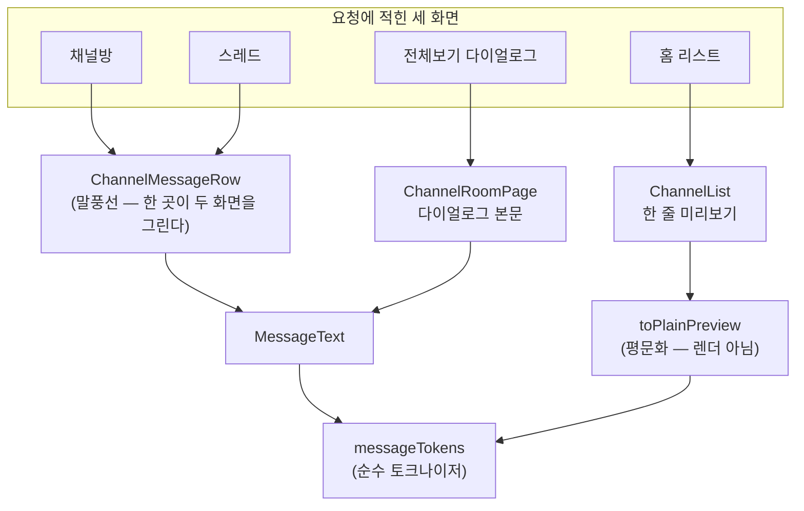
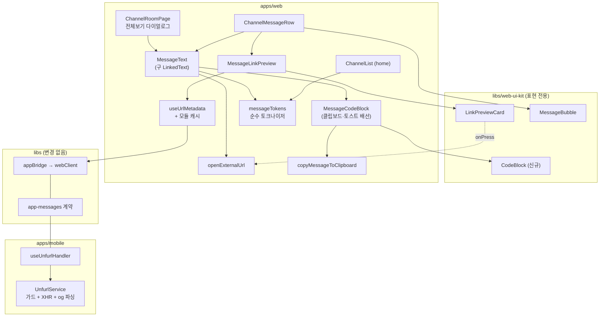
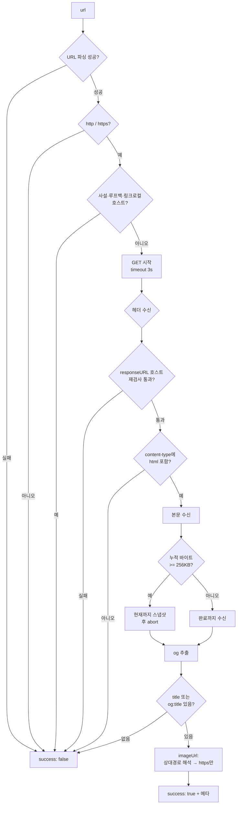

# 채팅 메시지 본문 렌더링 (링크 프리뷰 · 코드블럭)

> 상태: Live · 최종 갱신: 2026-08-14 · 관련 ADR: [ADR-0034](adr/0034-chat-link-preview-og-unfurl.md) (링크화·og 프리뷰) · [ADR-0055](adr/0055-web-code-block-home-sort-and-login-return.md) 결정 1 (코드블럭)

## 목적

`apps/web` 채팅 메시지의 **본문을 어떻게 렌더하는가**를 담당한다. 본문은 하나의 토크나이저를 거쳐
평문·URL·코드로 쪼개지고, 각 조각이 자기 방식으로 그려진다.

이 모듈이 주는 것은 셋이다.

1. **링크화** — 메시지 안의 URL을 탭 가능한 링크로 만든다. 네이티브 셸에서는 외부 브라우저로, 순수
   브라우저에서는 새 창으로 연다.
2. **og 프리뷰 카드** — 메시지당 첫 URL 하나에 대해 제목/설명/썸네일 카드를 버블 아래에 붙인다. 웹뷰는
   CORS 때문에 외부 페이지 HTML을 읽을 수 없으므로, **파싱은 모바일 셸(`apps/mobile`)이 대신 한다.**
3. **코드블럭** — 인라인 백틱(`` `code` ``)과 3중 백틱 펜스 블록을 등폭 폰트·배경·가로 스크롤로
   그린다. 펜스 블록에는 **코드 본문만** 복사하는 버튼이 붙는다.

셋은 **한 토크나이저를 공유한다.** 코드가 URL보다 먼저 잘리고, 코드 영역 안의 `https://...`는 링크가
되지 않으며 프리뷰 카드도 띄우지 않는다. 이건 부수 효과가 아니라 통합 토크나이저의 **설계 목표**다 —
코드 예제 속 URL이 언퍼링 카드를 띄우면 안 된다.

## 설계 원칙

이 영역을 앞으로 확장할 때도 지키는 기준.

1. **메시지 wire 스키마를 건드리지 않는다.** `ChatSendRequestData`에는 `attachments`/`meta`가 없다.
   프리뷰도 코드 여부도 메시지에 실어 보내는 것이 아니라 **렌더 시점에 파생**한다. 스키마를 늘리자는
   제안은 이 문서가 아니라 새 ADR의 몫이다.
2. **마크다운이 아니다 — 예외는 열거된 것뿐이다.** 지원하는 문법은 **인라인 백틱과 3중 백틱 펜스
   둘뿐**이다. 굵게·기울임·헤딩·리스트·인용·링크 문법은 **여전히 지원하지 않는다.** 여기에 하나를 더
   추가하려면 그건 product decision이고 ADR을 거친다 — 토크나이저를 만지는 김에 슬쩍 늘리는 것이
   아니다.
3. **코드가 먼저다.** 토크나이징은 단일 패스이고 **코드 영역을 먼저 확정한 뒤** 나머지에서만 URL을
   찾는다. 순서를 뒤집으면 코드 예제 속 URL이 링크가 된다.
4. **오탐보다 미탐이 낫다.** 닫히지 않은 백틱은 평문이고, 잘린 URL은 링크가 아니다. 과거 메시지에
   소급 적용되는 규칙이므로 **문장부호로 백틱을 쓴 옛 메시지가 코드로 둔갑하지 않는 쪽**을 고른다.
5. **셸이 없으면 조용히 없다.** 프리뷰는 부가 기능이다. `isNative()`가 false거나, 구버전 셸이
   `NOT_FOUND`를 돌려주거나, 페이지에 og가 없으면 **카드를 렌더하지 않는다.** 에러 토스트도, 스켈레톤
   잔상도, 자리 차지도 없다. 링크화와 코드블럭은 이 게이트와 무관하게 항상 동작한다.
6. **바이너리는 브릿지를 건너지 않는다.** 셸은 `https` `imageUrl` 문자열만 돌려주고, 이미지 바이트는
   웹뷰가 ``로 직접 받는다. 브릿지 메시지는 JSON 문자열 한 줄로 인코딩되므로 이미지를 실으면
   base64로 부풀어 메인 스레드를 막는다.
7. **셸의 og fetch는 SSRF 표면이다.** 누구나 임의 URL이 담긴 메시지를 보낼 수 있고, 셸은 그것을
   **자동으로** fetch한다. 프로토콜·호스트 검사, 리다이렉트 종착지 재검사, 타임아웃, 바이트 캡은 넷 다
   필수이고 하나라도 빼면 사내망 프로브가 된다. 여기에 코드를 추가할 때는 "이 입력을 공격자가 고른다"를
   전제로 읽는다.
8. **네트워크 경로는 교체 가능한 한 지점에 모은다.** unfurl 요청은 `appBridge.fetchUrlMetadata()`
   하나만 통과한다. 나중에 백엔드 unfurl 엔드포인트로 갈아탈 때 그 함수 하나만 바꾸면 되도록 유지한다
   (ADR-0034 대안 1).
9. **UI는 `web-ui-kit`(순수 표현), 데이터·브릿지·플랫폼 분기는 `apps/web`(피처).** 이 리포의 채팅
   컴포넌트 관례(`MessageRow`, `ReadReceipt`, `SystemNotice`, `MessageBubble`이 모두 kit에 있고 상태는
   앱이 갖는다)를 따른다. 코드블럭의 **모양**은 kit이, **클립보드와 토스트**는 앱이 갖는다.
10. **버블 안의 상호작용은 롱프레스와 경쟁한다.** 버블 전체가 롱프레스 타깃이므로, 그 안에 버튼을
    넣으려면 포인터 이벤트 경계를 **명시적으로** 끊어야 한다. 링크가 이미 같은 문제를 풀었고
    (`longPressFiredRef`), 복사 버튼은 그보다 한 걸음 더 간다.

## 범위

**포함**

- `apps/mobile`: `FetchUrlMetadata` 브릿지 핸들러 + og fetcher (SSRF 가드, 3초 타임아웃, 256KB 바이트
  캡, og→`<title>` 폴백) — **완료, 이번 개정에서 변경 없음**
- `apps/web`: 통합 토크나이저(코드 + URL), 메시지 본문 렌더러(버블 + 전체보기 다이얼로그), 링크 탭 시
  외부 브라우저 열기, 프리뷰 카드 마운트 + 세션 메모리 캐시, 홈 미리보기의 **평문화**
- `libs/web-ui-kit`: 표현 전용 `LinkPreviewCard`(완료), 표현 전용 `CodeBlock`(신규) (+ 스토리/테스트)
- `libs/app-messages`: **변경 없음** — 계약이 이미 있다 (아래 "상세 구현" 1 참고)

**제외**

- **신택스 하이라이팅과 언어별 색상.** shiki/highlight.js 계열 의존성을 모바일 웹 번들에 추가하지
  않는다 (ADR-0055 대안). 펜스의 언어 태그는 파싱해서 라벨로만 쓰거나 버린다.
- **코드블럭 외 마크다운 문법** — 굵게·기울임·취소선·헤딩·리스트·인용·링크 문법·멘션. 설계 원칙 2.
- **입력창(`MessageInput`)의 작성 보조** — 백틱 자동 닫기, 코드블럭 삽입 버튼, 작성 중 프리뷰.
- **홈 미리보기의 코드 뱃지·모노폰트.** 행 구조가 복잡해지고 `blurLastMessage` 설정과 얽힌다. 홈은
  **평문화만** 한다.
- **`apps/desktop` / `apps/desktop-web`.** 데스크톱에는 unfurl이 이미 별개로 있고
  (`apps/desktop/src/main/unfurl.ts`), 코드블럭도 이번 대상이 아니다. 가드 **규칙**은 참고하되 구현은
  별개다.
- 백엔드 unfurl 엔드포인트, 공유 캐시, 이미지 프록시, og 메타 영속 캐시 (SQLite / IndexedDB)
- 이미지 메시지(첨부) 기능 일반
- `ChannelRoomPage`의 재전송 `contentType` 누락 (ADR-0034가 기록한 인접 결함, 접촉하지 않는다)

## 시나리오

### S1. 네이티브 앱에서 링크 포함 메시지 보기 (주 경로)

1. 메시지 `content`에 `https://example.com/post/1`이 들어 있다.
2. 버블이 URL 부분을 `<a>`로 렌더한다. 탭하면 `isNative()`이므로 `appBridge.openURL`로 OS 브라우저가
   열린다.
3. 동시에 `MessageLinkPreview`가 마운트되어 `appBridge.fetchUrlMetadata(url)`을 호출한다.
4. 셸이 페이지를 fetch·파싱해 `{ success: true, title, description, imageUrl, siteName }`을 돌려준다.
5. 버블 **아래**에 카드가 나타난다. 썸네일은 웹뷰가 `https://…`에서 직접 받는다.
6. 결과는 모듈 레벨 `Map`에 캐싱된다. 스크롤로 행이 언마운트·재마운트되어도 다시 묻지 않고, 카드가
   깜빡이지 않는다.

### S2. 순수 브라우저 접속

링크화와 코드블럭은 동작한다 (링크 탭 → `window.open`). `isNative()`가 false이므로 프리뷰 요청 자체를
보내지 않고 **카드는 렌더되지 않는다.** 셸 없이는 CORS 때문에 파싱이 불가능하다.

### S3. 구버전 셸 (Capability Skew)

핸들러가 없는 셸은 `AppBridgeHost`가 `NOT_FOUND` 에러 응답을 만든다
(`libs/bridges/src/app/AppBridgeHost.ts:123-142`). 웹의 `request()` Promise가 reject되고
`.catch(() => null)`이 이를 "프리뷰 없음"으로 흡수한다. 사용자에게는 링크화·코드블럭만 된 평범한
메시지로 보인다. `BRIDGE_VERSION` bump가 없으므로 스큐 관리도 없다.

### S4. 프리뷰가 나오지 않는 정상 케이스들

전부 `success: false` → 카드 없음. 로그만 남고 사용자에게는 아무것도 뜨지 않는다.

| 입력                                            | 차단 지점                                                      |
| ----------------------------------------------- | -------------------------------------------------------------- |
| `ftp://…`, `mailto:…`                           | 프로토콜 검사 (요청 전)                                        |
| `http://192.168.0.1/`, `http://localhost:8080/` | 사설/루프백 호스트 검사 (요청 전)                              |
| 리다이렉트가 `http://10.0.0.5/`로 착지          | 종착지 재검사 (헤더 수신 시점, 본문 읽기 전 abort)             |
| `Content-Type: application/pdf`                 | HTML content-type 검사 (헤더 수신 시점, 본문 읽기 전 abort)    |
| 3초 무응답                                      | 타임아웃                                                       |
| og도 `<title>`도 없는 페이지                    | 제목 없으면 실패                                               |
| `og:image`가 `http://…`                         | https만 통과 (mixed content로 차단되므로 애초에 보내지 않는다) |
| **URL이 코드 영역 안에 있음**                   | **토크나이저 (요청 전) — `extractFirstUrl`이 코드를 건너뛴다** |

### S5. 200자 경계에 걸친 URL

버블은 `MAX_MESSAGE_LENGTH`(200자)를 넘는 메시지를 `content.slice(0, 200) + '...'`로 잘라 보여준다.

- **링크화는 잘린 문자열에 적용하고, 경계에 닿은 URL은 링크화하지 않는다.**
  `https://example.com/very/long/pa`를 링크로 만들면 잘못된 주소로 이동한다.
- **프리뷰 대상 URL은 전문(`content`)에서 찾는다.** 그래서 잘린 URL이어도 **카드는 정상으로 뜨고,
  카드 자체가 탭 가능하다** — 링크화가 포기한 이동 수단을 카드가 되돌려준다.
- 전체보기 다이얼로그는 전문을 자르지 않으므로 같은 URL이 정상 링크로 나온다.

### S6. 링크 위 롱프레스

링크를 길게 누르면 기존 메시지 액션 시트(복사)가 뜬다 — 링크화가 롱프레스를 가로채지 않는다.
롱프레스가 발동한 뒤 손을 떼며 발생하는 click은 삼켜서 **시트가 열리는 동시에 브라우저가 열리는 일이
없게** 한다.

### S7. 같은 링크를 여러 멤버가 본다

공유 캐시가 없으므로 채널 멤버마다 각자 셸이 fetch한다. 인기 링크는 N번 조회되고, 앱 재시작 시 화면에
보이는 링크를 다시 unfurl한다. 감수하는 비용이다 (ADR-0034 결과).

### S8. 코드블럭이 포함된 메시지 보기 (신규 주 경로)

1. 메시지 `content`가 이렇다:

    ````
    이렇게 쓰면 돼:
    ```ts
    const x = fetch('https://api.example.com');
    ```
    그리고 `npm i`
    ````

2. 토크나이저가 **코드부터** 자른다 → `[text, codeBlock(lang: 'ts'), text, code, ...]`.
3. 펜스 블록은 등폭 폰트 + 배경 + 가로 스크롤로 그려진다. **`https://api.example.com`은 링크가 되지
   않고, 프리뷰 카드도 뜨지 않는다** (설계 원칙 3).
4. `` `npm i` ``는 인라인 코드로 그려진다.
5. 펜스 블록 우상단의 복사 버튼을 누르면 **`const x = ...` 한 줄만** 클립보드로 간다 — 메시지 전체가
   아니다.
6. 같은 버블을 길게 누르면 기존 액션 시트가 뜨고, 거기서의 복사는 **메시지 전체**다. 둘은 공존한다.

### S9. 복사 버튼과 롱프레스가 겹치는 지점

1. 펜스 블록의 복사 버튼 위에서 손가락을 **길게** 누른다.
2. 버튼이 `pointerdown`을 삼켜 롱프레스 타이머가 **시작조차 하지 않는다** — 액션 시트가 뜨지 않는다.
3. 손을 떼면 복사만 실행된다.
4. 버튼을 **비껴서** 코드 본문을 길게 누르면 정상적으로 액션 시트가 뜬다.
5. 코드 본문에서 누르기 시작해 **버튼 위에서 떼면** 롱프레스는 정상적으로 **취소된다.** 버튼이 막는
   것은 제스처를 *시작*하는 이벤트뿐이고, 취소 이벤트는 그대로 통과시킨다.

이번 작업에서 가장 손이 많이 가는 지점이며, 실기기 확인이 필수인 항목이다.

### S10. 잘림과 펜스가 충돌한다

200자 경계가 펜스 **안**에 떨어질 수 있다.

- 잘린 지점에서 **열린 채 끝난 펜스는 닫힌 것으로 간주해** 렌더한다. 반쪽짜리 백틱 세 개가 평문으로
  노출되는 것보다 낫다.
- 전문은 전체보기 다이얼로그에서 온전히 본다 — 거기서는 자르지 않으므로 펜스가 원래대로 닫힌다.
- `LinkedText`의 `truncated`가 잘린 URL을 링크하지 않는 것과 **같은 원리**다: 자른 쪽이 그 사실을
  알려주고, 토크나이저가 그에 맞춰 보수적으로 판단한다.

### S11. 백틱을 문장부호로 쓴 옛 메시지

**소급 적용된다.** 코드블럭 지원을 켜는 순간 과거 메시지도 새 규칙으로 렌더된다. 불가피하며, 오탐을
줄이는 장치는 하나다 — **닫히지 않은 백틱은 평문**이다 (설계 원칙 4).

- ``이건 `중요` 해요`` → `중요`가 인라인 코드가 된다. (의도한 동작)
- ``이건 `중요해요`` → 닫는 백틱이 없으므로 **전부 평문.**

### S12. 홈 리스트의 한 줄 미리보기

홈은 말풍선이 아니라 한 줄이라 코드블럭을 렌더할 자리가 없다. 대신 **평문화한다.**

| 원문                                       | 홈 미리보기             |
| ------------------------------------------ | ----------------------- |
| ``배포는 `yarn deploy` 로``                | `배포는 yarn deploy 로` |
| ` ```ts\nconst x = 1;\nconst y = 2;\n``` ` | `const x = 1;`          |

목적은 **마크업 문자가 목록에서 소음으로 보이지 않게** 하는 것이다. 코드임을 알리는 뱃지·모노폰트는
넣지 않는다.

## 다이어그램

### 토크나이저 — 단일 패스, 코드 우선

````mermaid
flowchart TD
    A["message content"] --> B["1단계: 펜스 블록 스캔<br/>```lang ... ```"]
    B --> C{"닫히지 않은 펜스?"}
    C -- "truncated=true" --> D["끝까지를 블록으로 간주 (S10)"]
    C -- "truncated=false" --> E["평문으로 되돌림 (S11)"]
    C -- "닫혔다" --> F["codeBlock 토큰 확정"]
    D --> F
    E --> G
    F --> G["2단계: 남은 구간에서<br/>인라인 백틱 스캔"]
    G --> H{"짝이 맞는가?"}
    H -- 아니오 --> I["평문 유지 (S11)"]
    H -- 예 --> J["code 토큰 확정"]
    I --> K
    J --> K["3단계: 코드가 아닌 구간에서만<br/>URL 스캔 (기존 로직)"]
    K --> L["MessageToken[]"]
    L --> M["MessageText 렌더"]
    L --> N["extractFirstUrl<br/>(코드 구간 제외)"]
    N --> O["MessageLinkPreview"]
````

### 렌더 지점 — 세 화면이 두 호출자로



### 모듈 의존관계



### 셸의 가드 순서 (변경 없음)



## 상세 구현

### 1. 브릿지 계약 — 변경 없음

계약은 이미 전부 등록되어 있다. `libs/app-messages`는 **한 줄도 건드리지 않는다.**

- `libs/app-messages/src/types/model/unfurl.ts:10-23` — `FetchUrlMetadataPayload { url }`,
  `OnFetchUrlMetadataPayload { success, url, title?, description?, imageUrl?, siteName? }`
- `libs/app-messages/src/types/web-message.ts:112` — 요청 맵
- `libs/app-messages/src/types/app-message.ts:131` — 응답 맵
- `libs/app-messages/src/types/web-message-response.ts:43` — `FetchUrlMetadata: 'OnFetchUrlMetadata'`

`WEB_MESSAGE_RESPONSE_TYPE`이 `satisfies Record<WebMessageType, AppMessageType>`로 망라 검사되므로
(`web-message-response.ts:84`) 이미 짝이 맞다.

응답 봉투에 `success`가 **두 겹** 있다는 점이 중요하다. 메시지 레벨 `success`는 "핸들러가 정상
실행됐다"이고, `data.success`가 "이 URL의 프리뷰가 있다"이다. **unfurl 실패는 메시지 레벨 실패가
아니다** — 핸들러는 항상 `success: true` + `data.success: false`를 돌려준다. 메시지 레벨 실패로 만들면
웹이 정상적인 "og 없는 페이지"와 브릿지 장애를 구분할 수 없어진다.

### 2. `apps/mobile` — og fetcher (완료, 이번 개정에서 변경 없음)

**`apps/mobile/src/app/services/unfurl/UnfurlService.ts`.** `services/version`의 형태를 그대로 따른다 —
클래스 + `types.ts` + `index.ts`, 그리고 **순수 함수는 모듈 레벨로 export해 테스트에서 직접 부른다**.

네 조각으로 나뉘고, **그 중 I/O를 만지는 것은 하나뿐이다.** 이 분할이 테스트 가능성의 핵심이다 —
가드와 파싱은 XHR 없이 전부 검증된다.

```
parseUrl(raw): ParsedUrl | null                      // 순수
isPrivateHost(hostname): boolean                     // 순수. 표 기반 테스트
parseOgMetadata(html, requestUrl, landedUrl): {...}  // 순수. 정규식/폴백/상대경로 해석
fetchHtml(url): Promise<{ html, landedUrl } | null>  // 유일한 I/O. XHR 목으로 테스트
```

가드 상수: `UNFURL_TIMEOUT_MS = 3000`, `UNFURL_MAX_BYTES = 256 * 1024`.

**`parseUrl` — RN에는 쓸 수 있는 URL 파서가 없다.** RN의 `URL` 전역은 `href`/`toString()`만 있는
스텁이고 `protocol`·`hostname`을 노출하지 않는다. 그래서 가드가 표준 `URL`에 의존할 수 없고, 정규식
기반 스플리터를 직접 둔다. 여기서 **userinfo를 마지막 `@` 뒤로 잘라내는 것이 보안상 중요하다** —
`http://trusted.example@127.0.0.1/`은 사람 눈에는 `trusted.example`로 읽히지만 실제로는 루프백으로
붙는다.

**`isPrivateHost` — 화이트리스트가 아니라 "공개 호스트처럼 보이지 않으면 거절"이다.**
`localhost`/`.localhost`/`.local`/`.internal`, IPv4 점4옥텟의 `0.*`·`10.*`·`127.*`·`169.254.*`·
`172.16–31.*`·`192.168.*`, IPv6의 `::1`·`::`·`fc`/`fd`·`fe8`를 차단하고, **그 외에는 "점이 하나 이상 +
TLD가 알파벳 또는 punycode"를 만족해야 통과시킨다.** 이 마지막 규칙이 "점4옥텟이 아니니 통과" 방식이
놓치는 구멍들을 닫는다 — `http://2130706433/`, `http://0x7f000001/`, `http://017700000001/`은 모두
127.0.0.1이고, `http://wiki/` 같은 단일 라벨 사내 호스트도 함께 걸러진다.

**`fetchHtml` — 왜 `fetch`도 `axios`도 아니고 raw `XMLHttpRequest`인가.**

RN 0.83의 `fetch`는 XHR 기반이라 `response.body`가 없다. 스트리밍 리더로 바이트를 세는 방식은 **항상
빈 본문을 읽는다** (ADR-0034 제약). `axios`의 `onDownloadProgress` + `AbortController`도 문제가 남는다
— abort하면 axios가 reject하면서 **그때까지 받은 본문을 함께 버린다.** 256KB를 넘는 페이지(대형
뉴스·커머스는 흔하다)는 og가 `<head>`에 멀쩡히 있어도 프리뷰가 아예 안 나온다.

`XMLHttpRequest`를 직접 쓰면 세 가드가 다 제자리에 들어간다.

| 필요한 것                              | XHR에서                                                                                                                                                      |
| -------------------------------------- | ------------------------------------------------------------------------------------------------------------------------------------------------------------ |
| 헤더 시점에 content-type / 종착지 검사 | `readyState === 2`에서 `getResponseHeader('content-type')`, `xhr.responseURL` → 실패면 본문 받기 전에 `abort()`                                              |
| 바이트 캡 + **부분 본문 보존**         | `progress`에서 `event.loaded`로 바이트를 세고, 캡 도달 시 `xhr.responseText`를 **먼저 스냅샷한 뒤** `abort()` (abort는 내부 버퍼를 비우므로 순서가 중요하다) |
| 타임아웃                               | `xhr.timeout = 3000` + 바깥 `setTimeout` 이중 안전장치                                                                                                       |

리스너는 `on*` 대입이 아니라 **`addEventListener('progress' | 'readystatechange')`로 붙인다** — RN이
증분 텍스트 전달을 켜는 스위치가 그쪽이고, jsdom에서도 같은 API로 목을 만들 수 있다.

**`abort()`는 `abort` 이벤트를 동기적으로 발생시킨다.** 그래서 `finish()`를 먼저 부르고 그 다음에
`abort()`해야 한다 — 순서를 뒤집으면 `onabort`의 `null`이 경쟁에서 이겨 캡 케이스가 항상 빈 결과가
된다. `settled` 플래그가 뒤늦은 `onabort`를 무해하게 흡수한다.

증분 텍스트 가정이 틀려도 **손실은 없다** — 그 경우 스냅샷이 빈 문자열이 되어 "대용량 페이지는 프리뷰
실패", 즉 axios 방식과 정확히 같은 동작으로 degrade한다. 캡 이하 페이지는 완료 시점에 전문을 받으므로
영향이 없다. 상한만 있고 하한은 없는 선택이다.

**`parseOgMetadata`** — 속성 순서에 무관하게 `<meta>`를 뽑는다. `property|name` → `content` 정방향,
`content` → `property|name` 역방향 두 정규식을 시도한다. 엔티티를 디코드할 때 **`&amp;`를 마지막에
처리한다** — 먼저 처리하면 `&amp;lt;`가 `<`로 이중 디코딩된다.

- `title` = `og:title` ?? `<title>` — **없으면 실패한다.** 제목 없는 카드는 카드가 아니다.
- `description` = `og:description` ?? `description`
- `imageUrl` = `og:image`를 `landedUrl` 기준으로 절대화한 뒤 `https:`만 통과 (상대경로 `og:image`도 살린다)
- `siteName` = `og:site_name`
- `url` = 원본 요청 URL (종착지가 아니라 요청 URL — 웹의 캐시 키와 일치해야 한다)

**`apps/mobile/src/app/webview/hooks/useUnfurlHandler.ts`.** `useAppUpdateHandler.ts`와 같은 형태 —
`useServices()`에서 서비스를 받고 `useCallback`으로 감싼다. 핸들러는 **절대 throw하지 않고, 응답을
직접 post하지도 않는다** (`AppBridgeHost`가 반환값을 post한다). `type: 'OnFetchUrlMetadata' as const`의
`as const`는 필수다 — 빼면 TS가 `string`으로 넓혀 `WebMessageHandlerResponse`를 만족하지 않는다.

**등록 — `useWebMessageRouter.ts`의 3개 지점 + 배선 3개.** 핸들러 하나를 붙이려면 같은 이름을 여섯
곳에 적어야 하는 구조다 (라우터가 `handlersRef`를 초기 객체와 매 렌더 갱신 두 벌로 유지한다).

| #    | 위치                         | 내용                                    |
| ---- | ---------------------------- | --------------------------------------- |
| 1    | `useWebMessageRouter.ts:178` | `handlersRef` 초기 객체                 |
| 2    | `useWebMessageRouter.ts:242` | 매 렌더 갱신 `useEffect`의 동일 키 목록 |
| 3    | `useWebMessageRouter.ts:310` | `handlerMap`의 `FetchUrlMetadata`       |
| 배선 | `webview/hooks/index.ts`     | `export * from './useUnfurlHandler';`   |
| 배선 | `useWebMessageRouter.ts:22`  | `'./index'` import 블록                 |
| 배선 | `useWebMessageRouter.ts:107` | 훅 호출 + 구조분해                      |

서비스 등록은 `version`과 동일한 3곳: `services/provider.ts`(private 필드 + lazy getter),
`services/index.ts` 재export, `hooks/useServices.ts` 노출. 로그 태그는 `services/log/types.ts`의
`LogTag` 유니온에 `'UNFURL'`을 추가했다.

### 3. `apps/web` — 통합 토크나이저 (`features/channels/utils/messageTokens.ts`)

`linkTokens.ts`를 **`messageTokens.ts`로 이름을 바꾸고** 토큰 종류를 넓힌다. 파일의 정체가
"링크 토큰"에서 "메시지 토큰"으로 바뀌었고, 파일 상단의 `Deliberately URLs only — no markdown` 주석은
설계 원칙 2로 대체된다.

```ts
export type MessageToken =
    | { type: 'text'; value: string }
    | { type: 'url'; value: string }
    | { type: 'code'; value: string } // 인라인 백틱
    | { type: 'codeBlock'; value: string; lang?: string }; // 3중 백틱 펜스

export interface TokenizeOptions {
    /** 텍스트가 잘렸다. 끝에 닿은 URL은 링크하지 않고, 열린 채 끝난 펜스는 닫힌 것으로 본다. */
    truncated?: boolean;
}

export const tokenizeMessage = (text: string, options?: TokenizeOptions): MessageToken[];
export const extractFirstUrl = (text: string): string | undefined;
export const toPlainPreview = (text: string): string;
```

**3단계 단일 패스** (설계 원칙 3):

1. **펜스 스캔** — ` ```lang?\n ... ``` `. 언어 태그는 파싱해 `lang`으로 보관하되 **색은 입히지
   않는다.** 닫히지 않은 펜스는 `truncated`이면 끝까지를 블록으로(S10), 아니면 평문으로(S11).
2. **인라인 백틱 스캔** — 1단계가 남긴 비-코드 구간에서만. 줄바꿈을 넘지 않는 짝(`` `x` ``)만 코드로
   본다. 짝이 없으면 평문.
3. **URL 스캔** — 1·2단계가 남긴 비-코드 구간에서만 **기존 로직 그대로** 돌린다. 후행 문장부호
   정리(`trimTrailingNoise`), 괄호 균형 보존, `isLinkable`, `dropTrailingUrl`은 한 줄도 바뀌지 않는다.

`extractFirstUrl`은 `tokenizeMessage(text).find(t => t.type === 'url')`로 유지된다 — 3단계가 코드를
건너뛰므로 **코드 안의 URL이 프리뷰 카드를 띄우지 않는 성질을 자동으로 얻는다** (S4 마지막 행).

`toPlainPreview`는 홈 전용 평문화다 (S12). 토큰을 순회해 `code`는 값만, `codeBlock`은 **첫 비어 있지
않은 줄만** 남기고 이어 붙인다. 렌더가 아니라 문자열 → 문자열 변환이다. (붙여넣은 코드는 빈 줄로
시작하는 경우가 흔해서, 문자 그대로 첫 줄을 쓰면 행이 빈 채널처럼 보인다.)

**펜스 줄의 줄바꿈은 펜스가 가져간다.** 여는·닫는 펜스가 놓인 줄의 개행을 앞뒤 텍스트 런에 남기면,
말풍선이 `whitespace-pre-wrap`이고 블록은 이미 자기 박스라 **모든 코드블럭 위아래에 빈 줄이 하나씩**
쌓인다(크롬 실측: 한 줄 상자만큼 차이). CommonMark와 같은 처리다.

**후행 문자 정리(`trimTrailingNoise`)는 선형이어야 한다.** 원래 구현은 문자를 하나 떼어낼 때마다
`$` 앵커 정규식과 6번의 `split()`을 문자열 전체에 다시 돌렸다 — 이차식이고, 메시지 내용은 보내는
사람이 고른다. 문장부호 6만 개를 붙인 메시지 하나가 메인 스레드를 약 9초 멈춘다. 홈이 채널마다
마지막 메시지 전문을 토크나이징하게 되면서 **그 한 메시지가 채널 멤버 전원의 홈을 멈추는 경로**가
열렸으므로, 개수를 한 번만 세고 인덱스만 뒤로 옮기도록 고쳤다.

### 4. `apps/web` — 본문 렌더러 (`features/channels/components/MessageText.tsx`)

`LinkedText.tsx`를 **`MessageText.tsx`로 이름을 바꾼다.** 더 이상 링크만 다루지 않는다.

```ts
export interface MessageTextProps {
    text: string;
    /** 잘린 문자열 — 끝에 닿은 URL과 열린 펜스의 처리를 바꾼다. */
    truncated?: boolean;
    /** 기본값: openExternalUrl. 롱프레스 억제 등 호출자 사정이 있을 때 대체한다. */
    onUrlClick?: (url: string) => void;
    /**
     * 펜스 블록 하나를 그린다. 말풍선이 복사 버튼을 배선해 넘기고, 필요 없는 곳(전체보기
     * 다이얼로그)은 넘기지 않아 읽기 전용 블록이 된다.
     */
    renderCodeBlock?: (code: string, lang: string | undefined, key: number) => ReactNode;
}
```

렌더러를 **prop으로 받는 이유**: 복사 버튼은 클립보드와 토스트를 알아야 하므로 표현 계층에 둘 수 없고,
전체보기 다이얼로그처럼 버튼이 불필요한 자리도 있다. `MessageText`는 "코드블럭이다"까지만 알고 무엇을
그릴지는 호출자가 정한다. 넘기지 않으면 kit의 `CodeBlock`을 버튼 없이 그대로 쓴다.

```ts

```

토큰별 렌더:

| 토큰        | 렌더                                                               |
| ----------- | ------------------------------------------------------------------ |
| `text`      | `<Fragment>` — 지금과 동일                                         |
| `url`       | `<a href target="_blank" rel="noreferrer noopener">` — 지금과 동일 |
| `code`      | kit의 `InlineCode` — 등폭 + 옅은 배경 + 좌우 패딩                  |
| `codeBlock` | `MessageCodeBlock` (앱) → kit의 `CodeBlock`                        |

> **`<pre>`를 쓰지 않는다.** `MessageBubble`이 children을 `<span className="whitespace-pre-wrap">`으로
> 감싸므로(`MessageBubble.tsx:44`) 그 안의 `<pre>`는 **인라인 요소 안의 블록 요소**가 되어 유효하지 않은
> HTML이다. `<span className="block …">`로 그리고, 줄바꿈은 부모의 `whitespace-pre-wrap`이 이미
> 보존한다.

### 5. `libs/web-ui-kit` — `CodeBlock` / `InlineCode` (신규)

kit의 기존 관례(컴포넌트 + `.stories.tsx` + `.test.tsx`, `composites/chat/index.ts`에 export)를 따른다.

```ts
export interface CodeBlockProps {
    code: string;
    /** 펜스의 언어 태그. 라벨로만 쓰고 색은 입히지 않는다. */
    lang?: string;
    /** 복사 버튼을 렌더한다. 클립보드 접근은 호출자 몫 (설계 원칙 9). */
    onCopy?: () => void;
    copyLabel?: string;
    /** 복사 직후 체크 표시 등 피드백 상태 — 호출자가 소유한다. */
    copied?: boolean;
    className?: string;
}
```

표현 전용이다 — 클립보드도 토스트도 `isNative()`도 모른다.

- 루트는 `<span className="block …">`, 본문은 `font-mono text-[13px]` + `overflow-x-auto`.
  **가로 스크롤이 하이라이팅 대신 가독성을 담당한다** (ADR-0055 대안).
- `overflow-x-auto`가 버블 밖으로 밀지 않도록 `min-w-0`을 함께 준다 — `MessageBubble.tsx:40-43`이 남긴
  교훈과 같은 이유다.
- 복사 버튼은 우상단. **`onCopy`가 없으면 렌더하지 않는다** (전체보기 다이얼로그처럼 필요 없는 곳).
- `lang`은 좌상단에 옅은 라벨로. 없으면 라벨 자체를 렌더하지 않는다.

`InlineCode`는 같은 파일에서 함께 export한다 — `<code>`에 등폭·옅은 배경·`text-[0.9em]`. 고정 크기가
아니라 `em`인 것은, 말풍선 줄 안에 앉아야 하고 두 버블 변형이 서로 다른 색을 두르기 때문이다.

### 6. `apps/web` — `MessageCodeBlock`과 포인터 이벤트 경계

kit의 `CodeBlock`에 클립보드·토스트를 잇는 얇은 층이며, **설계 원칙 10을 실제로 집행하는 곳**이다
(S9).

```tsx
// 버블 전체가 롱프레스 타깃이다(ChannelMessageRow의 span). 복사 버튼 위에서 시작한 포인터는
// 그 타이머를 시작시키면 안 되므로, 여기서 전파를 끊는다. 링크가 longPressFiredRef로 "이미
// 발동한 롱프레스의 click을 삼키는" 사후 처리를 한다면, 버튼은 애초에 제스처가 시작되지
// 않게 하는 사전 처리다.
const stopGesture = (event: React.PointerEvent | React.MouseEvent) => event.stopPropagation();

<CodeBlock
    code={value}
    lang={lang}
    copied={copied}
    onCopy={handleCopy}
    // ↓ kit 쪽 버튼에 그대로 전달되는 핸들러들
/>;
```

버튼이 막는 것은 **제스처를 시작하는 두 이벤트뿐**이다 — `onPointerDown`과 `onContextMenu`.

`ChannelMessageRow`는 `onPointerDown`으로 타이머를 **걸고**, `onPointerUp`/`onPointerLeave`/
`onPointerCancel`로 타이머를 **푼다**(`ChannelMessageRow.tsx:246-250`). 그래서 뒤의 셋까지 막으면
의도와 정반대가 된다 — 코드 본문에서 누르기 시작해 버튼 위에서 뗀 제스처는 취소가 삼켜져 액션 시트가
그대로 열린다. 터치에서는 implicit pointer capture가 `pointerup`을 `pointerdown` 요소로 되돌려
가려지지만 마우스에서는 그대로 재현된다.

복사는 기존 `copyMessageToClipboard`(`features/channels/utils/`)를 그대로 쓴다 — 네이티브
`appBridge.copyClipBoard`와 브라우저 `navigator.clipboard` 분기가 이미 그 안에 있다. 성공 시
`chat.room.messageCopied` 토스트를 재사용한다.

### 7. `apps/web` — 호출 지점 세 곳

| 지점                                 | 변경                                                                                                                                  |
| ------------------------------------ | ------------------------------------------------------------------------------------------------------------------------------------- |
| `ChannelMessageRow.tsx:268`          | `<LinkedText>` → `<MessageText>`. **채널방과 스레드 두 화면이 여기서 동시에 해결된다** — `ThreadPage.tsx:234`도 같은 컴포넌트를 쓴다. |
| `ChannelRoomPage.tsx:897` (전체보기) | `<LinkedText>` → `<MessageText>`. 전문이므로 `truncated`를 넘기지 않고, 펜스가 온전하다. 복사 버튼은 렌더하지 않는다.                 |
| `ChannelList.tsx:117` (홈 미리보기)  | `preview`에 `toPlainPreview(...)`를 씌운다. tombstone 분기는 그 앞에 그대로 있다 — 삭제된 메시지는 애초에 `content`를 쓰지 않는다.    |

`extractFirstUrl` 호출부(`ChannelMessageRow.tsx:119`)는 **시그니처가 같아 변경이 없다.** 코드 건너뛰기는
토크나이저 안에서 일어난다.

### 8. `apps/web` — 프리뷰 요청과 캐시 (변경 없음)

**`features/channels/hooks/useUrlMetadata.ts`.** 모듈 레벨 상태 + 훅.

```
const CACHE_MAX = 500;
const cache    = new Map<string, UrlMetadata | null>();   // null = 실패 (음성 캐시)
const inFlight = new Map<string, Promise<UrlMetadata | null>>();
```

- `cache.get(url) !== undefined`로 히트를 판정한다 — 이래야 `null`(실패)도 진짜 히트가 되어 스크롤 중
  같은 실패 URL을 다시 묻지 않는다.
- `inFlight`로 중복 요청을 합친다. 같은 링크가 여러 메시지에 있으면 한 번만 나간다.
- 캡 초과 시 `cache.keys().next().value`를 지운다 — 삽입 순서(FIFO) 축출이다.
- 실패는 전부 `null`로 접는다: reject(브릿지 `NOT_FOUND`/타임아웃), `data.success === false`, `title`
  없음 — 호출자에게는 다 같은 "카드 없음"이다.
- 훅은 `useState`의 lazy initializer로 캐시를 **동기 조회**해 재마운트 시 깜빡임을 없앤다.
- `__resetUrlMetadataCache()`를 test seam으로 export한다.

**`apps/web/src/app/bridge/appBridge.ts`의 `fetchUrlMetadata`** — 설계 원칙 8의 교체 지점이다.

### 9. `libs/web-ui-kit` — `LinkPreviewCard` (변경 없음)

표현 전용이다 — 브릿지도 `isNative()`도 데이터 패칭도 모르고, 이동은 `onPress`로 호출자에게 넘긴다.

- 루트는 `<a href={url} onClick={onPress}>`. 라벨은 `siteName` → `title` → `description` 순의 세로 스택,
  썸네일은 오른쪽 고정 정사각.
- `min-w-0` + `truncate`/`line-clamp-2`로 긴 제목이 카드를 밀어내지 않게 한다.
- ``에 **`referrerPolicy="no-referrer"`**, `loading="lazy"`, `alt=""`.
- 이미지 로드 실패는 로컬 state로 감춘다. 채팅 버블 밑에 깨진 이미지 아이콘이 남는 것이 카드에 썸네일이
  없는 것보다 나쁘다.
- ``에 `bg-secondary`를 깔아 로딩 중 구멍처럼 보이지 않게 한다.

**`MessageLinkPreview.tsx`** — 훅과 kit 카드를 잇는 얇은 층. 카드 폭은 여기서 `w-[260px]`로 정한다
(레이아웃 결정은 앱, 표현은 kit).

## 검증 방법

### 유닛 테스트

`apps/web`은 `it()` 설명을 영어로, `apps/mobile`은 한국어로 쓴다 (각 디렉터리의 기존 관례).

| 파일                                        | 커버                                                                                                                                                                                                                                                                                                                                                                                                    |
| ------------------------------------------- | ------------------------------------------------------------------------------------------------------------------------------------------------------------------------------------------------------------------------------------------------------------------------------------------------------------------------------------------------------------------------------------------------------- |
| `.../utils/messageTokens.test.ts`           | **기존 URL 케이스 24건 전부 무수정 통과**(회귀) · 인라인 백틱 짝/짝없음/줄바꿈 금지/빈 짝 · 펜스 + 언어 태그 · 단일 줄 펜스 · 줄바꿈 보존 · 앞뒤 텍스트 분리 · 미종결 펜스는 평문, `truncated`면 블록(S10) · 언어 태그가 아닌 첫 줄은 코드 · **코드 안 URL은 `url` 토큰이 되지 않는다** · **`extractFirstUrl`이 코드를 건너뛴다**(S4) · 혼합 문자열 토큰 순서 · `toPlainPreview` 5케이스(S12) — 총 48건 |
| `.../components/MessageText.test.tsx`       | 기존 앵커 케이스 전부 통과(회귀)                                                                                                                                                                                                                                                                                                                                                                        |
| `.../components/ChannelMessageRow.test.tsx` | 인라인/펜스 렌더 · 언어 태그 전달 · 코드 안 URL은 링크도 프리뷰 카드도 아니다 · 복사 버튼 존재 · **복사 버튼 위 롱프레스가 액션 시트를 열지 않는다**(S9) · 버튼을 비낀 롱프레스는 정상 · 버튼 위 우클릭도 차단 · 잘림으로 열린 펜스가 블록으로 렌더(S10) · 기존 링크·프리뷰 23건 유지                                                                                                                   |
| `.../home/components/ChannelList.test.tsx`  | 백틱을 벗긴 미리보기 · 펜스는 첫 줄만(S12) · tombstone 분기가 평문화보다 앞선다                                                                                                                                                                                                                                                                                                                         |
| `libs/web-ui-kit/.../CodeBlock.test.tsx`    | 본문 렌더 · `lang` 라벨 유무 · `onCopy` 없으면 버튼 미렌더 · `copied` 상태 · **`buttonProps`가 실제 버튼에 전달된다**(S9의 kit 쪽 계약) · **긴 줄은 `whitespace-pre` + `overflow-x-auto`** · **`<pre>`를 쓰지 않는다** · `InlineCode`                                                                                                                                                                   |

**기존 유지 (회귀 확인용):** `UnfurlService.test.ts`, `useUnfurlHandler.test.ts`,
`openExternalUrl.test.ts`, `useUrlMetadata.test.ts`, `LinkPreviewCard.test.tsx` — 전부 무수정 통과.
`apps/mobile`은 이번 개정에서 한 줄도 바뀌지 않았다.

```bash
npx nx test web && npx nx test web-ui-kit
```

결과: `web` 288 스위트 2321건, `web-ui-kit` 66/296 전부 통과.

> `ChannelMessageRow.test.tsx`가 `@chatic/web-ui-kit`을 통째로 목킹하므로 `CodeBlock`/`InlineCode`
> 스텁을 함께 넣었다. 그 스텁은 **`buttonProps`를 진짜 `<button>`에 전달하는 것까지만 충실하다** —
> 롱프레스 차단이 성립하는 지점이 거기이고, 실제 컴포넌트가 그렇게 한다는 사실은 kit 테스트가 따로
> 고정한다. 클립보드 헬퍼(`copyMessageToClipboard`)도 목킹했다: 임포트 시점에 브릿지 배럴을 끌어와
> jsdom에서 `import.meta` 파싱이 깨진다(이 리포의 알려진 지뢰).

### i18n

복사 버튼 라벨 `chat.room.copyCode` / `chat.room.codeCopied`를 `ko`·`en` 양쪽에 추가했다.
`i18n/localeParity.test.ts`가 두 로케일의 키 집합을 대조하므로 한쪽만 넣으면 실패한다.

### 스토리북 확인 (미완료)

`npx nx storybook @chatic/web-ui-kit` → `web-ui-kit/composites/CodeBlock`. **아직 육안으로 보지
않았다.** `InBubbles` 스토리가 `mine`(어두운 버블) × `other`(밝은 버블)을 나란히 그리도록 만들어 둔
것은, 색이 없는 상태에서 **배경 대비만으로 코드가 구분되어야 하기 때문**이다. 확인할 것:

- 라이트/다크 × mine/other 네 조합에서 코드 배경이 버블 배경과 구분되는가.
- `LongLine` 스토리에서 가로 스크롤이 **코드블럭 안에서만** 생기고 버블·페이지가 밀리지 않는가.
- 좁은 폭(≤ 260px)에서 `lang` 라벨과 복사 버튼이 겹치지 않는가.

### 수동 확인 (미완료, 실기기)

**S9(복사 버튼 vs 롱프레스)는 유닛 테스트로 다 덮이지 않는다.** jsdom의 포인터 이벤트는
WKWebView/Android WebView와 다르게 동작할 수 있고, 이번 작업에서 가장 깨지기 쉬운 지점이다.

1. **복사 버튼 롱프레스** — 버튼 위를 길게 누른다. 액션 시트가 뜨면 실패.
2. **코드 본문 롱프레스** — 버튼을 비껴 길게 누른다. 액션 시트가 떠야 한다.
3. **복사 결과** — 버튼으로 복사하면 **코드만**, 액션 시트로 복사하면 **메시지 전체**.
4. **가로 스크롤** — 긴 줄을 좌우로 밀 때 채팅 목록이 세로로 스크롤되지 않는지.
5. **잘림 + 펜스**(S10) — 200자를 넘고 경계가 펜스 안에 떨어지는 메시지로 버블과 전체보기를 비교.
6. **홈 미리보기**(S12) — 백틱·펜스 메시지를 마지막으로 보낸 뒤 홈에 백틱이 안 보이는지.
7. **전체보기 다이얼로그의 코드블럭 폭** — 다이얼로그 본문이 `break-all`이라 코드블럭 안에서도
   걸리면 가로 스크롤 대신 강제 줄바꿈이 된다. 걸리면 코드블럭에 `break-normal`을 준다.

기존 미완료 항목(RN 증분 `responseText`, 링크 탭, 썸네일 로드)은 ADR-0034 시점 그대로 남아 있다.

브라우저(`isNative()` false)에서는 **링크화·코드블럭만 되고 카드는 없는 것이 정상이다.**
