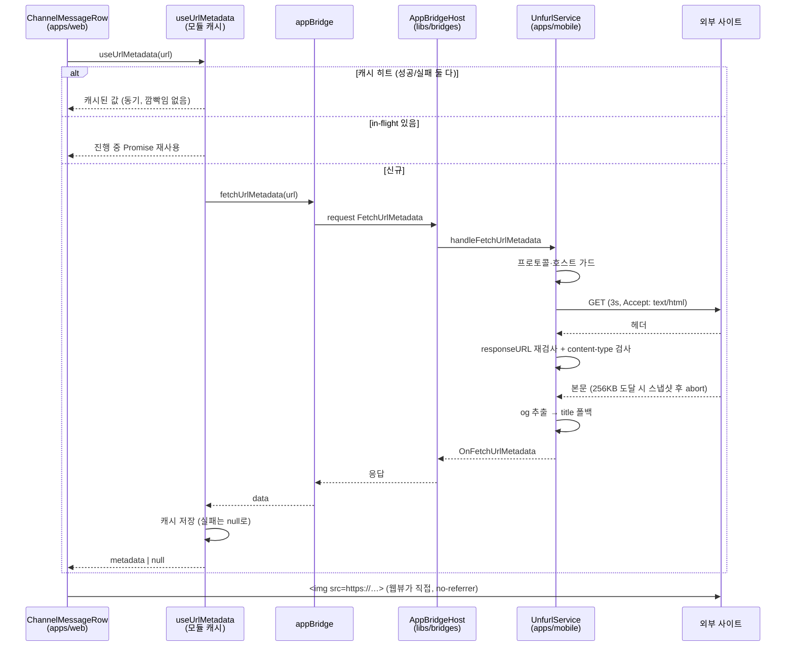
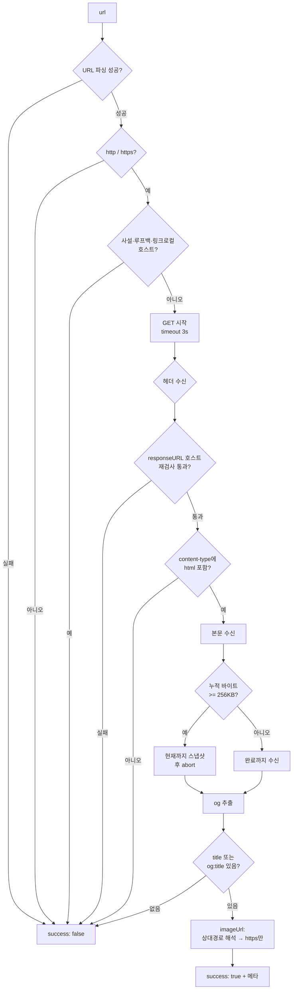
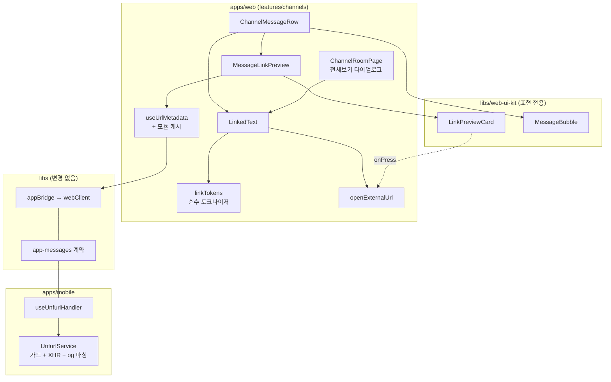

# 채팅 링크 프리뷰 (Chat Link Preview)

> 상태: Live · 최종 갱신: 2026-08-01 · 관련 ADR: [ADR-0034](adr/0034-chat-link-preview-og-unfurl.md)

## 목적

`apps/web` 채팅방의 메시지 본문은 지금 **생문자열로만 렌더된다** (`ChannelMessageRow.tsx:214`, `MessageBubble.tsx:44`). 링크가 링크로 보이지 않고, **탭할 수조차 없다.** 사용자는 URL을 손으로 골라 복사해 브라우저에 붙여야 한다.

이 모듈은 두 가지를 준다.

1. **링크화** — 메시지 안의 URL을 탭 가능한 링크로 만든다. 네이티브 셸에서는 외부 브라우저로, 순수 브라우저에서는 새 창으로 연다.
2. **og 프리뷰 카드** — 메시지당 첫 URL 하나에 대해 제목/설명/썸네일 카드를 버블 아래에 붙인다. 웹뷰는 CORS 때문에 외부 페이지 HTML을 읽을 수 없으므로, **파싱은 모바일 셸(`apps/mobile`)이 대신 한다.**

둘의 가치 크기는 다르다. **링크화가 먼저다** — 프리뷰는 없으면 아쉬운 기능이지만, 탭할 수 없는 링크는 결함이다.

## 설계 원칙

이 영역을 앞으로 확장할 때도 지키는 기준.

1. **메시지 wire 스키마를 건드리지 않는다.** `ChatSendRequestData`에는 `attachments`/`meta`가 없다. 프리뷰 데이터는 메시지에 실어 보내는 것이 아니라 **렌더 시점에 파생**한다. 프리뷰를 위해 스키마를 늘리자는 제안은 이 문서가 아니라 새 ADR의 몫이다.
2. **셸이 없으면 조용히 없다.** 프리뷰는 부가 기능이다. `isNative()`가 false거나, 구버전 셸이 `NOT_FOUND`를 돌려주거나, 페이지에 og가 없으면 **카드를 렌더하지 않는다.** 에러 토스트도, 스켈레톤 잔상도, 자리 차지도 없다. 링크화는 이 게이트와 무관하게 항상 동작한다.
3. **바이너리는 브릿지를 건너지 않는다.** 셸은 `https` `imageUrl` 문자열만 돌려주고, 이미지 바이트는 웹뷰가 ``로 직접 받는다. 브릿지 메시지는 JSON 문자열 한 줄로 인코딩되므로 이미지를 실으면 base64로 부풀어 메인 스레드를 막는다.
4. **셸의 og fetch는 SSRF 표면이다.** 누구나 임의 URL이 담긴 메시지를 보낼 수 있고, 셸은 그것을 **자동으로** fetch한다. 프로토콜·호스트 검사, 리다이렉트 종착지 재검사, 타임아웃, 바이트 캡은 넷 다 필수이고 하나라도 빼면 사내망 프로브가 된다. 여기에 코드를 추가할 때는 "이 입력을 공격자가 고른다"를 전제로 읽는다.
5. **네트워크 경로는 교체 가능한 한 지점에 모은다.** unfurl 요청은 `appBridge.fetchUrlMetadata()` 하나만 통과한다. 나중에 백엔드 unfurl 엔드포인트로 갈아탈 때 그 함수 하나만 바꾸면 되도록 유지한다 (ADR-0034 대안 1).
6. **UI는 `web-ui-kit`(순수 표현), 데이터·브릿지·플랫폼 분기는 `apps/web`(피처).** 이 리포의 채팅 컴포넌트 관례(`MessageRow`, `ReadReceipt`, `SystemNotice`가 모두 kit에 있고 상태는 앱이 갖는다)를 따른다.

## 범위

**포함**

- `apps/mobile`: `FetchUrlMetadata` 브릿지 핸들러 + og fetcher (SSRF 가드, 3초 타임아웃, 256KB 바이트 캡, og→`<title>` 폴백)
- `apps/web`: URL 링크화 (버블 + 전체보기 다이얼로그), 링크 탭 시 외부 브라우저 열기, 프리뷰 카드 마운트 + 세션 메모리 캐시
- `libs/web-ui-kit`: 표현 전용 `LinkPreviewCard` (+ 스토리/테스트)
- `libs/app-messages`: **변경 없음** — 계약이 이미 있다 (아래 "상세 구현" 1 참고)

**제외**

- **`apps/desktop` / `apps/desktop-web`은 이번 범위 밖이다.** 데스크톱에는 같은 기능이 이미 있으나(`apps/desktop/src/main/unfurl.ts`, `apps/desktop-web/.../LinkPreviewCard.tsx`) 이번 작업은 그 코드를 읽지도 고치지도 통합하지도 않는다. 가드 **규칙**은 참고하되 구현은 별개다.
- 백엔드 unfurl 엔드포인트, 공유 캐시, 이미지 프록시
- og 메타 영속 캐시 (SQLite / IndexedDB)
- 마크다운 서식(볼드/이탤릭/취소선/멘션) — URL만 링크화한다
- 이미지 메시지(첨부) 기능 일반
- `ChannelRoomPage.tsx:242`의 재전송 `contentType` 누락 (ADR-0034가 기록한 인접 결함, 접촉하지 않는다)

## 시나리오

### S1. 네이티브 앱에서 링크 포함 메시지 보기 (주 경로)

1. 메시지 `content`에 `https://example.com/post/1`이 들어 있다.
2. 버블이 URL 부분을 `<a>`로 렌더한다. 탭하면 `isNative()`이므로 `appBridge.openURL`로 OS 브라우저가 열린다.
3. 동시에 `MessageLinkPreview`가 마운트되어 `appBridge.fetchUrlMetadata(url)`을 호출한다.
4. 셸이 페이지를 fetch·파싱해 `{ success: true, title, description, imageUrl, siteName }`을 돌려준다.
5. 버블 **아래**에 카드가 나타난다. 썸네일은 웹뷰가 `https://…`에서 직접 받는다.
6. 결과는 모듈 레벨 `Map`에 캐싱된다. 스크롤로 행이 언마운트·재마운트되어도 다시 묻지 않고, 카드가 깜빡이지 않는다.

### S2. 순수 브라우저 접속

링크화는 동작한다 (탭 → `window.open`). `isNative()`가 false이므로 프리뷰 요청 자체를 보내지 않고 **카드는 렌더되지 않는다.** 셸 없이는 CORS 때문에 파싱이 불가능하다.

### S3. 구버전 셸 (Capability Skew)

핸들러가 없는 셸은 `AppBridgeHost`가 `NOT_FOUND` 에러 응답을 만든다 (`libs/bridges/src/app/AppBridgeHost.ts:123-142`). 웹의 `request()` Promise가 reject되고, `.catch(() => null)`이 이를 "프리뷰 없음"으로 흡수한다. 사용자에게는 링크화만 된 평범한 메시지로 보인다. `BRIDGE_VERSION` bump가 없으므로 스큐 관리도 없다.

### S4. 프리뷰가 나오지 않는 정상 케이스들

전부 `success: false` → 카드 없음. 로그만 남고 사용자에게는 아무것도 뜨지 않는다.

| 입력                                            | 차단 지점                                                      |
| ----------------------------------------------- | -------------------------------------------------------------- |
| `ftp://…`, `mailto:…`                           | 프로토콜 검사 (요청 전)                                        |
| `http://192.168.0.1/`, `http://localhost:8080/` | 사설/루프백 호스트 검사 (요청 전)                              |
| 리다이렉트가 `http://10.0.0.5/`로 착지          | 종착지 재검사 (헤더 수신 시점, 본문 읽기 전 abort)             |
| `Content-Type: application/pdf`                 | HTML content-type 검사 (헤더 수신 시점, 본문 읽기 전 abort)    |
| 3초 무응답                                      | 타임아웃                                                       |
| og도 `<title>`도 없는 페이지                    | 제목 없으면 실패                                               |
| `og:image`가 `http://…`                         | https만 통과 (mixed content로 차단되므로 애초에 보내지 않는다) |

### S5. 200자 경계에 걸친 URL

버블은 200자를 넘는 메시지를 `content.slice(0, 200) + '...'`로 잘라 보여준다 (`ChannelMessageRow.tsx:214`).

- **링크화는 잘린 문자열에 적용하고, 경계에 닿은 URL은 링크화하지 않는다.** `https://example.com/very/long/pa`를 링크로 만들면 잘못된 주소로 이동한다.
- **프리뷰 대상 URL은 전문(`content`)에서 찾는다.** 그래서 잘린 URL이어도 **카드는 정상으로 뜨고, 카드 자체가 탭 가능하다** — 링크화가 포기한 이동 수단을 카드가 되돌려준다.
- 전체보기 다이얼로그는 전문을 자르지 않으므로 같은 URL이 정상 링크로 나온다.

### S6. 링크 위 롱프레스

링크를 길게 누르면 기존 메시지 액션 메뉴(복사)가 뜬다 — 링크화가 롱프레스를 가로채지 않는다. 롱프레스가 발동한 뒤 손을 떼며 발생하는 click은 삼켜서 **메뉴가 열리는 동시에 브라우저가 열리는 일이 없게** 한다.

### S7. 같은 링크를 여러 멤버가 본다

공유 캐시가 없으므로 채널 멤버마다 각자 셸이 fetch한다. 인기 링크는 N번 조회되고, 앱 재시작 시 화면에 보이는 링크를 다시 unfurl한다. 감수하는 비용이다 (ADR-0034 결과).

## 다이어그램

### 요청 왕복



### 셸의 가드 순서



### 모듈 의존관계



## 상세 구현

### 1. 브릿지 계약 — 변경 없음

계약은 이미 전부 등록되어 있다. `libs/app-messages`는 **한 줄도 건드리지 않는다.**

- `libs/app-messages/src/types/model/unfurl.ts:10-23` — `FetchUrlMetadataPayload { url }`, `OnFetchUrlMetadataPayload { success, url, title?, description?, imageUrl?, siteName? }`
- `libs/app-messages/src/types/web-message.ts:112` — 요청 맵
- `libs/app-messages/src/types/app-message.ts:131` — 응답 맵
- `libs/app-messages/src/types/web-message-response.ts:43` — `FetchUrlMetadata: 'OnFetchUrlMetadata'`

`WEB_MESSAGE_RESPONSE_TYPE`이 `satisfies Record<WebMessageType, AppMessageType>`로 망라 검사되므로(`web-message-response.ts:84`) 이미 짝이 맞다. **비어 있는 것은 모바일 셸의 핸들러 하나뿐이다.**

응답 봉투에 `success`가 **두 겹** 있다는 점이 중요하다. 메시지 레벨 `success`는 "핸들러가 정상 실행됐다"이고, `data.success`가 "이 URL의 프리뷰가 있다"이다. **unfurl 실패는 메시지 레벨 실패가 아니다** — 핸들러는 항상 `success: true` + `data.success: false`를 돌려준다. 메시지 레벨 실패로 만들면 웹이 정상적인 "og 없는 페이지"와 브릿지 장애를 구분할 수 없어진다.

### 2. `apps/mobile` — og fetcher

**`apps/mobile/src/app/services/unfurl/UnfurlService.ts`** (신규). `services/version`의 형태를 그대로 따른다 — 클래스 + `types.ts` + `index.ts`, 그리고 **순수 함수는 모듈 레벨로 export해 테스트에서 직접 부른다** (`VersionService.ts:16,25`의 `parseVersion`/`isNewerVersion`과 같은 방식).

네 조각으로 나뉘고, **그 중 I/O를 만지는 것은 하나뿐이다.** 이 분할이 테스트 가능성의 핵심이다 — 가드와 파싱은 XHR 없이 전부 검증된다.

```
parseUrl(raw): ParsedUrl | null                      // 순수
isPrivateHost(hostname): boolean                     // 순수. 표 기반 테스트
parseOgMetadata(html, requestUrl, landedUrl): {...}  // 순수. 정규식/폴백/상대경로 해석
fetchHtml(url): Promise<{ html, landedUrl } | null>  // 유일한 I/O. XHR 목으로 테스트
```

가드 상수: `UNFURL_TIMEOUT_MS = 3000`, `UNFURL_MAX_BYTES = 256 * 1024`.

**`parseUrl` — RN에는 쓸 수 있는 URL 파서가 없다.** RN의 `URL` 전역은 `href`/`toString()`만 있는 스텁이고 `protocol`·`hostname`을 노출하지 않는다. 그래서 가드가 표준 `URL`에 의존할 수 없고, 정규식 기반 스플리터를 직접 둔다. 여기서 **userinfo를 마지막 `@` 뒤로 잘라내는 것이 보안상 중요하다** — `http://trusted.example@127.0.0.1/`은 사람 눈에는 `trusted.example`로 읽히지만 실제로는 루프백으로 붙는다.

**`isPrivateHost` — 화이트리스트가 아니라 "공개 호스트처럼 보이지 않으면 거절"이다.** `localhost`/`.localhost`/`.local`/`.internal`, IPv4 점4옥텟의 `0.*`·`10.*`·`127.*`·`169.254.*`·`172.16–31.*`·`192.168.*`, IPv6의 `::1`·`::`·`fc`/`fd`·`fe8`를 차단하고, **그 외에는 "점이 하나 이상 + TLD가 알파벳 또는 punycode"를 만족해야 통과시킨다.** 이 마지막 규칙이 "점4옥텟이 아니니 통과" 방식이 놓치는 구멍들을 닫는다 — `http://2130706433/`, `http://0x7f000001/`, `http://017700000001/`은 모두 127.0.0.1이고, `http://wiki/` 같은 단일 라벨 사내 호스트도 함께 걸러진다.

**`fetchHtml` — 왜 `fetch`도 `axios`도 아니고 raw `XMLHttpRequest`인가.**

RN 0.83의 `fetch`는 XHR 기반이라 `response.body`가 없다. 스트리밍 리더로 바이트를 세는 방식은 **항상 빈 본문을 읽는다** (ADR-0034 제약). `axios`의 `onDownloadProgress` + `AbortController`도 문제가 남는다 — abort하면 axios가 reject하면서 **그때까지 받은 본문을 함께 버린다.** 256KB를 넘는 페이지(대형 뉴스·커머스는 흔하다)는 og가 `<head>`에 멀쩡히 있어도 프리뷰가 아예 안 나온다.

`XMLHttpRequest`를 직접 쓰면 세 가드가 다 제자리에 들어간다.

| 필요한 것                              | XHR에서                                                                                                                                                      |
| -------------------------------------- | ------------------------------------------------------------------------------------------------------------------------------------------------------------ |
| 헤더 시점에 content-type / 종착지 검사 | `readyState === 2`에서 `getResponseHeader('content-type')`, `xhr.responseURL` → 실패면 본문 받기 전에 `abort()`                                              |
| 바이트 캡 + **부분 본문 보존**         | `progress`에서 `event.loaded`로 바이트를 세고, 캡 도달 시 `xhr.responseText`를 **먼저 스냅샷한 뒤** `abort()` (abort는 내부 버퍼를 비우므로 순서가 중요하다) |
| 타임아웃                               | `xhr.timeout = 3000` + 바깥 `setTimeout` 이중 안전장치                                                                                                       |

리스너는 `on*` 대입이 아니라 **`addEventListener('progress' | 'readystatechange')`로 붙인다** — RN이 증분 텍스트 전달을 켜는 스위치가 그쪽이고, jsdom에서도 같은 API로 목을 만들 수 있다.

**`abort()`는 `abort` 이벤트를 동기적으로 발생시킨다.** 그래서 `finish()`를 먼저 부르고 그 다음에 `abort()`해야 한다 — 순서를 뒤집으면 `onabort`의 `null`이 경쟁에서 이겨 캡 케이스가 항상 빈 결과가 된다. `settled` 플래그가 뒤늦은 `onabort`를 무해하게 흡수한다.

증분 텍스트 가정이 틀려도 **손실은 없다** — 그 경우 스냅샷이 빈 문자열이 되어 "대용량 페이지는 프리뷰 실패", 즉 axios 방식과 정확히 같은 동작으로 degrade한다. 캡 이하 페이지는 완료 시점에 전문을 받으므로 영향이 없다. 상한만 있고 하한은 없는 선택이다.

**`parseOgMetadata`** — 속성 순서에 무관하게 `<meta>`를 뽑는다. `property|name` → `content` 정방향, `content` → `property|name` 역방향 두 정규식을 시도한다. 엔티티를 디코드할 때 **`&amp;`를 마지막에 처리한다** — 먼저 처리하면 `&amp;lt;`가 `<`로 이중 디코딩된다.

- `title` = `og:title` ?? `<title>` — **없으면 실패한다.** 제목 없는 카드는 카드가 아니다.
- `description` = `og:description` ?? `description`
- `imageUrl` = `og:image`를 `landedUrl` 기준으로 절대화한 뒤 `https:`만 통과 (상대경로 `og:image`도 살린다)
- `siteName` = `og:site_name`
- `url` = 원본 요청 URL (종착지가 아니라 요청 URL — 웹의 캐시 키와 일치해야 한다)

**`apps/mobile/src/app/webview/hooks/useUnfurlHandler.ts`** (신규). `useAppUpdateHandler.ts`와 같은 형태 — `useServices()`에서 서비스를 받고 `useCallback`으로 감싼다. 핸들러는 **절대 throw하지 않고, 응답을 직접 post하지도 않는다** (`AppBridgeHost`가 반환값을 post한다). `type: 'OnFetchUrlMetadata' as const`의 `as const`는 필수다 — 빼면 TS가 `string`으로 넓혀 `WebMessageHandlerResponse`를 만족하지 않는다. `refId`/`version`은 호스트가 붙이므로 손대지 않는다.

**등록 — `useWebMessageRouter.ts`의 3개 지점 + 배선 3개.** 핸들러 하나를 붙이려면 같은 이름을 여섯 곳에 적어야 하는 구조다 (라우터가 `handlersRef`를 초기 객체와 매 렌더 갱신 두 벌로 유지한다).

| #    | 위치                         | 내용                                    |
| ---- | ---------------------------- | --------------------------------------- |
| 1    | `useWebMessageRouter.ts:178` | `handlersRef` 초기 객체                 |
| 2    | `useWebMessageRouter.ts:242` | 매 렌더 갱신 `useEffect`의 동일 키 목록 |
| 3    | `useWebMessageRouter.ts:310` | `handlerMap`의 `FetchUrlMetadata`       |
| 배선 | `webview/hooks/index.ts`     | `export * from './useUnfurlHandler';`   |
| 배선 | `useWebMessageRouter.ts:22`  | `'./index'` import 블록                 |
| 배선 | `useWebMessageRouter.ts:107` | 훅 호출 + 구조분해                      |

서비스 등록은 `version`과 동일한 3곳: `services/provider.ts`(private 필드 + lazy getter), `services/index.ts` 재export, `hooks/useServices.ts` 노출. SQLite를 건드리지 않는 순수 HTTP 서비스이므로 `useServices.ts:20-23`의 제외 규칙에 걸리지 않는다.

로그 태그는 `services/log/types.ts`의 `LogTag` 유니온에 `'UNFURL'`을 추가했다 — `VERSION`/`UPLOAD`/`PERF`가 각자 태그를 가진 것과 같은 관례다. 이 파일이 이번 작업에서 **닫힌 유니온을 건드린 유일한 곳**이다.

### 3. `apps/web` — 링크화

**`features/channels/utils/linkTokens.ts`** (신규, 순수).

```ts
export type LinkToken = { type: 'text' | 'url'; value: string };
export const extractFirstUrl = (text: string): string | undefined;
export const tokenizeLinks = (text: string, options?: { dropTrailingUrl?: boolean }): LinkToken[];
```

기본 패턴은 `https?:\/\/[^\s<>"']+`. 여기에 **후행 문장부호 정리**를 더한다 — `[.,;:!?]`와 짝이 맞지 않는 닫는 괄호(`)`/`]`/`}`)를 URL 끝에서 떼어내 텍스트로 되돌린다. `자세히는 https://example.com/a.` 에서 마침표까지 링크에 들어가면 이동이 깨진다. 괄호는 개수를 세서 균형을 맞춘다 (위키 URL의 `..._(disambiguation)`을 보존하기 위해).

`dropTrailingUrl`은 S5의 경계 규칙이다. true면 **문자열 끝에 닿아 끝나는 URL 토큰 하나를 텍스트로 되돌린다.** 호출자(잘렸는지 아는 쪽)가 넘긴다.

**`features/channels/components/LinkedText.tsx`** (신규).

```ts
interface LinkedTextProps {
    text: string;
    /** 잘린 문자열이라 끝에 닿은 URL을 신뢰할 수 없을 때 */
    truncated?: boolean;
    /** 기본값: openExternalUrl. 롱프레스 억제 등 호출자 사정이 있을 때 대체한다 */
    onUrlClick?: (url: string) => void;
}
```

토큰을 순회해 `text`는 그대로, `url`은 `<a href={url} target="_blank" rel="noreferrer noopener">`로 렌더한다. `onClick`에서 `preventDefault()` 후 핸들러를 부른다 — `href`는 접근성과 OS 컨텍스트 메뉴("링크 복사")를 위해 남기고, 실제 이동은 우리가 제어한다.

**`features/channels/utils/openExternalUrl.ts`** (신규). `isNative() ? appBridge.openURL(url) : window.open(url, '_blank', 'noopener,noreferrer')`. 이 분기는 `LicensesPage.tsx:22-28`, `InviteLinkPage.tsx:58`, `MyPage.tsx:95`에도 복붙되어 있다. 새 호출자가 네 번째 사본을 만들지 않도록 함수로 뽑았고, **기존 세 곳은 건드리지 않았다** (범위 밖).

**`ChannelMessageRow.tsx`.**

- 버블 본문(`:235`)은 `<LinkedText text={isLong ? content.slice(0, 200) : content} truncated={isLong} onUrlClick={handleUrlClick} />` + 잘린 경우 리터럴 `'...'`이다. `'...'`은 토크나이저에 넘기지 않는다 — URL의 일부로 먹히면 안 된다.
- `MessageBubble`의 `children`은 이미 `React.ReactNode`이므로(`MessageBubble.tsx:10`) **kit 쪽 prop 변경이 없다.** 버블 본문은 `<span whitespace-pre-wrap>`(`:44`)이고 인라인 `<a>`는 그 안에서 합법이다.
- **롱프레스 억제**: `longPressFiredRef`(`:99`)를 타임아웃 콜백(`:114`)과 `handleContextMenu`(`:122`)에서 세우고 `handlePointerDown`(`:111`)에서 되돌린다. `handleUrlClick`(`:125`)이 그 플래그를 보고 click을 삼킨다.
- **프리뷰 마운트**: `previewUrl`(`:91`)은 **전문에서** 찾고, `pending`/`failed`/`system`이면 아예 계산하지 않는다. 카드(`:264`)는 `</DropdownMenu>`를 감싼 `div` **바로 뒤**, `MessageRow`의 자식 열에 놓인다. 그 열은 `flex flex-col gap-1.5 max-w-[75%]` + `items-end`/`items-start`(`libs/web-ui-kit/src/composites/chat/MessageRow.tsx:61`)이므로 카드가 버블과 같은 쪽으로 정렬되고 폭 상한을 물려받는다. **`DropdownMenuTrigger` 밖**에 둔 것이 핵심이다 — 안에 두면 카드 탭이 롱프레스 제스처에 먹힌다.

**`ChannelRoomPage.tsx:696`.** 전체보기 다이얼로그가 `<LinkedText text={expandedMessage.content} />`를 렌더한다. 전문이므로 `truncated`를 넘기지 않는다.

### 4. `apps/web` — 프리뷰 요청과 캐시

**`features/channels/hooks/useUrlMetadata.ts`** (신규). 모듈 레벨 상태 + 훅.

```
const CACHE_MAX = 500;
const cache    = new Map<string, UrlMetadata | null>();   // null = 실패 (음성 캐시)
const inFlight = new Map<string, Promise<UrlMetadata | null>>();
```

- `cache.get(url) !== undefined`로 히트를 판정한다 — 이래야 `null`(실패)도 진짜 히트가 되어 스크롤 중 같은 실패 URL을 다시 묻지 않는다.
- `inFlight`로 중복 요청을 합친다. 같은 링크가 여러 메시지에 있으면 한 번만 나간다.
- 캡 초과 시 `cache.keys().next().value`를 지운다 — 삽입 순서(FIFO) 축출이다. LRU가 아니지만, 캐시 목적이 "이 세션에서 이미 본 링크"이므로 충분하다.
- 실패는 전부 `null`로 접는다: reject(브릿지 `NOT_FOUND`/타임아웃), `data.success === false`, `title` 없음 — 호출자에게는 다 같은 "카드 없음"이다.
- 훅은 `useState`의 lazy initializer로 캐시를 **동기 조회**해 재마운트 시 깜빡임을 없앤다. 그리고 `useEffect`에서 `isNative()` 게이트 + `active` 플래그로 언마운트 후 setState를 막는다. lazy initializer는 `url` prop이 바뀔 때 재실행되지 않는데, 여기서는 문제가 되지 않는다 — 메시지 content는 제자리에서 바뀌지 않으므로(재전송은 행을 지우고 새로 만든다) 마운트된 카드 하나는 평생 URL 하나다.
- `__resetUrlMetadataCache()`를 test seam으로 export한다. 모듈 레벨 `Map`은 테스트 케이스 사이로 새기 때문에 없으면 캐시 테스트가 서로를 오염시킨다.

**`apps/web/src/app/bridge/appBridge.ts`에 메서드 추가.**

```ts
/** Fetch og: metadata for a chat link preview (the webview can't read cross-origin pages). */
fetchUrlMetadata(url: string): Promise<WebMessageResponse<'FetchUrlMetadata'>> {
    return webClient.request({ type: 'FetchUrlMetadata', data: { url } });
},
```

파일이 스스로 정한 규칙("호출 지점이 `{ type, data }` 리터럴을 직접 만들지 않는다", `appBridge.ts:4-13`)을 지키는 자리이자, 설계 원칙 5의 교체 지점이다.

### 5. `libs/web-ui-kit` — 카드 UI

**`libs/web-ui-kit/src/composites/chat/LinkPreviewCard.tsx`** (신규) + `.stories.tsx` + `.test.tsx`, `composites/chat/index.ts`에 export. kit의 기존 관례(컴포넌트 3파일 세트)를 따른다.

```ts
interface LinkPreviewCardProps {
    url: string;
    title: string;
    description?: string;
    imageUrl?: string;
    siteName?: string;
    onPress?: (event: React.MouseEvent) => void;
    className?: string;
}
```

표현 전용이다 — 브릿지도 `isNative()`도 데이터 패칭도 모르고, 이동은 `onPress`로 호출자에게 넘긴다. `libs/web-ui-kit`의 외부 의존은 현재 `@chatic/lib`(cn)와 `@chatic/ui-kit`뿐이고, **이 컴포넌트도 새 의존을 만들지 않는다.**

- 루트는 `<a href={url} onClick={onPress}>`. 라벨은 `siteName` → `title` → `description` 순의 세로 스택, 썸네일은 오른쪽 고정 정사각.
- `min-w-0` + `truncate`/`line-clamp-2`로 긴 제목이 카드를 밀어내지 않게 한다 — `MessageBubble.tsx:40-43`이 남긴 교훈과 같은 이유다.
- ``에 **`referrerPolicy="no-referrer"`** (핫링크 차단 완화 + referrer 유출 축소, ADR-0034 결정 3), `loading="lazy"`, `alt=""`.
- 이미지 로드 실패는 로컬 state로 감춘다. 채팅 버블 밑에 깨진 이미지 아이콘이 남는 것이 카드에 썸네일이 없는 것보다 나쁘다.
- ``에 `bg-secondary`를 깐다. 썸네일 요청이 진행 중인 동안(느린 네트워크, DNS 지연) 56px 사각형이 투명하게 비어 카드에 구멍처럼 보이는데, 배경이 있으면 중립 타일로 읽힌다.
- 스토리의 썸네일은 **인라인 data URI**다. 원격 placeholder 서비스를 쓰면 그게 닿지 않는 환경에서 모든 스토리가 "깨진 썸네일" 케이스처럼 보인다.

**`apps/web/src/app/features/channels/components/MessageLinkPreview.tsx`** (신규). 훅과 kit 카드를 잇는 얇은 층 — `useUrlMetadata(url)`가 `null`이면 `null`을 반환하고, 있으면 카드를 렌더하며 `onPress`에서 `preventDefault()` + `openExternalUrl(url)`을 호출한다. 카드 폭은 여기서 `w-[260px]`로 정한다 (레이아웃 결정은 앱, 표현은 kit).

## 검증 방법

### 유닛 테스트

두 앱 모두 **Jest + ts-jest**이고 테스트는 소스 옆에 둔다 (`X.test.ts(x)`). `apps/web`은 `it()` 설명을 영어로, `apps/mobile`은 한국어로 쓴다 (각 디렉터리의 기존 관례).

| 파일                                                        | 커버                                                                                                                                                                                                                                                                                                                                                                                                                                                                                                                                                            |
| ----------------------------------------------------------- | --------------------------------------------------------------------------------------------------------------------------------------------------------------------------------------------------------------------------------------------------------------------------------------------------------------------------------------------------------------------------------------------------------------------------------------------------------------------------------------------------------------------------------------------------------------- |
| `apps/mobile/.../services/unfurl/UnfurlService.test.ts`     | `parseUrl`(userinfo 뒤 호스트, IPv6 대괄호, 스킴 없음), `isPrivateHost` 표 기반(각 사설 대역, IPv6, `.local`, 공용 호스트 통과, **대체 IP 표기와 단일 라벨 차단**), `parseOgMetadata`(속성 순서 정/역, `name`/`property`, 엔티티 디코드 + 이중 디코딩 금지, og→`<title>` 폴백, 제목 없으면 실패, `http` 이미지 탈락, 상대경로 이미지 절대화, 종착지 기준 해석, 요청 URL 반환), `fetchHtml` XHR 목(content-type 불일치 시 조기 abort, 비-2xx, `responseURL`이 사설이면 실패, **캡 초과 시 스냅샷 보존**, 에러/타임아웃), 서비스 게이트(비-http는 요청조차 안 함) |
| `apps/mobile/.../webview/hooks/useUnfurlHandler.test.ts`    | 성공 시 `{ type: 'OnFetchUrlMetadata', success: true, data }`, unfurl 실패 시에도 **메시지 레벨은 `success: true`**, 서비스가 throw해도 핸들러는 throw하지 않음                                                                                                                                                                                                                                                                                                                                                                                                 |
| `apps/web/.../utils/linkTokens.test.ts`                     | URL 0/1/N개, 후행 문장부호 제거, 괄호 균형 보존, 잘려서 못 쓰게 된 URL 무시, `dropTrailingUrl`, `http`/`https` 둘 다, 스킴 없는 도메인은 매치 안 함, `extractFirstUrl`이 링크와 **같은 트리밍**을 쓰는지(캐시 키 == href)                                                                                                                                                                                                                                                                                                                                       |
| `apps/web/.../utils/openExternalUrl.test.ts`                | `isNative()` 분기 (`@chatic/bridges`와 `appBridge` 모듈 목)                                                                                                                                                                                                                                                                                                                                                                                                                                                                                                     |
| `apps/web/.../components/LinkedText.test.tsx`               | 앵커 개수/href, `target`/`rel`, `onUrlClick` 호출 + `preventDefault`, override, `truncated`일 때 경계 URL이 앵커가 아님                                                                                                                                                                                                                                                                                                                                                                                                                                         |
| `apps/web/.../hooks/useUrlMetadata.test.ts`                 | 캐시 히트 시 브릿지 미호출, 음성 캐시, 제목 없는 응답, **reject = 구버전 셸 NOT_FOUND 경로**, in-flight 합치기, 캡 축출, `isNative()` false면 요청 없음, 캐시 프라이밍, 언마운트 후 setState 없음                                                                                                                                                                                                                                                                                                                                                               |
| `apps/web/.../components/ChannelMessageRow.test.tsx` (확장) | 링크 렌더/탭, 롱프레스 후 click 억제와 짧은 탭 통과, 200자 경계 URL은 링크 안 됨, 첫 URL만 unfurl, `pending`/`failed`/`system`엔 미마운트, **경계에 잘린 URL도 카드는 뜸**, 카드가 롱프레스 타깃 밖에 있음                                                                                                                                                                                                                                                                                                                                                      |
| `libs/web-ui-kit/.../LinkPreviewCard.test.tsx` (신규)       | `siteName`/`description`/`imageUrl` 선택적 렌더, ``의 `loading`/`referrerPolicy`, 이미지 `onError` 후 숨김, `onPress` 전달                                                                                                                                                                                                                                                                                                                                                                                                                                 |

실행:

```bash
npx nx test web && npx nx test mobile && npx nx test web-ui-kit
```

`apps/web` 675개, `libs/web-ui-kit` 216개, `apps/mobile` 228개 전부 통과한다. `apps/mobile`의 `useUploadHandler.test.ts`와 `useDeepLinkNavigation.test.ts`는 스위트 로드 단계에서 실패하는데, **이 기능과 무관한 기존 문제**다(`react-native-image-picker`의 ESM이 `transformIgnorePatterns`에 걸린다) — `develop`에서도 똑같이 실패한다.

새 워크트리에서는 `yarn install`이 먼저 필요하다. 프로젝트 레퍼런스 때문에 `tsc -p apps/mobile/tsconfig.app.json`은 libs를 빌드하지 않으면 TS6305를 쏟는다.

### 스토리북 확인 (완료)

`npx nx storybook @chatic/web-ui-kit` → `web-ui-kit/composites/LinkPreviewCard`. 실제 브라우저에서 확인된 것:

- 라이트/다크 양쪽에서 카드가 배경 위로 떠 보이고 텍스트 대비가 유지된다 (`--card`/`--border`/`--description` 토큰).
- `OverflowingText` 스토리에서 카드 폭이 유지되고 siteName·제목·설명이 각각 truncate/clamp된다. 가로 스크롤이 생기지 않는다.
- ``의 `referrerPolicy`가 DOM에서 실제로 `no-referrer`다 (ADR-0034 결정 3이 브라우저에 도달하는지 확인).
- 썸네일 요청이 진행 중인 동안 `bg-secondary` 타일이 보인다.

### 수동 확인 (실기기에서만 가능, 미완료)

유닛 테스트와 스토리북으로 덮이지 않는 것은 셋이고, 셋 다 셸이 필요하다.

1. **RN 증분 `responseText`** — 256KB를 넘는 실제 HTML 페이지(대형 뉴스 홈)를 채팅에 붙여 카드가 뜨는지. 뜨지 않으면 증분 전달 가정이 틀린 것이고, "대용량 페이지 프리뷰 실패"로 degrade한 상태다 (기능 결함이 아니라 상한 미달).
2. **링크 탭이 실제로 먹히는지** — 버블은 Radix `DropdownMenuTrigger`로 감싸여 있고, 트리거와 `handlePointerDown`(`ChannelMessageRow.tsx:111`)이 둘 다 pointerdown에서 `preventDefault()`를 부른다. jsdom과 표준 브라우저는 이래도 `click`을 발생시키고 그 경로는 테스트로 덮여 있지만, WKWebView/Android WebView는 다를 수 있다. 양쪽에서 짧은 탭 → 외부 브라우저 열림, 롱프레스 → 복사 메뉴(브라우저 안 열림)를 확인한다.
3. **썸네일이 실제 사이트에서 보이는지** — CORS는 `` 로드에 적용되지 않고 `apps/web`에는 CSP도 없다(ADR-0034 맥락). `referrerPolicy="no-referrer"`가 핫링크 차단 사이트에서 오히려 역효과가 아닌지도 같이 본다.

브라우저(`isNative()` false)에서는 **링크화만 되고 카드는 없는 것이 정상이다.** 프리뷰 요청이 네트워크에 아예 나가지 않는 것까지 확인한다.
