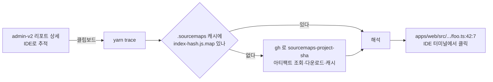

# 리포트 스택 추적하기 (`yarn trace`)

> 상태: Live · 최종 갱신: 2026-08-11 · 설계 배경: [libs/web-core/docs/error-reporting.md](../../libs/web-core/docs/error-reporting.md) · 관련 ADR: [ADR-0029](../adr/0029-error-report-categorization-and-enrichment.md) · [ADR-0047](../adr/0047-unified-logging-core-and-report-traceability.md)

admin-v2에 쌓인 에러 리포트의 스택은 전 프레임이 `index-dJJnUF5m.js:2:845134` 꼴이다. 저장된 건 텍스트뿐이라 devtools가 없고, 소스맵은 보안상 배포에 실리지 않는다. 이 문서는 그 스택을 **내 IDE에서 원본 파일·줄로 여는 방법**을 다룬다.

## 30초 요약

1. admin-v2 → **Report Logs** (`/report-logs`) → 리포트 열기 → Stack 섹션의 **`IDE로 추적`** 클릭
2. 리포 루트 터미널에서 `yarn trace`
3. 출력된 `apps/web/src/.../foo.ts:42:7`을 **클릭**하면 그 줄이 열린다



## 사전 준비

| 필요한 것                | 확인                                         |
| ------------------------ | -------------------------------------------- |
| GitHub CLI 로그인        | `gh auth status` — 이 리포에 접근 권한 필요  |
| 리포 루트에서 실행       | 경로가 리포 상대라 다른 디렉터리면 안 열린다 |
| 터미널을 IDE 안에서 열기 | 링크를 잡아주는 건 IDE 터미널이다            |

맵 파일을 직접 들고 있다면 `gh` 없이도 된다 (아래 `--map`).

## 단계별

### 1단계 — admin-v2에서 복사

리포트 상세 드로어의 `Stack` 섹션에 세 가지가 있다.

- 스택이 가리키는 **번들명**(`index-abc.js`) — 어느 빌드인지 눈으로 확인하는 용도
- **`IDE로 추적`** — 스택 + 헤더를 클립보드로
- **`소스맵 선택`** — 브라우저에서 바로 볼 때 (아래 [대안](#대안-admin-화면에서-바로-보기))

`IDE로 추적`이 복사하는 건 이런 모양이다.

```
# chatic-report id=1234 app=mobile webVersion=0.36.0 at=2026-08-11T07:12:33.000Z
getMyProfile@https://dou-dev.chatic.io/assets/index-abc.js:2:845134
...
```

헤더가 CLI에게 두 가지를 알려준다: **어느 CI 프로젝트가 그 번들을 만들었는지**(`app` — 모바일은 web 빌드를 얹은 WebView라 둘 다 `web`), **에러가 언제 났는지**(`at` — 그 이후 배포된 아티팩트는 후보에서 뺀다).

### 2단계 — `yarn trace`

```bash
yarn trace
```

처음 실행하면 아티팩트를 받느라 몇 초 걸린다. 같은 빌드의 다음 리포트부터는 캐시라 즉시 끝난다.

```
  sourcemaps-web-a1b2c3d 확인 중...
맵: index-abc.js → sourcemaps-web-a1b2c3d

getMyProfile (apps/web/src/app/hooks/useMyProfile.ts:42:7)
onSuccess (apps/web/src/app/features/chat/ChatRoom.tsx:118:22)
Promise@[native code]
```

### 3단계 — IDE에서 열기

`apps/web/src/app/hooks/useMyProfile.ts:42:7`을 클릭한다. VS Code·JetBrains 터미널 모두 리포 상대 경로를 링크로 잡는다. 클릭이 안 되면 리포 루트가 아닌 곳에서 실행했을 가능성이 높다.

## 출력 읽는 법

| 줄                                              | 뜻                                                         |
| ----------------------------------------------- | ---------------------------------------------------------- |
| `맵: index-abc.js → sourcemaps-web-…`           | 그 번들을 어느 아티팩트의 맵으로 풀었다                    |
| `맵: index-abc.js → 캐시`                       | `.sourcemaps/`에 이미 있던 맵을 썼다 (다운로드 없음)       |
| `index-abc.js: 맵을 찾지 못해 원문 그대로 둔다` | 그 번들 프레임은 minified 상태로 남는다                    |
| `체크아웃에 없는 파일 N건 …`                    | 해석은 맞지만 로컬 커밋이 달라 줄 번호가 어긋난다          |
| `어떤 프레임도 풀리지 않았다 …`                 | 맵은 읽었는데 좌표가 하나도 안 맞았다 — 다른 빌드의 맵이다 |

**풀리지 않은 프레임은 원문 그대로 남는다.** 일부만 풀려도 나머지를 잃지 않는다. 하나도 못 풀면 종료 코드가 `1`이다.

## 다른 사용법

```bash
# 맵을 이미 갖고 있을 때 (아티팩트 조회 건너뜀)
yarn trace --map ~/Downloads/index-abc.js.map

# app→project 추정을 덮어쓸 때 (기본은 web)
yarn trace --project admin-v2

# 클립보드 대신 파이프로
pbpaste | yarn trace
cat stack.txt | yarn trace

# 해석 결과만 파일로 (진행 메시지는 stderr 로 나간다)
yarn trace > resolved.txt
```

## 문제 해결

| 증상                                            | 원인                                                               | 조치                                                             |
| ----------------------------------------------- | ------------------------------------------------------------------ | ---------------------------------------------------------------- |
| `sourcemaps-<project>-* 아티팩트가 없다`        | 그 프로젝트가 맵을 안 만들거나, 30일 보관 기간이 지났다            | 릴리스 시점 확인. `desktop-web`은 PROD에서 맵을 만들지 않는다    |
| `index-abc.js: 맵을 찾지 못해 원문 그대로 둔다` | 최근 5개 아티팩트 안에 그 해시가 없다                              | `--project`를 바로잡거나, 아티팩트를 직접 받아 `--map`으로 지정  |
| `체크아웃에 없는 파일 …`                        | 리포트가 나온 빌드와 로컬 커밋이 다르다                            | 그 릴리스 커밋으로 체크아웃한 뒤 다시 실행                       |
| `어떤 프레임도 풀리지 않았다`                   | `--map`으로 다른 빌드의 맵을 줬다                                  | 번들 해시가 같은 맵인지 확인                                     |
| `번들 프레임이 없는 스택이다`                   | opaque `script-error` — 스택 자체가 없다                           | 상세의 `Location`(filename/lineno/colno)과 breadcrumb으로 좁힌다 |
| `gh 실행 실패: …`                               | 로그인 안 됐거나 리포 접근 권한이 없다                             | `gh auth status`                                                 |
| `클립보드를 읽을 수 없는 환경이다`              | macOS가 아니다 (`pbpaste` 없음)                                    | 스택을 stdin으로 넘긴다                                          |
| `주의: 스택이 번들 N개를 걸치는데 맵은 하나다`  | `--map` 파일명이 스택의 어느 번들과도 안 맞아 전 프레임에 적용된다 | 파일명을 `<bundle>.js.map` 그대로 두면 자기 번들에만 적용된다    |

## 대안: admin 화면에서 바로 보기

브라우저를 떠나기 싫을 때는 `소스맵 선택`으로 `.map` 파일을 직접 고른다. 파일은 브라우저에서만 읽히고 어디로도 업로드되지 않는다. 맵은 아티팩트에서 받아온다.

```bash
gh run download <run-id> -n sourcemaps-web-<sha>
```

이름이 스택의 번들과 다르면 경고가 뜨고, 한 프레임도 안 풀리면 그것도 알려준다. 스택이 번들 여러 개를 걸치면 **고른 맵의 번들 프레임만** 바뀐다.

## 왜 이렇게 되어 있나

- **맵은 배포에 실리지 않는다.** 공개 경로에 올리면 `sourcesContent`로 소스 전체가 노출된다. 배포 스크립트가 `*.map`을 S3 sync에서 제외하고, 대신 CI가 `sourcemaps-<project>-<sha>` 아티팩트로 30일 보관한다(`deploy-dev.yml` / `deploy-prod.yml`).
- **PROD도 맵을 만든다.** `sourcemap: 'hidden'`이라 번들에 `sourceMappingURL` 주석이 남지 않는다 — 서비스되지 않는 파일을 devtools가 404로 찾아가는 일이 없다.
- **검증은 번들 해시 일치다.** 다른 빌드의 맵은 실패하지 않고 **그럴듯하지만 틀린 줄**로 풀린다. 그래서 캐시 키가 콘텐츠 해시가 박힌 번들명이고, 이름이 안 맞으면 경고한다.

자세한 배경은 [error-reporting.md의 "minified 스택 읽기"](../../libs/web-core/docs/error-reporting.md#minified-스택-읽기).

## GitHub 없이 배포한 경우 (수동 배포)

`deploy-web.sh` 등 배포 스크립트를 CI가 아니라 **누군가 직접 로컬에서** 돌린 경우(또는 `force-deploy.yml`의 수동 실행), 그 빌드의 맵은 배포 스크립트 안의 `archive_source_maps` 스텝이 S3 sync 직전에 자동으로 `.sourcemaps/`에 복사해 둔다. 이 스텝은 CI·로컬 어느 쪽에서 실행되든 항상 동작하므로:

- **배포한 그 기기에서는** 아무것도 안 해도 그 빌드분 맵이 이미 `.sourcemaps/`에 있다 — `yarn trace`가 바로 캐시로 잡는다.
- **다른 기기에서 그 리포트를 봐야 한다면** `force-deploy.yml`도 이제 `sourcemaps-<project>-<sha>` 아티팩트를 남기므로(CI 실행인 이상) `yarn trace`의 자동 조회로 여전히 잡힌다.
- 정말로 CI를 전혀 거치지 않고 로컬에서 `./scripts/deploy-web.sh dev`를 직접 실행한 경우엔, **그 기기의 `.sourcemaps/`가 유일한 사본**이다 — 다른 사람이 봐야 하면 그 폴더에서 해당 `.map` 파일을 직접 전달받아야 한다.

> 왜 로컬에서 다시 빌드해서 맞추면 안 되나: [apps/web/vite.config.mts](../../apps/web/vite.config.mts)의 `I18N_VERSION` define이 빌드 시각(`Date.now()`)을 번들에 굽기 때문에, **같은 커밋·같은 환경변수로 다시 빌드해도 번들 해시가 매번 달라진다.** 그 순간 만들어진 딱 그 산출물만 그 리포트를 풀 수 있다.

## 주의: `.sourcemaps/`는 공유하지 않는다

받아온 맵은 `sourcesContent`로 **소스 전체**를 담고 있다. `.gitignore`에 있으니 커밋될 일은 없지만, 디렉터리째 다른 곳에 복사하거나 첨부하지 않는다. 필요 없어지면 지우면 된다 — 다음 실행에서 다시 받는다.

```bash
rm -rf .sourcemaps
```

## 관련 파일

- [`scripts/trace-report.js`](../../scripts/trace-report.js) — `yarn trace` 본체 (아티팩트 조회·캐시·출력)
- [`scripts/resolve-stack.js`](../../scripts/resolve-stack.js) — base64-VLQ 디코더. 맵을 이미 갖고 있을 때 쓰는 저수준 CLI
- [`apps/admin-v2/.../resolveStack.ts`](../../apps/admin-v2/src/app/features/report-logs/lib/resolveStack.ts) — 같은 디코더의 브라우저 포팅
- [`apps/admin-v2/.../traceBlob.ts`](../../apps/admin-v2/src/app/features/report-logs/lib/traceBlob.ts) — `IDE로 추적`이 복사하는 헤더 포맷
