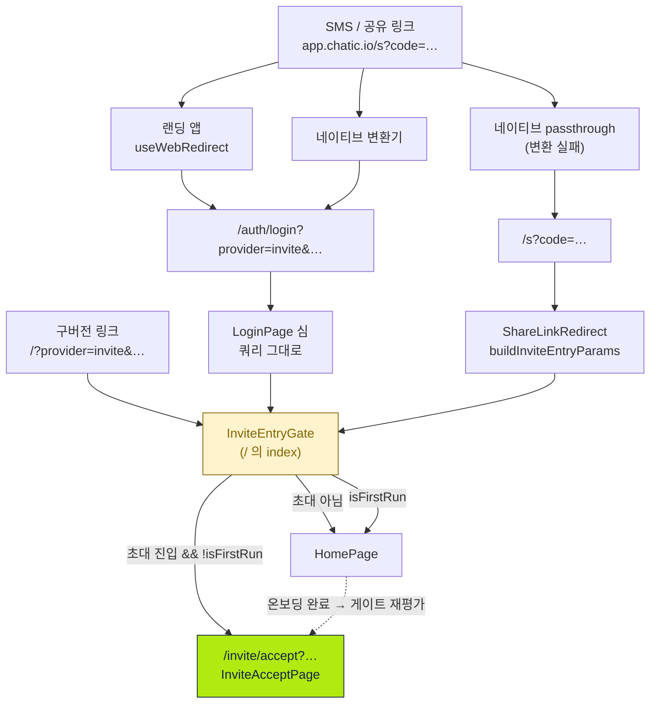
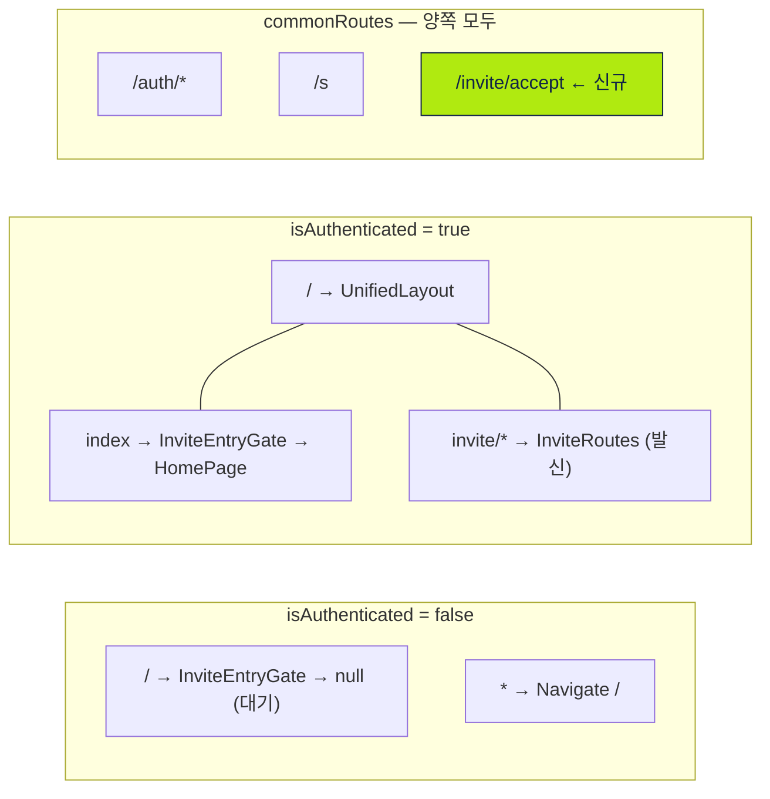
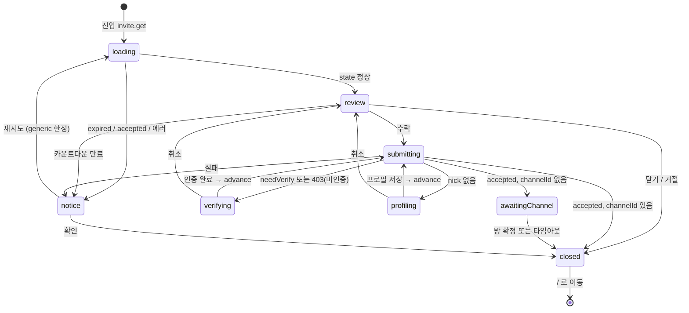

# 초대 수락 진입 (Invite Accept Entry)

> 상태: Live · 최종 갱신: 2026-07-31 · 관련 ADR: [ADR-0016](adr/0016-invite-accept-popup-web-ui-kit.md) · [ADR-0033](adr/0033-relay-dm-invite-and-auth-parallel-tracks.md) · [ADR-0035](adr/0035-relay-invite-accepted-channel-resolution.md) · [ADR-0037](adr/0037-invite-accept-popup-group-and-dm-variants.md)
>
> "팝업 → 페이지" 전환 결정 자체는 아직 ADR이 없다. `dev-1_interview`로 ADR-0038을 남기고 이 헤더를 갱신할 것.

## 목적

초대 링크로 앱에 도착한 사람에게 **수락 화면을 첫 화면으로** 보여주고, 수락 결과를 대화방까지 연결한다.

초대 딥링크는 **콜드 부트와 경합하는 유일한 진입로**다(`useRelayInviteFlow.ts:80`). 그래서 수락 화면은 홈 위에 뜨는 팝업이 아니라 자기 라우트 `/invite/accept`를 가진다 — 초대장 하나를 그리려고 플레이스 목록·채널 목록·언리드 집계·멤버십 조회·보낸 초대 목록까지 마운트되던 구조를 끊기 위해서다.

## 설계 원칙

1. **진입 판단은 한 곳에만 둔다.** 링크 → 내부 파라미터 변환은 `buildInviteEntryParams`, 내부 파라미터 → 목적지 결정은 `InviteEntryGate`. 진입 경로가 셋이어도 판단은 하나다. 포워더가 수락 페이지로 질러가면 온보딩 우선순위가 조용히 사라진다 — 실제로 구현 중에 한 번 그렇게 깨뜨렸다가 브라우저 검증에서 잡았다.
2. **구버전을 절대 깨지 않는다.** 이미 설치된 네이티브 앱과 이미 발송된 SMS는 고칠 수 없다. 새 목적지를 만들되 **기존 목적지는 리다이렉트 계층으로 남긴다.**
3. **초대 화면은 어떤 셸에도 의존하지 않는다.** 홈에도, `UnifiedLayout`에도 얹지 않는다. 인증 전에도 렌더링되어야 하므로 자기가 필요한 것만 마운트한다 — 네이티브 백 핸들러 포함.
4. **초대 코드는 자격증명이다.** 패킷 바디에만 싣고 로그에 남기지 않는다(`RelayInviteAccept.tsx:15`). 링크 자체가 URL로 오는 것은 기존 사양이며 이 구조가 늘리지도 줄이지도 않는다.
5. **의사결정은 훅, 렌더링은 컴포넌트.** `useRelayInviteFlow`가 상태 기계를 전부 소유하고 뷰는 `phase` switch만 한다.

## 범위

**포함** — `/invite/accept` 라우트와 그 페이지, 세 진입 경로를 여기로 모으는 리다이렉트 계층, 수신(수락) 코드 전체(`features/invite/accept/`), 인증 전 로딩 화면.

**제외**

- **랜딩 앱(`apps/landing`)과 네이티브 변환기.** 둘 다 `/auth/login?…`을 만들고, 그건 심(shim)이 받는다. 심은 구버전 네이티브 때문에 영구히 필요하므로 랜딩을 고쳐도 코드가 줄지 않는다.
- **수락 후 방 진입 경로.** 여전히 `usePendingInviteChannel`로 홈을 경유한다 — 클라우드 초대는 cloud→site 전환이 홈에서 안정화되어야 한다(`useEnterInvitedChannel.ts:10`).
- `_version` vs `version` 파라미터 철자 불일치(`accept/types.ts`의 `parseInviteDeeplink` ↔ `buildInviteEntryParams`). 아무도 게이팅에 쓰지 않는 잠복 문제이고 이 구조와 독립적이다.
- 디버그 도구 `buildInviteRedirectUrl`의 출력(`/?…` 유지). `/`를 겨냥해야 리다이렉트 계층까지 함께 검증된다.

## 시나리오

### S1. 릴레이 1:1 초대 — 앱을 처음 쓰는 사람 (가장 흔함)

1. SMS의 `https://app.chatic.io/s?code=invt:…`를 누른다.
2. 랜딩 또는 네이티브 변환기가 `https://dou.chatic.io/auth/login?code=…&provider=invite&version=2&relay=1`로 보낸다.
3. `LoginPage` 심이 쿼리를 그대로 달고 `/`로 포워드한다.
4. **첫 실행이므로 온보딩이 먼저다.** `InviteEntryGate`가 리다이렉트를 보류하고 홈이 온보딩 모달을 띄운다. 홈은 쿼리를 벗기지 않으므로 링크는 살아 있다.
5. 온보딩을 마치거나 SKIP하면 `isFirstRun`이 뒤집히고, 게이트가 다시 평가되어 `/invite/accept?…`로 넘어간다.
6. 아직 게스트 로그인 전이면 페이지가 **초대 로딩 화면**을 띄운 채 기다린다. 로그인이 끝나 `isAuthenticated`가 뒤집히면 라우터가 재생성되고 같은 경로가 다시 매칭된다.
7. 릴레이 소켓 핸드셰이크를 기다린 뒤 `invite.get`. 결과가 올 때까지도 로딩 화면이다.
8. 수락 화면. "수락" → 전화 인증 → 플레이스 프로필 → `invite.accept` 순으로 한 단계씩 전진하며, 매 단계 앞에서 `invite.get`을 다시 쏴 만료·선점을 재확인한다.
9. 수락 성공 → 방 id를 `usePendingInviteChannel`에 넣고 `/`로 이동 → 홈이 그 id를 소비해 대화방으로 replace 이동한다(`HomePage.tsx:188`).

### S2. 클라우드(그룹) 초대 — 이미 쓰던 사람

1~3은 S1과 같되 `relay=1` 대신 `_backend=…`가 실린다.

4. 온보딩을 이미 마쳤으므로 게이트가 곧장 `/invite/accept`로 보낸다.
5. `useInviteInfo(code, backend)`로 초대장 메타(초대자·플레이스·만료)를 읽어 수락 화면을 채운다.
6. 수락 → `login-invite` → 클라우드 캐시 기록 → cloud → site → channel 파이프라인.
7. 파이프라인이 홈으로 착지시키고, 채널이 있으면 홈이 방으로 이동시킨다.

### S3. 네이티브 passthrough

네이티브가 인식하지 못한 링크는 변환 없이 WebView로 넘어와 `/s?code=…`에 도착한다. `ShareLinkRedirect`가 `buildInviteEntryParams`로 변환한 뒤 **`/`로** 보내고, 거기서 게이트가 이어받는다. 수락 페이지로 질러가지 않는 이유는 설계 원칙 1과 같다.

### S4. 구버전 링크 — 이미 발송된 `/?provider=invite&…`

게이트가 쿼리를 보고 초대 진입이면 `/invite/accept`로 replace 리다이렉트한다. 홈은 렌더링되지 않는다. 이 게이트가 있는 한 구버전 네이티브 앱이 영원히 `/?…`를 만들어도 무해하다.

### S5. 초대가 아닌 진입 / 깨진 링크

- `/`에 초대가 아닌 쿼리 → 게이트가 통과시키고 홈이 평소대로 렌더링된다.
- `/invite/accept`에 초대로 인정되지 않는 쿼리(`code` 없음, `provider` 마커 없음, `_backend`·`relay` 둘 다 없음) → `/`로 replace. 보여줄 게 없다.
- 만료/선점/잘못된 번호 → 빨간 제목의 `AlertDialog` 후 홈으로. 분류 불가능한 `generic`만 재시도 버튼을 준다.

### S6. 닫기 / 뒤로가기

- X 또는 거절 → `/`로 replace 이동. 진입이 전부 `replace`라 히스토리가 쌓이지 않는다.
- 수락 진행 중(`submitting` / `awaitingChannel`)에는 X가 막힌다. 중간에 화면이 사라지면 실패 다이얼로그를 삼킨다.
- 네이티브 하드웨어 백 → 페이지가 `useBackHandler`를 직접 마운트한다(`UnifiedLayout` 밖이므로). 알림 다이얼로그가 떠 있으면 그것만 닫히고, 없으면 히스토리를 되짚는다.
- **알려진 차이:** 팝업 시절에는 백/ESC가 Radix `onOpenChange`를 거쳐 `flow.close()`의 진행 중 가드에 걸렸다. 페이지에는 그 경유지가 없으므로 수락 진행 중 하드웨어 백은 막히지 않는다. `awaitingChannel`에서는 수락이 이미 서버에 반영된 뒤라 무해하고(방은 다음 동기화에 나타난다), `submitting`에서 나가면 실패 사유를 못 보게 된다. 별도 가드가 필요하면 `useBackHandler`에 진행 중 신호를 넘기는 방식이 되겠지만, 지금은 넣지 않았다.

## 다이어그램

### 진입 경로 — 세 갈래가 한 게이트로



포워더 둘은 목적지를 스스로 정하지 않는다. 수락 페이지로 질러가면 온보딩 판단을 건너뛰기 때문이다 — 그리고 `/auth/login`이 랜딩·네이티브가 실제로 쓰는 주 경로라, 질러가는 순간 거의 모든 초대가 온보딩을 우회한다.

### 라우트 배치 — 왜 `commonRoutes`인가



`privateRoutes`에만 두면 인증 전 도착 시 `*` 폴백이 **쿼리스트링을 통째로 버린다** — `PublicRoutes.tsx:15`가 `/`에서 버티는 이유가 정확히 그것이다. `commonRoutes`에 두면 인증 상태와 무관하게 같은 경로가 매칭되고, `UnifiedLayout` 밖이라 홈 데이터 훅도 붙지 않는다.

`/invite/accept`(common)와 `/invite/*`(private)는 동시에 존재하지만 충돌하지 않는다. react-router 6.11의 `computeScore`는 정적 세그먼트에 10점, splat에 −2점을 주므로 `/invite/accept`(22점)가 `/invite/*`(10점)를 이긴다. **배열 순서가 아니라 점수로 이기는 것이라 조용히 뒤집힐 수 있고, 뒤집히면 발신 라우트가 수락 화면을 가로채 초대가 통째로 사라진다** — `inviteAcceptRoute.test.ts`가 이걸 못박는다.

### 릴레이 수락 상태 기계

`useRelayInviteFlow.ts:24`가 "the state diagram in the feature doc"이라 가리키는 그 다이어그램이다.



`loading`은 로딩 화면, `notice`는 `AlertDialog`, `profiling`은 프로필 다이얼로그, `verifying`은 `PhoneVerifyScreen`(자체 Dialog를 가진다), 나머지는 수락 화면이 페이지를 차지한다.

모든 전이가 `advance`를 거치고, `advance`의 첫 동작은 또 한 번의 `invite.get`이다. 전화 인증에 몇 분이 걸리는 동안 초대가 만료되거나 선점될 수 있기 때문이다.

## 상세 구현

### 라우팅 계층

| 파일                                | 역할                                                                                                 |
| ----------------------------------- | ---------------------------------------------------------------------------------------------------- |
| `routes/paths.ts:55`                | `ROUTES.invite.accept = '/invite/accept'`                                                            |
| `routes/CommonRoutes.tsx:17`        | 라우트 등록. lazy가 아니다 — 초대받은 사람에게 첫 화면이라 크리티컬 패스에 청크 페치를 끼우지 않는다 |
| `routes/InviteEntryGate.tsx`        | 유일한 판단 지점. `/`의 양쪽 라우트 셋에 모두 붙는다                                                 |
| `routes/PublicRoutes.tsx`           | 루트 엔트리가 `<InviteEntryGate />`(children 없음 = 기존 `null` 대기)                                |
| `routes/PrivateRoutes.tsx`          | `{ index: true }`가 `<InviteEntryGate><HomeRoutes /></InviteEntryGate>`                              |
| `routes/ShareLinkRedirect.tsx`      | `/s` 변환 후 `/`로. 게이트가 이어받는다                                                              |
| `features/auth/pages/LoginPage.tsx` | 쿼리 그대로 `/`로 포워드하는 심                                                                      |

**`resolveInviteAcceptRedirect(search)`** — `features/invite/accept/lib/inviteEntryRedirect.ts`

쿼리를 해석해서 다시 조립하지 않고 **그대로 옮긴다.** 소비하지 않은 파라미터(`utm_*` 등)가 살아남고, 판정 로직은 `isInviteEntry` 하나로 유지된다.

**`InviteEntryGate`** — 초대면 리다이렉트, 아니면 children. 단 `isFirstRun`이면 보류한다:

```tsx
const target = isFirstRun ? null : resolveInviteAcceptRedirect(search);
if (target) return <Navigate to={target} replace />;
return <>{children}</>;
```

보류하는 쪽이 **리다이렉트**지 화면이 아니라는 게 핵심이다. 홈은 쿼리를 벗기지 않으므로, 온보딩이 끝나 `isFirstRun`이 뒤집히면 이 컴포넌트가 다시 렌더되며 그때 초대가 이어진다. `isFirstRun`은 localStorage에서 동기적으로 읽히고 세션과 무관하므로 인증 전에도 정확하다.

### 페이지

`features/invite/accept/InviteAcceptPage.tsx`

- 초대가 아니면 `<Navigate to="/" replace />`
- `useBackHandler()`를 직접 마운트 (셸 밖이므로). 훅 배럴이 아니라 파일에서 직접 import — 인증 전 진입이 나머지를 끌고 오지 않게
- `isAuthenticated`가 false면 `<InviteAcceptLoading />`만 렌더링하고 **어떤 데이터 훅도 호출하지 않는다**
- `isRelayInvite` → `<RelayInviteAccept />`, 아니면 `<CloudInviteAccept />`

전체화면 셸은 `<div className="flex h-dvh w-full flex-col items-center bg-background">` 한 줄이다. `Dialog`가 주던 높이를 페이지가 대신 준다.

### 파일 배치

```
features/invite/
├─ index.tsx                    발신 라우트 (/invite/contact, /invite/:id/waiting)
├─ flags.ts                     ADR-0033 인터페이스 선반영 플래그 (발신 3개 + 수신 거절 1개)
├─ hooks/useInviteCountdown.ts  발신·수신 공용
└─ accept/
   ├─ InviteAcceptPage.tsx
   ├─ types.ts                  InviteParams / InviteInfo / parseInviteDeeplink / isInviteEntry
   ├─ lib/                      inviteEntryRedirect · relayInviteDecline
   ├─ hooks/                    useRelayInviteFlow · useInviteAccept · useResolveInviteChannel
   │                            · useEnterInvited{Cloud,Site,Channel}
   └─ components/
      ├─ InviteGlassSurface     브랜드 표면 (수락 화면 + 로딩 화면 공용)
      ├─ InviteAcceptScreen     프레젠테이션 전용 — 데이터 조회도 라우팅도 없다
      ├─ InviteAcceptLoading
      ├─ InviteCard / InvitePlaceCard / InviteTargetCard / InviteExpiryCard
      ├─ CloudInviteAccept      ADR-0016 REST 수락 파이프라인
      ├─ RelayInviteAccept      ADR-0033 릴레이 상태 기계의 뷰
      └─ RelayInviteProfileDialog
```

수신 흐름은 팝업이 홈에 마운트돼 있었다는 이유만으로 `features/home/`에 살았다. 외부 소비자는 발신측 대기 화면이 쓰는 카운트다운 하나뿐이었고, 그건 `features/invite/hooks/`로 올렸다.

### 홈에 남은 것

`HomePage.tsx:188`의 `usePendingInviteChannel` 소비 이펙트. 수락 이후의 방 진입은 여전히 홈을 경유한다. 오히려 이전보다 정직해졌다 — 예전엔 "홈 위 팝업에서 홈으로 navigate"라는 자기 참조였고, 이제는 페이지 → 홈 → 방이라는 실제 이동이다.

## 검증 방법

**테스트** (jest 코로케이션)

```bash
npx nx test web
```

| 파일                                                     | 검증 대상                                                                                                   |
| -------------------------------------------------------- | ----------------------------------------------------------------------------------------------------------- |
| `features/invite/accept/lib/inviteEntryRedirect.test.ts` | 릴레이/클라우드/비초대/반쪽 링크, 미소비 파라미터 보존                                                      |
| `routes/InviteEntryGate.test.tsx`                        | 초대→리다이렉트 / 비초대→children / `isFirstRun`→보류(쿼리 보존) / 온보딩 완료 후 리다이렉트                |
| `features/invite/accept/InviteAcceptPage.test.tsx`       | 릴레이·클라우드·bare relay 분기, 비초대 시 `/` replace, 미인증 시 로딩 + 데이터 훅 미호출, 백 핸들러 마운트 |
| `routes/inviteAcceptRoute.test.ts`                       | `/invite/accept`가 `/invite/*` splat을 이기는지 (점수 기반이라 회귀 위험)                                   |
| `routes/ShareLinkRedirect.test.tsx`                      | `/s` 변환 결과와 목적지가 `/`인지                                                                           |
| `features/auth/pages/LoginPage.test.tsx`                 | 초대든 아니든 쿼리를 달고 `/`로                                                                             |
| `routes/PublicRoutes.test.tsx`                           | 비로그인 `/` 대기와 쿼리 보존                                                                               |

**수동 확인** — 각 진입 경로를 실제로 밟는다. 웹은 nx serve 타깃이 없고 vite를 직접 띄운다:

```bash
cd apps/web && npx vite --port 4200
```

1. `/?provider=invite&code=…&relay=1` → 홈이 깜빡이지도 않고 수락 화면 (S4)
2. `/s?code=…` → `/?…&provider=invite&relay=1` → 수락 화면 (S3)
3. `/auth/login?code=…&provider=invite&version=2&relay=1` → 같은 결과 (S1)
4. localStorage의 `chatic-onboarding-completed`를 지우고 3번 반복 → 온보딩 먼저, SKIP 직후 수락 화면 (S1-4·5)
5. localStorage 전체를 지우고 1번 → 흰 화면이 아니라 초대 로딩 화면 (S1-6)
6. `/invite/accept?foo=bar` → `/` (S5)
7. 수락 완료 → 대화방 진입, 뒤로가기가 수락 화면으로 돌아오지 않을 것
8. 네이티브 하드웨어 백 → 알림 다이얼로그가 떠 있으면 그것만 닫힘. S6의 "알려진 차이"도 함께 확인

**클라우드(그룹) 초대**는 릴레이보다 검증이 어렵다(실제 백엔드 주소 필요). 디버그 오버레이의 `InviteRedirectScreen`으로 링크를 만들어 확인한다 — 이 도구는 `/`를 겨냥한 채로 두므로 리다이렉트 계층까지 함께 밟힌다.
