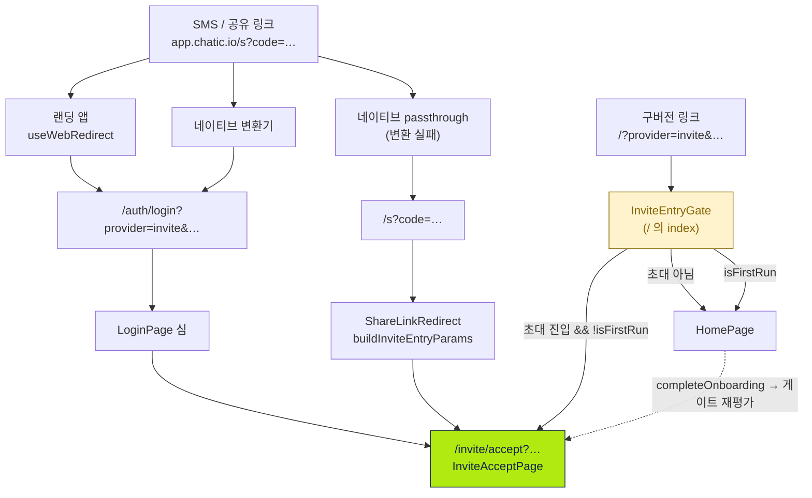
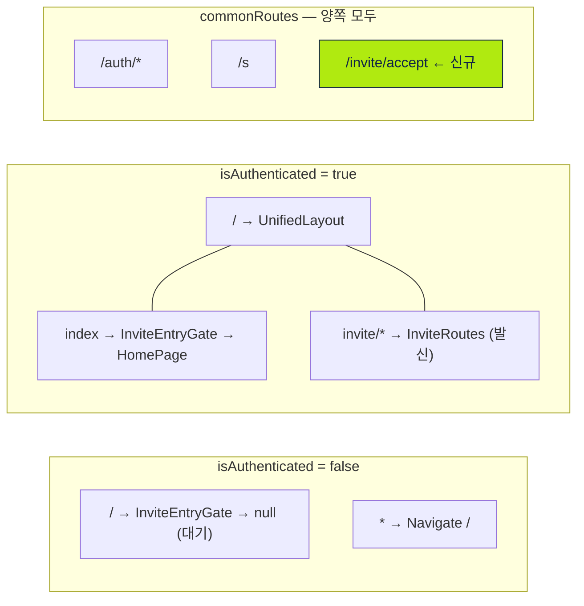
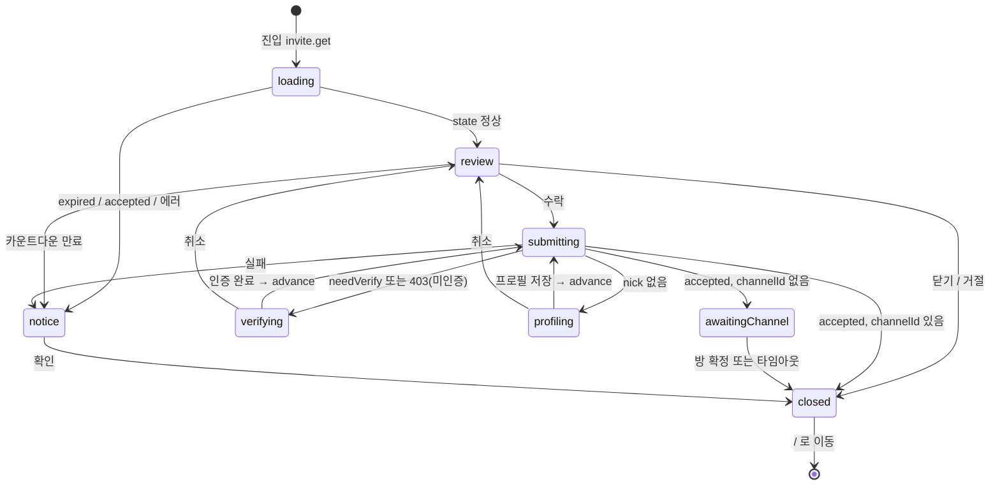

# 초대 수락 진입 (Invite Accept Entry)

> 상태: Approved · 최종 갱신: 2026-07-31 · 관련 ADR: [ADR-0016](adr/0016-invite-accept-popup-web-ui-kit.md) · [ADR-0033](adr/0033-relay-dm-invite-and-auth-parallel-tracks.md) · [ADR-0035](adr/0035-relay-invite-accepted-channel-resolution.md) · [ADR-0037](adr/0037-invite-accept-popup-group-and-dm-variants.md)
>
> 이 문서가 기록하는 "팝업 → 페이지" 전환 결정은 아직 ADR이 없다. 승인 후 `dev-1_interview`로 ADR-0038을 남기고 이 헤더를 갱신한다.

## 목적

초대 링크로 앱에 도착한 사람에게 **수락 화면을 첫 화면으로** 보여주고, 수락 결과를 대화방까지 연결한다.

지금은 이 화면이 홈 화면 위에 뜨는 팝업이다(`HomePage.tsx:347`의 `<InviteDialog />`). 그래서 초대장 하나를 렌더링하려고 홈의 데이터 훅 전체 — 플레이스 목록, 채널 목록, 언리드 집계, 멤버십 조회, 보낸 초대 목록 — 가 함께 마운트된다. 초대 딥링크는 **콜드 부트와 경합하는 유일한 진입로**인데(`useRelayInviteFlow.ts:65-79`), 하필 가장 무거운 화면을 통과해야 한다.

이 문서는 그 결합을 끊고 초대 수락을 독립 라우트 `/invite/accept`로 승격시키는 구조를 정의한다.

## 설계 원칙

1. **진입 URL 변환 규칙은 한 곳에만 둔다.** 링크 → 내부 파라미터 변환은 `buildInviteEntryParams`, 내부 파라미터 → 목적지 결정은 `resolveInviteAcceptRedirect`. 변환기가 세 개(랜딩·네이티브·웹 디버그)라도 규칙은 하나다.
2. **구버전을 절대 깨지 않는다.** 이미 설치된 네이티브 앱과 이미 발송된 SMS는 고칠 수 없다. 새 목적지를 만들되 **기존 목적지는 리다이렉트 계층으로 남긴다.**
3. **초대 화면은 어떤 셸에도 의존하지 않는다.** 홈에도, `UnifiedLayout`에도 얹지 않는다. 인증 전에도 렌더링되어야 하므로 자기 자신이 필요한 것만 마운트한다.
4. **초대 코드는 자격증명이다.** 패킷 바디에만 싣고 로그에 남기지 않는다(`RelayInviteDialog.tsx:18`). 단, 링크 자체가 URL로 오므로 **URL에 있는 것 자체는 기존 사양**이며 이번 변경이 늘리지도 줄이지도 않는다.
5. **의사결정은 훅, 렌더링은 컴포넌트.** `useRelayInviteFlow`가 상태 기계를 전부 소유하고 뷰는 `phase` switch만 한다. 이 분리는 그대로 유지한다.

## 범위

**포함**

- 새 라우트 `/invite/accept`와 그 페이지 `InviteAcceptPage`
- 세 진입 경로(`/auth/login?…`, `/s?…`, `/?…`)를 새 라우트로 보내는 리다이렉트 계층
- 초대 **수신(수락)** 코드 전체를 `features/home/` → `features/invite/accept/`로 이동
- 수락 화면을 Radix `Dialog` 래퍼에서 해방(전체화면 `Dialog` 흉내를 위한 `style={{ padding: 0 }}` 해킹 제거)
- 인증 전 도착 시의 로딩 화면(현재는 빈 화면)

**제외**

- **랜딩 앱(`apps/landing`)과 네이티브 변환기는 건드리지 않는다.** 둘 다 `/auth/login?…`을 만들고, 그건 이미 심(shim)이 처리한다. 배포 주기가 다른 곳을 바꾸는 것보다 웹이 호환 계층을 갖는 편이 안전하다 — `ShareLinkRedirect.tsx:15-16`이 세운 원칙 그대로다.
- **수락 후 방 진입 경로(`usePendingInviteChannel` 경유)는 그대로 둔다.** 클라우드 초대는 cloud→site 전환이 홈에서 안정화되어야 하므로(`useEnterInvitedChannel.ts:11`) 홈 경유가 의도된 설계다. 릴레이만 직행시키면 두 흐름이 갈라진다.
- `_version` vs `version` 파라미터 철자 불일치(`types/invite.ts:58` ↔ `buildInviteEntryParams.ts:45`). 현재 아무도 게이팅에 쓰지 않는 잠복 버그이고 이번 변경과 독립적이다.
- 디버그 도구 `buildInviteRedirectUrl`의 출력(`/?…` 유지). `/`를 겨냥해야 리다이렉트 계층까지 함께 검증된다.

## 시나리오

### S1. 릴레이 1:1 초대 — 앱을 처음 쓰는 사람 (가장 흔함)

1. SMS의 `https://app.chatic.io/s?code=invt:…`를 누른다.
2. 랜딩 또는 네이티브 변환기가 `https://dou.chatic.io/auth/login?code=…&provider=invite&version=2&relay=1`로 보낸다.
3. `LoginPage` 심이 초대 진입임을 알아보고 `/invite/accept?code=…&provider=invite&version=2&relay=1`로 포워드한다.
4. 아직 게스트 로그인 전이다. `/invite/accept`는 공용 라우트라서 매칭되고, 페이지는 **초대 로딩 화면**을 띄운 채 기다린다. (지금은 흰 화면이다.)
5. 게스트 로그인이 끝나 `isAuthenticated`가 뒤집히면 라우터가 재생성되고 같은 경로가 다시 매칭된다. 페이지가 릴레이 소켓 핸드셰이크를 기다린 뒤 `invite.get`을 쏜다.
6. **첫 실행이면** — 온보딩이 우선이다. 게이트가 리다이렉트를 보류하고 홈이 온보딩 모달을 띄운다. 온보딩을 마치는 순간 게이트가 다시 평가되어 `/invite/accept`로 넘어간다. (5·6의 순서는 아래 다이어그램 참고.)
7. 수락 화면. "수락"을 누르면 전화 인증 → 플레이스 프로필 → `invite.accept` 순으로 한 단계씩 전진하며, 매 단계 앞에서 `invite.get`을 다시 쏴 만료·선점을 재확인한다.
8. 수락 성공 → 방 id를 `usePendingInviteChannel`에 넣고 `/`로 이동 → 홈이 그 id를 소비해 대화방으로 replace 이동한다.

### S2. 클라우드(그룹) 초대 — 이미 쓰던 사람

1~3은 S1과 같되 `relay=1` 대신 `_backend=…`가 실린다. 4. 이미 인증되어 있으므로 `/invite/accept`가 바로 열리고 `useInviteInfo(code, backend)`로 초대장 메타(초대자·플레이스·만료)를 읽는다. 5. 수락 → `login-invite` → 클라우드 캐시 기록 → cloud → site → channel 파이프라인. 6. 파이프라인이 홈으로 착지시키고, 채널이 있으면 홈이 방으로 이동시킨다.

### S3. 네이티브 passthrough

네이티브가 인식하지 못한 링크는 변환 없이 WebView로 넘어와 `/s?code=…`에 도착한다. `ShareLinkRedirect`가 `buildInviteEntryParams`로 변환한 뒤 **`/invite/accept?…`**로 보낸다. (지금은 `/`로 보낸다.)

### S4. 구버전 링크 — 이미 발송된 `/?provider=invite&…`

`/` 진입 시 `InviteEntryGate`가 쿼리를 보고 초대 진입이면 `/invite/accept`로 replace 리다이렉트한다. 홈은 마운트되지 않는다. 이 게이트가 있는 한 구버전 네이티브 앱이 영원히 `/?…`를 만들어도 무해하다.

### S5. 초대가 아닌 진입 / 깨진 링크

- `/`에 초대가 아닌 쿼리 → 게이트가 통과시키고 홈이 평소대로 렌더링된다.
- `/invite/accept`에 초대로 인정되지 않는 쿼리(`code` 없음, `_backend`·`relay` 둘 다 없음) → `/`로 replace. 보여줄 게 없다.
- 만료/선점/잘못된 번호 → 빨간 제목의 단일 액션 `AlertDialog` 후 홈으로.

### S6. 닫기 / 뒤로가기

- X 또는 거절 → `/`로 replace 이동. 히스토리가 쌓이지 않는다(진입이 전부 `replace`였다).
- 수락 진행 중에는 닫기를 막는다(`phase === 'submitting' | 'awaitingChannel'`). 중간에 URL이 날아가면 실패 다이얼로그를 삼킨다.
- 네이티브 하드웨어 백 → 페이지가 `useBackHandler`를 직접 마운트한다. 이 훅은 원래 `UnifiedLayout`에 있는데(`UnifiedLayout.tsx:27`) 이 페이지는 그 셸 밖이므로 스스로 챙겨야 한다.

## 다이어그램

### 진입 경로 — 세 갈래가 한 라우트로



### 라우트 배치 — 왜 `commonRoutes`인가



`privateRoutes`에만 두면 인증 전 도착 시 `*` 폴백이 **쿼리스트링을 통째로 버린다** — `PublicRoutes.tsx:5-15`가 `/`에서 버티는 이유가 정확히 그것이다. `commonRoutes`에 두면 인증 상태와 무관하게 같은 경로가 매칭된다.

`/invite/accept`(common)와 `/invite/*`(private)는 동시에 존재하지만 충돌하지 않는다. react-router 6.11의 `computeScore`는 정적 세그먼트에 10점, splat에 −2점을 주므로 `/invite/accept`(22점)가 `/invite/*`(10점)를 이긴다. **배열 순서가 아니라 점수로 이기는 것이므로 회귀 테스트로 못박는다.**

### 릴레이 수락 상태 기계

`useRelayInviteFlow.ts:24`가 "the state diagram in the feature doc"이라 가리키던 그 다이어그램이다.



모든 전이가 `advance`를 거치고, `advance`의 첫 동작은 또 한 번의 `invite.get`이다. 전화 인증에 몇 분이 걸리는 동안 초대가 만료되거나 선점될 수 있기 때문이다.

## 상세 구현

### 1. 라우팅 계층

| 파일                                   | 변경                                                                 |
| -------------------------------------- | -------------------------------------------------------------------- |
| `routes/paths.ts:51-54`                | `invite.accept: '/invite/accept'` 추가                               |
| `routes/CommonRoutes.tsx:5`            | `{ path: ROUTES.invite.accept, element: <InviteAcceptPage /> }` 추가 |
| `routes/InviteEntryGate.tsx`           | **신규.** 아래 참조                                                  |
| `routes/PublicRoutes.tsx:19`           | `element: <InviteEntryGate />` (children 없음 = 기존 `null` 대기)    |
| `routes/PrivateRoutes.tsx:62`          | `element: <InviteEntryGate><HomeRoutes /></InviteEntryGate>`         |
| `routes/ShareLinkRedirect.tsx:26`      | 목적지를 `ROUTES.root` → `ROUTES.invite.accept`로                    |
| `features/auth/pages/LoginPage.tsx:14` | 초대 진입이면 `/invite/accept`, 아니면 기존대로 `/`                  |

`InviteAcceptPage`는 **lazy 로딩하지 않는다.** 초대받은 사람에게는 이게 첫 화면이라, 크리티컬 패스에 청크 페치를 끼워 넣을 이유가 없다.

**`resolveInviteAcceptRedirect(search)`** — `features/invite/accept/lib/inviteEntryRedirect.ts` (신규)

```ts
export const resolveInviteAcceptRedirect = (search: string): string | null => {
    const params = parseInviteDeeplink(search);
    if (!isInviteEntry(params)) return null;
    return `${ROUTES.invite.accept}${search.startsWith('?') ? search : `?${search}`}`;
};
```

쿼리를 해석해서 다시 조립하지 않고 **그대로 옮긴다.** 소비하지 않은 파라미터(`utm_*` 등)가 살아남고, 판정 로직은 `isInviteEntry` 하나로 유지된다.

**`InviteEntryGate`** — `routes/InviteEntryGate.tsx` (신규)

```tsx
export const InviteEntryGate = ({ children }: { children?: ReactNode }) => {
    const { search } = useLocation();
    const isFirstRun = usePreferenceStore(s => s.isFirstRun);
    // 첫 실행에는 온보딩이 우선이다. 온보딩이 끝나면 이 컴포넌트가 다시 평가되어
    // 그때 초대로 넘어간다 — 홈은 쿼리를 벗기지 않으므로 링크는 그대로 살아 있다.
    const target = isFirstRun ? null : resolveInviteAcceptRedirect(search);
    if (target) return <Navigate to={target} replace />;
    return <>{children ?? null}</>;
};
```

`isFirstRun`은 localStorage에서 동기적으로 읽히고(`usePreferenceStore.ts:183`) 세션과 무관하므로 인증 전에도 정확하다.

### 2. 페이지

**`features/invite/accept/InviteAcceptPage.tsx`** (신규)

- `location.search` → `parseInviteDeeplink` → 초대가 아니면 `<Navigate to="/" replace />`
- `useBackHandler()`를 직접 마운트 (셸 밖이므로)
- `useSessionAuth().isAuthenticated`가 false면 `<InviteAcceptLoading />`만 렌더링하고 **어떤 데이터 훅도 호출하지 않는다** — 릴레이 토큰이 없는 상태에서 `invite.get`을 쏘면 분류 불가능한 실패로 떨어진다(`useRelayInviteFlow.ts:65-79`)
- `isRelayInvite` → `<RelayInviteAccept code={…} />`, 아니면 `<CloudInviteAccept params={…} />`

즉 지금의 `InviteDialog.tsx`가 하던 라우팅 역할을 그대로 이어받되, "홈이 억제한다"는 `suppressed` prop 대신 게이트가 상위에서 판단한다.

**전체화면 셸.** `InviteAcceptScreen`은 `h-full w-full max-w-[440px]`이라 높이를 주는 부모가 필요하다. `Dialog`가 주던 것을 페이지가 대신 준다:

```tsx
<div className="flex h-dvh w-full flex-col items-center bg-background">
```

이것으로 `CloudInviteDialog.tsx:103-110`과 `RelayInviteDialog.tsx:77-79`에 중복된 `padding: 0` 주석 블록과 `FULL_SCREEN_CONTENT` 상수가 사라진다. 애초에 저 해킹은 "슬라이드업 Dialog에 페이지를 우겨넣느라" 생긴 것이었다.

### 3. 파일 이동

수신측 서브그래프는 거의 완벽히 자기완결적이다 — 외부 소비자는 `InviteWaitingPage.tsx:14`가 쓰는 `useInviteCountdown` 하나뿐이고, 그마저 같은 `features/invite/` 안이다.

```
features/invite/
├─ index.tsx                    발신 라우트 (변경 없음)
├─ hooks/
│  └─ useInviteCountdown.ts     ← home/hooks 에서. 발신·수신 양쪽이 쓰므로 accept/ 위로 올린다
└─ accept/                      ← 신규 서브피처
   ├─ InviteAcceptPage.tsx      신규
   ├─ index.ts                  신규
   ├─ types.ts                  ← home/types/invite.ts
   ├─ lib/
   │  ├─ inviteEntryRedirect.ts 신규
   │  └─ relayInviteDecline.ts  ← home/lib/
   ├─ hooks/                    ← home/hooks/ 에서 6개
   │  ├─ useRelayInviteFlow.ts
   │  ├─ useInviteAccept.ts
   │  ├─ useResolveInviteChannel.ts
   │  └─ useEnterInvited{Cloud,Site,Channel}.ts
   └─ components/               ← home/components/invite/ 전체
      ├─ InviteAcceptScreen.tsx
      ├─ InviteCard.tsx / InvitePlaceCard.tsx / InviteTargetCard.tsx / InviteExpiryCard.tsx
      ├─ CloudInviteAccept.tsx      (← CloudInviteDialog.tsx)
      ├─ RelayInviteAccept.tsx      (← RelayInviteDialog.tsx)
      ├─ RelayInviteProfileDialog.tsx  (이름 유지 — 이건 진짜 다이얼로그다)
      └─ InviteAcceptLoading.tsx    신규
```

`*Dialog` → `*Accept` 개명은 사실 관계를 맞추는 것이다. 두 컴포넌트는 더 이상 다이얼로그가 아니라 `phase`에 따른 화면 분기다.

**삭제:** `features/home/components/InviteDialog.tsx`
**정리:** `home/components/index.ts:10`, `home/hooks/index.ts`(6줄), `home/types/index.ts:6`, `home/lib/index.ts:2`
**남는 것:** `useInvitedClouds` / `useReconcileInvitedClouds`는 홈의 클라우드 목록이지 수락 흐름이 아니므로 그대로 둔다.

### 4. HomePage

`HomePage.tsx:347`의 `<InviteDialog suppressed={isFirstRun} />`와 그 import를 지운다. **그게 전부다.**

`usePendingInviteChannel` 소비 이펙트(`HomePage.tsx:195-201`)는 유지한다. 수락 이후의 방 진입은 여전히 홈을 경유한다 — 클라우드 초대에서는 cloud→site 전환이 홈에서 안정화되는 게 의도된 순서이기 때문이다. 오히려 이전보다 정직해졌다: 예전엔 "홈 위 팝업에서 홈으로 navigate"라는 자기 참조였고, 이제는 페이지 → 홈 → 방이라는 실제 이동이다.

### 5. 인증 전 로딩 화면

`InviteAcceptLoading` — `InviteAcceptScreen`의 글래스 배경 레이어만 재사용하고 가운데 스피너 하나. 쓰이는 곳:

- 페이지: `!isAuthenticated`인 동안 (지금은 흰 화면)
- 릴레이 흐름: `phase === 'loading'` 동안 (지금은 빈 값이 채워진 수락 화면이 잠깐 보이고 CTA도 눌린다)

i18n 키 하나(`inviteAccept.loading`)를 추가한다.

## 검증 방법

**유닛 / 컴포넌트 테스트** (기존 컨벤션대로 jest 코로케이션)

| 파일                                                     | 검증 대상                                                                            |
| -------------------------------------------------------- | ------------------------------------------------------------------------------------ |
| `features/invite/accept/lib/inviteEntryRedirect.test.ts` | 릴레이/클라우드/비초대/`code` 누락, 미소비 파라미터 보존                             |
| `routes/InviteEntryGate.test.tsx`                        | 초대→리다이렉트 / 비초대→children / `isFirstRun`→보류 / 온보딩 완료 후 리다이렉트    |
| `features/invite/accept/InviteAcceptPage.test.tsx`       | 릴레이·클라우드 분기, 비초대 시 `/` replace, 미인증 시 로딩 + 데이터 훅 미호출       |
| `routes/inviteAcceptRoute.test.tsx`                      | **`/invite/accept`가 `/invite/*` splat을 이기는지** — 점수 기반이라 회귀 위험이 있다 |
| `routes/ShareLinkRedirect.test.tsx` (수정)               | 목적지가 `/invite/accept?…`로 바뀜                                                   |
| `features/auth/pages/LoginPage.test.tsx`                 | 초대 쿼리 → accept, 그 외 → `/`                                                      |
| 이동한 테스트 7개                                        | 경로만 바뀌고 내용은 동일해야 한다 (동작 회귀 감지선)                                |

**수동 확인** — 각 진입 경로를 실제로 밟는다.

```bash
npx nx test web
```

1. `/?code=invt:x&provider=invite&version=2&relay=1` → 홈이 **깜빡이지도 않고** 수락 화면으로 (S4)
2. `/s?code=invt:x` → 같은 결과 (S3)
3. `/auth/login?code=invt:x&provider=invite&version=2&relay=1` → 같은 결과 (S1)
4. localStorage의 `isFirstRun`을 초기화하고 1번 반복 → 온보딩 먼저, 완료 직후 수락 화면 (S1-6)
5. 로그아웃 상태(게스트 로그인 전)로 1번 → **흰 화면이 아니라** 초대 로딩 화면
6. 수락 완료 → 대화방 진입, 뒤로가기가 수락 화면으로 돌아가지 않을 것 (전부 `replace`)
7. 네이티브에서 하드웨어 백 → 알림 다이얼로그가 떠 있으면 그것만 닫히고, 없으면 이전 화면으로

**클라우드(그룹) 초대**는 릴레이보다 검증이 어렵다(실제 백엔드 주소 필요). 디버그 오버레이의 `InviteRedirectScreen`으로 링크를 만들어 확인한다 — 이 도구는 `/`를 겨냥한 채로 두므로 리다이렉트 계층까지 함께 밟힌다.

---

## 구현 체크리스트

각 단계 끝에서 `npx nx test web`이 통과해야 한다.

**1단계 — 이동 (동작 변화 없음)**
`git mv`로 위 트리대로 옮기고 import만 고친다. `CloudInviteDialog`/`RelayInviteDialog`는 아직 개명하지 않는다. 홈 배럴 4개 정리. 이 단계 종료 시점에 `InviteDialog`는 여전히 `HomePage`에 붙어 있고 **모든 테스트가 그대로 통과해야 한다.** 통과하지 않으면 이동이 잘못된 것이지 설계가 잘못된 게 아니다.
→ 파일: `features/home/{components,hooks,types,lib}/**` → `features/invite/{hooks,accept/**}`

**2단계 — 리다이렉트 계층**
`ROUTES.invite.accept`, `resolveInviteAcceptRedirect` + 테스트, `InviteEntryGate` + 테스트. 아직 라우트가 없으므로 게이트는 붙이지 않는다.
→ 파일: `routes/paths.ts`, `features/invite/accept/lib/inviteEntryRedirect.ts`, `routes/InviteEntryGate.tsx`

**3단계 — 페이지**
`InviteAcceptPage` + `InviteAcceptLoading` + i18n 키. `CommonRoutes`에 라우트 등록. 라우트 랭킹 테스트. 이 시점에 `/invite/accept`를 직접 치면 동작하고, 기존 팝업도 여전히 동작한다(둘 다 살아 있음).
→ 파일: `features/invite/accept/InviteAcceptPage.tsx`, `components/InviteAcceptLoading.tsx`, `routes/CommonRoutes.tsx`, i18n

**4단계 — 전환**
게이트를 `PublicRoutes`/`PrivateRoutes`에 붙이고, `ShareLinkRedirect`와 `LoginPage` 목적지를 바꾸고, `HomePage`에서 `<InviteDialog />`를 제거하고 `InviteDialog.tsx`를 삭제한다. **여기서 처음으로 사용자에게 보이는 동작이 바뀐다.**
→ 파일: `routes/{PublicRoutes,PrivateRoutes,ShareLinkRedirect}.tsx`, `features/auth/pages/LoginPage.tsx`, `features/home/pages/HomePage.tsx`, `features/home/components/InviteDialog.tsx`(삭제)

**5단계 — 정리**
`*Dialog` → `*Accept` 개명, `Dialog` 래퍼와 `FULL_SCREEN_CONTENT`/`padding: 0` 해킹 제거, 페이지 셸로 대체. 주석에서 "popup"/"overlay"/"dialog" 표현을 실제에 맞게 고친다.
→ 파일: `features/invite/accept/components/{CloudInviteAccept,RelayInviteAccept}.tsx`

**6단계 — 문서**
`DEEP-LINKING-V2.md` 3장의 최종 URL 규격표에 `/invite/accept`를 반영하고, 이 문서를 Live로 전환한다.

## 리스크와 미지수

**R1 — 슬라이드업 전환 애니메이션의 소실 (중간)**
지금 수락 화면은 Radix `slide-up` variant로 아래에서 올라온다(`dialog.tsx:36`, 500ms `cubic-bezier(0.32,0.72,0,1)`). 페이지가 되면 전환은 `@lemoncloud/react-page-transition`이 담당하는데, 진입이 전부 `<Navigate replace>`라서 **전환 자체가 안 붙을 가능성이 높다.** 초대는 "첫 화면"이므로 어디선가 슬라이드해 들어올 배경도 없다 — 애니메이션 없는 즉시 표시가 오히려 맞다고 본다. 3단계에서 실물로 확인하고, 어색하면 페이지 컨테이너에 진입 페이드를 직접 넣는다(라우터 전환에 의존하지 않음).

**R2 — 라우트 랭킹 (낮음, 그러나 조용히 깨진다)**
`/invite/accept`(22점) vs `/invite/*`(10점)는 react-router 내부 `computeScore`에 의존한다. 배열 순서가 아니라 점수라서, 라이브러리 업그레이드나 `InviteRoutes` 경로 변경이 조용히 뒤집을 수 있다. 그래서 검증 표에 전용 테스트를 넣었다. 뒤집히면 발신 라우트가 수락 화면을 가로채 **초대가 통째로 사라진다** — 증상이 무섭기 때문에 테스트가 필수다.

**R3 — 네이티브 백 핸들러 (중간)**
`useBackHandler`는 `UnifiedLayout`에만 있고(`UnifiedLayout.tsx:27`) 이 페이지는 그 밖이다. 페이지가 직접 마운트하는 것으로 해결하지만, 이 훅은 `appBridge.setCanGoBack()`을 부르고 `document.body` 전체에 `MutationObserver`를 건다. 두 인스턴스가 동시에 살면 서로 덮어쓴다 — **동시에 마운트되지 않음**(페이지는 셸 밖)에 의존하는 설계다. 4단계에서 실기기로 확인한다.

**R4 — 라우터 재생성 시 `invite.get` 중복 (낮음)**
`isAuthenticated`가 뒤집히면 `createBrowserRouter`가 새로 만들어지고 페이지가 리마운트되어 `invite.get`이 다시 나간다. 멱등한 읽기이고 `runIdRef` 세대 카운터가 늦게 도착한 응답의 쓰기를 막으므로(`useRelayInviteFlow.ts:150`) 안전하다. 다만 현재도 홈에서 똑같이 일어나는 일이라 **새 위험이 아니다.**

**R5 — 첫 실행 + 초대 조합의 UX (미지수)**
"온보딩 우선"을 유지하기로 했지만, 릴레이 1:1 초대의 전형적 수신자는 **앱을 처음 켜는 사람**이다. 즉 이 조합이 예외가 아니라 주류일 수 있다. 뒤집고 싶으면 `InviteEntryGate`의 `isFirstRun ? null :` 한 줄만 지우면 된다. 4단계 이후 실사용 감각으로 재판단할 것을 권한다.

**R6 — 이동 diff의 크기 (낮음, 리뷰 부담)**
파일 25개 내외가 이동한다. 1단계를 **순수 이동 커밋**으로 격리하면 리뷰어가 `git log --follow`와 "테스트 전부 통과"만으로 검증할 수 있다. 개명(5단계)을 이동과 섞지 않는 이유도 같다.

**미지수 — `apps/landing`을 언제 정리할 것인가**
랜딩은 계속 `/auth/login?…`을 만들고 심이 그걸 받는다. 심은 영구히 필요하다(구버전 네이티브 때문). 그러니 랜딩을 고쳐도 코드가 줄지 않는다 — 이번엔 손대지 않는 게 맞다. 다만 `useWebRedirect.ts:82`가 `buildInviteEntryParams`와 같은 변환 규칙을 **복붙으로** 갖고 있는 건 별개 문제이고, 별도 작업으로 정리할 가치가 있다.
