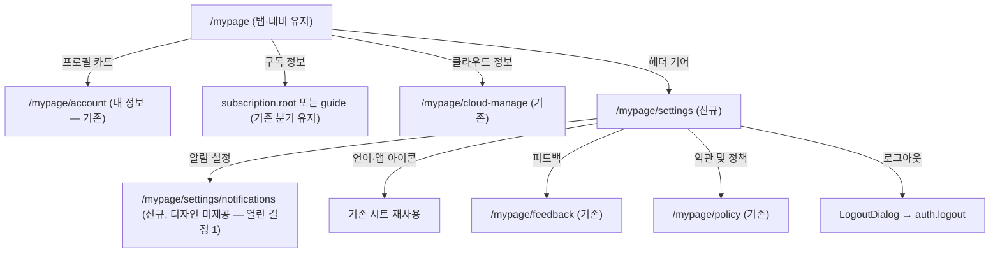

# MY 화면 depth 분리 — 구현 준비 문서

> 상태: 준비 완료(구현 전) · 작성: 2026-08-27 · 브랜치: `claude/ui-improvement-prep-42c91a`
>
> 현행 구조 문서: [apps/web/docs/feature/mypage/README.md](../../apps/web/docs/feature/mypage/README.md) — 구현 후 이 문서의 내용을 반영해 갱신한다.

## 목표

현재 `/mypage` 한 화면에 모두 놓인 항목(프로필·내 정보·구독·클라우드·설정 토글·지원·버전·로그아웃)을 두 depth로 분리한다.

- **MY 루트**(탭 유지): 프로필 카드 + 구독 정보 + 클라우드 정보, 우상단 설정 기어로 설정 depth 진입
- **설정 depth**(신규): 알림 / 앱 설정 / 지원 및 정보 섹션 + 버전 + 로그아웃

## 디자인 정본 (Figma)

| 화면                          | 노드         | 링크                                                                                      |
| ----------------------------- | ------------ | ----------------------------------------------------------------------------------------- |
| MY 루트 (`MY #소셜 로그인 x`) | `3293:39607` | [Figma](https://www.figma.com/design/ViwLfjc5Eoq7BpEXFfFj3W/DoU?node-id=3293-39607&m=dev) |
| 설정 목록 (`MY #설정 목록`)   | `4472:75227` | [Figma](https://www.figma.com/design/ViwLfjc5Eoq7BpEXFfFj3W/DoU?node-id=4472-75227&m=dev) |

구현 시 참조할 하위 노드:

| 요소                                                  | 노드                                                                                                    |
| ----------------------------------------------------- | ------------------------------------------------------------------------------------------------------- |
| MY 루트 헤더("MY" 타이틀 + 기어 버튼)                 | `4472:35426` (타이틀 `4472:75189`, 기어 `4472:35441`)                                                   |
| 프로필 카드(아바타 60px + 이름/이메일 + chevron)      | `3293:39660`                                                                                            |
| 구독 정보 카드                                        | `3293:39690`                                                                                            |
| 클라우드 정보 카드                                    | `4472:75209`                                                                                            |
| 설정 — 알림 섹션 카드                                 | `4472:75337` (섹션 헤더 `4483:79428`)                                                                   |
| 설정 — 앱 설정 섹션 카드                              | `4483:79431` (다크모드 `4483:79444` · 언어 `4483:79450` · 앱 아이콘 `4483:79458` · 온보딩 `4483:79466`) |
| 설정 — 지원 및 정보 섹션 카드                         | `4483:79517` (피드백 `4483:79554` · 약관 `4483:79560`)                                                  |
| 설정 — 버전 카드(단일 행, `v0.00.0(App) • 최신 버전`) | `4483:79478`                                                                                            |
| 설정 — 로그아웃 카드                                  | `4472:75409`                                                                                            |

> **주의**: 이 세션에서 `get_design_context`(코드 생성)는 파일이 무거워 반복 타임아웃했다. 메타데이터·스크린샷·변수 정의는 확보했고 위 표가 그 결과다. 구현 세션에서 스타일 세부가 더 필요하면 위 하위 노드 단위로 재시도할 것.

### 디자인 토큰 → 프로젝트 토큰

`get_variable_defs` 결과 기준:

| Figma 변수               | 값        | 프로젝트 매핑                                                            |
| ------------------------ | --------- | ------------------------------------------------------------------------ |
| `Solid/Secondary/BK_900` | `#222325` | 행 라벨 → `text-foreground`                                              |
| `Solid/Secondary/BK_600` | `#84888F` | 섹션 헤더·값 텍스트 → `text-description` (MenuCard `title`이 이미 이 톤) |
| `main2_Color`            | `#90c304` | 토글 on — 기존 `Switch` 토큰 그대로 사용                                 |
| `error`                  | `#ff4c35` | 로그아웃 → `ListRow destructive`                                         |

## 타깃 구조

### 현행 → 타깃 이동표

`MyPage.tsx`(apps/web/src/app/features/mypage/pages/MyPage.tsx) 기준:

| 현행 MyPage 항목                                                              | 이동처                                                                           |
| ----------------------------------------------------------------------------- | -------------------------------------------------------------------------------- |
| 프로필 헤더(아바타+이름+이메일, → `account.edit`)                             | MY 루트 프로필 **카드**로 재스타일, 목적지는 `account.info`로 변경(열린 결정 2)  |
| 내 정보 카드(→ `account.info`)                                                | 삭제 — 프로필 카드가 대체                                                        |
| 구독 행(라벨 분기 + guide/root 분기)                                          | MY 루트 "구독 정보" 카드 — 목적지 분기 유지, 라벨은 디자인대로 고정(열린 결정 3) |
| 클라우드 관리 행(`hasOwnedCloud` 게이트)                                      | MY 루트 "클라우드 정보" 카드 — 게이트 유지(열린 결정 3)                          |
| 푸시 알림 토글 / 메시지 미리보기 토글                                         | 설정 depth "알림" 섹션 — 디자인은 "알림 설정 >" 행 하나(열린 결정 1)             |
| 다크 모드 / 언어 / 앱 아이콘 / 온보딩 다시 보기                               | 설정 depth "앱 설정" 섹션 (토글·시트·핸들러 그대로 이동)                         |
| 피드백 / 약관 및 정책                                                         | 설정 depth "지원 및 정보" 섹션                                                   |
| 버전 행(디버그 10탭 게이트) + iOS 스토어 행                                   | 설정 depth 버전 카드 — 디자인은 한 행으로 병합(열린 결정 4)                      |
| Debug Mode 행(언락 시)                                                        | 설정 depth 버전 카드 아래 유지                                                   |
| 로그아웃                                                                      | 설정 depth 최하단 카드 (게스트 숨김 유지)                                        |
| `LogoutDialog`·`LanguageSelectSheet`·`AppIconSelectSheet`·`DebugUnlockDialog` | SettingsPage로 함께 이동                                                         |

### 신규 작업 목록

1. **라우트**: `ROUTES.mypage.settings = '/mypage/settings'` 추가([paths.ts](../../apps/web/src/app/routes/paths.ts)), `MyPageRoutes`에 `<Route path="settings" …>` 등록. 알림 depth를 만들면 `settings/notifications`도.
    - 하단 네비는 자동 처리: `UnifiedLayout`의 `BOTTOM_NAV_PATHS`가 `/mypage` 정확 일치라 `/mypage/settings`에는 네비가 안 뜬다.
2. **`SettingsPage.tsx`** 신규(features/mypage/pages): `PageHeader`(뒤로가기+타이틀 "설정") + `MenuCard title=…` 섹션들. 기존 훅(`useTheme`·`useDevicePushMute`·`useAppIcon`·`usePreferenceStore`·`useDebugUnlock`·`useAppUpdateStatus`)과 시트/다이얼로그를 MyPage에서 그대로 옮긴다.
3. **`MyPage.tsx` 개편**: 헤더를 좌측 정렬 "MY" 타이틀 + 우측 기어(`IconSettings` 계열 — web-ui-kit에 기어 아이콘 있는지 확인, 없으면 라이브러리에 먼저 추가: ADR-0011 원칙)로 교체. 카드 3장(프로필/구독 정보/클라우드 정보)만 남긴다. 프로필 카드는 `ListRow leading=아바타(60px)` 조합.
4. **i18n**(ko/en `public/locales/*/translation.json`): `mypage.settings.title`(설정), `mypage.settings.sections.notification`(알림)/`.app`(앱 설정)/`.support`(지원 및 정보), `mypage.notificationSettings`(알림 설정), `mypage.subscriptionInfo`(구독 정보), `mypage.cloudInfo`(클라우드 정보). 루트 타이틀 "MY"는 리터럴 여부 결정.
5. **문서 갱신**: 구현 후 [feature/mypage/README.md](../../apps/web/docs/feature/mypage/README.md)의 화면 표·허브 재설계 절·다이어그램을 새 구조로 갱신(관련 Figma 노드도 이 문서 것으로 교체).

### 재사용 컴포넌트 (검증 완료)

- `MenuCard`(web-ui-kit) — `title` prop이 **디자인의 카드 내부 섹션 헤더와 정확히 일치**한다. 신규 컴포넌트 불필요.
- `ListRow` — leading(아바타)/trailing(chevron·Switch·값 텍스트)/destructive 슬롯으로 전 행 커버.
- `PageHeader`(apps/web ui) — 설정 depth 탑바(뒤로가기+타이틀). `rightAction` 슬롯도 있음.

## 열린 결정 (구현 전 확인)

1. **알림 설정 depth**: 디자인의 "알림" 섹션은 "알림 설정 >" 행 하나다(토글 아님). 푸시 알림·메시지 미리보기 토글을 담을 `/mypage/settings/notifications` 화면 디자인이 아직 없다. **권고**: 디자인 나올 때까지 알림 섹션에 두 토글을 임시 배치(행 구성만 디자인과 다름을 주석으로 명시)하거나, 간단한 토글 2행짜리 depth를 만들고 디자이너 확인.
2. **프로필 카드 목적지**: 현행 헤더는 `account.edit`(프로필 수정)로 직행. 새 루트에서 "내 정보" 행이 사라지므로 **`account.info`(내 정보 허브: 프로필 수정·소셜 연동·탈퇴)로 변경 권고** — 아니면 소셜 연동/탈퇴 진입로가 사라진다.
3. **구독 정보/클라우드 정보 라벨·게이트**: 디자인 라벨은 고정 "구독 정보"/"클라우드 정보". 현행은 "구독 이용 중/구독 관리" 분기 + guide/root 목적지 분기, 클라우드는 `hasOwnedCloud` 게이트(다운그레이드 삭제 경로 — README의 이유 참고). **권고**: 라벨은 디자인 따르고, 목적지 분기와 소유 게이트는 유지.
4. **버전 행 병합 vs 디버그 게이트**: 디자인은 버전+업데이트 상태를 한 행(`v0.00.0(App) • 최신 버전`)으로 병합. 현행은 디버그 10탭 게이트(버전 행) / 스토어 이동(iOS 스토어 행)이 분리돼 있어 한 행의 onClick을 두 용도로 못 쓴다. **권고**: 행 onClick=디버그 탭 게이트 유지, trailing 상태 텍스트("최신 버전/업데이트 필요")만 스토어 이동 탭 타깃으로 분리. (또는 현행 2행 유지 후 디자이너와 조정.)
5. **게스트 상태**: 제공된 두 노드는 로그인 상태(`#소셜 로그인 x`)뿐. **권고**: 루트는 현행 게스트 분기(로그인하기 헤더)를 새 카드 레이아웃에 맞게 유지, 설정 depth는 게스트에게도 열되 로그아웃 숨김·푸시 토글은 기존 `pushSupported` 비활성 처리 재사용. 게스트/소셜로그인 변형 노드가 파일에 별도로 있을 수 있으니 구현 전에 디자이너에게 확인.

## 구현 순서 제안

1. 라우트 + 빈 SettingsPage + 기어 진입 (뼈대)
2. MyPage 루트 축소(카드 3장 + 새 헤더)
3. SettingsPage에 항목 이식(시트·다이얼로그·디버그 게이트 포함)
4. i18n(ko/en) + 다크모드 확인
5. 프리뷰 검증(아래) 후 feature README 갱신

## 검증 방법

- 리포 관례상 apps/web 페이지는 유닛 테스트 대상이 아니고 **브라우저 프리뷰로 검증**한다(mypage README §검증 방법). 게스트 부팅으로 로그인 없이 진입 가능.
- 확인 목록: 3상태(게스트/미구독/구독중) 루트 렌더, 기어→설정→뒤로가기 왕복(View Transition), `/mypage/settings`에서 하단 네비 부재, 설정 내 전 항목 회귀(다크모드·언어·앱아이콘·온보딩·피드백·약관·버전 탭 디버그 언락·로그아웃), 다크 모드 두 화면 모두.

## 준비 상태 (이 세션에서 완료한 것)

- develop에 unstaged로 남아 있던 생성 다이얼로그 개선(키보드 대응 compact 레이아웃, 4파일)을 이 브랜치에 커밋: `45fa03eb` — 관련 테스트 15건 통과 확인. 원본 체크아웃의 unstaged 사본은 건드리지 않았다.
- 본 문서 작성. 구현은 이 브랜치에서 이어서 진행하면 된다.
