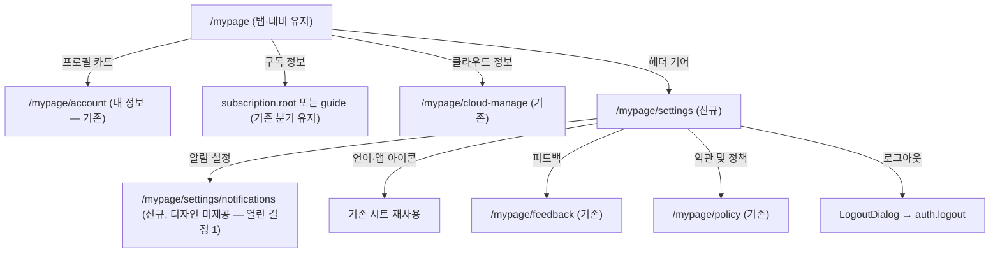

# MY 화면 depth 분리 — 구현 준비 문서

> 상태: 구현 완료(프리뷰 검증) · 작성·구현: 2026-08-27 · 브랜치: `claude/ui-improvement-prep-42c91a`
>
> 정본 구조 문서는 [apps/web/docs/feature/mypage/README.md](../../apps/web/docs/feature/mypage/README.md)다(갱신 완료). 이 문서는 디자인 노드 대조표와 결정 이력으로 남는다.

## 목표

현재 `/mypage` 한 화면에 모두 놓인 항목(프로필·내 정보·구독·클라우드·설정 토글·지원·버전·로그아웃)을 두 depth로 분리한다.

- **MY 루트**(탭 유지): 프로필 카드 + 구독 정보 + 클라우드 정보, 우상단 설정 기어로 설정 depth 진입
- **설정 depth**(신규): 알림 / 앱 설정 / 지원 및 정보 섹션 + 버전 + 로그아웃

## 디자인 정본 (Figma)

| 화면                          | 노드         | 링크                                                                                      |
| ----------------------------- | ------------ | ----------------------------------------------------------------------------------------- |
| MY 루트 (`MY #소셜 로그인 x`) | `3293:39607` | [Figma](https://www.figma.com/design/ViwLfjc5Eoq7BpEXFfFj3W/DoU?node-id=3293-39607&m=dev) |
| 설정 목록 (`MY #설정 목록`)   | `4472:75227` | [Figma](https://www.figma.com/design/ViwLfjc5Eoq7BpEXFfFj3W/DoU?node-id=4472-75227&m=dev) |

구현 시 참조할 하위 노드:

| 요소                                                  | 노드                                                                                                    |
| ----------------------------------------------------- | ------------------------------------------------------------------------------------------------------- |
| MY 루트 헤더("MY" 타이틀 + 기어 버튼)                 | `4472:35426` (타이틀 `4472:75189`, 기어 `4472:35441`)                                                   |
| 프로필 카드(아바타 60px + 이름/이메일 + chevron)      | `3293:39660`                                                                                            |
| 구독 정보 카드                                        | `3293:39690`                                                                                            |
| 클라우드 정보 카드                                    | `4472:75209`                                                                                            |
| 설정 — 알림 섹션 카드                                 | `4472:75337` (섹션 헤더 `4483:79428`)                                                                   |
| 설정 — 앱 설정 섹션 카드                              | `4483:79431` (다크모드 `4483:79444` · 언어 `4483:79450` · 앱 아이콘 `4483:79458` · 온보딩 `4483:79466`) |
| 설정 — 지원 및 정보 섹션 카드                         | `4483:79517` (피드백 `4483:79554` · 약관 `4483:79560`)                                                  |
| 설정 — 버전 카드(단일 행, `v0.00.0(App) • 최신 버전`) | `4483:79478`                                                                                            |
| 설정 — 로그아웃 카드                                  | `4472:75409`                                                                                            |

> **주의**: 이 세션에서 `get_design_context`(코드 생성)는 파일이 무거워 반복 타임아웃했다. 메타데이터·스크린샷·변수 정의는 확보했고 위 표가 그 결과다. 구현 세션에서 스타일 세부가 더 필요하면 위 하위 노드 단위로 재시도할 것.

### 디자인 토큰 → 프로젝트 토큰

`get_variable_defs` 결과 기준:

| Figma 변수               | 값        | 프로젝트 매핑                                                            |
| ------------------------ | --------- | ------------------------------------------------------------------------ |
| `Solid/Secondary/BK_900` | `#222325` | 행 라벨 → `text-foreground`                                              |
| `Solid/Secondary/BK_600` | `#84888F` | 섹션 헤더·값 텍스트 → `text-description` (MenuCard `title`이 이미 이 톤) |
| `main2_Color`            | `#90c304` | 토글 on — 기존 `Switch` 토큰 그대로 사용                                 |
| `error`                  | `#ff4c35` | 로그아웃 → `ListRow destructive`                                         |

## 타깃 구조

### 현행 → 타깃 이동표

`MyPage.tsx`(apps/web/src/app/features/mypage/pages/MyPage.tsx) 기준:

| 현행 MyPage 항목                                                              | 이동처                                                                           |
| ----------------------------------------------------------------------------- | -------------------------------------------------------------------------------- |
| 프로필 헤더(아바타+이름+이메일, → `account.edit`)                             | MY 루트 프로필 **카드**로 재스타일, 목적지는 `account.info`로 변경(열린 결정 2)  |
| 내 정보 카드(→ `account.info`)                                                | 삭제 — 프로필 카드가 대체                                                        |
| 구독 행(라벨 분기 + guide/root 분기)                                          | MY 루트 "구독 정보" 카드 — 목적지 분기 유지, 라벨은 디자인대로 고정(열린 결정 3) |
| 클라우드 관리 행(`hasOwnedCloud` 게이트)                                      | MY 루트 "클라우드 정보" 카드 — 게이트 유지(열린 결정 3)                          |
| 푸시 알림 토글 / 메시지 미리보기 토글                                         | 설정 depth "알림" 섹션 — 디자인은 "알림 설정 >" 행 하나(열린 결정 1)             |
| 다크 모드 / 언어 / 앱 아이콘 / 온보딩 다시 보기                               | 설정 depth "앱 설정" 섹션 (토글·시트·핸들러 그대로 이동)                         |
| 피드백 / 약관 및 정책                                                         | 설정 depth "지원 및 정보" 섹션                                                   |
| 버전 행(디버그 10탭 게이트) + iOS 스토어 행                                   | 설정 depth 버전 카드 — 디자인은 한 행으로 병합(열린 결정 4)                      |
| Debug Mode 행(언락 시)                                                        | 설정 depth 버전 카드 아래 유지                                                   |
| 로그아웃                                                                      | 설정 depth 최하단 카드 (게스트 숨김 유지)                                        |
| `LogoutDialog`·`LanguageSelectSheet`·`AppIconSelectSheet`·`DebugUnlockDialog` | SettingsPage로 함께 이동                                                         |

### 신규 작업 목록

1. **라우트**: `ROUTES.mypage.settings = '/mypage/settings'` 추가([paths.ts](../../apps/web/src/app/routes/paths.ts)), `MyPageRoutes`에 `<Route path="settings" …>` 등록. 알림 depth를 만들면 `settings/notifications`도.
    - 하단 네비는 자동 처리: `UnifiedLayout`의 `BOTTOM_NAV_PATHS`가 `/mypage` 정확 일치라 `/mypage/settings`에는 네비가 안 뜬다.
2. **`SettingsPage.tsx`** 신규(features/mypage/pages): `PageHeader`(뒤로가기+타이틀 "설정") + `MenuCard title=…` 섹션들. 기존 훅(`useTheme`·`useDevicePushMute`·`useAppIcon`·`usePreferenceStore`·`useDebugUnlock`·`useAppUpdateStatus`)과 시트/다이얼로그를 MyPage에서 그대로 옮긴다.
3. **`MyPage.tsx` 개편**: 헤더를 좌측 정렬 "MY" 타이틀 + 우측 기어(`IconSettings` 계열 — web-ui-kit에 기어 아이콘 있는지 확인, 없으면 라이브러리에 먼저 추가: ADR-0011 원칙)로 교체. 카드 3장(프로필/구독 정보/클라우드 정보)만 남긴다. 프로필 카드는 `ListRow leading=아바타(60px)` 조합.
4. **i18n**(ko/en `public/locales/*/translation.json`): `mypage.settings.title`(설정), `mypage.settings.sections.notification`(알림)/`.app`(앱 설정)/`.support`(지원 및 정보), `mypage.notificationSettings`(알림 설정), `mypage.subscriptionInfo`(구독 정보), `mypage.cloudInfo`(클라우드 정보). 루트 타이틀 "MY"는 리터럴 여부 결정.
5. **문서 갱신**: 구현 후 [feature/mypage/README.md](../../apps/web/docs/feature/mypage/README.md)의 화면 표·허브 재설계 절·다이어그램을 새 구조로 갱신(관련 Figma 노드도 이 문서 것으로 교체).

### 재사용 컴포넌트 (검증 완료)

- `MenuCard`(web-ui-kit) — `title` prop이 **디자인의 카드 내부 섹션 헤더와 정확히 일치**한다. 신규 컴포넌트 불필요.
- `ListRow` — leading(아바타)/trailing(chevron·Switch·값 텍스트)/destructive 슬롯으로 전 행 커버.
- `PageHeader`(apps/web ui) — 설정 depth 탑바(뒤로가기+타이틀). `rightAction` 슬롯도 있음.

## 결정된 사항 (구현에 반영됨)

계획 단계의 열린 결정 5건은 아래대로 확정해 구현했다. 정본 설명은 [feature/mypage/README.md](../../apps/web/docs/feature/mypage/README.md)로 옮겼고, 여기에는 무엇을 왜 골랐는지만 남긴다.

1. **알림 설정 depth**: `/mypage/settings/notifications`를 신설하고 토글 두 개(푸시 알림·메시지 미리보기)를 담았다. 설정 목록의 "알림 설정 >" 행을 디자인대로 유지하려면 목적지가 있어야 했고, 임시로 섹션에 토글을 늘어놓으면 그 행이 갈 곳을 잃는다. **이 화면의 Figma는 아직 없다** — 나오면 행 구성을 맞춘다.
2. **프로필 카드 목적지**: `account.info`(내 정보). 루트에서 "내 정보" 행이 사라져 이 카드가 소셜 연동·탈퇴로 가는 유일한 입구가 됐다.
3. **구독/클라우드 라벨·게이트**: 라벨은 디자인대로 "구독 정보"/"클라우드 정보" 고정, 목적지 분기(guide/root)와 소유 게이트(`clouds.length > 0`)는 유지.
4. **버전 행**: 계획의 권고(상태 텍스트만 스토어 타깃으로 분리)는 **버렸다** — `ListRow`는 `onClick`이 있으면 루트가 `<button>`이라, 그 안에 두 번째 클릭 타깃을 넣으면 버튼 중첩이 된다. 대신 **행 전체가 조건부로 갈린다**: 업데이트가 실제 대기 중일 때만(iOS 한정) 스토어로 가고, 그 외에는 디버그 10탭 게이트를 유지한다. 평상시엔 모든 플랫폼에서 언락이 살아 있다.
5. **게스트 상태**: 루트는 "로그인하기" 카드 하나, 설정 depth는 게스트에게도 열되 로그아웃만 숨김. 게스트/소셜로그인 변형 노드가 따로 있으면 대조 필요(미확인).

## 검증 결과

브라우저 프리뷰(375×812, 게스트 부팅)로 확인 — apps/web 페이지는 리포 관례상 유닛 테스트 대상이 아니다.

- 루트: "MY" 타이틀 + 기어, 게스트 로그인 카드, 하단 네비 유지.
- 기어 → `/mypage/settings` → "알림 설정" → `/mypage/settings/notifications` → 뒤로가기 왕복 정상. 두 depth 모두 하단 네비 없음(추가 설정 없이 `BOTTOM_NAV_PATHS` 정확 일치 덕분).
- 언어 전환 ko/en 양쪽 라벨 확인(알림 / 앱 설정 / 지원 및 정보). 다크 모드 두 화면 확인. 웹에서 푸시 토글은 기존대로 비활성 + "앱에서만 설정할 수 있어요".
- 로그인 분기(프로필 카드 + 구독 정보)는 게스트 세션에서 재현되지 않아(부팅마다 guest keepAlive가 relay 토큰을 다시 씀) `isGuest`를 일시 고정해 렌더만 확인한 뒤 되돌렸다.
- 타입체크: `apps/web` 비테스트 소스 0건(임시 tsconfig로 libs 소스 경로 컴파일 — 리포의 TS6305 선재 부채 우회).

**실기기 미검증**: 안전영역(`pt-safe-top`) 적용과 iOS 스토어 분기(업데이트 대기 상태)는 웹 프리뷰로 재현되지 않는다.

## 이력

- `45fa03eb` — develop에 unstaged로 남아 있던 생성 다이얼로그 키보드 대응(4파일) 회수 커밋. 테스트 15건 통과.
- `d7ecc137` — 본 계획 문서 작성.
- 구현 — 라우트 2개·`SettingsPage`/`NotificationSettingsPage` 신설, `MyPage` 축소, `IconSettings` 추가, i18n(ko/en), feature README 갱신.
