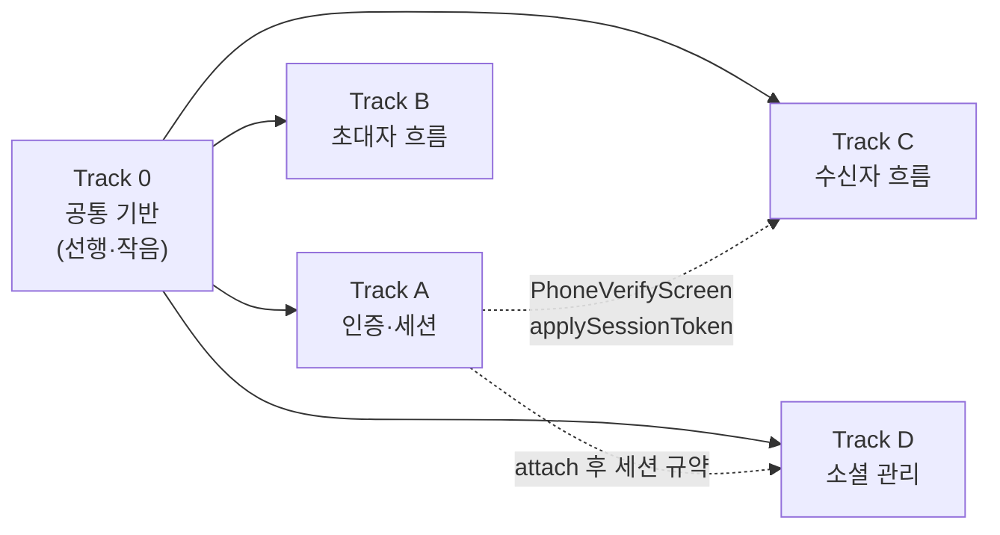

# 1:1(DM) 중계 초대·전화번호 인증·소셜 관리 — 병렬 트랙 로드맵

> 작성 2026-07-29 · 결정 근거: [ADR-0033](../adr/0033-relay-dm-invite-and-auth-parallel-tracks.md)

여러 Claude 세션(워크트리)이 동시에 진행하기 위한 트랙 분할이다. 각 트랙은
독립 브랜치/워크트리에서 작업하고, 트랙 간 의존은 아래 **인터페이스 계약**으로만
접촉한다.

## 참조

| 무엇             | 어디                                                                                                                                           |
| ---------------- | ---------------------------------------------------------------------------------------------------------------------------------------------- |
| 결정 기록        | `docs/adr/0033-relay-dm-invite-and-auth-parallel-tracks.md`                                                                                    |
| 백엔드 계약 원본 | `/Users/raine/Documents/lemoncloud-io/chatic-sockets-api/docs/specs/relay-server-invite/` — **`05-client-guide.md` 먼저**, 계약은 `01-spec.md` |
| 클라 게이트웨이  | `@lemoncloud/chatic-sockets-lib@0.4.9` — `createInviteGateway`, `auth.verifyHashAlias/attachSocial`                                            |
| 응답 타입        | `@lemoncloud/chatic-backend-api@^0.26.704` — `MyInviteView`(expiredAt·inviter$·state 포함)                                                     |
| 딥링크           | `docs/DEEP-LINKING-V2.md` — `invt:<id>:<code>` 파싱 인프라 기존재. relay 초대 딥링크에는 `&relay` 마커가 붙는다                                |
| Figma            | DoU 파일. 트랙별 노드 id는 각 트랙 절에                                                                                                        |

## 트랙 지도



- Track 0 머지 후 A·B·C·D가 동시 출발한다.
- C는 A의 산출물 2개(전화번호 인증 화면, 세션 전환 함수)에 의존한다. **계약만
  맞추면 병렬 진행 가능** — C는 A 머지 전까지 스텁 구현(mock)으로 개발하고,
  통합은 A 머지 후 rebase로.
- B·D는 상호 독립.

## 세션 운영 (워크트리)

**트랙 하나 = Claude 세션 하나.** 한 세션이 여러 트랙을 오케스트레이션하면 그
세션이 5개 트랙의 컨텍스트를 전부 떠안게 된다. 각 트랙은 자기 워크트리에서
새 세션으로 시작하고, 이 문서와 ADR-0033을 읽는 것으로 컨텍스트를 세운다.

**통합 브랜치는 `claude/1-1-chat-auth-social-roadmap-0e4b17`이다** — develop이
아니다. ADR·로드맵이 이 브랜치에만 있고, 트랙 산출물도 여기로 모은 뒤 한 번에
develop으로 올린다.

**Track 0은 워크트리를 따로 쓰지 않고 통합 브랜치에서 직접 진행한다** — 전
트랙이 그 결과를 기다리므로 머지 단계를 한 번 줄인다.

Track 0이 끝난 **뒤에** 나머지 넷의 워크트리를 만든다 (계약 훅이 있어야
A·B·C·D가 스텁 없이 바로 쓴다):

```bash
for t in a b c d; do
  git worktree add ".claude/worktrees/relay-track-$t" -b "claude/relay-invite-track-$t" claude/1-1-chat-auth-social-roadmap-0e4b17
done
```

각 워크트리에서 새 Claude 세션을 열고 아래 "세션 킥오프 프롬프트"의 해당 트랙
블록을 첫 메시지로 붙여넣는다. 추천 모델 — Track 0·C: Opus / Track A: Fable /
Track B·D: Sonnet.

## 공통 규칙

- 브랜치: `claude/relay-invite-track-<0|a|b|c|d>` · 베이스는 **통합 브랜치**
  (위 참조) · 트랙당 PR 1개는 통합 브랜치를 향한다.
- **인터페이스 계약(아래 시그니처)을 바꿔야 하면 먼저 이 문서를 고치고 다른
  트랙에 알린다.** 계약 밖 내부 구조는 트랙 재량. 문서 수정 커밋은 통합
  브랜치에 먼저 올려 다른 트랙이 rebase로 받아 갈 수 있게 한다.
- 스텁 규약 (ADR-0033 D1 "인터페이스 선반영"):
    - 백엔드 없는 액션은 `// TODO(backend): <요청목록 번호> — ADR-0033 인터페이스 선반영` 주석.
    - 사용자 노출은 `apps/web/src/app/features/**/flags.ts`류 상수로 게이팅해
      숨김/비활성 전환이 한 줄이 되게 한다.
- 상태 문구는 서버 `state`/`errorCode`로만 분기한다. 에러 메시지 문자열 파싱 금지.
- 초대 코드는 로그·URL(딥링크 제외)·상태 관리 devtools에 남기지 않는다.
- 검증: `yarn web:test`(변경 영역 스위트) + 앱별 typecheck/lint(레포 관례) + 데모/dev
  스테이지 수동 확인. 결과를 PR 본문에 기록.

## 인터페이스 계약

Track 0이 만들고 전 트랙이 소비한다. 위치는 기존 패턴을 따른다 — 소켓 게이트웨이
배선은 `libs/data`의 clients/gateways, react-query 훅은 web-core 또는
`apps/web/src/app/hooks`(구현 스펙에서 확정).

```ts
// ── Track 0 산출 ──────────────────────────────────────────────
/** invite.list 폴링 (react-query). 초대는 repositories-v2로 승격하지 않는다(ADR-0033). */
useRelayInvites(state?: 'pending' | 'accepted' | 'expired'): {
    invites: MyInviteView[]; isLoading: boolean; refetch(): Promise<unknown>;
}
useRelayInviteMutations(): {
    createInvite(input: { phone: string; name: string }): Promise<MyInviteView>;
    getInvite(code: string): Promise<MyInviteView & { needVerify?: boolean }>;   // invite.get
    acceptInvite(code: string): Promise<MyInviteView>;                            // state==='accepted'가 성공
}
/** auth.verify-hash-alias 래퍼. step 셋을 감춘다. */
useVerifyHashAlias(): {
    send(phone: string, opts?: { code?: string; resend?: boolean; dryRun?: boolean; sms?: boolean; slack?: boolean }):
        Promise<{ sent?: boolean; expiredAt?: number }>;
    check(phone: string, otp: string, opts?: { code?: string }):
        Promise<{ attached?: boolean; $token?: unknown /* UserTokenView */ }>;
}
/** auth.attach-social 래퍼 (Track D 소비) */
useAttachSocial(): { attach(tokens: Record<string, unknown> & { provider: string }): Promise<{ attached?: boolean }> }

// ── Track A 산출 (Track C 소비) ───────────────────────────────
/** check 성공의 $token을 SocketManager(relay+cloud)에 반영. 완료 후 소켓 신원이 메인유저다. */
applySessionToken($token: unknown): Promise<void>
/** 전화번호 인증 풀스크린/시트. 완료 시 세션 전환까지 끝난 상태로 onVerified. */
<PhoneVerifyScreen
    context: 'invite-accept' | 'invite-create';
    inviteCode?: string;            // 초대 맥락이면 send에 code 동봉 (번호 불일치는 발송단 400)
    onVerified(): void; onClose(): void;
/>

// ── Track B 산출 ──────────────────────────────────────────────
/** 발급 이력 로컬 저장 (재초대 감지·대기 화면 라벨용 — 서버 뷰에는 번호 원문이 없다) */
useSentInviteLog(): {
    record(invite: MyInviteView, input: { phone: string; name: string }): void;
    findByPhone(phone: string): { inviteId: string; name: string } | undefined;
    /** 추가(구현 중 필요 확인 — 다른 트랙 미소비, additive라 하위 호환).
     *  대기 화면의 "초대 다시 하기"는 route param으로 code가 아니라 id만 쥐고 있어
     *  재발급(createInvite) 호출에 필요한 phone을 역조회해야 한다. */
    findByInviteId(inviteId: string): { phone: string; inviteId: string; name: string } | undefined;
}
```

## Track 0 — 공통 기반 (선행 · 반나절 규모)

**범위** (1·2는 완료 — 통합 브랜치 `cd98a0492`·`249fe3543`)

1. ~~의존성 범프: `@lemoncloud/chatic-sockets-lib` `0.4.8 → 0.4.9`,
   `@lemoncloud/chatic-backend-api` `^0.26.405 → ^0.26.704`.~~ **완료**
2. ~~invite 게이트웨이 배선~~ **완료** — `libs/data/src/data/remote/gateways/index.ts`
   에 연결되고 `libs/app-runtime`의 `useRuntimeGateways`로 노출된다
   (`remoteFactory`·`DataManager`·`MockRemoteGateways` 포함).
3. 위 인터페이스 계약의 훅 구현 + 단위 테스트 (MockSocketClient 패턴). **남음**
4. 딥링크 파서 확장: `parseInviteDeeplink`(`apps/web/.../home/types/invite.ts`)가
   `relay` 마커를 읽어 `isRelayInvite`를 노출. **남음**

**완료 기준** — 훅이 dev 스테이지에서 `invite.create → list` 왕복에 성공하고,
타 트랙이 import 가능한 상태로 develop에 머지.

## Track A — 인증·세션

**의존** Track 0. **리스크 최상** — 세션 전환부터 검증.

**범위**

1. `applySessionToken`: `verify-hash-alias step=check` 응답 `$token` →
   SocketManager(`libs/app-runtime/src/socket/SocketManager.ts`, relay+cloud 듀얼
   슬롯) 신원 갱신. SDK `AuthController`의 `auth.refresh`/`auth.switch` 경로 우선
   검토, 안 되면 재연결. **갱신 전 invite.create/accept는 403**이라는 계약을
   테스트로 고정.
2. `PhoneVerifyScreen`: Figma `3421-59180 · 3421-59348 · 3421-59772 · 3428-59935 ·
3428-60106 · 3428-60171 · 3430-60970 · 3432-61176 · 3428-60218 · 3432-61204 ·
3432-61459 · 3432-61332 · 3435-61613 · 3428-60114 · 3435-62380`. - 타이머는 send/resend 응답 `expiredAt` 기준. **"시간 연장" = `step=resend`**
   (ADR-0033 D9). 연장·재전송 5회 제한은 클라 카운터로 두되 서버 429가 우선. - 케이스: 발송 완료 토스트 / 오답(403, "인증번호를 정확히") / 만료(00:00,
   "새로운 인증 요청") / 쿨다운·상한(429, "잠시 후"·"요청이 너무 많습니다") /
   오답 5회(429, 재전송 유도 — 재전송해도 오답 카운터 유지 안내). - dev 빌드 발송 스위치(`dryRun`/`slack`) 토글 노출(개발용).
3. 계정 갈라짐 방어 배너: "이미 계정이 있다면 소셜로 먼저 로그인하세요" —
   인증 UI 상단 슬롯. 소셜 로그인 진입은 기존 `mypage/LoginPage`(브릿지) 경로 재사용.
4. 로그아웃 회귀 확인: `auth.logout` 후 디바이스 유저 복귀(기존 게스트 세션 부트
   경로) — 초대 흐름과 충돌 없는지 시나리오 테스트.

**완료 기준** — 디바이스 유저가 번호 인증으로 메인유저 전환 후, 같은 소켓
연결에서 `invite.create`가 403 없이 성공.

## Track B — 초대자 흐름

**의존** Track 0. (인증 게이트는 현 정책상 스킵 — 발급 403 시 A-1로 보내는 분기만
자리 확보: `05-client-guide.md` §A-1)

**범위**

1. 연락처로 초대 페이지: Figma `3266-32434 · 3266-35386 · 3268-35795`(검증 에러).
   홈 ＋메뉴 "1:1 대화" placeholder(`HomePage.tsx:224`) 교체. 이름 20자 + 휴대폰
   검증(기존 `normalizeKoreanPhone` 재사용). 유효시간 카피는 **3일**(디자인 수정
   요청 중, ADR-0033 D8).
2. 발급 → 전달: `createInvite` → `useSentInviteLog.record` → **SMS 작성기**
   (`SendSms` 브릿지 — 모바일 핸들러 기존재, `apps/web` 송신부 추가) 본문에
   `deeplink` 프리필. 비네이티브 폴백 = `copyClipBoard`. 완료 토스트
   (`3272-35987`) 후 초대 대기 화면으로.
3. 재초대 다이얼로그: `3411-18193`(이미 보냄) `3412-18331`(만료) `3412-18478`(거절).
   같은 번호 감지는 `useSentInviteLog` + `invite.list` 대조. "이전 링크 자동 만료"
   카피는 **백엔드 미지원(요청 3번)** — 문구 조정 or 스텁 플래그.
4. 초대 대기 화면 (pseudo-채널 룸): `3263-30072 · 3398-25887 · 3263-30117 ·
3263-30162 · 3263-30207 · 3413-18662`. 신규 route. `expiredAt` 카운트다운,
   `invite.list` 폴링(화면 포커스 시 + 30초), 초대 다시 하기(재발급), **초대
   취소 = 스텁**(요청 1번, 확인 다이얼로그까지는 구현). 수락 감지 시 실제 채널로
   전환(`state==='accepted'` → 채널 sync 대기, Track C와 같은 유틸).
5. 리스트 통합: 홈 `ChannelList` + `PlaceChannelManagePage`에 초대 행
   (`3408-28373 · 3410-51026 · 3410-51359 · 3410-51364 · 3410-51371`, 상태 정의
   `3101-26823 · 3101-26916`). 초대 대기 중/만료 뱃지는 서버 state, **"초대 거절"
   뱃지는 백엔드 상태 부재(요청 2번)** — 만료와 동일 취급 + 스텁 주석. 관리
   화면에서 초대 행 삭제 = 취소 스텁.

**완료 기준** — 발급→문자 작성기→대기 화면→ (수신자 수락 후) 실채널 전환까지
dev 스테이지 2계정 수동 시나리오 통과.

## Track C — 수신자 흐름

**의존** Track 0 + Track A 계약(`PhoneVerifyScreen`·`applySessionToken`).
A 머지 전에는 계약 시그니처의 목 구현으로 진행.

**범위**

1. 진입 판정: 딥링크 → `isRelayInvite`면 신규 relay 수락 플로우, 아니면 기존
   클라우드 `InviteDialog` 유지 (회귀 금지).
2. 수락 팝업(InviteDialog relay 분기): Figma `3077-11587`(기본) — `inviter$`로
   "OOO님이 초대했어요" + 사진, `expiredAt` 카운트다운. 상태 케이스:
   `3077-11719`(만료) `3078-12015`(이미 참여=accepted) `3079-12154`(채팅방 삭제)
   `3079-12304`(초대 취소). 매핑: `expired`→만료 / `accepted`→이미 참여 /
   에러 `404`→취소·유효하지 않음(문구 통합) / **거절 버튼 = 스텁**(요청 2번,
   닫기+로컬 기록만).
3. 스텝 오케스트레이션 (ADR-0033 D10): `getInvite` → `needVerify=true`면
   `PhoneVerifyScreen(context:'invite-accept', inviteCode)` → relay 플레이스
   `profile.nick` 없으면 프로필 설정(기존 place 프로필 편집 재사용, ADR-0020) →
   `acceptInvite` → 채널 sync 대기 → 입장(`usePendingInviteChannel` 패턴 재활용).
   수락 후 채널이 늦으면 스피너 + 타임아웃 폴백(홈 이동 + 안내).
4. 상태 재검증: 각 스텝 전환 시 `getInvite` 재호출로 만료·선점 감지 (인증 도중
   만료되는 경로 — `05-client-guide.md` B-2).

**완료 기준** — 신규 기기(디바이스 유저)에서 딥링크→인증→프로필→수락→채널
입장 풀 시나리오 + 만료/이미참여/404 케이스가 dev 스테이지에서 통과.

## Track D — 소셜 관리

**의존** Track 0. A와는 "attach 후 세션 불변(메인유저 유지)" 규약만 공유.

**범위**

1. `AccountInfoPage`에 소셜 연동 섹션 (초안은 `AccountManagePage`도 지목했으나
   그쪽은 `CloudView`(워크스페이스·구독) 전용이라 도메인이 다르다 — 제외가 맞다):
   provider 목록(google/apple/…)과 연동 상태.
2. 연동 추가: `appBridge.oauthLogin(provider)`로 native token 획득 →
   `useAttachSocial().attach` (`auth.attach-social` — 세션은 바뀌지 않는다).
   비네이티브는 기존 OAuth relay 경로 검토.
3. **연동 목록 조회 = 백엔드 API 부재(요청 6번)** — 우선 가용 소스(유저 뷰의
   계정 정보) 조사 후, 없으면 "연동됨" 로컬 캐시 + 스텁. **해제 = 스텁**(요청 7번).
4. 계정 갈라짐 방어와의 접점: 소셜 미연동 + 번호만 있는 메인유저에게 연동 유도
   배너(선택 구현).

**완료 기준** — attach-social이 dev 스테이지에서 성공하고 재로그인 시 같은
유저로 모이는 것 확인. 목록/해제는 스텁 + TODO 주석.

## 통합 — 완료 (2026-07-29)

다섯 트랙 전부 통합 브랜치 `claude/1-1-chat-auth-social-roadmap-0e4b17`에 병합됐다.
`develop` 대비 125파일 · +8255줄. 병합 순서는 D → A → C(목 교체) → B였고 충돌은
없었다.

**통합 시점 검증 (실제 실행)** — `tsc -b apps/web/tsconfig.app.json` 클린 ·
apps/web 118 suites / 782 tests · app-runtime 144 · web-core · web-ui-kit 전부 통과.

**통합에서 고친 것**

- `apps/web/jest.setup.ts` 신설 — `PhoneVerifyScreen`이 `@chatic/app-runtime`을
  끌어오면서 jsdom에 없는 `TextEncoder`에서 터졌다. `libs/app-runtime/jest.setup.ts`의
  기존 폴리필을 그대로 옮겼다.
- `InviteDialog.test.tsx`가 `features/auth/utils/env`를 목한다 — ts-jest가
  `import.meta`를 파싱하지 못한다. auth 피처가 그 목적으로 격리해 둔 모듈이다.
- Track C의 `trackAMock.tsx` 삭제, `RelayInviteDialog`가 실제
  `features/auth/components`의 `PhoneVerifyScreen`을 쓴다.

**남은 단계**

1. Figma 대조 — Track A·B가 디자인을 못 본 채 구현했다(아래 "후속 과제" 1번).
2. 통합 QA — 아래 목록.
3. 통합 브랜치 → develop PR 1건.

## 통합 QA 체크리스트

이 환경에 dev 스테이지·네이티브 브릿지가 없어 아래는 **전부 미실행**이다.

- [ ] 2계정 E2E — 발급 → SMS 링크 전달 → 수락 → 양측 채널 확인
- [ ] 디바이스 유저 → 번호 인증 → 같은 연결에서 `invite.create` 성공
      (실서버 `$token`에 `$auth.id`가 실리는지 포함 — 없으면 `applySessionToken`이
      커밋 전 reject한다)
- [ ] 로그아웃 → 디바이스 유저 복귀 → 재인증
- [ ] 만료·이미 참여·404 케이스 화면
- [ ] 수락 후 DM 방 감지 — 새 방이 relay `selectedSiteId`가 아닌 sid로 들어오면
      감지에 실패하고 폴백이 뜬다. 필터를 넓히는 건 한 줄
- [ ] 네이티브 소셜 attach 성공 → 로그아웃 → 같은 계정 재로그인
- [ ] SMS 작성기 실기기 동작 (본문 딥링크 프리필)

## 후속 과제

1. **Figma 대조** — Track A(전화번호 인증 15개 노드)·Track B(초대 폼·대기 화면·
   리스트 통합)는 Figma MCP 인증 실패로 **디자인을 보지 못한 채** 기존 화면
   관용구로 구현했다. Track C만 데스크톱 앱 Figma 서버로 5개 노드를 읽었다.
   로직·계약은 검증됐지만 시각적 정확도는 미검증이다.
2. **jest의 `import.meta` 파싱** — 지금은 모듈을 격리해 목으로 막는다. 레포에
   `import.meta.env`를 쓰는 모듈이 4개 더 있고(`main.tsx`·`Sidebar.tsx`·
   subscription 둘) 아직 어떤 테스트도 그것들을 import 하지 않아 안 터질 뿐이다.
3. **채널 대기 유틸 2종** — `useAwaitInviteChannel`(수신자: channelId를 모른 채 새
   `stereo==='dm'` 행을 감시, 20s)과 `useAcceptedChannelSync`(초대자: 초대 뷰에
   실린 channelId를 감시, 8s). 지금은 입력이 달라 별개가 맞지만, 백엔드 요청 5번이
   해결되면 하나로 합칠 후보다.
4. **디자인 카피 수정 요청** — 유효시간 24시간 → 3일.
5. **초대 취소의 반쪽 동작** — 취소해도 취소한 기기에서 숨겨질 뿐이고 수신자는
   여전히 수락할 수 있다(백엔드 요청 1번 전까지).

## 백엔드 요청 목록 (chatic-backend-api / sockets-api 팀 전달용)

| #   | 요청                                                                       | 근거 화면                                      | 클라 현 대응                                        |
| --- | -------------------------------------------------------------------------- | ---------------------------------------------- | --------------------------------------------------- |
| 1   | 초대 취소 API (`invite.cancel`) + 수신자 조회 시 `canceled` 구분           | 대기 화면·관리 화면·수신자 취소 팝업           | 취소 버튼 스텁, 404를 "취소·유효하지 않음"으로 통합 |
| 2   | 초대 거절 API + `rejected` 상태                                            | 수락 팝업 거절 버튼, 초대자측 "초대 거절" 뱃지 | 거절 버튼 스텁(닫기), 뱃지는 만료 취급              |
| 3   | 재발급 시 같은 번호의 이전 pending 초대 자동 revoke                        | "이전 링크는 자동으로 만료됩니다" 카피         | 카피 보류/조정                                      |
| 4   | 수락 알림 (소켓 이벤트 or push)                                            | 대기 화면 실시간 갱신                          | `invite.list` 폴링 (30초)                           |
| 5   | dm `channelId` 회수 (수락 응답 동봉 or 초대 뷰 `channelId` 채움 시점 확정) | 수락 직후 입장                                 | 채널 sync 이벤트 대기 + 타임아웃 폴백               |
| 6   | 소셜 연동 목록 조회 API                                                    | 소셜 관리 화면                                 | 로컬 캐시 + 스텁                                    |
| 7   | 소셜 연동 해제 API                                                         | 소셜 관리 화면                                 | 해제 버튼 스텁                                      |
| 8   | (선택) 발급 응답에 기존 dm 존재 시그널                                     | "이미 1:1 대화가 있어요" 다이얼로그            | v1 미구현 (ADR-0033 D2)                             |

**디자인 요청**: 유효시간 카피 24시간 → **3일**로 수정 (`3266-32434` 등 초대 폼,
및 재초대 다이얼로그의 "자동 만료" 문구 — 요청 3 확정 전까지 보류).

## 세션 킥오프 프롬프트

각 트랙 워크트리에서 첫 메시지로 붙여넣는다. 공통 전제: 먼저 `docs/adr/0033-…`,
이 로드맵, 그리고 `chatic-sockets-api/docs/specs/relay-server-invite/05-client-guide.md`를
읽는다. `/dev-2_implement`로 스펙(Phase A) 승인 후 구현에 들어간다.

### Track 0

```
/dev-2_implement docs/plans/relay-dm-invite-parallel-roadmap.md 의 Track 0(공통 기반) 나머지를 구현해줘.
ADR: docs/adr/0033-relay-dm-invite-and-auth-parallel-tracks.md
통합 브랜치에서 직접 작업한다(별도 워크트리 없음). 의존성 범프와 게이트웨이 배선은 이미 끝났다(cd98a0492, 249fe3543) — libs/app-runtime의 useRuntimeGateways로 invite 게이트웨이가 나온다. 거기서 이어라.
남은 범위: (1) 로드맵 "인터페이스 계약" 절의 useRelayInvites / useRelayInviteMutations / useVerifyHashAlias / useAttachSocial 훅 + 단위 테스트(MockSocketClient 패턴). 초대는 repositories-v2로 승격하지 않는다 — react-query다. 위치는 기존 useInviteInfo/useVerifyAlias 관례를 따라라.
(2) parseInviteDeeplink(apps/web/.../home/types/invite.ts)에 relay 마커 → isRelayInvite 추가. 기존 클라우드 초대 판정(isInviteEntry)에 회귀 금지.
계약 시그니처는 로드맵 문서가 원본이다 — 바꿔야 하면 로드맵부터 고치고 이유를 남겨라. 나머지 4개 트랙이 이 문서를 읽는다.
검증: yarn web:test 관련 스위트 + libs/data·libs/app-runtime 스펙 + dev 스테이지에서 invite.create→list 왕복.
```

### Track A

```
/dev-2_implement docs/plans/relay-dm-invite-parallel-roadmap.md 의 Track A(인증·세션)를 구현해줘.
ADR: docs/adr/0033-relay-dm-invite-and-auth-parallel-tracks.md · 백엔드 가이드: chatic-sockets-api/docs/specs/relay-server-invite/05-client-guide.md §A-1·발송제한·에러코드
가장 먼저: applySessionToken($token) — verify-hash-alias check 응답의 $token을 SocketManager(relay+cloud 듀얼 슬롯)에 반영하는 경로(auth.refresh/auth.switch vs 재연결)를 검증하는 스파이크부터. 갱신 전 invite.create가 403인 계약을 테스트로 고정.
다음: PhoneVerifyScreen(context/inviteCode/onVerified — 시그니처는 로드맵 인터페이스 계약 절) — Figma 3421-59180, 3421-59348, 3421-59772, 3428-59935, 3428-60106, 3428-60171, 3430-60970, 3432-61176, 3428-60218, 3432-61204, 3432-61459, 3432-61332, 3435-61613, 3428-60114, 3435-62380.
타이머는 send 응답 expiredAt 기준, "시간 연장"은 step=resend 매핑(ADR D9), 429/403/만료/오답5회 케이스 전부. dev용 dryRun/slack 토글 포함.
마지막: 계정 갈라짐 방어 배너("이미 계정이 있다면 소셜로 먼저 로그인") + auth.logout 후 디바이스 유저 복귀 회귀 확인.
검증: yarn web:test + dev 스테이지에서 디바이스 유저→번호 인증→같은 연결로 invite.create 성공.
```

### Track B

```
/dev-2_implement docs/plans/relay-dm-invite-parallel-roadmap.md 의 Track B(초대자 흐름)를 구현해줘.
ADR: docs/adr/0033-relay-dm-invite-and-auth-parallel-tracks.md · 백엔드 가이드: chatic-sockets-api/docs/specs/relay-server-invite/05-client-guide.md §시나리오 A
전제: Track 0 훅(useRelayInvites/useRelayInviteMutations) 사용. 초대 취소·거절 뱃지는 스텁 규약(로드맵 공통 규칙) 적용.
범위: (1) 연락처로 초대 페이지(홈 ＋메뉴 "1:1 대화" placeholder 교체, HomePage.tsx:224) — Figma 3266-32434, 3266-35386, 3268-35795 (2) 발급→SendSms 브릿지 웹 송신부 추가(모바일 핸들러 기존재: apps/mobile useSmsHandler)→deeplink 프리필, 비네이티브는 copyClipBoard 폴백, 완료 토스트 3272-35987 (3) 재초대 다이얼로그 3411-18193, 3412-18331, 3412-18478 + useSentInviteLog(로컬 발급 이력) (4) 초대 대기 pseudo-채널 화면(폴링 30초+포커스, expiredAt 카운트다운, 재초대, 취소 스텁) — 3263-30072, 3398-25887, 3263-30117, 3263-30162, 3263-30207, 3413-18662 (5) 홈 ChannelList·PlaceChannelManagePage 초대 행 통합 — 3408-28373, 3410-51026, 3410-51359, 3410-51364, 3410-51371, 상태 정의 3101-26823, 3101-26916.
유효시간 카피는 3일. 검증: yarn web:test + dev 스테이지 2계정 수동 시나리오(발급→문자→대기→수락 후 실채널 전환).
```

### Track C

```
/dev-2_implement docs/plans/relay-dm-invite-parallel-roadmap.md 의 Track C(수신자 흐름)를 구현해줘.
ADR: docs/adr/0033-relay-dm-invite-and-auth-parallel-tracks.md · 백엔드 가이드: chatic-sockets-api/docs/specs/relay-server-invite/05-client-guide.md §시나리오 B·C
전제: Track 0 훅 사용. Track A의 PhoneVerifyScreen/applySessionToken은 로드맵 인터페이스 계약 시그니처의 목으로 시작(A 머지 후 교체). 거절 버튼은 스텁 규약.
범위: (1) isRelayInvite 분기 — 기존 클라우드 InviteDialog 회귀 금지 (2) relay 수락 팝업: inviter$ 표시 + expiredAt 카운트다운 — Figma 3077-11587, 상태 케이스 3077-11719(만료), 3078-12015(이미 참여), 3079-12154(채팅방 삭제), 3079-12304(취소=404 통합) (3) 스텝 오케스트레이션: getInvite→needVerify→PhoneVerifyScreen→profile.nick 없으면 프로필 설정(ADR-0020 재사용)→acceptInvite→채널 sync 대기(usePendingInviteChannel 패턴)→입장, 타임아웃 폴백 (4) 스텝 전환마다 getInvite 재검증(도중 만료 대응).
표시명 ***<뒷4자리> 유저 감안. 검증: yarn web:test + dev 스테이지 신규 기기 풀 시나리오(딥링크→인증→프로필→수락→입장) + 만료/이미참여/404.
```

### Track D

```
/dev-2_implement docs/plans/relay-dm-invite-parallel-roadmap.md 의 Track D(소셜 관리)를 구현해줘.
ADR: docs/adr/0033-relay-dm-invite-and-auth-parallel-tracks.md
전제: Track 0의 useAttachSocial 사용. attach-social은 세션을 바꾸지 않는다(메인유저 유지).
범위: (1) 마이페이지 계정 관리(AccountInfoPage/AccountManagePage)에 소셜 연동 섹션 (2) appBridge.oauthLogin(provider)→attach 연결, 비네이티브 경로는 기존 OAuth relay 검토 (3) 연동 목록: 유저 뷰에서 가용 소스 조사 후 없으면 로컬 캐시+스텁(백엔드 요청 6번), 해제는 스텁(요청 7번) — 스텁 규약 적용 (4) 선택: 번호만 있는 메인유저에게 소셜 연동 유도 배너.
검증: yarn web:test + dev 스테이지에서 attach 성공 및 재로그인 시 동일 유저 확인.
```
