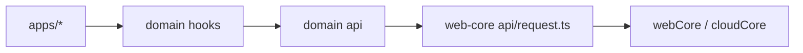

# Web Core API Infrastructure Spec

Date: 2026-06-18

## 목표

`libs/web-core`가 공통 API 인프라를 담당하고, `libs/users`, `libs/auth`, `libs/subscriptions`는 도메인 API만 담당하도록 경계를 정리한다.

핵심 원칙:

- `web-core`는 transport / endpoint / error helper만 가진다.
- 도메인 라이브러리는 실제 endpoint 함수와 도메인 주석을 가진다.
- hooks는 각 도메인 라이브러리에 남긴다.

## 배경

기존에는 각 도메인 라이브러리가 아래를 반복 구현하고 있었다.

- `webCore.buildRequest()`
- `webCore.buildSignedRequest()`
- `cloudCore.buildRequest()`
- `throwIfApiError()` 성격의 응답 검사
- `VITE_DOU_ENDPOINT`, `VITE_IAP_ENDPOINT` 직접 참조

이 구조는 API 위치는 도메인별로 유지되지만, transport 레벨 구현이 중복되고 규칙이 흩어진다.

## 설계

### `web-core` 책임

`libs/web-core/src/api/request.ts`

- `throwIfApiError()`
- `getCoreEndpoint()`
- `getDynamicDouEndpoint()`
- `getOAuthEndpoint()`
- `getIapEndpoint()`
- `executeRelayRequest()`
- `executeSignedRelayRequest()`
- `executeCloudRequest()`

### 도메인 라이브러리 책임

- `libs/users/src/api/*`
- `libs/auth/src/apis/index.ts`
- `libs/subscriptions/src/apis/index.ts`

각 도메인은 위 helper를 사용해 endpoint 함수만 정의한다.

## 계층 구조

## 구현 범위

이번 변경에서 포함:

1. `web-core` 공통 request helper 추가
2. `auth` API를 helper 기반으로 전환
3. `subscriptions` API를 helper 기반으로 전환
4. `users` API도 같은 helper를 사용하도록 정렬

이번 변경에서 제외:

- endpoint 함수를 `web-core`로 이동하는 작업
- hook 위치 변경
- app 레벨 import 경로 변경

## 기대 효과

- API 호출 규칙이 `web-core`에 집중된다.
- 도메인별 API는 endpoint 의미만 읽으면 된다.
- 이후 `auth`와 `subscriptions`도 `users`처럼 `api / hooks / types` 구조로 쪼개기 쉬워진다.

## 주의사항

- `web-core`는 절대 거대 endpoint 저장소가 되면 안 된다.
- `web-core`에는 도메인 API가 아니라 공통 infra만 추가한다.
- cross-domain orchestration은 계속 각 도메인 hook/service 계층에서 처리한다.
