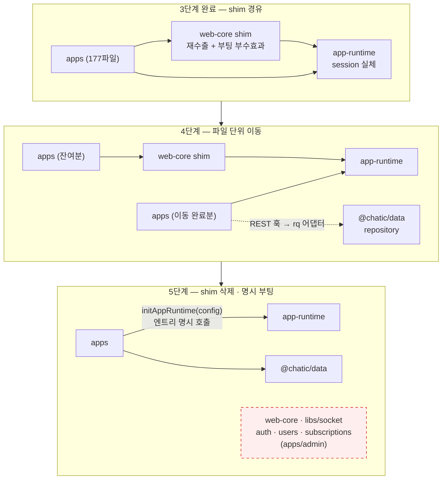
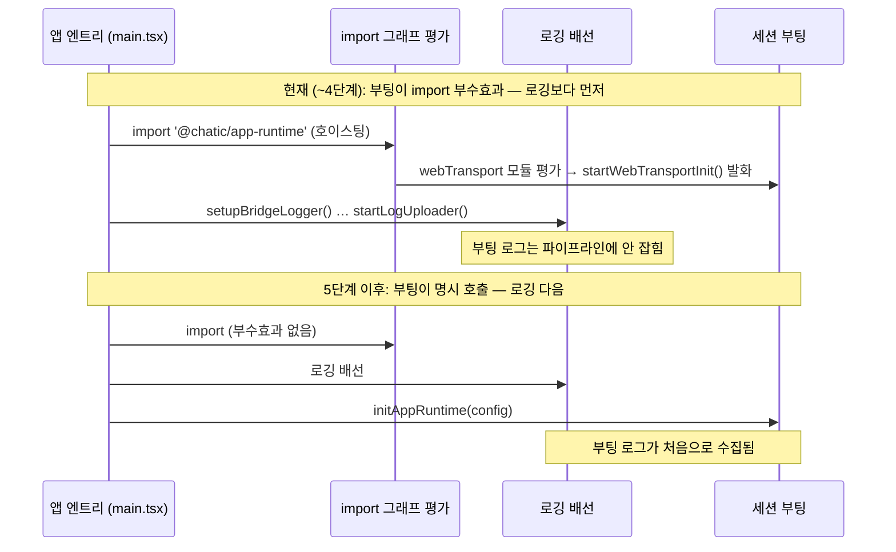

# ADR-0070 마이그레이션 — shim · 앱 이동 · 삭제 · 명시 부팅

> 상태: Live · 최종 갱신: 2026-08-27 · 관련 ADR: [ADR-0070](../adr/0070-app-runtime-session-hub.md) (결정 6·8, 4~5단계)

## 목적

ADR-0070의 결정 6(패키지 정리)·결정 8(마이그레이션 shim)과 단계 4·5 — **앱 177파일의 import
이동, 레거시 패키지 삭제, 암묵 부팅의 명시 전환** — 를 실행 가능한 절차로 고정한다.

1~3단계(신설 lib·세션 이관·shim 발행)의 설계는 각 lib 문서가 소유한다
([@chatic/http 1단계 설계](../../libs/http/docs/architecture.md) 등). 이 문서는 그 이후 —
**앱이 실제로 움직이는 구간**을 다룬다. 이 구간의 위험은 코드 난이도가 아니라 규모(앱 4개 ·
import 파일 177 + 테스트 목 35)와, desktop-web에 의도된 동작 변화가 함께 실리는 것이다.

## 원칙

1. **파일 단위로, 되돌릴 수 있게.** 이동의 최소 단위는 소스 파일 1개(+짝 테스트 파일)다.
   커밋도 그 단위(또는 소기능 묶음)로 쪼개, 어느 시점에서든 개별 revert가 가능해야 한다.
2. **빅뱅 금지.** shim이 있는 한 이동은 언제든 멈출 수 있다(ADR-0070 결정 8). "이번 주에 web
   전체"가 아니라 "오늘 이 폴더"가 계획의 단위다.
3. **shim에 새 심볼 추가 금지.** shim은 재수출 전용이다. 4단계 도중 새 기능이 필요하면
   `@chatic/app-runtime`에 추가하고 소비자는 처음부터 새 경로를 import한다.
4. **이동은 리팩토링이지 동작 변경이 아니다 — 단 예외는 명시 목록으로.** desktop-web의 동명 훅
   병합(§검증 방법의 QA 의도 변화 목록)과 부팅 시점 이동만이 허용된 동작 변화이고, 그 외는
   전부 회귀다.

## 범위

- **선행 조건: ADR-0070 1~3단계 완료.** 특히 3단계 종료 시점에 (a) `app-runtime/session`이
  완성되어 있고 (b) `@chatic/web-core`가 재수출 shim으로 전환되어 있으며 (c) 세션 테스트
  48케이스가 app-runtime에서 green이어야 한다. 이 문서의 어떤 절차도 그 전에 시작하지 않는다.
- **포함**: shim 계약과 그 검증, 앱별 import 이동 절차·순서, REST 훅 6개의 repository 이동
  (①안 — react-query 어댑터), 삭제 4종(`libs/socket` · 레거시 3 · shim)의 순서와 게이트,
  5단계 명시 부팅 전환, `apps/admin` 처리 추천안.
- **제외**: 각 lib의 내부 설계 — [@chatic/http](../../libs/http/docs/architecture.md)(1단계),
  `@chatic/db`·`http-data-sources`(2단계 문서, 작성 시 링크), `app-runtime/session`(3단계 문서,
  작성 시 링크). 기준선 계측은 **이 문서의 산출물이 아니라 3단계 착수 조건**이다 — 항목만
  §검증 방법 끝에 정리한다.

## 현재 실측

측정일 2026-08-27, 기준 브랜치 `claude/adr-0070-session-hub`(develop 기반). 모든 수치는 재현
명령을 병기한다. ADR 수치와 어긋나는 곳은 각주로 남긴다.

### 앱별 `@chatic/web-core` 소비 — import 177 + 언급-전용 35

```bash
grep -rl "from '@chatic/web-core'" apps/<app>/src | wc -l   # import 문
grep -rl "@chatic/web-core" apps/<app>/src | wc -l          # 언급 전체 (jest.mock 포함)
```

| 앱          | import 파일 | 언급-전용 파일¹ | 계  |
| ----------- | ----------- | --------------- | --- |
| web         | 110         | 27              | 137 |
| desktop-web | 47          | 7               | 54  |
| admin-v2    | 11          | 1               | 12  |
| testbed     | 9           | 0               | 9   |
| **계**      | **177**     | **35**          | 212 |

¹ `jest.mock('@chatic/web-core', …)` 등 import 문 없이 모듈 지정자만 참조하는 파일(대부분
테스트). **ADR의 177은 import 문 기준으로 정확하다.** 단 이동 시 교체 대상은 212파일이다 —
소스 파일을 옮길 때 짝 테스트의 `jest.mock` 경로도 같이 바꾸지 않으면 목이 빈 껍데기가 되어
테스트가 조용히 다른 것을 검증하게 된다.

참고: `app-runtime → web-core` 하향 import는 src 기준 **20파일**(언급 27)이다 — ADR 본문의
"32파일에서 하향 import"는 현 트리보다 크다². 이 20파일은 3단계 세션 이관에서 소멸하는
대상이므로 이 문서의 이동 대상이 아니다.

² `grep -rl "from '@chatic/web-core'" libs/app-runtime/src | wc -l` = 20. ADR 작성 시점
트리와의 차이 또는 dist·언급 포함 집계로 추정.

### 레거시 3 lib — "얇은 REST 래퍼"가 아니라 **순수 재수출 배럴**

실측이 ADR 결정 6의 서술("admin·desktop-web 전용 얇은 REST 래퍼, 소비자가 흡수 대상")과
다르다. 세 lib의 src 전체(auth 45줄 · users 26줄+apis · subscriptions 48줄)에 **자체 구현이 한
줄도 없다** — 전부 `export { … } from '@chatic/web-core'`다. 즉 흡수할 코드가 없고, 이 셋은
web-core의 **기성 shim**이다. 삭제 = 소비자 import를 새 표면으로 재지정하는 것뿐이며, 4단계
앱 이동과 같은 작업의 특수 케이스다.

소비자 전수 (grep 재현: `grep -rl "@chatic/auth['\"]" apps libs` 등, 자기 자신 제외):

| lib                     | 소비자                                                                                        | admin 제외 시 |
| ----------------------- | --------------------------------------------------------------------------------------------- | ------------- |
| `@chatic/auth`          | apps/admin 2파일 (`UsersPage.tsx` · `RegisterUserDialog.tsx`)                                 | **0**         |
| `@chatic/users`         | apps/admin 2파일 (`UsersPage.tsx` · `UserSelectDialog.tsx`) + desktop-web `useInviteLogin.ts` | desktop-web 1 |
| `@chatic/subscriptions` | desktop-web `useRemoveCloud.ts`                                                               | desktop-web 1 |

**apps/admin을 삭제하면(아래 추천안) 레거시 3의 잔여 소비자는 desktop-web 2파일이다.**

### `libs/socket` — 죽음 재확인, 단 `apps/admin`이 물고 있다

- 죽음 확인: `useInitWebSocket.ts`가 존재하지 않는 심볼 `useWebCoreStore`를 3곳에서 참조한다
  (5행 import · 56행 · 108행). 이 심볼은 리포 전체에 정의가 없다(전수 grep). web-core import는
  2파일(`useInitWebSocket.ts` · `useWebSocketV2.ts`) — ADR 서술과 일치.
- **ADR이 언급하지 않은 사실: `@chatic/socket`의 소비자가 있다 — apps/admin 10파일**
  (socket-test · pointer-test · auth-test 피처). 소비자 전원이 이미 깨진 앱 안에 있으므로
  "죽은 lib"이라는 판정 자체는 유지되지만, **"1단계부터 언제든 선행 삭제 가능"은 apps/admin
  처리와 결합된 결정이 된다** — admin을 지우(거나 socket-test 피처를 들어내)기 전에는
  `libs/socket` 삭제가 admin의 깨짐을 추가로 넓힌다(이미 안 붙는 앱이라 실해는 없다).

### `apps/admin` — 이미 깨져 있음 (5단계 결정 대상)

- ts/tsx 103파일. `useWebCoreStore` import 5파일(`OAuthResponsePage` · `LogoutPage` ·
  `DashboardPage` · `AdminTopBar` · `AuthGuard`) — 심볼 미정의로 **타입체크·빌드 불가**.
- web-core import 15파일 · `@chatic/socket` 10파일 · `@chatic/auth` 2 · `@chatic/users` 2 ·
  `@chatic/app-runtime` **0**.
- 마지막 커밋은 2026-08-12의 리포 광역 빌드 커밋 — 전용 기능 커밋이 아니다. 사실상 방치 상태.

### REST 훅 6개 — 소비처 실측 (테스트·재수출 배럴 제외, web-core 직접 import 기준)

ADR 맥락 절의 수치(18 · 22 · 8 · 6 · 4 · 2)는 과다 계상이다³. 이 표가 4단계 작업량의 기준이다.

| 훅                               | 실측 | 소비 파일                                                                                                                                                                                                                                                                                                                |
| -------------------------------- | ---- | ------------------------------------------------------------------------------------------------------------------------------------------------------------------------------------------------------------------------------------------------------------------------------------------------------------------------ |
| `useCloudSessionCatalog`         | 13   | web 9 (`HomePage` · `MyPage` · `CloudSessionSheet` · `CloudPushMarkRunner` · `useReconcileInvitedClouds` · `useGlobalSearch` · `useInvitedClouds` · `useOtherCloudUnread` · `useActiveCloudOwnership`) · desktop-web 3 (`useClouds.ts` 래퍼 · `useInvitedCloudRecovery` · `useRemoveCloud`) · testbed 1 (`ChatHomePage`) |
| `useClouds`                      | 5    | web 5 (`useCloudQuota` · `useExcessClouds` · `useUnboundClouds` · `useCloudEmailGuard` · `CloudManagePage`) — desktop-web은 자체 래퍼(`shared/hooks/useClouds.ts`, 내용은 catalog 기반)를 쓴다                                                                                                                           |
| `useRegisterDeviceTokenMutation` | 3    | web `usePushRegistration` · desktop-web `useDeviceTokenRegistration` · **app-runtime** `push/useDeviceTokenRegistration`(lib 내부 — 3단계 이관에서 함께 처리)                                                                                                                                                            |
| `useVerifyEmail`                 | 1    | web `useVerifyEmailCode`                                                                                                                                                                                                                                                                                                 |
| `useUsers`                       | 2    | **apps/admin 전용** (`UsersPage` 직접 + `UserSelectDialog`가 `@chatic/users` 경유) — admin 삭제 시 **이동이 아니라 삭제 후보**                                                                                                                                                                                           |
| `useVerifyNativeAppToken`        | 0    | 소비처 없음 (`libs/users` 재수출 배럴뿐) — **이동이 아니라 삭제 후보**                                                                                                                                                                                                                                                   |

³ 재현: `grep -rln "<훅명>" apps libs --include="*.ts*"` 후 dist·테스트·재수출 배럴 제외, 실제
import 문 확인. 참고로 web-core에는 동명이인 `useRegisterDeviceToken`(hooks/app)과
`useRegisterDeviceTokenMutation`(hooks/user)이 **둘 다** 있다 — 집계·이동 시 혼동 주의.

### 엔트리 초기화 순서 — "로깅이 먼저" 계약은 현재 **모듈 수준에서 성립하지 않는다**

세션 부팅은 [webTransport.ts:227](../../libs/web-core/src/transport/webTransport.ts)의
`startWebTransportInit()` 모듈 로드 자기 호출이다. ESM 정적 import는 호이스팅되어 **엔트리
본문보다 먼저** 평가되므로, 네 앱 모두에서 부팅은 main 본문의 어떤 문장보다도 먼저 발화한다:

| 앱          | 엔트리 실측                                                                                                                                                                                                    | 부팅 발화 경로                                                                                                                         |
| ----------- | -------------------------------------------------------------------------------------------------------------------------------------------------------------------------------------------------------------- | -------------------------------------------------------------------------------------------------------------------------------------- |
| web         | [main.tsx](../../apps/web/src/main.tsx) 본문 28~48행이 로깅 배선(`setupBridgeLogger` → `attachConsoleListener` → `attachLogContext` → `startLogUploader`), 63행 `configureDataRuntime`, 102행 브릿지 handshake | 8행 `import '@chatic/app-runtime'` 평가 → (하향 20파일 중 하나) → web-core 배럴 `export * from './transport'` → webTransport 평가·발화 |
| desktop-web | main.tsx 본문 16행 `configureDataRuntime`(chat 캐시 1000 제한) 외 없음                                                                                                                                         | 5행 `import '@chatic/app-runtime'` — 동일                                                                                              |
| admin-v2    | 본문 없음 (render뿐)                                                                                                                                                                                           | `import App` 그래프의 web-core 11파일                                                                                                  |
| testbed     | 본문 없음 (render뿐)                                                                                                                                                                                           | `import App` 그래프의 web-core 9파일                                                                                                   |

즉 apps/web에서 **로깅 배선은 부팅 발화보다 항상 늦다.** 부팅의 본체(`initWebTransportSealed`)
가 비동기라 저장소 읽기·크레덴셜 재구성은 마이크로태스크 이후에 완료되지만, 동기 부분
(`WebCoreFactory.create` — env 읽기·스토리지 선택, webTransport.ts:151)과 발화 자체는 로깅 전
이다. **5단계 명시 부팅은 이 순서를 깨는 것이 아니라, 처음으로 지킬 수 있게 만드는 변경이다.**

부팅을 명시적으로 기다리는 기존 소비자(전환 시 새 API로 재지정 대상):

- desktop-web 로그인 훅 3개 — `useGuestLogin` · `useSocialLogin` · `useInviteLogin`이
  `await startWebCoreInit()` 호출
- `web-core/session/services.ts:127` — 로그인 서비스 내부 (3단계에서 app-runtime으로 이관됨)

`startWebTransportInit`은 `initDone`+`pendingInit`으로 이미 idempotent·single-flight다 —
새 `initAppRuntime`도 이 계약을 유지해야 로그인 훅의 명시 호출과 엔트리 호출이 공존한다.

## 이동 시나리오

### shim 계약 — 4단계 진입 조건

3단계가 발행하는 shim(`@chatic/web-core`)은 다음을 만족해야 하며, 이것이 4단계 착수 게이트다:

1. **재수출 전용.** src에 `export { … } from '@chatic/app-runtime'`(또는 `@chatic/data` 등 새
   위치) 문장과 아래 2의 부수효과 모듈 외에 구현이 없다. 검증:
   `grep -rn "export \(const\|function\|class\)" libs/web-core/src` 가 부수효과 모듈 허용 목록
   외 0건.
2. **부팅 부수효과 유지 — 단 동일 함수 위임으로.** 앱이 shim을 import하는 동안(3~4단계) 세션
   부팅은 여전히 shim의 모듈 로드 부수효과여야 한다(webTransport.ts:227의 현재 역할). 이때
   shim의 부수효과는 **app-runtime이 소유한 부팅 함수(가칭 `bootAppRuntime`)를 그대로 호출**
   해야 한다 — 구현을 복제하면 3단계가 없앤 이중 엔진이 shim 안에서 부활한다. 5단계의 명시
   전환은 "이 호출의 위치가 shim 모듈 로드에서 앱 엔트리로 옮겨진다"로 서술된다.
3. **새 심볼 추가 금지.** shim의 재수출 목록은 3단계 발행 시점에 동결된다. 이 목록 자체가
   **심볼 → 새 위치 매핑의 SSOT**다 — 4단계의 파일 이동은 "shim에서 이 심볼을 찾아, 재수출
   원본 경로로 import를 바꾼다"로 기계적으로 수행된다.
4. **소비자 0이면 삭제**(5단계, 아래 삭제 순서).

### 파일 하나를 옮기는 절차

```
[1] 대상 선정   grep -rln "from '@chatic/web-core'" apps/<app>/src | head -1 (또는 폴더 단위 묶음)
[2] 심볼 분류   그 파일이 가져오는 심볼을 shim 재수출 목록에서 찾아 새 경로 확인
                 · 세션 상태·훅·서비스        → @chatic/app-runtime
                 · REST 훅 6개                → 앱 레벨 react-query 어댑터 (아래 별도 절차)
                 · 도메인 타입                → @chatic/data (이미 그쪽이 원본인 것)
[3] 교체        import 경로 변경 — 심볼명은 불변 (shim이 이름을 보존하므로 rename 없음)
[4] 짝 테스트   같은 이름 .test/.spec 파일의 jest.mock('@chatic/web-core') 경로도 교체
[5] 검증        해당 앱 typecheck + 그 파일의 테스트 (web은 apps/web만 검사하는 우회 사용⁴)
[6] 커밋        파일(묶음) 단위 — 되돌림은 이 커밋의 revert 하나
```

⁴ 리포 실측 함정 둘: libs에서 `tsc --noEmit`은 0건 검사 no-op이므로 lib 검증은
`tsc -b tsconfig.lib.json`으로, web 타입체크는 libs/data의 TS6305에 막히므로 apps/web만
검사하는 우회를 쓴다. lib 물리 이동 직후 유령 에러가 나면 `dist/`·`out-tsc/` 강제 삭제 후
재빌드(ADR-0070 §감수하는 것).

**동명 훅 병합 파일은 예외적으로 [3]에서 동작이 바뀐다** — desktop-web `PlaceRail.tsx`
(`useSessionLogout`)와 `useCloudSwitchFlow.ts`(`useLogoutCloudSession`)는 import 교체 순간
web-core 판(스토어 teardown만)에서 runtime 판(소켓 통지 후 teardown)으로 바뀐다. 이 두 파일은
§검증 방법의 QA 의도 변화 목록과 함께 별도 커밋으로 묶고, 커밋 메시지에 동작 변화를 명기한다.

### 앱 순서 — testbed → admin-v2 → web → desktop-web

| 순서 | 앱          | 파일 수 | 근거                                                                                                                                                                      |
| ---- | ----------- | ------- | ------------------------------------------------------------------------------------------------------------------------------------------------------------------------- |
| 1    | testbed     | 9       | 내부 도구·사용자 0. shim→직접 경로 전환의 절차 리허설. 실패해도 배포 영향 없음                                                                                            |
| 2    | admin-v2    | 11+1    | 작고 세션 경로가 명확(ProtectedRoute·useRelaySessionGuard — spec 동반). **세션 훅 밀도가 가장 높아** 3단계 이관의 세션 표면을 조기 검증하는 카나리아                      |
| 3    | web         | 110+27  | 최대 규모지만 테스트 커버리지가 가장 두텁고 게스트 부팅으로 로그인 없이 검증 가능(리포 기존 검증 요령). 폴더(피처) 단위로 수 회에 나눠 진행                               |
| 4    | desktop-web | 47+7    | **의도된 동작 변화가 실리는 유일한 앱** — 동명 훅 병합. runtime 판 훅이 web에서 이미 오래 구워진 뒤(순서 3 완료 후)에 옮겨야 병합 리스크가 최소가 된다. QA 목록 동반 필수 |

진행률 추적은 게이트 grep 그대로 쓴다:

```bash
for app in testbed admin-v2 web desktop-web; do
  printf "%-12s import:%3d  mentions:%3d\n" $app \
    $(grep -rl "from '@chatic/web-core'" apps/$app/src 2>/dev/null | wc -l) \
    $(grep -rl "@chatic/web-core" apps/$app/src 2>/dev/null | wc -l)
done
```

두 수치 모두 0이 그 앱의 완료 정의다 (import만 0이면 jest.mock 잔재가 남은 것).

### REST 훅 6개 → repository 뒤로 (①안 — react-query 어댑터, 의미론 보존)

ADR 결정 5의 ①안을 따른다: repository는 데이터 소스, react-query가 앱 레벨 캐시.
**staleTime·중복 제거·invalidate 키·refetch-on-focus 동작이 이동 전후 동일해야 한다** — 특히
`useClouds`의 `refetchOnMount: 'always'` 같은 옵션은 어댑터가 그대로 보존한다.

훅별 처리와 난이도 (실측 소비처 기준):

| 훅                               | 소비 | 처리                                                                                                     | 난이도                                                                                      |
| -------------------------------- | ---- | -------------------------------------------------------------------------------------------------------- | ------------------------------------------------------------------------------------------- |
| `useVerifyNativeAppToken`        | 0    | **삭제** — 4단계에서 shim 재수출 목록과 함께 제거 (이동 대상 아님)                                       | 없음                                                                                        |
| `useUsers`                       | 2    | apps/admin 전용 — admin 삭제(추천안) 시 **삭제**, 흡수 시 admin-v2로 이동                                | admin 결정에 종속                                                                           |
| `useVerifyEmail`                 | 1    | 어댑터 훅 1개 신설, `useVerifyEmailCode` 1파일 교체                                                      | 하                                                                                          |
| `useRegisterDeviceTokenMutation` | 3    | mutation 어댑터 신설. app-runtime 내부 소비자(`push/useDeviceTokenRegistration`)는 3단계 이관에서 선처리 | 하 — 단 동명이인 `useRegisterDeviceToken`(hooks/app)과 분리 확인                            |
| `useClouds`                      | 5    | 조회 어댑터 신설 (web 5파일). desktop-web은 자체 래퍼가 이미 완충층이라 무변경                           | 중 — 구독 quota·email guard 등 파생 훅 4개가 물려 있어 캐시 키 보존 필수                    |
| `useCloudSessionCatalog`         | 13   | 조회 어댑터 신설, 3앱 13파일 교체. 홈 화면·글로벌 검색·클라우드 전환이 전부 이 훅 위에 있다              | **상** — 4단계 안에서도 마지막 순서로, 앱 순서(testbed→…)와 직교하게 훅 단위 일괄 커밋 권장 |

어댑터의 위치는 ①안의 정의상 **앱 레벨**(각 앱 `shared/hooks` 또는 웹 공용이면
app-runtime의 react-query 어댑터 폴더)이다 — `@chatic/data`에 react-query가 들어가면 leaf가
깨진다(ADR 결정 5). 정확한 배치는 2단계 http-data-source 문서가 확정한다.

> **완료 (2026-09-01).** 4단계는 위 괄호의 **두 번째** 갈래로 착지했다 —
> `app-runtime/src/data/hooks/`. 그 뒤 다시 **첫 번째** 갈래로 옮겼다: 소비처를 앱별로 세어 보니
> 실제로 두 앱 이상이 쓰는 심볼은 catalog 계열 넷뿐이었고, 그 넷조차 각 앱이 자기 캐시 정책을
> 갖는 편이 맞았다. 최종 배치는 §완료 기록 참고.

### 5단계 — 명시 부팅 전환

전환의 내용: 각 앱 엔트리가 `initAppRuntime(config)`를 명시 호출하고, shim의 모듈 로드
부수효과(위 shim 계약 2)를 제거한다.

**전환 순서가 안전의 전부다** — 앱별로:

1. 그 앱의 shim import가 0임을 확인한다(진행률 grep). shim import가 남아 있으면 부수효과
   부팅이 아직 그래프에 있으므로 명시 호출 추가는 이중 발화다(idempotent라 무해하지만, 제거
   시점 판단을 흐린다).
2. 엔트리에 `initAppRuntime(config)`를 추가한다. 위치 계약:
    - **로깅·브릿지 배선 이후, 세션의 첫 소비 이전.** apps/web 기준으로 48행
      (`startLogUploader`) 이후 · 63행(`configureDataRuntime`) 부근 · render 이전.
      이로써 부팅 로그가 처음으로 로그 파이프라인에 잡힌다 — 현재는 잡히지 않는 순서다(§실측).
    - desktop-web은 `configureDataRuntime` 다음 줄. admin-v2·testbed는 본문 첫 문장.
    - config 인자는 결정 1의 env 주입 계약을 따른다 — 엔트리가 `import.meta.env`를 읽어 값으로
      넘긴다(엔트리는 이미 그렇게 하고 있다, apps/web main.tsx 29·44·47행).
3. 앱별 확인 절차 (전환 커밋마다):
    - **순서 계약**: 엔트리 본문에서 `initAppRuntime` 호출이 로깅 배선보다 뒤인지 육안 + 부팅
      로그가 업로더 큐에 잡히는지 실행 확인.
    - **모듈 스코프 세션 읽기 부재**: `grep -rn "hasStoredRelaySession\|isStoredSessionExpired"`
      소비처 중 모듈 스코프(함수 밖) 호출이 없는지 — 있으면 그 파일은 명시 부팅 이전에 평가되어
      빈 세션을 본다.
    - **명시 대기자 재지정**: desktop-web 로그인 훅 3개의 `await startWebCoreInit()`이 새 부팅
      API의 대기 표면(가칭 `awaitAppRuntimeReady`)으로 바뀌었는지.
    - **첫 렌더 게이트**: 부팅이 main 본문으로 늦춰지므로, 라우트 가드가 "부팅 완료 전 = 비로그인"
      으로 오판하지 않는지 — 게스트/복귀 사용자 두 시나리오로 콜드 스타트 확인.
4. 네 앱 모두 전환 완료 후에만 shim의 부수효과 모듈과 shim 자체를 삭제한다(아래).

### 삭제 순서 — 각각의 게이트 grep

| 순서 | 대상                                      | 선행 조건                                                                                   | 삭제 전 게이트 (0이어야 함)                                                                                                |
| ---- | ----------------------------------------- | ------------------------------------------------------------------------------------------- | -------------------------------------------------------------------------------------------------------------------------- |
| 0    | `apps/admin` (추천안 채택 시)             | 아래 추천안의 결정                                                                          | 없음 — 이미 빌드 불가 상태의 제거                                                                                          |
| 1    | `libs/socket`                             | apps/admin 결정 (유일 소비자 — §실측)                                                       | `grep -rl "@chatic/socket" apps libs \| grep -v "^libs/socket/"`                                                           |
| 2    | 레거시 3 (`auth`·`users`·`subscriptions`) | desktop-web 2파일(`useInviteLogin`·`useRemoveCloud`) 재지정 — 4단계 desktop-web 이동에 포함 | `grep -rl "@chatic/\(auth\|users\|subscriptions\)['\"]" apps libs` (자기 자신 제외)                                        |
| 3    | `web-core` shim                           | 4단계 완료(177+35 전부) + 5단계 명시 부팅 전환 완료                                         | `grep -rl "@chatic/web-core" apps libs \| grep -v "^libs/web-core/"` — **import가 아니라 언급 기준** (jest.mock 잔재 방지) |

삭제 커밋 공통 절차: 게이트 grep 0 확인 → `tsconfig.base.json` path 제거 → lib 폴더 삭제 →
`dist/`·`out-tsc/` 강제 삭제 후 전체 재빌드(stale dist 함정) → 전 앱 typecheck·테스트.

ADR의 "libs/socket은 1단계부터 선행 삭제 가능"은 실측 보정이 필요하다: **apps/admin 결정이
먼저다.** admin 삭제를 채택하면 1단계 언제든 함께 지울 수 있고, 채택하지 않으면 admin의
socket-test 피처 3개를 먼저 들어내야 한다.

### `apps/admin` 처리 — 추천: **삭제** (ADR 열린 질문 3)

실측 근거:

- **이미 빌드 불가**: `useWebCoreStore` 5파일이 미정의 심볼 import — 어떤 선택지든 "현상 유지"
  는 없다.
- **방치 상태**: 마지막 커밋이 광역 빌드 커밋(2026-08-12), 전용 기능 커밋 아님.
  `@chatic/app-runtime` 소비 0 — 신 런타임에 편입된 적이 없다.
- **후계가 있다**: admin-v2가 인증 게이트(ProtectedRoute의 role 게이트 + useRelaySessionGuard)
  와 socket-lab을 이미 갖고 있다. admin의 socket-test·pointer-test·auth-test는 실험 피처다.
- **삭제가 다른 삭제를 푼다**: `libs/socket`(유일 소비자)·`@chatic/auth`(유일 소비자)·
  `useUsers` 훅(유일 소비처)이 함께 정리되고, `@chatic/users` 흡수도 desktop-web 1파일로 준다.

유일한 확인 사항: admin에만 있는 사용자 관리 화면(`UsersPage` — 목록·등록)이 운영에서 아직
필요한지. 필요하면 **admin-v2 흡수**(선택지 2)로 격하하되, 그 경우에도 화면 2개
(`UsersPage`·`UserSelectDialog`)만 admin-v2 컨벤션으로 재작성하는 것이지 앱을 살리는 것이
아니다. relay 인증 복제(선택지 3)는 세션 창구를 하나로 만드는 이 ADR의 방향과 정면 충돌이라
기각한다.

## 다이어그램

단계별 의존 그래프 변화. (3단계 완료 = 좌측, 4단계 진행 중 = 중앙이 파일 단위로 우측으로 흘러감)



부팅 발화 시점의 이동 (5단계의 핵심 변화):



## 검증 방법

- **앱별 grep 게이트**: §이동 시나리오의 진행률 스크립트. 완료 정의는 import·언급 모두 0.
- **삭제 게이트**: §삭제 순서의 표 — 각 삭제 커밋 직전에 0 확인, 직후 stale dist 삭제·재빌드.
- **파일 이동 검증**: 파일(묶음) 커밋마다 해당 앱 typecheck(각주 4의 우회 포함)와 짝 테스트.
  web은 게스트 부팅 실행 확인을 폴더 묶음마다 1회.
- **shim 동결 검증**: 4단계 기간 CI에
  `grep -rn "export \(const\|function\|class\)" libs/web-core/src` 허용 목록 대조 — shim에 새
  심볼·새 구현이 들어오면 실패.
- **명시 부팅 검증**: §5단계의 앱별 확인 절차 4항목. 특히 콜드 스타트 2시나리오
  (게스트/복귀 사용자)는 앱마다 전환 커밋에서 반복한다.

### QA 의도 변화 목록 — desktop-web (초안, 4단계 착수 시 확정)

ADR §감수하는 것이 요구하는 목록의 초안이다. QA 기준은 "이전과 동일"이 아니라 **아래 변화가
일어나는지**다:

| #   | 파일·훅                                           | 이전 (web-core 판)  | 이후 (runtime 판)                                                            | QA 확인 방법                                                                                                 |
| --- | ------------------------------------------------- | ------------------- | ---------------------------------------------------------------------------- | ------------------------------------------------------------------------------------------------------------ |
| 1   | `PlaceRail.tsx` — `useSessionLogout`              | 스토어 teardown만   | 소켓 `auth.logout` 통지 **후** teardown                                      | 로그아웃 후 서버 세션 목록에서 해당 디바이스 세션이 사라지는지 · 통지 실패 시에도 로컬 teardown이 완료되는지 |
| 2   | `useCloudSwitchFlow.ts` — `useLogoutCloudSession` | 스토어만 지움       | 소켓 통지 판                                                                 | 클라우드 이탈이 서버에 기록되는지 · 이탈 직후 다른 기기의 카탈로그에 반영되는지                              |
| 3   | `useSiteSwitch`                                   | —                   | **변화 없음** — desktop-web은 이미 runtime 판 사용(`useSelectPlace.ts` 실측) | 회귀 기준으로만 확인                                                                                         |
| 4   | 부팅 시점 (5단계)                                 | import 평가 중 발화 | 엔트리 본문에서 명시 발화(로깅 이후)                                         | 콜드 스타트에서 복귀 사용자가 로그인 화면으로 튕기지 않는지 (첫 렌더 게이트)                                 |
| 5   | REST 훅 (①안)                                     | react-query 직접    | 어댑터 경유 — **의미론 보존이 목표**                                         | 변화가 없어야 함: refetch-on-focus·invalidate 동작이 이전과 동일한지가 합격 기준                             |

1·2는 서버 배포 상태에 따라 관측이 달라질 수 있으므로, QA 시나리오에 서버 버전 전제를 명기한다.

### 기준선 계측 — 이 문서의 산출물이 아니라 **3단계 착수 조건**

ADR이 3단계 배포 전후 비교를 요구하는 항목. 트리거 심기는 3단계 계획의 선행 작업이며, 여기는
항목 정리만 남긴다:

| 지표                  | 심을 위치 (현 코드 기준)                                                         | 비교 방법                   |
| --------------------- | -------------------------------------------------------------------------------- | --------------------------- |
| 서명 403율            | `web-core/transport/error.ts`의 403 분류 분기 (이관 후 `@chatic/http/error`)     | 3단계 배포 전후 주간 발생률 |
| relay refresh 발화 수 | AuthController 배선의 refresh 트리거 (app-runtime socket auth)                   | 세션당 발화 횟수 분포       |
| 비자발 재로그인       | `handleAuthError`의 로그아웃 리다이렉트 경로 (이관 후 `onAuthFailure` 포트 구현) | 사용자당 발생 건수          |

---

## 실행 결과 (2026-08-31)

계획대로 testbed → admin-v2 → web → desktop-web 순으로 진행했고, 4·5단계가 모두 끝났다.
앱의 `@chatic/web-core` import 0 → 패키지 삭제까지 도달했다. 최종 상태와 남은 항목은
[ADR-0070 §구현 결과](../adr/0070-app-runtime-session-hub.md)에 있다.

**계획과 달랐던 것:**

- **`apps/admin`은 삭제하되 UsersPage는 admin-v2로 이식**했다(추천안의 격하 선택지). 다만
  옮긴 것은 목록·등록뿐이다 — 토큰 발급 액션은 소스에 하드코딩된 비밀번호 해시로 대상 사용자로
  로그인하는 동작이었고, 뒤를 받치던 `useIssueToken`이 리포에 정의가 없어 최종 상태에서 동작할
  수도 없었다. 되살리려면 그 공용 자격증명을 새 앱에 심어야 해서 옮기지 않았다.
- **`libs/subscriptions`는 4단계에 먼저 지워졌다** — 구독 훅을 허브로 옮기는 김에 함께.
- **shim 계약 1(재수출 전용)은 끝까지 만족되지 않았다.** web-core의 api·transport 구현이
  마지막까지 남았는데, 그건 소비자가 `apps/admin` 하나뿐이었기 때문이다. admin 삭제로 소비자가
  0이 되면서 shim으로 좁히는 단계 없이 패키지째 삭제됐다.
- **명시 부팅 전환**은 앱 엔트리가 아니라 leaf(`@chatic/web-config`)로 수렴했다 — ADR §구현 결과.

## 완료 기록 — REST 훅의 최종 배치 (2026-09-01)

`data/hooks`의 13심볼 중 12개가 앱으로 내려갔다. 판정 기준은 두 개였다: **소비자가 앱 화면
뿐인가**, 그리고 **repository 경로가 이미 있는가**. 둘 다 참이면 앱 레이어가 옳은 자리다 —
react-query가 그 읽기의 캐시 전부이고, 캐시 정책은 그리는 앱의 것이다.

| 심볼                                                              | 최종 위치                                                                                                                                   |
| ----------------------------------------------------------------- | ------------------------------------------------------------------------------------------------------------------------------------------- |
| `useClouds` · `useCloudSessionCatalog`                            | 앱별 사본 3개 (web `app/hooks/useCloudCatalog.ts` · desktop-web `shared/hooks/useCloudCatalog.ts` · testbed `app/hooks/useCloudCatalog.ts`) |
| `useMembershipInfo` · `useProductPlans` · `useValidateMembership` | apps/web `app/hooks/useMembership.ts`                                                                                                       |
| `useMakeCloud`                                                    | apps/web `features/subscription/hooks/useAddCloud.ts` (유일 호출부)                                                                         |
| `useVerifyEmail`                                                  | apps/web `features/subscription/hooks/useVerifyEmailCode.ts` (유일 호출부)                                                                  |
| `useDeleteCloud`                                                  | apps/web `features/mypage/hooks/useDeleteCloud.ts` · desktop-web `useRemoveCloud.ts`로 흡수                                                 |
| `useUsers` · `usersKeys`                                          | apps/admin-v2 `features/users/api/usersQuery.ts`                                                                                            |
| `tryFetchProfile`                                                 | apps/admin-v2 `components/ProtectedRoute.tsx` (그 화면의 null 정책)                                                                         |
| `subscriptionKeys` · `productPlansKeys`                           | apps/web `app/hooks/queryKeys.ts`                                                                                                           |
| **`useRegisterDeviceTokenMutation`**                              | **잔류** — 런타임 자신이 부른다(`push/useDeviceTokenRegistration` · `session/hooks/app/useRegisterDeviceToken`)                             |
| **`cloudsKeys`**                                                  | **잔류** — `session/hooks/auth/useLogin`이 로그인 직후 무효화한다                                                                           |

catalog 사본 3개는 의도된 중복이다. 공유되는 것은 repository 호출과 `cloudsKeys`(런타임이
무효화하는 키)이고, staleness 정책은 각 앱이 갈라질 자유를 갖는다.

**읽기 모델은 ①안이 아니라 ②안으로 착지했다.** repository는 `DomainListResult<T>`(`{list, meta}`)를
주는데 게이트웨이 뷰는 `{list, total}`이었다. 실제로 걸린 곳은 두 군데뿐이다 —
admin-v2 `UsersPage`의 `data.total` → `data.meta.total`, apps/web `CloudManagePage`의
낙관적 `setQueryData`의 `total` → `meta.total`. 나머지 소비처는 전부 `data.list`만 읽는다.
`DomainCloud`/`DomainUser`는 뷰의 초집합(`{...api}` 스프레드)이라 필드 읽기는 무변경이다.

**`params` 누락 하나를 고쳤다.** `ICloudRepositoryV2.makeCloud`/`releaseCloud`가 게이트웨이의
`params`를 받지 않아서, 그대로 옮기면 dev 드라이런(`dryRun: 1`, ADR-0060 §7)과 클라우드 삭제의
`cascade: 1`이 **조용히 사라질** 뻔했다. 두 메서드에 이름 있는 옵션(`CloudMakeOptions`·
`CloudReleaseOptions`)을 붙였다 — 와이어의 `1` 인코딩은 `CloudHttpDataSource`에 남으므로 앱은
릴레이가 그걸 어떻게 쓰는지 모른다.
