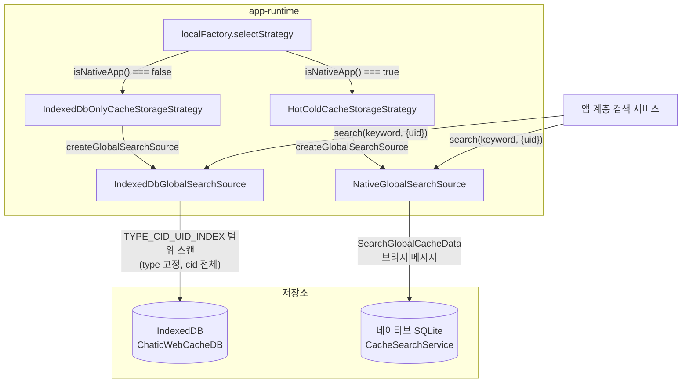
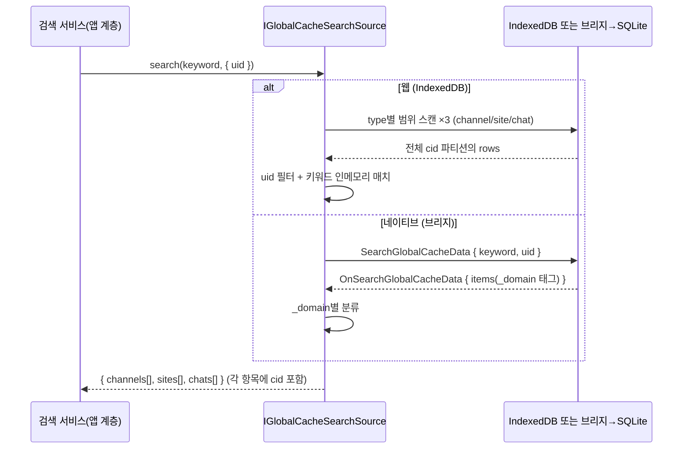
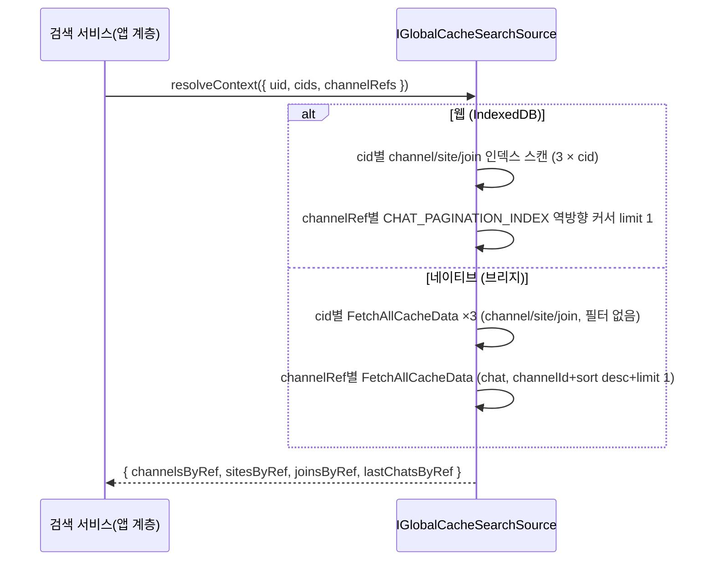

# 전역 캐시 검색 계약 (Global Cache Search)

> 상태: Live · 최종 갱신: 2026-08-06 · 관련 ADR: [[ADR-0033]](../../adr/0033-local-global-search.md)

## 목적

로컬 캐시(웹 IndexedDB / 네이티브 SQLite)에 저장된 채널·플레이스(site)·채팅
메시지를 **클라우드(cid) 불문 키워드로 검색**하고, 그 결과를 화면에 그리는 데
필요한 **주변 컨텍스트(소속 채널·플레이스, 내 읽음 커서, 최신 메시지)를 같은
경로로 읽어오는** 스토리지 계층 계약을 정의한다. 서버 검색 API 없이
오프라인에서도 즉답하는 검색의 데이터 기반이며, apps/web 검색
페이지([[web-search-page]](../search/web-search-page.md))가 소비한다.

기존 CRUD 경로(`observeList`/`cacheReadList`)는 전역 `DataContextHolder`의
활성 cid 파티션만 읽으므로 크로스 클라우드 검색에 쓸 수 없다 — 이 계약은
그 옆에 신설하는 **읽기 전용 별도 경로**다. 리포지토리의
`LocalDataSourceV2ContextOverride`는 이 용도로 쓸 수 없다: `cacheRead`는
오버라이드를 무시하고(`ChannelLocalDataSourceV2.ts:39`), `cacheReadList`는
오버라이드를 sid 필터링에만 쓰며 `loadAll()` 자체는 여전히 활성 cid
파티션을 읽는다(`ChannelLocalDataSourceV2.ts:53`). 즉 기존 오버라이드는
cid 오버라이드가 아니라 **sid 오버라이드**다.

## 설계 원칙

- **어댑터 동작 동일성**: 웹(IndexedDB)과 네이티브(SQLite)의 검색 기대
  로직은 동일해야 한다. 기준 시맨틱은 이미 배포된 네이티브 구현
  (`CacheSearchService` + SQLite `LIKE`)이며, 웹 구현이 이를 따른다.
  시맨틱 변경은 반드시 양쪽에 함께 적용하고 공유 계약 테스트로 강제한다.
- **읽기 전용**: 이 경로는 캐시를 절대 변경하지 않는다. 기존 CRUD/sync
  경로(어댑터의 `save/loadAll/...`, `DynamicCacheStorage` 정책)도 건드리지
  않는다.
- **상한과 정렬·그룹핑은 상위 계층에서**: 어댑터/소스는 "매치 전부"를
  반환하고, 표시용 상한·정렬·그룹핑은 앱 계층 검색 서비스가 담당한다.
  (네이티브 브리지 페이로드에 limit이 없으므로, 어댑터 레벨에 상한을 두면
  양쪽 동작이 어긋난다.)
- **신선도 미보장 수용**: 비활성 클라우드 파티션은 stale일 수 있다.
  이 계약은 "로컬에 있는 것"을 반환할 뿐 최신성을 약속하지 않는다. 파생
  값(안읽음 수 등)도 같은 성격이다 — "마지막 동기화 시점 기준"이 사양이다.
- **컨텍스트 조회도 이 경로로만**: 검색 결과 행을 그리는 데 필요한 주변
  데이터(소속 채널/플레이스, 내 join, 최신 chat)는 리포지토리로 가져올 수
  없다(위 "목적" 참조). 그래서 이 계약에 `resolveContext`를 함께 두고,
  **앱 계층은 검색 결과 렌더링에 리포지토리·sync 훅을 절대 쓰지 않는다.**
- **명시적 cid 인자, 공유 컨텍스트 변경 금지**: cid는 항상 호출 인자로
  받는다. 공유 `DataContextHolder`를 임시로 바꿔치기하는 접근은 금지 —
  과거 `runWithGlobalContext`가 그 방식으로 cross-cloud 데이터 오염을
  일으킨 전례가 있다(`libs/data/src/data/local/storages/utils.ts:64-70`).

## 범위

**포함**

- 검색 소스 계약 `IGlobalCacheSearchSource` 정의 (libs/data).
- 웹 구현: IndexedDB 크로스 파티션 스캔 (`IndexedDbGlobalSearchSource`).
- 네이티브 구현: 기존 `SearchGlobalCacheData` 브리지 메시지 클라이언트
  (`NativeGlobalSearchSource`) — 네이티브(RN) 측 신규 작업 없음.
- **컨텍스트 조회 `resolveContext`**: 명시적 cid로 채널·플레이스 행,
  내 join 행, 채널별 최신 chat을 읽는다. 양쪽 구현 모두 기존 배선만
  사용하므로 **네이티브 앱 릴리스 불필요**(근거는 "상세 구현" 참조).
  네이티브 왕복 수(`3 × 클라우드 + 채널 참조`)는 실기기에서 아직 측정하지
  않았다 — 느리면 최신 chat 조회를 화면에 보이는 행으로 제한하거나 배치
  브리지 메시지를 신설한다(그때는 앱 릴리스 필요). 계약은 그대로 둔다.
- 캐시 스토리지 전략(`CacheStorageStrategy`)에 검색 소스 팩토리 추가,
  app-runtime을 통한 노출.
- 공유 계약 테스트.

**제외**

- 서버측 검색 API, FTS(전문 검색 인덱스) 등 검색 고도화.
- 클라우드 이름 검색 — 캐시 스캔이 아니라 앱 계층에서 relay 카탈로그 +
  초대 클라우드 캐시로 처리([[web-search-page]] 참조).
- 검색 결과 UI/내비게이션 — 앱 계층 문서 담당.

## 시나리오

1. **웹 브라우저(desktop-web 포함)**: 사용자가 키워드 입력 →
   `IndexedDbGlobalSearchSource.search('lemon', { uid })` →
   `TYPE_CID_UID_INDEX`를 type 하한/상한으로 범위 스캔(channel, site, chat
   3회) → uid 일치 행만 인메모리 키워드 필터 → 도메인별 매치 리스트 반환.
   활성/비활성 클라우드 파티션이 모두 포함되며 각 매치에 `cid`가 실린다.
2. **네이티브 WebView(모바일)**: 동일 호출이
   `NativeGlobalSearchSource.search('lemon', { uid })` →
   브리지 `SearchGlobalCacheData { keyword: 'lemon', uid }` (cid 생략 =
   전체 클라우드) → 네이티브 `CacheSearchService.search` → SQLite
   `name/content LIKE '%lemon%'` → `_domain` 태그가 붙은 혼합 리스트를
   도메인별로 분류해 동일한 형태로 반환.
3. **매치 시맨틱 (양쪽 동일)**:
    - `channel`: `name`에 키워드 부분일치.
    - `site`(=플레이스): `name`에 키워드 부분일치.
    - `chat`: `content`에 키워드 부분일치.
    - 대소문자 무시(ASCII) — SQLite `LIKE` 기본 동작을 웹에서
      `toLowerCase().includes()`로 미러링.
    - 빈/공백 키워드는 빈 결과.
4. **컨텍스트 조회**: 앱 계층이 `search` 결과에서 참조를 모아
   `resolveContext({ uid, cids, channelRefs })`를 호출한다 — `cids`는 결과에
   등장한 클라우드 전부, `channelRefs`는 `{ cid, channelId }` 조합.
   반환은 `${cid}:${id}` 키 맵 네 개(채널·플레이스·내 join·채널별 최신 chat)로,
   앱 계층은 이 맵을 조회해 행을 그린다. 캐시에 없는 참조는 키가 없고,
   그때 해당 필드는 표시하지 않는다(빈 문자열/0으로 위조하지 않는다).

## 다이어그램





컨텍스트 조회는 같은 소스의 두 번째 메서드로, 플랫폼별 비용 구조가 다르다
(결과는 동일):



## 상세 구현

### 계약 (신규: `libs/data/src/data/local/search/types.ts`)

```ts
export interface GlobalCacheSearchQuery {
    uid: string; // 현재 사용자 — 항상 필터
    cid?: string; // 지정 시 해당 클라우드만, 생략 시 전체 파티션
}

export interface GlobalCacheSearchResult {
    channels: CacheChannelView[];
    sites: CacheSiteView[]; // site = place (PlaceLocalDataSourceV2.ts:15)
    chats: CacheChatView[];
}

export interface IGlobalCacheSearchSource {
    search(keyword: string, query: GlobalCacheSearchQuery): Promise<GlobalCacheSearchResult>;
    resolveContext(query: GlobalCacheContextQuery): Promise<GlobalCacheContext>;
}

/** 검색 결과 행을 그리는 데 필요한 주변 데이터 요청. cid는 항상 명시된다. */
export interface GlobalCacheContextQuery {
    uid: string;
    /** 결과에 등장한 클라우드 — 채널/플레이스/join 맵을 이 단위로 읽는다. */
    cids: string[];
    /** 최신 chat이 필요한 채널 — 채널 결과 행 + 채팅 결과의 소속 채널. */
    channelRefs: { cid: string; channelId: string }[];
}

/** 모든 맵의 키는 `${cid}:${id}` (id = channelId 또는 sid). */
export interface GlobalCacheContext {
    channelsByRef: Record<string, CacheChannelView>;
    sitesByRef: Record<string, CacheSiteView>;
    /** 내 join만(`join.userId === uid`). 안읽음 수 계산용 읽음 커서. */
    joinsByRef: Record<string, CacheJoinView>;
    lastChatsByRef: Record<string, CacheChatView>;
}
```

반환 뷰 타입은 기존 `@chatic/app-messages`의 캐시 뷰를 그대로 쓴다 — 각
뷰에 `cid`가 이미 있고(`CacheChannelView.cid`, `CacheChatView.cid`+
`channelId`+`chatNo`, `CacheSiteView.cid` — `libs/app-messages/src/types/model/cache.ts:59-100`),
이것이 크로스 클라우드 내비게이션 재료가 된다.

### 웹 구현 (신규: `IndexedDbGlobalSearchSource.ts`)

- 근거 스키마: IndexedDB 키 `${type}:${cid}:${uid}:${id}`
  (`IndexedDBAdapter.ts:26`), 복합 인덱스 `TYPE_CID_UID_INDEX =
['type','cid','uid']` (`IndexedDBDatabase.ts:40`).
- `IIndexedDB.loadAll(indexName, key)`(`IndexedDBDatabase.ts:116`)의 `key`
  타입을 `IDBValidKey | IDBKeyRange`로 넓힌다 — `index.getAll()`은 이미
  IDBKeyRange를 수용하므로 구현 변경 없음.
- type만 고정한 범위로 전체 cid를 스캔:
  `IDBKeyRange.bound([type], [type, []])` (cid·uid 전체 포함).
- 행 필터: `row.uid === query.uid` (+ `query.cid` 지정 시 `row.cid` 일치).
  **cid/uid 스코핑은 row 레벨에 있다** — 캐시 뷰(`row.data`)는 도메인별로
  `uid` 필드를 갖지 않는 타입도 있어(`CacheChannelView`/`CacheSiteView`/
  `CacheChatView` 모두 `uid` 미보유), 필터는 반드시 `IndexedDbRow.cid`/
  `.uid`에 대해 수행하고, 매칭은 `row.data`의 `name`/`content`에 대해
  수행한다.
- chat 행이 가장 많으므로 스캔은 `getAll` 1회 + 인메모리 필터로 시작한다.
  성능 문제가 확인되면 커서 순회(`loadWithCursor`,
  `IndexedDBDatabase.ts:123`)로 교체 — 계약은 불변.

#### `resolveContext` (웹)

- 채널·플레이스·join: cid별로 `TYPE_CID_UID_INDEX` **완전 일치** 키
  (`[type, cid, uid]`)로 `loadAll` — 범위 스캔이 아니라 인덱스 히트다.
- **join은 `join.userId === uid`로 한 번 더 걸러야 한다.** 행의 `uid`는 캐시
  소유자(나)일 뿐이고 행의 주인은 `userId`다 — 채널의 다른 멤버 join도 내
  파티션에 캐시된다(읽음 확인용으로 `useJoinPositions`가 멤버별로 등록).
  이 필터가 없으면 맵에 마지막으로 쓰인 멤버의 커서가 남아 안읽음 수가 남의
  읽음 위치로 계산된다. `useMyJoins`가 같은 이유로 `join.userId === uid`를
  거른다(`useMyJoins.ts:71`).
- 채널별 최신 chat: `CHAT_PAGINATION_INDEX`
  (`['type','cid','uid','channel_id','chat_no']`,
  `IndexedDBDatabase.ts:55`)를 `direction: 'prev'`, `limit: 1`로
  `loadWithCursor` — 채널당 1행만 읽는다. `chatNo: 0`(미전송)은 인덱스
  최하위라 역방향 커서에서 마지막에 오므로 자연히 제외되지만, 방어적으로
  `filter`에서 `chat_no > 0`을 요구한다.
- 이 경로는 `search`와 같은 공유 `IIndexedDB` 인스턴스를 쓰고 아무것도
  쓰지 않는다(읽기 전용 원칙).

### 네이티브 구현 (신규: `NativeGlobalSearchSource.ts`)

- 기존 브리지 메시지 재사용: `SearchGlobalCacheDataPayload { keyword,
cid?, uid? }` → `OnSearchGlobalCacheDataPayload { items }`
  (`libs/app-messages/src/types/model/cache.ts:284-293`).
- 네이티브 측은 이미 완성: `useSearchCacheHandler.ts` →
  `CacheSearchService.search(keyword, cid, uid)`
  (`apps/mobile/src/app/services/cache/CacheSearchService.ts:30`) →
  `fetchAll(cid?, { keyword }, uid)`에서 cid 생략 시 WHERE 절에서 cid
  조건이 빠져 전체 클라우드 검색(`ChannelDataSource.ts:44-72`,
  `ChatDataSource.ts:33`, Site 동형).
- 클라이언트는 `IWebBridgeClient.request`로 메시지를 보내고 응답 `items`의
  `_domain` 태그(`'channel' | 'chat' | 'site'`,
  `CacheSearchService.ts:44-46`)로 분류해 `GlobalCacheSearchResult`로
  변환한다. `_domain`은 공유 타입(`OnSearchGlobalCacheDataPayload`)에는
  선언돼 있지 않은, 실제 배선된 안정적인 wire 필드이므로 로컬 유니언
  타입으로 모델링해 사용한다.

#### `resolveContext` (네이티브)

기존 CRUD 브리지 메시지만 쓴다 — **네이티브 신규 작업 없음**. 근거:

- 브리지 핸들러가 페이로드의 `cid`를 그대로 서비스에 전달한다
  (`apps/mobile/src/app/webview/hooks/useCrudCacheHandler.ts:13-32`) →
  활성 클라우드가 아닌 cid도 그대로 조회된다.
- 클라우드당 3회: `FetchAllCacheData { type: 'channel' | 'site' | 'join',
cid, uid }` — 필터 없이 그 클라우드 전체를 받아 클라이언트에서 맵으로
  만든다. join의 `user_id` 조건은 쓰지 않는다(행 uid가 이미 나다).
- 채널당 1회: `FetchAllCacheData { type: 'chat', cid, uid,
query: { channelId, sort: 'desc', limit: 1 } }` — SQL이 `channel_id`,
  `ORDER BY chat_no DESC`, `LIMIT`을 모두 지원한다
  (`apps/mobile/src/app/data/cache/ChatDataSource.ts:46-72`).
- 요청 수는 `3 × 클라우드 수 + 채널 참조 수`다. 채널 섹션 상한이 20,
  채팅 섹션 상한이 30이므로 최악 ~50회 + α. 병렬로 보내되, 응답이 늦어도
  행은 이미 이름·이미지·인원수로 그려져 있고 컨텍스트만 나중에 채워진다
  (아래 "리스크와 미지수" 참조).

### 배선 (수정: `libs/app-runtime/src/data/cacheStorageStrategies.ts`, `localFactory.ts`)

- `CacheStorageStrategy` 인터페이스에
  `createGlobalSearchSource(): IGlobalCacheSearchSource` 추가.
    - `IndexedDbOnlyCacheStorageStrategy`(`cacheStorageStrategies.ts:105`) →
      공유 `IIndexedDB` 인스턴스로 `IndexedDbGlobalSearchSource` 생성.
    - `HotColdCacheStorageStrategy`(`cacheStorageStrategies.ts:148`) →
      보유한 bridge(webClient)로 `NativeGlobalSearchSource` 생성.
      Cold(SQLite)가 source of truth이므로 네이티브 환경에서는 SQLite를
      검색한다(Hot IndexedDB는 파생 캐시라 검색 대상이 아니다).
    - `NativeDbOnlyCacheStorageStrategy`(fallback/test 전용)도 동일하게
      `NativeGlobalSearchSource`.
- app-runtime 노출: `localFactory.ts`에 `getGlobalCacheSearchSource()`
  추가(전략 싱글턴에서 위임), `runtime/useGlobalCacheSearch.ts` 훅이
  `getDataManager().getContext().uid`를 호출 시점에 읽어 `search(keyword,
{ uid, cid })`로 감싼다. uid가 없으면(비로그인) 빈 결과를 반환한다.

## 검증 방법

- **공유 계약 테스트** (`libs/data/src/data/local/search/*.test.ts`):
  동일 픽스처(채널/사이트/채팅 뷰, 2개 cid 파티션, 타 uid 오염 데이터
  포함)와 동일 기대 결과 테이블을 두 소스에 적용한다.
    - `IndexedDbGlobalSearchSource`: `fake-indexeddb`로 실제 IndexedDB에
      시딩 후 검증.
    - `NativeGlobalSearchSource`: SQLite `LIKE` 시맨틱을 미러링한 mock
      bridge로 분류·전달 로직 검증.
    - 케이스: 대소문자 무시, 부분일치, cid 생략=전체/지정=단일, uid 필터,
      빈 키워드=빈 결과, 도메인별 필드(name vs content) 매칭.
- **`resolveContext` 공유 계약 테스트**: 같은 픽스처를 두 소스에 적용해
  동일 맵이 나오는지 검증한다.
    - 케이스: 두 클라우드 혼합 참조, 같은 sid가 다른 cid에 존재할 때 키가
      섞이지 않음(`${cid}:${id}` 키), 캐시에 없는 참조는 키 부재,
      채널별 최신 chat이 `chatNo` 최대값 1건, **내 파티션에 있는 다른 멤버의
      join을 내 커서로 오인하지 않음**, 캐시된 유일한 행이 미전송(`chatNo: 0`)
      이면 최신 메시지 부재, 타 uid 파티션 미포함, 빈 요청은 빈 맵(요청 0회).
- 수동 확인: 웹에서 클라우드 A 방문 → 클라우드 B 전환 → 검색 시 A의
  채널이 결과에 나오는지(각 결과의 cid 확인), A 채널 행에 A의 플레이스
  이름·마지막 메시지·안읽음이 붙는지.
