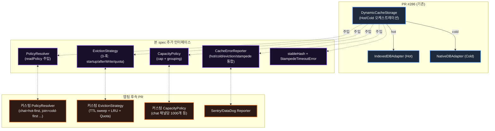

# Hot/Cold Cache Hardening — Overview

> PR #286 `hot-cold-cache-strategy.md`의 자기검증으로 도출된 보완 명세. **앱팀이 받아 구현해야 할 자리(인터페이스)와 채워야 할 값(정책)을 분리**한다.

---

## TL;DR

| 영역            | 백엔드(아이덴) 책임 — 본 spec                                                | 앱팀 책임 — 후속 PR                            |
| --------------- | ---------------------------------------------------------------------------- | ---------------------------------------------- |
| 인터페이스 정의 | `EvictionStrategy`, `CapacityPolicy`, `PolicyResolver`, `CacheErrorReporter` | 위 인터페이스의 구현체 작성                    |
| 호출 계약       | 누가 언제 훅을 호출하는가                                                    | 훅 내부의 정책 로직                            |
| 안전 fallback   | Default 구현체 제공 (prod 사용 금지)                                         | 운영용 구현체 주입                             |
| 버그 fix        | chat loadAll `cursorNo` 분기 / Stampede 가드                                 | 도메인 정책 결정 (cap 수치, type별 readPolicy) |

---

## 배경

PR #286의 Hot/Cold 2-Tier 캐시 명세(`hot-cold-cache-strategy.md`)는 다음과 같은 4가지 영역에서 보완이 필요하다:

1. **chat loadAll partial hit 버그** — `loadAllPolicy='hot-first'`가 cursor 페이지네이션에서 incomplete page 반환
2. **default readPolicy 일괄 hot-first의 stale 위험** — `Join.readNo` 같은 자주 변경되는 도메인의 mitigation 부재
3. **Warm-up stampede 가드 부재** — 동시 cold-miss loadAll이 Cold를 중복 호출
4. **Hot eviction 정책 부재** — IndexedDB quota 무한증가 위험

본 spec은 위 4건을 **인터페이스 설계 + 호출 계약**으로 추상화하고, 도메인 정책 수치/분류는 앱팀에 위임한다.

---

## 1. 아키텍처 오버레이

PR #286 명세 위에 본 spec이 추가하는 인터페이스가 어떻게 얹히는지:

**핵심**: 본 spec은 `DynamicCacheStorage`의 **옵션 시그니처 + 호출 계약**만 정의한다. PR #286이 정의한 어댑터 계층은 변경하지 않는다.

---

## 2. 책임 분리 매트릭스

| 항목                                                         | 본 spec (백엔드) | 앱팀 후속 PR | 비고                    |
| ------------------------------------------------------------ | ---------------- | ------------ | ----------------------- |
| `EvictionStrategy` 인터페이스 정의                           | ✅               | —            | 3-훅 + 호출 계약 freeze |
| `EvictionStrategy` 구현체 (실제 TTL sweep, LRU 로직)         | —                | ✅           | 앱팀 도메인 결정        |
| `CapacityPolicy` 인터페이스 정의                             | ✅               | —            | generic type-safe       |
| Type별 cap 수치 (chat 채널당 N개 등)                         | —                | ✅           | TBD-1                   |
| `PolicyResolver` 인터페이스 정의                             | ✅               | —            | factory 시점 주입       |
| Type별 readPolicy 분류 (chat=hot-first, join=cold-first ...) | —                | ✅           | TBD-2                   |
| `CacheErrorReporter` 인터페이스 정의                         | ✅               | —            | sync + 호출 보호        |
| Sentry/DataDog Reporter 구현체                               | —                | ✅           | 외부 모니터링           |
| chat `cursorNo` 분기 로직                                    | ✅               | —            | DCS 진입부 코드         |
| Stampede 가드 (in-flight Map + TTL)                          | ✅               | —            | DCS internal            |
| `StampedeTimeoutError` 클래스                                | ✅               | —            | caller 식별 가능        |
| `__cacheMeta`에 `lastAccessedAt` 필드 추가                   | ✅               | —            | utils + adapter 확장    |
| LRU 판정 로직 (lastAccessedAt 활용 방식)                     | —                | ✅           | EvictionStrategy 구현체 |
| factory runtime assertion (prod throw / dev warn)            | ✅               | —            | 안전망                  |
| Default 구현체 (no-op + cold-first fallback)                 | ✅               | —            | dev/test 전용           |
| 단위 테스트 인프라 (Mock 패턴)                               | ✅               | —            | 앱팀이 Mock 재사용 가능 |
| 통합 테스트 (실제 정책 동작 검증)                            | —                | ✅           | 앱팀 구현체 검증        |

---

## 3. 앱팀 체크리스트

본 spec 머지 후 앱팀이 작성해야 할 PR 목록 (TBD-1~6):

| TBD       | 작성 대상                              | 구현 인터페이스                                                         | 비고                                                                  |
| --------- | -------------------------------------- | ----------------------------------------------------------------------- | --------------------------------------------------------------------- |
| **TBD-1** | Type별 capacity cap 수치               | `CapacityPolicy.getLimit(type, groupKey?)`                              | 예: chat 채널당 1000, channel 500, user 500, 나머지 null              |
| **TBD-2** | Type별 readPolicy / loadAllPolicy 분류 | `PolicyResolver.resolveReadPolicy(type)` + `resolveLoadAllPolicy(type)` | 본 spec은 권장값 없음. 사용자 정보: `Join.readNo`는 자주 변경됨(참고) |
| **TBD-3** | chat의 per-channel 그룹핑 키 추출      | `CapacityPolicy.getGroupKey('chat', item)`                              | 예: `item.channelId`                                                  |
| **TBD-4** | Startup TTL sweep 실행 방식            | `EvictionStrategy.onStartup(hot)`                                       | DCS 생성자 직후 background / `requestIdleCallback` / lazy 등 선택     |
| **TBD-5** | Quota 감지 방식                        | `EvictionStrategy.onQuotaExceeded`                                      | `QuotaExceededError` 외에 Native bridge quota 응답도 잡을지           |
| **TBD-6** | `STAMPEDE_TIMEOUT_MS` 적정성           | (운영 측정 후 본 spec 업데이트)                                         | 본 spec default = 5000ms                                              |

**선택적 (운영 단계):**

- Sentry/DataDog 연동 `CacheErrorReporter` 구현체 (별도 spec)
- NativeDBAdapter bridge retry 정책 (별도 spec)

---

## 4. 변경 영향 범위

| 파일                                                       | 변경 유형               | 책임                                                       |
| ---------------------------------------------------------- | ----------------------- | ---------------------------------------------------------- |
| `libs/data/src/data/local/storages/dynamicCacheTypes.ts`   | 신규                    | 인터페이스 5종 + Error class                               |
| `libs/data/src/data/local/storages/defaultPolicies.ts`     | 신규                    | Default 구현체 3종                                         |
| `libs/data/src/data/local/storages/stableHash.ts`          | 신규                    | 유틸 함수                                                  |
| `libs/data/src/data/local/storages/DynamicCacheStorage.ts` | 수정 (PR #286 신규파일) | cursorNo 분기, Stampede 가드, Eviction 호출, Reporter 통합 |
| `libs/data/src/data/local/storages/utils.ts`               | 수정                    | `createTtlMeta`에 `lastAccessedAt` 추가                    |
| `libs/data/src/data/local/storages/IndexedDBAdapter.ts`    | 수정                    | 메타 read/write (필드 추가만)                              |
| `libs/data/src/data/local/storages/types.ts`               | 수정                    | `CacheTtlMeta` 타입 확장                                   |
| `apps/web/src/app/shared/data/localFactory.ts`             | 수정                    | runtime assertion                                          |
| `apps/web/src/app/shared/data/cacheStorageStrategies.ts`   | 수정                    | onStartup 호출                                             |
| `libs/data/src/data/local/storages/*.test.ts`              | 신규                    | 테스트                                                     |
| `libs/data/src/cores/**`                                   | **수정 금지**           | lemon-rules                                                |
| `libs/data/src/data/local/storages/NativeDBAdapter.ts`     | **수정 없음**           | 본 spec 범위 외                                            |

---

## 5. 다음 단계 (Next Actions)

| 순서 | Action                                          | 책임자          | 산출물                                                |
| ---- | ----------------------------------------------- | --------------- | ----------------------------------------------------- |
| 1    | 본 overview/interfaces/decisions 리뷰           | 앱팀(shy-lemon) | 리뷰 코멘트                                           |
| 2    | 인터페이스 freeze 합의                          | 백엔드 + 앱팀   | 본 spec 승인                                          |
| 3    | 백엔드 PR (본 spec 구현)                        | 아이덴          | T1~T9 구현 PR                                         |
| 4    | 앱팀 PR (TBD-1~6 구현체)                        | 앱팀            | PolicyResolver/EvictionStrategy/CapacityPolicy 구현체 |
| 5    | 운영 적용 + 모니터링 측정                       | 앱팀 + QA       | Reporter 로그 / 성능 측정                             |
| 6    | (필요 시) `STAMPEDE_TIMEOUT_MS` / cap 수치 튜닝 | 앱팀            | 후속 PR                                               |

---

## 관련 문서

- [`hot-cold-cache-strategy.md`](../hot-cold-cache-strategy.md) — PR #286 원본 명세 (전체 흐름)
- [`db-adapter-refactoring.md`](../db-adapter-refactoring.md) — 어댑터 계층 명세
- [`./interfaces.md`](./interfaces.md) — 본 spec의 인터페이스 명세 (구현자용)
- [`./decisions.md`](./decisions.md) — 본 spec의 결정 근거 (리뷰어용)
- 내부 작업 기록: `specs/hot-cold-cache-hardening/spec.md` (전체 인터뷰/비판 과정)
