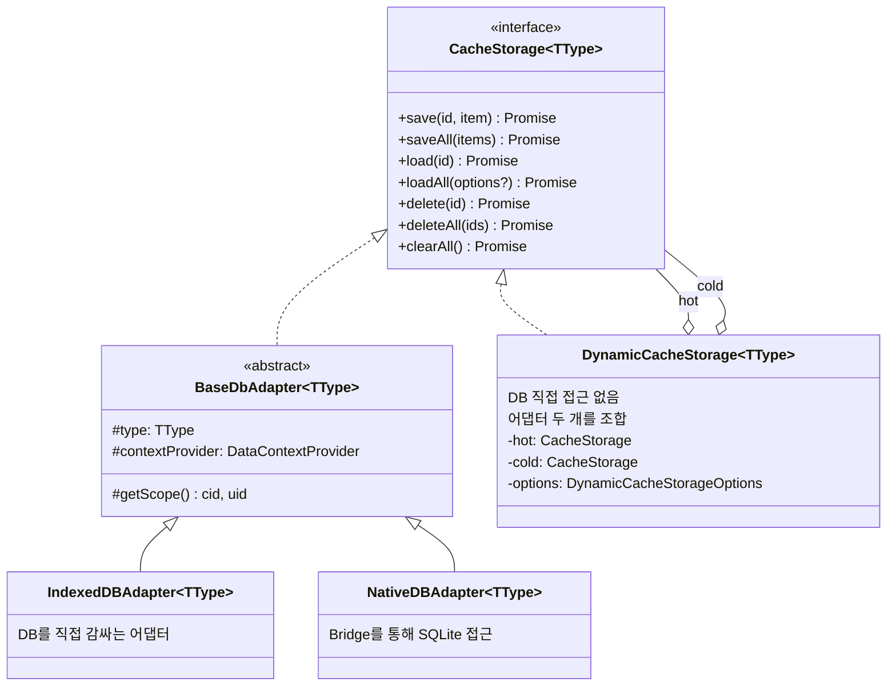
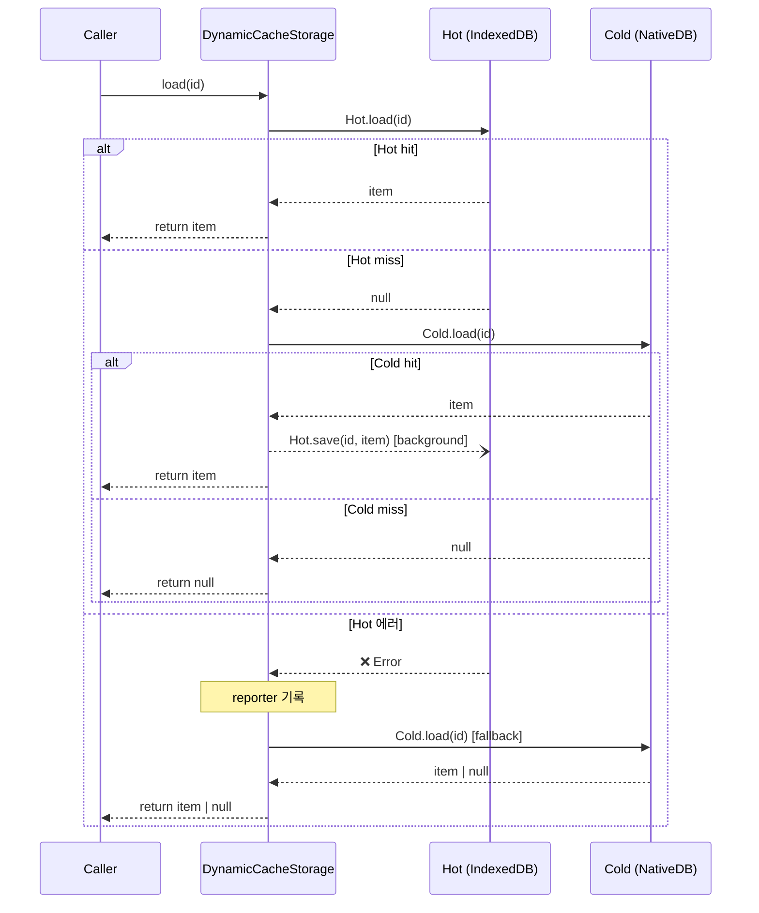
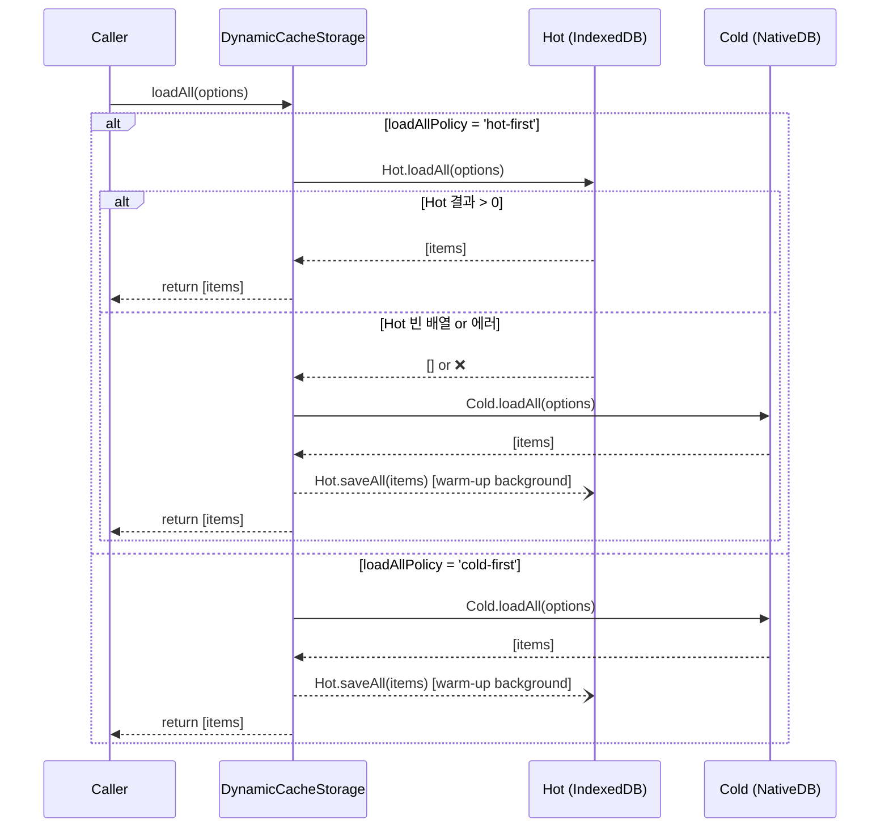
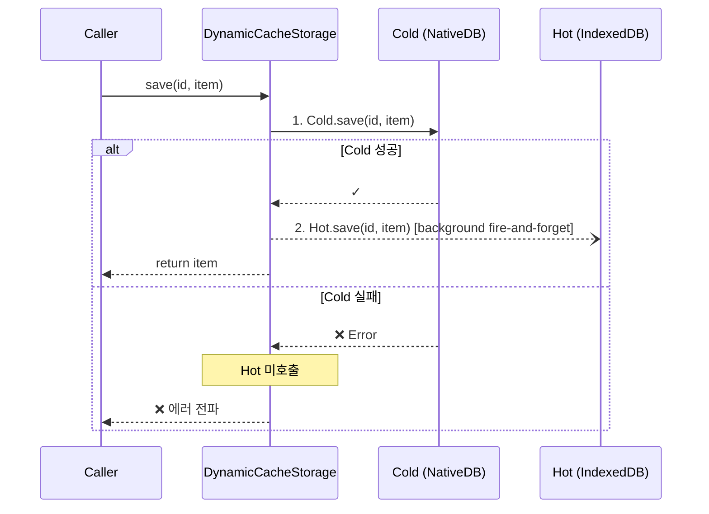
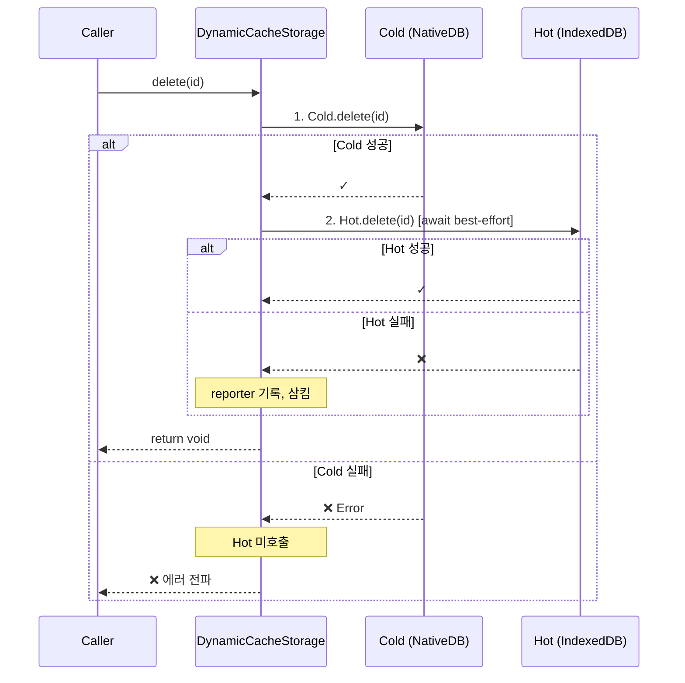
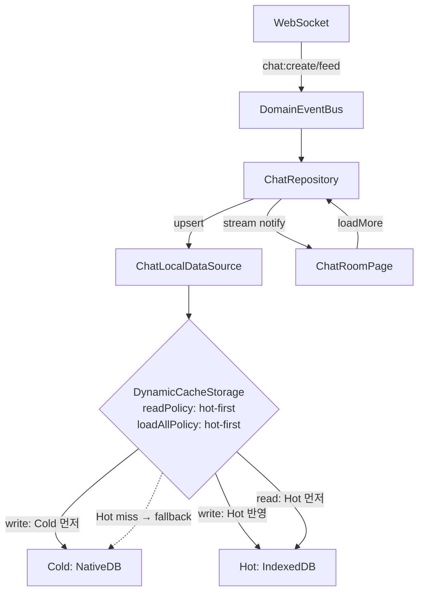
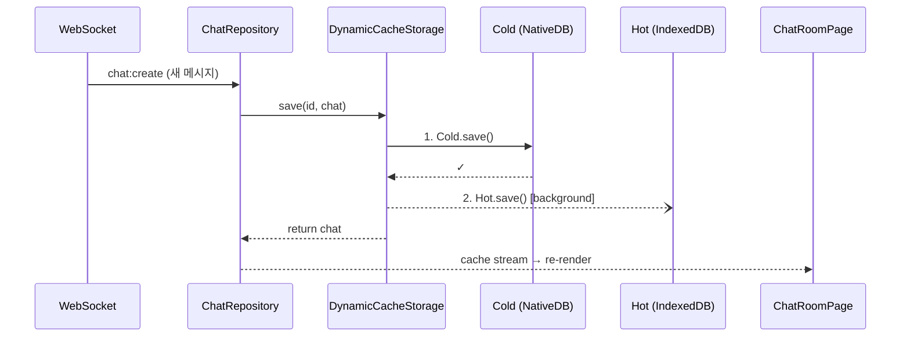
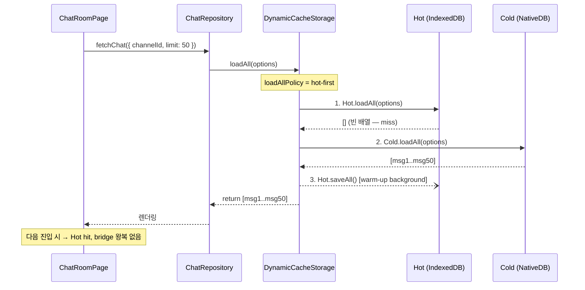
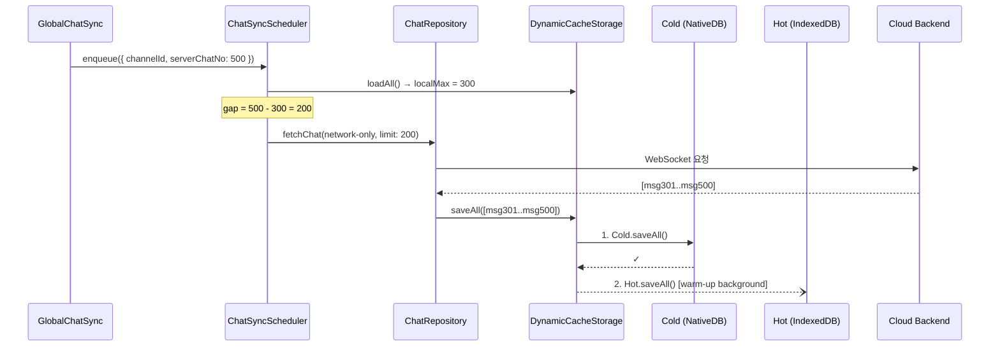

# Hot/Cold 2-Tier Cache Strategy 명세서

`db-adapter-refactoring.md`에서 완성한 어댑터 아키텍처 위에 **Hot/Cold 2-Tier 캐시 전략**을 추가하는 구현 명세입니다.

---

## 1. 개요

| 환경            | 현재                  | 목표                                   |
| --------------- | --------------------- | -------------------------------------- |
| **웹 브라우저** | IndexedDB 단독        | IndexedDB 단독 (변경 없음)             |
| **앱 WebView**  | NativeDB(SQLite) 단독 | Hot(IndexedDB) + Cold(NativeDB) 2-Tier |

앱 WebView 환경에서 NativeDB(SQLite)는 브릿지 통신 오버헤드로 읽기 지연이 발생합니다. IndexedDB를 **파생 캐시(Hot)**로 앞단에 배치하여 읽기 성능을 개선하고, NativeDB(SQLite)는 **영구 저장소(Cold, Source of Truth)**로 유지합니다.

### 핵심 원칙

1. **Cold = Source of Truth** — 모든 쓰기는 Cold 먼저
2. **Hot = 파생 캐시** — 유실 시 Cold에서 복구, Hot 실패는 비치명적
3. **전략 객체로 조립** — `localFactory.ts`는 런타임 판별만, 저장소 조합은 `CacheStorageStrategy`가 담당
4. **인터페이스 투명성** — `DynamicCacheStorage`는 `CacheStorage<TType>`을 그대로 구현
5. **삭제는 stale 방지 우선** — delete/clear는 Cold 성공 후 Hot 무효화를 best-effort await

---

## 2. 아키텍처

### 2.1 설계 의도

상위 계층(DataSource/Repository)은 **`CacheStorage<TType>` 인터페이스만 의존**합니다. 실제 DB(IndexedDB, SQLite)에 직접 접근하지 않고, 어댑터가 각 DB를 감싸서 동일한 인터페이스를 제공합니다.

`DynamicCacheStorage`도 DB를 직접 사용하지 않습니다. 두 개의 `CacheStorage` 어댑터를 내부에 조합하여 Hot/Cold 전략을 실행할 뿐입니다. 어떤 조합을 쓸지는 전략 객체(`CacheStorageStrategy`)가 환경에 따라 결정하므로, **상위 계층 코드 변경 없이 저장소 전략을 교체**할 수 있습니다.

```mermaid
flowchart TD
    subgraph Upper ["상위 계층 (변경 없음)"]
        DS["DataSource / Repository"]
    end

    DS -->|"CacheStorage&#60;TType&#62; 인터페이스만 의존"| IF{localFactory.ts}

    subgraph Strategy ["CacheStorageStrategy (환경별 선택)"]
        IF -->|Browser| S1["IndexedDbOnlyStrategy"]
        IF -->|App WebView| S2["HotColdStrategy"]
    end

    subgraph Adapters ["어댑터 계층 (DB 직접 접근 차단)"]
        S1 --> IDB_ONLY["IndexedDBAdapter"]
        S2 --> DCS["DynamicCacheStorage"]
        DCS -->|"hot: CacheStorage"| IDB["IndexedDBAdapter"]
        DCS -->|"cold: CacheStorage"| NDB["NativeDBAdapter"]
    end

    subgraph DB ["실제 DB (어댑터 내부)"]
        IDB_ONLY -.-> WEB_IDB["IndexedDB"]
        IDB -.-> APP_IDB["IndexedDB"]
        NDB -.->|"bridge 통신"| SQLITE["SQLite (App)"]
    end
```



핵심: 점선(DB 접근)은 어댑터 내부에서만 발생합니다. 상위 계층 → 어댑터 → DB, 이 경계를 `CacheStorage` 인터페이스가 보장합니다.

### 2.2 인터페이스 설계

#### 기반 타입 (`@chatic/app-messages`)

```typescript
/** 캐시 가능한 도메인 타입 */
export type CacheType = 'channel' | 'chat' | 'user' | 'join' | 'site' | 'invitecloud';

/** CacheType → 모델 매핑 (예: 'chat' → CacheChatView) */
export type CacheModelOf<TType extends CacheType> = CacheModelMap[TType];

/** CacheType → 쿼리 옵션 매핑 (예: 'chat' → ChatQueryOptions) */
export type CacheQueryOf<TType extends CacheType> = CacheQueryMap[TType];
```

#### 컨텍스트 (`@chatic/data`)

```typescript
/** Repository/Storage가 현재 cid/uid를 읽는 계약 */
export interface DataContextProvider {
    getContext(): DataContext;
    setContext(context: DataContext): void;
}

export interface DataContext {
    cid?: string; // Cloud ID
    sid?: string; // Place ID
    uid?: string; // User ID
}
```

#### 저장소 인터페이스 (`@chatic/data`)

```typescript
/** 모든 저장소 구현체가 만족해야 하는 공통 인터페이스 */
export interface CacheStorage<TType extends CacheType> {
    save(id: string, item: CacheModelOf<TType>): Promise<CacheModelOf<TType>>;
    saveAll(items: CacheModelOf<TType>[]): Promise<CacheModelOf<TType>[]>;
    load(id: string): Promise<CacheModelOf<TType> | null>;
    loadAll(options?: CacheQueryOf<TType>): Promise<CacheModelOf<TType>[]>;
    delete(id: string): Promise<void>;
    deleteAll(ids: string[]): Promise<void>;
    clearAll(): Promise<void>;
}

/** 저장소 생성 팩토리 타입 */
export type CacheStorageFactory = <TType extends CacheType>(
    type: TType,
    contextProvider: DataContextProvider
) => CacheStorage<TType>;
```

```typescript
/** IndexedDBAdapter/NativeDBAdapter의 공통 기반 추상 클래스 */
export abstract class BaseDbAdapter<TType extends CacheType> implements CacheStorage<TType> {
    constructor(
        protected readonly type: TType,
        protected readonly contextProvider: DataContextProvider
    ) {}

    /** 도메인 타입 정책에 따른 스코프(cid, uid) 결정 */
    protected getScope(): { cid: string; uid: string };

    abstract save(id, item): Promise<CacheModelOf<TType>>;
    abstract saveAll(items): Promise<CacheModelOf<TType>[]>;
    abstract load(id): Promise<CacheModelOf<TType> | null>;
    abstract loadAll(options?): Promise<CacheModelOf<TType>[]>;
    abstract delete(id): Promise<void>;
    abstract deleteAll(ids): Promise<void>;
    abstract clearAll(): Promise<void>;
}
```

#### 클래스 관계



> `DynamicCacheStorage`는 `CacheStorage`를 구현하면서 동시에 두 개의 `CacheStorage`를 내부에 조합(composition)합니다. 자체적으로 DB에 접근하지 않으며, 모든 실제 I/O는 주입받은 어댑터에 위임합니다.

#### DynamicCacheStorage 옵션 (신규)

```typescript
export type CacheReadPolicy = 'hot-first' | 'cold-first';

export type DynamicCacheOperation = 'save' | 'saveAll' | 'load' | 'loadAll' | 'delete' | 'deleteAll' | 'clearAll';

export interface DynamicCacheStorageOptions<TType extends CacheType> {
    type?: TType;
    readPolicy?: CacheReadPolicy; // load()용, 기본 'hot-first'
    loadAllPolicy?: CacheReadPolicy; // loadAll()용, 기본 'cold-first'
    warmupChunkSize?: number;
    onHotError?: (error: unknown, context: { type?: TType; operation: DynamicCacheOperation }) => void;
}
```

#### 전략 패턴 (신규)

```typescript
/** 환경별 저장소 조합을 캡슐화하는 전략 인터페이스 */
export interface CacheStorageStrategy {
    create<TType extends CacheType>(type: TType, contextProvider: DataContextProvider): CacheStorage<TType>;
}
```

### 2.3 Strategy 구현체

| Strategy                            | 환경            | 조합                                                              |
| ----------------------------------- | --------------- | ----------------------------------------------------------------- |
| `IndexedDbOnlyCacheStorageStrategy` | 웹 브라우저     | `IndexedDBAdapter`                                                |
| `NativeDbOnlyCacheStorageStrategy`  | fallback/테스트 | `NativeDBAdapter`                                                 |
| `HotColdCacheStorageStrategy`       | 앱 WebView      | `DynamicCacheStorage(hot=IndexedDBAdapter, cold=NativeDBAdapter)` |

---

## 3. 데이터 흐름

### 3.1 Read — `load(id)` (hot-first)



### 3.2 Read — `loadAll(options?)`



### 3.3 Write — `save(id, item)` / `saveAll(items)`



### 3.4 Delete — `delete(id)` / `deleteAll(ids)` / `clearAll()`



> 삭제는 Hot에 stale 데이터가 남지 않도록, save(background fire-and-forget)와 달리 Hot 무효화를 **await**합니다.

### 3.5 타입별 Read Policy

```typescript
const defaultReadPolicies: Record<CacheType, CacheReadPolicy> = {
    chat: 'hot-first',
    channel: 'hot-first',
    invitecloud: 'hot-first',
    join: 'hot-first',
    site: 'hot-first',
    user: 'hot-first',
};

const defaultLoadAllPolicies: Record<CacheType, CacheReadPolicy> = {
    chat: 'hot-first', // append-only + ChatQueryExecutor로 Hot에서 동일 쿼리 가능
    channel: 'cold-first',
    invitecloud: 'cold-first',
    join: 'cold-first',
    site: 'cold-first',
    user: 'cold-first',
};
```

| 데이터 성격                            | `readPolicy` | `loadAllPolicy` | 근거             |
| -------------------------------------- | ------------ | --------------- | ---------------- |
| append 중심, 단건 조회 빈번 (chat)     | `hot-first`  | `hot-first`     | bridge 비용 절감 |
| 변경/삭제 잦음                         | `cold-first` | `cold-first`    | Cold 정합성 우선 |
| 단건은 Hot 가능, 목록 쿼리 불일치 우려 | `hot-first`  | `cold-first`    | 혼합             |

---

## 4. Chat 동기화 흐름

### 4.1 전체 아키텍처



### 4.2 실시간 메시지 수신



### 4.3 채팅방 진입 — Hot 비어있음 (최초)



### 4.4 채팅방 진입 — Hot에 데이터 있음 (재방문)


### 4.5 Gap 동기화



---

## 5. 에러 처리

| 시나리오                    | 동작                | 근거                   |
| --------------------------- | ------------------- | ---------------------- |
| Hot read/write/delete 에러  | reporter 기록, 삼킴 | Hot은 파생 캐시        |
| Cold read/write/delete 에러 | **상위 전파**       | Cold = Source of Truth |

### Stale 데이터

- 삭제 경로: Cold 성공 후 Hot 무효화를 await하여 race 최소화
- Hot 무효화 실패 시: stale 잔존 가능 → reporter 기록
- stale 민감 타입: `readPolicy: 'cold-first'`로 Hot 우회

---

## 6. `localFactory.ts` 변경

```typescript
export const isNativeApp = (): boolean => {
    return typeof window !== 'undefined' && !!(window as any).ReactNativeWebView;
};

const selectStrategy = (): CacheStorageStrategy =>
    isNativeApp() ? new HotColdCacheStorageStrategy(webBridge) : new IndexedDbOnlyCacheStorageStrategy();

export const getCacheStorage = <TType extends CacheType>(
    type: TType,
    contextProvider: DataContextProvider
): CacheStorage<TType> => selectStrategy().create(type, contextProvider);
```

---

## 7. 검증 전략

### 7.1 Mock 전략

`DynamicCacheStorage`는 DB에 직접 접근하지 않고 두 개의 `CacheStorage<TType>`을 조합만 합니다. 따라서 **Hot/Cold 각각을 `CacheStorage` 인터페이스의 mock 구현체로 주입**하면 DB 없이 순수 로직만 검증할 수 있습니다.

#### Mock 구현체 구조

```
MockCacheStorage implements CacheStorage<TType>
├── 내부 Map<string, CacheModelOf<TType>> (in-memory store)
├── 각 메서드별 호출 기록 (spy)
│   ├── callCount: number
│   ├── calledWith: args[]
│   └── lastCalledWith: args
├── 에러 주입 설정
│   ├── throwOnMethod(method, error): 특정 메서드 호출 시 에러 throw
│   └── clearErrors(): 에러 주입 해제
└── 상태 조회
    ├── getStore(): 현재 내부 데이터 스냅샷
    └── reset(): 호출 기록 + 데이터 초기화
```

#### onHotError spy

```
mockReporter = { calls: [], handler: (error, context) => calls.push({ error, context }) }
```

`DynamicCacheStorageOptions.onHotError`에 `mockReporter.handler`를 주입하여 reporter 호출 여부와 전달된 context를 검증합니다.

#### 비동기 부수효과 검증 방법

| 부수효과 유형                                      | 검증 방법                                                                                                 |
| -------------------------------------------------- | --------------------------------------------------------------------------------------------------------- |
| **background fire-and-forget** (write 후 Hot.save) | `await flushMicrotasks()` 후 `mockHot.save.callCount` 확인                                                |
| **await best-effort** (delete 후 Hot.delete)       | `DynamicCacheStorage.delete()` resolve 후 즉시 `mockHot.delete.callCount` 확인 (await이므로 flush 불필요) |
| **warm-up background** (loadAll 후 Hot.saveAll)    | `await flushMicrotasks()` 후 `mockHot.saveAll.calledWith` 확인                                            |

> `flushMicrotasks`: 테스트 유틸로 `await new Promise(r => setTimeout(r, 0))` 또는 `vi.runAllTimersAsync()` 사용. fire-and-forget Promise가 내부적으로 catch 처리된 후 settled 되기를 기다립니다.

---

### 7.2 시나리오별 검증 명세

#### Read (R1–R8)

**R1 — `load()` Hot hit**

| 단계    | 내용                                               |
| ------- | -------------------------------------------------- |
| Arrange | `mockHot.save('id1', item)` → Hot에 데이터 존재    |
| Act     | `dcs.load('id1')`                                  |
| Assert  | 반환값 === `item`, `mockCold.load.callCount === 0` |

**R2 — `load()` Hot miss, Cold hit**

| 단계    | 내용                                                                                                                              |
| ------- | --------------------------------------------------------------------------------------------------------------------------------- |
| Arrange | Hot 비어있음, `mockCold.save('id1', item)` → Cold에만 데이터 존재                                                                 |
| Act     | `dcs.load('id1')`                                                                                                                 |
| Assert  | 반환값 === `item`, `await flushMicrotasks()` 후 `mockHot.save.callCount === 1` 및 `mockHot.save.lastCalledWith === ['id1', item]` |

**R3 — `load()` 양쪽 miss**

| 단계    | 내용                                                                               |
| ------- | ---------------------------------------------------------------------------------- |
| Arrange | Hot/Cold 모두 비어있음                                                             |
| Act     | `dcs.load('id1')`                                                                  |
| Assert  | 반환값 === `null`, `mockHot.load.callCount === 1`, `mockCold.load.callCount === 1` |

**R4 — `load()` Hot 에러**

| 단계    | 내용                                                                                                                                                          |
| ------- | ------------------------------------------------------------------------------------------------------------------------------------------------------------- |
| Arrange | `mockHot.throwOnMethod('load', new Error('IDB crash'))`, `mockCold.save('id1', item)`                                                                         |
| Act     | `dcs.load('id1')`                                                                                                                                             |
| Assert  | 반환값 === `item` (Cold fallback 성공), `mockReporter.calls.length === 1`, `mockReporter.calls[0].context.operation === 'load'`, 에러가 상위로 throw되지 않음 |

**R5 — `loadAll()` cold-first**

| 단계    | 내용                                                                                                                                                                                      |
| ------- | ----------------------------------------------------------------------------------------------------------------------------------------------------------------------------------------- |
| Arrange | `mockCold` 내부에 `[item1, item2, item3]` 저장, `loadAllPolicy: 'cold-first'`                                                                                                             |
| Act     | `dcs.loadAll(options)`                                                                                                                                                                    |
| Assert  | 반환값 === `[item1, item2, item3]`, `mockHot.loadAll.callCount === 0` (Hot 조회 안 함), `await flushMicrotasks()` 후 `mockHot.saveAll.callCount === 1` 및 전달된 items가 Cold 결과와 동일 |

**R6 — `loadAll()` hot-first — Hot hit**

| 단계    | 내용                                                                 |
| ------- | -------------------------------------------------------------------- |
| Arrange | `mockHot` 내부에 `[item1, item2]` 저장, `loadAllPolicy: 'hot-first'` |
| Act     | `dcs.loadAll(options)`                                               |
| Assert  | 반환값 === `[item1, item2]`, `mockCold.loadAll.callCount === 0`      |

**R7 — `loadAll()` hot-first — Hot miss (빈 배열)**

| 단계    | 내용                                                                                                        |
| ------- | ----------------------------------------------------------------------------------------------------------- |
| Arrange | Hot 비어있음 (loadAll → `[]`), `mockCold` 내부에 `[item1, item2]` 저장, `loadAllPolicy: 'hot-first'`        |
| Act     | `dcs.loadAll(options)`                                                                                      |
| Assert  | 반환값 === `[item1, item2]` (Cold fallback), `await flushMicrotasks()` 후 `mockHot.saveAll.callCount === 1` |

**R8 — `loadAll()` hot-first — Hot 에러**

| 단계    | 내용                                                                                                                             |
| ------- | -------------------------------------------------------------------------------------------------------------------------------- |
| Arrange | `mockHot.throwOnMethod('loadAll', new Error('IDB crash'))`, `mockCold` 내부에 `[item1]`, `loadAllPolicy: 'hot-first'`            |
| Act     | `dcs.loadAll(options)`                                                                                                           |
| Assert  | 반환값 === `[item1]` (Cold fallback), `mockReporter.calls.length === 1`, `mockReporter.calls[0].context.operation === 'loadAll'` |

#### Write (W1–W3)

**W1 — `save()` 정상**

| 단계    | 내용                                                                                                                                  |
| ------- | ------------------------------------------------------------------------------------------------------------------------------------- |
| Arrange | Hot/Cold 모두 정상                                                                                                                    |
| Act     | `dcs.save('id1', item)`                                                                                                               |
| Assert  | 반환값 === `item`, `mockCold.save.callCount === 1` 및 Cold가 먼저 호출됨, `await flushMicrotasks()` 후 `mockHot.save.callCount === 1` |

**W2 — `save()` Cold 실패**

| 단계    | 내용                                                                                           |
| ------- | ---------------------------------------------------------------------------------------------- |
| Arrange | `mockCold.throwOnMethod('save', new Error('SQLite write fail'))`                               |
| Act     | `dcs.save('id1', item)`                                                                        |
| Assert  | **에러가 상위로 전파됨** (Cold 에러 그대로 throw), `mockHot.save.callCount === 0` (Hot 미호출) |

**W3 — `save()` Hot 실패**

| 단계    | 내용                                                                                                                                          |
| ------- | --------------------------------------------------------------------------------------------------------------------------------------------- |
| Arrange | `mockHot.throwOnMethod('save', new Error('IDB quota'))`, Cold 정상                                                                            |
| Act     | `dcs.save('id1', item)`                                                                                                                       |
| Assert  | 반환값 === `item` (정상 반환, Hot 에러 삼킴), `mockCold.save.callCount === 1`, `await flushMicrotasks()` 후 `mockReporter.calls.length === 1` |

#### Delete / Clear (D1–D4)

**D1 — `delete()` 정상**

| 단계    | 내용                                                                                                                                                                                    |
| ------- | --------------------------------------------------------------------------------------------------------------------------------------------------------------------------------------- |
| Arrange | Hot/Cold 모두에 `'id1'` 데이터 존재                                                                                                                                                     |
| Act     | `dcs.delete('id1')`                                                                                                                                                                     |
| Assert  | 에러 없이 resolve, `mockCold.delete.callCount === 1` (먼저), `mockHot.delete.callCount === 1` (await best-effort), 이후 `mockHot.load('id1') === null`, `mockCold.load('id1') === null` |

**D2 — `delete()` Cold 실패**

| 단계    | 내용                                                         |
| ------- | ------------------------------------------------------------ |
| Arrange | `mockCold.throwOnMethod('delete', new Error('SQLite lock'))` |
| Act     | `dcs.delete('id1')`                                          |
| Assert  | **에러가 상위로 전파됨**, `mockHot.delete.callCount === 0`   |

**D3 — `delete()` Hot 실패**

| 단계    | 내용                                                                                                                                                                 |
| ------- | -------------------------------------------------------------------------------------------------------------------------------------------------------------------- |
| Arrange | `mockHot.throwOnMethod('delete', new Error('IDB error'))`, Cold 정상                                                                                                 |
| Act     | `dcs.delete('id1')`                                                                                                                                                  |
| Assert  | 에러 없이 정상 resolve (Hot 에러 삼킴), `mockCold.delete.callCount === 1`, `mockReporter.calls.length === 1`, `mockReporter.calls[0].context.operation === 'delete'` |

**D4 — `clearAll()` 정상**

| 단계    | 내용                                                                                                                                          |
| ------- | --------------------------------------------------------------------------------------------------------------------------------------------- |
| Arrange | Hot/Cold 모두에 여러 데이터 존재                                                                                                              |
| Act     | `dcs.clearAll()`                                                                                                                              |
| Assert  | 에러 없이 resolve, `mockCold.clearAll.callCount === 1`, `mockHot.clearAll.callCount === 1` (await best-effort), `mockHot.getStore()` 비어있음 |

#### 통합 (I1–I5)

**I1 — save → load (Hot hit 경로 확인)**

| 단계    | 내용                                                                                  |
| ------- | ------------------------------------------------------------------------------------- |
| Arrange | Hot/Cold 모두 비어있음                                                                |
| Act     | `dcs.save('id1', item)` → `await flushMicrotasks()` → `dcs.load('id1')`               |
| Assert  | `load` 반환값 === `item`, `mockCold.load.callCount === 0` (Hot hit이므로 Cold 미조회) |

**I2 — save → delete → load (양쪽 삭제 확인)**

| 단계    | 내용                                                                                                |
| ------- | --------------------------------------------------------------------------------------------------- |
| Arrange | Hot/Cold 모두 비어있음                                                                              |
| Act     | `dcs.save('id1', item)` → `await flushMicrotasks()` → `dcs.delete('id1')` → `dcs.load('id1')`       |
| Assert  | `load` 반환값 === `null`, `mockHot.getStore()`에 `'id1'` 없음, `mockCold.getStore()`에 `'id1'` 없음 |

**I3 — chat feed burst → loadAll hot-first (연속 쓰기 후 Hot 조회)**

| 단계    | 내용                                                                              |
| ------- | --------------------------------------------------------------------------------- |
| Arrange | `loadAllPolicy: 'hot-first'`                                                      |
| Act     | `dcs.saveAll([msg1..msg10])` → `await flushMicrotasks()` → `dcs.loadAll(options)` |
| Assert  | `loadAll` 반환값에 10개 메시지 포함, `mockCold.loadAll.callCount === 0` (Hot hit) |

**I4 — chat 최초 진입 → loadAll hot-first (Cold fallback → warm-up → 재진입 Hot hit)**

| 단계    | 내용                                                                                                                                                     |
| ------- | -------------------------------------------------------------------------------------------------------------------------------------------------------- |
| Arrange | Hot 비어있음, Cold에 `[msg1..msg50]` 존재, `loadAllPolicy: 'hot-first'`                                                                                  |
| Act     | 1차: `dcs.loadAll(options)` → `await flushMicrotasks()` → 2차: `dcs.loadAll(options)`                                                                    |
| Assert  | 1차 반환값 === `[msg1..msg50]` (Cold fallback), 2차 반환값 === `[msg1..msg50]` (Hot hit), 2차에서 `mockCold.loadAll` 추가 호출 없음 (callCount 여전히 1) |

**I5 — Hot 전면 장애 (모든 CRUD가 Cold만으로 동작)**

| 단계    | 내용                                                                                                                                                                     |
| ------- | ------------------------------------------------------------------------------------------------------------------------------------------------------------------------ |
| Arrange | `mockHot.throwOnMethod('*', new Error('IDB unavailable'))` (모든 메서드에 에러 주입), Cold 정상                                                                          |
| Act     | `dcs.save('id1', item)` → `dcs.load('id1')` → `dcs.loadAll()` → `dcs.delete('id1')`                                                                                      |
| Assert  | `save` 정상 반환, `load` 반환값 === `item`, `loadAll` 반환값 포함, `delete` 정상 resolve, `mockReporter.calls.length >= 4` (각 Hot 실패마다 기록), 상위에 에러 전파 없음 |

---

### 7.3 검증 범위 밖 (이 명세에서 다루지 않는 것)

| 항목                                              | 이유                                                          |
| ------------------------------------------------- | ------------------------------------------------------------- |
| IndexedDBAdapter / NativeDBAdapter 단위 동작      | 각 어댑터의 자체 검증 영역 (`db-adapter-refactoring.md` 소관) |
| 실제 IndexedDB / SQLite I/O 성능                  | 통합/성능 테스트 영역, 별도 계획 필요                         |
| WebSocket → Repository → DynamicCacheStorage 연쇄 | end-to-end 통합 테스트 영역                                   |
| 앱 WebView 수동 검증                              | QA 체크리스트로 별도 관리                                     |

---

## 8. 파일 변경 목록

| 유형 | 파일                                                       | 내용                                  |
| ---- | ---------------------------------------------------------- | ------------------------------------- |
| 신규 | `libs/data/src/data/local/storages/DynamicCacheStorage.ts` | DynamicCacheStorage 구현              |
| 신규 | `apps/web/src/app/shared/data/cacheStorageStrategies.ts`   | Strategy 구현체                       |
| 수정 | `libs/data/src/data/local/storages/index.ts`               | export 추가                           |
| 수정 | `apps/web/src/app/shared/data/localFactory.ts`             | `isNativeApp()` 실제 감지 + 전략 선택 |

---

## 9. 향후 확장

- **Hot TTL 검증**: Hot 조회 시 TTL 만료 → Cold fallback
- **앱 시작 시 전체 warm-up**: Cold → Hot pre-load
- **Hot schema versioning**: 앱 버전 변경 시 Hot clear + re-warm
