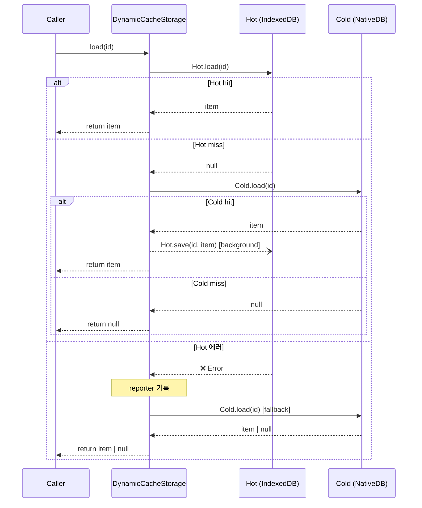
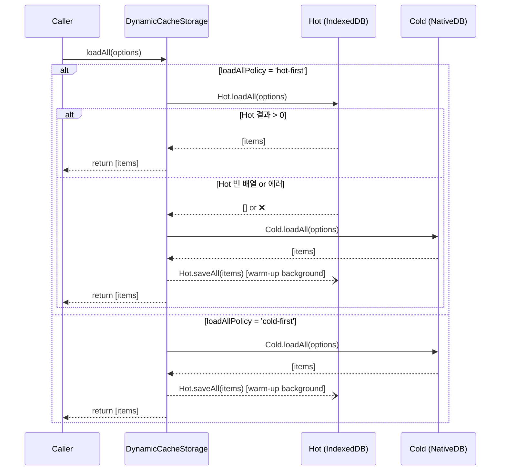
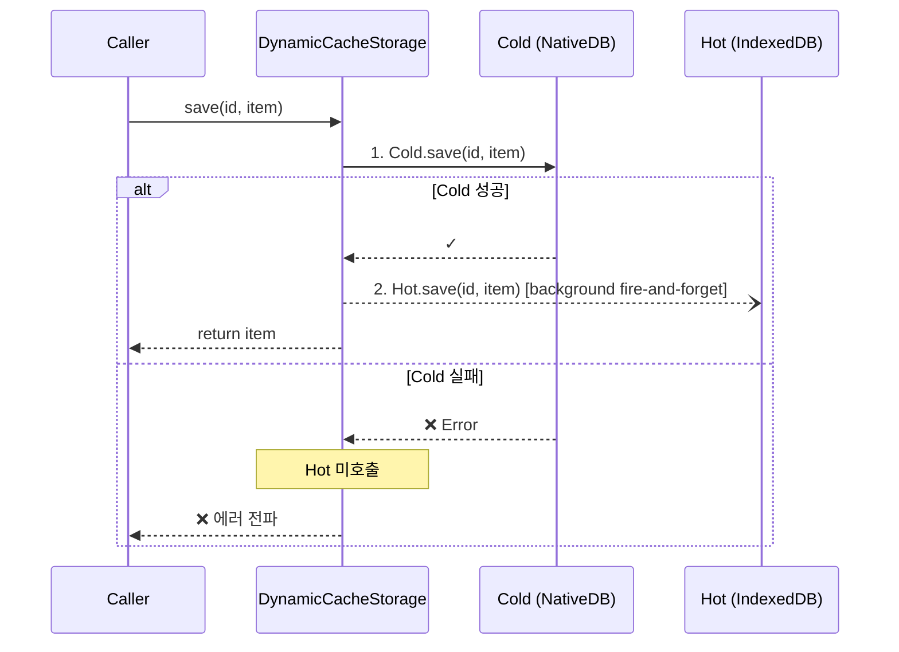
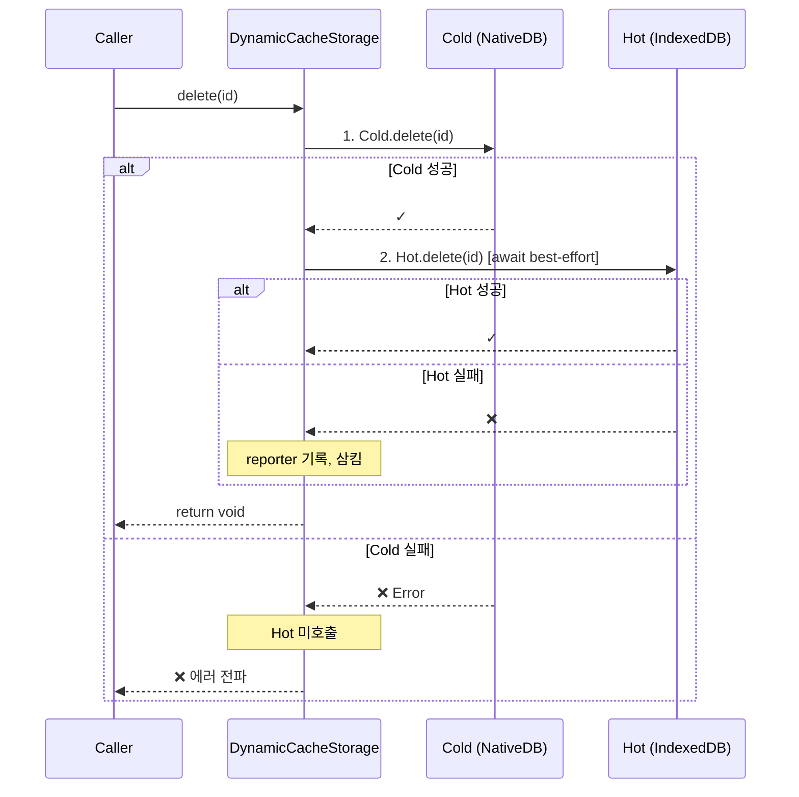
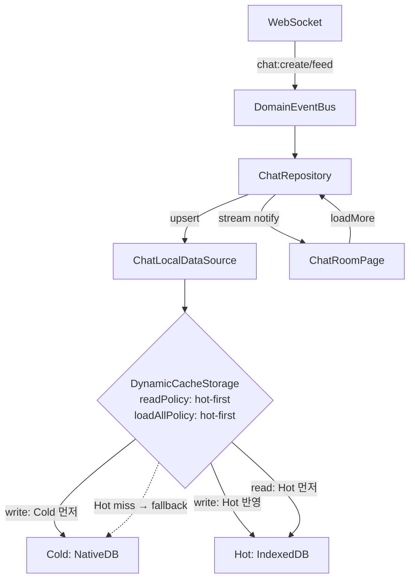
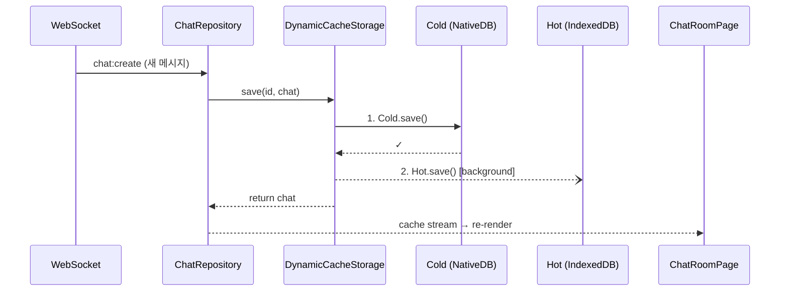
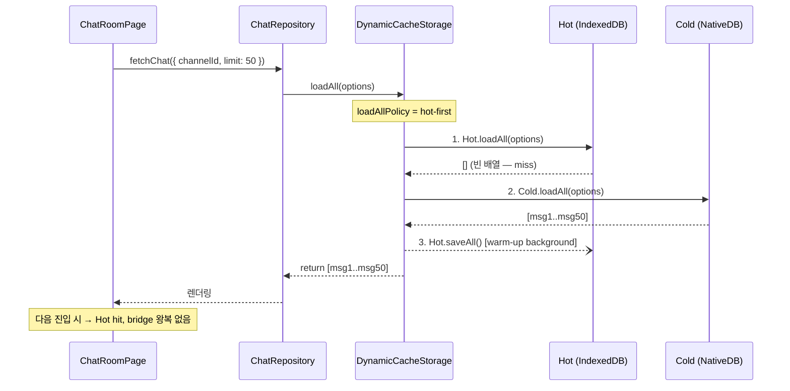
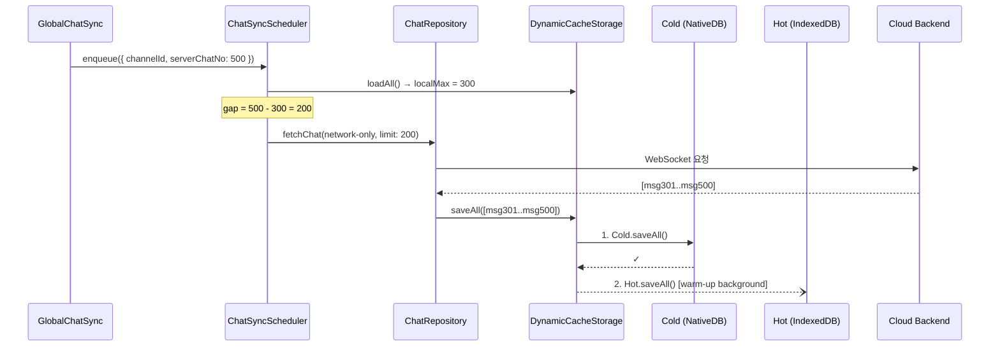

# Hot/Cold 2-Tier Cache Strategy 명세서

`db-adapter-refactoring.md`에서 완성한 어댑터 아키텍처 위에 **Hot/Cold 2-Tier 캐시 전략**을 추가하는 구현 명세입니다.

---

## 1. 개요

| 환경            | 현재                  | 목표                                   |
| --------------- | --------------------- | -------------------------------------- |
| **웹 브라우저** | IndexedDB 단독        | IndexedDB 단독 (변경 없음)             |
| **앱 WebView**  | NativeDB(SQLite) 단독 | Hot(IndexedDB) + Cold(NativeDB) 2-Tier |

앱 WebView 환경에서 NativeDB(SQLite)는 브릿지 통신 오버헤드로 읽기 지연이 발생합니다. IndexedDB를 **파생 캐시(Hot)**로 앞단에 배치하여 읽기 성능을 개선하고, NativeDB(SQLite)는 **영구 저장소(Cold, Source of Truth)**로 유지합니다.

### 핵심 원칙

1. **Cold = Source of Truth** — 모든 쓰기는 Cold 먼저
2. **Hot = 파생 캐시** — 유실 시 Cold에서 복구, Hot 실패는 비치명적
3. **전략 객체로 조립** — `localFactory.ts`는 런타임 판별만, 저장소 조합은 `CacheStorageStrategy`가 담당
4. **인터페이스 투명성** — `DynamicCacheStorage`는 `CacheStorage<TType>`을 그대로 구현
5. **삭제는 stale 방지 우선** — delete/clear는 Cold 성공 후 Hot 무효화를 best-effort await

---

## 2. 아키텍처

### 2.1 계층 구조

```
DataSource / Repository
        │
        ▼
  localFactory.ts (환경 분기 + 전략 선택)
        │
        ├── Browser ──▶ IndexedDBAdapter (단독)
        │
        └── App WebView ──▶ DynamicCacheStorage
                                ├── Hot: IndexedDBAdapter
                                └── Cold: NativeDBAdapter
```

### 2.2 인터페이스 설계

```typescript
/** 읽기 정책 */
export type CacheReadPolicy = 'hot-first' | 'cold-first';

/** Hot 에러 컨텍스트 */
export type DynamicCacheOperation = 'save' | 'saveAll' | 'load' | 'loadAll' | 'delete' | 'deleteAll' | 'clearAll';

/** DynamicCacheStorage 생성 옵션 */
export interface DynamicCacheStorageOptions<TType extends CacheType> {
    type?: TType;
    readPolicy?: CacheReadPolicy; // load()용, 기본 'hot-first'
    loadAllPolicy?: CacheReadPolicy; // loadAll()용, 기본 'cold-first'
    warmupChunkSize?: number;
    onHotError?: (error: unknown, context: { type?: TType; operation: DynamicCacheOperation }) => void;
}
```

```typescript
/** 저장소 조합 전략 */
export interface CacheStorageStrategy {
    create<TType extends CacheType>(type: TType, contextProvider: DataContextProvider): CacheStorage<TType>;
}
```

### 2.3 Strategy 구현체

| Strategy                            | 환경            | 조합                                                              |
| ----------------------------------- | --------------- | ----------------------------------------------------------------- |
| `IndexedDbOnlyCacheStorageStrategy` | 웹 브라우저     | `IndexedDBAdapter`                                                |
| `NativeDbOnlyCacheStorageStrategy`  | fallback/테스트 | `NativeDBAdapter`                                                 |
| `HotColdCacheStorageStrategy`       | 앱 WebView      | `DynamicCacheStorage(hot=IndexedDBAdapter, cold=NativeDBAdapter)` |

---

## 3. 데이터 흐름

### 3.1 Read — `load(id)` (hot-first)



### 3.2 Read — `loadAll(options?)`



### 3.3 Write — `save(id, item)` / `saveAll(items)`



### 3.4 Delete — `delete(id)` / `deleteAll(ids)` / `clearAll()`



> 삭제는 Hot에 stale 데이터가 남지 않도록, save(background fire-and-forget)와 달리 Hot 무효화를 **await**합니다.

### 3.5 타입별 Read Policy

```typescript
const defaultReadPolicies: Record<CacheType, CacheReadPolicy> = {
    chat: 'hot-first',
    channel: 'hot-first',
    invitecloud: 'hot-first',
    join: 'hot-first',
    site: 'hot-first',
    user: 'hot-first',
};

const defaultLoadAllPolicies: Record<CacheType, CacheReadPolicy> = {
    chat: 'hot-first', // append-only + ChatQueryExecutor로 Hot에서 동일 쿼리 가능
    channel: 'cold-first',
    invitecloud: 'cold-first',
    join: 'cold-first',
    site: 'cold-first',
    user: 'cold-first',
};
```

| 데이터 성격                            | `readPolicy` | `loadAllPolicy` | 근거             |
| -------------------------------------- | ------------ | --------------- | ---------------- |
| append 중심, 단건 조회 빈번 (chat)     | `hot-first`  | `hot-first`     | bridge 비용 절감 |
| 변경/삭제 잦음                         | `cold-first` | `cold-first`    | Cold 정합성 우선 |
| 단건은 Hot 가능, 목록 쿼리 불일치 우려 | `hot-first`  | `cold-first`    | 혼합             |

---

## 4. Chat 동기화 흐름

### 4.1 전체 아키텍처



### 4.2 실시간 메시지 수신



### 4.3 채팅방 진입 — Hot 비어있음 (최초)



### 4.4 채팅방 진입 — Hot에 데이터 있음 (재방문)


### 4.5 Gap 동기화



---

## 5. 에러 처리

| 시나리오                    | 동작                | 근거                   |
| --------------------------- | ------------------- | ---------------------- |
| Hot read/write/delete 에러  | reporter 기록, 삼킴 | Hot은 파생 캐시        |
| Cold read/write/delete 에러 | **상위 전파**       | Cold = Source of Truth |

### Stale 데이터

- 삭제 경로: Cold 성공 후 Hot 무효화를 await하여 race 최소화
- Hot 무효화 실패 시: stale 잔존 가능 → reporter 기록
- stale 민감 타입: `readPolicy: 'cold-first'`로 Hot 우회

---

## 6. `localFactory.ts` 변경

```typescript
export const isNativeApp = (): boolean => {
    return typeof window !== 'undefined' && !!(window as any).ReactNativeWebView;
};

const selectStrategy = (): CacheStorageStrategy =>
    isNativeApp() ? new HotColdCacheStorageStrategy(webBridge) : new IndexedDbOnlyCacheStorageStrategy();

export const getCacheStorage = <TType extends CacheType>(
    type: TType,
    contextProvider: DataContextProvider
): CacheStorage<TType> => selectStrategy().create(type, contextProvider);
```

---

## 7. 검증 시나리오

### Read (R1–R8)

| ID  | 시나리오                         | 기대 결과                    |
| --- | -------------------------------- | ---------------------------- |
| R1  | `load()` Hot hit                 | Hot 반환, Cold 미호출        |
| R2  | `load()` Hot miss, Cold hit      | Cold 반환 + Hot warm-up      |
| R3  | `load()` 양쪽 miss               | `null`                       |
| R4  | `load()` Hot 에러                | Cold fallback, reporter 호출 |
| R5  | `loadAll()` cold-first           | Cold 결과 반환 + Hot warm-up |
| R6  | `loadAll()` hot-first — Hot hit  | Hot 반환, Cold 미호출        |
| R7  | `loadAll()` hot-first — Hot miss | Cold fallback + warm-up      |
| R8  | `loadAll()` hot-first — Hot 에러 | Cold fallback, reporter 호출 |

### Write (W1–W3)

| ID  | 시나리오           | 기대 결과                  |
| --- | ------------------ | -------------------------- |
| W1  | `save()` 정상      | Cold 성공 → Hot background |
| W2  | `save()` Cold 실패 | 에러 전파, Hot 미호출      |
| W3  | `save()` Hot 실패  | 정상 반환, reporter 기록   |

### Delete / Clear (D1–D4)

| ID  | 시나리오             | 기대 결과                         |
| --- | -------------------- | --------------------------------- |
| D1  | `delete()` 정상      | Cold 성공 → Hot await best-effort |
| D2  | `delete()` Cold 실패 | 에러 전파                         |
| D3  | `delete()` Hot 실패  | 정상 반환, reporter 기록          |
| D4  | `clearAll()` 정상    | Cold 성공 → Hot await best-effort |

### 통합 (I1–I5)

| ID  | 시나리오                            | 기대 결과                              |
| --- | ----------------------------------- | -------------------------------------- |
| I1  | save → load                         | Hot hit 즉시 반환                      |
| I2  | save → delete → load                | `null` (양쪽 삭제)                     |
| I3  | chat feed burst → loadAll hot-first | Hot에서 즉시 반환                      |
| I4  | chat 최초 진입 → loadAll hot-first  | Cold fallback → warm-up → 다음 Hot hit |
| I5  | Hot 전면 장애                       | 모든 CRUD Cold 기준 정상 동작          |

---

## 8. 파일 변경 목록

| 유형 | 파일                                                       | 내용                                  |
| ---- | ---------------------------------------------------------- | ------------------------------------- |
| 신규 | `libs/data/src/data/local/storages/DynamicCacheStorage.ts` | DynamicCacheStorage 구현              |
| 신규 | `apps/web/src/app/shared/data/cacheStorageStrategies.ts`   | Strategy 구현체                       |
| 수정 | `libs/data/src/data/local/storages/index.ts`               | export 추가                           |
| 수정 | `apps/web/src/app/shared/data/localFactory.ts`             | `isNativeApp()` 실제 감지 + 전략 선택 |

---

## 9. 향후 확장

- **Hot TTL 검증**: Hot 조회 시 TTL 만료 → Cold fallback
- **앱 시작 시 전체 warm-up**: Cold → Hot pre-load
- **Hot schema versioning**: 앱 버전 변경 시 Hot clear + re-warm
