# Hot/Cold 2-Tier Cache Strategy 명세서

`db-adapter-refactoring.md`에서 완성한 어댑터 아키텍처 위에 **Hot/Cold 2-Tier 캐시 전략**을 추가하는 구현 명세입니다.

---

## 1. 개요

| 환경            | 현재                  | 목표                                   |
| --------------- | --------------------- | -------------------------------------- |
| **웹 브라우저** | IndexedDB 단독        | IndexedDB 단독 (변경 없음)             |
| **앱 WebView**  | NativeDB(SQLite) 단독 | Hot(IndexedDB) + Cold(NativeDB) 2-Tier |

앱 WebView 환경에서 NativeDB(SQLite)는 브릿지 통신 오버헤드로 읽기 지연이 발생합니다. IndexedDB를 **파생 캐시(Hot)**로 앞단에 배치하여 읽기 성능을 개선하고, NativeDB(SQLite)는 **영구 저장소(Cold, Source of Truth)**로 유지합니다.

### 핵심 원칙

1. **Cold = Source of Truth** — 모든 쓰기는 Cold 먼저
2. **Hot = 파생 캐시** — 유실 시 Cold에서 복구, Hot 실패는 비치명적
3. **전략 객체로 조립** — `localFactory.ts`는 런타임 판별만, 저장소 조합은 `CacheStorageStrategy`가 담당
4. **인터페이스 투명성** — `DynamicCacheStorage`는 `CacheStorage<TType>`을 그대로 구현
5. **삭제는 stale 방지 우선** — delete/clear는 Cold 성공 후 Hot 무효화를 best-effort await

---

## 2. 아키텍처

### 2.1 설계 의도

상위 계층(DataSource/Repository)은 **`CacheStorage<TType>` 인터페이스만 의존**합니다. 실제 DB(IndexedDB, SQLite)에 직접 접근하지 않고, 어댑터가 각 DB를 감싸서 동일한 인터페이스를 제공합니다.

`DynamicCacheStorage`도 DB를 직접 사용하지 않습니다. 두 개의 `CacheStorage` 어댑터를 내부에 조합하여 Hot/Cold 전략을 실행할 뿐입니다. 어떤 조합을 쓸지는 전략 객체(`CacheStorageStrategy`)가 환경에 따라 결정하므로, **상위 계층 코드 변경 없이 저장소 전략을 교체**할 수 있습니다.

```mermaid
flowchart TD
    subgraph Upper ["상위 계층 (변경 없음)"]
        DS["DataSource / Repository"]
    end

    DS -->|"CacheStorage&#60;TType&#62; 인터페이스만 의존"| IF{localFactory.ts}

    subgraph Strategy ["CacheStorageStrategy (환경별 선택)"]
        IF -->|Browser| S1["IndexedDbOnlyStrategy"]
        IF -->|App WebView| S2["HotColdStrategy"]
    end

    subgraph Adapters ["어댑터 계층 (DB 직접 접근 차단)"]
        S1 --> IDB_ONLY["IndexedDBAdapter"]
        S2 --> DCS["DynamicCacheStorage"]
        DCS -->|"hot: CacheStorage"| IDB["IndexedDBAdapter"]
        DCS -->|"cold: CacheStorage"| NDB["NativeDBAdapter"]
    end

    subgraph DB ["실제 DB (어댑터 내부)"]
        IDB_ONLY -.-> WEB_IDB["IndexedDB"]
        IDB -.-> APP_IDB["IndexedDB"]
        NDB -.->|"bridge 통신"| SQLITE["SQLite (App)"]
    end
```

핵심: 점선(DB 접근)은 어댑터 내부에서만 발생합니다. 상위 계층 → 어댑터 → DB, 이 경계를 `CacheStorage` 인터페이스가 보장합니다.

### 2.2 인터페이스 설계

#### 기반 타입 (`@chatic/app-messages`)

```typescript
/** 캐시 가능한 도메인 타입 */
export type CacheType = 'channel' | 'chat' | 'user' | 'join' | 'site' | 'invitecloud';

/** CacheType → 모델 매핑 (예: 'chat' → CacheChatView) */
export type CacheModelOf<TType extends CacheType> = CacheModelMap[TType];

/** CacheType → 쿼리 옵션 매핑 (예: 'chat' → ChatQueryOptions) */
export type CacheQueryOf<TType extends CacheType> = CacheQueryMap[TType];
```

#### 컨텍스트 (`@chatic/data`)

```typescript
/** Repository/Storage가 현재 cid/uid를 읽는 계약 */
export interface DataContextProvider {
    getContext(): DataContext;
    setContext(context: DataContext): void;
}

export interface DataContext {
    cid?: string; // Cloud ID
    sid?: string; // Place ID
    uid?: string; // User ID
}
```

#### 저장소 인터페이스 (`@chatic/data`)

```typescript
/** 모든 저장소 구현체가 만족해야 하는 공통 인터페이스 */
export interface CacheStorage<TType extends CacheType> {
    save(id: string, item: CacheModelOf<TType>): Promise<CacheModelOf<TType>>;
    saveAll(items: CacheModelOf<TType>[]): Promise<CacheModelOf<TType>[]>;
    load(id: string): Promise<CacheModelOf<TType> | null>;
    loadAll(options?: CacheQueryOf<TType>): Promise<CacheModelOf<TType>[]>;
    delete(id: string): Promise<void>;
    deleteAll(ids: string[]): Promise<void>;
    clearAll(): Promise<void>;
}

/** 저장소 생성 팩토리 타입 */
export type CacheStorageFactory = <TType extends CacheType>(
    type: TType,
    contextProvider: DataContextProvider
) => CacheStorage<TType>;
```

```typescript
/** IndexedDBAdapter/NativeDBAdapter의 공통 기반 추상 클래스 */
export abstract class BaseDbAdapter<TType extends CacheType> implements CacheStorage<TType> {
    constructor(
        protected readonly type: TType,
        protected readonly contextProvider: DataContextProvider
    ) {}

    /** 도메인 타입 정책에 따른 스코프(cid, uid) 결정 */
    protected getScope(): { cid: string; uid: string };

    abstract save(id, item): Promise<CacheModelOf<TType>>;
    abstract saveAll(items): Promise<CacheModelOf<TType>[]>;
    abstract load(id): Promise<CacheModelOf<TType> | null>;
    abstract loadAll(options?): Promise<CacheModelOf<TType>[]>;
    abstract delete(id): Promise<void>;
    abstract deleteAll(ids): Promise<void>;
    abstract clearAll(): Promise<void>;
}
```

#### 클래스 관계

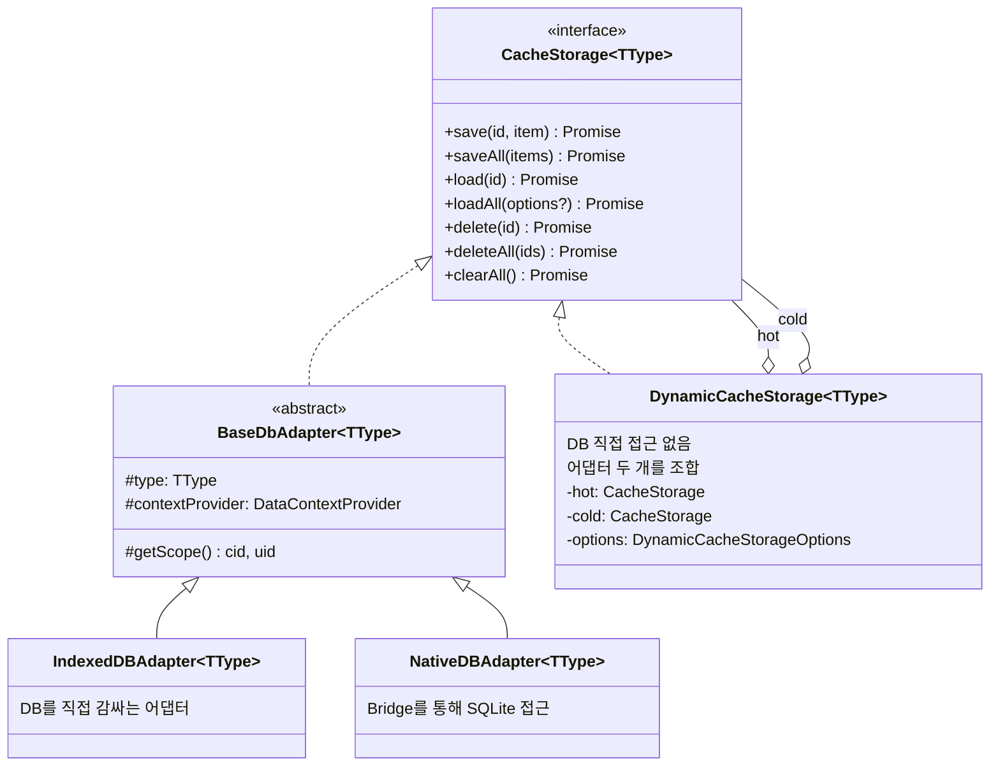

> `DynamicCacheStorage`는 `CacheStorage`를 구현하면서 동시에 두 개의 `CacheStorage`를 내부에 조합(composition)합니다. 자체적으로 DB에 접근하지 않으며, 모든 실제 I/O는 주입받은 어댑터에 위임합니다.

#### DynamicCacheStorage 옵션

```typescript
export type CacheReadPolicy = 'hot-first' | 'cold-first';

export interface DynamicCacheStorageOptions<TType extends CacheType> {
    type?: TType;
    readPolicy?: CacheReadPolicy; // load()용 — PolicyResolver 미주입 시 fallback
    loadAllPolicy?: CacheReadPolicy; // loadAll()용 — PolicyResolver 미주입 시 fallback
    warmupChunkSize?: number;
    policyResolver?: PolicyResolver; // type별 readPolicy/loadAllPolicy 주입 (미주입 + prod = throw)
    evictionStrategy?: EvictionStrategy; // Hot eviction 3-훅 (미주입 = no-op)
    capacityPolicy?: CapacityPolicy; // type별 cap + grouping (미주입 = 무한)
    reporter?: CacheErrorReporter; // hot/cold/eviction/stampede 통합 에러 리포터 (미주입 = console.warn)
}
```

#### PolicyResolver — type별 readPolicy 주입

PR 초기의 `defaultReadPolicies` 하드코딩을 대체하는 주입 가능한 인터페이스입니다.

```typescript
export interface PolicyResolver {
    resolveReadPolicy(type: CacheType): CacheReadPolicy;
    resolveLoadAllPolicy(type: CacheType): CacheReadPolicy;
}
```

- **Default (`DefaultPolicyResolver`)**: 모든 type에 `'cold-first'` 반환 (정합성 우선 안전 fallback)
- **운영 미주입 금지**: factory에서 `process.env.NODE_ENV === 'production'`이면 throw (runtime assertion). dev/test에서는 console.warn + Default 적용

#### EvictionStrategy — Hot 캐시 eviction 3-훅

Hot(IndexedDB) quota 보호를 위한 eviction 정책 인터페이스입니다. 본 명세는 **훅 시그니처 + 호출 계약**만 정의하고, 실제 TTL/LRU/FIFO 로직은 앱팀 구현체가 결정합니다.

```typescript
export interface EvictionStrategy {
    /** Startup TTL sweep 등. DCS 생성 직후 1회 호출 */
    onStartup(hot: CacheStorage<any>): Promise<void>;
    // ↑ any 사용 이유: startup sweep은 여러 type을 순회해야 하므로 generic 불가

    /** per-type cap 검사. Hot.save 완료 후 chain 호출. items 전체 전달 */
    onAfterWrite<T extends CacheType>(type: T, items: CacheModelOf<T>[], hot: CacheStorage<T>): Promise<void>;

    /** 비상 cleanup. Hot 에러가 QuotaExceededError류일 때 호출 */
    onQuotaExceeded(type: CacheType, hot: CacheStorage<any>): Promise<void>;
    // ↑ any 사용 이유: quota 초과 시 type 무관하게 전체 cleanup 필요
}
```

**호출 계약**:

| 훅                | 호출 주체 | 시점                                        | 비동기 패턴      |
| ----------------- | --------- | ------------------------------------------- | ---------------- |
| `onStartup`       | factory   | DCS 생성 직후 1회                           | fire-and-forget  |
| `onAfterWrite`    | DCS       | Cold.save 성공 → Hot.save 완료 await → 호출 | 백그라운드 chain |
| `onQuotaExceeded` | DCS       | Hot 에러가 `QuotaExceededError`류일 때      | fire-and-forget  |

- Hot.save 실패 시 `onAfterWrite`는 호출하지 않음 (Hot에 반영 안 됐으므로 cap 검사 무의미)
- `items.length === 0`이면 `onAfterWrite` 호출 생략 (DCS 책임)
- 다중 호출 race 안전성은 EvictionStrategy 구현체가 자체 mutex/queue로 보장
- **Default (`DefaultEvictionStrategy`)**: 3-훅 모두 no-op (eviction 없음)

#### CapacityPolicy — type별 cap + grouping

`EvictionStrategy` 구현체가 내부에서 사용하는 조회 인터페이스입니다 (DCS 직접 호출 안 함).

```typescript
export interface CapacityPolicy {
    /** 해당 type의 최대 항목 수. null이면 cap 없음 */
    getLimit(type: CacheType, groupKey?: string): number | null;

    /** item을 그룹 키로 매핑. undefined면 전체 LRU. Generic으로 type-safe 보장 */
    getGroupKey<T extends CacheType>(type: T, item: CacheModelOf<T>): string | undefined;
}
```

- chat per-channel 표현: `getGroupKey('chat', item)` = `item.channelId`
- **Default (`DefaultCapacityPolicy`)**: `getLimit()` = null (무한), `getGroupKey()` = undefined

#### CacheErrorReporter — 통합 에러 리포터

기존 `onHotError` 콜백을 흡수하여 hot/cold/eviction/stampede 4-tier 에러를 단일 인터페이스로 통합합니다.

```typescript
export type CacheErrorTier = 'hot' | 'cold' | 'eviction' | 'stampede';

export type CacheErrorOperation =
    | 'load'
    | 'loadAll'
    | 'save'
    | 'saveAll'
    | 'delete'
    | 'deleteAll'
    | 'clearAll'
    | 'eviction'
    | 'stampede-timeout';

export type CacheErrorReporter = (
    error: unknown,
    context: {
        tier: CacheErrorTier;
        operation: CacheErrorOperation;
        type?: CacheType;
    }
) => void; // sync, throw 금지
```

- DCS는 Reporter 호출을 `safeReport()` 헬퍼로 try/catch 보호 — Reporter 자체 오류가 DCS 동작에 영향 주지 않음
- 호출 빈도가 높을 수 있으므로 throttle/sampling은 Reporter 구현체 책임
- **Default**: `console.warn`

#### StampedeTimeoutError

Stampede 가드의 timeout error를 caller가 식별할 수 있는 Error 클래스입니다.

```typescript
export class StampedeTimeoutError extends Error {
    readonly name = 'StampedeTimeoutError';
    constructor(
        public readonly queryKey: string,
        public readonly elapsedMs: number
    ) {
        super(`Stampede timeout: ${queryKey} (${elapsedMs}ms)`);
    }
}
```

- caller는 `error instanceof StampedeTimeoutError`로 구분 가능
- 기본 `STAMPEDE_TIMEOUT_MS = 5000` (운영 측정 후 조정 가능)

#### stableHash 유틸

Stampede 가드의 query key 생성에 사용합니다. options를 sorted-key JSON으로 직렬화한 string을 반환합니다.

```typescript
export function stableHash(value: unknown): string;
```

- 객체의 키를 정렬 후 JSON 직렬화 → 순서 무관 동치성 보장
- `undefined` 필드는 정렬 전에 제거 (missing key와 동치화)
- MVP: sorted-key JSON 그 자체를 key로 사용 (충돌 0, key 길이 김)
- options는 JSON-serializable primitive만 허용 — 위반 시 throw

#### DCS Inspector (테스트용)

```typescript
class DynamicCacheStorage<TType extends CacheType> {
    getPolicyResolver(): Readonly<PolicyResolver>;
    getCapacityPolicy(): Readonly<CapacityPolicy>;
    getEvictionStrategy(): Readonly<EvictionStrategy>;
    getReporter(): Readonly<CacheErrorReporter> | undefined;
}
```

- `Readonly<T>` 반환으로 mutation 차단, 메서드 호출만 가능
- 테스트에서 주입된 정책 검증 가능

#### 전략 패턴 (신규)

```typescript
/** 환경별 저장소 조합을 캡슐화하는 전략 인터페이스 */
export interface CacheStorageStrategy {
    create<TType extends CacheType>(type: TType, contextProvider: DataContextProvider): CacheStorage<TType>;
}
```

### 2.3 Strategy 구현체

| Strategy                            | 환경            | 조합                                                              |
| ----------------------------------- | --------------- | ----------------------------------------------------------------- |
| `IndexedDbOnlyCacheStorageStrategy` | 웹 브라우저     | `IndexedDBAdapter`                                                |
| `NativeDbOnlyCacheStorageStrategy`  | fallback/테스트 | `NativeDBAdapter`                                                 |
| `HotColdCacheStorageStrategy`       | 앱 WebView      | `DynamicCacheStorage(hot=IndexedDBAdapter, cold=NativeDBAdapter)` |

---

## 3. 데이터 흐름

### 3.1 Read — `load(id)` (hot-first)

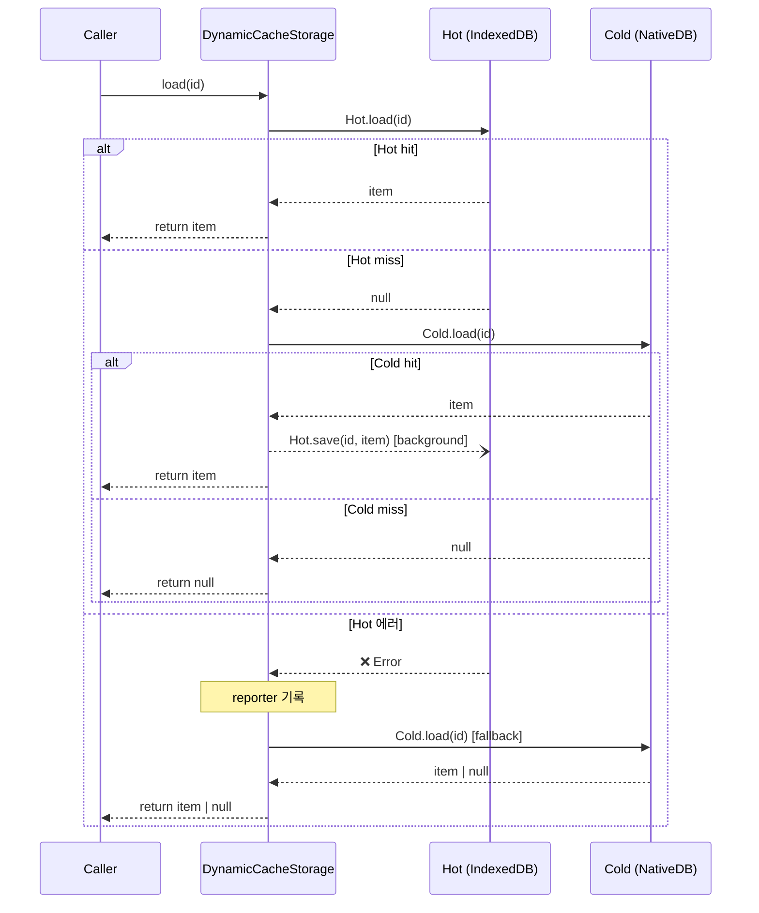

### 3.2 Read — `loadAll(options?)`

#### cursorNo 분기 (Stampede 가드 포함)

`options?.cursorNo != null`이면 **PolicyResolver 결과를 무시하고 강제 cold-first**로 분기합니다. cursor 페이지네이션 시 Hot의 partial data가 incomplete page를 반환하는 버그를 방지합니다. `cursorNo === 0`도 cold-first입니다 (페이지네이션 명시 의도).

동일 options에 대한 동시 호출은 **Stampede 가드**로 보호합니다. 인스턴스별 `Map<queryKey, { promise, startedAt }>`를 보유하여 동일 키의 in-flight Promise를 공유합니다. settled(reject 포함) 시 즉시 제거하여 재시도를 허용하며, `STAMPEDE_TIMEOUT_MS(5000ms)` 초과 시 `StampedeTimeoutError`를 reject합니다.

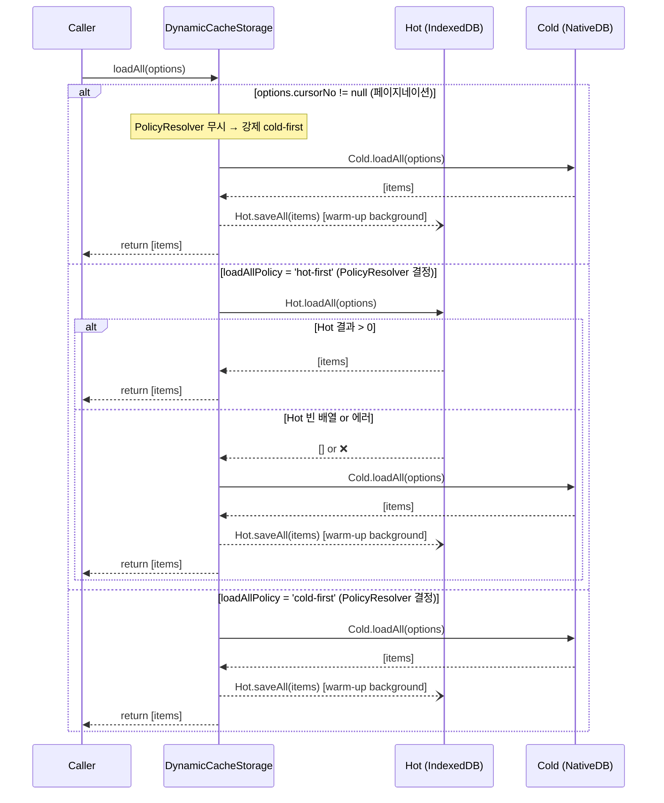

### 3.3 Write — `save(id, item)` / `saveAll(items)`

Eviction hook (`onAfterWrite`) 호출이 추가됩니다. Hot.save 완료 후 chain으로 호출합니다.

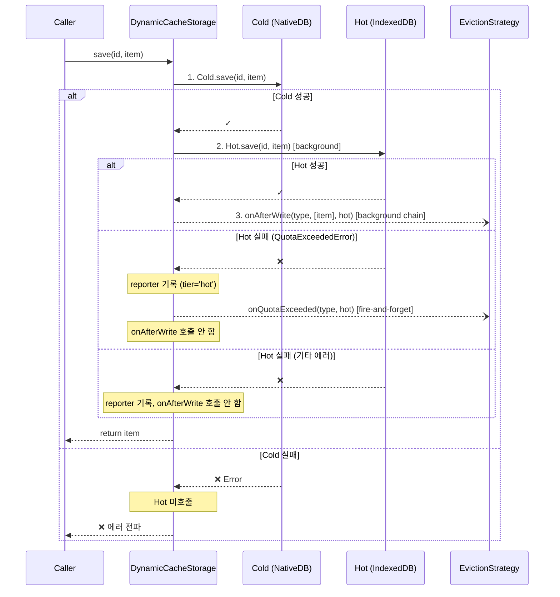

### 3.4 Delete — `delete(id)` / `deleteAll(ids)` / `clearAll()`

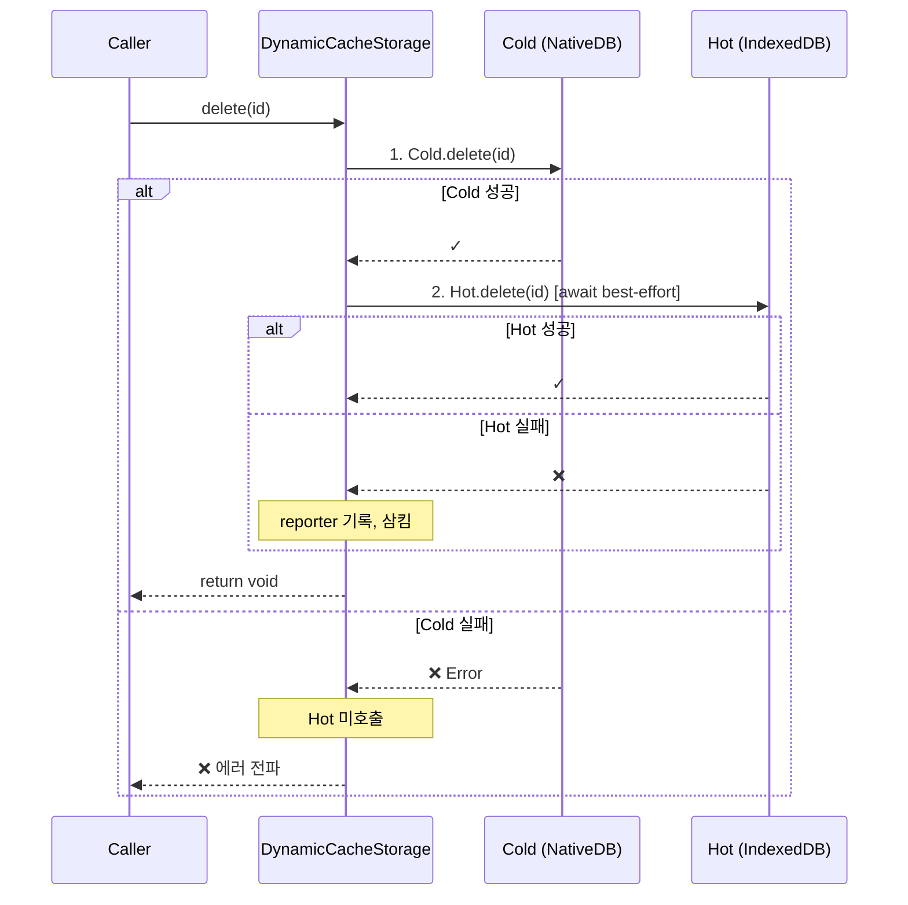

> 삭제는 Hot에 stale 데이터가 남지 않도록, save(background fire-and-forget)와 달리 Hot 무효화를 **await**합니다.

### 3.5 타입별 Read Policy — PolicyResolver 주입

type별 readPolicy/loadAllPolicy는 하드코딩하지 않고 **`PolicyResolver` 인터페이스**로 주입합니다. 앱팀이 도메인 특성에 맞게 구현체를 작성합니다.

```typescript
// 앱팀 구현 예시
class AppPolicyResolver implements PolicyResolver {
    resolveReadPolicy(type: CacheType): CacheReadPolicy {
        // join.readNo는 자주 변경되므로 cold-first 권장
        return type === 'join' ? 'cold-first' : 'hot-first';
    }
    resolveLoadAllPolicy(type: CacheType): CacheReadPolicy {
        // chat은 append-only + ChatQueryExecutor로 Hot에서 동일 쿼리 가능
        return type === 'chat' ? 'hot-first' : 'cold-first';
    }
}
```

**DefaultPolicyResolver** (미주입 시 fallback — dev/test 전용):

```typescript
// 모든 type에 'cold-first' 반환 (정합성 우선, 성능 희생)
class DefaultPolicyResolver implements PolicyResolver {
    resolveReadPolicy(_type: CacheType): CacheReadPolicy {
        return 'cold-first';
    }
    resolveLoadAllPolicy(_type: CacheType): CacheReadPolicy {
        return 'cold-first';
    }
}
```

**cursorNo 예외**: `loadAll(options)`에서 `options?.cursorNo != null`이면 PolicyResolver 결과와 무관하게 **강제 cold-first** (§3.2 참조).

| 데이터 성격                            | `readPolicy` | `loadAllPolicy` | 근거             |
| -------------------------------------- | ------------ | --------------- | ---------------- |
| append 중심, 단건 조회 빈번 (chat)     | `hot-first`  | `hot-first`     | bridge 비용 절감 |
| 변경/삭제 잦음 (join 등)               | `cold-first` | `cold-first`    | Cold 정합성 우선 |
| 단건은 Hot 가능, 목록 쿼리 불일치 우려 | `hot-first`  | `cold-first`    | 혼합             |

> 위 표는 참고용 가이드입니다. 실제 분류는 앱팀이 `PolicyResolver` 구현체에서 결정합니다.

### 3.6 Cache Miss → Network Fetch (상위 계층 연계)

`DynamicCacheStorage`는 **캐시 계층만 담당**합니다. Hot/Cold 양쪽 모두 miss(null/빈 배열)이면 그대로 null/빈 배열을 반환할 뿐, 네트워크 요청을 수행하지 않습니다.

네트워크 fetch는 **Repository 계층**에서 `fetchWithCachePolicy()` 패턴으로 처리합니다.

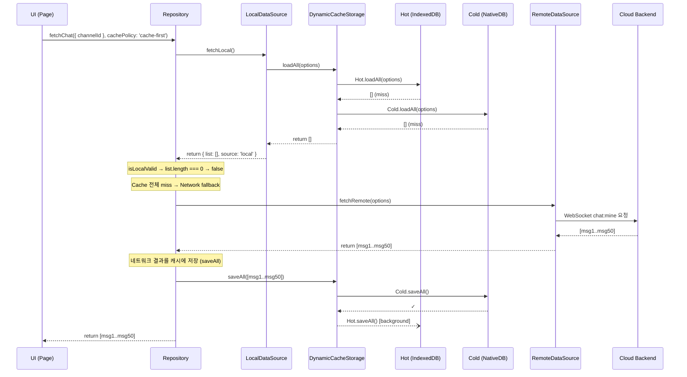

#### Repository의 캐시 정책 결정 흐름

Repository는 `fetchWithCachePolicy`(범용)와 `fetchChat`(Chat 전용) 두 가지 패턴으로 캐시 정책을 결정합니다. 핵심 분기는 동일합니다:

```typescript
// BaseRepository.fetchWithCachePolicy (libs/data/src/data/repositories/types.ts)
protected async fetchWithCachePolicy<T>({
    options, fetchLocal, fetchRemote, fallback, isLocalValid, backgroundLabel,
}): Promise<T> {
    const policy = this.resolveCachePolicy(options);

    // 1. network-only → 캐시 스킵, 바로 네트워크
    if (policy === 'network-only') {
        return fetchRemote(options);
    }

    // 2. 로컬 캐시 조회 (DynamicCacheStorage → Hot/Cold)
    const local = await fetchLocal();

    // 3. cache-only → 네트워크 절대 안 탐
    if (policy === 'cache-only') {
        return local ?? fallback();
    }

    // 4. cache-first: 캐시 유효하면 즉시 반환 + 백그라운드 리프레시
    if (local && (isLocalValid ? isLocalValid(local) : true)) {
        this.runInBackground(() => fetchRemote({ ...options, cachePolicy: 'network-only' }));
        return local;
    }

    // 5. ★ 캐시 전체 miss → 네트워크 fetch (foreground await)
    return fetchRemote(options);
}
```

#### `fetchRemote` = `fetchFromRemoteAndCache` — 네트워크 fetch + DB 저장을 한 곳에서

위 분기에서 호출되는 `fetchRemote`는 실제로 각 Repository의 `fetchFromRemoteAndCache` 메서드입니다. 이 메서드가 **네트워크에서 가져오기 + 캐시에 저장**을 한 번에 처리합니다.

```typescript
// ChatRepository.fetchFromRemoteAndCache (libs/data/src/data/repositories/ChatRepository.ts)
private async fetchFromRemoteAndCache(
    payload: ChatFeedPayload,
    options?: RepositoryRequestOptions
): Promise<DomainListResult<DomainChat>> {
    // 1. 네트워크 요청 (WebSocket chat:mine)
    const remote = await this.requestRemote<ChatFeedResult>(
        ref => this.chatRemoteDataSource.fetchChat(payload, ref),
        options
    );

    const domainList = (remote.list || []).map(item => toDomainChat(item, requestScope));

    // 2. ★ 가져온 데이터를 로컬 캐시에 저장
    //    cross-cloud 오염 방지: 요청 시점 cid와 현재 cid가 같을 때만 저장
    const currentCid = this.getRepositoryContext().cid;
    if (currentCid === requestContext.cid) {
        await this.chatLocalDataSource.upsertMany(domainList, requestContext);
        // └─ 내부: CacheStorage.saveAll() 호출
        //    └─ DynamicCacheStorage: Cold.saveAll() → Hot.saveAll() [background]
    }

    return createDomainListResult(domainList, { source: 'remote', ... });
}
```

#### 네트워크 데이터 → DB 저장 경로 상세

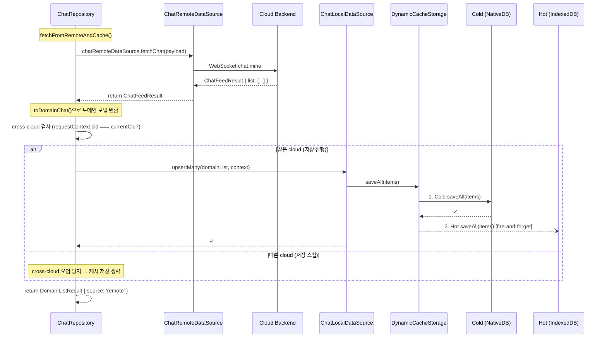

> **핵심**: `DynamicCacheStorage`는 네트워크를 전혀 모릅니다. Repository가 네트워크에서 가져온 데이터를 `LocalDataSource.upsertMany()`로 넘기면, LocalDataSource가 `CacheStorage.saveAll()`을 호출하고, 이 시점에 DynamicCacheStorage의 Cold→Hot 저장 흐름을 탑니다.

#### 실시간 이벤트 수신 시에도 같은 경로

WebSocket으로 `chat:create`/`chat:update` 이벤트가 들어올 때도 동일한 저장 경로를 사용합니다:

```typescript
// ChatRepository.initializeInternalListeners()
this.onDomainEvent('chat:create', detail => {
    this.runInBackground(
        () => this.chatLocalDataSource.upsert(detail.data, this.getRepositoryContext()),
        //    └─ CacheStorage.save() → Cold.save() → Hot.save() [background]
        'chat:create'
    );
});
```

#### 계층별 책임 정리

| 계층                    | 읽기 시 역할                         | 쓰기 시 역할                                                               | 네트워크 접근                |
| ----------------------- | ------------------------------------ | -------------------------------------------------------------------------- | ---------------------------- |
| **DynamicCacheStorage** | Hot→Cold fallback, null/[] 반환      | Cold 먼저 → Hot background                                                 | ❌ 없음                      |
| **LocalDataSource**     | CacheStorage 결과 → 도메인 모델 변환 | upsert/upsertMany → CacheStorage.save/saveAll 위임                         | ❌ 없음                      |
| **Repository**          | `isLocalValid` 검사, 캐시 정책 분기  | `fetchFromRemoteAndCache`에서 네트워크 fetch + LocalDataSource에 저장 위임 | ✅ 판단 + 위임               |
| **RemoteDataSource**    | —                                    | —                                                                          | ✅ 실제 I/O (WebSocket/HTTP) |

> `DynamicCacheStorage`는 "Hot/Cold 사이의 fallback"만 책임지고, "캐시 전체 miss → 네트워크"는 Repository가 결정합니다. 네트워크에서 가져온 데이터의 DB 저장은 Repository → LocalDataSource → CacheStorage(DynamicCacheStorage) 경로로 흘러갑니다. 이 분리 덕분에 캐시 전략을 변경해도 네트워크 로직에 영향이 없습니다.

---

## 4. Chat 동기화 흐름

### 4.1 전체 아키텍처

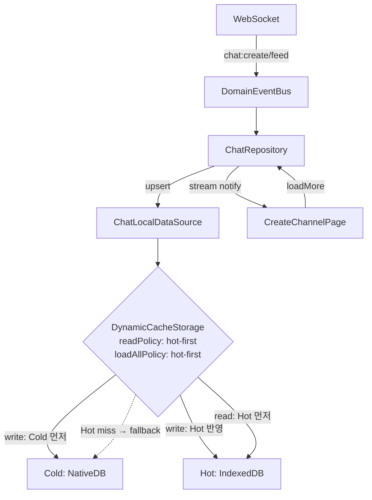

### 4.2 실시간 메시지 수신


### 4.3 채팅방 진입 — Hot 비어있음 (최초)


### 4.4 채팅방 진입 — Hot에 데이터 있음 (재방문)

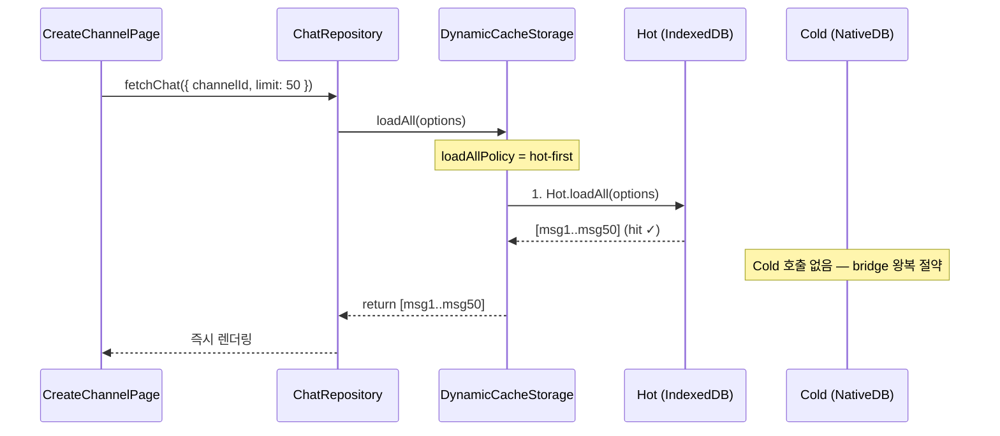

### 4.5 Gap 동기화

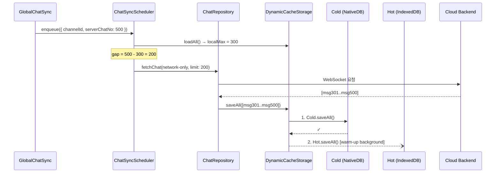

---

## 5. 에러 처리

### 5.1 에러 전파 규칙

| 시나리오                    | 동작                                          | 근거                   |
| --------------------------- | --------------------------------------------- | ---------------------- |
| Hot read/write/delete 에러  | `CacheErrorReporter` 기록, 삼킴               | Hot은 파생 캐시        |
| Cold read/write/delete 에러 | **상위 전파** + reporter 기록 (부가)          | Cold = Source of Truth |
| Eviction 에러               | reporter 기록 (tier='eviction'), save는 성공  | Hot=파생캐시 원칙      |
| Stampede timeout            | `StampedeTimeoutError` reject + reporter 기록 | caller 식별 가능       |

### 5.2 CacheErrorReporter 호출 보호

```typescript
private safeReport(error: unknown, context: CacheErrorContext): void {
    try {
        this.reporter?.(error, context);
    } catch {
        // 의도적 무시 — reporter 오류는 silent
    }
}
```

Reporter 구현체가 throw해도 DCS 동작에 영향을 주지 않습니다.

### 5.3 Stale 데이터

- 삭제 경로: Cold 성공 후 Hot 무효화를 await하여 race 최소화
- Hot 무효화 실패 시: stale 잔존 가능 → reporter 기록
- stale 민감 타입: `PolicyResolver`에서 `'cold-first'`로 Hot 우회

### 5.4 `__cacheMeta` 확장 — `lastAccessedAt`

`createTtlMeta()`를 확장하여 `lastAccessedAt: number` 필드를 추가합니다. EvictionStrategy 구현체가 LRU 판정에 사용합니다.

**Write amplification 회피**: load 시점에 IDB write를 하지 않고 **in-memory pending Map**에만 기록합니다.

| Trigger          | 시점                  | 우선순위    | 비고                            |
| ---------------- | --------------------- | ----------- | ------------------------------- |
| **A (Primary)**  | onAfterWrite 직전     | 항상 시도   | `isFlushing` 플래그로 중복 방지 |
| **B (Fallback)** | idle timer (예: 60초) | A 미발생 시 | A 발생 시 timer reset           |
| **C (Last)**     | visibility hidden 등  | 페이지 이탈 | 동기적 flush 시도, 실패 허용    |

---

## 6. `localFactory.ts` 변경

```typescript
export const isNativeApp = (): boolean => {
    return typeof window !== 'undefined' && !!(window as any).ReactNativeWebView;
};

const selectStrategy = (): CacheStorageStrategy =>
    isNativeApp() ? new HotColdCacheStorageStrategy(webBridge) : new IndexedDbOnlyCacheStorageStrategy();

export const getCacheStorage = <TType extends CacheType>(
    type: TType,
    contextProvider: DataContextProvider
): CacheStorage<TType> => selectStrategy().create(type, contextProvider);
```

### Runtime assertion — PolicyResolver 필수

```typescript
// HotColdCacheStorageStrategy.create 내부
if (!options.policyResolver) {
    if (process.env.NODE_ENV === 'production') {
        throw new Error('[DynamicCacheStorage] PolicyResolver 필수.');
    }
    console.warn(
        '[DynamicCacheStorage] PolicyResolver 미주입 — DefaultPolicyResolver(cold-first 일괄) 사용. 운영 전 PolicyResolver 주입 필수.'
    );
}
```

- **production 빌드에서 미주입 시 runtime error** (CI 통합 테스트가 catch)
- dev/test에서는 console.warn + DefaultPolicyResolver(cold-first) 적용

### onStartup 호출

DCS 인스턴스 생성 직후 `evictionStrategy.onStartup(hot)`을 **fire-and-forget**으로 호출합니다 (앱 시작 지연 방지). 실패 시 reporter에 `tier='eviction'`으로 기록합니다.

---

## 7. 검증 전략

### 7.1 검증 대상과 범위

`DynamicCacheStorage`는 DB에 직접 접근하지 않고 두 개의 `CacheStorage` 어댑터를 조합하는 **순수 오케스트레이션 로직**입니다. 검증해야 할 것은 "Hot/Cold 간 호출 순서, fallback 분기, 에러 전파/삼킴이 명세대로 동작하는가"입니다.

#### 검증 수단 3가지

| 수단               | 대상                                         | 담당               | 실행 시점      |
| ------------------ | -------------------------------------------- | ------------------ | -------------- |
| **1. 단위 테스트** | DynamicCacheStorage 오케스트레이션 로직      | 개발자             | PR 머지 전, CI |
| **2. 런타임 로깅** | 실제 앱에서 Hot/Cold fallback·에러 발생 빈도 | CacheErrorReporter | 배포 후 상시   |
| **3. 수동 QA**     | 앱 WebView에서 체감 성능·정합성              | QA                 | 릴리즈 전      |

각 수단의 구체적인 내용을 아래에 서술합니다.

---

### 7.2 단위 테스트 (Jest)

#### 목적

Hot/Cold 호출 순서, fallback 분기, 에러 삼킴/전파, background save 발생 여부를 **자동화된 테스트로 확인**합니다. 이 프로젝트는 Jest 기반이며, 기존 어댑터 테스트(`IndexedDBAdapter.test.ts`, `NativeDBAdapter.test.ts`)와 동일한 패턴을 따릅니다.

#### 파일 위치

```
libs/data/src/data/local/storages/DynamicCacheStorage.test.ts
```

#### 테스트 인프라

**MockCacheStorage**: `jest.fn()`으로 `CacheStorage<TType>` 인터페이스의 각 메서드를 mock합니다. 실제 DB 없이 호출 여부·순서·인자를 검증합니다.

```typescript
const createMockStorage = () => ({
    save: jest.fn().mockImplementation((_id, item) => Promise.resolve(item)),
    saveAll: jest.fn().mockImplementation(items => Promise.resolve(items)),
    load: jest.fn().mockResolvedValue(null),
    loadAll: jest.fn().mockResolvedValue([]),
    delete: jest.fn().mockResolvedValue(undefined),
    deleteAll: jest.fn().mockResolvedValue(undefined),
    clearAll: jest.fn().mockResolvedValue(undefined),
    clearByChannelId: jest.fn().mockResolvedValue(undefined),
});
```

**Reporter spy**: 4-tier 에러 기록 검증용.

```typescript
const reporter = jest.fn();
```

**flushMicrotasks**: fire-and-forget Promise가 settled 되기를 기다리는 유틸.

```typescript
const flushMicrotasks = () => new Promise(resolve => setTimeout(resolve, 0));
```

#### 시나리오 목록

아래 시나리오를 각각 하나의 `it()` 블록으로 작성합니다.

##### Read (R1–R8)

| ID  | 시나리오                            | 검증 포인트                                                                        |
| --- | ----------------------------------- | ---------------------------------------------------------------------------------- |
| R1  | `load()` Hot hit                    | 반환값 정확, Cold.load 미호출                                                      |
| R2  | `load()` Hot miss → Cold hit        | 반환값 정확, background Hot.save 발생 (flushMicrotasks 후 확인)                    |
| R3  | `load()` 양쪽 miss                  | null 반환, Hot·Cold 각 1회 호출                                                    |
| R4  | `load()` Hot 에러 → Cold fallback   | 반환값 정확, reporter 1회 호출 `{ tier:'hot', operation:'load' }`, 상위 throw 없음 |
| R5  | `loadAll()` cold-first              | Cold만 조회, Hot.loadAll 미호출, background Hot.saveAll warm-up 발생               |
| R6  | `loadAll()` hot-first — Hot hit     | Hot 결과 반환, Cold.loadAll 미호출                                                 |
| R7  | `loadAll()` hot-first — Hot 빈 배열 | Cold fallback 결과 반환, background Hot.saveAll warm-up 발생                       |
| R8  | `loadAll()` hot-first — Hot 에러    | Cold fallback 결과 반환, reporter 1회 호출 `{ tier:'hot', operation:'loadAll' }`   |

##### Write (W1–W3)

| ID  | 시나리오           | 검증 포인트                                                                  |
| --- | ------------------ | ---------------------------------------------------------------------------- |
| W1  | `save()` 정상      | Cold.save 호출 → 반환값 정확, background Hot.save 발생                       |
| W2  | `save()` Cold 에러 | 에러 상위 전파, Hot.save 미호출                                              |
| W3  | `save()` Hot 에러  | 반환값 정상 (Cold 성공), reporter 1회 호출 `{ tier:'hot' }`, 상위 throw 없음 |

##### Delete (D1–D4)

| ID  | 시나리오             | 검증 포인트                                                          |
| --- | -------------------- | -------------------------------------------------------------------- |
| D1  | `delete()` 정상      | Cold.delete 1회 + Hot.delete 1회 (await best-effort)                 |
| D2  | `delete()` Cold 에러 | 에러 상위 전파, Hot.delete 미호출                                    |
| D3  | `delete()` Hot 에러  | 정상 resolve, reporter 1회 호출 `{ tier:'hot', operation:'delete' }` |
| D4  | `clearAll()` 정상    | Cold.clearAll + Hot.clearAll 각 1회                                  |

##### 통합 흐름 (I1–I5)

| ID  | 시나리오                        | 검증 포인트                                                    |
| --- | ------------------------------- | -------------------------------------------------------------- |
| I1  | save → load                     | save 후 Hot에 데이터 존재 → load 시 Cold 미조회 (Hot hit)      |
| I2  | save → delete → load            | 삭제 후 양쪽 모두 데이터 없음 → null 반환                      |
| I3  | saveAll → loadAll (hot-first)   | 연속 쓰기 후 Hot hit, Cold.loadAll 미호출                      |
| I4  | 최초 loadAll → warm-up → 재조회 | 1차: Cold fallback, 2차: Hot hit (Cold.loadAll 추가 호출 없음) |
| I5  | Hot 전면 장애                   | 모든 CRUD가 Cold만으로 정상 동작, reporter 매 조작마다 호출    |

##### cursorNo 분기 (C1–C3)

| ID  | 시나리오                               | 검증 포인트                                               |
| --- | -------------------------------------- | --------------------------------------------------------- |
| C1  | `loadAll({ cursorNo: 500 })`           | Hot.loadAll 미호출, Cold.loadAll만 호출 (강제 cold-first) |
| C2  | `loadAll({ cursorNo: 0 })`             | cursorNo != null → cold-first (페이지네이션 명시 의도)    |
| C3  | `loadAll({ limit: 50 })` cursorNo 없음 | PolicyResolver.resolveLoadAllPolicy 결과에 따라 분기      |

##### Stampede 가드 (S1–S4)

| ID  | 시나리오                   | 검증 포인트                                                    |
| --- | -------------------------- | -------------------------------------------------------------- |
| S1  | 동시 `loadAll(opts)` 2회   | Cold.loadAll 1회만 호출, 두 caller 같은 결과                   |
| S2  | in-flight reject 후 재호출 | 새 Promise 생성 (재시도 허용)                                  |
| S3  | `STAMPEDE_TIMEOUT_MS` 초과 | `StampedeTimeoutError` reject, `err.queryKey`/`elapsedMs` 접근 |
| S4  | 동시 `save` 2회            | 가드 적용 없음, Cold.save 2회 호출 (mutation은 caller 책임)    |

##### Eviction 호출 계약 (E1–E5)

| ID  | 시나리오                               | 검증 포인트                                                 |
| --- | -------------------------------------- | ----------------------------------------------------------- |
| E1  | `saveAll([item1])` 정상                | Hot.saveAll 완료 후 onAfterWrite 호출 (병렬 아님)           |
| E2  | `saveAll([])` 빈 배열                  | onAfterWrite 미호출                                         |
| E3  | Hot.save `QuotaExceededError`          | onQuotaExceeded 호출, onAfterWrite 미호출, save 자체는 성공 |
| E4  | onAfterWrite 자체가 throw              | reporter `tier='eviction'` 기록, save는 정상 resolve        |
| E5  | factory에서 PolicyResolver 미주입+prod | Error throw ("PolicyResolver 필수")                         |

##### Reporter 통합 (P1–P3)

| ID  | 시나리오              | 검증 포인트                                                       |
| --- | --------------------- | ----------------------------------------------------------------- |
| P1  | Hot.load 에러         | reporter 호출 `{ tier:'hot', operation:'load' }`                  |
| P2  | Reporter 자체가 throw | DCS 동작 영향 없음 (safeReport), Cold fallback 정상               |
| P3  | Stampede timeout      | reporter 호출 `{ tier:'stampede', operation:'stampede-timeout' }` |

#### 테스트 코드 예시

아래는 핵심 시나리오의 테스트 코드 형태입니다. 전체 시나리오는 동일한 패턴으로 확장합니다.

```typescript
import { DynamicCacheStorage } from './DynamicCacheStorage';
import type { CacheStorage } from './types';

const flushMicrotasks = () => new Promise(resolve => setTimeout(resolve, 0));

const createMockStorage = (): jest.Mocked<CacheStorage<'chat'>> => ({
    save: jest.fn().mockImplementation((_id, item) => Promise.resolve(item)),
    saveAll: jest.fn().mockImplementation(items => Promise.resolve(items)),
    load: jest.fn().mockResolvedValue(null),
    loadAll: jest.fn().mockResolvedValue([]),
    delete: jest.fn().mockResolvedValue(undefined),
    deleteAll: jest.fn().mockResolvedValue(undefined),
    clearAll: jest.fn().mockResolvedValue(undefined),
    clearByChannelId: jest.fn().mockResolvedValue(undefined),
});

const item = (id: string) => ({ id, channelId: 'ch-1', text: `msg-${id}` }) as any;

describe('DynamicCacheStorage', () => {
    let mockHot: jest.Mocked<CacheStorage<'chat'>>;
    let mockCold: jest.Mocked<CacheStorage<'chat'>>;
    let reporter: jest.Mock;

    beforeEach(() => {
        mockHot = createMockStorage();
        mockCold = createMockStorage();
        reporter = jest.fn();
    });

    const createDCS = (overrides = {}) =>
        new DynamicCacheStorage(mockHot, mockCold, {
            type: 'chat',
            readPolicy: 'hot-first',
            loadAllPolicy: 'hot-first',
            reporter,
            ...overrides,
        });

    // ── R1: load() Hot hit ──
    it('load — Hot hit이면 Cold를 조회하지 않는다', async () => {
        mockHot.load.mockResolvedValueOnce(item('1'));
        const dcs = createDCS();

        const result = await dcs.load('1');

        expect(result).toMatchObject(item('1'));
        expect(mockCold.load).not.toHaveBeenCalled();
    });

    // ── R2: load() Hot miss → Cold hit → background Hot.save ──
    it('load — Hot miss 시 Cold fallback 후 background로 Hot에 저장한다', async () => {
        mockHot.load.mockResolvedValueOnce(null);
        mockCold.load.mockResolvedValueOnce(item('1'));
        const dcs = createDCS();

        const result = await dcs.load('1');
        await flushMicrotasks();

        expect(result).toMatchObject(item('1'));
        expect(mockHot.save).toHaveBeenCalledWith('1', item('1'));
    });

    // ── R4: load() Hot 에러 → Cold fallback, reporter 호출 ──
    it('load — Hot 에러 시 Cold fallback + reporter 호출, 상위에 throw하지 않는다', async () => {
        mockHot.load.mockRejectedValueOnce(new Error('IDB crash'));
        mockCold.load.mockResolvedValueOnce(item('1'));
        const dcs = createDCS();

        const result = await dcs.load('1');

        expect(result).toMatchObject(item('1'));
        expect(reporter).toHaveBeenCalledTimes(1);
        expect(reporter).toHaveBeenCalledWith(
            expect.any(Error),
            expect.objectContaining({ tier: 'hot', operation: 'load' })
        );
    });

    // ── W2: save() Cold 에러 → 상위 전파, Hot 미호출 ──
    it('save — Cold 에러는 상위에 그대로 전파하고 Hot은 호출하지 않는다', async () => {
        mockCold.save.mockRejectedValueOnce(new Error('SQLite write fail'));
        const dcs = createDCS();

        await expect(dcs.save('1', item('1'))).rejects.toThrow('SQLite write fail');
        expect(mockHot.save).not.toHaveBeenCalled();
    });

    // ── D1: delete() 정상 — Cold 먼저, Hot await best-effort ──
    it('delete — Cold 삭제 후 Hot 삭제를 await한다', async () => {
        const dcs = createDCS();

        await dcs.delete('1');

        expect(mockCold.delete).toHaveBeenCalledWith('1');
        expect(mockHot.delete).toHaveBeenCalledWith('1');
    });

    // ── I4: 최초 loadAll → warm-up → 재진입 Hot hit ──
    it('loadAll — 최초 Cold fallback 후 warm-up, 재조회 시 Hot hit', async () => {
        // 1차: Hot 빈 배열, Cold에 데이터 있음
        mockHot.loadAll.mockResolvedValueOnce([]);
        mockCold.loadAll.mockResolvedValueOnce([item('1'), item('2')]);
        // warm-up 후 2차 Hot 조회 시 데이터 반환되도록 설정
        mockHot.loadAll.mockResolvedValueOnce([item('1'), item('2')]);
        const dcs = createDCS();

        const first = await dcs.loadAll();
        await flushMicrotasks();
        const second = await dcs.loadAll();

        expect(first).toHaveLength(2);
        expect(second).toHaveLength(2);
        // Cold.loadAll은 1차에서 1번만 호출됨
        expect(mockCold.loadAll).toHaveBeenCalledTimes(1);
    });

    // ── I5: Hot 전면 장애 — 모든 CRUD가 Cold만으로 동작 ──
    it('Hot 전면 장애 시 모든 CRUD가 Cold만으로 정상 동작한다', async () => {
        mockHot.save.mockRejectedValue(new Error('IDB dead'));
        mockHot.load.mockRejectedValue(new Error('IDB dead'));
        mockHot.loadAll.mockRejectedValue(new Error('IDB dead'));
        mockHot.delete.mockRejectedValue(new Error('IDB dead'));
        mockCold.load.mockResolvedValue(item('1'));
        mockCold.loadAll.mockResolvedValue([item('1')]);
        const dcs = createDCS();

        const saved = await dcs.save('1', item('1'));
        await flushMicrotasks();
        const loaded = await dcs.load('1');
        const list = await dcs.loadAll();
        await dcs.delete('1');

        expect(saved).toMatchObject(item('1'));
        expect(loaded).toMatchObject(item('1'));
        expect(list).toHaveLength(1);
        expect(reporter).toHaveBeenCalled();
    });
});
```

#### 실행 방법

```bash
npx nx test data --testPathPattern='DynamicCacheStorage'
```

---

### 7.3 런타임 로깅 (배포 후 모니터링)

#### 목적

단위 테스트는 로직 정확성을 보장하지만, **실제 앱 환경에서 Hot이 얼마나 자주 실패하는지, fallback이 얼마나 발생하는지**는 런타임에서만 알 수 있습니다.

#### 수단

`CacheErrorReporter`가 hot/cold/eviction/stampede 4-tier 에러를 통합 수집합니다.

```typescript
// cacheStorageStrategies.ts — 기본 구현
reporter: (error, context) => {
    console.warn(`[DynamicCacheStorage] ${context.tier} error:`, context.operation, error);
};
```

#### 확인 항목

| 항목                     | 정상 기대치                  | 이상 징후                                     |
| ------------------------ | ---------------------------- | --------------------------------------------- |
| Hot error 빈도           | 0 또는 극소                  | 반복 발생 → IndexedDB quota/corruption 의심   |
| Eviction error 빈도      | 0                            | IDB transaction abort → eviction 구현 점검    |
| Stampede timeout 빈도    | 0                            | Cold bridge 지연 → `STAMPEDE_TIMEOUT_MS` 조정 |
| error가 발생한 operation | —                            | 특정 operation에 집중 시 해당 경로 점검       |
| 앱 시작 직후 Hot miss율  | 첫 진입 시 100% (warm-up 전) | 재방문에도 계속 miss → warm-up 실패 의심      |

#### 향후 확장

`console.warn` → Sentry/DataDog 등 서버 로그 수집으로 전환하면 배포 후 Hot 장애를 대시보드에서 모니터링할 수 있습니다. Reporter 구현체를 교체하면 됩니다.

---

### 7.4 수동 QA (앱 WebView)

#### 목적

단위 테스트와 로깅이 커버하지 못하는 **실제 체감 성능과 정합성**을 확인합니다. 특히 브릿지 통신 지연, WebView 메모리 제약 등 실환경 요인을 검증합니다.

#### 체크리스트

| #   | 시나리오                      | 조작                                     | 확인 항목                                            |
| --- | ----------------------------- | ---------------------------------------- | ---------------------------------------------------- |
| Q1  | 앱 최초 실행 (Hot 비어있음)   | 채팅방 진입                              | 채팅 목록 정상 렌더링 (Cold → Hot warm-up)           |
| Q2  | 앱 재실행 (Hot에 데이터 있음) | 같은 채팅방 재진입                       | 이전 대비 로딩 체감 개선 (Hot hit, 브릿지 왕복 없음) |
| Q3  | 채팅방에서 메시지 송수신      | 메시지 전송 후 앱 종료 → 재실행          | 보낸 메시지가 그대로 존재 (Cold에 저장됨)            |
| Q4  | Place 전환                    | Place A → Place B → Place A              | 각 Place의 채널/채팅이 정확히 표시 (scope isolation) |
| Q5  | Cloud 전환                    | Cloud 변경                               | 이전 Cloud의 데이터가 섞이지 않음                    |
| Q6  | 오프라인 → 온라인             | 비행기 모드 전환                         | 캐시된 데이터 즉시 표시, 온라인 복구 후 동기화       |
| Q7  | IndexedDB 수동 삭제           | DevTools에서 IndexedDB 삭제 후 앱 재실행 | Cold에서 복구되어 정상 동작 (Hot = 파생 캐시 원칙)   |

#### 성능 비교 측정

| 측정 항목                    | 방법                                               | before (NativeDB 단독) | after (Hot/Cold 2-Tier) |
| ---------------------------- | -------------------------------------------------- | ---------------------- | ----------------------- |
| 채팅방 진입 → 첫 메시지 렌더 | DevTools Performance 또는 `performance.now()` 로그 | (측정값 기입)          | (측정값 기입)           |
| 채널 목록 로드               | 같은 방법                                          | (측정값 기입)          | (측정값 기입)           |

> 성능 측정값은 QA 진행 시 기입합니다. 유의미한 개선이 없을 경우 `readPolicy`/`loadAllPolicy` 조정을 검토합니다.

---

### 7.5 검증 범위 밖 (이 명세에서 다루지 않는 것)

| 항목                                              | 이유                                                            |
| ------------------------------------------------- | --------------------------------------------------------------- |
| IndexedDBAdapter / NativeDBAdapter 단위 동작      | 각 어댑터의 자체 테스트 영역 (`db-adapter-refactoring.md` 소관) |
| 실제 IndexedDB / SQLite I/O 성능 벤치마크         | 별도 성능 테스트 계획 필요                                      |
| WebSocket → Repository → DynamicCacheStorage 연쇄 | end-to-end 통합 테스트 영역                                     |
| 브라우저 환경 (IndexedDbOnlyStrategy)             | DynamicCacheStorage 미사용, 기존 동작 그대로                    |

---

## 8. 파일 변경 목록

| 유형 | 파일                                                            | 내용                                                         |
| ---- | --------------------------------------------------------------- | ------------------------------------------------------------ |
| 신규 | `libs/data/src/data/local/storages/DynamicCacheStorage.ts`      | DynamicCacheStorage 구현 (cursorNo 분기, stampede, eviction) |
| 신규 | `libs/data/src/data/local/storages/dynamicCacheTypes.ts`        | 인터페이스 5종 + StampedeTimeoutError                        |
| 신규 | `libs/data/src/data/local/storages/defaultPolicies.ts`          | Default 구현체 3종 (PolicyResolver, Eviction, Capacity)      |
| 신규 | `libs/data/src/data/local/storages/stableHash.ts`               | stableHash 유틸                                              |
| 신규 | `libs/data/src/data/local/storages/DynamicCacheStorage.test.ts` | 단위 테스트                                                  |
| 신규 | `libs/data/src/data/local/storages/stableHash.test.ts`          | stableHash 테스트                                            |
| 신규 | `apps/web/src/app/shared/data/cacheStorageStrategies.ts`        | Strategy 구현체                                              |
| 수정 | `libs/data/src/data/local/storages/index.ts`                    | export 추가                                                  |
| 수정 | `libs/data/src/data/local/storages/utils.ts`                    | `createTtlMeta`에 `lastAccessedAt` 추가                      |
| 수정 | `libs/data/src/data/local/storages/types.ts`                    | `CacheTtlMeta` 타입에 `lastAccessedAt` 필드                  |
| 수정 | `libs/data/src/data/local/storages/IndexedDBAdapter.ts`         | 메타 read/write (필드 추가만)                                |
| 수정 | `apps/web/src/app/shared/data/localFactory.ts`                  | `isNativeApp()` 실제 감지 + 전략 선택 + runtime assertion    |

---

## 9. 향후 확장

- **Hot TTL 검증**: Hot 조회 시 TTL 만료 → Cold fallback
- **앱 시작 시 전체 warm-up**: Cold → Hot pre-load
- **Hot schema versioning**: 앱 버전 변경 시 Hot clear + re-warm
- **NativeDBAdapter bridge retry 정책**: Cold 안정성 강화 (별도 spec)
- **stableHash SHA-256 교체**: 운영 중 key 길이로 인한 Map 메모리 부담 시 검토

### 앱팀 후속 작업 (TBD)

본 명세의 인터페이스 구현체를 앱팀이 작성해야 합니다:

| ID    | 작성 대상                            | 구현 인터페이스                            |
| ----- | ------------------------------------ | ------------------------------------------ |
| TBD-1 | Type별 capacity cap 수치             | `CapacityPolicy.getLimit(type)`            |
| TBD-2 | Type별 readPolicy/loadAllPolicy 분류 | `PolicyResolver` 구현체                    |
| TBD-3 | chat per-channel 그룹핑 키 추출      | `CapacityPolicy.getGroupKey('chat', item)` |
| TBD-4 | Startup TTL sweep 실행 방식          | `EvictionStrategy.onStartup(hot)`          |
| TBD-5 | Quota 감지 방식                      | `EvictionStrategy.onQuotaExceeded`         |
| TBD-6 | `STAMPEDE_TIMEOUT_MS = 5000` 적정성  | 운영 측정 후 조정                          |
