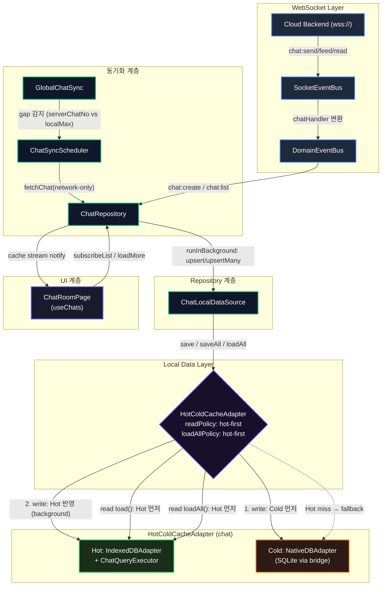
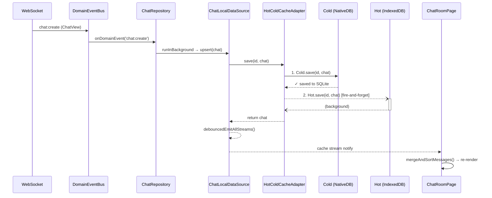
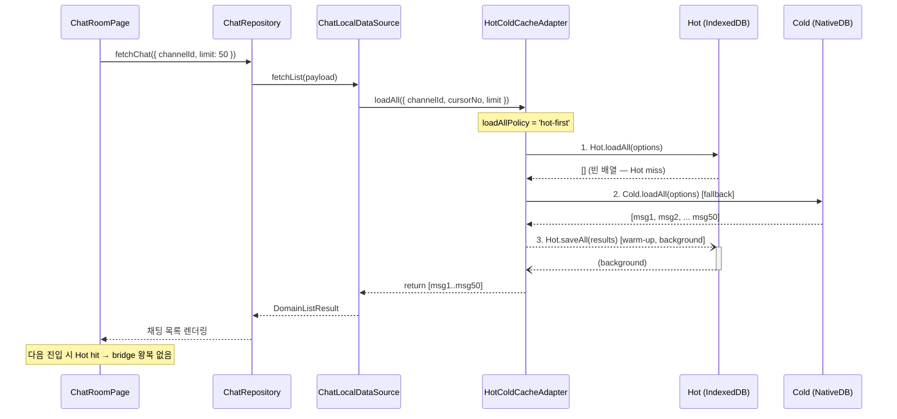
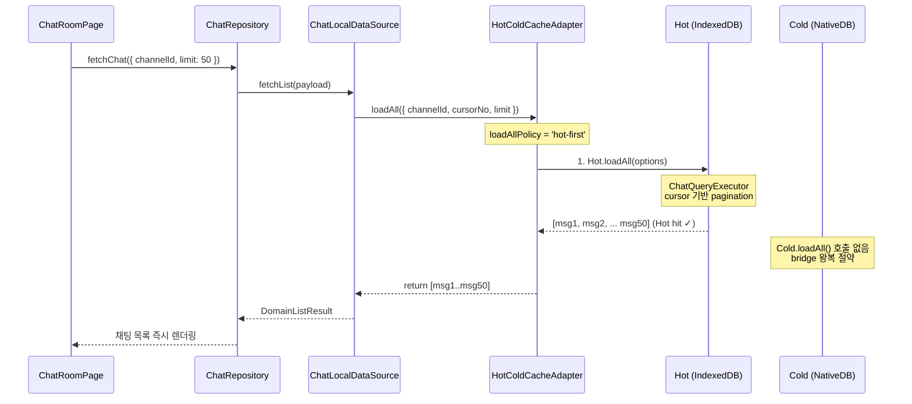
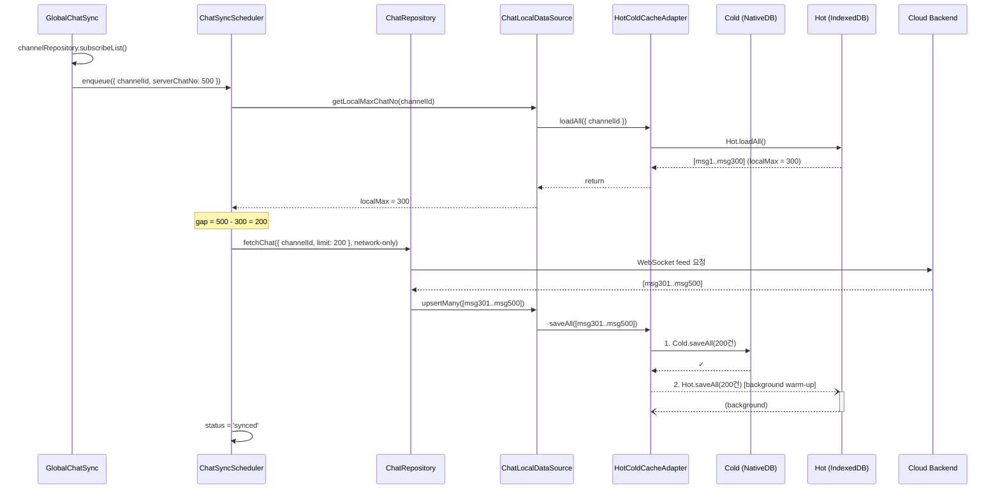
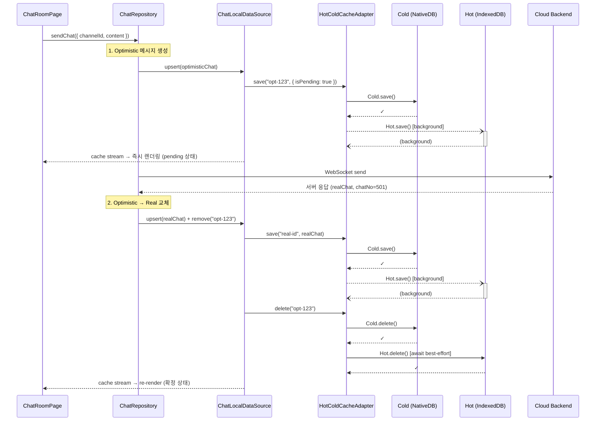

# Hot/Cold 2-Tier Cache Strategy 명세서

본 문서는 `db-adapter-refactoring.md`에서 완성한 어댑터 아키텍처 위에 **Hot/Cold 2-Tier 캐시 전략**을 추가하는 구현 명세입니다.

---

## 1. 개요

### 1.1 배경

| 환경            | 현재                  | 목표                                   |
| --------------- | --------------------- | -------------------------------------- |
| **웹 브라우저** | IndexedDB 단독        | IndexedDB 단독 (변경 없음)             |
| **앱 WebView**  | NativeDB(SQLite) 단독 | Hot(IndexedDB) + Cold(NativeDB) 2-Tier |

앱 WebView 환경에서 NativeDB(SQLite)는 브릿지 통신 오버헤드로 읽기 지연이 발생합니다. IndexedDB를 **파생 캐시(Hot)**로 앞단에 배치하여 읽기 성능을 개선하고, NativeDB(SQLite)는 **영구 저장소(Cold, Source of Truth)**로 유지합니다.

### 1.2 핵심 원칙

1. **Cold가 Source of Truth** — 모든 쓰기는 Cold 먼저, 성공 후 Hot 반영
2. **Hot은 파생 캐시** — Hot 데이터 유실은 Cold에서 복구 가능하며, 상위 계층은 Hot을 truth로 보지 않음
3. **전략 객체로 조립** — `localFactory.ts`는 런타임만 판별하고, 실제 저장소 조합은 `CacheStorageStrategy`가 담당
4. **인터페이스 투명성** — `HotColdCacheAdapter`는 기존 `CacheStorage<TType>` 인터페이스를 그대로 구현하여 상위 계층에 영향 없음
5. **Hot 실패는 비치명적** — Hot 쓰기/삭제 실패 시 상위로 전파하지 않되, 디버깅을 위해 reporter/logger에 기록 가능
6. **삭제 계열은 stale 방지 우선** — `delete`, `deleteAll`, `clearAll`은 Cold 성공 후 Hot 무효화를 best-effort로 기다린 뒤 반환

---

## 2. 아키텍처

### 2.1 계층 구조

```
┌─────────────────────────────────────────────────────────┐
│  DataSource / Repository (상위 비즈니스 계층)             │
│  — CacheStorage<TType> 인터페이스만 의존                  │
└────────────────────┬────────────────────────────────────┘
                     │
         ┌───────────┴───────────┐
         │    localFactory.ts    │
         │ (환경 분기 + 전략 선택) │
         └───────────┬───────────┘
                     │
          ┌──────────┼──────────┐
          │ isNativeApp()?      │
          │                     │
     ┌────▼─────┐        ┌─────▼──────────────┐
     │ IndexedDB │        │ HotColdCacheAdapter │
     │ Adapter   │        │                     │
     │ (웹 전용)  │        │  ┌──Hot──────────┐  │
     └──────────┘        │  │ IndexedDBAdapter│  │
                          │  └────────────────┘  │
                          │  ┌──Cold─────────┐  │
                          │  │ NativeDBAdapter│  │
                          │  └────────────────┘  │
                          └──────────────────────┘
```

### 2.2 클래스 구조

```mermaid
classDiagram
    class CacheStorage~TType~ {
        <<interface>>
    }

    class HotColdCacheAdapter~TType~ {
        -hot: CacheStorage~TType~
        -cold: CacheStorage~TType~
        +save(id, item)
        +saveAll(items)
        +load(id)
        +loadAll(options?)
        +delete(id)
        +deleteAll(ids)
        +clearAll()
    }

    class IndexedDBAdapter~TType~ {
        (Hot — 파생 캐시)
    }

    class NativeDBAdapter~TType~ {
        (Cold — Source of Truth)
    }

    CacheStorage~TType~ <|.. HotColdCacheAdapter~TType~ : implements
    CacheStorage~TType~ <|.. IndexedDBAdapter~TType~ : implements
    CacheStorage~TType~ <|.. NativeDBAdapter~TType~ : implements

    HotColdCacheAdapter~TType~ --> IndexedDBAdapter~TType~ : hot
    HotColdCacheAdapter~TType~ --> NativeDBAdapter~TType~ : cold
```

### 2.3 Strategy 객체

런타임 분기와 DB 조립 로직이 `localFactory.ts`에 커지지 않도록 저장소 조합을 전략 객체로 분리합니다.

```typescript
export interface CacheStorageStrategy {
    create<TType extends CacheType>(type: TType, contextProvider: DataContextProvider): CacheStorage<TType>;
}

export class IndexedDbOnlyCacheStorageStrategy implements CacheStorageStrategy {
    // Browser: IndexedDB 단독
}

export class NativeDbOnlyCacheStorageStrategy implements CacheStorageStrategy {
    // 필요 시 NativeDB 단독 운용 또는 fallback 검증용
}

export class HotColdCacheStorageStrategy implements CacheStorageStrategy {
    // App WebView: Hot(IndexedDB) + Cold(NativeDB)
}
```

전략별 책임:

| Strategy                            | 사용 환경                     | 조합                                                              |
| ----------------------------------- | ----------------------------- | ----------------------------------------------------------------- |
| `IndexedDbOnlyCacheStorageStrategy` | 일반 웹 브라우저              | `IndexedDBAdapter`                                                |
| `NativeDbOnlyCacheStorageStrategy`  | Hot 비활성화 또는 비교 테스트 | `NativeDBAdapter`                                                 |
| `HotColdCacheStorageStrategy`       | 앱 WebView                    | `HotColdCacheAdapter(hot=IndexedDBAdapter, cold=NativeDBAdapter)` |

---

## 3. 데이터 흐름

### 3.1 Read — `load(id)`

```
1. Hot.load(id)
2. Hit? → return item
3. Miss? → Cold.load(id)
4. Cold Hit? → Hot.save(id, item) [background best-effort] → return item
5. Cold Miss? → return null
```

**Hot 에러 시**: Hot.load() 예외 → reporter 기록 → Cold.load()로 fallback

### 3.2 Read — `loadAll(options?)`

#### `loadAllPolicy: 'cold-first'` (기본값)

```
1. Cold.loadAll(options)         ← Cold가 Source of Truth
2. results.length > 0?
   → Hot.saveAll(results) [background best-effort]
3. return results
```

> 기본적으로 `loadAll`은 Cold에서 조회합니다. 쿼리 옵션(pagination 등)이 Hot과 Cold에서 다르게 작동할 수 있으므로, 정합성을 위해 Cold를 단일 소스로 사용합니다.

#### `loadAllPolicy: 'hot-first'`

```
1. Hot.loadAll(options)          ← Hot에서 먼저 조회
2. Hit(결과 > 0)? → return results
3. Miss(빈 배열)? → Cold.loadAll(options) → Cold 결과 반환
4. Cold results.length > 0?
   → Hot.saveAll(results) [background best-effort]
5. return Cold results
```

> chat처럼 append-only이고 Hot에서도 동일한 쿼리 실행이 가능한 타입(`ChatQueryExecutor`)에 적합합니다. feed로 `save()`할 때 이미 Hot에 데이터가 쌓이므로, 대부분의 경우 Hot hit으로 bridge 왕복 없이 즉시 반환됩니다.

### 3.3 Write — `save(id, item)`

```
1. Cold.save(id, item)          ← 반드시 Cold 먼저
2. 성공 → Hot.save(id, item) [background best-effort]
3. return item
```

**Cold 에러 시**: 예외를 상위로 전파 (Hot 쓰기 하지 않음)

### 3.4 Write — `saveAll(items)`

```
1. Cold.saveAll(items)          ← 반드시 Cold 먼저
2. 성공 → Hot.saveAll(items) [background best-effort]
3. return items
```

### 3.5 Delete — `delete(id)` / `deleteAll(ids)`

```
1. Cold.delete(id)              ← 반드시 Cold 먼저
2. 성공 → Hot.delete(id) [await best-effort]
3. Hot 삭제 실패 시 에러 기록 후 삼킴
```

삭제는 Hot에 오래된 값이 남으면 다음 `load(id)`에서 stale hit이 발생할 수 있습니다. 따라서 `save`와 달리 Hot 무효화를 기다려 race window를 줄입니다. 단, Hot은 캐시이므로 Hot 삭제 실패 자체는 상위로 전파하지 않습니다.

### 3.6 Clear — `clearAll()`

```
1. Cold.clearAll()
2. 성공 → Hot.clearAll() [await best-effort]
3. Hot clear 실패 시 에러 기록 후 삼킴
```

### 3.7 타입별 Read Policy

`HotColdCacheAdapter`는 `load()`와 `loadAll()`에 대해 각각 독립적인 read policy를 주입받을 수 있습니다.

```typescript
export type CacheReadPolicy = 'hot-first' | 'cold-first';

export const defaultCacheReadPolicies: Partial<Record<CacheType, CacheReadPolicy>> = {
    chat: 'hot-first',
    channel: 'hot-first',
    invitecloud: 'hot-first',
    join: 'hot-first',
    site: 'hot-first',
    user: 'hot-first',
};

export const defaultCacheLoadAllPolicies: Partial<Record<CacheType, CacheReadPolicy>> = {
    chat: 'hot-first', // append-only + ChatQueryExecutor로 Hot에서 동일 쿼리 가능
    channel: 'cold-first', // 변경/삭제 빈도 있음
    invitecloud: 'cold-first',
    join: 'cold-first',
    site: 'cold-first',
    user: 'cold-first',
};
```

권장 기준:

| 데이터 성격                                          | `readPolicy` | `loadAllPolicy` | 근거                                     |
| ---------------------------------------------------- | ------------ | --------------- | ---------------------------------------- |
| append 중심, 단건 조회 빈번 (chat)                   | `hot-first`  | `hot-first`     | bridge 비용 절감, Hot에서 동일 쿼리 가능 |
| 변경/삭제가 잦고 stale 노출이 치명적                 | `cold-first` | `cold-first`    | Cold 정합성 우선                         |
| Hot에서 쿼리 실행이 불가능하거나 결과가 다를 수 있음 | `hot-first`  | `cold-first`    | 단건은 Hot, 목록은 Cold                  |

chat `loadAllPolicy: 'hot-first'`의 전제 조건:

- `ChatQueryExecutor`가 IndexedDB에서 Cold와 동일한 cursor 기반 pagination을 수행
- chat은 append-only이므로 feed `save()` 시점에 이미 Hot에 데이터가 쌓여 있음
- 최초 진입(Hot 비어있음) 시에만 Cold fallback 발생

### 3.8 Chat 동기화 흐름과 Hot/Cold 적용

앱 WebView 환경에서 chat 동기화가 Hot/Cold 2-Tier를 통과하는 전체 흐름입니다.

#### 3.8.1 전체 아키텍처



#### 3.8.2 실시간 메시지 수신 (chat:create)

WebSocket에서 새 메시지가 도착했을 때의 흐름입니다.



#### 3.8.3 채팅방 진입 — 최초 (Hot 비어있음)

앱 설치 후 또는 Hot(IndexedDB) 데이터가 없는 상태에서 채팅방에 진입할 때의 흐름입니다.



#### 3.8.4 채팅방 진입 — 재방문 (Hot에 데이터 있음)

feed로 이미 Hot에 데이터가 쌓여 있는 상태에서 채팅방에 진입할 때의 흐름입니다.



#### 3.8.5 Gap 동기화 (ChatSyncScheduler)

`GlobalChatSync`가 서버의 `lastChatNo`와 로컬 `maxChatNo`의 차이를 감지하여 누락 메시지를 채우는 흐름입니다.



#### 3.8.6 Optimistic 메시지 전송

사용자가 메시지를 전송할 때 즉시 UI에 반영하고, 서버 응답 후 실제 메시지로 교체하는 흐름입니다.



#### 3.8.7 환경별 비교 요약

```
┌──────────────────────────────────────────────────────────────┐
│                     웹 브라우저 환경                           │
│                                                              │
│  ChatLocalDataSource                                         │
│       │                                                      │
│       ▼                                                      │
│  IndexedDBAdapter (단독)                                      │
│       │                                                      │
│       ▼                                                      │
│  ┌─────────────┐                                             │
│  │  IndexedDB   │  ← 유일한 저장소                             │
│  └─────────────┘                                             │
└──────────────────────────────────────────────────────────────┘

┌──────────────────────────────────────────────────────────────┐
│                   앱 WebView 환경 (Hot/Cold)                  │
│                                                              │
│  ChatLocalDataSource                                         │
│       │                                                      │
│       ▼                                                      │
│  HotColdCacheAdapter                                         │
│       │                                                      │
│       ├──── write ────┐                                      │
│       │               ▼                                      │
│       │    ┌───────────────────┐                              │
│       │    │ Cold: NativeDB    │ ← Source of Truth            │
│       │    │ (SQLite bridge)   │   write 먼저, 실패 시 전파     │
│       │    └───────────────────┘                              │
│       │               │                                      │
│       │          성공 후 ▼                                     │
│       │    ┌───────────────────┐                              │
│       │    │ Hot: IndexedDB    │ ← 파생 캐시                   │
│       │    │ (fire-and-forget) │   write 실패 삼킴             │
│       │    └───────────────────┘                              │
│       │                                                      │
│       ├──── read (load) ────┐                                │
│       │                     ▼                                │
│       │    ┌───────────────────┐                              │
│       │    │ Hot: IndexedDB    │ ← 먼저 조회 (hot-first)       │
│       │    └───────────────────┘                              │
│       │         hit? → 즉시 반환                               │
│       │         miss? ──▼                                     │
│       │    ┌───────────────────┐                              │
│       │    │ Cold: NativeDB    │ ← fallback + warm-up         │
│       │    └───────────────────┘                              │
│       │                                                      │
│       └──── read (loadAll) ────┐                             │
│                                ▼                             │
│            ┌───────────────────┐                              │
│            │ Hot: IndexedDB    │ ← chat: hot-first            │
│            │ ChatQueryExecutor │   (cursor 기반 pagination)    │
│            └───────────────────┘                              │
│                 hit? → 즉시 반환 (bridge 왕복 없음)              │
│                 miss? ──▼                                     │
│            ┌───────────────────┐                              │
│            │ Cold: NativeDB    │ ← fallback + warm-up         │
│            └───────────────────┘                              │
└──────────────────────────────────────────────────────────────┘
```

---

## 4. 구현 상세

### 4.1 `HotColdCacheAdapter` 클래스

**위치**: `libs/data/src/data/local/storages/HotColdCacheAdapter.ts`

```typescript
import type { CacheModelOf, CacheQueryOf, CacheType } from '@chatic/app-messages';
import type { CacheStorage } from './types';

export type CacheReadPolicy = 'hot-first' | 'cold-first';

export type HotColdCacheOperation = 'save' | 'saveAll' | 'load' | 'loadAll' | 'delete' | 'deleteAll' | 'clearAll';

export interface HotColdCacheAdapterOptions<TType extends CacheType> {
    type?: TType;
    readPolicy?: CacheReadPolicy;
    loadAllPolicy?: CacheReadPolicy;
    warmupChunkSize?: number;
    onHotError?: (error: unknown, context: { type?: TType; operation: HotColdCacheOperation }) => void;
}

/**
 * Hot/Cold 2-Tier 캐시 어댑터.
 *
 * - Hot: IndexedDB (파생 캐시, 유실 허용)
 * - Cold: NativeDB/SQLite (Source of Truth)
 *
 * CacheStorage<TType> 인터페이스를 구현하여 상위 계층에 투명합니다.
 */
export class HotColdCacheAdapter<TType extends CacheType> implements CacheStorage<TType> {
    constructor(
        private readonly hot: CacheStorage<TType>,
        private readonly cold: CacheStorage<TType>,
        private readonly options: HotColdCacheAdapterOptions<TType> = {}
    ) {}

    private get readPolicy(): CacheReadPolicy {
        return this.options.readPolicy ?? 'hot-first';
    }

    private get loadAllPolicy(): CacheReadPolicy {
        return this.options.loadAllPolicy ?? 'cold-first';
    }

    private reportHotError(error: unknown, operation: HotColdCacheOperation): void {
        this.options.onHotError?.(error, {
            type: this.options.type,
            operation,
        });
    }

    private async runHot(
        operation: HotColdCacheOperation,
        task: () => Promise<unknown>,
        mode: 'background' | 'await'
    ): Promise<void> {
        try {
            const work = task().catch(error => {
                this.reportHotError(error, operation);
            });

            if (mode === 'await') {
                await work;
            }
        } catch (error) {
            this.reportHotError(error, operation);
        }
    }

    private warmUp(items: CacheModelOf<TType>[]): void {
        if (items.length === 0) return;

        const chunkSize = this.options.warmupChunkSize;
        if (!chunkSize || items.length <= chunkSize) {
            void this.runHot('saveAll', () => this.hot.saveAll(items), 'background');
            return;
        }

        void this.runHot(
            'saveAll',
            async () => {
                for (let index = 0; index < items.length; index += chunkSize) {
                    await this.hot.saveAll(items.slice(index, index + chunkSize));
                }
            },
            'background'
        );
    }

    async save(id: string, item: CacheModelOf<TType>): Promise<CacheModelOf<TType>> {
        const result = await this.cold.save(id, item);
        void this.runHot('save', () => this.hot.save(id, item), 'background');
        return result;
    }

    async saveAll(items: CacheModelOf<TType>[]): Promise<CacheModelOf<TType>[]> {
        const result = await this.cold.saveAll(items);
        this.warmUp(items);
        return result;
    }

    async load(id: string): Promise<CacheModelOf<TType> | null> {
        if (this.readPolicy === 'hot-first') {
            try {
                const cached = await this.hot.load(id);
                if (cached !== null) return cached;
            } catch (error) {
                this.reportHotError(error, 'load');
            }
        }

        const item = await this.cold.load(id);
        if (item !== null) {
            void this.runHot('save', () => this.hot.save(id, item), 'background');
        }
        return item;
    }

    async loadAll(options?: CacheQueryOf<TType>): Promise<CacheModelOf<TType>[]> {
        if (this.loadAllPolicy === 'hot-first') {
            try {
                const cached = await this.hot.loadAll(options);
                if (cached.length > 0) return cached;
            } catch (error) {
                this.reportHotError(error, 'loadAll');
            }
        }

        const items = await this.cold.loadAll(options);
        this.warmUp(items);
        return items;
    }

    async delete(id: string): Promise<void> {
        await this.cold.delete(id);
        await this.runHot('delete', () => this.hot.delete(id), 'await');
    }

    async deleteAll(ids: string[]): Promise<void> {
        await this.cold.deleteAll(ids);
        await this.runHot('deleteAll', () => this.hot.deleteAll(ids), 'await');
    }

    async clearAll(): Promise<void> {
        await this.cold.clearAll();
        await this.runHot('clearAll', () => this.hot.clearAll(), 'await');
    }
}
```

### 4.2 `CacheStorageStrategy` 구현

**위치**: `apps/web/src/app/shared/data/cacheStorageStrategies.ts`

```typescript
import type { IWebBridgeClient } from '@chatic/bridges';
import type { CacheType } from '@chatic/app-messages';
import {
    type CacheReadPolicy,
    type CacheStorage,
    type DataContextProvider,
    ChatQueryExecutor,
    HotColdCacheAdapter,
    IndexedDBAdapter,
    IndexedDBDatabase,
    NativeDBAdapter,
} from '@chatic/data';

export interface CacheStorageStrategy {
    create<TType extends CacheType>(type: TType, contextProvider: DataContextProvider): CacheStorage<TType>;
}

const defaultReadPolicies: Partial<Record<CacheType, CacheReadPolicy>> = {
    chat: 'hot-first',
    channel: 'hot-first',
    invitecloud: 'hot-first',
    join: 'hot-first',
    site: 'hot-first',
    user: 'hot-first',
};

const defaultLoadAllPolicies: Partial<Record<CacheType, CacheReadPolicy>> = {
    chat: 'hot-first', // append-only + ChatQueryExecutor
    channel: 'cold-first',
    invitecloud: 'cold-first',
    join: 'cold-first',
    site: 'cold-first',
    user: 'cold-first',
};

let sharedDatabase: IndexedDBDatabase | null = null;
const getSharedDatabase = (): IndexedDBDatabase => {
    if (!sharedDatabase) {
        sharedDatabase = new IndexedDBDatabase();
    }
    return sharedDatabase;
};

const createIndexedDbStorage = <TType extends CacheType>(
    type: TType,
    contextProvider: DataContextProvider
): CacheStorage<TType> => {
    const db = getSharedDatabase();

    if (type === 'chat') {
        return new IndexedDBAdapter(
            db,
            'chat',
            contextProvider,
            new ChatQueryExecutor()
        ) as unknown as CacheStorage<TType>;
    }

    return new IndexedDBAdapter(db, type, contextProvider);
};

export class IndexedDbOnlyCacheStorageStrategy implements CacheStorageStrategy {
    create<TType extends CacheType>(type: TType, contextProvider: DataContextProvider): CacheStorage<TType> {
        return createIndexedDbStorage(type, contextProvider);
    }
}

export class NativeDbOnlyCacheStorageStrategy implements CacheStorageStrategy {
    constructor(private readonly bridge: IWebBridgeClient) {}

    create<TType extends CacheType>(type: TType, contextProvider: DataContextProvider): CacheStorage<TType> {
        return new NativeDBAdapter(this.bridge, type, contextProvider);
    }
}

export class HotColdCacheStorageStrategy implements CacheStorageStrategy {
    constructor(
        private readonly bridge: IWebBridgeClient,
        private readonly readPolicies = defaultReadPolicies,
        private readonly loadAllPolicies = defaultLoadAllPolicies,
        private readonly onHotError?: (error: unknown, context: unknown) => void
    ) {}

    create<TType extends CacheType>(type: TType, contextProvider: DataContextProvider): CacheStorage<TType> {
        const hot = createIndexedDbStorage(type, contextProvider);
        const cold = new NativeDBAdapter(this.bridge, type, contextProvider);

        return new HotColdCacheAdapter(hot, cold, {
            type,
            readPolicy: this.readPolicies[type] ?? 'hot-first',
            loadAllPolicy: this.loadAllPolicies[type] ?? 'cold-first',
            warmupChunkSize: 100,
            onHotError: this.onHotError,
        });
    }
}
```

### 4.3 `localFactory.ts` 변경

`localFactory.ts`는 런타임 판별과 전략 선택만 담당합니다.

```typescript
import type { CacheType } from '@chatic/app-messages';
import {
    type CacheStorage,
    createCacheStorages,
    createLocalDataSources,
    type DataContextProvider,
    type LocalDataSources,
} from '@chatic/data';
import { webBridge } from '../bridges';
import { HotColdCacheStorageStrategy, IndexedDbOnlyCacheStorageStrategy } from './cacheStorageStrategies';

export const isNativeApp = (): boolean => {
    return typeof window !== 'undefined' && !!(window as any).ReactNativeWebView;
};

const browserStorageStrategy = new IndexedDbOnlyCacheStorageStrategy();
const nativeStorageStrategy = new HotColdCacheStorageStrategy(webBridge);

const selectCacheStorageStrategy = () => {
    return isNativeApp() ? nativeStorageStrategy : browserStorageStrategy;
};

export const getCacheStorage = <TType extends CacheType>(
    type: TType,
    contextProvider: DataContextProvider
): CacheStorage<TType> => {
    return selectCacheStorageStrategy().create(type, contextProvider);
};
```

### 4.4 Export 추가

**`libs/data/src/data/local/storages/index.ts`**:

```diff
 export * from './types';
 export * from './IndexedDBAdapter';
 export * from './NativeDBAdapter';
+export * from './HotColdCacheAdapter';
```

---

## 5. 에러 처리 정책

| 시나리오            | 동작                          | 근거                                             |
| ------------------- | ----------------------------- | ------------------------------------------------ |
| Hot.load() 에러     | reporter 기록 → Cold fallback | Hot은 캐시, 유실 허용                            |
| Hot.save() 에러     | reporter 기록 후 삼킴         | 다음 read 시 Cold에서 복구                       |
| Hot.delete() 에러   | reporter 기록 후 삼킴         | Hot 무효화는 best-effort, Cold가 truth           |
| Hot.clearAll() 에러 | reporter 기록 후 삼킴         | 앱 동작은 Cold 기준으로 유지                     |
| Cold.save() 에러    | **전파**                      | Cold는 Source of Truth, 실패 시 상위에 알려야 함 |
| Cold.load() 에러    | **전파**                      | 데이터 조회 불가, 상위에서 처리                  |
| Cold.delete() 에러  | **전파**                      | 삭제 실패, 상위에서 처리                         |

### Hot stale 데이터 시나리오

Hot에 데이터가 있지만 Cold에서 삭제된 경우:

- 정상 삭제 경로: Cold 삭제 성공 후 Hot 삭제를 기다리므로 stale hit 가능성을 최소화
- Hot 삭제 실패 경로: Hot에 stale 데이터가 남을 수 있으나 reporter에 기록하고 Cold truth는 유지
- `loadAll()` Cold-first 타입: Cold에서 조회하므로 목록 결과는 stale 없음
- `loadAll()` Hot-first 타입 (chat): Hot에 stale 데이터가 남아있으면 stale 목록이 반환될 수 있으나, chat은 append-only이므로 삭제 자체가 드물고, 삭제 시 Hot 무효화를 await하여 race를 줄임
- stale 민감 타입: `readPolicy: 'cold-first'` + `loadAllPolicy: 'cold-first'`로 Hot을 완전 우회

즉, stale은 "일반적으로 허용"하는 값이 아니라 Hot 무효화 실패 또는 외부 변경 같은 예외 상황에서만 남을 수 있는 값으로 취급합니다.

---

## 6. Mock 환경 구성

### 6.1 인메모리 CacheStorage Mock

```typescript
/**
 * 테스트용 인메모리 CacheStorage 구현.
 * 실제 IndexedDB/NativeDB 없이 HotColdCacheAdapter를 단위 테스트 가능.
 */
export const createMemoryCacheStorage = <TType extends CacheType>(): CacheStorage<TType> & {
    _store: Map<string, CacheModelOf<TType>>;
    _calls: Array<{ method: string; args: unknown[] }>;
} => {
    const store = new Map<string, CacheModelOf<TType>>();
    const calls: Array<{ method: string; args: unknown[] }> = [];

    return {
        _store: store,
        _calls: calls,

        async save(id, item) {
            calls.push({ method: 'save', args: [id, item] });
            store.set(id, item);
            return item;
        },
        async saveAll(items) {
            calls.push({ method: 'saveAll', args: [items] });
            items.forEach(item => {
                const id = (item as { id?: string }).id;
                if (id) store.set(id, item);
            });
            return items;
        },
        async load(id) {
            calls.push({ method: 'load', args: [id] });
            return store.get(id) ?? null;
        },
        async loadAll(options?) {
            calls.push({ method: 'loadAll', args: [options] });
            return Array.from(store.values());
        },
        async delete(id) {
            calls.push({ method: 'delete', args: [id] });
            store.delete(id);
        },
        async deleteAll(ids) {
            calls.push({ method: 'deleteAll', args: [ids] });
            ids.forEach(id => store.delete(id));
        },
        async clearAll() {
            calls.push({ method: 'clearAll', args: [] });
            store.clear();
        },
    };
};
```

### 6.2 실패 시뮬레이션 Mock

```typescript
/** Hot이 항상 실패하는 mock — fallback 동작 검증용 */
export const createFailingCacheStorage = <TType extends CacheType>(): CacheStorage<TType> => ({
    save: () => Promise.reject(new Error('Hot write failed')),
    saveAll: () => Promise.reject(new Error('Hot writeAll failed')),
    load: () => Promise.reject(new Error('Hot read failed')),
    loadAll: () => Promise.reject(new Error('Hot readAll failed')),
    delete: () => Promise.reject(new Error('Hot delete failed')),
    deleteAll: () => Promise.reject(new Error('Hot deleteAll failed')),
    clearAll: () => Promise.reject(new Error('Hot clearAll failed')),
});

/** Cold가 지연 응답하는 mock — 성능 비교 검증용 */
export const createSlowCacheStorage = <TType extends CacheType>(
    delayMs: number,
    delegate: CacheStorage<TType>
): CacheStorage<TType> => {
    const delay = () => new Promise(r => setTimeout(r, delayMs));
    return {
        save: async (id, item) => {
            await delay();
            return delegate.save(id, item);
        },
        saveAll: async items => {
            await delay();
            return delegate.saveAll(items);
        },
        load: async id => {
            await delay();
            return delegate.load(id);
        },
        loadAll: async (options?) => {
            await delay();
            return delegate.loadAll(options);
        },
        delete: async id => {
            await delay();
            return delegate.delete(id);
        },
        deleteAll: async ids => {
            await delay();
            return delegate.deleteAll(ids);
        },
        clearAll: async () => {
            await delay();
            return delegate.clearAll();
        },
    };
};
```

### 6.3 테스트 헬퍼

```typescript
import { HotColdCacheAdapter } from './HotColdCacheAdapter';

/** 표준 Hot/Cold 테스트 환경 생성 */
export const createHotColdTestEnv = <TType extends CacheType>() => {
    const hot = createMemoryCacheStorage<TType>();
    const cold = createMemoryCacheStorage<TType>();
    const adapter = new HotColdCacheAdapter(hot, cold);
    return { hot, cold, adapter };
};

/** Hot 실패 + Cold 정상 테스트 환경 */
export const createHotFailTestEnv = <TType extends CacheType>() => {
    const hot = createFailingCacheStorage<TType>();
    const cold = createMemoryCacheStorage<TType>();
    const adapter = new HotColdCacheAdapter(hot, cold);
    return { hot, cold, adapter };
};
```

---

## 7. 검증 시나리오

### 7.1 Read 경로 (R1–R13)

| ID  | 시나리오                                              | 입력 상태                        | 기대 결과                                     |
| --- | ----------------------------------------------------- | -------------------------------- | --------------------------------------------- |
| R1  | `load()` — Hot hit                                    | Hot에 아이템 존재                | Hot 데이터 반환, Cold.load() 호출 없음        |
| R2  | `load()` — Hot miss, Cold hit                         | Hot 비어있음, Cold에 존재        | Cold 데이터 반환, Hot.save() 호출됨 (warm-up) |
| R3  | `load()` — Hot miss, Cold miss                        | 양쪽 비어있음                    | `null` 반환                                   |
| R4  | `load()` — Hot 에러, Cold hit                         | Hot.load() 예외 발생             | Cold 데이터 반환 (fallback), reporter 호출    |
| R5  | `load()` — Hot 에러, Cold miss                        | Hot.load() 예외, Cold도 비어있음 | `null` 반환, reporter 호출                    |
| R6  | `loadAll()` cold-first — Cold 결과 있음               | Cold에 N건 존재                  | N건 반환, Hot.saveAll() warm-up 호출          |
| R7  | `loadAll()` cold-first — Cold 결과 없음               | Cold 비어있음                    | 빈 배열 반환, Hot.saveAll() 호출 없음         |
| R8  | `loadAll()` cold-first — Hot에 stale 있어도 Cold 우선 | Hot에 10건, Cold에 5건           | 5건 반환 (Cold 기준)                          |
| R9  | `load()` — `cold-first` policy                        | Hot/Cold에 서로 다른 값 존재     | Cold 값 반환, Hot.load() 호출 없음            |
| R10 | `loadAll()` hot-first — Hot hit                       | Hot에 N건 존재                   | Hot N건 반환, Cold.loadAll() 호출 없음        |
| R11 | `loadAll()` hot-first — Hot miss, Cold hit            | Hot 비어있음, Cold에 N건         | Cold N건 반환, Hot.saveAll() warm-up 호출     |
| R12 | `loadAll()` hot-first — Hot miss, Cold miss           | 양쪽 비어있음                    | 빈 배열 반환                                  |
| R13 | `loadAll()` hot-first — Hot 에러, Cold hit            | Hot.loadAll() 예외               | Cold 결과 반환 (fallback), reporter 호출      |

### 7.2 Write 경로 (W1–W5)

| ID  | 시나리오                | 동작                       | 기대 결과                                          |
| --- | ----------------------- | -------------------------- | -------------------------------------------------- |
| W1  | `save()` 정상           | Cold.save() 성공           | 아이템 반환, Hot.save() background 호출            |
| W2  | `save()` — Cold 실패    | Cold.save() 예외           | 에러 전파, Hot.save() 호출 없음                    |
| W3  | `save()` — Hot 실패     | Cold 성공, Hot.save() 예외 | 아이템 정상 반환, Hot 에러 reporter 기록           |
| W4  | `saveAll()` 정상        | Cold.saveAll() 성공        | 아이템 배열 반환, Hot.saveAll() background warm-up |
| W5  | `saveAll()` — Cold 실패 | Cold.saveAll() 예외        | 에러 전파                                          |

### 7.3 Delete 경로 (D1–D5)

| ID  | 시나리오                  | 동작                  | 기대 결과                               |
| --- | ------------------------- | --------------------- | --------------------------------------- |
| D1  | `delete()` 정상           | Cold.delete() 성공    | void, Hot.delete() best-effort await    |
| D2  | `delete()` — Cold 실패    | Cold.delete() 예외    | 에러 전파, Hot 미호출                   |
| D3  | `delete()` — Hot 실패     | Cold 성공, Hot 예외   | void 반환, Hot 에러 reporter 기록       |
| D4  | `deleteAll()` 정상        | Cold.deleteAll() 성공 | void, Hot.deleteAll() best-effort await |
| D5  | `deleteAll()` — Cold 실패 | Cold.deleteAll() 예외 | 에러 전파                               |

### 7.4 Clear 경로 (C1–C3)

| ID  | 시나리오                 | 동작                 | 기대 결과                              |
| --- | ------------------------ | -------------------- | -------------------------------------- |
| C1  | `clearAll()` 정상        | Cold.clearAll() 성공 | void, Hot.clearAll() best-effort await |
| C2  | `clearAll()` — Cold 실패 | Cold.clearAll() 예외 | 에러 전파                              |
| C3  | `clearAll()` — Hot 실패  | Cold 성공, Hot 예외  | void 반환, Hot 에러 reporter 기록      |

### 7.5 통합 시나리오 (I1–I9)

| ID  | 시나리오                                          | 기대 결과                                                                     |
| --- | ------------------------------------------------- | ----------------------------------------------------------------------------- |
| I1  | save → load → Hot hit                             | save 후 load 시 Hot에서 즉시 반환 (Cold 호출 없음)                            |
| I2  | save → delete → load                              | save 후 delete, load 시 null (양쪽 모두 삭제)                                 |
| I3  | Cold에 직접 저장 → load (Hot 비어있음)            | Cold에서 읽기 + Hot warm-up, 두번째 load는 Hot hit                            |
| I4  | save → clearAll → load                            | clearAll 후 load 시 null                                                      |
| I5  | 서로 다른 type 격리                               | channel save → chat load → null (type 격리)                                   |
| I6  | 서로 다른 scope 격리                              | cid-A save → cid-B load → null (scope 격리)                                   |
| I7  | chat feed burst → loadAll hot-first               | 연속 save 10건 → loadAll() 시 Hot에서 10건 즉시 반환 (Cold 미호출)            |
| I8  | chat 최초 진입 (Hot 비어있음) → loadAll hot-first | Hot miss → Cold fallback → warm-up, 두번째 loadAll은 Hot hit                  |
| I9  | chat feed save → 즉시 loadAll                     | save background Hot 완료 전 loadAll 호출 시에도 Cold fallback으로 데이터 반환 |

### 7.6 성능 시나리오 (P1–P3)

| ID  | 시나리오                  | 검증 방법                                                     |
| --- | ------------------------- | ------------------------------------------------------------- |
| P1  | Hot hit vs Cold 직접 읽기 | `createSlowCacheStorage(50ms)` Cold, Hot hit은 즉시 반환 확인 |
| P2  | warm-up 이후 두번째 읽기  | 첫 load → Cold, 두번째 load → Hot (Cold 호출 없음)            |
| P3  | saveAll 대량 warm-up      | 100건 loadAll() → `warmupChunkSize` 기준 chunk 저장 확인      |

### 7.7 Fallback 시나리오 (F1–F4)

| ID  | 시나리오                                | 검증 방법                                                                       |
| --- | --------------------------------------- | ------------------------------------------------------------------------------- |
| F1  | Hot 전면 장애                           | `createFailingCacheStorage`를 Hot으로 사용, 모든 CRUD가 Cold 기준으로 정상 동작 |
| F2  | Hot load 에러 → Cold fallback + warm-up | Hot.load() reject → reporter 호출, Cold 결과 반환, Hot.save() background 호출   |
| F3  | Hot save catch 검증                     | Hot.save() reject → 상위에 에러 전파되지 않고 reporter 호출                     |
| F4  | Hot clearAll 에러 후 Cold 정합성        | Hot.clearAll() reject → Cold는 정상 clear 완료, reporter 호출                   |

### 7.8 Strategy 시나리오 (S1–S6)

| ID  | 시나리오                                  | 기대 결과                                                |
| --- | ----------------------------------------- | -------------------------------------------------------- |
| S1  | Browser runtime                           | `IndexedDbOnlyCacheStorageStrategy` 선택                 |
| S2  | App WebView runtime                       | `HotColdCacheStorageStrategy` 선택                       |
| S3  | Hot 비활성화 테스트                       | `NativeDbOnlyCacheStorageStrategy`로 Cold 단독 운용 가능 |
| S4  | 타입별 readPolicy                         | `cold-first` 지정 타입은 `load()`에서 Hot을 우회         |
| S5  | 타입별 loadAllPolicy — chat hot-first     | chat `loadAll()` 시 Hot 먼저 조회, hit이면 Cold 미호출   |
| S6  | 타입별 loadAllPolicy — channel cold-first | channel `loadAll()` 시 Cold에서 조회, Hot은 warm-up만    |

---

## 8. 파일 변경 목록

| 변경 유형 | 파일 경로                                                       | 내용                                      |
| --------- | --------------------------------------------------------------- | ----------------------------------------- |
| **신규**  | `libs/data/src/data/local/storages/HotColdCacheAdapter.ts`      | HotColdCacheAdapter 클래스 구현           |
| **신규**  | `libs/data/src/data/local/storages/HotColdCacheAdapter.test.ts` | 검증 시나리오 R1–F4 테스트                |
| **신규**  | `apps/web/src/app/shared/data/cacheStorageStrategies.ts`        | IndexedDB/NativeDB/HotCold 전략 객체 구현 |
| **수정**  | `libs/data/src/data/local/storages/index.ts`                    | `HotColdCacheAdapter` export 추가         |
| **수정**  | `apps/web/src/app/shared/data/localFactory.ts`                  | `isNativeApp()` 실제 감지 + 전략 선택     |

---

## 9. 고려 사항 및 제약

### 9.1 loadAll의 기본 Cold-first 및 타입별 Hot-first

`loadAll`의 기본값은 **Cold-first**입니다:

- `loadAll`은 쿼리 옵션(pagination, limit, channelId 등)을 받을 수 있음
- Hot(IndexedDB)과 Cold(NativeDB/SQLite)의 쿼리 실행 방식이 다를 수 있음
- 일반적으로 Hot에서 쿼리한 결과와 Cold 결과가 다를 수 있어 정합성 보장 불가

단, `loadAllPolicy: 'hot-first'`를 지정할 수 있으며, 다음 조건을 만족하는 타입에 적합합니다:

- Hot에서 Cold와 **동일한 쿼리 실행이 가능**할 것 (예: `ChatQueryExecutor`)
- 데이터가 **append-only**이거나 변경/삭제가 드물 것
- feed 등으로 `save()` 시 이미 Hot에 데이터가 쌓이는 구조일 것

현재 chat이 이 조건을 만족하므로 `chat: 'hot-first'`로 설정합니다.

### 9.2 TTL과 stale 데이터

- 기본 `hot-first` 정책에서는 `load()` Hot hit 시 TTL 검증은 하지 않음 (현재 IndexedDBAdapter에도 TTL 검증 미적용)
- 도메인별 TTL 정책(`utils.ts`)에 따라 메타만 기록하고, GC는 별도 정책으로 처리
- stale 민감 타입은 `readPolicy: 'cold-first'`로 Hot hit을 우회
- 삭제 계열은 Hot 무효화를 best-effort await하여 일반적인 stale race를 줄임
- Hot 무효화 실패, 외부 DB 변경, 앱 강제 종료 등 예외 상황에서는 stale이 남을 수 있으므로 reporter/debug counter로 관측 가능해야 함

### 9.3 향후 확장

- **선택적 Hot 비활성화**: 특정 CacheType에 대해 `NativeDbOnlyCacheStorageStrategy` 또는 `cold-first` 정책 적용
- **Hot 전체 warm-up**: 앱 시작 시 Cold에서 전체 데이터를 Hot으로 pre-load하는 방식 (현재 범위 외)
- **Hot TTL 검증**: Hot 조회 시 TTL 만료 확인 → 만료 시 Cold fallback (현재 범위 외)
- **Hot schema versioning**: NativeDB schema migration 또는 앱 버전 변경 시 Hot IndexedDB를 clear/warm-up하는 정책
