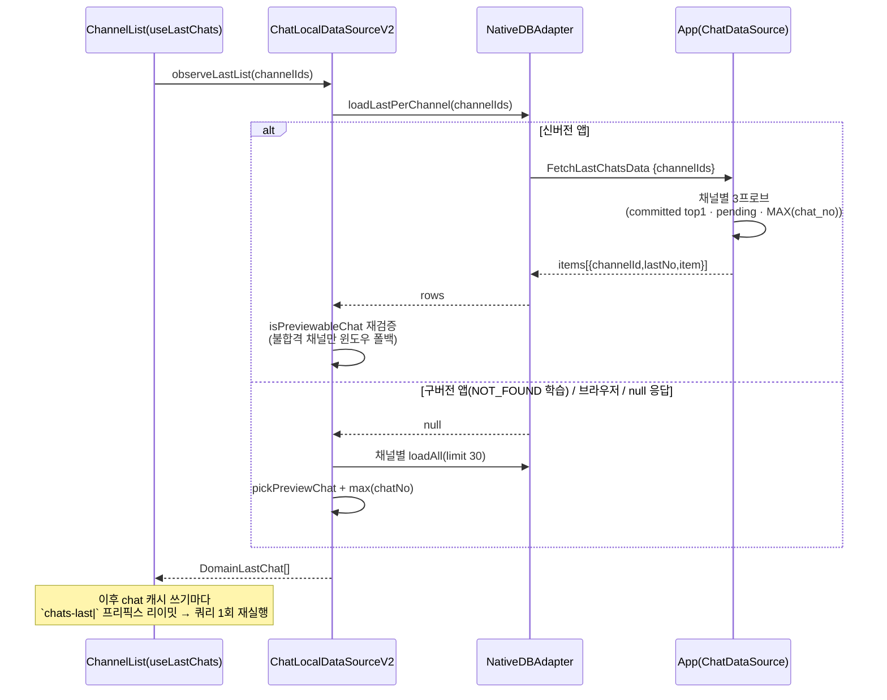

# 홈 마지막 메시지 프리뷰 (FetchLastChatsData)

> 상태: Live · 최종 갱신: 2026-08-14 · 관련 ADR: [ADR-0057](../../adr/0057-home-last-chat-preview-single-query.md)

## 목적

홈 `ChannelList`의 각 행이 보여주는 "마지막 메시지 한 줄"을, 채널별 30행 윈도우 구독(N×브릿지 왕복) 대신 **채널 목록 전체에 대한 브릿지 왕복 1회**로 공급한다. 프리뷰 판정(리액션/답글/시스템/실패 제외, 톰스톤 포함, pending 최신)을 저장소 쿼리로 내려 "최신 1건"이 성립하게 만든다.

## 설계 원칙

- **웹이 앱보다 먼저 배포된다.** 브릿지에 닿는 확장은 구버전 앱 안에서 실행되는 새 웹을 전제한다: 새 기능은 새 메시지 타입으로(옵션 얹기 금지 — 구버전이 조용히 오답), 미지원은 `NOT_FOUND` 1회로 학습, 폴백은 "오늘의 동작"을 보존한다.
- **프리뷰 의미론의 최종 소유자는 웹이다.** 앱의 SQL 판정은 성능 최적화일 뿐이며, 웹은 응답 행을 자신의 `isPreviewableChat`으로 재검증하고 불합격 채널만 윈도우 폴백한다. 의미론이 진화해도 구버전 앱이 정답을 막지 못한다.
- **head-트리거는 손에 든 결과와만 비교한다.** 비동기 초기화를 기다리는 가드(ref가 채워지기 전 발사)를 만들지 않는다.

## 범위

- 포함: 브릿지 메시지 `FetchLastChatsData`/`OnFetchLastChatsData`, 네이티브 SQL 프로브, `@chatic/data`의 `cacheReadLastList`/`observeLastList` + 폴백, 프리뷰 유틸의 `@chatic/data` 이동(웹 재수출), 홈 `useLastChats` 훅과 `ChannelList` 배선.
- 제외: `PlaceChannelManagePage`의 행별 `useLastChat`(후속 과제), sync 타깃 unregister 유예(P0-2), 옵저버 그룹 유예 캐시(P0-3), `useChannel` 캐시 시드(P1-2), IndexedDB 어댑터의 네이티브 동등 구현(폴백이 정답).

## 시나리오

1. **홈 진입(신버전 앱)**: `ChannelList`가 `useLastChats(channels)`를 마운트 → `chat.observeLastList(channelIds)` → 옵저버 첫 쿼리가 `FetchLastChatsData` 1회 발사 → 채널별 `{channelId, lastNo, item}` 수신 → 각 행에 프리뷰/시간 렌더.
2. **전송 직후 이탈 → 홈**: 방에서 보낸 메시지의 낙관적 행(`chatNo 0, isPending`)이 아직 ack 전이어도 pending 프로브가 그 행을 답하므로 홈 프리뷰에 즉시 보인다. ack가 오면 chat 캐시 쓰기 → `chats-last` 리이밋 → 결합 쿼리 재실행 → 커밋 행으로 교체.
3. **홈 체류 중 새 메시지**: 최근 메시지의 캐시 적재는 이 화면 밖에서 별도로 관리된다(네이티브 백그라운드 적재). 그 쓰기가 `chats-last` 리이밋으로 결합 관측을 깨우고 목록이 새 프리뷰를 그린다 — 목록 자체는 네트워크를 만들지 않는다.
4. **구버전 앱**: 첫 `FetchLastChatsData`가 `NOT_FOUND` → 모듈 플래그 학습 → 이후 채널별 30행 윈도우 읽기 + `pickPreviewChat`(오늘의 동작). 브라우저(IndexedDB)는 항상 이 경로다.
5. **네이티브 일시 오류**: `items: null` 응답 → 그 읽기 1회만 윈도우 폴백(학습하지 않음).

## 다이어그램

## 상세 구현

- **프로토콜** — [`libs/app-messages/src/types/model/cache.ts`](../../../libs/app-messages/src/types/model/cache.ts): `FetchLastChatsDataPayload`(chat 전용, `channelIds[]`), `LastChatItem { channelId; lastNo; item }`, `OnFetchLastChatsDataPayload`. 레지스트리 3곳(`web-message.ts`, `app-message.ts`, `WEB_MESSAGE_RESPONSE_TYPE`) 등록 — 핸드셰이크의 `supportedWebMessages`는 이 맵에서 파생되므로 추가 작업 없음.
- **네이티브** — [`ChatDataSource.fetchLastPerChannel`](../../../apps/mobile/src/app/data/cache/ChatDataSource.ts): 채널당 3프로브(모두 `idx_chats_cid_uid_channel_chatno` 인덱스 워크, 조기 종료): ① 커밋 top-1(`chat_no > 0` + `json_extract` 프리뷰 판정, DESC LIMIT 1) ② pending 후보(`chat_no = 0`, 실패 제외 — createdAt 최댓값을 JS에서 택1) ③ `MAX(chat_no)`. pending이 있으면 pending이 답(compareByChatNo 의미론). [`CacheCrudService.fetchLastChats`](../../../apps/mobile/src/app/services/cache/CacheCrudService.ts) → [`useCrudCacheHandler`](../../../apps/mobile/src/app/webview/hooks/useCrudCacheHandler.ts) → [`useWebMessageRouter`](../../../apps/mobile/src/app/webview/hooks/useWebMessageRouter.ts) 등록. 오류는 `items: null`(형제 핸들러 관례).
- **어댑터** — [`NativeDBAdapter.loadLastPerChannel`](../../../libs/data/src/data/local/storages/NativeDBAdapter.ts): chat 타입 전용. `NOT_FOUND` → 모듈 플래그 `lastChatsUnsupported` 학습(테스트 seam 포함, `batchReadUnsupported` 전례) 후 `null`. 그 외 오류는 throw하지 않고 `null`(호출측 1회 폴백). IndexedDB/기반 클래스는 미구현(=`null`).
- **데이터소스** — [`ChatLocalDataSourceV2`](../../../libs/data/src/data/local/data-sources-v2/ChatLocalDataSourceV2.ts): `cacheReadLastList(channelIds)` = 스토리지 fast-path + 재검증 + 채널별 윈도우 폴백(`loadAll limit 30` + `pickPreviewChat`), `observeLastList(channelIds, cb)` = 키 `chats-last|channels:<sorted ids>`. 모든 chat 쓰기의 `getAffectedListPrefixes`에 `${scope}|chats-last|` 프리픽스를 추가해 리이밋.
- **도메인 유틸** — [`libs/data/src/data/domain/chatPreview.ts`](../../../libs/data/src/data/domain/chatPreview.ts): `compareByChatNo`/`isNotifiableChat`/`isFeedVisible`/`isPreviewableChat`/`pickPreviewChat` (기존 `apps/web/src/app/utils/chat.ts`에서 이동, 웹은 재수출). `DomainLastChat { channelId; lastNo; chat }` 도메인 타입.
- **리포지토리** — [`ChatRepositoryV2`](../../../libs/data/src/data/repositories-v2/ChatRepositoryV2.ts): `observeLastList`/`cacheReadLastList` 컨텍스트 패스스루.
- **웹 훅** — [`useLastChats`](../../../apps/web/src/app/hooks/useLastChats.ts): **순수 캐시 관측**(Map 상태) — 네트워크를 만들지 않는다. [`ChannelList`](../../../apps/web/src/app/features/home/components/ChannelList.tsx): 리스트 레벨 훅 1회 호출, `ChannelItem`은 `lastChat` prop 수신(행별 `useLastChat`/`useChatSync` 제거, `useChannelSync`는 유지).
- **신선도 경계** — 최근 메시지의 캐시 적재는 이 트랙의 범위 밖이며 별도로 관리된다(네이티브 백그라운드 적재). 목록 계층은 캐시가 말하는 것만 비추고, 리이밋으로 갱신을 받는다.

## 검증 방법

- `libs/data`: `chatPreview.test.ts`(판정·정렬), `ChatLocalDataSourceV2.test.ts`(fast-path/재검증/폴백/리이밋 라우팅), `NativeDBAdapter.test.ts`(메시지 모양·NOT_FOUND 학습·오류 null) — `yarn nx test data`.
- `apps/mobile`: `ChatDataSource.test.ts`(프로브 SQL·pending 우선·오류 격리), `CacheCrudService.test.ts`(라우팅) — `yarn nx test mobile`.
- `apps/web`: `useLastChats.test.ts`(관측·순수성 — refreshList 미호출 계약), `ChannelList.test.tsx`(prop 경로) — `yarn nx test web`.
- 수동(네이티브): 홈 진입 시 브릿지 로그에서 `FetchLastChatsData` 1회 확인, `getNativeCacheMetrics()`에 `loadLast:chat`이 잡히고 `loadAll:chat` count가 홈 진입당 2N에서 0으로 내려가는지.
- 수동(브라우저 폴백): 게스트 부팅 → Self Chat 전송 → 즉시 홈 복귀 → 행에 방금 메시지의 프리뷰·시간 표시 (2026-08-14 확인).

## 남은 것 / 알려진 한계

- **구버전 앱에서는 성능 개선이 없다** — 폴백이 오늘의 비용을 유지하며, 효과는 `FetchLastChatsData`를 아는 앱 빌드 배포 후 발생한다. 단 폴백 재실행은 [ADR-0059](../../adr/0059-residual-intermittent-paths.md)의 dirty 축소로 "쓰기가 건드린 채널만" 다시 읽는다 — 쓰기 버스트가 N채널 전량 재읽기로 증폭되지 않는다.
- `chats-last|` 전역 프리픽스는 chat 쓰기마다 결합 쿼리를 깨운다(50ms 플러시로 병합). 옵저버가 목록 화면 마운트 중에만 존재하고, 화면 이탈 뒤에는 유예 무효화(ADR-0058)가 쓰기 첫 건에서 그룹을 버리므로 잔여 비용이 없다.
- 폭주의 나머지 절반이었던 sync 타깃 즉시 폴링/스냅샷 소실, 옵저버 그룹 즉시 파기, `useChannel` 10초 타이머는 [ADR-0058](../../adr/0058-navigation-churn-grace-and-seeding.md)(유예 해제·유예 보존·채널 시드)로 닫혔다. `PlaceChannelManagePage`도 `useLastChats`로 전환되어 행별 `useLastChat`은 폐지되었다.
