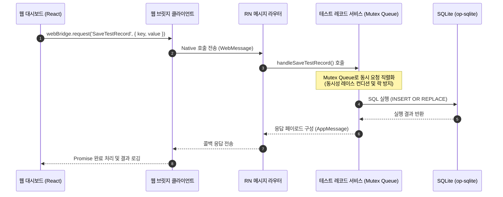

# [기술 스펙 명세서] 하이브리드 웹-앱 DB 통신 검증 대시보드 구현

본 문서는 웹과 앱(네이티브 SQLite) 간의 통신 시나리오를 검증하고, 브릿지 임계 성능 및 동시성 정밀성을 측정하기 위한 검증 시스템의 기술 스펙 명세서입니다.

---

## 1. 개요 (Overview)

본 프로젝트는 웹 뷰와 네이티브 레이어가 브릿지(Bridge)로 연결된 하이브리드 앱 환경에서 동작합니다. 웹 앱과 모바일 앱 간의 데이터 교환 신뢰성 및 데이터베이스 통신 성능을 평가하기 위해, 테스트 전용 SQLite 스키마와 서비스 레이어를 신규 구축하고 이를 검증할 수 있는 인터랙티브한 웹 대시보드를 구현합니다.

### 주요 검증 목표

1. **대량 데이터 성능**: 대량 데이터의 읽기(Fetch) 및 쓰기(Save/Update) 속도 측정.
2. **동시성 정합성**: 다수의 동시 쓰기 요청 상황에서 데이터 유실 없이 최종 상태(최신 데이터)가 안전하게 보장되는지 확인.
3. **브릿지 스트레스 테스트**: 브릿지 채널로 급격한 요청이 유입될 때의 반응성, 에러율, 성공률 측정 및 네이티브 프로세스 안정성 확인.

---

## 2. 아키텍처 및 통신 흐름 (Architecture Flow)

웹 대시보드에서 전송되는 모든 요청은 공통 브릿지 모듈을 거쳐 네이티브(React Native) 앱 스레드로 위임되며, 직렬화 처리 큐를 통해 데이터베이스에 순차적으로 반영됩니다.



---

## 3. SQLite 테스트 전용 스키마 설계

웹-앱 DB 독립성을 유지하고 성능 왜곡을 막기 위해, 운영 데이터(채널, 채팅 등)와 격리된 테스트 전용 키-값(KV) 스키마 테이블을 추가합니다.

- **테이블 명칭**: `test_records`
- **물리 테이블 스펙**:
    ```sql
    CREATE TABLE IF NOT EXISTS test_records (
        key TEXT PRIMARY KEY,
        value TEXT,
        updated_at INTEGER
    );
    ```

### 스키마 반영 계획

- **대상 파일**: `apps/mobile/src/app/database/sqlite/schema.ts` 및 `tables.ts`
- **반영 방법**: `MIGRATIONS` 객체에 새로운 버전 번호를 할당하여 테이블을 추가하는 마이그레이션 스크립트를 작성합니다. 마이그레이션 버전 변경 시 `TARGET_VERSION`은 자동으로 증가하도록 기존 구조를 따릅니다.

---

## 4. 브릿지 메시지 규격 정의 (Message Interface)

웹과 모바일 간의 전송 메시지는 `@chatic/app-messages` 내부에 신규 정의되며, 타입 안전성(Type Safety) 보장을 위한 웹/앱 메시지 맵 구조에 바인딩됩니다.

### A. 웹 -> 앱 요청 메시지 규격 (`libs/app-messages/src/types/web-message.ts`)

```typescript
export interface WebMessagePayloadMap {
    // ... 기존 메시지 규격
    FetchTestRecord: { key: string };
    FetchAllTestRecords: { keys?: string[] };
    SaveTestRecord: { key: string; value: string };
    SaveAllTestRecords: { items: Array<{ key: string; value: string }> };
    ClearTestRecords: never;
}
```

### B. 앱 -> 웹 응답 메시지 규격 (`libs/app-messages/src/types/app-message.ts`)

```typescript
export interface AppMessageDataMap {
    // ... 기존 메시지 규격
    OnFetchTestRecord: { key: string; item: { key: string; value: string; updated_at: number } | null };
    OnFetchAllTestRecords: { items: Array<{ key: string; value: string; updated_at: number }> };
    OnSaveTestRecord: { key: string; success: boolean };
    OnSaveAllTestRecords: { success: boolean; count: number };
    OnClearTestRecords: { success: boolean };
}
```

---

## 5. 네이티브 서비스 및 직렬화 큐 설계

동시 다발적인 데이터 수정 요청 시 데이터 락(Lock)을 방지하고 요청 순서를 완벽히 제어하기 위해, 네이티브 앱 비즈니스 계층에 **순차 실행 큐(Sequential Mutex Queue)**를 적용합니다.

### A. 직렬화 큐 (Mutex Queue) 컨셉

React Native의 자바스크립트 엔진은 싱글 스레드로 작동하지만 브릿지 비동기 태스크는 병렬적으로 유입될 수 있습니다. 이를 동기식으로 일렬 정렬하여 데이터 불일치 및 데드락을 원천 차단합니다.

```typescript
class AsyncMutexQueue {
    private queue: Promise<any> = Promise.resolve();

    public run<T>(task: () => Promise<T>): Promise<T> {
        return new Promise<T>((resolve, reject) => {
            this.queue = this.queue.then(async () => {
                try {
                    const result = await task();
                    resolve(result);
                } catch (error) {
                    reject(error);
                }
            });
        });
    }
}
```

### B. 테스트 레코드 서비스 (`TestRecordService`)

- **역할**: 직렬화 큐(`AsyncMutexQueue`)를 내장하여 데이터 삽입 및 일괄 저장 작업을 감싸서 실행합니다.
- **구성**: `TestRecordDataSource` 인터페이스를 주입받아 SQLite `execute` 및 `executeBatch` 동작을 조율합니다.

---

## 6. 웹 검증 대시보드 설계 및 테스트 시나리오

웹 대시보드(`DebugCacheTestPage.tsx`)는 네이티브 브릿지 통신의 한계를 파악하고 시각적 통계를 확인하기 위해 다음과 같은 고해상도 모듈로 구성됩니다.

### [시나리오 1] 대량 데이터 Fetch & Save/Update 성능 검증

- **검증 내용**: 100건, 500건, 1,000건, 2,000건 단위의 대량 JSON 데이터를 단일/일괄(Bulk) 저장 및 전체 로드할 때의 속도 측정.
- **측정 지표**: 전체 경과 시간(ms), 건당 평균 처리 지연 시간(ms/건), 트랜잭션 성공 여부.
- **UI 기능**: 대량 데이터 볼륨 선택 칩(Chip), 일괄 생성 버튼, 읽기 버튼, 경과 시간 카운터.

### [시나리오 2] 급격한 업데이트 유입 시 데이터 최신 보장 검증

- **검증 내용**: 동일한 데이터 키(`test-key-concurrency`)에 대해 아주 짧은 순간에 점진적 값(`Value-1`부터 `Value-N`까지)을 동시에 대량으로 보냈을 때, DB가 중간 순서 꼬임 없이 마지막 요청(`Value-N`)으로 최종 기록을 안전하게 수렴하는지 확인.
- **검증 순서**:
    1. 웹 뷰에서 `Value-1` ~ `Value-N` 동시성 쓰기 비동기 배열 생성 (`Promise.all`).
    2. 요청이 끝난 후 즉시 DB에서 단일 조회 쿼리 실행.
    3. 로드된 결과 값이 정확히 `Value-N`인지 검증하여 정합성 충족 판정(Pass/Fail) 출력.
- **측정 지표**: 최종 값 일치 여부, 동시 처리에 걸린 전체 수렴 속도.

### [시나리오 3] 브릿지 한계 스트레스 테스트

- **검증 내용**: 네이티브 브릿지 메시지 버퍼가 드롭되거나 정체되는 임계 속도를 테스트하기 위해 무수히 많은 요청을 일시에 송신.
- **다양한 전송 모드 지원**:
    - **Parallel (병렬 전송)**: `Promise.all`을 이용해 설정된 개수의 브릿지 요청을 동시에 송신하여 브릿지 레이어의 극단적 멀티태스킹 한계를 검증.
    - **Chunked (청크 전송)**: 요청을 일정 그룹(예: 50건씩) 단위로 쪼개어 배치 순차 처리하며 레이턴시 최적화 지점 분석.
    - **Sequential (순차 전송)**: 이전 요청이 완전히 완료된 후 다음 요청을 송수신하여 순수 네트워크 오버헤드 측정.
- **측정 지표**: 총 전송 시간, 전송 성공율(%), 에러 수, 평균 레이턴시 차트.

---

## 7. 대시보드 UI/UX 디자인 시스템 제안 (Aesthetics)

현대적인 다크 모드 기반의 프리미엄 글래스모피즘 스타일을 적용하여 시각적 직관성을 향상시킵니다.

- **Harmonious Palettes**: 딥 차콜 백그라운드에 메인 포인트 칼라(Neon Emerald 또는 Vibrant Indigo)를 매칭하여 눈의 피로를 덜고 프로페셔널한 분석 도구 느낌을 연출합니다.
- **실시간 통계 위젯**: 총 실행 시간, 평균 처리 속도, 동시성 정합성 합격률(Pass Rate)을 고대비 디지털 서체로 표시합니다.
- **결과 스트리밍 로그 콘솔**: 통신 결과를 실시간 터미널 스타일로 스트리밍하며, 성공은 그린 라벨, 오류는 레드 라벨로 강조하여 즉각적인 분석을 돕습니다.
