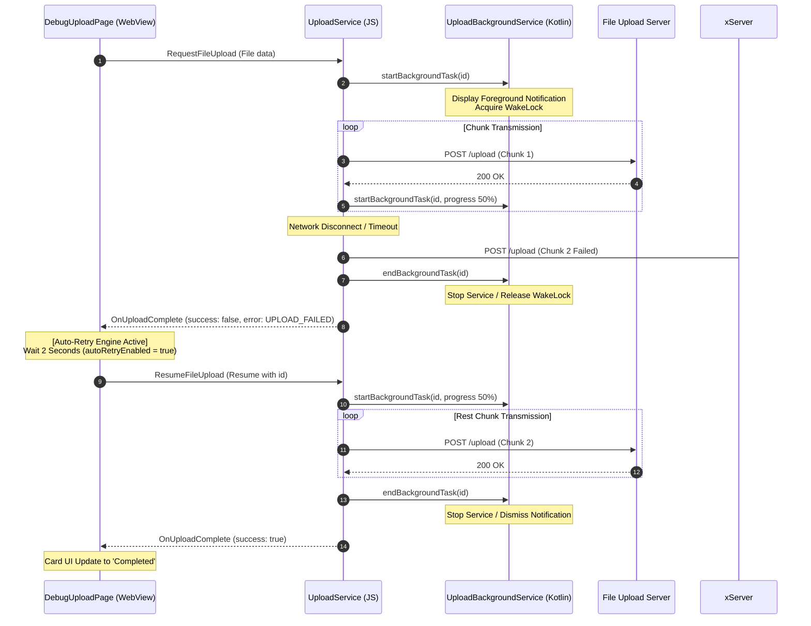

# RN 하이브리드 환경 대용량 파일 청크 전송 모듈 구현 사양서 (일시정지 & 재개 & 취소 콜백 & 백그라운드 수명 & 에러 자동 복구)

본 문서는 React Native 하이브리드 웹앱 환경에서 대용량 파일 및 이미지를 안정적으로 백그라운드에서 전송하고, **일시정지(Pause), 재개(Resume - 이어받기), 취소 완료 피드백(Cancel Callback)**, 그리고 **업로드 실패 항목의 자동 복구 및 상태 재동기화** 기능을 지원하기 위한 브릿지 통신 프로토콜, 모바일 네이티브 업로드 모듈, **모바일 내부 독립 테스트 스크린(`UploadTestScreen.tsx`)**, 그리고 **웹 마이페이지 디버그 전용 페이지(`DebugUploadPage.tsx`)** 구현 사양을 정의합니다.

---

## 1. 웹-앱 브릿지 통신 메시지 정의

웹과 앱 간의 일시정지, 재개, 취소 피드백, 그리고 백그라운드 앱 수명 동기화를 포함한 완벽한 흐름 제어를 위해 통신 규격을 아래와 같이 구성합니다.

### 1.1. 데이터 타입 정의 (`device.ts`)

기기 내부 및 통신 페이로드를 처리할 데이터 규격입니다.

```typescript
// --- File Upload Interfaces ---

/** [요청] 파일 업로드 요청 페이로드 */
export interface RequestFileUploadPayload {
    uploadId: string; // 업로드 고유 식별자 (Web에서 UUID 생성하여 네이티브에 제어권 전달)
    fileUri: string; // 기기 내부 임시 파일 URI (DocumentPicker/ImagePicker 획득 주소)
    fileName: string; // 파일 이름
    fileSize: number; // 파일 전체 크기 (bytes)
    mimeType: string; // 파일 MIME 타입
    uploadUrl: string; // 업로드 대상 API 엔드포인트 URL
    chunkSize?: number; // 분할 전송 청크 크기 (기본값: 1MB = 1,048,576 bytes)
    headers?: Record<string, string>; // 인증 토큰 등 커스텀 헤더
}

/** [요청] 파일 업로드 일시정지 페이로드 */
export interface PauseFileUploadPayload {
    uploadId: string;
}

/** [요청] 파일 업로드 재개 페이로드 */
export interface ResumeFileUploadPayload {
    uploadId: string;
}

/** [요청] 파일 업로드 취소 페이로드 */
export interface CancelFileUploadPayload {
    uploadId: string;
}

/** [응답 - 이벤트] 파일 업로드 진행 상황 페이로드 */
export interface OnUploadProgressPayload {
    uploadId: string;
    progress: number; // 0 ~ 1 사이의 소수 (진행 비율)
    uploadedBytes: number; // 업로드 완료된 누적 바이트
    totalBytes: number; // 전체 파일 바이트 크기
    status: 'uploading' | 'paused' | 'cancelled' | 'completed' | 'failed';
}

/** [응답 - 이벤트] 파일 업로드 완료 페이로드 */
export interface OnUploadCompletePayload {
    uploadId: string;
    success: boolean;
    response?: string; // 업로드 성공 시 서버 응답 텍스트
    error?: {
        code: string;
        message: string;
    };
}

/** [응답 - 이벤트] 네이티브 백그라운드/포그라운드 상태 변경 페이로드 */
export interface OnBackgroundStatusChangedPayload {
    status: 'active' | 'background' | 'inactive';
    isForeground: boolean;
    isBackground: boolean;
}
```

### 1.2. 웹 메시지 매핑 (`web-message.ts`)

웹뷰에서 앱으로 전송 요청을 처리할 웹 메시지 타입입니다.

- `RequestFileUpload`: `RequestFileUploadPayload`
- `PauseFileUpload`: `PauseFileUploadPayload`
- `ResumeFileUpload`: `ResumeFileUploadPayload`
- `CancelFileUpload`: `CancelFileUploadPayload`
- `FetchBackgroundStatus`: 웹뷰에서 현재 네이티브의 상태를 명시적으로 조회하기 위한 메시지.

### 1.3. 앱 메시지 매핑 (`app-message.ts`)

앱에서 웹뷰로 비동기 업로드 상태 및 기기 이벤트를 푸시할 메시지 타입입니다.

- `OnUploadProgress`: `OnUploadProgressPayload`
- `OnUploadComplete`: `OnUploadCompletePayload`
- `OnBackgroundStatusChanged`: `OnBackgroundStatusChangedPayload`

---

## 2. 모바일 앱(React Native) 전송 모듈 및 네이티브 브릿지 구현

의존성 충돌을 유발하는 기존 `react-native-fs` 라이브러리를 완전히 제거하고, 파일 읽기 및 청크 슬라이싱 작업을 직접 수행하는 커스텀 **`FileManager` 네이티브 모듈 브릿지**를 구현하여 안정성을 극대화합니다.

### 2.1. 네이티브 브릿지 (`FileManager` Bridge) 정의

물리 파일에 접근하기 위해 안드로이드 및 iOS 각각에서 원시 API로 작성된 모듈입니다. `file://` 경로 정제, 디코딩 및 한글 자소 보정을 기기단에서 자동으로 처리합니다.

- **인터페이스 정의 (`FileManagerBridge.ts`)**

```typescript
export interface IFileManagerBridge {
    DocumentDirectoryPath: string; // 로컬 다큐먼트 경로 상수
    exists(path: string): Promise<boolean>;
    readChunk(path: string, length: number, offset: number): Promise<string>; // 청크 슬라이스 Base64 읽기
    readFile(path: string): Promise<string>; // 전체 파일 Base64 읽기
    unlink(path: string): Promise<boolean>; // 파일 삭제
    startBackgroundTask(uploadId: string, fileName: string, progress: number): Promise<void>; // 백그라운드 락/포그라운드 서비스 기동
    endBackgroundTask(uploadId: string): Promise<void>; // 백그라운드 자원 해제
}
```

- **안드로이드 구현 (`FileManagerModule.kt`)**
    - `ContentResolver`를 장착하여 일반 파일 경로뿐만 아니라 `content://` URI 형태의 경로도 안정적으로 읽어들입니다.
    - 대용량 파일 청크 추출 시 `RandomAccessFile` 및 스트림 스킵(`InputStream.skip`) 기법을 통해 메모리 부하를 줄입니다.
- **iOS 구현 (`FileManager.m`)**
    - `NSFileHandle` 및 `seekToFileOffset`을 활용하여 파일의 지정된 오프셋 위치에서 정확한 바이트 크기만큼의 청크 데이터를 Base64로 추출합니다.
    - URL 스펙 파싱 오류를 사전에 해결하고자 원시 `file://` 문자열 치환과 퍼센트 디코딩을 거치며, 자소분리 현상 해결을 위해 **NFD ➡️ NFC precomposed 변환(`precomposedStringWithCanonicalMapping`)**을 탑재했습니다.

### 2.2. 인터페이스 정의 (`IUploadService.ts`)

```typescript
import type { RequestFileUploadPayload, OnUploadProgressPayload, OnUploadCompletePayload } from '@chatic/app-messages';

export interface IUploadService {
    uploadFile(
        payload: RequestFileUploadPayload,
        onProgress: (progress: OnUploadProgressPayload) => void,
        onComplete: (complete: OnUploadCompletePayload) => void,
        onCancel: (uploadId: string) => void
    ): Promise<void>;

    pauseUpload(uploadId: string): void;
    resumeUpload(uploadId: string): void;
    cancelUpload(uploadId: string): void;
}
```

### 2.3. 전송 모듈 상세 로직 (`UploadService.ts`)

- 내부 상태 매핑(`Map<string, UploadTaskState>`)을 통해 업로드 ID별 `lastUploadedChunkIndex` 및 `AbortController`를 관리합니다.
- `FileManagerBridge.exists` 및 `FileManagerBridge.readChunk`를 호출하여 기기 독립적인 오프셋 읽기를 수행합니다.
- `pauseUpload` 호출 시, 진행 상태를 `paused`로 업데이트하고 `AbortController`를 작동시켜 현재 전송 중인 네트워크 요청을 즉각 정지하되, 지금까지 보낸 누적 청크 인덱스 정보는 보존합니다.
- `resumeUpload` 호출 시, 저장된 인덱스의 다음 지점부터 네이티브 청크를 슬라이스 해 읽어 순차 업로드를 안전하게 이어갑니다 (이어받기).
- `cancelUpload` 호출 시, `AbortController`를 작동시켜 네트워크 요청을 즉각 정지하고 상태를 `cancelled`로 변경한 뒤 `onCancel` 콜백을 최종 호출해 안전하게 리소스를 회수 및 정리합니다.

### 2.4. 백그라운드 구동 요건 및 플랫폼 네이티브 서비스

기기가 슬립 모드에 들어가거나 홈 화면으로 나가더라도 중단 없이 업로드를 유지하기 위해 아래의 백그라운드 수명 제어 구동 아키텍처를 구현해야 합니다.

1. **Android Foreground Service (`UploadBackgroundService.kt`)**:
    - `FOREGROUND_SERVICE`, `FOREGROUND_SERVICE_DATA_SYNC`, `WAKE_LOCK` 권한을 설정에 등록합니다.
    - 서비스 시작 시 `foregroundServiceType="dataSync"` 상태로 실행하고 CPU 유지용 `WakeLock`을 획득합니다.
    - 다중 파일이 동시에 백그라운드로 업로드될 때 상태를 실시간 집계하는 `HashMap` 맵을 구성하고 알림창에 요약 진행률(`파일명(진행률%)` 또는 `N개 파일 업로드 중... (평균 진행률%)`)을 실시간 갱신합니다.
    - 업로드 중인 전체 작업들이 완료, 일시정지, 취소, 실패 등 모든 경로를 통해 비워지게 되면, 자동으로 `stopSelf()`를 트리거하고 알림창 및 `WakeLock` 자원을 안전하게 반환합니다.
2. **iOS Background Task API (`FileManager.m`)**:
    - `_backgroundTasks` 딕셔너리를 구성하여 각 `uploadId`와 매칭되는 `UIBackgroundTaskIdentifier`를 관리합니다.
    - 업로드 루프 시작 시 `beginBackgroundTaskWithName:expirationHandler:`를 호출하여 JS 스레드가 동결되지 않는 백그라운드 실행 유예 기간을 획득합니다.
    - 업로드 완료 또는 해제 통지를 받으면 즉시 `endBackgroundTask:`를 통해 OS에 자원을 깔끔하게 반환하여 프로세스 동결 방지 장치를 구성합니다.

---

## 3. 웹뷰 브릿지 및 핸들러 등록

웹뷰의 메시지 라우터에 `Upload` 전용 메시지 제어 흐름을 추가하고 전용 테스트 스크린을 독립 신설하며, 브릿지 통신의 신뢰성 저하 문제를 완전하게 해결해야 합니다.

### 3.1. 업로드 브릿지 핸들러 (`useUploadHandler.ts`)

- 웹에서 수신한 메시지(`RequestFileUpload` 등)를 가로채어 `uploadService`를 트리거합니다.
- `onProgress`, `onComplete`, `onCancel` 콜백 내부에서 `bridge.pushEvent`를 사용해 웹뷰로 상태 이벤트를 실시간 전송합니다.

### 3.2. 전용 독립 테스트 화면 (`UploadTestScreen.tsx`)

- `apps/mobile/src/app/features/debug/screens/UploadTestScreen.tsx` 신설.
- **다중 선택 및 병렬 동시 전송 지원**:
    - 도큐먼트 픽커 다중 선택(`allowMultiSelection: true`) 설정을 활성화하여 여러 파일을 동시에 선택하고 `Staged Files` 목록에 대기시킵니다.
    - `Start Upload for All` 버튼 작동 시 `forEach`를 실행하여 고속 병렬로 개별 모바일 업로드를 진행시킵니다.
    - 개별 업로드 태스크마다 실시간 프로그레스 바 및 누적 전송 바이트 수치를 독립 가시화하며, 각 태스크별 [Pause] / [Resume] / [Cancel] 단독 액션 버튼을 지원합니다.
    - 컴파일 안전성 확보를 위해 Nullable picker 필드에 널-병합 연산자(`??`) 처리를 거쳐 TypeScript `TS2322`/`TS18047` 에러를 모두 예방했습니다.
    - 하단의 네이티브 실시간 로그 창은 접이식 UX 요소(`isLogsExpanded`, `▲`/`▼` 인디케이터)를 적용하여 화면 공간 효율을 끌어올렸습니다.

### 3.3. 웹뷰 브릿지 패킷 분류 필터 개선 (`WebBridgeClient.ts`)

- **이벤트 분류 및 수신 보장 장치 요건**:
    - 기존에는 웹뷰 브릿지 수신기(`WebBridgeClient.ts`)가 수신된 메시지에 `success` 필드와 `refId` 필드가 모두 존재할 경우, 이를 단방향 푸시 이벤트가 아닌 **동기 응답(Response)**으로만 판정하여 진행 상황 통지 이벤트(`OnUploadProgress`, `OnUploadComplete`)가 무시되는 중대한 버그가 있었습니다.
    - 수신된 메시지의 `refId`가 웹뷰에서 실제 비동기식 request를 요청해 응답 대기 상태에 등록되어 있는 맵(`this.pendingRequests.has(message.refId)`)에 들어있을 때에만 **응답**으로 분기 판정하고, 대기열 맵에 없으면 즉각 **푸시 이벤트(Event)** 리스너를 실행하도록 라우팅 알고리즘을 견고하게 보완해야 합니다.

---

## 4. 웹 UI (Web App) 마이페이지 디버그 화면 구현

웹 측의 마이페이지 디버그 화면 메뉴에 전송 테스트용 하위 전용 페이지를 신설하고, 전송 에러 상태 복구 및 기기 상태 복원 제어를 처리해야 합니다.

### 4.1. 디버그 전용 전송 페이지 (`DebugUploadPage.tsx`)

- `apps/web/src/app/features/mypage/pages/DebugUploadPage.tsx` 신설.
- '기기 파일 선택' -> `webBridge`를 이용해 RN 기기로부터 파일을 로드받아, 청크 전송 요청, 일시정지, 재개, 취소를 자유롭게 트리거하고 취소 완료 이벤트를 피드백받는 모니터 및 배지 시스템 탑재.
- 마이페이지 라우트 및 `DebugPage.tsx` 메인 메뉴에 추가 연결.

### 4.2. 업로드 실패 복구 및 에러 복원 엔진 상세 사양

네트워크 불안정 또는 앱 백그라운드 유지 제한 등으로 인해 업로드가 끊어졌을 때 복구를 지원하기 위한 자동화 제어 엔진을 구현해야 합니다.

1. **자동 재시도 메커니즘 (Auto-Retry)**:
    - 전송 도중 에러(`failed` 상태 수신) 발생 시, 설정 영역의 "실패 시 자동 재시도 (최대 3회)" 스위치 활성화 상태를 검사합니다.
    - 옵션이 켜져 있는 경우 즉시 2초의 회복 대기 지연(Timeout)을 등록하고 재시도를 시도합니다.
    - **재시도 횟수 통제**: 태스크당 `retryCount` 속성을 주입하고 실패 횟수를 누적 체크하여 최대 3회 초과 시 에러를 확정 기록하고 정지합니다. UI에는 "자동 재시도 N회차" 정보를 배지로 노출합니다.
    - **뮤텍스 중복 방지 (`activeAutoRetriesRef`)**: 여러 에러 이벤트가 고속으로 들어와 재시도가 다수 병렬 스케줄링되는 오작동을 근본적으로 막기 위해, `uploadId`를 고유 키로 하는 뮤텍스 타이머 락 객체를 생성해 최초 1회만 예약되도록 방어합니다.
2. **포그라운드 복귀 시 자동 재개 (Foreground Auto-Resume)**:
    - 앱이 홈 화면이나 꺼진 화면에서 다시 켜져 복귀하는 상황(`OnBackgroundStatusChanged` 이벤트 및 `isForeground: true`)을 WebView 단에서 수신합니다.
    - 설정 영역의 "포그라운드 진입 시 자동 재개" 스위치가 켜져 있다면, 즉시 리스트 상의 `paused` 상태인 모든 작업을 `resumeTask` 명령어로 깨우고, `failed` 상태인 모든 작업은 `retryCount = 0`으로 초기화하여 처음부터 재시도(`performRetry`)를 가동시킵니다.
3. **태스크 복합 복원 파이프라인 (`performRetry`)**:
    - `uploadedBytes > 0`인 경우: 네이티브에 전송 인덱스 포인터가 살아있으므로 `resumeTask`를 호출해 중단 위치부터 고속 이어받기 전송을 진행합니다.
    - `uploadedBytes === 0`인 경우: 아예 초기화 단계부터 실패한 케이스이므로 새로 브릿지에 `RequestFileUpload` 전문을 전달해 새 세션을 구축합니다.
4. **일괄 및 수동 관리 컨트롤**:
    - 모니터 영역 상단에 실패 태스크가 1개 이상 존재할 때 활성화되는 **"실패 항목 모두 재시도"** 및 **"실패 항목 모두 삭제"** 버튼을 제공하여 전면 제어를 지원해야 합니다.

---

## 5. 전체 아키텍처 흐름 요약 시퀀스 다이어그램

모바일 기기의 네트워크가 차단되었다가 포그라운드로 재유입되어 자동 복구 및 업로드가 완료될 때까지의 생명주기 다이어그램입니다.


