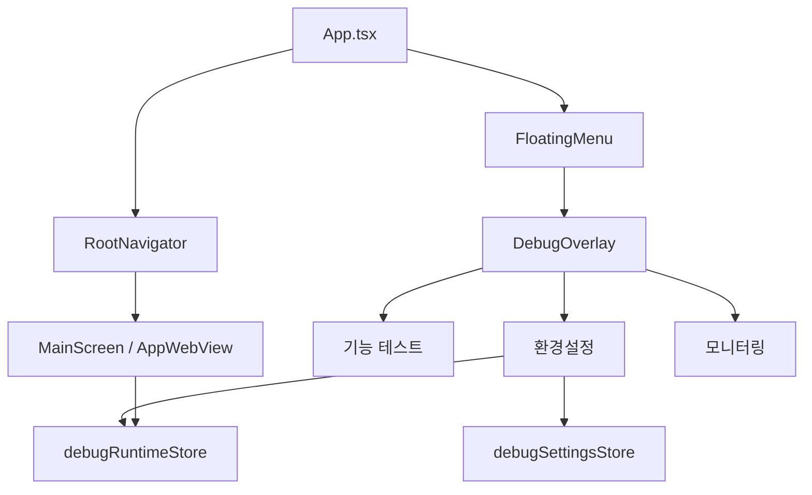

# Mobile Debug Overlay Home SPEC

## 1. 목적

모바일 앱의 디버그 홈을 React Navigation 화면 전환이 아닌 앱 최상단 오버레이로 제공한다.

기존에는 디버그 홈이 루트 네비게이션의 별도 화면으로 이동했기 때문에, 디버그 화면을 열고 복귀하는 과정에서 메인 WebView의 화면 상태와 히스토리가 손실될 수 있었다. 이 스펙은 WebView를 언마운트하지 않고 디버그 기능을 사용할 수 있도록 오버레이 구조, 메뉴 구성, 환경설정, 모니터링 동작을 정의한다.

## 2. 범위

### 포함

- 플로팅 디버그 메뉴에서 디버그 오버레이 진입
- 디버그 오버레이의 기능 테스트, 환경설정, 모니터링 진입점
- 기존 디버그 테스트 화면 재사용
- WebView BASE_URL override 저장 및 명시적 재시작
- WebView/앱 상태 모니터링
- 디버그 오버레이 등장/종료 애니메이션
- 디버그 오버레이 표시 중 플로팅 메뉴 숨김

### 제외

- 목서비스 교체 기능의 실제 구현
- WebView 내부 웹앱 라우팅 구조 변경
- 디버그 테스트 화면별 개별 기능 리팩터링

## 3. 구조



## 4. 주요 컴포넌트

### `FloatingMenu`

위치: `apps/mobile/src/app/features/core/components/FloatingMenu.tsx`

역할:

- 개발/비운영 환경에서 `+` 플로팅 메뉴 제공
- 메뉴 항목은 다음 3개만 제공
    - `기능 테스트`
    - `환경설정`
    - `모니터링`
- `DoU 접속` 항목은 제공하지 않는다.
- 디버그 오버레이가 떠 있는 동안에는 렌더링하지 않는다.

### `DebugOverlay`

위치: `apps/mobile/src/app/features/debug/overlay/DebugOverlay.tsx`

역할:

- 앱 최상단 absolute overlay로 디버그 화면을 표시한다.
- 화면 등장 시 아래에서 위로 올라오는 애니메이션을 실행한다.
- `x` 버튼, Android back, WebView 재시작 후 닫기 동작에서는 아래로 내려가는 종료 애니메이션을 실행한 뒤 overlay를 닫는다.
- `기능 테스트` 진입 후 테스트 화면으로 들어간 경우에만 헤더 뒤로가기 버튼을 표시한다.
- `환경설정`, `모니터링`을 플로팅 메뉴에서 직접 연 경우 헤더 뒤로가기 버튼을 표시하지 않는다.

### `DebugHomeScreen`

위치: `apps/mobile/src/app/features/debug/screens/DebugHomeScreen.tsx`

역할:

- 기능 테스트 목록만 표시한다.
- 기존 디버그 테스트 화면 컴포넌트로 이동하기 위한 local state 기반 메뉴를 제공한다.
- React Navigation에 의존하지 않는다.

### `EnvironmentSettingsScreen`

위치: `apps/mobile/src/app/features/debug/screens/EnvironmentSettingsScreen.tsx`

역할:

- WebView BASE_URL override를 저장한다.
- 기본값은 `Config.VITE_WEBVIEW_BASE_URL`이다.
- override 저장만으로는 현재 WebView를 재시작하지 않는다.
- `적용 후 웹뷰 재시작`을 누를 때만 WebView reload token을 증가시키고 overlay를 닫는다.

### `MonitoringScreen`

위치: `apps/mobile/src/app/features/debug/screens/MonitoringScreen.tsx`

역할:

- 앱 상태 표시
- WebView 상태 표시
    - 현재 URL
    - loading 여부
    - WebAppReady 여부
    - canGoBack / canGoForward
    - 마지막 load start/end URL
    - 마지막 에러
- 로그 버퍼 조회/새로고침/비우기
- 진단 snapshot 복사

## 5. 상태 관리

### `debugSettingsStore`

위치: `apps/mobile/src/app/stores/debugSettingsStore.ts`

persist 대상:

- `webviewBaseUrlOverride`
- 목서비스 관련 placeholder 상태

저장소:

- 기존 `stores/storageAdapter.ts`를 사용한다.
- persist key는 `debugSettings`이다.
- `libs/app-messages/src/types/model/preference.ts`의 `PreferenceKey`에 `debugSettings`를 포함한다.

### `debugRuntimeStore`

위치: `apps/mobile/src/app/stores/debugRuntimeStore.ts`

persist하지 않는 런타임 상태:

- `webViewReloadToken`
- `webView.currentUrl`
- `webView.isLoading`
- `webView.isWebAppReady`
- `webView.canGoBack`
- `webView.canGoForward`
- `webView.lastLoadStartUrl`
- `webView.lastLoadEndUrl`
- `webView.lastError`

## 6. WebView BASE_URL 동작

WebView 기본 URL은 다음 우선순위로 결정한다.

1. `debugSettingsStore.webviewBaseUrlOverride`
2. `Config.VITE_WEBVIEW_BASE_URL`

BASE_URL override 저장은 즉시 WebView를 재시작하지 않는다. 명시적으로 `적용 후 웹뷰 재시작`을 누르면 `debugRuntimeStore.requestWebViewReload()`가 호출되고, `useWebViewDeepLink`는 reload token 변경을 감지해 source를 새 BASE_URL로 재설정한다.

이 정책은 디버그 설정을 저장하는 행위와 WebView 히스토리를 초기화하는 행위를 분리하기 위한 것이다.

## 7. 네비게이션 정책

`DebugNavigator`는 사용하지 않는다.

- `RootNavigator`에는 `Debug` route가 없어야 한다.
- `RootStackParamList`에도 `Debug` route가 없어야 한다.
- 디버그 오버레이 내부 이동은 React Navigation이 아니라 local state로 처리한다.

뒤로가기 정책:

- `기능 테스트` 목록에서 테스트 화면 진입: 뒤로가기 버튼 표시, 누르면 기능 테스트 목록으로 복귀
- `환경설정` 직접 진입: 뒤로가기 버튼 없음, `x` 또는 Android back으로 overlay 닫기
- `모니터링` 직접 진입: 뒤로가기 버튼 없음, `x` 또는 Android back으로 overlay 닫기

## 8. 검증

필수 검증 명령:

```bash
npx tsc -p apps/mobile/tsconfig.app.json --noEmit
npx eslint apps/mobile/src/app/App.tsx apps/mobile/src/app/features/core/components/FloatingMenu.tsx apps/mobile/src/app/features/debug/overlay/DebugOverlay.tsx apps/mobile/src/app/features/debug/screens/EnvironmentSettingsScreen.tsx apps/mobile/src/app/features/debug/screens/MonitoringScreen.tsx apps/mobile/src/app/stores/debugSettingsStore.ts apps/mobile/src/app/stores/debugRuntimeStore.ts
npx jest --config apps/mobile/jest.config.js apps/mobile/src/app/webview/hooks/useWebViewDeepLink.test.ts --runInBand
git diff --check
```

수동 검증:

- WebView에서 페이지 이동 후 `+ > 기능 테스트`를 열고 닫아도 WebView 히스토리가 유지되어야 한다.
- `+ > 환경설정`은 바로 환경설정 화면을 열어야 한다.
- `+ > 모니터링`은 바로 모니터링 화면을 열어야 한다.
- 디버그 화면 표시 중 `+` 플로팅 메뉴가 보이지 않아야 한다.
- overlay는 열릴 때 아래에서 위로 올라와야 한다.
- overlay는 닫힐 때 아래로 내려가야 한다.
- 모니터링 직접 진입 상태에서 뒤로가기가 기능 테스트 목록을 보여주면 안 된다.
