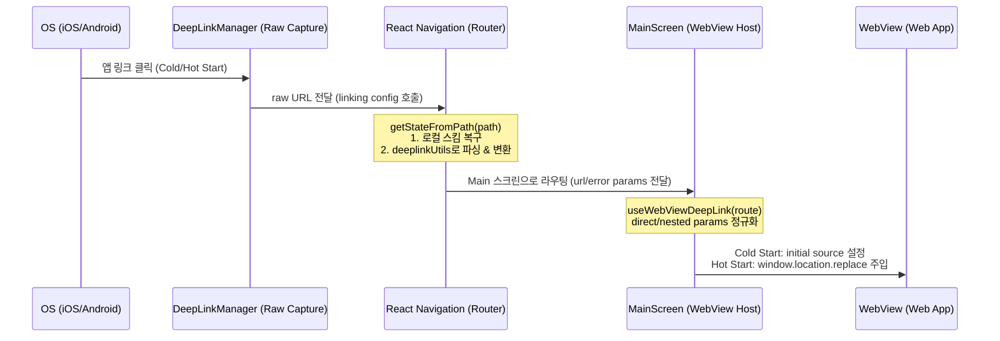
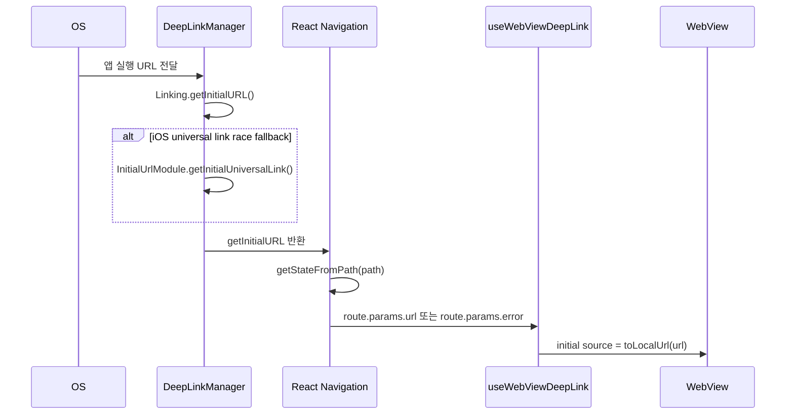
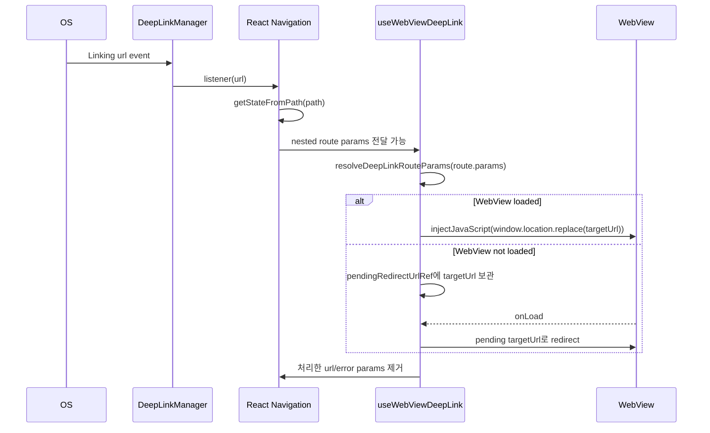

# Deep Link Architecture Refactoring SPEC

이 스펙 문서는 딥링크 모듈 리팩터링 작업에 따른 아키텍처 변경점과 설계 명세를 정의합니다.

---

## 1. 아키텍처 개요 (Overview)

기존의 딥링크 시스템은 지연된 딥링크(Deferred Deep Linking) 및 숏코드 확장을 위해 **Firebase Firestore**와 의존하고 있었으며, React Native 의존성이 포함된 공통 라이브러리(`libs/deeplinks`) 구조로 인해 모노레포 내 빌드 및 타입 참조의 복잡도가 높았습니다.

이번 리팩터링을 통해:

1. **Firestore와 완전 분리**: 서버리스 기반의 신규 쿼리 파라미터형 딥링크 패턴만 지원하고 Firestore 데이터 쓰기/조회 로직을 전면 제거했습니다.
2. **공통 라이브러리 해체 및 내재화**: 빌드 복잡도를 최소화하기 위해 공통 모듈을 해제하고, 앱 전용 유틸리티(`deeplinkUtils.ts`)로 로직을 완전히 내재화했습니다.
3. **React Navigation 통합**: 상태 저장 방식의 Zustand 스토어 방식을 제거하고, React Navigation의 네이티브 `linking` 인프라와 100% 통합했습니다.

---

## 2. 모바일 앱 딥링크 데이터 흐름 (Data Flow)

딥링크 유입부터 웹뷰 내 페이지 로드까지의 기본 흐름은 다음과 같습니다.

---

## 3. 시작 상태별 접속 방식 (Cold Start / Hot Start)

### A. Cold Start

앱 프로세스가 없거나 React Native 런타임이 아직 초기화되지 않은 상태에서 딥링크로 실행되는 케이스입니다.

- URL 수신: `DeepLinkManager.getInitialUrl()`
- 표준 수신 경로: `Linking.getInitialURL()`
- iOS fallback: `InitialUrlModule.getInitialUniversalLink()`
- 라우팅 변환: `getRouteStateFromDeepLinkPath(path)`
- WebView 적용: `useWebViewDeepLink` 초기 `source` 생성 시 `toLocalUrl(url)` 적용
- 파라미터 정리: 초기 source로 이미 처리한 URL은 `navigation.setParams`로 제거하여 재처리를 방지합니다.

### B. Hot Start

앱과 WebView가 이미 떠 있는 상태에서 딥링크 스킴 또는 앱 링크가 추가로 유입되는 케이스입니다.

- URL 수신: `DeepLinkManager.subscribe()`의 `Linking.addEventListener('url')`
- 라우팅 변환: React Navigation `linking.getStateFromPath(path)`
- params 형태:
    - Direct: `route.params.url`
    - Nested navigator: `route.params.params.url`
- WebView 적용:
    - 로드 완료 상태: `webViewRef.current.injectJavaScript`로 `window.location.replace(targetUrl)` 실행
    - 로드 전 상태: `pendingRedirectUrlRef`에 보관 후 `handleWebViewLoad()`에서 실행
- 중복 방지:
    - `_t=Date.now()` nonce를 붙여 동일 경로 재진입도 WebView navigation으로 인식되게 합니다.
    - `handledRouteUrlRef`로 동일 route params 스냅샷 재처리를 방지합니다.

---

## 4. 라우트 유형별 접속 방법

### A. WebView 라우트 (기본)

`target=native`가 없는 대부분의 딥링크는 WebView 라우트로 처리됩니다.

| 입력 유형          | 예시                                        | 변환 결과                                       | 적용 방식                               |
| ------------------ | ------------------------------------------- | ----------------------------------------------- | --------------------------------------- |
| Custom scheme      | `chatic://auth/login?code=123`              | `https://dou.chatic.io/auth/login?code=123`     | Cold: initial source / Hot: JS redirect |
| Dev custom scheme  | `chatic-dev://auth/login?code=123`          | `https://dou-dev.chatic.io/auth/login?code=123` | Cold: initial source / Hot: JS redirect |
| Universal/App link | `https://app.chatic.io/auth/login?code=123` | `https://dou.chatic.io/auth/login?code=123`     | Cold: initial source / Hot: JS redirect |
| Frontend URL       | `https://dou.chatic.io/chats/1`             | `https://dou.chatic.io/chats/1`                 | Cold: initial source / Hot: JS redirect |
| Relative path      | `/auth/login?code=123`                      | `${WEBVIEW_URL}/auth/login?code=123`            | 내부 호출용                             |

### B. 신규 초대 딥링크

신규 초대 딥링크는 `/s` 경로와 `code`, `api` 또는 `backend` 파라미터를 기준으로 로그인 URL로 변환됩니다.

| 입력                                                           | 변환                                                                                                                                                                       |
| -------------------------------------------------------------- | -------------------------------------------------------------------------------------------------------------------------------------------------------------------------- |
| `chatic-dev://s?code=invt:910001:xxx&api=uzjpiaey7a&stage=dev` | `https://dou-dev.chatic.io/auth/login?code=invt%3A910001%3Axxx&provider=invite&version=2&_backend=https%3A%2F%2Fuzjpiaey7a.execute-api.ap-northeast-2.amazonaws.com%2Fdev` |

- `code`: invite login code
- `api` + `stage`: `_backend=https://{api}.execute-api.ap-northeast-2.amazonaws.com/{stage}`로 변환
- `backend`: 명시된 경우 `api/stage` 조합보다 우선합니다.
- 기타 query parameter는 변환된 frontend URL에 전달됩니다.

### C. Native 라우트

`target=native`가 있는 경우 WebView가 아니라 React Native 화면으로 라우팅합니다.

| 입력                                                          | Native route           | 설명                                              |
| ------------------------------------------------------------- | ---------------------- | ------------------------------------------------- |
| `chatic-dev://debug/DeeplinkTest?target=native`               | `Debug > DeeplinkTest` | 디버그 스택 화면 진입                             |
| `chatic-dev://debug/Unknown?target=native`                    | `Debug > Home`         | 알 수 없는 debug screen은 Home으로 fallback       |
| `chatic-dev://main/modal?target=native&url=https://chatic.io` | `Main > Modal`         | Main stack modal 화면 진입                        |
| `chatic-dev://unknown?target=native`                          | `Main > Main`          | 알 수 없는 native route는 MainScreen으로 fallback |

### D. 오류 라우트

유효하지 않은 딥링크 또는 더 이상 지원하지 않는 구형 short URL은 `Main` route의 `error` params로 전달됩니다.

- `useWebViewDeepLink`는 `error`를 감지하면 `DeepLinkErrorView`를 노출합니다.
- 에러 params도 처리 후 제거하여 같은 에러 화면이 반복 표시되지 않게 합니다.

---

## 5. 핵심 설계 명세 (Specification Details)

### A. 의존성 주입 (Dependency Injection)

`DeepLinkManager`와 `DeeplinkService`는 `provider.ts`에서 생성 및 관리되며, 생성자를 통해 의존성이 주입됩니다.

- **`DeepLinkManager`**: 단말 OS 레벨의 `Linking` API 및 iOS Release 빌드에서의 유니버설 링크 딜레이 큐(AppDelegate 버퍼 모듈)를 통합 관리하는 Low-level 캡처 클래스입니다.
- **`DeeplinkService`**: High-level 비즈니스 서비스로, 딥링크 이벤트 전파와 푸시 알림 클릭 등으로 들어온 원시 URL에 대한 표준화 필터링(`handleUrl`)을 대행합니다.

### B. 동기식 URL 변환 (`deeplinkUtils.ts`)

Firestore가 완전히 제거되었으므로, 모든 딥링크의 숏링크 변환 및 파싱은 서버 조회 없이 클라이언트 내부에서 동기식(`convertShortUrlWithEnvsSync`)으로 즉각 이루어집니다.

- **신규 딥링크 패턴**: `chatic://s?code=invt:910001:xxx&api=yyy`
- **변환 대상**: `https://dou.chatic.io/auth/login?code=invt:910001:xxx&provider=invite&version=2`
- **환경 변수**: 쿼리스트링 내 `api` 및 `stage` 파라미터를 조합하여 프론트엔드 환경변수 `_backend` 파라미터를 동적으로 빌드하고 웹뷰에 전달합니다.

### C. 라우터 수준의 상태 동기화 (Router Integration)

- Zustand 스토어(`useDeepLinkStore`)를 완전 폐기하고 React Navigation의 `route.params`를 딥링크 상태의 단일 원천(Single Source of Truth)으로 삼았습니다.
- **Cold Start**: 첫 화면 진입 시 초기 `route.params.url` 값을 기준으로 WebView의 `initialSource`를 설정합니다.
- **Hot Start**: 앱이 실행 중인 상태에서 추가 링크가 유입되면 `route.params` 변경을 `useEffect`가 감지하여 `webViewRef.current.injectJavaScript`를 통해 웹뷰 내 `window.location.replace(targetUrl)` 이동을 처리합니다. 이동 완료 후 파라미터는 `navigation.setParams`로 즉시 초기화되어 루프를 방지합니다.
- **Nested Params 보정**: Root `Main`과 nested `Main` route 이름이 같기 때문에 Hot Start에서는 React Navigation이 `route.params.params.url` 형태로 값을 전달할 수 있습니다. `useWebViewDeepLink`는 direct params와 nested params를 모두 정규화한 뒤 처리합니다.

---

## 6. 검증 규격 (Verification)

- **단위 테스트**: `DeeplinkService.test.ts`를 통해 상대 경로가 커스텀 스킴으로 정상 복구되는지, 지원하지 않는 스크립트 형태의 비정상 스킴이 사전에 거부되는지 자동 테스트합니다.
- **WebView 라우팅 테스트**: `useWebViewDeepLink.test.ts`를 통해 Cold Start initial source, Hot Start JS redirect, WebView 로드 전 pending redirect, nested navigator params 처리를 검증합니다.
- **통합 빌드**: Vite 및 Metro 환경에서 타입 충돌이나 공통 참조 오류 없이 단독 빌드가 완료되어야 합니다.
